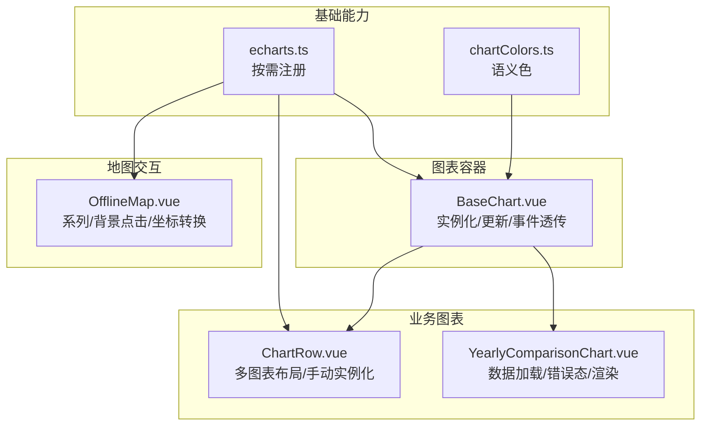
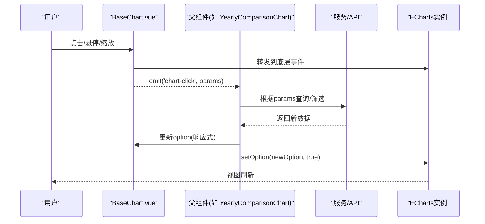
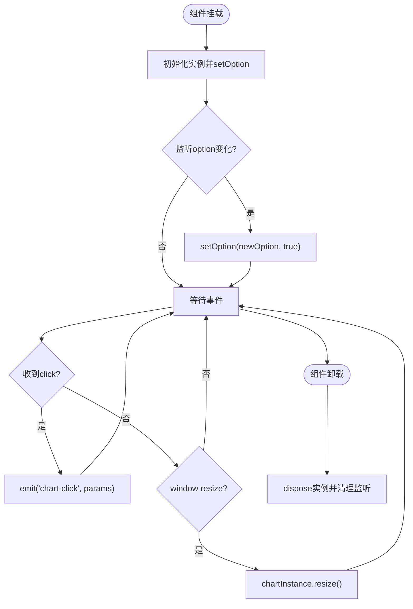
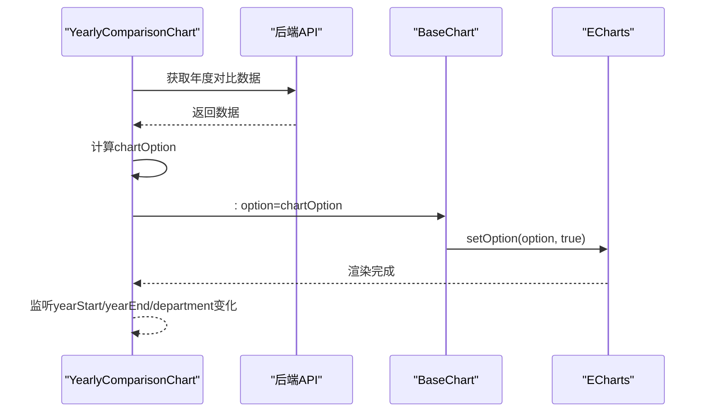
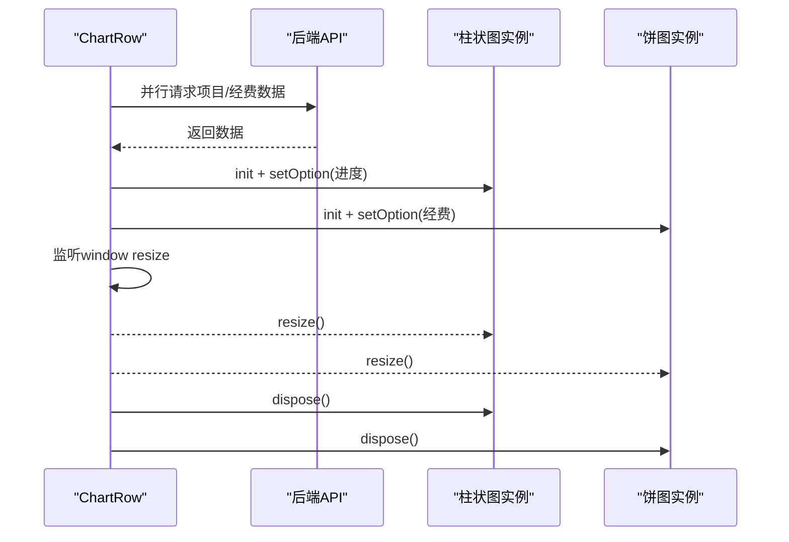
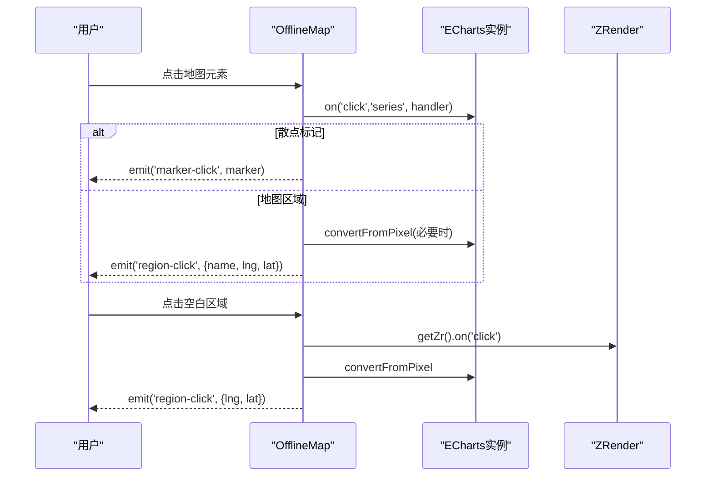
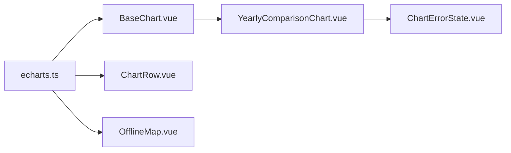

# 图表交互与事件处理

<cite>
**本文引用的文件**
- [BaseChart.vue](file://frontend/src/components/common/BaseChart.vue)
- [echarts.ts](file://frontend/src/utils/echarts.ts)
- [chartColors.ts](file://frontend/src/utils/chartColors.ts)
- [YearlyComparisonChart.vue](file://frontend/src/components/funds/YearlyComparisonChart.vue)
- [ChartErrorState.vue](file://frontend/src/components/common/ChartErrorState.vue)
- [ChartRow.vue](file://frontend/src/views/dashboard/ChartRow.vue)
- [OfflineMap.vue](file://frontend/src/components/map/OfflineMap.vue)
</cite>

## 目录
1. [简介](#简介)
2. [项目结构](#项目结构)
3. [核心组件](#核心组件)
4. [架构总览](#架构总览)
5. [详细组件分析](#详细组件分析)
6. [依赖关系分析](#依赖关系分析)
7. [性能考量](#性能考量)
8. [故障排查指南](#故障排查指南)
9. [结论](#结论)
10. [附录](#附录)

## 简介
本指南聚焦前端图表交互与事件处理，围绕 BaseChart 组件的事件系统（点击、悬停、数据缩放等）、事件参数结构与处理方法、用户交互到业务逻辑的集成方式、响应式更新机制（数据变化监听与视图自动刷新），以及复杂交互场景（图表联动、钻取分析、筛选过滤）的实现模式。文档同时提供完整示例路径与最佳实践，并给出性能优化与内存管理建议。

## 项目结构
本项目在前端采用“基础图表容器 + 业务图表组合”的分层组织：
- 基础图表容器：BaseChart 负责 ECharts 实例生命周期、选项响应式更新、窗口自适应与基础事件透传。
- 业务图表：YearlyComparisonChart 等组合数据加载、错误态、空态与渲染；Dashboard ChartRow 直接操作 ECharts 实例以展示多图表布局。
- 工具与主题：echarts.ts 按需注册图表与组件；chartColors.ts 从 CSS 变量读取语义色，保证主题一致性。
- 地图交互：OfflineMap 演示了更丰富的交互（系列点击、背景点击、坐标转换）。

图示来源
- [echarts.ts:1-37](file://frontend/src/utils/echarts.ts#L1-L37)
- [BaseChart.vue:1-89](file://frontend/src/components/common/BaseChart.vue#L1-L89)
- [YearlyComparisonChart.vue:1-79](file://frontend/src/components/funds/YearlyComparisonChart.vue#L1-L79)
- [ChartRow.vue:1-268](file://frontend/src/views/dashboard/ChartRow.vue#L1-L268)
- [OfflineMap.vue:95-127](file://frontend/src/components/map/OfflineMap.vue#L95-L127)

章节来源
- [echarts.ts:1-37](file://frontend/src/utils/echarts.ts#L1-L37)
- [BaseChart.vue:1-89](file://frontend/src/components/common/BaseChart.vue#L1-L89)
- [YearlyComparisonChart.vue:1-79](file://frontend/src/components/funds/YearlyComparisonChart.vue#L1-L79)
- [ChartRow.vue:1-268](file://frontend/src/views/dashboard/ChartRow.vue#L1-L268)
- [OfflineMap.vue:95-127](file://frontend/src/components/map/OfflineMap.vue#L95-L127)

## 核心组件
- BaseChart 组件
  - 职责：封装 ECharts 实例创建、销毁、响应式 option 更新、窗口 resize、基础 click 事件透传。
  - 关键行为：
    - 挂载后初始化实例并 setOption。
    - 监听 props.option 深变化，调用 setOption(newOption, true) 实现增量更新。
    - 支持 autoResize 开关，默认开启，监听 window resize 调用 resize。
    - 暴露 getChart/resize 方法供父级控制。
    - 统一将底层 click 事件通过 chart-click 抛出，便于上层接入业务逻辑。
  - 适用场景：快速复用、轻量交互、需要统一事件出口的基础图表。

- YearlyComparisonChart 组件
  - 职责：拉取年度对比数据，构建 ECharts 配置，处理加载/错误/空状态。
  - 关键行为：
    - watch 监听 yearStart/yearEnd/department 变化触发重新加载。
    - computed 生成 chartOption，空数据时不渲染图表。
    - 错误态使用 ChartErrorState，支持就地重试。

- ChartRow 页面片段
  - 职责：在同一行内渲染两个独立图表（柱状图、饼图），直接管理 ECharts 实例。
  - 关键行为：
    - 并行请求项目进度与经费概览数据。
    - 构建各自 option，init/setOption，并在卸载时 dispose。
    - 监听 window resize 统一 resize。

- OfflineMap 地图交互
  - 职责：地图系列点击与背景点击，坐标转换，向上传播 marker-click/region-click。
  - 关键行为：
    - series 点击区分 scatter/effectScatter/map，必要时 convertFromPixel 计算经纬度。
    - ZRender 背景点击获取空白区域坐标。

章节来源
- [BaseChart.vue:1-89](file://frontend/src/components/common/BaseChart.vue#L1-L89)
- [YearlyComparisonChart.vue:1-79](file://frontend/src/components/funds/YearlyComparisonChart.vue#L1-L79)
- [ChartRow.vue:1-268](file://frontend/src/views/dashboard/ChartRow.vue#L1-L268)
- [OfflineMap.vue:95-127](file://frontend/src/components/map/OfflineMap.vue#L95-L127)

## 架构总览
下图展示了从用户交互到业务处理的典型链路：用户在 BaseChart 中点击或悬停，组件将事件参数透传给父组件；父组件根据业务需求更新状态或发起请求，再通过响应式 option 驱动图表刷新。

图示来源
- [BaseChart.vue:32-57](file://frontend/src/components/common/BaseChart.vue#L32-L57)
- [YearlyComparisonChart.vue:28-75](file://frontend/src/components/funds/YearlyComparisonChart.vue#L28-L75)

## 详细组件分析

### BaseChart 事件系统与响应式更新
- 事件系统
  - 点击事件：内部监听 click，向上 emit chart-click，携带 ECharts 标准 params（包含 seriesName、dataIndex、value 等）。
  - 悬停事件：可通过在传入 option 中配置 tooltip 实现；如需自定义高亮，可在父组件监听 chart-ready 后绑定 mouseover/mouseout。
  - 数据缩放：通过 DataZoomComponent 启用，父组件可在 chart-ready 后通过 getChart().dispatchAction 控制初始范围或联动。
- 响应式更新
  - 监听 props.option 深变化，调用 setOption(newOption, true)，确保增量合并，避免重绘开销。
- 生命周期与资源管理
  - onMounted 初始化并可选监听 resize。
  - onUnmounted 移除 resize 监听并 dispose 实例，防止内存泄漏。
- 暴露能力
  - getChart()：获取底层实例，用于高级交互（如 dispatchAction、addEventListner）。
  - resize()：主动触发尺寸适配。

图示来源
- [BaseChart.vue:32-76](file://frontend/src/components/common/BaseChart.vue#L32-L76)

章节来源
- [BaseChart.vue:1-89](file://frontend/src/components/common/BaseChart.vue#L1-L89)

### YearlyComparisonChart 数据驱动与错误态
- 数据流
  - watch 监听 yearStart/yearEnd/department，触发异步加载。
  - 兼容多种响应格式，提取数组数据映射为年份与金额。
  - computed 生成 chartOption，空数据时不渲染图表。
- 错误态与重试
  - 使用 ChartErrorState 显示错误信息并提供重试按钮，避免全局 toast。
- 与 BaseChart 集成
  - 将 computed 生成的 option 传入 BaseChart，利用其响应式更新与事件透传。

图示来源
- [YearlyComparisonChart.vue:28-75](file://frontend/src/components/funds/YearlyComparisonChart.vue#L28-L75)
- [BaseChart.vue:49-57](file://frontend/src/components/common/BaseChart.vue#L49-L57)

章节来源
- [YearlyComparisonChart.vue:1-79](file://frontend/src/components/funds/YearlyComparisonChart.vue#L1-L79)
- [ChartErrorState.vue:1-54](file://frontend/src/components/common/ChartErrorState.vue#L1-L54)

### ChartRow 多图表布局与手动实例化
- 职责
  - 并行加载项目进度与经费概览数据。
  - 分别构建 bar/pie 的 option，并直接 init ECharts 实例。
  - 在卸载时 dispose 实例，监听 resize 统一调整。
- 适用场景
  - 需要精细控制多个图表实例、样式与交互的场景。

图示来源
- [ChartRow.vue:49-80](file://frontend/src/views/dashboard/ChartRow.vue#L49-L80)
- [ChartRow.vue:167-203](file://frontend/src/views/dashboard/ChartRow.vue#L167-L203)

章节来源
- [ChartRow.vue:1-268](file://frontend/src/views/dashboard/ChartRow.vue#L1-L268)

### OfflineMap 复杂交互：系列点击与背景点击
- 系列点击
  - scatter/effectScatter：匹配 markers 名称，触发 marker-click。
  - map：优先使用 GeoJSON cp 中心点；若无则通过 convertFromPixel 将像素转为经纬度。
- 背景点击
  - 使用 ZRender 的 click 捕获空白区域，转换为经纬度并触发 region-click。
- 适用场景
  - 地图联动、区域钻取、坐标拾取等复杂交互。

图示来源
- [OfflineMap.vue:95-127](file://frontend/src/components/map/OfflineMap.vue#L95-L127)

章节来源
- [OfflineMap.vue:95-127](file://frontend/src/components/map/OfflineMap.vue#L95-L127)

## 依赖关系分析
- echarts.ts 按需注册图表、组件与渲染器，并注册主题，所有图表组件共享该入口。
- BaseChart 依赖 echarts.ts 提供的实例化能力，并通过 props.option 接收配置。
- YearlyComparisonChart 依赖 BaseChart 进行渲染，依赖 ChartErrorState 处理错误态。
- ChartRow 直接依赖 echarts.ts 进行实例化与管理。
- OfflineMap 依赖 echarts.ts 与地图能力，实现复杂交互。

图示来源
- [echarts.ts:1-37](file://frontend/src/utils/echarts.ts#L1-L37)
- [BaseChart.vue:1-89](file://frontend/src/components/common/BaseChart.vue#L1-L89)
- [YearlyComparisonChart.vue:1-79](file://frontend/src/components/funds/YearlyComparisonChart.vue#L1-L79)
- [ChartRow.vue:1-268](file://frontend/src/views/dashboard/ChartRow.vue#L1-L268)
- [OfflineMap.vue:95-127](file://frontend/src/components/map/OfflineMap.vue#L95-L127)

章节来源
- [echarts.ts:1-37](file://frontend/src/utils/echarts.ts#L1-L37)
- [BaseChart.vue:1-89](file://frontend/src/components/common/BaseChart.vue#L1-L89)
- [YearlyComparisonChart.vue:1-79](file://frontend/src/components/funds/YearlyComparisonChart.vue#L1-L79)
- [ChartRow.vue:1-268](file://frontend/src/views/dashboard/ChartRow.vue#L1-L268)
- [OfflineMap.vue:95-127](file://frontend/src/components/map/OfflineMap.vue#L95-L127)

## 性能考量
- 按需注册与主题
  - 使用 echarts.ts 按需注册图表与组件，减少打包体积与运行时开销。
  - 主题注册一次即可，避免重复初始化成本。
- 响应式更新策略
  - BaseChart 对 option 使用 deep 监听并 setOption(newOption, true)，仅增量合并，降低重绘代价。
- 事件与动画
  - 大数据量场景下，合理关闭不必要的动画与特效，提升交互流畅度。
  - 使用 DataZoom 分页展示，避免一次性渲染过多节点。
- 内存管理
  - 组件卸载时务必 dispose 实例并移除 resize 监听，防止内存泄漏（BaseChart 已内置，ChartRow 需自行管理）。
- 颜色与主题
  - 通过 chartColors.ts 从 CSS 变量读取语义色，保证主题一致且无需硬编码。

[本节为通用指导，不直接分析具体文件]

## 故障排查指南
- 图表不渲染
  - 检查是否传入有效 option，空数据时应显示空态而非尝试渲染。
  - 确认容器存在且具备宽高（BaseChart 最小高度已设置）。
- 事件无响应
  - 确认是否在 chart-ready 后正确绑定事件或使用 BaseChart 的 chart-click。
  - 对于地图，检查 seriesType 分支与 convertFromPixel 返回值是否有效。
- 数据未刷新
  - 确认 option 变更是否为引用变化（Vue 响应式要求），BaseChart 已做 deep 监听。
  - 若手动管理实例，确保调用 setOption 并传入增量合并标志。
- 内存泄漏
  - 检查组件卸载时是否 dispose 实例与移除 resize 监听。
- 错误态处理
  - 使用 ChartErrorState 就地展示错误并提供重试，避免全局提示打断用户体验。

章节来源
- [ChartErrorState.vue:1-54](file://frontend/src/components/common/ChartErrorState.vue#L1-L54)
- [BaseChart.vue:69-76](file://frontend/src/components/common/BaseChart.vue#L69-L76)
- [ChartRow.vue:199-203](file://frontend/src/views/dashboard/ChartRow.vue#L199-L203)

## 结论
BaseChart 提供了稳定、可复用的图表基础能力，结合 YearlyComparisonChart、ChartRow 与 OfflineMap 的实践，可以覆盖大多数图表交互场景。通过响应式 option 更新、统一事件透传与完善的生命周期管理，既能满足简单图表的快速开发，也能支撑复杂交互与大规模数据的可视化需求。配合按需注册、主题与颜色体系，可实现高性能、一致的视觉体验。

[本节为总结性内容，不直接分析具体文件]

## 附录

### 事件参数结构与处理方法
- 点击事件参数（ECharts 标准）
  - 常见字段：seriesName、seriesIndex、dataIndex、name、value、event 等。
  - 处理方式：在父组件监听 chart-click，根据 seriesName/dataIndex 定位数据项，触发筛选或跳转。
- 悬停事件
  - 通过 option.tooltip 配置触发方式与格式化；如需高亮，可在 chart-ready 后绑定 mouseover/mouseout。
- 数据缩放
  - 启用 DataZoomComponent，可在 chart-ready 后通过 dispatchAction 设置初始范围或联动其他图表。

章节来源
- [BaseChart.vue:24-43](file://frontend/src/components/common/BaseChart.vue#L24-L43)
- [echarts.ts:1-37](file://frontend/src/utils/echarts.ts#L1-L37)

### 复杂交互场景示例
- 图表联动
  - 在 chart-ready 后获取实例，监听一个图表的 click，通过 dispatchAction 更新另一个图表的 dataZoom 或 series.data。
- 钻取分析
  - 基于地图或层级数据，点击区域后根据 name/dataIndex 切换维度，重新计算 option 并传入 BaseChart。
- 筛选过滤
  - 点击图例或数据点后，更新筛选条件，watch 监听条件变化触发重新加载数据并刷新图表。

章节来源
- [OfflineMap.vue:95-127](file://frontend/src/components/map/OfflineMap.vue#L95-L127)
- [YearlyComparisonChart.vue:28-75](file://frontend/src/components/funds/YearlyComparisonChart.vue#L28-L75)

### 最佳实践模式
- 使用 BaseChart 作为默认选择，仅在需要精细控制时使用手动实例化。
- 将 option 的计算逻辑抽离为 computed，保持单一数据源。
- 统一错误态与空态，提升用户体验。
- 在组件卸载时清理实例与监听，避免内存泄漏。
- 通过 chartColors.ts 读取语义色，保持主题一致性。

章节来源
- [BaseChart.vue:1-89](file://frontend/src/components/common/BaseChart.vue#L1-L89)
- [chartColors.ts:1-42](file://frontend/src/utils/chartColors.ts#L1-L42)
- [ChartErrorState.vue:1-54](file://frontend/src/components/common/ChartErrorState.vue#L1-L54)