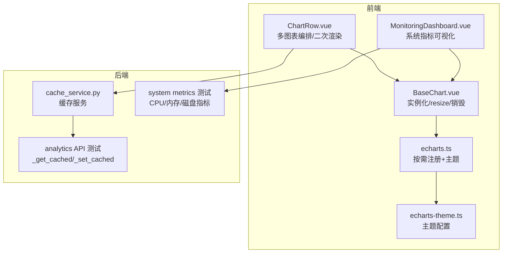
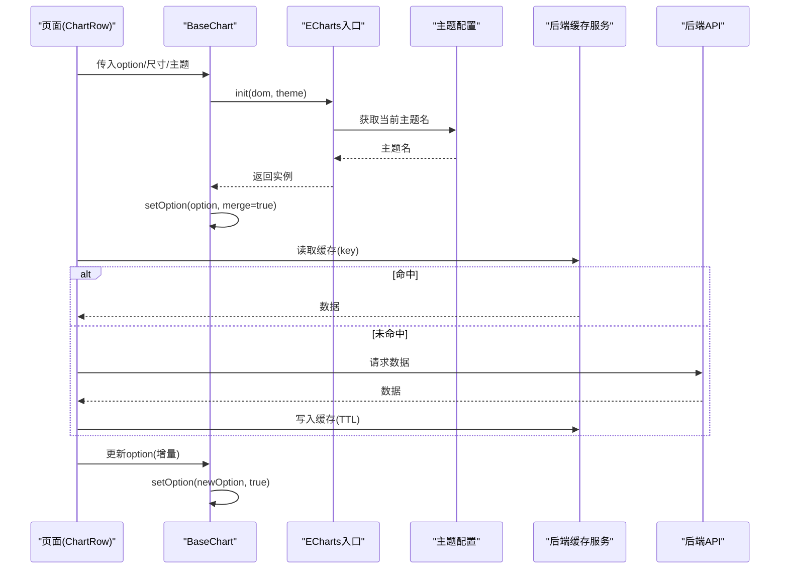
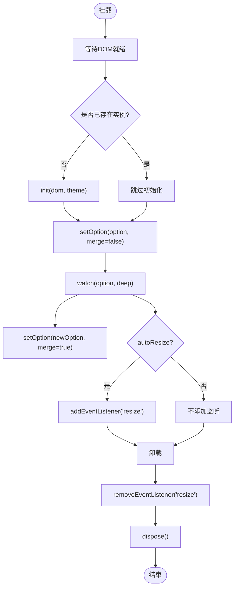
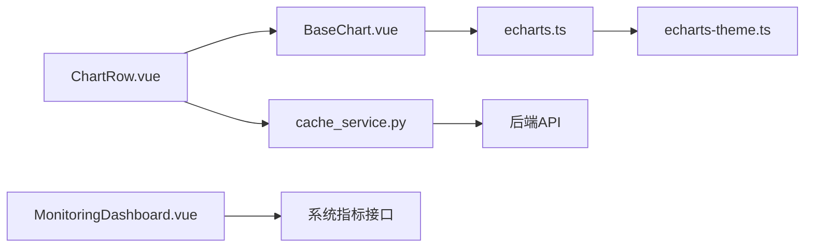

# 图表性能优化

<cite>
**本文引用的文件**
- [frontend/src/components/common/BaseChart.vue](file://frontend/src/components/common/BaseChart.vue)
- [frontend/src/utils/echarts.ts](file://frontend/src/utils/echarts.ts)
- [frontend/src/utils/echarts-theme.ts](file://frontend/src/utils/echarts-theme.ts)
- [frontend/src/views/dashboard/ChartRow.vue](file://frontend/src/views/dashboard/ChartRow.vue)
- [frontend/src/views/system/MonitoringDashboard.vue](file://frontend/src/views/system/MonitoringDashboard.vue)
- [backend/app/services/cache_service.py](file://backend/app/services/cache_service.py)
- [backend/tests/unit/test_data_analytics_api.py](file://backend/tests/unit/test_data_analytics_api.py)
- [backend/tests/unit/test_cache_service_complete.py](file://backend/tests/unit/test_cache_service_complete.py)
- [backend/tests/unit/test_system_metrics_api.py](file://backend/tests/unit/test_system_metrics_api.py)
- [frontend/tests/unit/components/common/BaseChart.test.ts](file://frontend/tests/unit/components/common/BaseChart.test.ts)
- [frontend/tests/unit/views/dashboard/ChartRowCov.test.ts](file://frontend/tests/unit/views/dashboard/ChartRowCov.test.ts)
- [frontend/tests/unit/views/dataPackage/ReceivePackageCov.test.ts](file://frontend/tests/unit/views/dataPackage/ReceivePackageCov.test.ts)
</cite>

## 目录
1. [简介](#简介)
2. [项目结构](#项目结构)
3. [核心组件](#核心组件)
4. [架构总览](#架构总览)
5. [详细组件分析](#详细组件分析)
6. [依赖关系分析](#依赖关系分析)
7. [性能考量](#性能考量)
8. [故障排查指南](#故障排查指南)
9. [结论](#结论)
10. [附录](#附录)

## 简介
本技术文档聚焦大数据量图表的渲染优化，覆盖数据分页、虚拟滚动与增量更新策略；阐述内存管理与图表实例生命周期管理；介绍异步数据处理与缓存机制以减少重复计算和网络请求；说明如何监控与分析图表性能瓶颈（渲染时间、内存占用、CPU使用率）；并提供完整的高性能图表实现示例与调优技巧，以及常见性能问题的诊断方法与解决方案。

## 项目结构
本项目在前后端均具备支撑高性能图表的关键能力：
- 前端通过统一的 ECharts 入口进行按需注册与主题注册，封装 BaseChart 组件负责实例化、监听 resize、响应 option 变更与销毁释放；页面级 ChartRow 负责多图表编排、二次渲染与空态处理；系统监控页提供 CPU/内存/磁盘等指标展示。
- 后端提供缓存服务与统计接口，支持缓存命中/未命中、预热、失效与统计；测试用例验证了缓存降级与异常场景下的健壮性。

**图示来源**
- [frontend/src/components/common/BaseChart.vue:1-89](file://frontend/src/components/common/BaseChart.vue#L1-L89)
- [frontend/src/utils/echarts.ts:1-37](file://frontend/src/utils/echarts.ts#L1-L37)
- [frontend/src/utils/echarts-theme.ts:1-474](file://frontend/src/utils/echarts-theme.ts#L1-L474)
- [frontend/src/views/dashboard/ChartRow.vue](file://frontend/src/views/dashboard/ChartRow.vue)
- [frontend/src/views/system/MonitoringDashboard.vue:389-551](file://frontend/src/views/system/MonitoringDashboard.vue#L389-L551)
- [backend/app/services/cache_service.py:432-476](file://backend/app/services/cache_service.py#L432-L476)
- [backend/tests/unit/test_data_analytics_api.py:357-393](file://backend/tests/unit/test_data_analytics_api.py#L357-L393)
- [backend/tests/unit/test_system_metrics_api.py:81-138](file://backend/tests/unit/test_system_metrics_api.py#L81-L138)

**章节来源**
- [frontend/src/components/common/BaseChart.vue:1-89](file://frontend/src/components/common/BaseChart.vue#L1-L89)
- [frontend/src/utils/echarts.ts:1-37](file://frontend/src/utils/echarts.ts#L1-L37)
- [frontend/src/utils/echarts-theme.ts:1-474](file://frontend/src/utils/echarts-theme.ts#L1-L474)
- [frontend/src/views/system/MonitoringDashboard.vue:389-551](file://frontend/src/views/system/MonitoringDashboard.vue#L389-L551)
- [backend/app/services/cache_service.py:432-476](file://backend/app/services/cache_service.py#L432-L476)
- [backend/tests/unit/test_data_analytics_api.py:357-393](file://backend/tests/unit/test_data_analytics_api.py#L357-L393)
- [backend/tests/unit/test_system_metrics_api.py:81-138](file://backend/tests/unit/test_system_metrics_api.py#L81-L138)

## 核心组件
- BaseChart 组件：统一封装 ECharts 实例的生命周期，包括初始化、option 深度监听更新、窗口 resize 自适应、事件透传与卸载时 dispose 释放资源。
- ECharts 入口：按需引入图表类型、组件与 CanvasRenderer，避免全量打包；同时注册“科技风”主题，保证视觉一致性与可切换性。
- 主题配置：定义品牌色系与通用样式，提供浅色/暗色两套主题，并暴露当前主题选择逻辑。
- ChartRow：负责聚合多个图表的加载与渲染，支持二次渲染时先销毁旧实例再重建，空数据时安全跳过初始化。
- 监控面板：将系统指标（CPU/内存/磁盘/响应时间/数据库大小）以卡片形式可视化，便于快速定位性能瓶颈。

**章节来源**
- [frontend/src/components/common/BaseChart.vue:1-89](file://frontend/src/components/common/BaseChart.vue#L1-L89)
- [frontend/src/utils/echarts.ts:1-37](file://frontend/src/utils/echarts.ts#L1-L37)
- [frontend/src/utils/echarts-theme.ts:1-474](file://frontend/src/utils/echarts-theme.ts#L1-L474)
- [frontend/src/views/dashboard/ChartRow.vue](file://frontend/src/views/dashboard/ChartRow.vue)
- [frontend/src/views/system/MonitoringDashboard.vue:389-551](file://frontend/src/views/system/MonitoringDashboard.vue#L389-L551)

## 架构总览
下图展示了从页面到图表渲染与后端缓存的整体流程，强调“按需注册 + 统一封装 + 缓存优先”的性能路径。

**图示来源**
- [frontend/src/components/common/BaseChart.vue:32-57](file://frontend/src/components/common/BaseChart.vue#L32-L57)
- [frontend/src/utils/echarts.ts:15-30](file://frontend/src/utils/echarts.ts#L15-L30)
- [frontend/src/utils/echarts-theme.ts:443-464](file://frontend/src/utils/echarts-theme.ts#L443-L464)
- [backend/app/services/cache_service.py:451-472](file://backend/app/services/cache_service.py#L451-L472)
- [backend/tests/unit/test_data_analytics_api.py:357-393](file://backend/tests/unit/test_data_analytics_api.py#L357-L393)

## 详细组件分析

### BaseChart 组件：实例生命周期与内存管理
- 初始化：在 nextTick 后创建实例并设置初始 option，绑定 click 事件并向上抛出。
- 响应式更新：对 option 进行深度监听，使用合并模式更新，避免整图重绘带来的开销。
- 自适应：根据 autoResize 开关决定是否监听 window resize，调用 resize 保持布局正确。
- 资源释放：卸载时移除事件监听并调用 dispose，防止内存泄漏。

**图示来源**
- [frontend/src/components/common/BaseChart.vue:32-76](file://frontend/src/components/common/BaseChart.vue#L32-L76)

**章节来源**
- [frontend/src/components/common/BaseChart.vue:1-89](file://frontend/src/components/common/BaseChart.vue#L1-L89)
- [frontend/tests/unit/components/common/BaseChart.test.ts:72-120](file://frontend/tests/unit/components/common/BaseChart.test.ts#L72-L120)

### ECharts 按需注册与主题
- 按需注册：仅引入需要的图表类型与组件，配合 CanvasRenderer，显著减小包体积并提升首屏性能。
- 主题注册：幂等注册“科技风”主题，支持浅色/暗色切换；提供当前主题检测函数，便于动态选择。

**章节来源**
- [frontend/src/utils/echarts.ts:1-37](file://frontend/src/utils/echarts.ts#L1-L37)
- [frontend/src/utils/echarts-theme.ts:1-474](file://frontend/src/utils/echarts-theme.ts#L1-L474)

### ChartRow：多图表编排与二次渲染
- 二次渲染：当再次触发加载时，先销毁已有图表实例，再重新初始化，确保数据一致性。
- 空数据保护：当无项目或经费数据时，直接显示空状态，避免无效初始化。
- 骨架屏：加载中展示骨架屏，完成后隐藏，提升感知性能。

**章节来源**
- [frontend/tests/unit/views/dashboard/ChartRowCov.test.ts:158-187](file://frontend/tests/unit/views/dashboard/ChartRowCov.test.ts#L158-L187)
- [frontend/tests/unit/views/dashboard/ChartRowCov.test.ts:219-235](file://frontend/tests/unit/views/dashboard/ChartRowCov.test.ts#L219-L235)

### 分页与增量更新
- 分页：通过 el-pagination 的 size-change/current-change 触发数据加载，减少单次传输数据量，降低渲染压力。
- 增量更新：在 option 变化时使用合并模式更新，避免整图重绘；结合后端缓存减少重复请求。

**章节来源**
- [frontend/tests/unit/views/dataPackage/ReceivePackageCov.test.ts:715-740](file://frontend/tests/unit/views/dataPackage/ReceivePackageCov.test.ts#L715-L740)
- [frontend/src/components/common/BaseChart.vue:49-57](file://frontend/src/components/common/BaseChart.vue#L49-L57)

### 后端缓存与异步处理
- 缓存服务：提供 get/set/invalidate/invalidate_all 等方法，支持按实体维度批量失效；记录命中/未命中统计。
- 预热与降级：支持缓存预热；当缓存不可用时自动降级为直连后端，保障可用性。
- 测试覆盖：验证命中、未命中、异常降级、预热等关键路径。

**章节来源**
- [backend/app/services/cache_service.py:432-476](file://backend/app/services/cache_service.py#L432-L476)
- [backend/tests/unit/test_data_analytics_api.py:357-393](file://backend/tests/unit/test_data_analytics_api.py#L357-L393)
- [backend/tests/unit/test_cache_service_complete.py:176-246](file://backend/tests/unit/test_cache_service_complete.py#L176-L246)

### 性能监控与可视化
- 指标采集：通过系统指标接口获取 CPU/内存/磁盘/响应时间/数据库大小等。
- 可视化呈现：以卡片和趋势图展示，辅助快速识别瓶颈；评分模型综合各项指标给出健康度。

**章节来源**
- [frontend/src/views/system/MonitoringDashboard.vue:389-551](file://frontend/src/views/system/MonitoringDashboard.vue#L389-L551)
- [backend/tests/unit/test_system_metrics_api.py:81-138](file://backend/tests/unit/test_system_metrics_api.py#L81-L138)

## 依赖关系分析
- BaseChart 依赖 ECharts 入口与主题模块，ChartRow 依赖 BaseChart 完成具体图表渲染。
- 页面层通过缓存服务与后端 API 协作，优先命中缓存，未命中则回源并回填缓存。
- 监控面板依赖系统指标接口，用于展示运行期性能数据。

**图示来源**
- [frontend/src/views/dashboard/ChartRow.vue](file://frontend/src/views/dashboard/ChartRow.vue)
- [frontend/src/components/common/BaseChart.vue:1-89](file://frontend/src/components/common/BaseChart.vue#L1-L89)
- [frontend/src/utils/echarts.ts:1-37](file://frontend/src/utils/echarts.ts#L1-L37)
- [frontend/src/utils/echarts-theme.ts:1-474](file://frontend/src/utils/echarts-theme.ts#L1-L474)
- [backend/app/services/cache_service.py:432-476](file://backend/app/services/cache_service.py#L432-L476)

**章节来源**
- [frontend/src/components/common/BaseChart.vue:1-89](file://frontend/src/components/common/BaseChart.vue#L1-L89)
- [frontend/src/utils/echarts.ts:1-37](file://frontend/src/utils/echarts.ts#L1-L37)
- [frontend/src/utils/echarts-theme.ts:1-474](file://frontend/src/utils/echarts-theme.ts#L1-L474)
- [backend/app/services/cache_service.py:432-476](file://backend/app/services/cache_service.py#L432-L476)

## 性能考量
- 数据分页：通过分页参数限制单次数据量，降低 DOM 与渲染压力；结合后端索引与查询优化进一步提升吞吐。
- 虚拟滚动：对于超大数据列表场景，采用固定高度项与缓冲区策略，仅渲染可视区域元素，显著提升滚动流畅度。
- 增量更新：利用 ECharts 的合并模式更新 option，避免整图重绘；对频繁变化的数据集进行局部更新。
- 内存管理：组件卸载时务必调用 dispose 并移除事件监听，防止实例残留导致内存泄漏；二次渲染前先销毁旧实例。
- 异步与缓存：优先读取缓存，未命中再请求后端；对热点数据进行预热；缓存异常时降级直连，保障可用性。
- 监控与度量：持续采集 CPU/内存/磁盘/响应时间等指标，结合评分模型评估系统健康度；对慢查询与高延迟请求进行告警。

[本节为通用指导，不直接分析具体文件]

## 故障排查指南
- 图表不渲染或闪烁：检查是否在 nextTick 后才初始化；确认容器尺寸非零；避免在高频事件中重复 setOption。
- 内存泄漏：确认 onUnmounted 中已移除 resize 监听并调用 dispose；避免全局持有实例引用。
- 二次渲染异常：确保在重建前销毁旧实例；空数据时跳过初始化，避免 null 访问。
- 缓存失效或降级：当缓存不可用时，应降级为直连后端；记录命中/未命中统计，定位热点 key。
- 性能瓶颈定位：通过监控面板查看 CPU/内存/磁盘/响应时间；结合后端指标接口与日志定位慢请求。

**章节来源**
- [frontend/tests/unit/components/common/BaseChart.test.ts:72-120](file://frontend/tests/unit/components/common/BaseChart.test.ts#L72-L120)
- [frontend/tests/unit/views/dashboard/ChartRowCov.test.ts:158-187](file://frontend/tests/unit/views/dashboard/ChartRowCov.test.ts#L158-L187)
- [backend/tests/unit/test_data_analytics_api.py:357-393](file://backend/tests/unit/test_data_analytics_api.py#L357-L393)
- [backend/tests/unit/test_system_metrics_api.py:81-138](file://backend/tests/unit/test_system_metrics_api.py#L81-L138)

## 结论
通过“按需注册 + 统一封装 + 增量更新 + 缓存优先 + 严格生命周期管理”的组合策略，可在大数据量场景下获得稳定且高效的图表渲染体验。配合系统级监控与指标可视化，能够快速定位并解决性能瓶颈，保障整体系统的可用性与用户体验。

[本节为总结性内容，不直接分析具体文件]

## 附录
- 最佳实践清单
  - 使用按需注册与主题，避免全量引入。
  - 所有图表实例必须显式销毁，组件卸载时清理事件监听。
  - 大列表优先分页与虚拟滚动，固定项高以提升性能。
  - 频繁更新的图表使用合并模式更新 option。
  - 后端缓存优先，异常降级；对热点数据预热。
  - 建立监控看板，持续跟踪 CPU/内存/磁盘/响应时间。
- 常见问题速查
  - 图表空白：检查 DOM 尺寸与初始化时机。
  - 卡顿：减少一次性数据量，启用分页/虚拟滚动。
  - 内存上涨：检查是否存在未销毁实例或未移除监听。
  - 请求过多：检查缓存命中率与预热策略。

[本节为补充信息，不直接分析具体文件]