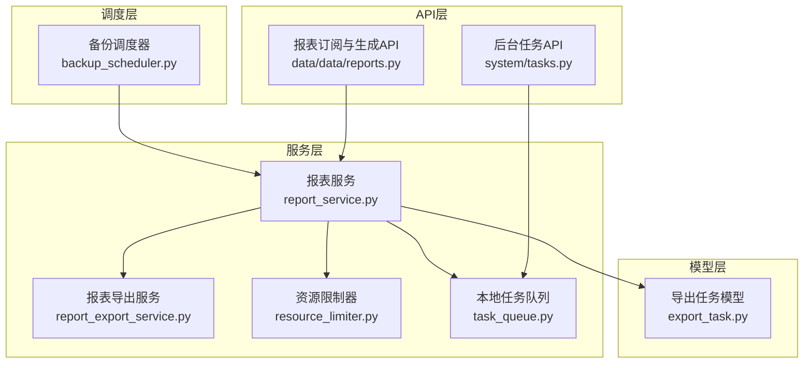
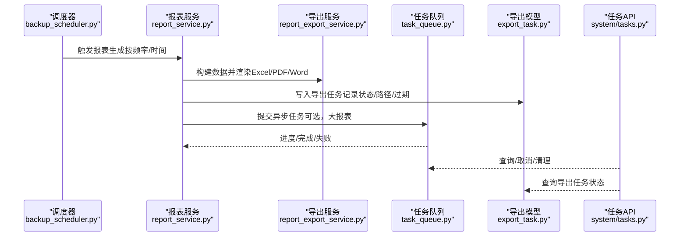
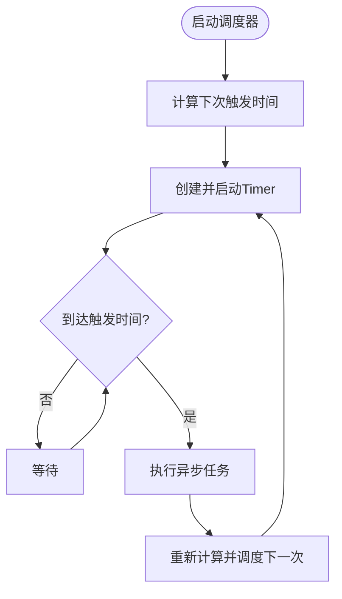
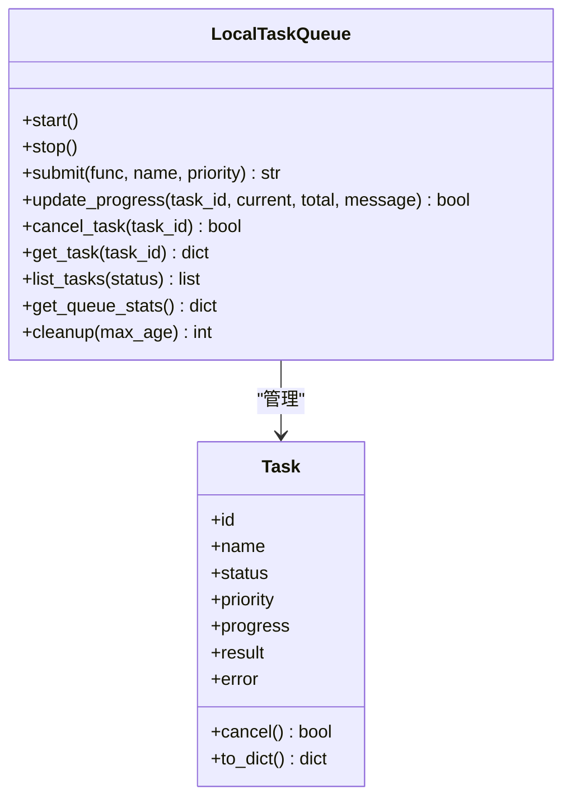
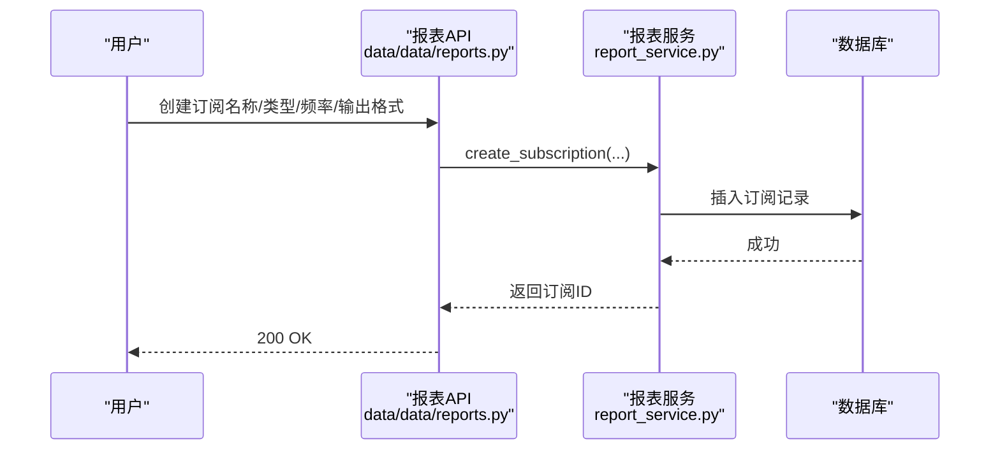
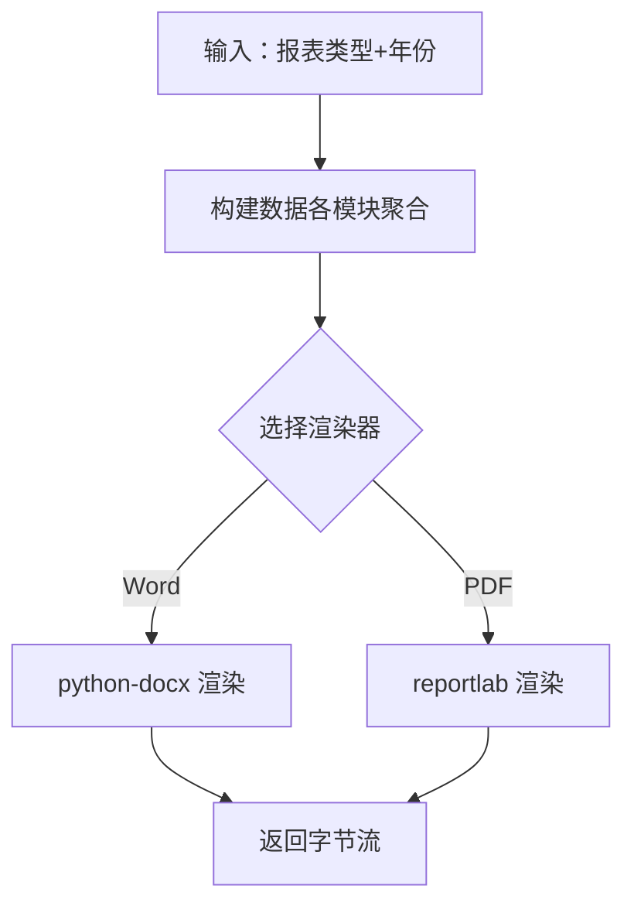
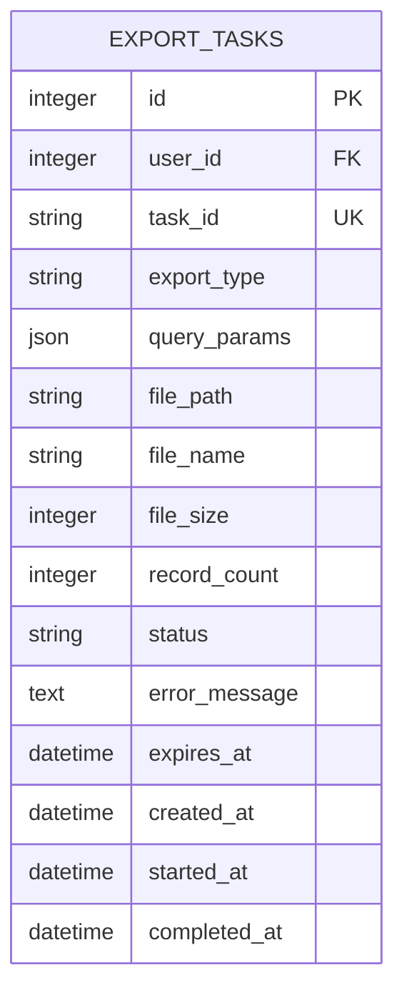
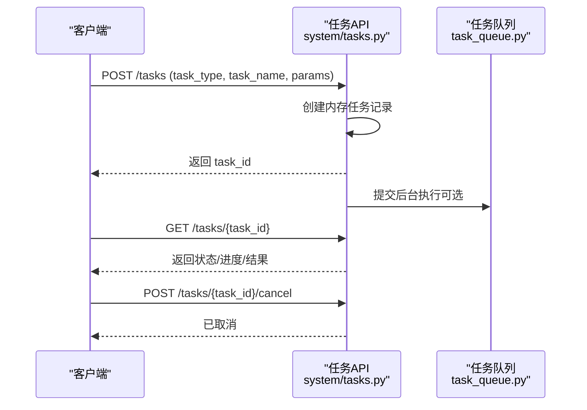
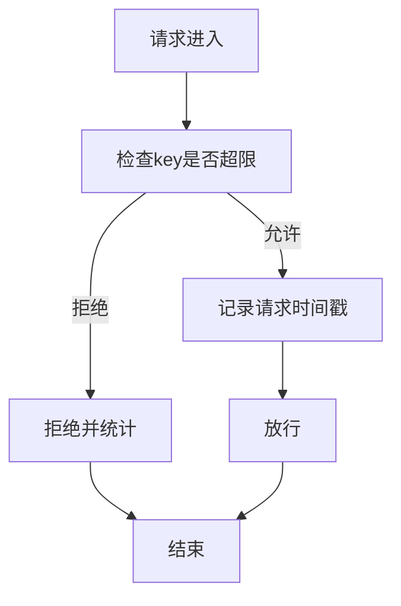
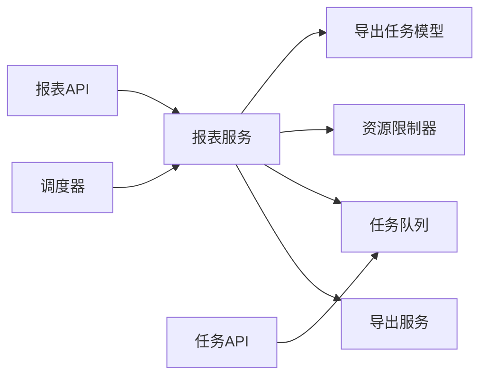

# 定时报表生成

<cite>
**本文引用的文件**
- [backend/app/services/backup_scheduler.py](file://backend/app/services/backup_scheduler.py)
- [backend/app/services/task_queue.py](file://backend/app/services/task_queue.py)
- [backend/app/api/v1/system/tasks.py](file://backend/app/api/v1/system/tasks.py)
- [backend/app/services/report_service.py](file://backend/app/services/report_service.py)
- [backend/app/services/report_export_service.py](file://backend/app/services/report_export_service.py)
- [backend/app/models/export_task.py](file://backend/app/models/export_task.py)
- [backend/app/services/resource_limiter.py](file://backend/app/services/resource_limiter.py)
- [backend/app/api/v1/data/data/reports.py](file://backend/app/api/v1/data/data/reports.py)
</cite>

## 目录
1. [简介](#简介)
2. [项目结构](#项目结构)
3. [核心组件](#核心组件)
4. [架构总览](#架构总览)
5. [详细组件分析](#详细组件分析)
6. [依赖关系分析](#依赖关系分析)
7. [性能与并发](#性能与并发)
8. [故障排查指南](#故障排查指南)
9. [结论](#结论)
10. [附录：配置与使用清单](#附录：配置与使用清单)

## 简介
本指南面向“定时报表生成”能力，覆盖以下目标：
- 如何设置报表的自动生成计划（每日、每周、每月）、执行时间与触发条件
- 任务队列的管理与监控（暂停、恢复、删除）
- 任务执行的日志记录与错误处理机制
- 资源占用控制与并发管理
- 任务依赖关系与顺序执行控制方法
- 任务性能监控与优化建议
- 常见故障排查与解决方案

## 项目结构
系统采用分层设计：调度层负责按频率触发任务；服务层负责数据聚合与导出；模型层持久化任务与导出结果；API 层提供查询与控制接口；资源限制器用于限流与配额。

图表来源
- [backend/app/services/backup_scheduler.py:455-542](file://backend/app/services/backup_scheduler.py#L455-L542)
- [backend/app/services/report_service.py:18-153](file://backend/app/services/report_service.py#L18-L153)
- [backend/app/services/report_export_service.py:46-448](file://backend/app/services/report_export_service.py#L46-L448)
- [backend/app/services/task_queue.py:124-288](file://backend/app/services/task_queue.py#L124-L288)
- [backend/app/models/export_task.py:28-121](file://backend/app/models/export_task.py#L28-L121)
- [backend/app/api/v1/system/tasks.py:96-293](file://backend/app/api/v1/system/tasks.py#L96-L293)
- [backend/app/api/v1/data/data/reports.py:589-761](file://backend/app/api/v1/data/data/reports.py#L589-L761)

章节来源
- [backend/app/services/backup_scheduler.py:455-542](file://backend/app/services/backup_scheduler.py#L455-L542)
- [backend/app/services/task_queue.py:124-288](file://backend/app/services/task_queue.py#L124-L288)
- [backend/app/api/v1/system/tasks.py:96-293](file://backend/app/api/v1/system/tasks.py#L96-L293)
- [backend/app/services/report_service.py:18-153](file://backend/app/services/report_service.py#L18-L153)
- [backend/app/services/report_export_service.py:46-448](file://backend/app/services/report_export_service.py#L46-L448)
- [backend/app/models/export_task.py:28-121](file://backend/app/models/export_task.py#L28-L121)
- [backend/app/api/v1/data/data/reports.py:589-761](file://backend/app/api/v1/data/data/reports.py#L589-L761)

## 核心组件
- 定时调度器：基于线程定时器实现每日/每周/间隔任务，统一封装异步任务执行与重调度。
- 任务队列：内存优先级队列，支持进度追踪、取消、清理与统计。
- 报表服务：Excel/PDF/综合报表导出，订阅管理与数据获取。
- 报表导出服务：Word/PDF 公文报告的数据构建与渲染。
- 导出任务模型：持久化导出任务状态、文件路径、过期时间等。
- 资源限制器：速率限制与配额管理，防止报表生成高峰拥塞。
- 后台任务API：创建、查询、取消、删除任务，以及运行中任务计数。

章节来源
- [backend/app/services/backup_scheduler.py:455-542](file://backend/app/services/backup_scheduler.py#L455-L542)
- [backend/app/services/task_queue.py:124-288](file://backend/app/services/task_queue.py#L124-L288)
- [backend/app/services/report_service.py:18-153](file://backend/app/services/report_service.py#L18-L153)
- [backend/app/services/report_export_service.py:46-448](file://backend/app/services/report_export_service.py#L46-L448)
- [backend/app/models/export_task.py:28-121](file://backend/app/models/export_task.py#L28-L121)
- [backend/app/services/resource_limiter.py:41-172](file://backend/app/services/resource_limiter.py#L41-L172)
- [backend/app/api/v1/system/tasks.py:96-293](file://backend/app/api/v1/system/tasks.py#L96-L293)

## 架构总览
下图展示从调度到导出的端到端流程，包括订阅、生成、存储与监控。

图表来源
- [backend/app/services/backup_scheduler.py:455-542](file://backend/app/services/backup_scheduler.py#L455-L542)
- [backend/app/services/report_service.py:18-153](file://backend/app/services/report_service.py#L18-L153)
- [backend/app/services/report_export_service.py:46-448](file://backend/app/services/report_export_service.py#L46-L448)
- [backend/app/services/task_queue.py:124-288](file://backend/app/services/task_queue.py#L124-L288)
- [backend/app/models/export_task.py:28-121](file://backend/app/models/export_task.py#L28-L121)
- [backend/app/api/v1/system/tasks.py:96-293](file://backend/app/api/v1/system/tasks.py#L96-L293)

## 详细组件分析

### 定时调度器（每日/每周/间隔）
- 功能要点
  - 提供 _schedule_daily/_schedule_weekly/_schedule_interval 三种调度方式
  - 通过 threading.Timer 实现轻量级定时，避免外部依赖
  - 统一封装异步任务执行，自动重调度下一次触发
  - 内置多种业务任务：KPI预计算、异常检测、自动备份、自动打包、消息清理、待办提醒、工作周报等
- 关键行为
  - 首次触发计算距离下次执行的时间差，启动 Timer
  - 每次执行后递归创建下一个 Timer，保证周期性
  - 停止时取消所有 Timer 并重置状态

图表来源
- [backend/app/services/backup_scheduler.py:455-542](file://backend/app/services/backup_scheduler.py#L455-L542)

章节来源
- [backend/app/services/backup_scheduler.py:455-542](file://backend/app/services/backup_scheduler.py#L455-L542)

### 任务队列（优先级、进度、取消、清理）
- 功能要点
  - LocalTaskQueue 基于 asyncio.PriorityQueue，支持多 worker 并发
  - TaskProgress 提供百分比与消息更新
  - 支持取消（PENDING/RUNNING）、清理旧任务、统计信息
- 使用场景
  - 大报表导出可提交为异步任务，前端轮询进度
  - 通过 update_progress 实时反馈执行阶段

图表来源
- [backend/app/services/task_queue.py:20-122](file://backend/app/services/task_queue.py#L20-L122)
- [backend/app/services/task_queue.py:124-288](file://backend/app/services/task_queue.py#L124-L288)

章节来源
- [backend/app/services/task_queue.py:20-122](file://backend/app/services/task_queue.py#L20-L122)
- [backend/app/services/task_queue.py:124-288](file://backend/app/services/task_queue.py#L124-L288)

### 报表服务（订阅、导出、数据获取）
- 功能要点
  - 支持 Excel/PDF/综合报表导出
  - 订阅管理：创建、更新、取消（软删除 is_active=False）
  - 数据获取：按用户数据权限过滤，限制行数避免过大负载
- 订阅字段
  - frequency（weekly/monthly/daily）、send_day、send_time、email、output_dir、output_format 等

图表来源
- [backend/app/api/v1/data/data/reports.py:589-761](file://backend/app/api/v1/data/data/reports.py#L589-L761)
- [backend/app/services/report_service.py:167-297](file://backend/app/services/report_service.py#L167-L297)

章节来源
- [backend/app/services/report_service.py:18-153](file://backend/app/services/report_service.py#L18-L153)
- [backend/app/services/report_service.py:167-297](file://backend/app/services/report_service.py#L167-L297)
- [backend/app/api/v1/data/data/reports.py:589-761](file://backend/app/api/v1/data/data/reports.py#L589-L761)

### 报表导出服务（Word/PDF 公文报告）
- 功能要点
  - 统一数据结构：{year, title, sections:[{title, paragraphs, table}]}
  - 生成年度总结、经费明细、项目进度、学校统计、帮扶村汇总等
  - 渲染 Word/PDF，空数据时输出说明而非空文件
- 错误处理
  - 数据查询失败降级为警告日志，并输出空表或提示文本，避免误导

图表来源
- [backend/app/services/report_export_service.py:46-448](file://backend/app/services/report_export_service.py#L46-L448)

章节来源
- [backend/app/services/report_export_service.py:46-448](file://backend/app/services/report_export_service.py#L46-L448)

### 导出任务模型（持久化与生命周期）
- 字段说明
  - task_id（唯一标识）、export_type、query_params、file_path、file_name、file_size、record_count
  - status（pending/processing/completed/failed/expired）、expires_at、created_at/started_at/completed_at
- 可用性判断
  - is_downloadable：仅 completed 且未过期时可下载

图表来源
- [backend/app/models/export_task.py:28-121](file://backend/app/models/export_task.py#L28-L121)

章节来源
- [backend/app/models/export_task.py:28-121](file://backend/app/models/export_task.py#L28-L121)

### 后台任务API（创建、查询、取消、删除）
- 功能要点
  - 创建任务：返回 task_id，后台异步执行，模拟进度推进
  - 查询列表/详情/统计/运行中数量
  - 取消任务：仅 pending/running 可取消
  - 删除任务：仅 completed/failed/cancelled 可删除
- 适用场景
  - 临时性报表生成、一次性导出、维护类任务

图表来源
- [backend/app/api/v1/system/tasks.py:96-293](file://backend/app/api/v1/system/tasks.py#L96-L293)
- [backend/app/services/task_queue.py:124-288](file://backend/app/services/task_queue.py#L124-L288)

章节来源
- [backend/app/api/v1/system/tasks.py:96-293](file://backend/app/api/v1/system/tasks.py#L96-L293)
- [backend/app/services/task_queue.py:124-288](file://backend/app/services/task_queue.py#L124-L288)

### 资源限制器（限流与配额）
- 功能要点
  - 基于滑动窗口与锁保护，按 key 限制请求数
  - set_quota/clear_quota 动态配置
  - get_usage_stats 获取使用统计
- 适用场景
  - 报表导出高峰期限流，避免数据库/IO过载

图表来源
- [backend/app/services/resource_limiter.py:41-172](file://backend/app/services/resource_limiter.py#L41-L172)

章节来源
- [backend/app/services/resource_limiter.py:41-172](file://backend/app/services/resource_limiter.py#L41-L172)

## 依赖关系分析
- 调度器依赖报表服务与消息服务，触发 KPI、异常检测、备份、打包、提醒、周报等任务
- 报表服务依赖导出服务与数据权限过滤，支持订阅管理
- 任务队列被后台任务API与报表服务复用，提供进度与取消能力
- 导出任务模型由报表服务写入，供后续下载与审计
- 资源限制器可被任意高负载操作调用，保障系统稳定

图表来源
- [backend/app/services/backup_scheduler.py:455-542](file://backend/app/services/backup_scheduler.py#L455-L542)
- [backend/app/services/report_service.py:18-153](file://backend/app/services/report_service.py#L18-L153)
- [backend/app/services/report_export_service.py:46-448](file://backend/app/services/report_export_service.py#L46-L448)
- [backend/app/services/task_queue.py:124-288](file://backend/app/services/task_queue.py#L124-L288)
- [backend/app/models/export_task.py:28-121](file://backend/app/models/export_task.py#L28-L121)
- [backend/app/api/v1/system/tasks.py:96-293](file://backend/app/api/v1/system/tasks.py#L96-L293)
- [backend/app/api/v1/data/data/reports.py:589-761](file://backend/app/api/v1/data/data/reports.py#L589-L761)

章节来源
- [backend/app/services/backup_scheduler.py:455-542](file://backend/app/services/backup_scheduler.py#L455-L542)
- [backend/app/services/report_service.py:18-153](file://backend/app/services/report_service.py#L18-L153)
- [backend/app/services/report_export_service.py:46-448](file://backend/app/services/report_export_service.py#L46-L448)
- [backend/app/services/task_queue.py:124-288](file://backend/app/services/task_queue.py#L124-L288)
- [backend/app/models/export_task.py:28-121](file://backend/app/models/export_task.py#L28-L121)
- [backend/app/api/v1/system/tasks.py:96-293](file://backend/app/api/v1/system/tasks.py#L96-L293)
- [backend/app/api/v1/data/data/reports.py:589-761](file://backend/app/api/v1/data/data/reports.py#L589-L761)

## 性能与并发
- 并发策略
  - 任务队列默认多 worker（可配置），优先执行高优先级任务
  - 大报表导出建议走异步任务队列，避免阻塞请求
- 资源控制
  - 使用资源限制器对导出/查询进行限流，防止瞬时峰值压垮数据库
  - 报表数据查询限制行数（如100条），避免超大结果集
- 缓存与预计算
  - KPI 预计算写入缓存，减少重复计算开销
- 建议
  - 根据服务器CPU/IO调整 max_workers
  - 对高频报表启用缓存或增量计算
  - 合理设置导出文件过期时间，及时清理磁盘空间

章节来源
- [backend/app/services/task_queue.py:124-288](file://backend/app/services/task_queue.py#L124-L288)
- [backend/app/services/resource_limiter.py:41-172](file://backend/app/services/resource_limiter.py#L41-L172)
- [backend/app/services/report_service.py:301-328](file://backend/app/services/report_service.py#L301-L328)
- [backend/app/services/backup_scheduler.py:150-166](file://backend/app/services/backup_scheduler.py#L150-L166)

## 故障排查指南
- 常见问题
  - 定时任务未触发：检查调度器是否启动、Timer 是否被取消、事件循环是否正确创建
  - 报表导出为空：检查数据查询是否失败、权限过滤是否过严、依赖库是否安装
  - 导出文件无法下载：检查导出任务状态是否为 completed 且未过期
  - 任务无法取消：确认任务状态不是 completed/failed/cancelled
  - 资源受限被拒：检查配额是否设置过小或窗口时间过短
- 日志定位
  - 调度器与导出服务均记录详细日志，关注异常堆栈与降级提示
  - 任务队列在失败时会记录错误信息与任务名
- 快速验证
  - 使用后台任务API创建测试任务，观察状态流转
  - 通过任务队列统计接口查看当前运行/排队情况

章节来源
- [backend/app/services/backup_scheduler.py:455-542](file://backend/app/services/backup_scheduler.py#L455-L542)
- [backend/app/services/report_export_service.py:140-230](file://backend/app/services/report_export_service.py#L140-L230)
- [backend/app/models/export_task.py:85-121](file://backend/app/models/export_task.py#L85-L121)
- [backend/app/api/v1/system/tasks.py:172-293](file://backend/app/api/v1/system/tasks.py#L172-L293)
- [backend/app/services/task_queue.py:251-288](file://backend/app/services/task_queue.py#L251-L288)

## 结论
本系统通过轻量调度器、灵活的任务队列、完善的报表导出与导出任务模型，实现了可靠的定时报表生成能力。结合资源限制器与日志记录，可在生产环境中稳定运行。建议在生产部署时合理配置并发与限流参数，并结合缓存与增量计算优化性能。

## 附录：配置与使用清单
- 频率与时间
  - 每日：使用 _schedule_daily(hour, minute, task_name)
  - 每周：使用 _schedule_weekly(weekday, hour, minute, task_name)
  - 间隔：使用 _schedule_interval(interval_seconds, task_name)
- 订阅配置
  - frequency：weekly/monthly/daily
  - send_day：按周/月指定发送日
  - send_time：具体发送时间
  - output_format：pdf/xlsx/json
  - email：接收邮箱
  - output_dir：输出目录
- 任务管理
  - 创建：POST /api/v1/tasks
  - 查询：GET /api/v1/tasks/{task_id}
  - 取消：POST /api/v1/tasks/{task_id}/cancel
  - 删除：DELETE /api/v1/tasks/{task_id}
  - 统计：GET /api/v1/tasks/stats
  - 运行中计数：GET /api/v1/tasks/running/count
- 资源限制
  - set_quota(key, max_requests, period)
  - check_rate_limit(key, limit, window)
  - get_usage_stats(key)

章节来源
- [backend/app/services/backup_scheduler.py:455-542](file://backend/app/services/backup_scheduler.py#L455-L542)
- [backend/app/services/report_service.py:196-297](file://backend/app/services/report_service.py#L196-L297)
- [backend/app/api/v1/system/tasks.py:96-293](file://backend/app/api/v1/system/tasks.py#L96-L293)
- [backend/app/services/resource_limiter.py:111-172](file://backend/app/services/resource_limiter.py#L111-L172)