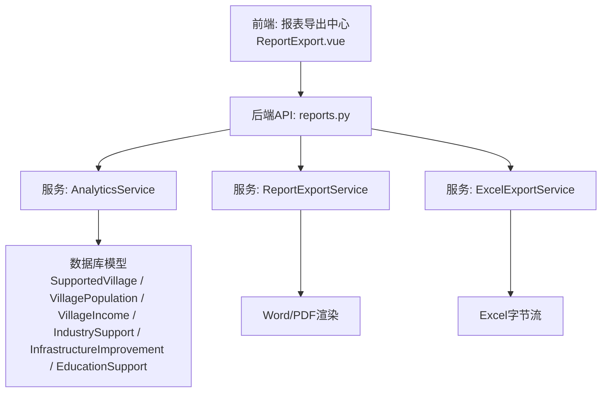
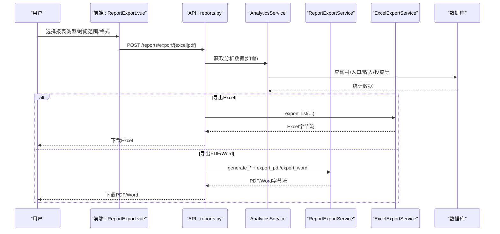
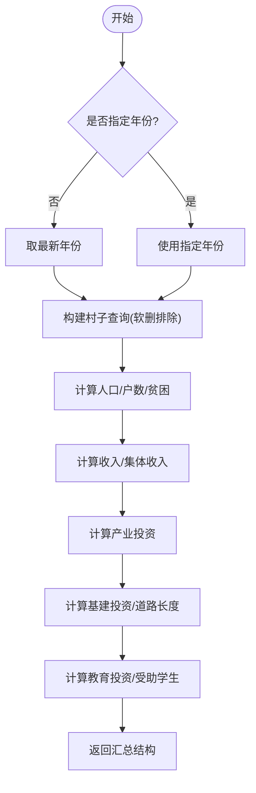
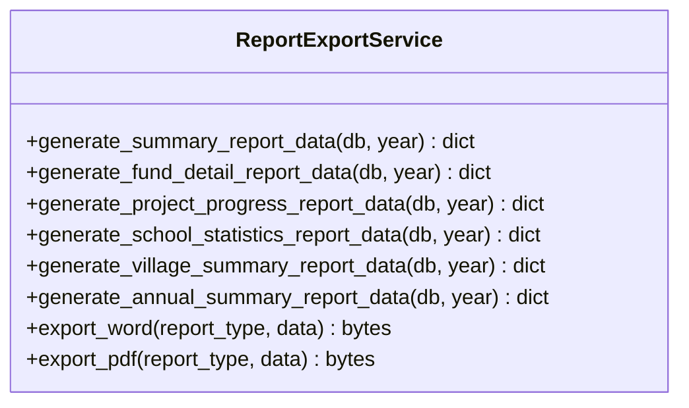
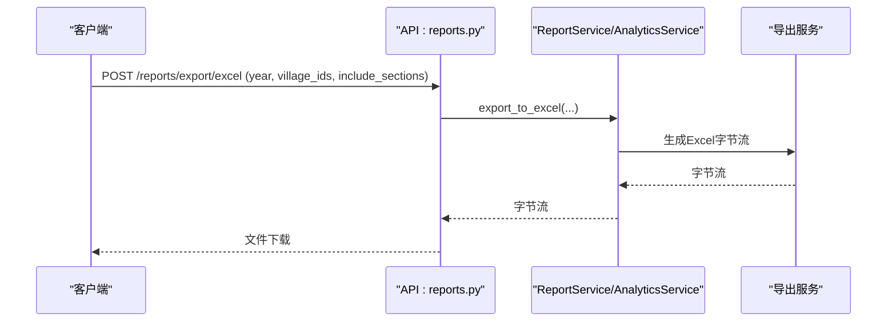
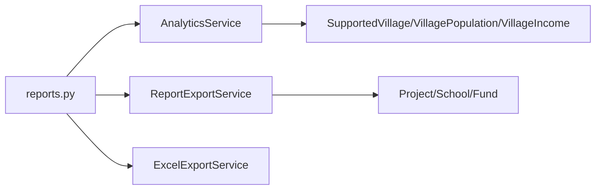

# 数据分析与报表指南

<cite>
**本文引用的文件**
- [backend/app/services/analytics_service.py](file://backend/app/services/analytics_service.py)
- [backend/app/services/export_service.py](file://backend/app/services/export_service.py)
- [backend/app/services/report_export_service.py](file://backend/app/services/report_export_service.py)
- [backend/app/api/v1/data/data/reports.py](file://backend/app/api/v1/data/data/reports.py)
- [backend/app/models/export_task.py](file://backend/app/models/export_task.py)
- [backend/app/models/report_template.py](file://backend/app/models/report_template.py)
- [backend/app/models/data_report.py](file://backend/app/models/data_report.py)
- [frontend/src/views/export/ReportExport.vue](file://frontend/src/views/export/ReportExport.vue)
- [docs/02-用户手册/数据分析功能使用指南.md](file://docs/02-用户手册/数据分析功能使用指南.md)
- [backend/tests/unit/test_data_analytics_api.py](file://backend/tests/unit/test_data_analytics_api.py)
- [backend/tests/unit/test_analytics_service.py](file://backend/tests/unit/test_analytics_service.py)
- [backend/app/services/backup_scheduler.py](file://backend/app/services/backup_scheduler.py)
</cite>

## 目录
1. [简介](#简介)
2. [项目结构](#项目结构)
3. [核心组件](#核心组件)
4. [架构总览](#架构总览)
5. [详细组件分析](#详细组件分析)
6. [依赖关系分析](#依赖关系分析)
7. [性能考虑](#性能考虑)
8. [故障排查指南](#故障排查指南)
9. [结论](#结论)
10. [附录](#附录)

## 简介
本指南面向业务用户与实施人员，系统说明乡村振兴系统中的“数据分析与报表”能力：如何查看与分析项目统计、经费分析、工作成效评估；如何创建自定义报表模板；如何进行数据导出与分享；如何定制可视化图表并进行交互操作；如何发现数据洞察；如何实现报表定时生成与自动推送；以及如何进行数据质量检查与异常数据处理。

## 项目结构
后端提供数据分析服务、报表导出服务、API路由与模型；前端提供报表导出中心页面与筛选配置；文档提供用户视角的使用说明；测试覆盖关键接口与服务行为；调度器支持周期性任务（如周报等）。

**图示来源**
- [backend/app/api/v1/data/data/reports.py:54-155](file://backend/app/api/v1/data/data/reports.py#L54-L155)
- [backend/app/services/analytics_service.py:28-703](file://backend/app/services/analytics_service.py#L28-L703)
- [backend/app/services/report_export_service.py:46-448](file://backend/app/services/report_export_service.py#L46-L448)
- [backend/app/services/export_service.py:10-190](file://backend/app/services/export_service.py#L10-L190)
- [frontend/src/views/export/ReportExport.vue:1-72](file://frontend/src/views/export/ReportExport.vue#L1-L72)

**章节来源**
- [docs/02-用户手册/数据分析功能使用指南.md:1-35](file://docs/02-用户手册/数据分析功能使用指南.md#L1-L35)
- [backend/app/api/v1/data/data/reports.py:1-779](file://backend/app/api/v1/data/data/reports.py#L1-L779)

## 核心组件
- 数据分析服务（AnalyticsService）：聚合仪表盘、帮扶村分析、资金趋势、绩效指标、对比分析与汇总统计，并提供数据钻取、筛选与导出。
- 报表导出服务（ReportExportService）：生成Word/PDF公文报告，统一数据结构渲染标题、段落与表格。
- Excel导出服务（ExcelExportService）：构建多Sheet的Excel文件，包含汇总、村庄、项目、经费等。
- 报表API路由（reports.py）：暴露导出、分析、订阅、生成与下载接口。
- 模型层：导出任务（ExportTask）、上报流程（DataReport）、模板（ReportTemplate）支撑异步导出、上报审批与模板化导入/导出。
- 前端导出中心：选择报表类型、时间范围、数据范围、格式与是否包含图表。

**章节来源**
- [backend/app/services/analytics_service.py:22-703](file://backend/app/services/analytics_service.py#L22-L703)
- [backend/app/services/report_export_service.py:46-448](file://backend/app/services/report_export_service.py#L46-L448)
- [backend/app/services/export_service.py:10-190](file://backend/app/services/export_service.py#L10-L190)
- [backend/app/api/v1/data/data/reports.py:54-779](file://backend/app/api/v1/data/data/reports.py#L54-L779)
- [backend/app/models/export_task.py:18-121](file://backend/app/models/export_task.py#L18-L121)
- [backend/app/models/data_report.py:19-141](file://backend/app/models/data_report.py#L19-L141)
- [backend/app/models/report_template.py:26-73](file://backend/app/models/report_template.py#L26-L73)
- [frontend/src/views/export/ReportExport.vue:1-72](file://frontend/src/views/export/ReportExport.vue#L1-L72)

## 架构总览
报表与数据分析从前端触发，经API路由进入服务层，服务层通过SQL或ORM查询底层数据模型，再调用导出服务生成Excel/Word/PDF或返回JSON。订阅机制支持定时生成与推送。

**图示来源**
- [backend/app/api/v1/data/data/reports.py:54-155](file://backend/app/api/v1/data/data/reports.py#L54-L155)
- [backend/app/services/analytics_service.py:28-703](file://backend/app/services/analytics_service.py#L28-L703)
- [backend/app/services/report_export_service.py:318-443](file://backend/app/services/report_export_service.py#L318-L443)
- [backend/app/services/export_service.py:67-186](file://backend/app/services/export_service.py#L67-L186)

## 详细组件分析

### 数据分析服务（AnalyticsService）
- 仪表盘总览：按省份与振兴梯队统计帮扶村数量，计算总数。
- 帮扶村分析：投资总额/均值/最大值、人口总量与居住率、人均收入与县均收入、基础设施分类投资。
- 资金趋势：近N年总投入、军地/地方投入拆分、村数变化。
- 绩效指标：政策发布情况、示范村数量、产业/基建/医疗/教育投资分类。
- 对比分析：按省份或梯队对比村数、总投资、平均收入。
- 汇总统计：综合村特征、人口、收入、产业/基建/教育投资，支持年份过滤与默认最新年。
- 数据钻取与筛选：按维度钻取到村列表；多维度筛选并分页返回。
- 导出：将分析结果转为Excel字节流。

**图示来源**
- [backend/app/services/analytics_service.py:387-532](file://backend/app/services/analytics_service.py#L387-L532)

**章节来源**
- [backend/app/services/analytics_service.py:28-703](file://backend/app/services/analytics_service.py#L28-L703)

### 报表导出服务（ReportExportService）
- 数据生成：年度总结、经费明细、项目进度、学校统计、帮扶村汇总、年度综合总结。
- 渲染输出：统一Section结构（标题、段落、表格），空数据时输出“暂无数据”。
- Word/PDF：中文字体处理、表格样式、页眉页脚元信息。

**图示来源**
- [backend/app/services/report_export_service.py:46-448](file://backend/app/services/report_export_service.py#L46-L448)

**章节来源**
- [backend/app/services/report_export_service.py:46-448](file://backend/app/services/report_export_service.py#L46-L448)

### Excel导出服务（ExcelExportService）
- 通用工作簿创建：表头样式、边框、对齐、自适应列宽、审计水印。
- 多场景导出：用户/村庄/学校/项目/经费/组织/通行证码/综合报表（多Sheet）。

**章节来源**
- [backend/app/services/export_service.py:10-190](file://backend/app/services/export_service.py#L10-L190)

### 报表API路由（reports.py）
- 导出接口：Excel/PDF/综合报表导出，返回文件流。
- 分析接口：筛选选项、多维筛选、钻取、村对比、年度对比、汇总统计。
- 订阅管理：创建/列表/详情/更新/删除/启用切换，支持频率、发送日/时、邮箱、输出目录/格式。
- 报表生成：根据类型与参数生成JSON或触发下载。

**图示来源**
- [backend/app/api/v1/data/data/reports.py:54-155](file://backend/app/api/v1/data/data/reports.py#L54-L155)

**章节来源**
- [backend/app/api/v1/data/data/reports.py:54-779](file://backend/app/api/v1/data/data/reports.py#L54-L779)

### 前端导出中心（ReportExport.vue）
- 报表类型选择：项目统计、经费分析、成效评估等。
- 导出配置：时间范围、数据范围（本单位/含下级）、格式（Excel）、是否包含图表。
- 同步导出仅支持Excel；PDF/Word请使用“官方报表导出”。

**章节来源**
- [frontend/src/views/export/ReportExport.vue:1-72](file://frontend/src/views/export/ReportExport.vue#L1-L72)

### 数据模型与上报流程
- 导出任务（ExportTask）：记录导出类型、查询参数、文件路径/名称/大小、状态机（待处理/处理中/已完成/失败/过期）、过期控制与可下载判断。
- 数据上报（DataReport）：跟踪下级向上级提交数据的状态流转（草稿/已提交/已批准/已拒绝/已取消），支持截止时间与审批意见。
- 报表模板（ReportTemplate）：定义导入/导出模板字段映射与格式配置，支持模块关联与启用控制。

**章节来源**
- [backend/app/models/export_task.py:18-121](file://backend/app/models/export_task.py#L18-L121)
- [backend/app/models/data_report.py:19-141](file://backend/app/models/data_report.py#L19-L141)
- [backend/app/models/report_template.py:26-73](file://backend/app/models/report_template.py#L26-L73)

## 依赖关系分析
- API路由依赖服务层：reports.py依赖AnalyticsService与ReportService（后者封装导出逻辑）。
- 服务层依赖模型：AnalyticsService读取村、人口、收入、产业、基建、教育等实体；ReportExportService读取项目、学校、经费等实体。
- 导出服务解耦：Excel与Word/PDF分别由独立服务实现，便于扩展与维护。
- 前端与后端契约：前端导出中心通过API发起导出请求，后端返回文件流或JSON。

**图示来源**
- [backend/app/api/v1/data/data/reports.py:54-779](file://backend/app/api/v1/data/data/reports.py#L54-L779)
- [backend/app/services/analytics_service.py:28-703](file://backend/app/services/analytics_service.py#L28-L703)
- [backend/app/services/report_export_service.py:46-448](file://backend/app/services/report_export_service.py#L46-L448)
- [backend/app/services/export_service.py:10-190](file://backend/app/services/export_service.py#L10-L190)

**章节来源**
- [backend/app/api/v1/data/data/reports.py:54-779](file://backend/app/api/v1/data/data/reports.py#L54-L779)

## 性能考虑
- 查询优化：服务层对年份过滤采用“未指定则取最新年”的策略，减少不必要扫描；对大表使用聚合与分组。
- 导出性能：Excel导出采用内存流构建，避免落盘IO；综合报表多Sheet按需生成。
- 分页与权限：筛选接口支持分页与数据权限过滤，降低响应体积与越权风险。
- 错误降级：服务层捕获异常并返回空结构或日志，保证接口可用性。

[本节为通用指导，不直接分析具体文件]

## 故障排查指南
- 导出失败：检查后端日志与HTTP状态码；确认导出服务依赖库可用（如reportlab用于PDF）。
- 数据为空：核对筛选条件与年份；确认数据源是否存在有效记录（软删村已排除）。
- 订阅问题：检查订阅状态、频率、发送时间与邮箱配置；确认订阅所属用户权限。
- 模板导入：校验模板字段映射与必填项；关注导入解析错误与回滚。

**章节来源**
- [backend/app/api/v1/data/data/reports.py:88-119](file://backend/app/api/v1/data/data/reports.py#L88-L119)
- [backend/app/services/report_export_service.py:140-146](file://backend/app/services/report_export_service.py#L140-L146)
- [backend/app/services/analytics_service.py:78-84](file://backend/app/services/analytics_service.py#L78-L84)

## 结论
本系统提供了完整的数据分析与报表能力：从交互式仪表板到结构化报表导出，从Excel到Word/PDF，从即时导出到订阅定时生成。通过清晰的服务分层与模型设计，既满足业务分析需求，又保障可扩展性与稳定性。建议结合数据质量检查与异常处理策略，持续优化报表准确性与用户体验。

[本节为总结性内容，不直接分析具体文件]

## 附录

### 常用报表与查看方法
- 项目统计：通过“项目进展统计”报表查看项目状态分布、预算与实际花费。
- 经费分析：通过“经费执行明细”报表查看各类型经费的申请、批准、拨付与使用情况。
- 工作成效评估：通过“年度综合总结”或“帮扶村年度汇总”报表评估整体成效。
- 自定义报表：基于模板字段映射创建导入/导出模板，灵活适配业务需求。
- 数据导出与分享：前端导出中心选择类型与格式；后端支持Excel/Word/PDF/JSON；可通过订阅定期生成并发送至邮箱或输出目录。
- 可视化图表定制与交互：仪表板支持地域分布、投入构成、年度趋势等图表；点击扇区可钻取至村列表；年份/部门/地域筛选联动刷新。
- 数据分析技巧与洞察：关注同比/环比变化、投入结构与收入增长相关性、政策落地效果与示范村贡献。
- 定时生成与自动推送：通过订阅设置频率、发送日/时、邮箱与输出格式；系统调度器支持周期性任务（如周报）。
- 数据质量检查与异常处理：利用筛选与汇总接口验证数据完整性；服务层异常捕获与日志记录；模板导入时校验字段与必填项。

**章节来源**
- [docs/02-用户手册/数据分析功能使用指南.md:1-35](file://docs/02-用户手册/数据分析功能使用指南.md#L1-L35)
- [backend/app/api/v1/data/data/reports.py:345-587](file://backend/app/api/v1/data/data/reports.py#L345-L587)
- [backend/app/services/backup_scheduler.py:531-542](file://backend/app/services/backup_scheduler.py#L531-L542)

### 接口与测试要点
- 生成报表接口：POST /api/v1/analytics/generate-report，支持综合/专项报表类型。
- 导出数据接口：POST /api/v1/analytics/export，支持json/excel等格式。
- 单元测试覆盖：生成报表成功/异常、导出JSON/Excel、其他格式处理。

**章节来源**
- [backend/tests/unit/test_data_analytics_api.py:202-249](file://backend/tests/unit/test_data_analytics_api.py#L202-L249)
- [backend/tests/unit/test_analytics_service.py:668-694](file://backend/tests/unit/test_analytics_service.py#L668-L694)