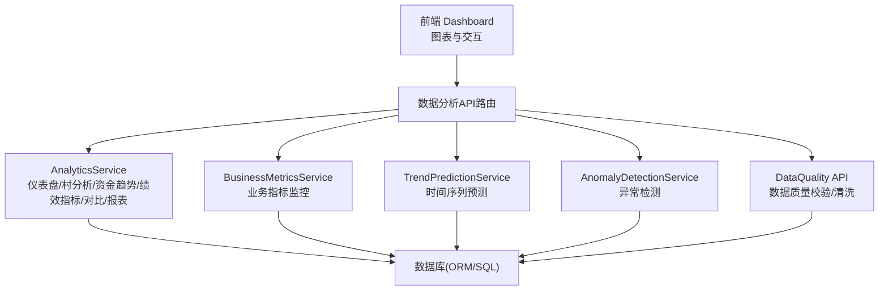
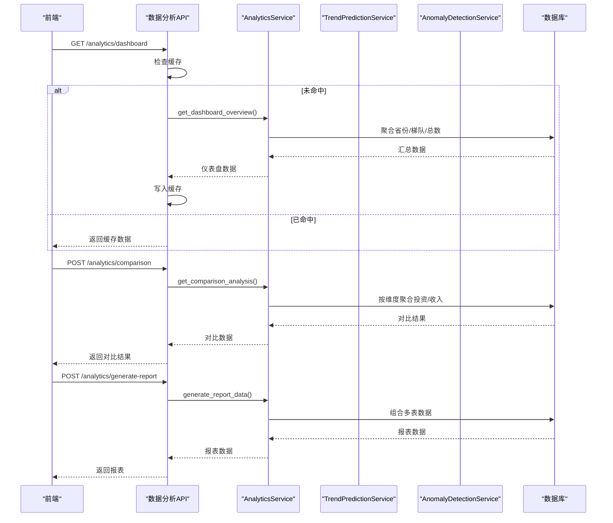
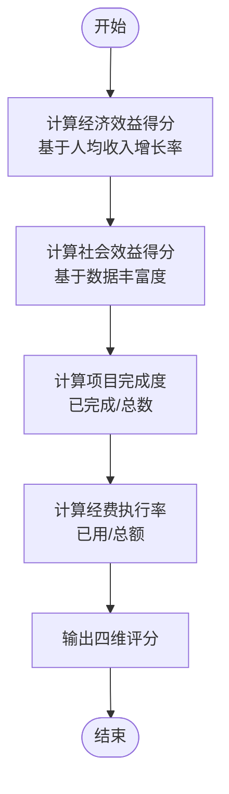
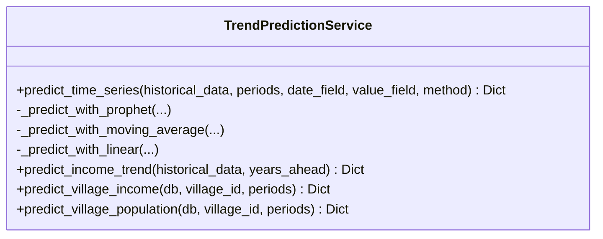
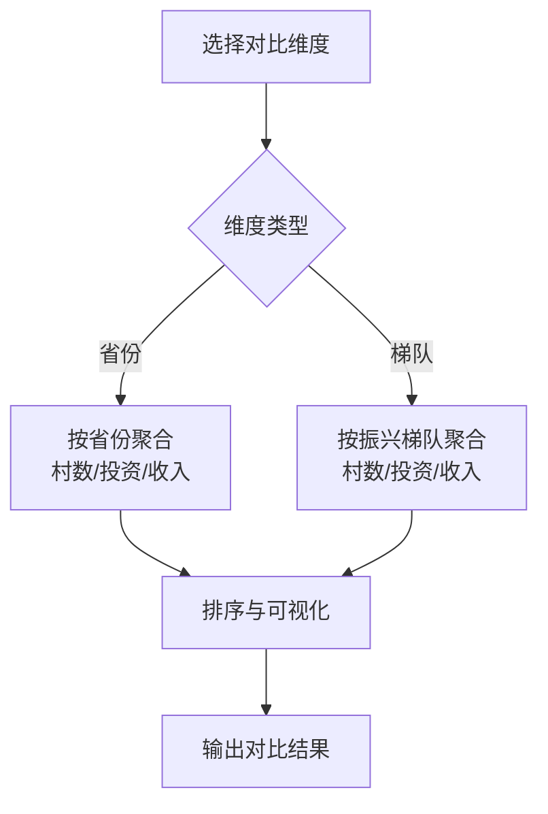
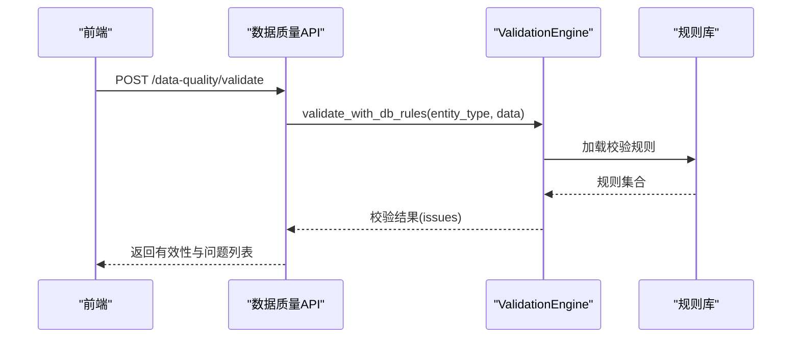
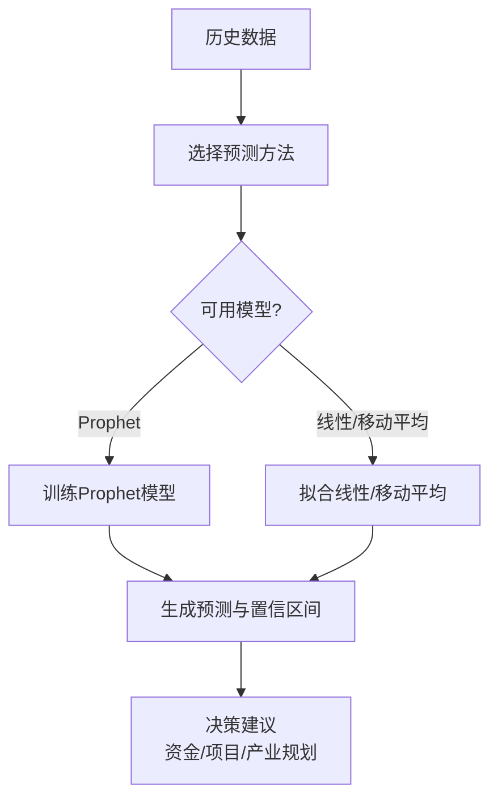
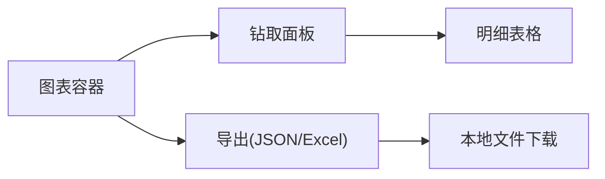
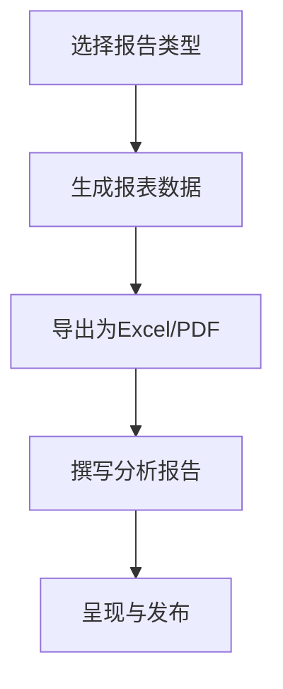
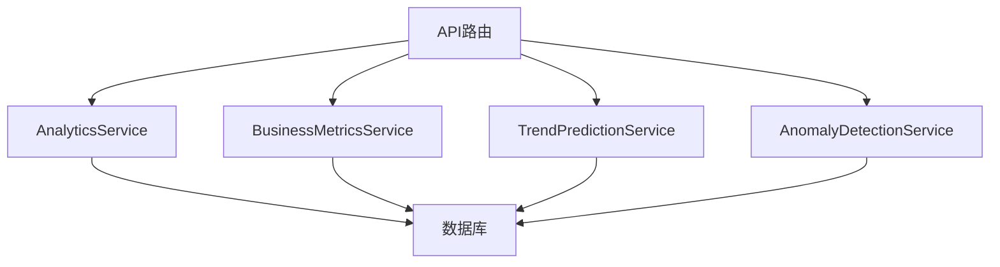

# 数据分析技巧

<cite>
**本文引用的文件**
- [backend/app/services/analytics_service.py](file://backend/app/services/analytics_service.py)
- [backend/app/api/v1/data/data/analytics.py](file://backend/app/api/v1/data/data/analytics.py)
- [backend/app/services/business_metrics_service.py](file://backend/app/services/business_metrics_service.py)
- [backend/app/services/ai/trend_prediction_service.py](file://backend/app/services/ai/trend_prediction_service.py)
- [backend/app/services/ai/anomaly_detection_service.py](file://backend/app/services/ai/anomaly_detection_service.py)
- [backend/app/api/v1/data_quality.py](file://backend/app/api/v1/data_quality.py)
- [backend/app/services/report_export_service.py](file://backend/app/services/report_export_service.py)
- [frontend/src/views/analytics/dashboard/Dashboard.vue](file://frontend/src/views/analytics/dashboard/Dashboard.vue)
- [backend/app/api/v1/assessment.py](file://backend/app/api/v1/assessment.py)
</cite>

## 目录
1. [引言](#引言)
2. [项目结构](#项目结构)
3. [核心组件](#核心组件)
4. [架构总览](#架构总览)
5. [详细组件分析](#详细组件分析)
6. [依赖关系分析](#依赖关系分析)
7. [性能考量](#性能考量)
8. [故障排查指南](#故障排查指南)
9. [结论](#结论)
10. [附录](#附录)

## 引言
本指导面向乡村振兴帮扶工作的数据分析实践，围绕经济效益、社会效益、项目完成度、经费执行率等关键指标，系统阐述趋势分析、对比分析（横向地区间与纵向时间序列）、异常检测与数据质量评估、预测分析与决策支持方法，以及数据可视化最佳实践与分析报告撰写规范。内容基于系统现有服务与接口能力，确保方法论可落地、可复用。

## 项目结构
系统采用前后端分离架构：前端提供可视化交互与报表导出；后端通过API暴露分析、预测、异常检测、数据质量校验等服务，并封装数据库查询与缓存策略，形成“展示—服务—数据”的分层体系。

**图示来源**
- [backend/app/api/v1/data/data/analytics.py:84-202](file://backend/app/api/v1/data/data/analytics.py#L84-L202)
- [backend/app/services/analytics_service.py:28-385](file://backend/app/services/analytics_service.py#L28-L385)
- [backend/app/services/business_metrics_service.py:42-371](file://backend/app/services/business_metrics_service.py#L42-L371)
- [backend/app/services/ai/trend_prediction_service.py:33-347](file://backend/app/services/ai/trend_prediction_service.py#L33-L347)
- [backend/app/services/ai/anomaly_detection_service.py:27-247](file://backend/app/services/ai/anomaly_detection_service.py#L27-L247)
- [backend/app/api/v1/data_quality.py:44-54](file://backend/app/api/v1/data_quality.py#L44-L54)

**章节来源**
- [backend/app/api/v1/data/data/analytics.py:84-202](file://backend/app/api/v1/data/data/analytics.py#L84-L202)
- [backend/app/services/analytics_service.py:28-385](file://backend/app/services/analytics_service.py#L28-L385)

## 核心组件
- 数据分析服务：提供仪表盘总览、帮扶村分析、资金趋势、绩效指标、对比分析、报表生成与导出。
- 业务指标监控：统计资金审批、资金使用、数据上报、用户活跃度、系统错误率等指标，支持Prometheus格式导出。
- 趋势预测服务：支持Prophet、移动平均、线性回归等多方法时间序列预测，具备超时回退机制。
- 异常检测服务：支持孤立森林、Z-Score、IQR等方法，并提供进度偏差等业务异常检测。
- 数据质量服务：按实体类型加载规则进行校验与清洗，返回问题明细。
- 报告导出服务：将分析结果导出为PDF/Excel等格式。

**章节来源**
- [backend/app/services/analytics_service.py:28-385](file://backend/app/services/analytics_service.py#L28-L385)
- [backend/app/services/business_metrics_service.py:42-371](file://backend/app/services/business_metrics_service.py#L42-L371)
- [backend/app/services/ai/trend_prediction_service.py:33-347](file://backend/app/services/ai/trend_prediction_service.py#L33-L347)
- [backend/app/services/ai/anomaly_detection_service.py:27-247](file://backend/app/services/ai/anomaly_detection_service.py#L27-L247)
- [backend/app/api/v1/data_quality.py:44-54](file://backend/app/api/v1/data_quality.py#L44-L54)
- [backend/app/services/report_export_service.py:430-447](file://backend/app/services/report_export_service.py#L430-L447)

## 架构总览
以下时序图展示一次典型的数据分析请求流程：前端发起请求，API路由鉴权与缓存命中判断，调用服务层计算或查询，必要时结合预测/异常检测，最终返回结构化数据供前端渲染。

**图示来源**
- [backend/app/api/v1/data/data/analytics.py:84-202](file://backend/app/api/v1/data/data/analytics.py#L84-L202)
- [backend/app/services/analytics_service.py:28-385](file://backend/app/services/analytics_service.py#L28-L385)

**章节来源**
- [backend/app/api/v1/data/data/analytics.py:84-202](file://backend/app/api/v1/data/data/analytics.py#L84-L202)
- [backend/app/services/analytics_service.py:28-385](file://backend/app/services/analytics_service.py#L28-L385)

## 详细组件分析

### 关键指标与评估体系
- 经济效益：以人均收入增长率为核心，计算增长率并映射到评分区间。
- 社会效益：基于帮扶村关联数据的丰富度与覆盖度进行评分。
- 项目完成度：按项目总数与已完成数计算完成率。
- 经费执行率：按已使用金额与总金额计算执行率。

上述指标在评估模块中统一计算并输出结构化评分，便于横向对比与趋势追踪。

**图示来源**
- [backend/app/api/v1/assessment.py:448-486](file://backend/app/api/v1/assessment.py#L448-L486)

**章节来源**
- [backend/app/api/v1/assessment.py:448-486](file://backend/app/api/v1/assessment.py#L448-L486)

### 趋势分析方法
- 时间序列预测：支持Prophet（带年度季节性）、移动平均、线性回归三种方法；当Prophet不可用时自动降级至线性回归，且具备超时保护避免阻塞。
- 指标应用：可用于村庄收入、人口、资金投放等指标的长期趋势预测，辅助资源分配与政策调整。

**图示来源**
- [backend/app/services/ai/trend_prediction_service.py:33-347](file://backend/app/services/ai/trend_prediction_service.py#L33-L347)

**章节来源**
- [backend/app/services/ai/trend_prediction_service.py:33-347](file://backend/app/services/ai/trend_prediction_service.py#L33-L347)

### 对比分析方法
- 横向对比（地区间）：按省份或振兴梯队聚合帮扶村数量、总投资额、平均收入等指标，识别区域差异与资源倾斜效果。
- 纵向对比（时间序列）：按年份聚合资金投放趋势，观察投入变化与规模效应。

**图示来源**
- [backend/app/services/analytics_service.py:292-341](file://backend/app/services/analytics_service.py#L292-L341)

**章节来源**
- [backend/app/services/analytics_service.py:292-341](file://backend/app/services/analytics_service.py#L292-L341)

### 异常检测与数据质量分析
- 异常检测：支持孤立森林、Z-Score、IQR方法，适用于数值型字段离群点检测；同时提供项目进度偏差检测（预期进度与实际进度偏差阈值）。
- 数据质量：按实体类型加载规则库进行校验，支持去重、标准化、缺失填充、空白修剪、空值归一化等清洗操作，返回问题明细与严重级别。

**图示来源**
- [backend/app/api/v1/data_quality.py:44-54](file://backend/app/api/v1/data_quality.py#L44-L54)

**章节来源**
- [backend/app/services/ai/anomaly_detection_service.py:27-247](file://backend/app/services/ai/anomaly_detection_service.py#L27-L247)
- [backend/app/api/v1/data_quality.py:44-54](file://backend/app/api/v1/data_quality.py#L44-L54)

### 预测分析与决策支持
- 预测模型选择：优先使用Prophet捕捉季节性；若环境限制则回退至线性回归或移动平均，保证可用性。
- 决策场景：基于预测结果制定下一周期资金投放计划、产业帮扶重点、基础设施投资优先级等。

**图示来源**
- [backend/app/services/ai/trend_prediction_service.py:33-90](file://backend/app/services/ai/trend_prediction_service.py#L33-L90)

**章节来源**
- [backend/app/services/ai/trend_prediction_service.py:33-90](file://backend/app/services/ai/trend_prediction_service.py#L33-L90)

### 数据可视化最佳实践与设计原则
- 图表类型：地域分布用地图/柱状图，投入构成用饼图/堆叠柱状图，年度趋势用折线图/面积图。
- 交互设计：支持钻取（如点击省份查看下属单位），响应式布局与窗口resize自适应。
- 导出能力：支持JSON/Excel导出，便于离线分析与归档。

**图示来源**
- [frontend/src/views/analytics/dashboard/Dashboard.vue:180-218](file://frontend/src/views/analytics/dashboard/Dashboard.vue#L180-L218)
- [frontend/src/views/analytics/dashboard/Dashboard.vue:879-927](file://frontend/src/views/analytics/dashboard/Dashboard.vue#L879-L927)

**章节来源**
- [frontend/src/views/analytics/dashboard/Dashboard.vue:180-218](file://frontend/src/views/analytics/dashboard/Dashboard.vue#L180-L218)
- [frontend/src/views/analytics/dashboard/Dashboard.vue:879-927](file://frontend/src/views/analytics/dashboard/Dashboard.vue#L879-L927)

### 分析报告撰写规范与呈现技巧
- 报告类型：综合报告（仪表盘+村分析+绩效）、资金专项报告、政策执行报告等。
- 内容结构：背景与目标、数据来源与方法、核心指标与趋势、对比分析、异常与风险、预测与建议。
- 呈现技巧：关键指标置顶、趋势与对比并列、异常高亮、建议可操作化。

**图示来源**
- [backend/app/services/analytics_service.py:343-385](file://backend/app/services/analytics_service.py#L343-L385)
- [backend/app/services/report_export_service.py:430-447](file://backend/app/services/report_export_service.py#L430-L447)

**章节来源**
- [backend/app/services/analytics_service.py:343-385](file://backend/app/services/analytics_service.py#L343-L385)
- [backend/app/services/report_export_service.py:430-447](file://backend/app/services/report_export_service.py#L430-L447)

## 依赖关系分析
- 服务耦合：API路由依赖AnalyticsService、BusinessMetricsService、TrendPredictionService、AnomalyDetectionService；各服务内部通过ORM/SQL访问数据库。
- 外部依赖：Prophet与scikit-learn可选安装，系统具备降级与容错机制。
- 缓存策略：分析数据与业务指标采用内存/Redis缓存，降低重复计算开销。

**图示来源**
- [backend/app/api/v1/data/data/analytics.py:84-202](file://backend/app/api/v1/data/data/analytics.py#L84-L202)
- [backend/app/services/business_metrics_service.py:42-371](file://backend/app/services/business_metrics_service.py#L42-L371)
- [backend/app/services/ai/trend_prediction_service.py:33-347](file://backend/app/services/ai/trend_prediction_service.py#L33-L347)
- [backend/app/services/ai/anomaly_detection_service.py:27-247](file://backend/app/services/ai/anomaly_detection_service.py#L27-L247)

**章节来源**
- [backend/app/api/v1/data/data/analytics.py:84-202](file://backend/app/api/v1/data/data/analytics.py#L84-L202)
- [backend/app/services/business_metrics_service.py:42-371](file://backend/app/services/business_metrics_service.py#L42-L371)

## 性能考量
- 查询优化：使用GROUP BY与条件聚合减少N+1查询；对热点数据设置缓存TTL。
- 预测稳定性：Prophet调用增加超时保护，失败时自动回退至轻量方法。
- 导出效率：批量导出采用流式处理，避免大对象驻留内存。

[本节为通用性能建议，不直接分析具体文件]

## 故障排查指南
- 趋势预测失败：检查历史数据完整性与方法可用性；关注日志中的降级提示。
- 异常检测为空：确认输入数据结构与方法参数；检查scikit-learn是否安装。
- 数据质量校验报错：核对实体类型与字段名；查看规则库配置是否正确加载。
- 缓存读取失败：检查缓存服务状态；降级为实时计算。

**章节来源**
- [backend/app/services/ai/trend_prediction_service.py:62-90](file://backend/app/services/ai/trend_prediction_service.py#L62-L90)
- [backend/app/services/ai/anomaly_detection_service.py:49-61](file://backend/app/services/ai/anomaly_detection_service.py#L49-L61)
- [backend/app/api/v1/data_quality.py:44-54](file://backend/app/api/v1/data_quality.py#L44-L54)

## 结论
本指导基于系统现有能力，构建了从指标定义、趋势与对比分析、异常检测与数据质量、预测决策到可视化与报告输出的完整方法论。通过分层服务与缓存策略，确保分析过程高效稳定；通过多种预测方法与容错机制，提升鲁棒性。建议在实际应用中结合业务场景灵活选用方法，并持续完善规则库与指标口径。

[本节为总结性内容，不直接分析具体文件]

## 附录
- 常用API路径参考：
  - 仪表盘：GET /analytics/dashboard
  - 帮扶村分析：GET /analytics/village-analysis
  - 资金趋势：GET /analytics/funding-trends
  - 绩效指标：GET /analytics/performance-metrics
  - 对比分析：POST /analytics/comparison
  - 生成报表：POST /analytics/generate-report
  - 导出数据：POST /analytics/export
  - 数据质量校验：POST /data-quality/validate

**章节来源**
- [backend/app/api/v1/data/data/analytics.py:84-202](file://backend/app/api/v1/data/data/analytics.py#L84-L202)
- [backend/app/api/v1/data_quality.py:44-54](file://backend/app/api/v1/data_quality.py#L44-L54)