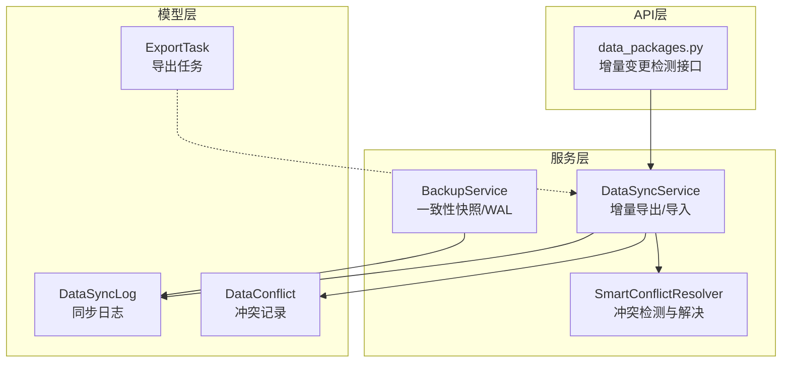
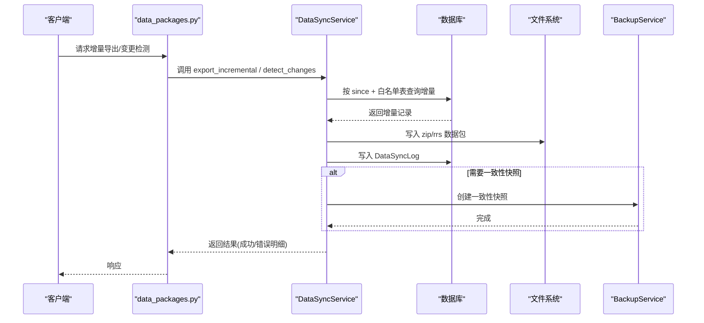
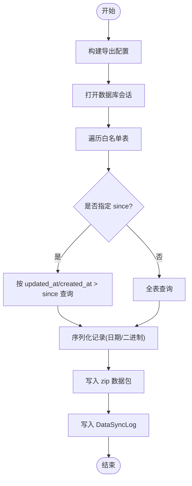
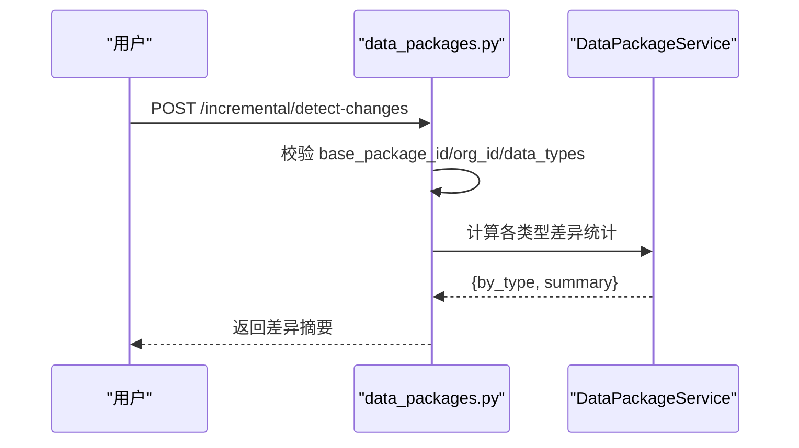
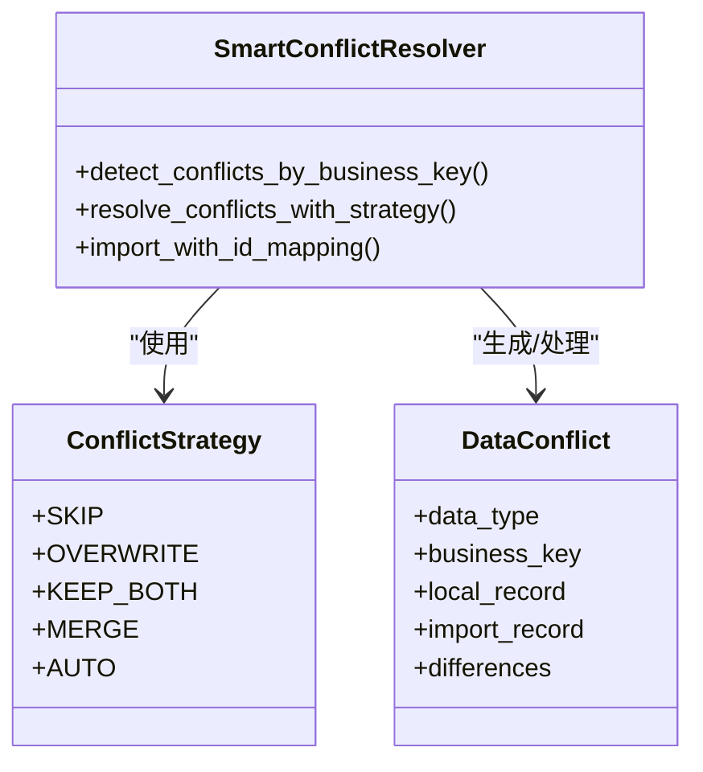
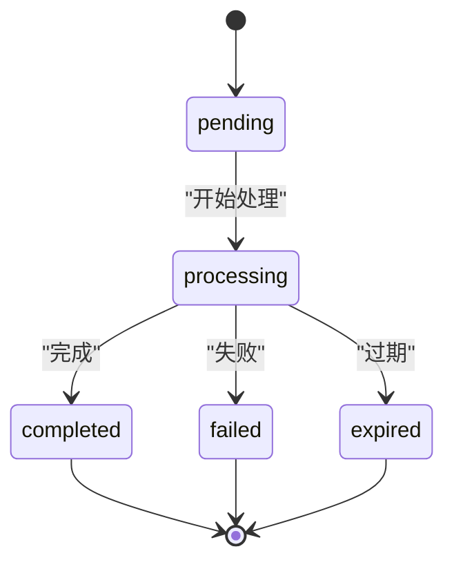
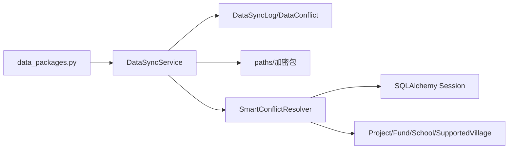

# 增量导出机制

<cite>
**本文引用的文件**
- [data_sync_service.py](file://backend/app/services/data_sync_service.py)
- [smart_conflict_resolver.py](file://backend/app/services/smart_conflict_resolver.py)
- [export_task.py](file://backend/app/models/export_task.py)
- [data_sync.py](file://backend/app/models/data_sync.py)
- [backup_service.py](file://backend/app/services/backup_service.py)
- [data_packages.py](file://backend/app/api/v1/data/data/data_packages.py)
- [test_incremental_endpoints.py](file://backend/tests/unit/test_incremental_endpoints.py)
- [test_data_sync_service.py](file://backend/tests/unit/test_data_sync_service.py)
- [test_smart_conflict_resolver.py](file://backend/tests/unit/test_smart_conflict_resolver.py)
</cite>

## 目录
1. [简介](#简介)
2. [项目结构](#项目结构)
3. [核心组件](#核心组件)
4. [架构总览](#架构总览)
5. [详细组件分析](#详细组件分析)
6. [依赖关系分析](#依赖关系分析)
7. [性能考量](#性能考量)
8. [故障排查指南](#故障排查指南)
9. [结论](#结论)
10. [附录](#附录)

## 简介
本技术文档围绕“增量导出”机制，系统阐述其原理、优势与实现细节。重点覆盖：
- 数据变更检测：基于时间戳的增量查询与版本对比
- 增量数据获取：按表白名单与 since 时间过滤导出数据
- 合并策略：导入时的冲突检测与多种解决策略（跳过、覆盖、智能合并）
- 配置与触发：导出配置对象、API 端点与权限校验
- 版本管理与冲突解决：数据包版本、差异比较与冲突记录
- 全量 vs 增量：适用场景与选择建议
- 性能监控与优化：异步导出、任务状态、资源控制
- 失败恢复与一致性：事务、日志、WAL 一致性与回滚策略

## 项目结构
与增量导出相关的后端代码主要分布在以下模块：
- 服务层：数据同步服务（增量导出/导入）、智能冲突解决器、备份服务（一致性快照/WAL）
- 模型层：导出任务模型、数据同步日志与冲突记录
- API 层：增量变更检测接口
- 测试：端到端与单元测试验证行为与边界条件

图表来源
- [data_sync_service.py:128-233](file://backend/app/services/data_sync_service.py#L128-L233)
- [smart_conflict_resolver.py:76-179](file://backend/app/services/smart_conflict_resolver.py#L76-L179)
- [backup_service.py:74-118](file://backend/app/services/backup_service.py#L74-L118)
- [export_task.py:28-80](file://backend/app/models/export_task.py#L28-L80)
- [data_sync.py:8-72](file://backend/app/models/data_sync.py#L8-L72)
- [data_packages.py:674-683](file://backend/app/api/v1/data/data/data_packages.py#L674-L683)

章节来源
- [data_sync_service.py:128-233](file://backend/app/services/data_sync_service.py#L128-L233)
- [smart_conflict_resolver.py:76-179](file://backend/app/services/smart_conflict_resolver.py#L76-L179)
- [backup_service.py:74-118](file://backend/app/services/backup_service.py#L74-L118)
- [export_task.py:28-80](file://backend/app/models/export_task.py#L28-L80)
- [data_sync.py:8-72](file://backend/app/models/data_sync.py#L8-L72)
- [data_packages.py:674-683](file://backend/app/api/v1/data/data/data_packages.py#L674-L683)

## 核心组件
- DataSyncService：提供增量导出、加密导出、导入与冲突处理；通过 since 时间进行增量查询，生成 zip 数据包并记录同步日志。
- SmartConflictResolver：基于业务唯一键检测冲突，支持 SKIP/OVERWRITE/KEEP_BOTH/MERGE/AUTO 策略，维护 ID 映射以处理外键依赖。
- BackupService：提供一致性快照与 WAL 清理，确保备份/恢复期间数据库一致性。
- ExportTask：管理异步导出任务的状态流转与下载有效期。
- DataSyncLog/DataConflict：持久化导出/导入过程与冲突详情，便于审计与回溯。
- data_packages API：提供增量变更检测接口，返回按数据类型统计的差异摘要。

章节来源
- [data_sync_service.py:76-108](file://backend/app/services/data_sync_service.py#L76-L108)
- [data_sync_service.py:128-233](file://backend/app/services/data_sync_service.py#L128-L233)
- [smart_conflict_resolver.py:17-73](file://backend/app/services/smart_conflict_resolver.py#L17-L73)
- [smart_conflict_resolver.py:179-338](file://backend/app/services/smart_conflict_resolver.py#L179-L338)
- [backup_service.py:74-118](file://backend/app/services/backup_service.py#L74-L118)
- [export_task.py:18-80](file://backend/app/models/export_task.py#L18-L80)
- [data_sync.py:8-72](file://backend/app/models/data_sync.py#L8-L72)
- [data_packages.py:664-683](file://backend/app/api/v1/data/data/data_packages.py#L664-L683)

## 架构总览
增量导出的整体流程如下：
- 客户端调用增量变更检测或增量导出接口
- 服务层根据 since 时间与表白名单执行增量查询
- 将结果打包为 zip/rrs 并落盘，写入同步日志
- 若涉及导入，则使用冲突解决器按策略合并数据
- 必要时通过备份服务创建一致性快照，保障数据一致性

图表来源
- [data_sync_service.py:128-233](file://backend/app/services/data_sync_service.py#L128-L233)
- [data_packages.py:674-683](file://backend/app/api/v1/data/data/data_packages.py#L674-L683)
- [backup_service.py:74-118](file://backend/app/services/backup_service.py#L74-L118)

## 详细组件分析

### 增量导出服务（DataSyncService）
- 导出配置：ExportConfig 包含 since、modules、include_files、用户信息
- 增量查询：_export_table_data 使用 since 时间过滤 updated_at/created_at，并按 id 排序
- 包生成：_save_export_package 将 JSON 与可选附件打包为 zip
- 日志记录：DataSyncLog 记录导出元数据、统计与错误明细
- 错误处理：单表异常不中断整体流程，errors 字段汇总失败表及原因

图表来源
- [data_sync_service.py:128-233](file://backend/app/services/data_sync_service.py#L128-L233)
- [data_sync_service.py:235-273](file://backend/app/services/data_sync_service.py#L235-L273)
- [data_sync_service.py:275-302](file://backend/app/services/data_sync_service.py#L275-L302)
- [data_sync.py:8-42](file://backend/app/models/data_sync.py#L8-L42)

章节来源
- [data_sync_service.py:76-108](file://backend/app/services/data_sync_service.py#L76-L108)
- [data_sync_service.py:128-233](file://backend/app/services/data_sync_service.py#L128-L233)
- [data_sync_service.py:235-302](file://backend/app/services/data_sync_service.py#L235-L302)
- [data_sync.py:8-42](file://backend/app/models/data_sync.py#L8-L42)

### 增量变更检测（API）
- 接口：POST /incremental/detect-changes
- 参数：base_package_id、org_id、data_types
- 功能：对比基准包后各数据类型的新增、修改、删除数量，返回 by_type 与 total 汇总
- 权限：组织访问校验，缺失 base_package_id 返回 422，无权限返回 403，包不存在返回 404

图表来源
- [data_packages.py:664-683](file://backend/app/api/v1/data/data/data_packages.py#L664-L683)
- [test_incremental_endpoints.py:112-165](file://backend/tests/unit/test_incremental_endpoints.py#L112-L165)

章节来源
- [data_packages.py:664-683](file://backend/app/api/v1/data/data/data_packages.py#L664-L683)
- [test_incremental_endpoints.py:112-165](file://backend/tests/unit/test_incremental_endpoints.py#L112-L165)

### 冲突检测与合并策略（SmartConflictResolver）
- 业务键：villages/projects/funds/schools 分别定义唯一键
- 冲突检测：detect_conflicts_by_business_key 比较本地与导入记录差异
- 策略：
  - SKIP：保留本地
  - OVERWRITE：用导入覆盖
  - KEEP_BOTH：新建记录（调整业务键避免重复）
  - MERGE：智能合并（优先非空值，较新 updated_at 覆盖）
  - AUTO：自动选择（差异少→MERGE；updated_at 决定 SKIP/OVERWRITE；默认 MERGE）
- ID 映射：import_with_id_mapping 维护旧ID到新ID映射，更新外键引用

图表来源
- [smart_conflict_resolver.py:17-73](file://backend/app/services/smart_conflict_resolver.py#L17-L73)
- [smart_conflict_resolver.py:76-179](file://backend/app/services/smart_conflict_resolver.py#L76-L179)
- [smart_conflict_resolver.py:179-338](file://backend/app/services/smart_conflict_resolver.py#L179-L338)
- [smart_conflict_resolver.py:340-459](file://backend/app/services/smart_conflict_resolver.py#L340-L459)

章节来源
- [smart_conflict_resolver.py:17-73](file://backend/app/services/smart_conflict_resolver.py#L17-L73)
- [smart_conflict_resolver.py:76-179](file://backend/app/services/smart_conflict_resolver.py#L76-L179)
- [smart_conflict_resolver.py:179-338](file://backend/app/services/smart_conflict_resolver.py#L179-L338)
- [smart_conflict_resolver.py:340-459](file://backend/app/services/smart_conflict_resolver.py#L340-L459)
- [test_smart_conflict_resolver.py:226-337](file://backend/tests/unit/test_smart_conflict_resolver.py#L226-L337)

### 导出任务与异步导出（ExportTask）
- 状态机：pending → processing → completed/failed/expired
- 指标：record_count、file_size、expires_at
- 用途：大文件后台导出与进度追踪，配合任务队列执行

图表来源
- [export_task.py:18-80](file://backend/app/models/export_task.py#L18-L80)

章节来源
- [export_task.py:18-80](file://backend/app/models/export_task.py#L18-L80)

### 一致性快照与 WAL（BackupService）
- 路径解析：从当前会话绑定 URL 解析真实数据库路径，避免打包/恢复错位
- 一致性：创建快照时合并 WAL，保证备份一致性
- 安全：解密到临时文件，避免破坏原始加密备份

章节来源
- [backup_service.py:74-118](file://backend/app/services/backup_service.py#L74-L118)

## 依赖关系分析
- DataSyncService 依赖：
  - 数据库会话（get_db）
  - 模型 DataSyncLog、DataConflict
  - 工具 paths（应用数据目录、上传目录）
  - 加密包 create_encrypted_package/extract_encrypted_package（用于 .rrs）
- SmartConflictResolver 依赖：
  - SQLAlchemy Session
  - 模型 Project/Fund/School/SupportedVillage
- API 层依赖：
  - 权限服务 OrganizationPermissionService
  - 数据服务 DataPackageService

图表来源
- [data_sync_service.py:128-233](file://backend/app/services/data_sync_service.py#L128-L233)
- [smart_conflict_resolver.py:76-179](file://backend/app/services/smart_conflict_resolver.py#L76-L179)
- [data_packages.py:674-683](file://backend/app/api/v1/data/data/data_packages.py#L674-L683)

章节来源
- [data_sync_service.py:128-233](file://backend/app/services/data_sync_service.py#L128-L233)
- [smart_conflict_resolver.py:76-179](file://backend/app/services/smart_conflict_resolver.py#L76-L179)
- [data_packages.py:674-683](file://backend/app/api/v1/data/data/data_packages.py#L674-L683)

## 性能考量
- 增量查询优化：
  - 使用 since 时间过滤减少扫描范围
  - 按 id 排序提升稳定性
- 包大小控制：
  - 选择性导出 modules 列表限制表范围
  - include_files 控制是否打包附件
- 异步导出：
  - 大文件使用异步任务，避免阻塞请求
  - 任务状态可追踪，支持下载过期控制
- 资源保护：
  - 白名单表防止 SQL 注入
  - 敏感表禁止导入（users/machine_codes/audit_logs）
- 监控指标：
  - DataSyncLog.total_records、success_records、failed_records
  - ExportTask.record_count、file_size、status

章节来源
- [data_sync_service.py:128-233](file://backend/app/services/data_sync_service.py#L128-L233)
- [export_task.py:18-80](file://backend/app/models/export_task.py#L18-L80)
- [data_sync.py:8-42](file://backend/app/models/data_sync.py#L8-L42)

## 故障排查指南
- 导出失败：
  - 检查 DataSyncLog.status 与 details.errors
  - 确认 since 时间格式与时区
  - 验证表名在白名单中
- 导入冲突：
  - 查看 DataConflict 列表，按 resolution 策略处理
  - 使用 resolve_conflict 接口手动解决（keep_local/use_import/merge）
- 一致性异常：
  - 使用 BackupService 创建一致性快照后再恢复
  - 检查 WAL 文件是否被正确清理
- 权限问题：
  - 增量变更检测需具备组织访问权限
  - 缺失 base_package_id 会返回 422

章节来源
- [data_sync_service.py:128-233](file://backend/app/services/data_sync_service.py#L128-L233)
- [data_sync_service.py:515-574](file://backend/app/services/data_sync_service.py#L515-L574)
- [backup_service.py:74-118](file://backend/app/services/backup_service.py#L74-L118)
- [test_incremental_endpoints.py:112-165](file://backend/tests/unit/test_incremental_endpoints.py#L112-L165)

## 结论
增量导出机制通过 since 时间过滤、表白名单、冲突策略与一致性快照，实现了高效、安全、可追溯的数据导出与同步。相比全量导出，增量方式显著降低带宽与存储开销，适合频繁变更的业务场景。结合异步导出与任务状态追踪，可在大数据量下保持系统稳定性。建议在生产环境中启用增量导出，并配合备份服务与监控指标，确保数据一致性与可运维性。

## 附录
- 配置项参考：
  - ExportConfig.since：增量起始时间
  - ExportConfig.modules：导出表列表
  - ExportConfig.include_files：是否包含附件
  - 冲突策略：skip/overwrite/merge/manual
- 关键接口：
  - POST /incremental/detect-changes：增量变更检测
  - DataSyncService.export_incremental：增量导出
  - DataSyncService.import_package：导入数据包
  - DataSyncService.resolve_conflict：解决冲突

章节来源
- [data_sync_service.py:76-108](file://backend/app/services/data_sync_service.py#L76-L108)
- [data_sync_service.py:128-233](file://backend/app/services/data_sync_service.py#L128-L233)
- [data_packages.py:664-683](file://backend/app/api/v1/data/data/data_packages.py#L664-L683)
- [test_data_sync_service.py:82-144](file://backend/tests/unit/test_data_sync_service.py#L82-L144)