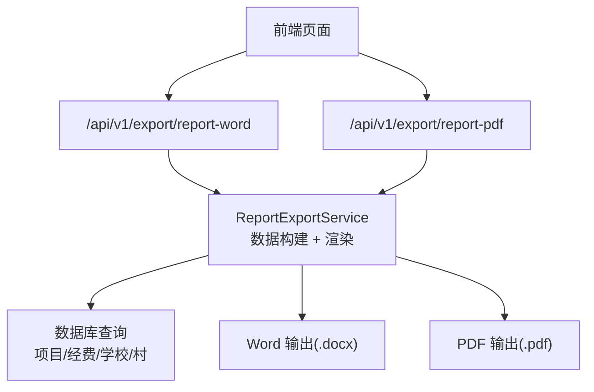
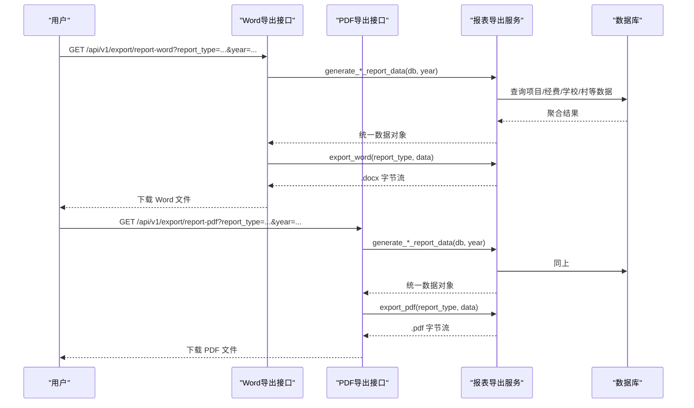
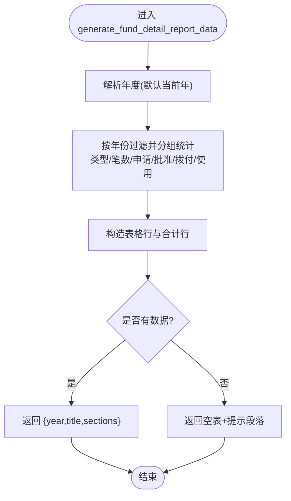
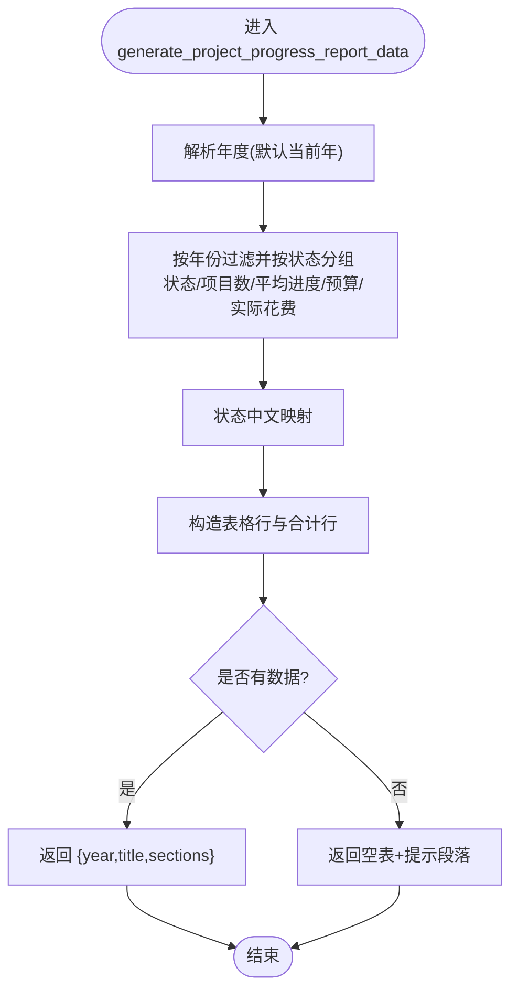
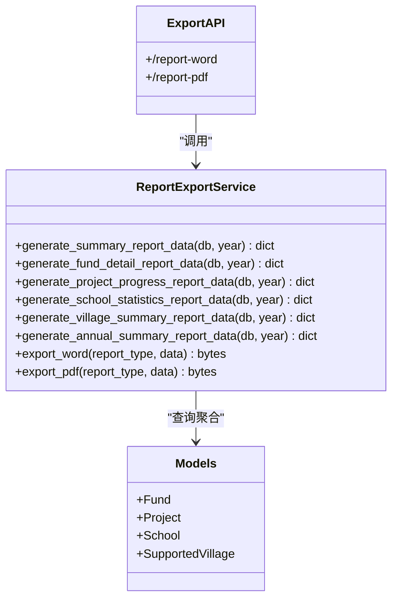

# 官方报表导出

<cite>
**本文引用的文件**
- [report_export_service.py](file://backend/app/services/report_export_service.py)
- [export.py](file://backend/app/api/v1/import_export/export.py)
- [report_template.py](file://backend/app/models/report_template.py)
- [report_templates.py](file://backend/app/api/v1/report_templates.py)
- [test_report_export_service.py](file://backend/tests/unit/test_report_export_service.py)
- [test_export.py](file://backend/tests/unit/test_export.py)
</cite>

## 目录
1. [简介](#简介)
2. [项目结构](#项目结构)
3. [核心组件](#核心组件)
4. [架构总览](#架构总览)
5. [详细组件分析](#详细组件分析)
6. [依赖关系分析](#依赖关系分析)
7. [性能与格式特性](#性能与格式特性)
8. [使用场景与最佳实践](#使用场景与最佳实践)
9. [常见问题与排障](#常见问题与排障)
10. [结论](#结论)

## 简介
本指南面向需要生成和导出“官方报表”的用户与实施人员，系统提供以下官方报表类型：
- 年度帮扶工作总结
- 帮扶资金拨付明细表
- 帮扶项目进度统计表
- 帮扶学校统计表
- 帮扶村年度汇总表
- 年度综合总结报告

每种报表支持 Word（.docx）与 PDF（.pdf）两种导出格式。本文说明各报表的内容结构、数据范围、生成方式、模板定制方法、样式调整选项、使用场景与最佳实践，并汇总常见问题及解决方法。

## 项目结构
官方报表导出由后端服务层统一实现，API 层负责权限校验、参数解析与响应封装；前端通过调用 API 触发导出。

图表来源
- [export.py:376-449](file://backend/app/api/v1/import_export/export.py#L376-L449)
- [report_export_service.py:318-443](file://backend/app/services/report_export_service.py#L318-L443)

章节来源
- [export.py:376-449](file://backend/app/api/v1/import_export/export.py#L376-L449)
- [report_export_service.py:318-443](file://backend/app/services/report_export_service.py#L318-L443)

## 核心组件
- 报表导出服务 ReportExportService：集中实现数据构建与渲染，统一数据结构 {"year", "title", "sections"}，空数据时输出“暂无数据”提示而非空文件。
- 导出 API：/report-word 与 /report-pdf，仅管理员可访问，按 report_type 路由到对应数据构建器，再调用 export_word/export_pdf。
- 报表模板模型与 API：用于导入/导出 Excel 模板管理，支持字段映射与格式配置，便于扩展自定义报表。

章节来源
- [report_export_service.py:1-448](file://backend/app/services/report_export_service.py#L1-L448)
- [export.py:366-449](file://backend/app/api/v1/import_export/export.py#L366-L449)
- [report_template.py:1-73](file://backend/app/models/report_template.py#L1-L73)
- [report_templates.py:1-503](file://backend/app/api/v1/report_templates.py#L1-L503)

## 架构总览

图表来源
- [export.py:376-449](file://backend/app/api/v1/import_export/export.py#L376-L449)
- [report_export_service.py:318-443](file://backend/app/services/report_export_service.py#L318-L443)

## 详细组件分析

### 官方报表类型与内容结构
- 年度帮扶工作总结：合并“帮扶村概况、帮扶学校概况、帮扶项目进展、帮扶资金执行”四大板块，适合年度汇报与归档。
- 帮扶资金拨付明细表：按经费类型分组，统计笔数、申请金额、批准金额、拨付金额、使用金额，并附合计行。
- 帮扶项目进度统计表：按项目状态分组，统计项目数、平均进度、预算金额、实际花费，并附合计行。
- 帮扶学校统计表：统计在册学校数量、在校学生人数、教职工人数。
- 帮扶村年度汇总表：统计在册帮扶村总数。
- 年度综合总结报告：将上述四块整合为一份综合性报告。

数据约定：所有报表返回统一结构 {"year", "title", "sections"}，每个 section 包含标题、段落列表与可选表格（headers/rows）。空数据时自动插入“暂无数据”段落，保证正式文档完整性。

章节来源
- [report_export_service.py:17-25](file://backend/app/services/report_export_service.py#L17-L25)
- [report_export_service.py:55-88](file://backend/app/services/report_export_service.py#L55-L88)
- [report_export_service.py:90-146](file://backend/app/services/report_export_service.py#L90-L146)
- [report_export_service.py:148-208](file://backend/app/services/report_export_service.py#L148-L208)
- [report_export_service.py:210-276](file://backend/app/services/report_export_service.py#L210-L276)
- [report_export_service.py:278-300](file://backend/app/services/report_export_service.py#L278-L300)

### Word 与 PDF 导出格式特点
- Word（python-docx）
  - 标题居中黑体，正文宋体，表格带网格样式，页眉标注年度与生成时间。
  - 适合二次编辑、排版与打印。
- PDF（reportlab）
  - 内置中文字体 STSong-Light，无需额外字体文件。
  - A4 纸张，固定边距，表格带边框与背景色，数字列右对齐，适合正式归档与分发。

章节来源
- [report_export_service.py:318-368](file://backend/app/services/report_export_service.py#L318-L368)
- [report_export_service.py:370-443](file://backend/app/services/report_export_service.py#L370-L443)

### 数据构建流程（以“帮扶资金拨付明细表”为例）

图表来源
- [report_export_service.py:90-146](file://backend/app/services/report_export_service.py#L90-L146)

章节来源
- [report_export_service.py:90-146](file://backend/app/services/report_export_service.py#L90-L146)

### 数据构建流程（以“帮扶项目进度统计表”为例）

图表来源
- [report_export_service.py:148-208](file://backend/app/services/report_export_service.py#L148-L208)

章节来源
- [report_export_service.py:148-208](file://backend/app/services/report_export_service.py#L148-L208)

### 模板定制与样式调整
- 模板模型 ReportTemplate：支持定义字段映射 fields（JSON）与格式配置 format_config（JSON），可用于导入/导出 Excel 模板。
- 模板 API：提供创建、更新、删除、下载模板等功能；下载时根据 fields 自动生成带样式的 Excel 模板（绿色表头、必填标注等）。
- 样式调整：可通过 format_config 控制纸张大小、页眉页脚、列宽等；字段映射决定导出/导入的列与数据库字段对应关系。

章节来源
- [report_template.py:26-73](file://backend/app/models/report_template.py#L26-L73)
- [report_templates.py:38-107](file://backend/app/api/v1/report_templates.py#L38-L107)
- [report_templates.py:446-503](file://backend/app/api/v1/report_templates.py#L446-L503)

### 使用入口与权限
- Word 导出：GET /api/v1/export/report-word
- PDF 导出：GET /api/v1/export/report-pdf
- 参数：report_type（summary/fund_detail/project_progress/school_statistics/village_summary/annual_summary）、year（可选，默认当前年）
- 权限：仅管理员可导出（非管理员返回 403）

章节来源
- [export.py:376-449](file://backend/app/api/v1/import_export/export.py#L376-L449)
- [test_export.py:560-576](file://backend/tests/unit/test_export.py#L560-L576)

## 依赖关系分析

图表来源
- [report_export_service.py:46-300](file://backend/app/services/report_export_service.py#L46-L300)
- [export.py:376-449](file://backend/app/api/v1/import_export/export.py#L376-L449)

章节来源
- [report_export_service.py:46-300](file://backend/app/services/report_export_service.py#L46-L300)
- [export.py:376-449](file://backend/app/api/v1/import_export/export.py#L376-L449)

## 性能与格式特性
- 数据聚合：采用 SQL 分组聚合减少内存占用，提升大数据量下的报表生成效率。
- 空数据处理：无数据时仍输出含提示段落的正式文档，避免空文件导致归档问题。
- 字体与排版：PDF 使用内置 CID 中文字体，避免环境差异导致的乱码；Word 设置中文字体与表格样式，确保跨平台显示一致。
- 文件大小：PDF 体积稳定，适合邮件附件与归档；Word 便于后续编辑与二次加工。

[本节为通用指导，不直接分析具体文件]

## 使用场景与最佳实践
- 年度帮扶工作总结：适用于年终总结、上级汇报、档案留存。建议每年固定时间导出并归档。
- 帮扶资金拨付明细表：财务对账、审计备查。建议按月或季度导出，保留历史版本。
- 帮扶项目进度统计表：项目管理例会、进度跟踪。建议按项目阶段导出，关注异常项目。
- 帮扶学校统计表：教育帮扶成效评估。建议结合年度目标进行对比分析。
- 帮扶村年度汇总表：区域帮扶覆盖度评估。建议与项目、资金数据联动分析。
- 年度综合总结报告：高层决策参考。建议与其他专题报告组合成年度报告集。

最佳实践
- 明确年度范围：导出前确认 year 参数，避免跨年数据混淆。
- 权限合规：仅管理员可导出，建议最小化授权。
- 版本管理：导出文件命名包含年份与类型，便于检索与归档。
- 数据质量：定期校验基础数据完整性，避免因缺失导致报表为空。

[本节为通用指导，不直接分析具体文件]

## 常见问题与排障
- 不支持的报告类型
  - 现象：调用导出接口返回 400，提示“不支持的报告类型”。
  - 原因：report_type 不在允许列表中。
  - 处理：检查 report_type 取值（summary/fund_detail/project_progress/school_statistics/village_summary/annual_summary）。
- 权限不足
  - 现象：非管理员调用导出接口返回 403。
  - 原因：导出功能限制为管理员。
  - 处理：使用管理员账号或申请相应权限。
- 数据库查询失败
  - 现象：报表内容为空或提示“数据查询失败”。
  - 原因：底层数据表异常或权限过滤导致无数据。
  - 处理：检查数据库连接、数据权限与基础数据是否完整。
- 中文字体显示异常（PDF）
  - 现象：PDF 中文显示为方块或乱码。
  - 原因：运行环境未注册中文字体。
  - 处理：服务已内置 STSong-Light 字体注册，若仍异常请检查运行时字体库可用性。
- 空数据导出
  - 现象：导出的文档包含“本年度暂无相关数据”段落。
  - 原因：指定年度无匹配记录。
  - 处理：确认年度范围与数据录入情况。

章节来源
- [export.py:388-389](file://backend/app/api/v1/import_export/export.py#L388-L389)
- [export.py:424-427](file://backend/app/api/v1/import_export/export.py#L424-L427)
- [report_export_service.py:140-146](file://backend/app/services/report_export_service.py#L140-L146)
- [report_export_service.py:202-208](file://backend/app/services/report_export_service.py#L202-L208)
- [report_export_service.py:380-381](file://backend/app/services/report_export_service.py#L380-L381)
- [report_export_service.py:430-431](file://backend/app/services/report_export_service.py#L430-L431)
- [test_export.py:489-498](file://backend/tests/unit/test_export.py#L489-L498)
- [test_export.py:550-576](file://backend/tests/unit/test_export.py#L550-L576)

## 结论
官方报表导出模块以统一的数据结构与渲染逻辑，提供稳定、规范的 Word/PDF 导出能力，覆盖年度总结、资金明细、项目进度等关键业务场景。通过模板管理与字段映射，可灵活扩展自定义报表。建议结合权限控制、数据质量治理与版本归档，形成闭环的报表管理体系。

[本节为总结性内容，不直接分析具体文件]