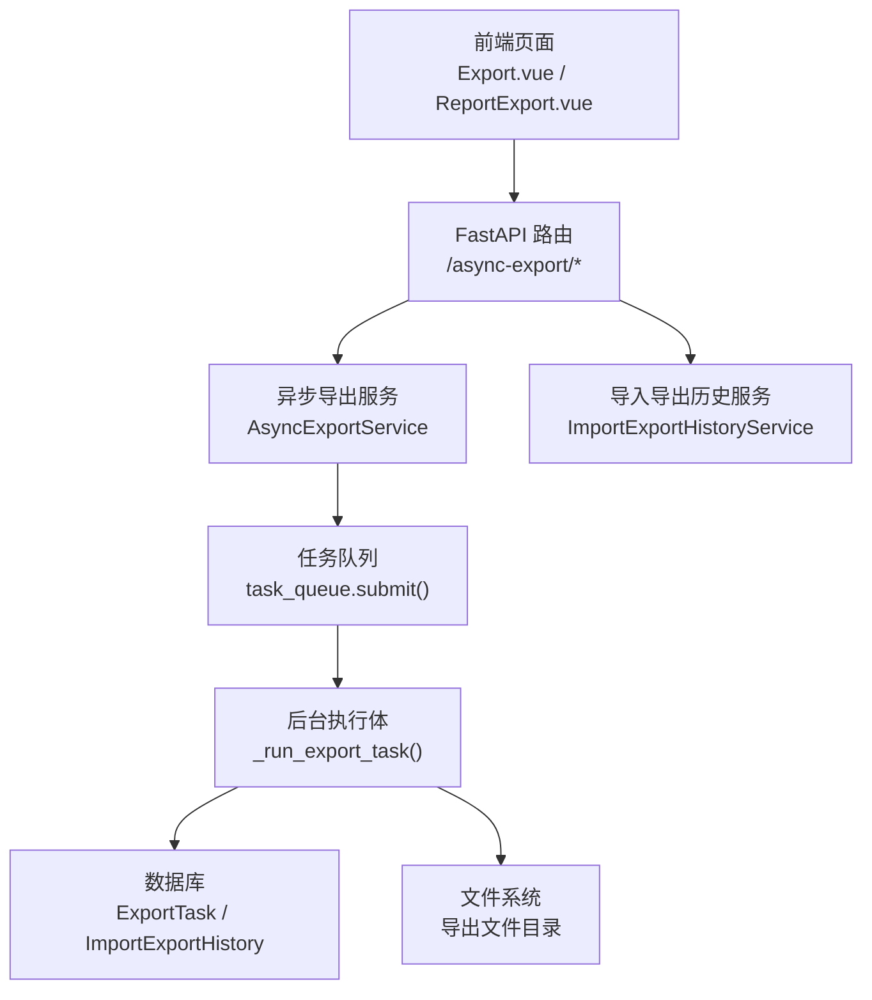
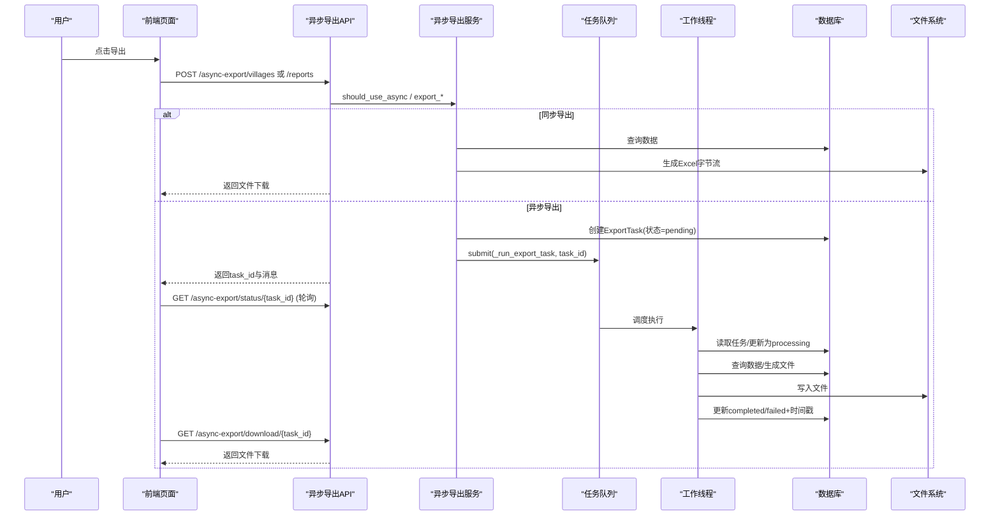
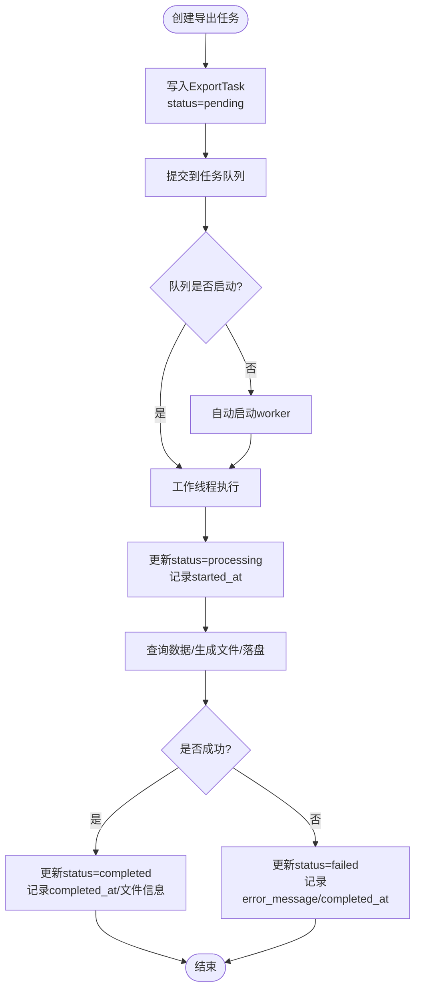
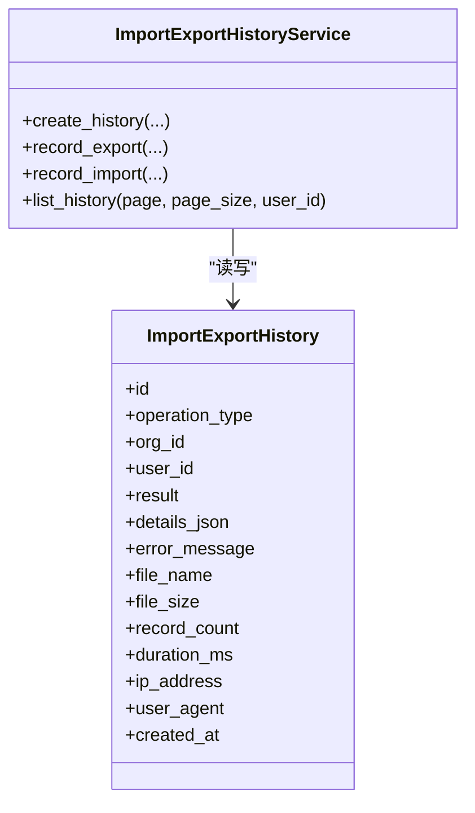
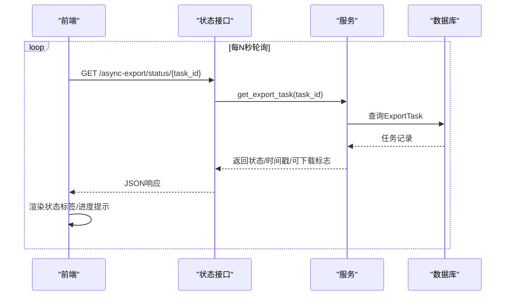
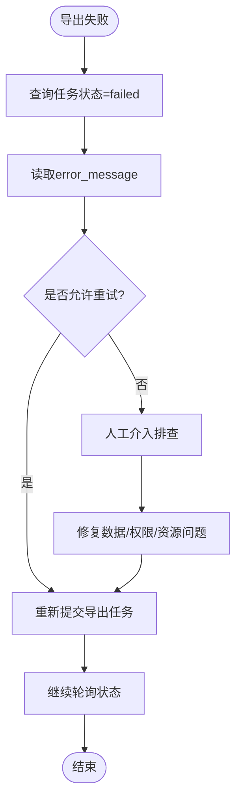
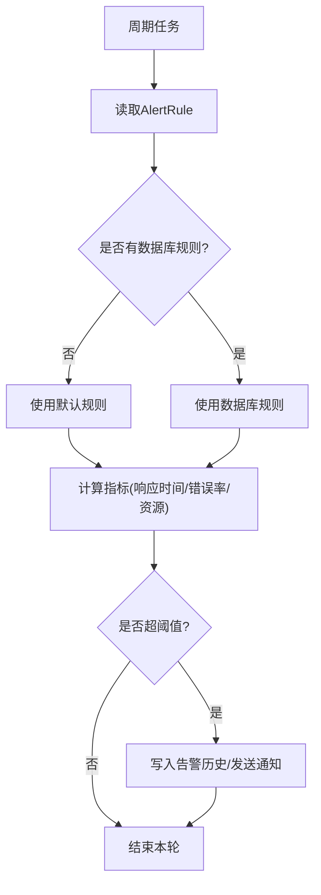
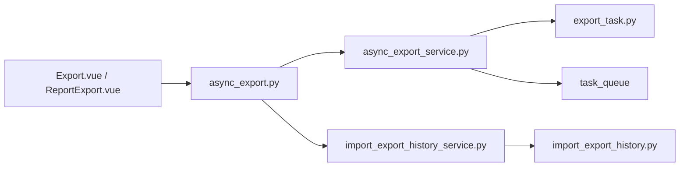

# 导出任务监控

<cite>
**本文引用的文件**
- [export_task.py](file://backend/app/models/export_task.py)
- [async_export_service.py](file://backend/app/services/async_export_service.py)
- [async_export.py](file://backend/app/api/v1/import_export/async_export.py)
- [import_export_history.py](file://backend/app/models/import_export_history.py)
- [import_export_history_service.py](file://backend/app/services/import_export_history_service.py)
- [Export.vue](file://frontend/src/views/dataSync/Export.vue)
- [ReportExport.vue](file://frontend/src/views/export/ReportExport.vue)
- [monitor.py](file://backend/app/api/v1/system/monitor.py)
- [monitoring_service.py](file://backend/app/services/monitoring_service.py)
</cite>

## 目录
1. [简介](#简介)
2. [项目结构](#项目结构)
3. [核心组件](#核心组件)
4. [架构总览](#架构总览)
5. [详细组件分析](#详细组件分析)
6. [依赖关系分析](#依赖关系分析)
7. [性能考虑](#性能考虑)
8. [故障排查指南](#故障排查指南)
9. [结论](#结论)
10. [附录](#附录)

## 简介
本手册面向系统使用者与运维人员，系统化说明“导出任务监控”功能的使用方法与管理要点。内容覆盖：
- 导出任务生命周期管理：创建、执行状态跟踪、完成通知
- 导出历史查询：历史记录查看、状态过滤、下载管理
- 任务进度显示与实时状态更新机制
- 导出失败处理流程：错误信息查看、重试机制、人工干预方法
- 导出性能监控与告警配置指南

## 项目结构
后端围绕“异步导出服务 + 任务模型 + API 端点 + 导入导出历史”构建；前端提供导出页面、历史列表与下载操作。

**图表来源**
- [async_export.py:100-333](file://backend/app/api/v1/import_export/async_export.py#L100-L333)
- [async_export_service.py:330-516](file://backend/app/services/async_export_service.py#L330-L516)
- [import_export_history_service.py:1-255](file://backend/app/services/import_export_history_service.py#L1-L255)
- [Export.vue:119-147](file://frontend/src/views/dataSync/Export.vue#L119-L147)
- [ReportExport.vue:182-214](file://frontend/src/views/export/ReportExport.vue#L182-L214)

**章节来源**
- [async_export.py:100-333](file://backend/app/api/v1/import_export/async_export.py#L100-L333)
- [async_export_service.py:330-516](file://backend/app/services/async_export_service.py#L330-L516)
- [import_export_history_service.py:1-255](file://backend/app/services/import_export_history_service.py#L1-L255)
- [Export.vue:119-147](file://frontend/src/views/dataSync/Export.vue#L119-L147)
- [ReportExport.vue:182-214](file://frontend/src/views/export/ReportExport.vue#L182-L214)

## 核心组件
- 导出任务模型 ExportTask：定义任务状态（待处理/处理中/已完成/失败/已过期）、文件元数据、时间戳与可下载判定逻辑
- 异步导出服务 AsyncExportService：负责同步/异步导出决策、真实数据查询、工作簿生成、落盘、任务提交与查询
- 异步导出 API：提供报表导出、帮扶村导出、任务状态查询、文件下载、任务列表分页与筛选
- 导入导出历史：记录导出/导入等操作审计信息，支持按用户/组织/结果等维度查询
- 前端导出与历史界面：展示导出历史、状态标签、文件大小、下载按钮等

**章节来源**
- [export_task.py:18-121](file://backend/app/models/export_task.py#L18-L121)
- [async_export_service.py:390-516](file://backend/app/services/async_export_service.py#L390-L516)
- [async_export.py:100-333](file://backend/app/api/v1/import_export/async_export.py#L100-L333)
- [import_export_history.py:19-120](file://backend/app/models/import_export_history.py#L19-L120)
- [import_export_history_service.py:27-255](file://backend/app/services/import_export_history_service.py#L27-L255)
- [Export.vue:119-147](file://frontend/src/views/dataSync/Export.vue#L119-L147)
- [ReportExport.vue:182-214](file://frontend/src/views/export/ReportExport.vue#L182-L214)

## 架构总览
导出任务从前端发起，后端根据数据量阈值选择同步或异步模式。异步模式下，任务进入队列由独立会话执行，完成后写回任务状态并落盘文件；前端通过状态接口轮询获取进度与结果，并在可下载时触发下载。

**图表来源**
- [async_export.py:150-333](file://backend/app/api/v1/import_export/async_export.py#L150-L333)
- [async_export_service.py:330-516](file://backend/app/services/async_export_service.py#L330-L516)

## 详细组件分析

### 导出任务生命周期管理
- 任务创建：API 接收请求后，若判断为异步导出，则创建 ExportTask 记录（状态 pending），并立即提交到任务队列
- 执行跟踪：工作线程将任务状态置为 processing，记录开始时间；完成后置为 completed，记录完成时间与文件信息；异常时置为 failed，记录错误信息
- 完成通知：前端通过状态接口轮询获取最新状态；当 is_downloadable 为真时可下载文件

**图表来源**
- [async_export_service.py:330-388](file://backend/app/services/async_export_service.py#L330-L388)
- [async_export_service.py:454-481](file://backend/app/services/async_export_service.py#L454-L481)
- [export_task.py:58-121](file://backend/app/models/export_task.py#L58-L121)

**章节来源**
- [async_export_service.py:330-516](file://backend/app/services/async_export_service.py#L330-L516)
- [export_task.py:18-121](file://backend/app/models/export_task.py#L18-L121)
- [async_export.py:201-333](file://backend/app/api/v1/import_export/async_export.py#L201-L333)

### 导出历史查询功能
- 历史记录查看：前端在数据同步与报表导出页面展示历史表格，包含文件名/大小/时间/操作人等字段
- 状态过滤：后端任务列表接口支持按 status 筛选，便于快速定位失败或进行中的任务
- 下载管理：历史行提供下载按钮，仅对 completed 且未过期的任务开放

**图表来源**
- [import_export_history.py:19-120](file://backend/app/models/import_export_history.py#L19-L120)
- [import_export_history_service.py:27-255](file://backend/app/services/import_export_history_service.py#L27-L255)

**章节来源**
- [import_export_history.py:19-120](file://backend/app/models/import_export_history.py#L19-L120)
- [import_export_history_service.py:27-255](file://backend/app/services/import_export_history_service.py#L27-L255)
- [Export.vue:119-147](file://frontend/src/views/dataSync/Export.vue#L119-L147)
- [ReportExport.vue:182-214](file://frontend/src/views/export/ReportExport.vue#L182-L214)

### 任务进度显示与实时状态更新机制
- 进度来源：当前实现以任务状态为主（pending/processing/completed/failed/expired），并通过 is_downloadable 指示可下载性
- 实时刷新：前端通过定时轮询 /async-export/status/{task_id} 获取最新状态，直至 completed 或 failed
- 扩展建议：如需更细粒度进度（如百分比），可在任务执行过程中周期性更新 ExportTask 的自定义字段或通过任务队列进度能力上报

**图表来源**
- [async_export.py:201-238](file://backend/app/api/v1/import_export/async_export.py#L201-L238)
- [async_export_service.py:485-516](file://backend/app/services/async_export_service.py#L485-L516)
- [export_task.py:85-121](file://backend/app/models/export_task.py#L85-L121)

**章节来源**
- [async_export.py:201-238](file://backend/app/api/v1/import_export/async_export.py#L201-L238)
- [async_export_service.py:485-516](file://backend/app/services/async_export_service.py#L485-L516)
- [export_task.py:85-121](file://backend/app/models/export_task.py#L85-L121)

### 导出失败处理流程
- 错误信息查看：任务状态为 failed 时，可通过状态接口获取 error_message
- 重试机制：
  - 前端网络层具备 ERR_NETWORK 自动重试能力（非测试环境）
  - 业务侧可对失败任务提供“重新提交”入口，调用创建任务的相同接口
- 人工干预：
  - 检查任务是否存在、权限是否足够
  - 检查导出文件路径与磁盘空间
  - 检查数据源权限与筛选条件是否合理
  - 必要时重启任务队列 worker 或调整阈值

**图表来源**
- [async_export.py:241-288](file://backend/app/api/v1/import_export/async_export.py#L241-L288)
- [async_export_service.py:375-388](file://backend/app/services/async_export_service.py#L375-L388)

**章节来源**
- [async_export.py:241-288](file://backend/app/api/v1/import_export/async_export.py#L241-L288)
- [async_export_service.py:375-388](file://backend/app/services/async_export_service.py#L375-L388)

### 导出性能监控与告警配置
- 监控指标：
  - 响应时间、错误率、资源使用率（CPU/内存/磁盘）
- 告警规则：
  - 可从数据库加载规则，若无则返回默认规则集
  - 支持按 metric_type 与 threshold 配置告警
- 触发流程：
  - 定期扫描规则，计算指标值，超过阈值则触发告警并发送通知
  - 避免重复触发同一未解决告警

**图表来源**
- [monitor.py:194-239](file://backend/app/api/v1/system/monitor.py#L194-L239)
- [monitoring_service.py:227-260](file://backend/app/services/monitoring_service.py#L227-L260)

**章节来源**
- [monitor.py:194-239](file://backend/app/api/v1/system/monitor.py#L194-L239)
- [monitoring_service.py:227-260](file://backend/app/services/monitoring_service.py#L227-L260)

## 依赖关系分析
- API 层依赖服务层：路由通过依赖注入获取数据库会话与服务实例
- 服务层依赖模型与工具：ExportTask 模型、事务封装 safe_commit、任务队列 task_queue
- 历史服务独立于导出服务：用于审计追踪，不阻塞主流程
- 前端依赖后端接口：导出、状态查询、下载、历史列表

**图表来源**
- [async_export.py:100-333](file://backend/app/api/v1/import_export/async_export.py#L100-L333)
- [async_export_service.py:330-516](file://backend/app/services/async_export_service.py#L330-L516)
- [import_export_history_service.py:1-255](file://backend/app/services/import_export_history_service.py#L1-L255)
- [import_export_history.py:19-120](file://backend/app/models/import_export_history.py#L19-L120)
- [Export.vue:119-147](file://frontend/src/views/dataSync/Export.vue#L119-L147)
- [ReportExport.vue:182-214](file://frontend/src/views/export/ReportExport.vue#L182-L214)

**章节来源**
- [async_export.py:100-333](file://backend/app/api/v1/import_export/async_export.py#L100-L333)
- [async_export_service.py:330-516](file://backend/app/services/async_export_service.py#L330-L516)
- [import_export_history_service.py:1-255](file://backend/app/services/import_export_history_service.py#L1-L255)
- [import_export_history.py:19-120](file://backend/app/models/import_export_history.py#L19-L120)

## 性能考虑
- 异步阈值：当估算记录数超过阈值时自动切换异步导出，避免长连接超时
- 最大行数限制：单次导出限制最大行数，防止超大文件导致内存压力
- 独立会话：后台执行体使用独立数据库会话，减少与主请求会话的锁竞争
- 文件落盘：大文件直接落盘而非驻留内存，降低峰值内存占用
- 索引优化：任务表与历史表针对常用查询字段建立索引，提升列表与筛选性能

[本节为通用性能建议，无需特定文件引用]

## 故障排查指南
- 任务不存在：状态接口返回 404，检查 task_id 是否正确
- 无权访问：状态/下载接口返回 403，确认当前用户是否为任务创建者或管理员
- 正在处理中：下载接口返回 400 并提示“正在处理中”，等待状态变为 completed 后再试
- 任务失败：下载接口返回 400 并附带错误信息，查看 error_message 定位原因
- 文件过期：下载接口返回 400 并提示“文件已过期”，需重新导出
- 网络错误：前端在非测试环境下对 ERR_NETWORK 自动重试一次；若仍失败，检查服务是否启动与网络连通性

**章节来源**
- [async_export.py:201-288](file://backend/app/api/v1/import_export/async_export.py#L201-L288)
- [async_export_service.py:488-496](file://backend/app/services/async_export_service.py#L488-L496)

## 结论
本系统提供了完整的导出任务监控能力：通过异步导出保障大数据量场景的稳定性，借助任务状态与历史审计实现可观测性与可追溯性；结合系统监控与告警机制，帮助运维及时发现并处理异常。建议在生产环境中：
- 开启任务队列并监控其健康度
- 配置合理的导出阈值与最大行数
- 启用告警规则并设置通知渠道
- 定期清理过期导出文件，释放存储空间

[本节为总结性内容，无需特定文件引用]

## 附录
- 关键接口速览
  - 导出报表：POST /api/v1/async-export/reports
  - 导出帮扶村：POST /api/v1/async-export/villages
  - 查询任务状态：GET /api/v1/async-export/status/{task_id}
  - 下载导出文件：GET /api/v1/async-export/download/{task_id}
  - 任务列表（分页/筛选）：GET /api/v1/async-export/tasks

[本节为补充信息，无需特定文件引用]