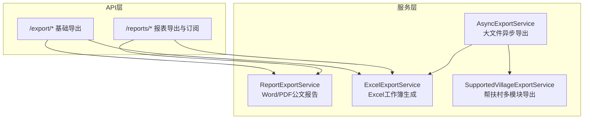
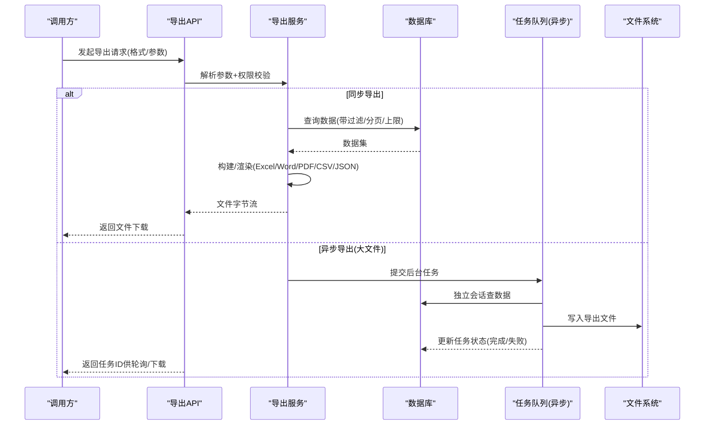
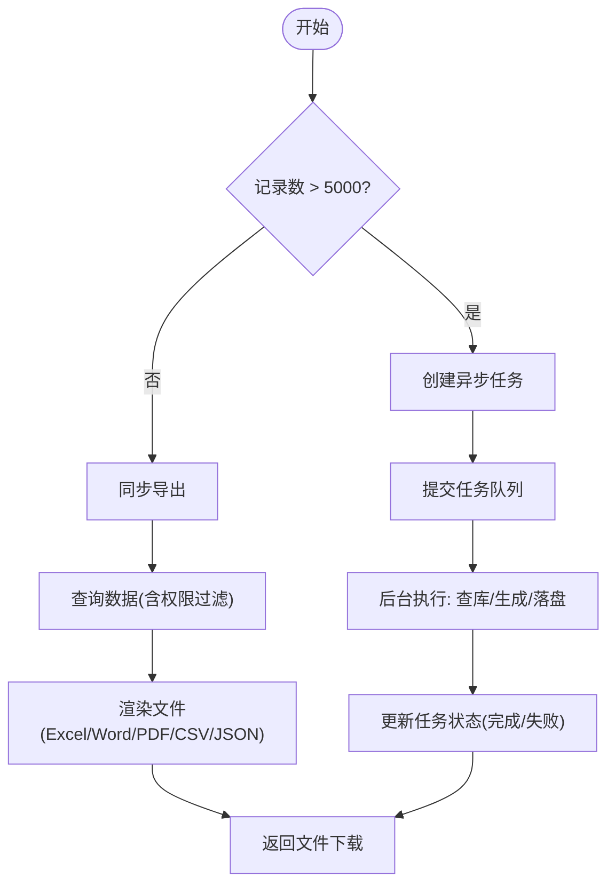
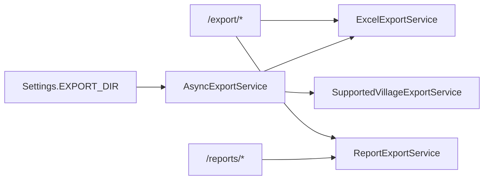

# 导出格式与配置

<cite>
**本文引用的文件**
- [backend/app/services/report_export_service.py](file://backend/app/services/report_export_service.py)
- [backend/app/services/async_export_service.py](file://backend/app/services/async_export_service.py)
- [backend/app/services/export_service.py](file://backend/app/services/export_service.py)
- [backend/app/services/supported_village_export_service.py](file://backend/app/services/supported_village_export_service.py)
- [backend/app/api/v1/import_export/export.py](file://backend/app/api/v1/import_export/export.py)
- [backend/app/api/v1/data/data/reports.py](file://backend/app/api/v1/data/data/reports.py)
- [backend/app/core/config.py](file://backend/app/core/config.py)
</cite>

## 目录
1. [简介](#简介)
2. [项目结构](#项目结构)
3. [核心组件](#核心组件)
4. [架构总览](#架构总览)
5. [详细组件分析](#详细组件分析)
6. [依赖关系分析](#依赖关系分析)
7. [性能考虑](#性能考虑)
8. [故障排查指南](#故障排查指南)
9. [结论](#结论)
10. [附录：接口与参数速查](#附录接口与参数速查)

## 简介
本文件面向“导出格式与配置”，系统支持 Excel、PDF、Word、CSV、JSON 等导出格式，覆盖帮扶村汇总、资金分析、项目进度、学校统计、年度综合总结等多类报表。文档将说明各格式的适用场景、限制与最佳实践；详解导出参数（时间范围、数据范围、是否包含图表/多模块等）；并给出不同报表类型的特定配置建议（如帮扶村地区维度、资金类型选择等）。

## 项目结构
后端导出能力由“API层 + 服务层 + 渲染/生成器”构成：
- API 路由负责接收请求、鉴权、参数校验与响应封装
- 服务层负责数据查询、聚合、异步任务编排与文件生成
- 渲染/生成器负责具体格式输出（Excel/PDF/Word/CSV/JSON）

**图示来源**
- [backend/app/api/v1/import_export/export.py:1-450](file://backend/app/api/v1/import_export/export.py#L1-L450)
- [backend/app/api/v1/data/data/reports.py:1-779](file://backend/app/api/v1/data/data/reports.py#L1-L779)
- [backend/app/services/report_export_service.py:1-448](file://backend/app/services/report_export_service.py#L1-L448)
- [backend/app/services/async_export_service.py:1-516](file://backend/app/services/async_export_service.py#L1-L516)
- [backend/app/services/export_service.py:1-190](file://backend/app/services/export_service.py#L1-L190)
- [backend/app/services/supported_village_export_service.py:1-377](file://backend/app/services/supported_village_export_service.py#L1-L377)

**章节来源**
- [backend/app/api/v1/import_export/export.py:1-450](file://backend/app/api/v1/import_export/export.py#L1-L450)
- [backend/app/api/v1/data/data/reports.py:1-779](file://backend/app/api/v1/data/data/reports.py#L1-L779)

## 核心组件
- ReportExportService：生成 Word/PDF 公文报告，统一数据结构（标题、段落、表格），内置中文字体与样式，空数据时输出“暂无数据”。
- AsyncExportService：大记录数导出走异步队列，自动估算记录数并切换异步模式，落盘后提供下载。
- ExcelExportService：通用 Excel 工作簿生成器，支持用户/村庄/学校/项目/经费及综合报表多 sheet。
- SupportedVillageExportService：帮扶村多模块选择性导出（人口、收入、产业、基建、党建、医疗、消费、就业、教育、经费、村委会信息等），支持 CSV 简化导出。

**章节来源**
- [backend/app/services/report_export_service.py:1-448](file://backend/app/services/report_export_service.py#L1-L448)
- [backend/app/services/async_export_service.py:1-516](file://backend/app/services/async_export_service.py#L1-L516)
- [backend/app/services/export_service.py:1-190](file://backend/app/services/export_service.py#L1-L190)
- [backend/app/services/supported_village_export_service.py:1-377](file://backend/app/services/supported_village_export_service.py#L1-L377)

## 架构总览

**图示来源**
- [backend/app/services/async_export_service.py:330-387](file://backend/app/services/async_export_service.py#L330-L387)
- [backend/app/api/v1/import_export/export.py:277-358](file://backend/app/api/v1/import_export/export.py#L277-L358)
- [backend/app/api/v1/data/data/reports.py:54-155](file://backend/app/api/v1/data/data/reports.py#L54-L155)

## 详细组件分析

### 支持的导出格式与适用场景
- Excel（xlsx）
  - 适用：明细数据、多维对比、二次加工分析
  - 特点：多 sheet、列宽自适应、审计水印页脚
  - 限制：超大文件内存占用较高，建议大记录数走异步
  - 参考实现：[ExcelExportService:10-190](file://backend/app/services/export_service.py#L10-L190)
- PDF
  - 适用：正式公文、归档打印
  - 特点：内置 CID 中文字体，无需外部字体文件；表格自动排版
  - 限制：复杂图表需前端或模板配合；当前以文本/表格为主
  - 参考实现：[ReportExportService.export_pdf:370-443](file://backend/app/services/report_export_service.py#L370-L443)
- Word（docx）
  - 适用：公文报告、可编辑材料
  - 特点：标题/正文/表格结构化渲染，中文字体设置
  - 限制：无原生图表渲染，仅表格/段落
  - 参考实现：[ReportExportService.export_word:318-368](file://backend/app/services/report_export_service.py#L318-L368)
- CSV
  - 适用：轻量数据交换、导入他系统
  - 特点：UTF-8-SIG 编码，兼容 Excel 中文显示
  - 限制：无样式、多 sheet 不支持（简化导出仅首模块）
  - 参考实现：[SupportedVillageExportService._build_csv:362-377](file://backend/app/services/supported_village_export_service.py#L362-L377)、[export.py _to_csv:45-52](file://backend/app/api/v1/import_export/export.py#L45-L52)
- JSON
  - 适用：程序间数据交换、报表订阅下载
  - 特点：结构化、易解析
  - 限制：不适合人类阅读与打印
  - 参考实现：[reports.py 下载JSON:711-779](file://backend/app/api/v1/data/data/reports.py#L711-L779)

**章节来源**
- [backend/app/services/export_service.py:10-190](file://backend/app/services/export_service.py#L10-L190)
- [backend/app/services/report_export_service.py:318-443](file://backend/app/services/report_export_service.py#L318-L443)
- [backend/app/services/supported_village_export_service.py:325-377](file://backend/app/services/supported_village_export_service.py#L325-L377)
- [backend/app/api/v1/import_export/export.py:45-72](file://backend/app/api/v1/import_export/export.py#L45-L72)
- [backend/app/api/v1/data/data/reports.py:711-779](file://backend/app/api/v1/data/data/reports.py#L711-L779)

### 导出参数配置总览
- 通用参数
  - 年份 year：用于按年聚合（默认当前年）
  - 数据范围：通过 keyword/status/type/region_scope/is_three_regions/is_border_area/is_revitalization_tier 等筛选
  - 最大行数：MAX_EXPORT_ROWS=10000，避免过大响应
  - 异步阈值：ASYNC_THRESHOLD=5000，超过则走异步导出
- 帮扶村导出（多模块）
  - modules：选择导出的模块集合（人口、收入、专项投入、产业帮扶、基础设施改善、党建帮扶、医疗帮扶、消费帮扶、就业帮扶、教育帮扶、帮扶经费、村委会信息）
  - village_ids：指定村列表
  - department/support_unit/tiered_level/keyword/county/is_revitalization_tier：多维度筛选
- 资金分析导出
  - fund_type：按资金类型筛选
  - status：按状态筛选
  - keyword：名称模糊搜索
- 项目/学校导出
  - project_type/status、school_type、keyword：常用筛选条件
- 综合报表
  - year：综合年份
  - village_ids：可选限定村范围
- 公文报告（Word/PDF）
  - report_type：summary/fund_detail/project_progress/school_statistics/village_summary/annual_summary
  - year：默认当前年

**章节来源**
- [backend/app/services/async_export_service.py:30-55](file://backend/app/services/async_export_service.py#L30-L55)
- [backend/app/services/async_export_service.py:85-163](file://backend/app/services/async_export_service.py#L85-L163)
- [backend/app/services/supported_village_export_service.py:47-89](file://backend/app/services/supported_village_export_service.py#L47-L89)
- [backend/app/api/v1/import_export/export.py:112-274](file://backend/app/api/v1/import_export/export.py#L112-L274)
- [backend/app/api/v1/data/data/reports.py:122-155](file://backend/app/api/v1/data/data/reports.py#L122-L155)

### 不同报表类型的特定配置建议
- 帮扶村汇总报表
  - 地区维度：使用 region_scope、is_three_regions、is_border_area、is_revitalization_tier 组合筛选，便于区分重点地区与梯次等级
  - 部门/单位：department、support_unit 用于组织维度汇总
  - 模块选择：modules 可按业务关注点选择（如产业帮扶、基础设施改善、帮扶经费）
- 资金分析报表
  - 资金类型：fund_type 精确筛选（如专项、配套、自筹等）
  - 状态：status 聚焦已拨付/使用中/已完成等阶段
  - 金额区间：可在前端先做范围筛选，再导出明细
- 项目进度报表
  - 项目类型/状态：project_type、status 组合定位关键路径项目
  - 预算/实际花费：结合进度字段进行偏差分析
- 学校统计报表
  - 学校类型：school_type 区分学段/性质
  - 规模指标：学生数、教师数用于资源评估
- 年度综合总结报告（Word/PDF）
  - 报告类型：annual_summary 合并村/校/项目/资金四块
  - 年份：year 控制聚合周期

**章节来源**
- [backend/app/services/report_export_service.py:55-300](file://backend/app/services/report_export_service.py#L55-L300)
- [backend/app/services/async_export_service.py:85-163](file://backend/app/services/async_export_service.py#L85-L163)
- [backend/app/api/v1/import_export/export.py:376-449](file://backend/app/api/v1/import_export/export.py#L376-L449)

### 导出流程与错误处理
- 同步导出流程
  - 参数校验 → 数据查询（应用数据权限过滤）→ 构建/渲染 → 返回文件流
- 异步导出流程
  - 估算记录数 → 超过阈值创建任务 → 后台独立会话执行 → 落盘 → 更新任务状态 → 提供下载
- 错误处理
  - 数据查询异常：报表服务会记录警告并输出“暂无数据/查询失败”提示，保证文件非空
  - 异步任务异常：捕获异常并回写失败状态与错误消息，便于追踪
  - 导入缺失：PDF 未启用时返回明确错误码

**图示来源**
- [backend/app/services/async_export_service.py:390-450](file://backend/app/services/async_export_service.py#L390-L450)
- [backend/app/services/report_export_service.py:304-317](file://backend/app/services/report_export_service.py#L304-L317)

**章节来源**
- [backend/app/services/async_export_service.py:330-387](file://backend/app/services/async_export_service.py#L330-L387)
- [backend/app/services/report_export_service.py:140-146](file://backend/app/services/report_export_service.py#L140-L146)
- [backend/app/api/v1/data/data/reports.py:88-119](file://backend/app/api/v1/data/data/reports.py#L88-L119)

## 依赖关系分析
- API 到服务
  - /export/* 路由依赖 ExcelExportService 与 ReportExportService
  - /reports/* 路由依赖 ReportService（封装 Excel/PDF/JSON 导出）
- 服务之间
  - AsyncExportService 依赖 ExcelExportService 与 SupportedVillageExportService
  - ReportExportService 独立渲染 Word/PDF，不依赖 Excel 服务
- 配置
  - 导出目录 EXPORT_DIR 来自 Settings，默认 ./exports
  - 允许的文件类型 ALLOWED_FILE_TYPES 包含 xlsx/csv/pdf/doc/docx 等

**图示来源**
- [backend/app/api/v1/import_export/export.py:1-450](file://backend/app/api/v1/import_export/export.py#L1-L450)
- [backend/app/api/v1/data/data/reports.py:1-779](file://backend/app/api/v1/data/data/reports.py#L1-L779)
- [backend/app/services/async_export_service.py:1-516](file://backend/app/services/async_export_service.py#L1-L516)
- [backend/app/core/config.py:170-176](file://backend/app/core/config.py#L170-L176)

**章节来源**
- [backend/app/core/config.py:170-176](file://backend/app/core/config.py#L170-L176)

## 性能考虑
- 大文件导出
  - 超过 5000 条记录自动走异步导出，避免阻塞请求线程
  - 单表查询限制 MAX_EXPORT_ROWS=10000，防止内存溢出
- 数据库压力
  - 所有导出均应用数据权限过滤，减少不必要的数据扫描
  - 帮扶村多模块导出采用批量 IN 查询，降低 N+1 问题
- 渲染开销
  - Excel 列宽自适应仅在合理范围内计算，避免全量遍历
  - PDF/Word 使用内置字体，减少 I/O 与字体加载成本
- 存储与清理
  - 导出文件落盘至 EXPORT_DIR，建议配合定时清理策略

**章节来源**
- [backend/app/services/async_export_service.py:30-32](file://backend/app/services/async_export_service.py#L30-L32)
- [backend/app/services/async_export_service.py:115-163](file://backend/app/services/async_export_service.py#L115-L163)
- [backend/app/services/supported_village_export_service.py:197-225](file://backend/app/services/supported_village_export_service.py#L197-L225)
- [backend/app/core/config.py:170-176](file://backend/app/core/config.py#L170-L176)

## 故障排查指南
- 导出为空或“暂无数据”
  - 检查筛选条件是否过严（如年份、状态、地区维度）
  - 查看报表服务日志中的警告（如“经费明细数据查询失败”）
- 异步任务一直 pending
  - 确认任务队列已启动且 worker 可用
  - 检查任务状态与错误消息（失败时会记录 error_message）
- PDF 导出不可用
  - 若缺少依赖，会返回明确错误码（501），请安装对应库
- 文件名乱码
  - 确保 Content-Disposition 使用 UTF-8 编码（系统已处理）

**章节来源**
- [backend/app/services/report_export_service.py:140-146](file://backend/app/services/report_export_service.py#L140-L146)
- [backend/app/services/async_export_service.py:375-387](file://backend/app/services/async_export_service.py#L375-L387)
- [backend/app/api/v1/data/data/reports.py:113-119](file://backend/app/api/v1/data/data/reports.py#L113-L119)

## 结论
系统提供了完善的导出能力，覆盖 Excel、PDF、Word、CSV、JSON 等主流格式，并通过异步机制保障大文件导出的稳定性。针对不同报表类型，提供了丰富的筛选维度与模块化导出选项。建议在生产环境中结合数据权限、异步阈值与存储清理策略，确保导出功能高效、安全、可控。

## 附录：接口与参数速查
- 基础导出（/export/*）
  - 支持格式：xlsx、csv（部分端点）
  - 常见参数：format、keyword、status、type、region_scope、is_* 布尔筛选
  - 参考：[export.py:75-358](file://backend/app/api/v1/import_export/export.py#L75-L358)
- 公文报告（/export/report-word、/export/report-pdf）
  - 报告类型：summary、fund_detail、project_progress、school_statistics、village_summary、annual_summary
  - 参数：report_type、year
  - 参考：[export.py:376-449](file://backend/app/api/v1/import_export/export.py#L376-L449)
- 报表导出（/reports/*）
  - Excel/PDF/JSON 导出与订阅管理
  - 参数：year、village_ids、include_sections、format
  - 参考：[reports.py:54-155](file://backend/app/api/v1/data/data/reports.py#L54-L155)
- 帮扶村多模块导出
  - 参数：year、modules、format、village_ids、department、support_unit、tiered_level、keyword、county、is_revitalization_tier
  - 参考：[supported_village_export_service.py:325-377](file://backend/app/services/supported_village_export_service.py#L325-L377)

**章节来源**
- [backend/app/api/v1/import_export/export.py:75-449](file://backend/app/api/v1/import_export/export.py#L75-L449)
- [backend/app/api/v1/data/data/reports.py:54-155](file://backend/app/api/v1/data/data/reports.py#L54-L155)
- [backend/app/services/supported_village_export_service.py:325-377](file://backend/app/services/supported_village_export_service.py#L325-L377)