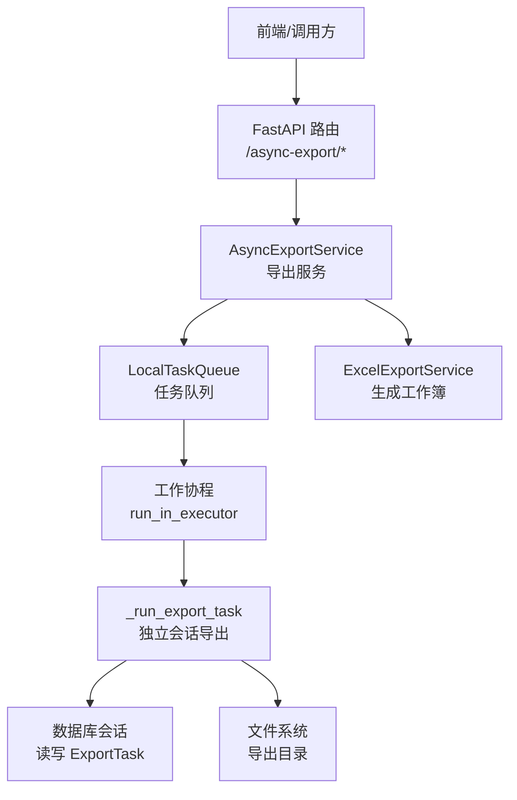
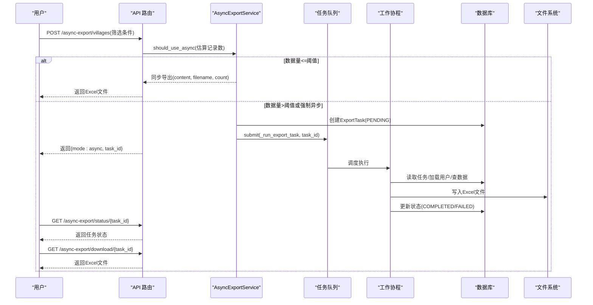
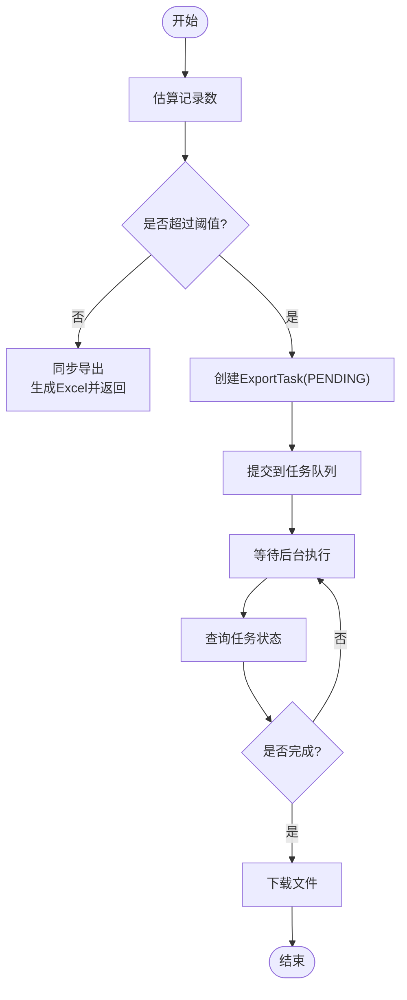
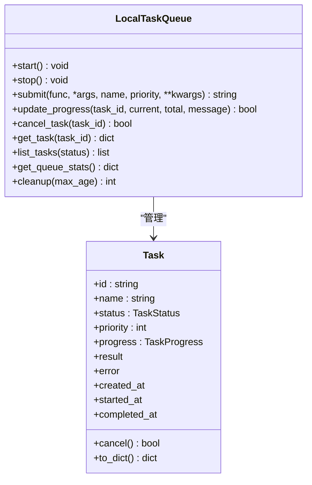
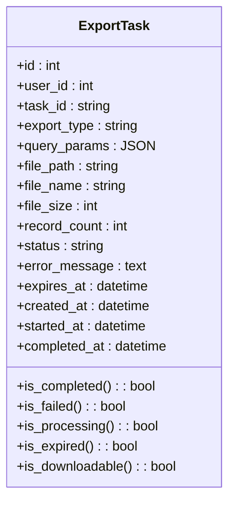
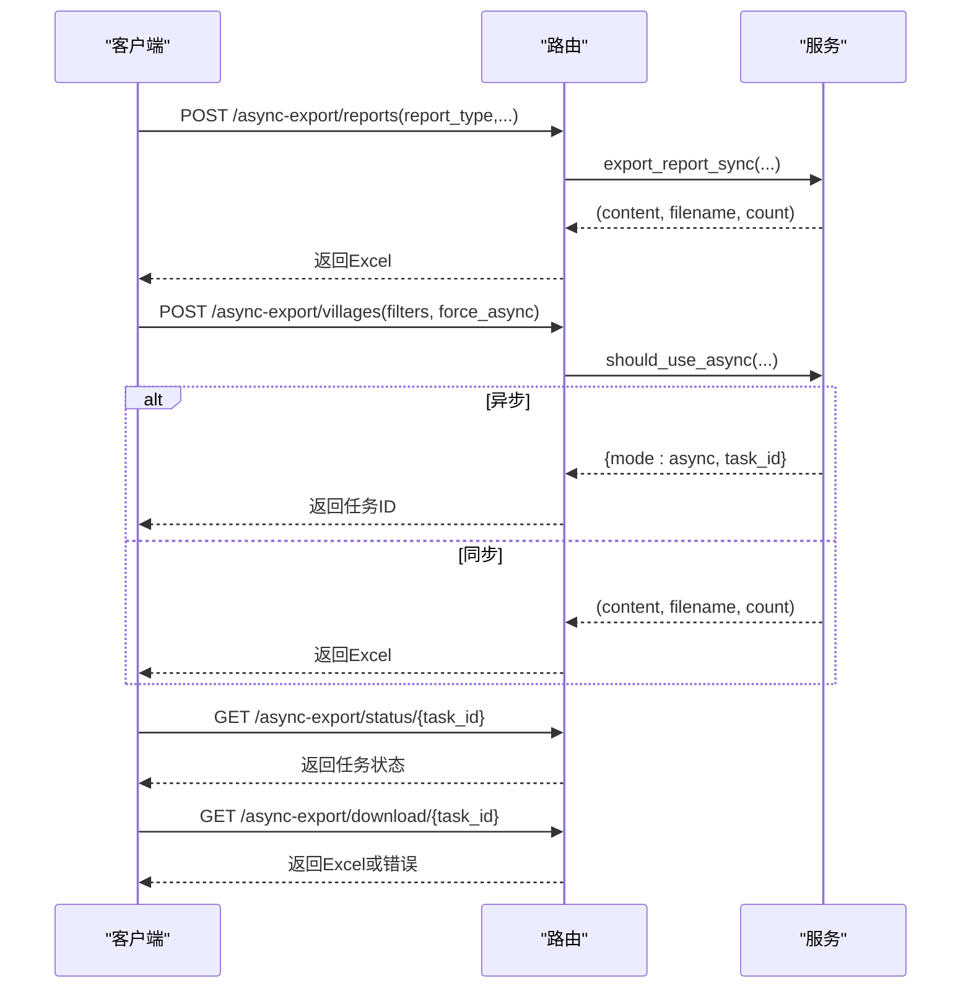
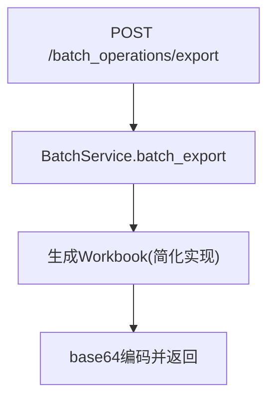
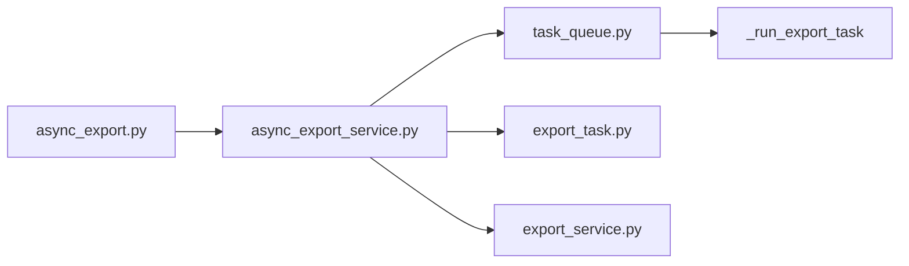

# 批量导出功能

<cite>
**本文引用的文件**
- [async_export_service.py](file://backend/app/services/async_export_service.py)
- [task_queue.py](file://backend/app/services/task_queue.py)
- [export_task.py](file://backend/app/models/export_task.py)
- [async_export.py](file://backend/app/api/v1/import_export/async_export.py)
- [export_service.py](file://backend/app/services/export_service.py)
- [batch_operations.py](file://backend/app/api/v1/batch_operations.py)
- [batch_service.py](file://backend/app/services/batch_service.py)
</cite>

## 目录
1. [简介](#简介)
2. [项目结构](#项目结构)
3. [核心组件](#核心组件)
4. [架构总览](#架构总览)
5. [详细组件分析](#详细组件分析)
6. [依赖关系分析](#依赖关系分析)
7. [性能考虑](#性能考虑)
8. [故障排查指南](#故障排查指南)
9. [结论](#结论)
10. [附录](#附录)

## 简介
本指南面向需要“批量导出”的用户与运维人员，系统说明以下能力：
- 多报表同时导出：支持按报表类型（如村庄、经费、项目、学校、综合报表）一次性生成并下载。
- 大数据量分批处理：当数据量超过阈值时自动切换为异步后台导出，避免阻塞请求线程。
- 任务创建、监控与管理：通过 API 创建任务、查询状态、分页查看历史、下载结果。
- 异步处理机制：基于本地内存任务队列的后台执行器，独立数据库会话生成文件并落盘，状态持久化到数据库。
- 性能优化策略：记录数估算、最大行数限制、内存友好的工作簿构建、并发工作线程控制。
- 故障排查与恢复：失败重试思路、过期清理、权限与路径问题定位。

## 项目结构
围绕批量导出的后端实现主要包含以下模块：
- API 层：提供同步/异步导出、报表导出、任务状态查询与下载等接口。
- 服务层：封装导出逻辑、异步任务调度、Excel 生成。
- 模型层：持久化导出任务元数据（状态、文件信息、过期时间）。
- 队列层：本地内存任务队列，支持优先级、进度追踪、取消与统计。

**图示来源**
- [async_export.py:100-198](file://backend/app/api/v1/import_export/async_export.py#L100-L198)
- [async_export_service.py:330-388](file://backend/app/services/async_export_service.py#L330-L388)
- [task_queue.py:124-288](file://backend/app/services/task_queue.py#L124-L288)
- [export_service.py:10-189](file://backend/app/services/export_service.py#L10-L189)

**章节来源**
- [async_export.py:1-333](file://backend/app/api/v1/import_export/async_export.py#L1-L333)
- [async_export_service.py:1-516](file://backend/app/services/async_export_service.py#L1-L516)
- [task_queue.py:1-307](file://backend/app/services/task_queue.py#L1-L307)
- [export_service.py:1-190](file://backend/app/services/export_service.py#L1-L190)
- [export_task.py:1-121](file://backend/app/models/export_task.py#L1-L121)

## 核心组件
- 异步导出服务（AsyncExportService）
  - 负责判断是否使用异步导出（基于记录数阈值）、构造查询参数、提交后台任务、同步导出、任务查询与文件读取。
  - 关键行为：超过阈值的实体类型自动走异步；综合报表直接生成汇总+明细；其他实体类型按 fetcher 拉取数据后生成工作簿。
- 任务队列（LocalTaskQueue）
  - 内存优先队列，默认最多 3 个并发 worker；支持优先级、进度更新、取消、统计与清理。
  - 自动启动：首次 submit 时若未显式 start，则自动创建队列与 worker。
- 导出任务模型（ExportTask）
  - 持久化任务 ID、类型、查询参数、文件路径/名称/大小、记录数、状态、错误信息、过期时间等。
  - 提供可下载性判断（完成且未过期）。
- Excel 导出服务（ExcelExportService）
  - 统一的工作簿构建与样式设置，支持单表导出与综合报表多 sheet 导出。
- API 路由（/async-export/*）
  - 报表导出（同步）、帮扶村导出（同步/异步）、任务状态查询、文件下载、任务列表分页。

**章节来源**
- [async_export_service.py:390-516](file://backend/app/services/async_export_service.py#L390-L516)
- [task_queue.py:124-288](file://backend/app/services/task_queue.py#L124-L288)
- [export_task.py:18-121](file://backend/app/models/export_task.py#L18-L121)
- [export_service.py:10-189](file://backend/app/services/export_service.py#L10-L189)
- [async_export.py:100-333](file://backend/app/api/v1/import_export/async_export.py#L100-L333)

## 架构总览
批量导出采用“同步直出 + 异步后台”的双模式：
- 小数据量：同步导出，直接返回 Excel 字节流。
- 大数据量：异步导出，创建任务记录并提交到队列，后台生成文件并落盘，前端轮询状态后下载。

**图示来源**
- [async_export.py:150-198](file://backend/app/api/v1/import_export/async_export.py#L150-L198)
- [async_export_service.py:398-481](file://backend/app/services/async_export_service.py#L398-L481)
- [task_queue.py:158-188](file://backend/app/services/task_queue.py#L158-L188)
- [async_export_service.py:330-388](file://backend/app/services/async_export_service.py#L330-L388)

## 详细组件分析

### 异步导出服务（AsyncExportService）
- 阈值判断与估算
  - 根据实体类型估算记录数，超过阈值（默认 5000）即走异步。
  - 估算失败时降级为同步或返回 0。
- 同步导出
  - 针对帮扶村、报表类型（含综合报表）提供同步导出方法，直接返回字节流与文件名、记录数。
- 异步导出
  - 创建 ExportTask（PENDING），提交 _run_export_task 到任务队列。
  - 后台任务使用独立数据库会话，按实体类型拉取数据，生成 Excel 并落盘，更新任务状态与元数据。
- 任务查询与下载
  - 提供任务状态查询、用户任务列表分页、文件读取（仅已完成且未过期）。

**图示来源**
- [async_export_service.py:398-481](file://backend/app/services/async_export_service.py#L398-L481)
- [async_export_service.py:330-388](file://backend/app/services/async_export_service.py#L330-L388)

**章节来源**
- [async_export_service.py:398-516](file://backend/app/services/async_export_service.py#L398-L516)

### 任务队列（LocalTaskQueue）
- 并发与优先级
  - 默认 3 个 worker，支持高/普通/低优先级。
  - 首次 submit 自动启动队列与 worker。
- 进度与取消
  - 提供进度更新接口；支持在 PENDING/RUNNING 状态取消任务。
- 统计与清理
  - 提供队列统计（总数、各状态计数、worker 数量、运行状态）。
  - 支持清理已完成/失败/已取消的旧任务（默认 1 小时前）。

**图示来源**
- [task_queue.py:63-122](file://backend/app/services/task_queue.py#L63-L122)
- [task_queue.py:124-288](file://backend/app/services/task_queue.py#L124-L288)

**章节来源**
- [task_queue.py:1-307](file://backend/app/services/task_queue.py#L1-L307)

### 导出任务模型（ExportTask）
- 字段与索引
  - 包含任务 ID、类型、查询参数、文件路径/名称/大小、记录数、状态、错误信息、过期时间、创建/开始/完成时间。
  - 对 user_id、task_id、status、export_type、created_at、expires_at 建立索引以加速查询。
- 可下载性
  - 仅当状态为 COMPLETED 且未过期时可下载。

**图示来源**
- [export_task.py:18-121](file://backend/app/models/export_task.py#L18-L121)

**章节来源**
- [export_task.py:1-121](file://backend/app/models/export_task.py#L1-L121)

### API 路由（/async-export/*）
- 报表导出（同步）
  - 根据 report_type 分发到对应实体或综合报表，直接返回 Excel。
- 帮扶村导出（同步/异步）
  - 根据阈值或 force_async 决定模式；异步返回 task_id，同步返回文件。
- 任务状态查询与下载
  - 校验权限（仅本人或管理员），检查可下载性，返回文件或错误提示。
- 任务列表
  - 按用户分页查询，支持状态筛选。

**图示来源**
- [async_export.py:100-333](file://backend/app/api/v1/import_export/async_export.py#L100-L333)

**章节来源**
- [async_export.py:1-333](file://backend/app/api/v1/import_export/async_export.py#L1-L333)

### 批量导出（通用批量导出）
- 通用批量导出接口
  - 仅管理员可用，传入 table_name 与 ids，返回 base64 编码的 Excel 内容（当前为简化实现）。
- 验证与状态
  - 提供批量操作验证接口与状态查询接口。

**图示来源**
- [batch_operations.py:203-221](file://backend/app/api/v1/batch_operations.py#L203-L221)
- [batch_service.py:206-223](file://backend/app/services/batch_service.py#L206-L223)

**章节来源**
- [batch_operations.py:200-259](file://backend/app/api/v1/batch_operations.py#L200-L259)
- [batch_service.py:88-244](file://backend/app/services/batch_service.py#L88-L244)

## 依赖关系分析
- API 依赖服务：路由层调用 AsyncExportService 进行业务编排。
- 服务依赖队列：异步导出通过 LocalTaskQueue 提交后台任务。
- 服务依赖模型：ExportTask 用于状态持久化与权限校验。
- 服务依赖导出工具：ExcelExportService 负责工作簿构建。
- 队列依赖执行体：_run_export_task 在独立会话中完成数据拉取与文件落盘。

**图示来源**
- [async_export.py:100-333](file://backend/app/api/v1/import_export/async_export.py#L100-L333)
- [async_export_service.py:330-516](file://backend/app/services/async_export_service.py#L330-L516)
- [task_queue.py:124-288](file://backend/app/services/task_queue.py#L124-L288)
- [export_task.py:18-121](file://backend/app/models/export_task.py#L18-L121)
- [export_service.py:10-189](file://backend/app/services/export_service.py#L10-L189)

**章节来源**
- [async_export.py:1-333](file://backend/app/api/v1/import_export/async_export.py#L1-L333)
- [async_export_service.py:1-516](file://backend/app/services/async_export_service.py#L1-L516)
- [task_queue.py:1-307](file://backend/app/services/task_queue.py#L1-L307)
- [export_task.py:1-121](file://backend/app/models/export_task.py#L1-L121)
- [export_service.py:1-190](file://backend/app/services/export_service.py#L1-L190)

## 性能考虑
- 阈值与限流
  - 记录数超过阈值（默认 5000）自动切换异步导出，避免长连接阻塞。
  - 单次导出最大行数限制（默认 10000），防止超大结果集导致内存压力。
- 并发控制
  - 任务队列默认 3 个 worker，可根据负载调整 max_workers。
- 内存友好
  - 工作簿构建使用流式输出（BytesIO），减少峰值内存占用。
  - 综合报表仅截取部分明细（如前 100 条），降低大表扫描成本。
- 资源限制
  - 可通过外部资源限制器（ResourceLimiter）对导出接口进行速率限制与配额管理（按需集成）。
- 建议
  - 在高并发场景下，适当增大 worker 数量并监控队列积压。
  - 定期清理过期导出文件与已完成任务，释放磁盘与内存。

[本节为通用指导，不直接分析具体文件]

## 故障排查指南
- 任务永远 pending
  - 确认是否正确提交到任务队列（submit 调用）。
  - 检查队列是否已启动（首次 submit 会自动启动）。
- 下载报“正在处理中”
  - 检查任务状态是否为 PROCESSING；等待完成后再下载。
- 下载报“任务失败”
  - 查看任务 error_message 字段，定位异常原因（如数据源、权限、文件写入失败）。
- 下载报“文件不存在”
  - 检查导出目录是否存在、是否有写入权限；确认文件路径是否正确。
- 权限问题
  - 仅本人或管理员可查询/下载；确认当前用户身份与任务归属。
- 文件过期
  - 检查 expires_at 是否已过；如需延长有效期，可在创建任务时调整过期时间。
- 批量导出为空或错误
  - 通用批量导出当前为简化实现；如需完整数据导出，请使用 /async-export/* 提供的实体导出接口。

**章节来源**
- [async_export_service.py:330-388](file://backend/app/services/async_export_service.py#L330-L388)
- [async_export.py:201-288](file://backend/app/api/v1/import_export/async_export.py#L201-L288)
- [export_task.py:85-121](file://backend/app/models/export_task.py#L85-L121)

## 结论
本系统的批量导出能力通过“同步直出 + 异步后台”的组合，兼顾了小数据量的即时性与大数据量的稳定性。借助任务队列与持久化任务模型，实现了任务的可观测、可管理与可恢复。配合导出服务的内存友好设计与并发控制，能够在生产环境中稳定支撑多报表、大批量的导出需求。建议在大规模部署时结合资源限制器与监控指标，持续优化队列吞吐与资源占用。

[本节为总结，不直接分析具体文件]

## 附录
- 常用 API 参考
  - 报表导出（同步）：POST /api/v1/async-export/reports
  - 帮扶村导出（同步/异步）：POST /api/v1/async-export/villages
  - 任务状态查询：GET /api/v1/async-export/status/{task_id}
  - 文件下载：GET /api/v1/async-export/download/{task_id}
  - 任务列表：GET /api/v1/async-export/tasks?page=...&page_size=...&status=...
  - 通用批量导出（管理员）：POST /api/v1/batch_operations/export

[本节为参考信息，不直接分析具体文件]