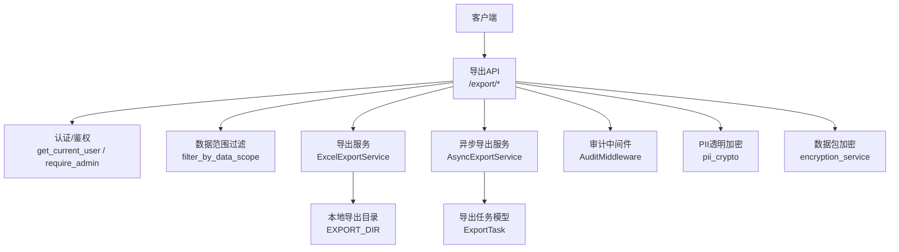
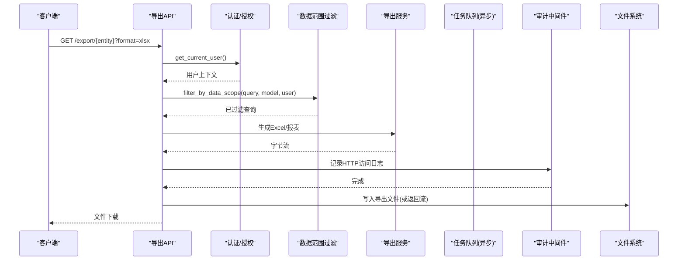
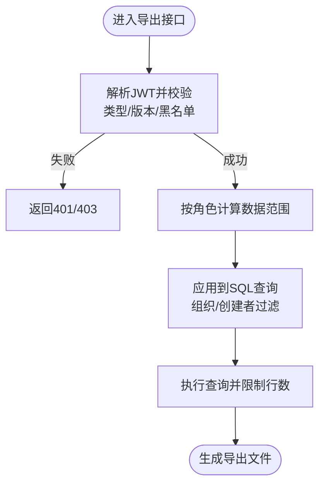
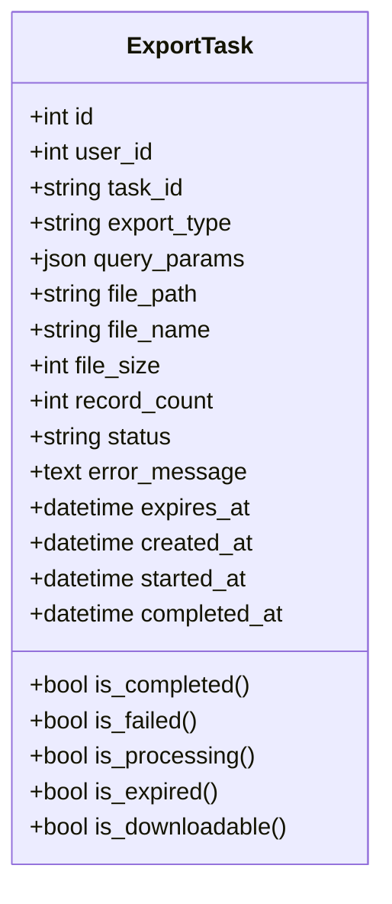
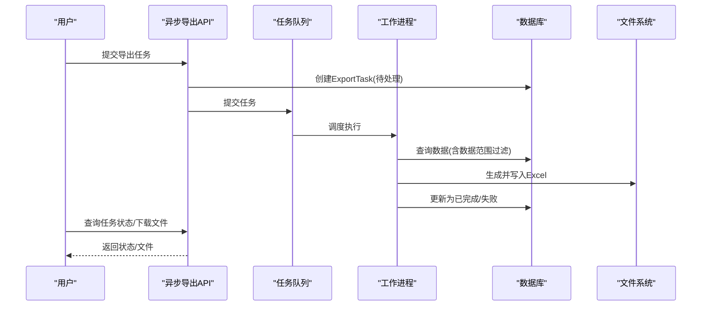
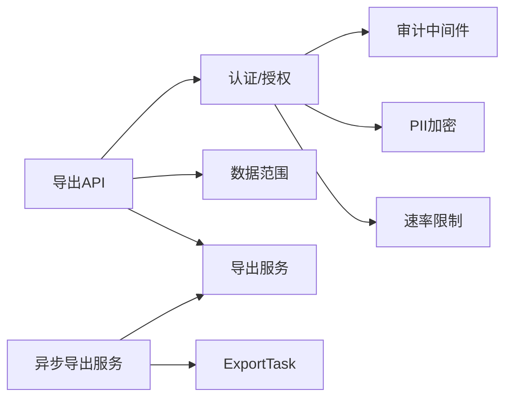

# 数据安全与脱敏

<cite>
**本文引用的文件**
- [export.py](file://backend/app/api/v1/import_export/export.py)
- [async_export_service.py](file://backend/app/services/async_export_service.py)
- [export_service.py](file://backend/app/services/export_service.py)
- [security.py](file://backend/app/core/security.py)
- [data_permission.py](file://backend/app/core/data_permission.py)
- [unified_data_scope.py](file://backend/app/core/unified_data_scope.py)
- [encryption_service.py](file://backend/app/services/encryption_service.py)
- [pii_crypto.py](file://backend/app/core/pii_crypto.py)
- [audit_middleware.py](file://backend/app/core/audit_middleware.py)
- [export_task.py](file://backend/app/models/export_task.py)
</cite>

## 目录
1. [简介](#简介)
2. [项目结构](#项目结构)
3. [核心组件](#核心组件)
4. [架构总览](#架构总览)
5. [详细组件分析](#详细组件分析)
6. [依赖关系分析](#依赖关系分析)
7. [性能与安全考量](#性能与安全考量)
8. [故障排查指南](#故障排查指南)
9. [结论](#结论)
10. [附录：配置与最佳实践](#附录配置与最佳实践)

## 简介
本文件面向“数据安全与脱敏”主题，围绕数据导出全链路的安全控制、敏感数据处理、加密保护与传输安全、审计日志与合规要求展开。内容覆盖权限验证、数据范围限制、访问审计、敏感字段识别与脱敏、导出文件加密与下载保护、以及可操作的配置建议与常见问题解决方案。

## 项目结构
导出相关的安全能力由 API 层、服务层、核心安全模块与模型共同构成：
- API 层负责入口校验（认证、授权、数据范围过滤）、参数校验与响应封装。
- 服务层负责真实数据查询、导出格式生成、异步任务编排与文件落盘。
- 核心安全模块提供认证鉴权、数据范围、PII 透明加密、审计中间件等通用能力。
- 模型层记录导出任务状态、过期策略与审计日志。

图表来源
- [export.py:75-450](file://backend/app/api/v1/import_export/export.py#L75-L450)
- [async_export_service.py:330-516](file://backend/app/services/async_export_service.py#L330-L516)
- [export_service.py:10-189](file://backend/app/services/export_service.py#L10-L189)
- [security.py:243-371](file://backend/app/core/security.py#L243-L371)
- [data_permission.py:83-170](file://backend/app/core/data_permission.py#L83-L170)
- [unified_data_scope.py:151-184](file://backend/app/core/unified_data_scope.py#L151-L184)
- [pii_crypto.py:70-87](file://backend/app/core/pii_crypto.py#L70-L87)
- [encryption_service.py:181-260](file://backend/app/services/encryption_service.py#L181-L260)
- [audit_middleware.py:18-109](file://backend/app/core/audit_middleware.py#L18-L109)
- [export_task.py:18-121](file://backend/app/models/export_task.py#L18-L121)

章节来源
- [export.py:75-450](file://backend/app/api/v1/import_export/export.py#L75-L450)
- [async_export_service.py:330-516](file://backend/app/services/async_export_service.py#L330-L516)
- [export_service.py:10-189](file://backend/app/services/export_service.py#L10-L189)
- [security.py:243-371](file://backend/app/core/security.py#L243-L371)
- [data_permission.py:83-170](file://backend/app/core/data_permission.py#L83-L170)
- [unified_data_scope.py:151-184](file://backend/app/core/unified_data_scope.py#L151-L184)
- [pii_crypto.py:70-87](file://backend/app/core/pii_crypto.py#L70-L87)
- [encryption_service.py:181-260](file://backend/app/services/encryption_service.py#L181-L260)
- [audit_middleware.py:18-109](file://backend/app/core/audit_middleware.py#L18-L109)
- [export_task.py:18-121](file://backend/app/models/export_task.py#L18-L121)

## 核心组件
- 认证与授权
  - 基于 JWT 的 Bearer 认证与用户上下文获取。
  - 管理员权限校验用于敏感导出接口。
- 数据范围控制
  - 角色驱动的数据范围（全部/本部门/本人）。
  - 统一的数据范围适配层，确保导出与列表口径一致。
- 导出服务
  - Excel 工作簿构建、多 sheet 报表、水印（审计溯源）。
  - 同步与异步导出，大文件后台处理与进度追踪。
- 敏感数据处理
  - 日志脱敏与敏感字段识别。
  - PII 字段透明加密（确定性 AES-SIV），支持等值查询与跨机互导。
- 加密与传输安全
  - Fernet 数据包加密与字段级加解密。
  - 安全响应头、速率限制与输入清洗。
- 审计与合规
  - HTTP 请求审计日志落库。
  - 导出任务生命周期记录与过期清理。

章节来源
- [security.py:243-371](file://backend/app/core/security.py#L243-L371)
- [data_permission.py:83-170](file://backend/app/core/data_permission.py#L83-L170)
- [unified_data_scope.py:151-184](file://backend/app/core/unified_data_scope.py#L151-L184)
- [export_service.py:24-189](file://backend/app/services/export_service.py#L24-L189)
- [async_export_service.py:330-516](file://backend/app/services/async_export_service.py#L330-L516)
- [pii_crypto.py:70-87](file://backend/app/core/pii_crypto.py#L70-L87)
- [encryption_service.py:181-260](file://backend/app/services/encryption_service.py#L181-L260)
- [audit_middleware.py:18-109](file://backend/app/core/audit_middleware.py#L18-L109)
- [export_task.py:18-121](file://backend/app/models/export_task.py#L18-L121)

## 架构总览
下图展示一次受控导出请求的关键路径：认证 → 授权 → 数据范围过滤 → 导出服务 → 审计记录 → 文件落盘/下载。

图表来源
- [export.py:75-450](file://backend/app/api/v1/import_export/export.py#L75-L450)
- [security.py:243-371](file://backend/app/core/security.py#L243-L371)
- [data_permission.py:83-170](file://backend/app/core/data_permission.py#L83-L170)
- [unified_data_scope.py:151-184](file://backend/app/core/unified_data_scope.py#L151-L184)
- [export_service.py:24-189](file://backend/app/services/export_service.py#L24-L189)
- [audit_middleware.py:18-109](file://backend/app/core/audit_middleware.py#L18-L109)

## 详细组件分析

### 权限验证与数据范围限制
- 认证流程
  - 从 Authorization 头提取 Bearer Token，解码并校验类型、版本与黑名单，失败则拒绝。
  - 将当前用户 ID 注入审计上下文，便于写操作归因。
- 授权检查
  - 敏感导出接口使用管理员校验，非管理员直接拒绝。
- 数据范围
  - 基于角色的数据范围：超级管理员可见全部；管理员可见本部门；普通用户仅本人。
  - 导出查询统一通过 filter_by_data_scope 应用范围，避免越权导出。
  - 统一适配层兼容历史两套范围机制，保证地图/看板与导出口径一致。

图表来源
- [security.py:243-371](file://backend/app/core/security.py#L243-L371)
- [export.py:75-450](file://backend/app/api/v1/import_export/export.py#L75-L450)
- [data_permission.py:83-170](file://backend/app/core/data_permission.py#L83-L170)
- [unified_data_scope.py:151-184](file://backend/app/core/unified_data_scope.py#L151-L184)

章节来源
- [security.py:243-371](file://backend/app/core/security.py#L243-L371)
- [export.py:75-450](file://backend/app/api/v1/import_export/export.py#L75-L450)
- [data_permission.py:83-170](file://backend/app/core/data_permission.py#L83-L170)
- [unified_data_scope.py:151-184](file://backend/app/core/unified_data_scope.py#L151-L184)

### 数据脱敏规则与敏感字段识别
- 日志脱敏
  - 对包含敏感键名（如密码、密钥、令牌、身份证、电话、邮箱等）的字段进行遮蔽，防止日志泄露。
  - 同时提供正则模式匹配，对常见敏感串进行替换。
- PII 透明加密
  - 采用确定性 AES-SIV 加密，同一明文恒得同一密文，支持等值查询。
  - 密文带标记前缀，读取侧自动识别是否已加密；未标记值原样返回，兼容历史明文。
  - 密钥来源优先级：显式 ENCRYPTION_KEY > 运行时密钥存储持久化密钥。
- 自定义脱敏扩展点
  - 可在日志输出前调用 sanitize_log_data 对任意字典进行脱敏。
  - 在导出映射阶段按需剔除或掩码敏感列（例如手机号、身份证号），以符合最小必要原则。

章节来源
- [security.py:180-202](file://backend/app/core/security.py#L180-L202)
- [security.py:704-712](file://backend/app/core/security.py#L704-L712)
- [pii_crypto.py:70-87](file://backend/app/core/pii_crypto.py#L70-L87)
- [export.py:94-109](file://backend/app/api/v1/import_export/export.py#L94-L109)

### 导出文件的加密保护与传输安全
- 文件加密
  - 提供数据包加密服务，支持文件与字段的对称加密（Fernet）。
  - 密钥管理：优先使用配置密钥，否则从运行时密钥存储加载或生成并持久化。
- 传输安全
  - 安全响应头中间件设置 X-Content-Type-Options、X-Frame-Options、Referrer-Policy 等。
  - 速率限制器防止滥用，默认滑动窗口限流。
  - 输入清洗移除危险字符，降低注入风险。
- 下载保护
  - 导出文件写入本地目录并通过文件名+任务ID关联，结合任务过期时间控制下载窗口。
  - 综合报表与工作簿均支持追加页脚水印（导出人/时间），便于溯源。

章节来源
- [encryption_service.py:181-260](file://backend/app/services/encryption_service.py#L181-L260)
- [security.py:598-636](file://backend/app/core/security.py#L598-L636)
- [security.py:439-510](file://backend/app/core/security.py#L439-L510)
- [security.py:394-411](file://backend/app/core/security.py#L394-L411)
- [export_service.py:24-58](file://backend/app/services/export_service.py#L24-L58)
- [export_task.py:58-121](file://backend/app/models/export_task.py#L58-L121)

### 导出操作的审计日志与合规性
- HTTP 访问审计
  - 中间件记录每次请求的方法、路径、状态码、耗时、用户身份、IP、UA，并落库到独立表，失败不阻断业务。
- 业务审计
  - 认证时将当前用户写入审计上下文，写操作可追责到人。
  - 审计日志服务支持记录动作、资源、元数据与IP。
- 导出任务审计
  - 导出任务模型记录用户、任务ID、类型、参数、文件信息、状态、过期时间与时间戳，便于追溯与清理。

图表来源
- [export_task.py:18-121](file://backend/app/models/export_task.py#L18-L121)

章节来源
- [audit_middleware.py:18-109](file://backend/app/core/audit_middleware.py#L18-L109)
- [security.py:644-687](file://backend/app/core/security.py#L644-L687)
- [export_task.py:18-121](file://backend/app/models/export_task.py#L18-L121)

### 异步导出与大数据量处理
- 阈值判断
  - 超过阈值的导出走异步通道，避免阻塞请求线程。
- 任务编排
  - 创建 ExportTask 记录并提交到任务队列，后台工作进程独立会话查数、生成文件、落盘并更新状态。
- 结果查询与下载
  - 提供任务状态查询与文件下载接口，支持分页与状态过滤。

图表来源
- [async_export_service.py:330-516](file://backend/app/services/async_export_service.py#L330-L516)
- [export_task.py:18-121](file://backend/app/models/export_task.py#L18-L121)

章节来源
- [async_export_service.py:330-516](file://backend/app/services/async_export_service.py#L330-L516)
- [export_task.py:18-121](file://backend/app/models/export_task.py#L18-L121)

## 依赖关系分析
- API 层依赖认证、数据范围与导出服务。
- 异步导出服务依赖任务队列、导出服务与模型。
- 核心安全模块被多处复用：认证、审计、PII、加密、速率限制。
- 数据范围模块统一对外暴露 filter_by_data_scope，确保各导出端点一致性。

图表来源
- [export.py:75-450](file://backend/app/api/v1/import_export/export.py#L75-L450)
- [async_export_service.py:330-516](file://backend/app/services/async_export_service.py#L330-L516)
- [security.py:243-636](file://backend/app/core/security.py#L243-L636)
- [data_permission.py:83-170](file://backend/app/core/data_permission.py#L83-L170)
- [unified_data_scope.py:151-184](file://backend/app/core/unified_data_scope.py#L151-L184)
- [export_task.py:18-121](file://backend/app/models/export_task.py#L18-L121)

章节来源
- [export.py:75-450](file://backend/app/api/v1/import_export/export.py#L75-L450)
- [async_export_service.py:330-516](file://backend/app/services/async_export_service.py#L330-L516)
- [security.py:243-636](file://backend/app/core/security.py#L243-L636)
- [data_permission.py:83-170](file://backend/app/core/data_permission.py#L83-L170)
- [unified_data_scope.py:151-184](file://backend/app/core/unified_data_scope.py#L151-L184)
- [export_task.py:18-121](file://backend/app/models/export_task.py#L18-L121)

## 性能与安全考量
- 性能
  - 异步导出避免阻塞主线程，适合大数据量场景。
  - 查询限制最大行数，防止超大结果集导致内存压力。
  - 审计落库使用独立短事务，失败不阻断业务。
- 安全
  - 严格认证与授权，敏感接口仅管理员可用。
  - 数据范围强制应用，防止越权导出。
  - 日志与敏感字段脱敏，PII 透明加密保障存储安全。
  - 安全响应头与速率限制降低攻击面。
  - 导出文件带水印与过期时间，便于溯源与生命周期管理。

[本节为通用指导，无需具体文件引用]

## 故障排查指南
- 导出为空或无数据
  - 检查数据范围过滤是否正确应用（组织/创建者）。
  - 确认查询条件与软删除过滤是否生效。
- 异步任务一直 pending
  - 检查任务队列是否启动，工作进程是否正常消费。
  - 查看 ExportTask 状态与错误信息。
- 下载失败或文件不存在
  - 核对文件路径与任务过期时间，确认文件已落盘且未过期。
- 审计日志缺失
  - 检查中间件是否注册，数据库连接与落库是否异常。
- 解密失败
  - 确认密钥来源与一致性（ENCRYPTION_KEY 或运行时密钥存储）。
  - 检查密文标记前缀与数据完整性。

章节来源
- [async_export_service.py:330-516](file://backend/app/services/async_export_service.py#L330-L516)
- [export_task.py:58-121](file://backend/app/models/export_task.py#L58-L121)
- [audit_middleware.py:18-109](file://backend/app/core/audit_middleware.py#L18-L109)
- [encryption_service.py:181-260](file://backend/app/services/encryption_service.py#L181-L260)
- [pii_crypto.py:70-87](file://backend/app/core/pii_crypto.py#L70-L87)

## 结论
本系统通过严格的认证授权、统一的数据范围控制、完善的审计与脱敏机制，以及可选的文件加密与传输安全加固，构建了端到端的数据导出安全体系。异步导出与任务模型保障了大数据量的稳定处理，水印与过期策略提升了可追溯性与风险控制。建议在部署中启用 PII 透明加密与安全响应头，并结合速率限制与审计日志满足合规要求。

[本节为总结，无需具体文件引用]

## 附录：配置与最佳实践
- 密钥管理
  - 生产环境务必配置 ENCRYPTION_KEY，并确保多机一致以实现跨机互导。
  - 若未配置，系统将尝试从运行时密钥存储加载或生成并持久化，需保证文件权限与磁盘空间。
- 导出策略
  - 对包含敏感信息的导出（如用户列表）限制为管理员可用，并在导出映射中剔除或掩码敏感列。
  - 为大体积导出启用异步通道，并设置合理的过期时间。
- 审计与合规
  - 开启审计中间件，确保所有导出请求可追溯。
  - 定期清理过期导出文件与任务记录，减少存储与风险。
- 传输安全
  - 启用安全响应头，限制缓存策略。
  - 结合反向代理与 HTTPS 保障传输安全。
- 常见问题
  - 若出现“令牌失效”，检查 token_version 与黑名单机制。
  - 若导出结果为空，检查数据范围与查询条件。
  - 若解密失败，核对密钥一致性与密文标记。

章节来源
- [encryption_service.py:181-260](file://backend/app/services/encryption_service.py#L181-L260)
- [pii_crypto.py:30-57](file://backend/app/core/pii_crypto.py#L30-L57)
- [export.py:75-450](file://backend/app/api/v1/import_export/export.py#L75-L450)
- [audit_middleware.py:18-109](file://backend/app/core/audit_middleware.py#L18-L109)
- [security.py:598-636](file://backend/app/core/security.py#L598-L636)
- [export_task.py:58-121](file://backend/app/models/export_task.py#L58-L121)