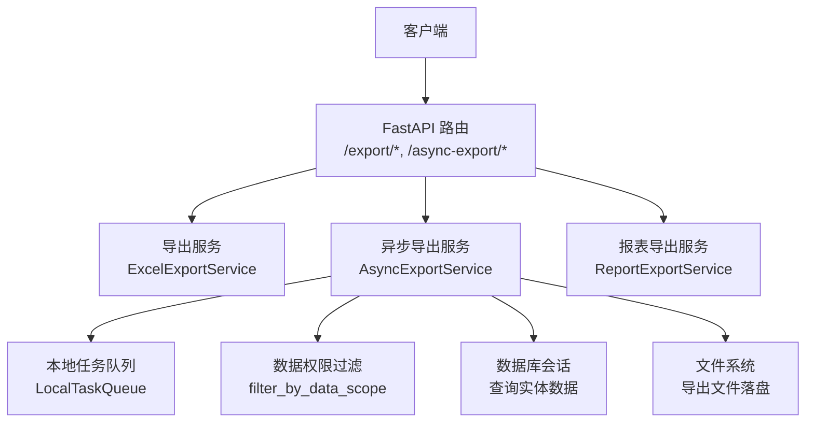
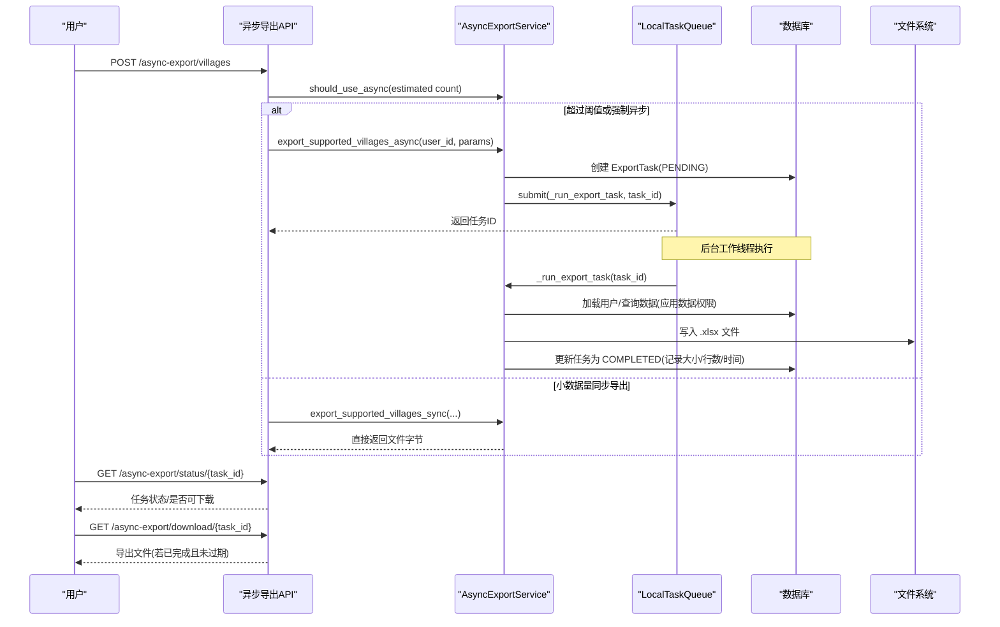
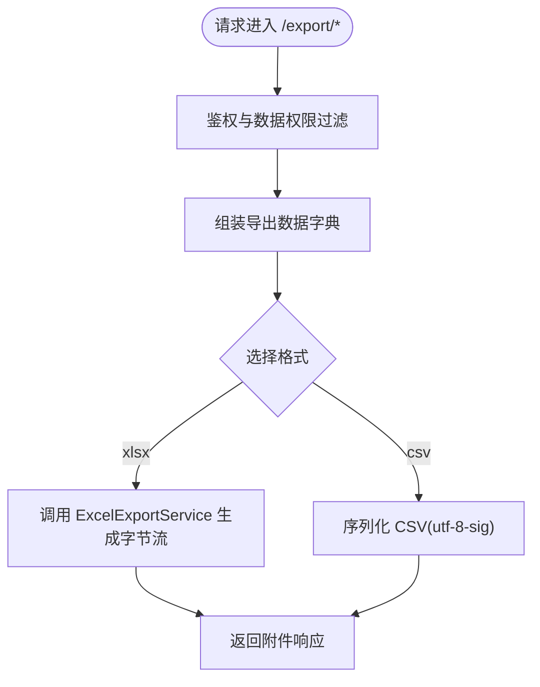
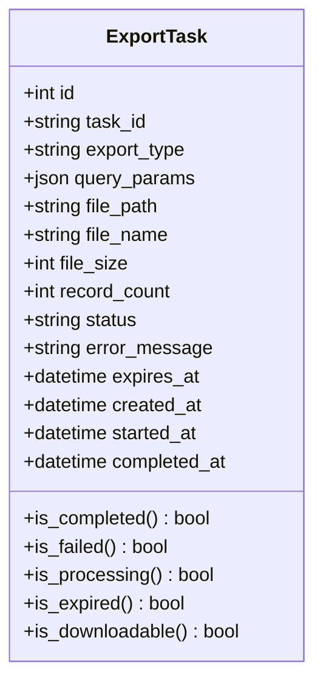
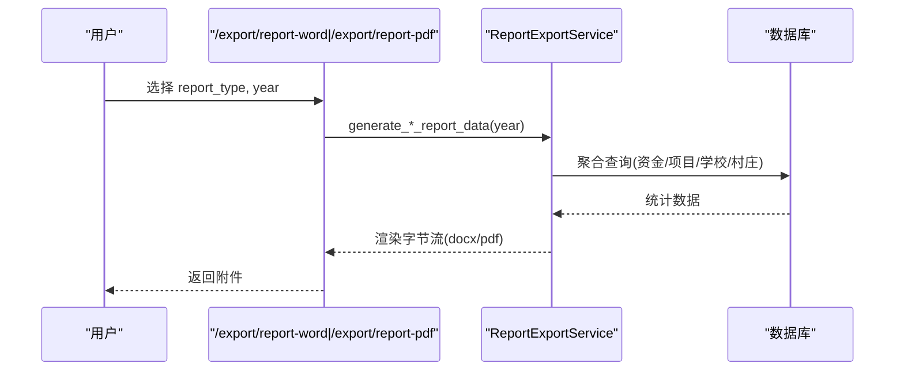
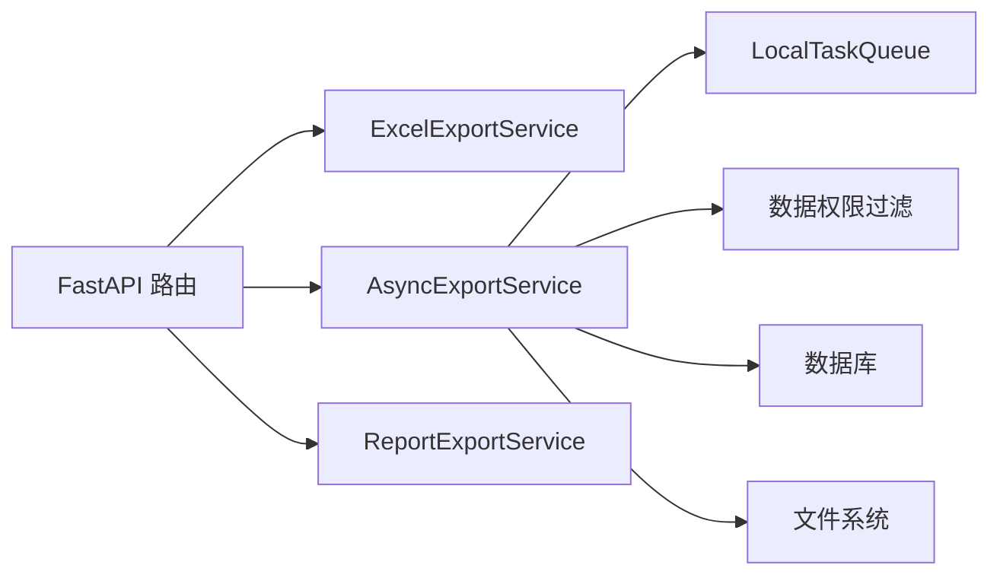

# 数据导出与分享

<cite>
**本文引用的文件**
- [export.py](file://backend/app/api/v1/import_export/export.py)
- [async_export.py](file://backend/app/api/v1/import_export/async_export.py)
- [export_service.py](file://backend/app/services/export_service.py)
- [async_export_service.py](file://backend/app/services/async_export_service.py)
- [task_queue.py](file://backend/app/services/task_queue.py)
- [data_permission.py](file://backend/app/core/data_permission.py)
- [supported_village_export_service.py](file://backend/app/services/supported_village_export_service.py)
- [report_export_service.py](file://backend/app/services/report_export_service.py)
- [export_task.py](file://backend/app/models/export_task.py)
</cite>

## 目录
1. [简介](#简介)
2. [项目结构](#项目结构)
3. [核心组件](#核心组件)
4. [架构总览](#架构总览)
5. [详细组件分析](#详细组件分析)
6. [依赖关系分析](#依赖关系分析)
7. [性能与优化](#性能与优化)
8. [故障排查指南](#故障排查指南)
9. [结论](#结论)
10. [附录：API 与配置速查](#附录api-与配置速查)

## 简介
本手册面向系统用户与实施人员，全面说明“数据导出与分享”功能的使用方式、安全控制、任务监控与性能调优。内容覆盖支持的导出格式（Excel、CSV、Word、PDF）、批量与增量导出方法、数据脱敏与安全控制、导出任务监控与管理（进度、错误处理、重试建议）、数据分享的权限控制与访问限制、大文件导出的优化策略，以及导出数据的验证与质量检查方法。

## 项目结构
后端围绕 FastAPI 路由层、服务层与模型层组织导出能力：
- API 路由层：提供同步导出、异步导出、报表导出等接口
- 服务层：封装 Excel/CSV/Word/PDF 生成、异步任务调度、数据权限过滤、综合报表构建
- 模型层：导出任务持久化（状态、文件路径、过期时间等）

图表来源
- [export.py:22-450](file://backend/app/api/v1/import_export/export.py#L22-L450)
- [async_export.py:28-333](file://backend/app/api/v1/import_export/async_export.py#L28-L333)
- [export_service.py:10-189](file://backend/app/services/export_service.py#L10-L189)
- [async_export_service.py:390-516](file://backend/app/services/async_export_service.py#L390-L516)
- [task_queue.py:124-288](file://backend/app/services/task_queue.py#L124-L288)
- [data_permission.py:164-170](file://backend/app/core/data_permission.py#L164-L170)
- [report_export_service.py:46-448](file://backend/app/services/report_export_service.py#L46-L448)

章节来源
- [export.py:22-450](file://backend/app/api/v1/import_export/export.py#L22-L450)
- [async_export.py:28-333](file://backend/app/api/v1/import_export/async_export.py#L28-L333)

## 核心组件
- 同步导出服务：按实体类型生成 Excel/CSV，支持多模块选择性导出与统计页
- 异步导出服务：根据记录数阈值自动切换同步/异步；创建任务、提交队列、落盘并更新状态
- 任务队列：内存优先级队列，支持进度、取消、统计与清理
- 数据权限：基于角色与组织的数据范围过滤，防止越权导出
- 报表导出：统一数据结构渲染 Word/PDF，空数据时输出友好提示
- 导出任务模型：持久化任务元信息、状态机、过期控制与下载判定

章节来源
- [export_service.py:10-189](file://backend/app/services/export_service.py#L10-L189)
- [async_export_service.py:390-516](file://backend/app/services/async_export_service.py#L390-L516)
- [task_queue.py:124-288](file://backend/app/services/task_queue.py#L124-L288)
- [data_permission.py:164-170](file://backend/app/core/data_permission.py#L164-L170)
- [report_export_service.py:46-448](file://backend/app/services/report_export_service.py#L46-L448)
- [export_task.py:18-121](file://backend/app/models/export_task.py#L18-L121)

## 架构总览
下图展示一次“帮扶村”异步导出的端到端流程，包括权限校验、数据量估算、任务创建、后台执行、文件落盘与下载。

图表来源
- [async_export.py:150-288](file://backend/app/api/v1/import_export/async_export.py#L150-L288)
- [async_export_service.py:330-387](file://backend/app/services/async_export_service.py#L330-L387)
- [task_queue.py:158-288](file://backend/app/services/task_queue.py#L158-L288)
- [export_task.py:18-121](file://backend/app/models/export_task.py#L18-L121)

## 详细组件分析

### 同步导出（Excel/CSV）
- 支持实体：用户、村庄、学校、项目、经费、综合报表
- 支持格式：Excel(.xlsx)、CSV(.csv)
- 数据权限：所有导出均通过 filter_by_data_scope 按用户数据范围过滤
- 最大行数：默认上限 10000 行，避免超大响应阻塞
- 文件名：带时间戳，中文文件名使用 URL 编码

图表来源
- [export.py:45-72](file://backend/app/api/v1/import_export/export.py#L45-L72)
- [export_service.py:24-90](file://backend/app/services/export_service.py#L24-L90)
- [data_permission.py:164-170](file://backend/app/core/data_permission.py#L164-L170)

章节来源
- [export.py:75-358](file://backend/app/api/v1/import_export/export.py#L75-L358)
- [export_service.py:10-189](file://backend/app/services/export_service.py#L10-L189)

### 异步导出（大文件/批量）
- 自动阈值：当预估记录数超过 5000 条时自动走异步通道；也可通过参数强制异步
- 任务状态机：pending → processing → completed/failed；支持过期控制与下载判定
- 后台执行：独立数据库会话查询数据、生成 Excel、落盘并回写任务状态
- 下载控制：仅允许已完成的、未过期的任务下载；失败/处理中/过期均有明确提示

图表来源
- [export_task.py:18-121](file://backend/app/models/export_task.py#L18-L121)

章节来源
- [async_export.py:100-333](file://backend/app/api/v1/import_export/async_export.py#L100-L333)
- [async_export_service.py:390-516](file://backend/app/services/async_export_service.py#L390-L516)
- [task_queue.py:124-288](file://backend/app/services/task_queue.py#L124-L288)
- [export_task.py:18-121](file://backend/app/models/export_task.py#L18-L121)

### 报表导出（Word/PDF）
- 报告类型：年度总结、资金明细、项目进度、学校统计、村庄汇总、年度综合
- 数据模型：统一 sections 结构（标题、段落、表格），空数据输出友好提示
- 输出格式：Word(.docx) 与 PDF(.pdf)，内置中文字体，无需外部字体文件
- 权限控制：需管理员权限

图表来源
- [export.py:376-449](file://backend/app/api/v1/import_export/export.py#L376-L449)
- [report_export_service.py:55-448](file://backend/app/services/report_export_service.py#L55-L448)

章节来源
- [export.py:376-449](file://backend/app/api/v1/import_export/export.py#L376-L449)
- [report_export_service.py:46-448](file://backend/app/services/report_export_service.py#L46-L448)

### 帮扶村多模块导出（选择性导出）
- 模块：人口、收入、专项投入、产业帮扶、基础设施、党建、医疗、消费、就业、教育、帮扶经费、村委会信息
- 批量查询：按模块一次性 IN 查询关联表，减少往返
- 输出：Excel（多 sheet）或 CSV（首模块）
- 统计：自动生成统计 sheet，便于核对

章节来源
- [supported_village_export_service.py:19-377](file://backend/app/services/supported_village_export_service.py#L19-L377)

## 依赖关系分析
- API 路由依赖服务层进行数据获取与文件生成
- 异步导出依赖任务队列在后台执行，避免阻塞请求
- 所有导出均受数据权限控制，防止跨组织/越权导出
- 报表导出依赖统一的报告数据结构，确保 Word/PDF 渲染一致性

图表来源
- [export.py:22-450](file://backend/app/api/v1/import_export/export.py#L22-L450)
- [async_export.py:28-333](file://backend/app/api/v1/import_export/async_export.py#L28-L333)
- [export_service.py:10-189](file://backend/app/services/export_service.py#L10-L189)
- [async_export_service.py:390-516](file://backend/app/services/async_export_service.py#L390-L516)
- [task_queue.py:124-288](file://backend/app/services/task_queue.py#L124-L288)
- [data_permission.py:164-170](file://backend/app/core/data_permission.py#L164-L170)
- [report_export_service.py:46-448](file://backend/app/services/report_export_service.py#L46-L448)

章节来源
- [export.py:22-450](file://backend/app/api/v1/import_export/export.py#L22-L450)
- [async_export.py:28-333](file://backend/app/api/v1/import_export/async_export.py#L28-L333)

## 性能与优化
- 大文件导出
  - 自动阈值：超过 5000 条记录自动走异步导出，降低请求超时风险
  - 后台执行：独立会话与线程池，避免阻塞主进程
  - 文件落盘：导出结果写入磁盘，下载时读取，减少内存占用
- 查询优化
  - 数据权限过滤：在 SQL 层加条件，减少不必要数据
  - 批量查询：帮扶村多模块导出采用 IN 批量查询，降低往返次数
  - 分页与限制：同步导出限制最大行数，避免过大响应
- 队列与并发
  - 本地任务队列支持多 worker，提升吞吐
  - 任务优先级与清理：可按需调整 worker 数量与清理策略
- 网络与存储
  - 文件名 URL 编码，兼容中文
  - 导出目录按需创建，避免 IO 异常
- 建议
  - 生产环境建议开启任务队列常驻 worker
  - 对高频导出场景，结合缓存与限流策略
  - 定期清理过期导出文件与历史任务

[本节为通用指导，不直接分析具体文件]

## 故障排查指南
- 导出任务一直 pending
  - 检查任务队列是否启动；确认异步任务已提交到队列
  - 查看日志中是否有提交失败的记录
- 下载提示“正在处理中/失败/已过期”
  - 通过状态接口查询任务状态与错误信息
  - 检查任务是否完成且未过期；必要时重新发起导出
- 导出内容为空
  - 检查筛选条件与数据权限是否导致无数据
  - 确认同步导出是否传入了正确的查询参数
- 权限问题
  - 非管理员尝试导出受限数据会被拒绝
  - 部门级管理员仅能导出本部门数据

章节来源
- [async_export.py:201-333](file://backend/app/api/v1/import_export/async_export.py#L201-L333)
- [async_export_service.py:330-387](file://backend/app/services/async_export_service.py#L330-L387)
- [export_task.py:85-121](file://backend/app/models/export_task.py#L85-L121)
- [data_permission.py:164-187](file://backend/app/core/data_permission.py#L164-L187)

## 结论
本系统提供了完善的导出与分享能力：支持 Excel/CSV/Word/PDF 多种格式；具备同步与异步两种模式，自动适配大数据量场景；通过严格的数据权限控制保障敏感数据安全；提供任务全生命周期管理与下载控制；并通过批量查询、队列并发与落盘策略优化大文件导出性能。建议在生产环境中启用任务队列常驻、合理设置导出阈值与清理策略，并结合业务需求扩展更多导出模块与报表类型。

[本节为总结性内容，不直接分析具体文件]

## 附录：API 与配置速查
- 同步导出
  - 用户列表：GET /export/users?format=xlsx|csv
  - 村庄列表：GET /export/villages?keyword=&status=
  - 学校列表：GET /export/schools?keyword=&school_type=
  - 项目列表：GET /export/projects?keyword=&project_type=&status=
  - 经费列表：GET /export/funds?keyword=&fund_type=&status=
  - 综合报表：GET /export/comprehensive?year=
- 报表导出
  - Word：GET /export/report-word?report_type=&year=
  - PDF：GET /export/report-pdf?report_type=&year=
- 异步导出
  - 创建任务：POST /async-export/villages?force_async=
  - 报表导出：POST /async-export/reports
  - 查询状态：GET /async-export/status/{task_id}
  - 下载文件：GET /async-export/download/{task_id}
  - 任务列表：GET /async-export/tasks?page=&page_size=&status=
- 关键配置
  - 异步阈值：ASYNC_THRESHOLD = 5000
  - 最大导出行数：MAX_EXPORT_ROWS = 10000
  - 导出目录：settings.EXPORT_DIR（不存在则自动创建）
  - 任务队列：默认 3 个 worker，支持自动启动与清理

章节来源
- [export.py:75-449](file://backend/app/api/v1/import_export/export.py#L75-L449)
- [async_export.py:100-333](file://backend/app/api/v1/import_export/async_export.py#L100-L333)
- [async_export_service.py:30-73](file://backend/app/services/async_export_service.py#L30-L73)
- [task_queue.py:124-288](file://backend/app/services/task_queue.py#L124-L288)