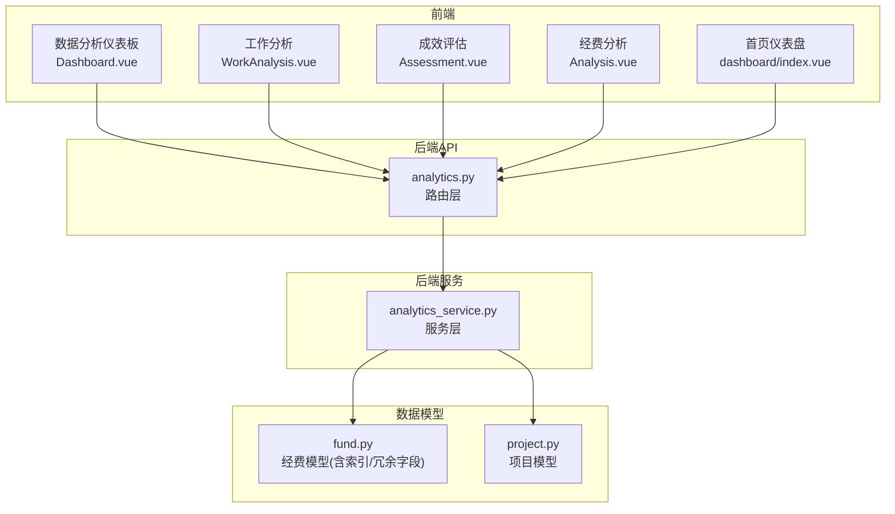
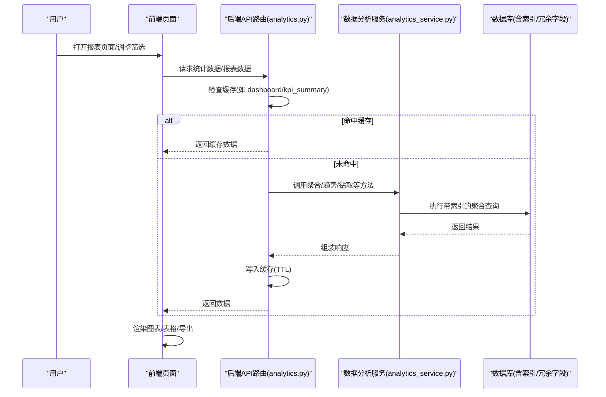
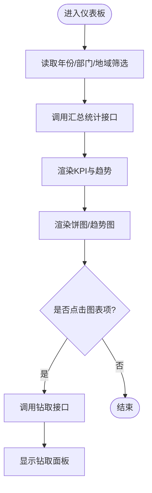
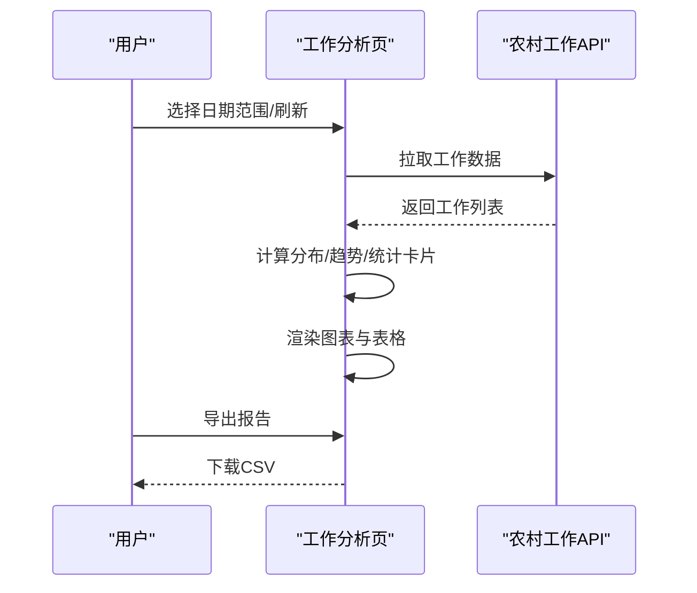
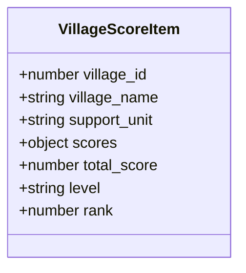
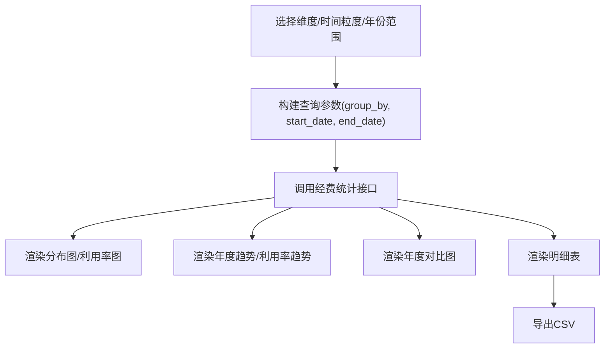
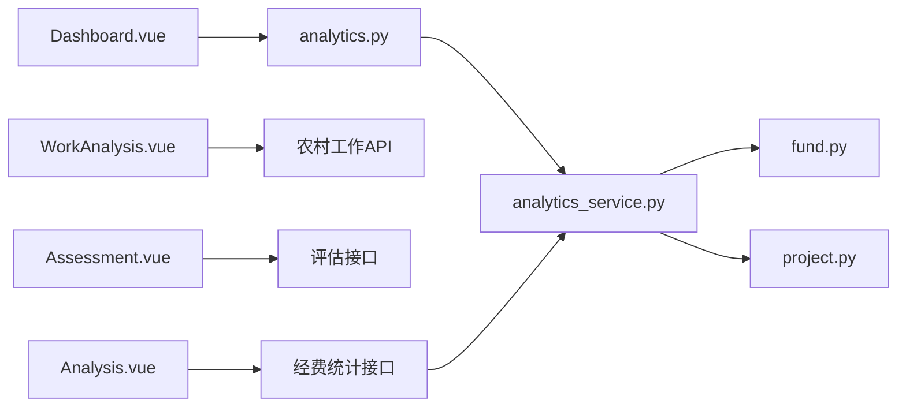

# 统计报表查看

<cite>
**本文引用的文件**
- [Dashboard.vue](file://frontend/src/views/analytics/dashboard/Dashboard.vue)
- [WorkAnalysis.vue](file://frontend/src/views/analytics/reports/WorkAnalysis.vue)
- [Assessment.vue](file://frontend/src/views/analytics/Assessment.vue)
- [dashboard/index.vue](file://frontend/src/views/dashboard/index.vue)
- [analytics_service.py](file://backend/app/services/analytics_service.py)
- [analytics.py](file://backend/app/api/v1/data/data/analytics.py)
- [fund.py](file://backend/app/models/fund.py)
- [Analysis.vue](file://frontend/src/views/funds/Analysis.vue)
- [fundStatistics.ts](file://frontend/src/api/fundStatistics.ts)
- [project.py](file://backend/app/models/project.py)
- [ai_service.py](file://backend/app/services/ai_service.py)
- [report_export_service.py](file://backend/app/services/report_export_service.py)
</cite>

## 目录
1. [简介](#简介)
2. [项目结构](#项目结构)
3. [核心组件](#核心组件)
4. [架构总览](#架构总览)
5. [详细组件分析](#详细组件分析)
6. [依赖关系分析](#依赖关系分析)
7. [性能与加载策略](#性能与加载策略)
8. [故障排查指南](#故障排查指南)
9. [结论](#结论)
10. [附录：指标口径与数据源](#附录：指标口径与数据源)

## 简介
本指南面向“统计报表查看”功能，覆盖项目统计、经费分析、工作成效评估等核心报表的查看方法、数据解读、筛选过滤、图表交互、导出能力以及性能优化建议。读者可据此快速上手并高效使用系统提供的数据分析与可视化能力。

## 项目结构
前端提供多类报表页面：
- 数据分析仪表板：综合展示帮扶村概况、投入构成、年度趋势与钻取能力
- 工作分析：工作类型/状态分布、月度完成趋势、明细表与导出
- 成效评估：各村评分、等级分布与明细
- 经费分析：多维度（时间/类型/来源/状态）统计、利用率与年度对比
- 首页仪表盘：KPI卡片、快捷入口、布局自定义与自动刷新

后端提供统一的数据分析与报表服务：
- 数据分析API路由：仪表盘、资金趋势、绩效指标、报表生成与导出、实时统计、KPI汇总、跨组织对比
- 数据分析服务：聚合查询、年份过滤、钻取、对比、筛选选项、导出
- 模型层：经费模型含时间聚合冗余字段与索引，提升统计性能；项目模型包含预算与实际成本等字段用于超支识别

**图示来源**
- [Dashboard.vue:1-220](file://frontend/src/views/analytics/dashboard/Dashboard.vue#L1-L220)
- [WorkAnalysis.vue:1-168](file://frontend/src/views/analytics/reports/WorkAnalysis.vue#L1-L168)
- [Assessment.vue:1-80](file://frontend/src/views/analytics/Assessment.vue#L1-L80)
- [Analysis.vue:1-160](file://frontend/src/views/funds/Analysis.vue#L1-L160)
- [dashboard/index.vue:1-133](file://frontend/src/views/dashboard/index.vue#L1-L133)
- [analytics.py:84-224](file://backend/app/api/v1/data/data/analytics.py#L84-L224)
- [analytics_service.py:22-85](file://backend/app/services/analytics_service.py#L22-L85)
- [fund.py:61-86](file://backend/app/models/fund.py#L61-L86)
- [project.py:125-141](file://backend/app/models/project.py#L125-L141)

**章节来源**
- [Dashboard.vue:1-220](file://frontend/src/views/analytics/dashboard/Dashboard.vue#L1-L220)
- [WorkAnalysis.vue:1-168](file://frontend/src/views/analytics/reports/WorkAnalysis.vue#L1-L168)
- [Assessment.vue:1-80](file://frontend/src/views/analytics/Assessment.vue#L1-L80)
- [Analysis.vue:1-160](file://frontend/src/views/funds/Analysis.vue#L1-L160)
- [dashboard/index.vue:1-133](file://frontend/src/views/dashboard/index.vue#L1-L133)
- [analytics.py:84-224](file://backend/app/api/v1/data/data/analytics.py#L84-L224)
- [analytics_service.py:22-85](file://backend/app/services/analytics_service.py#L22-L85)
- [fund.py:61-86](file://backend/app/models/fund.py#L61-L86)
- [project.py:125-141](file://backend/app/models/project.py#L125-L141)

## 核心组件
- 数据分析仪表板：支持按年筛选、部门与地域属性过滤，展示帮扶村总数、覆盖人口、人均收入、帮扶投入等KPI，以及地域分布、投入构成、年度趋势图与钻取面板，并提供导出报表按钮
- 工作分析：日期范围选择、刷新与导出报告；统计卡片（工作总数、进行中、已完成、平均进度）；工作类型分布饼图、工作状态柱状图、月度完成折线图；明细表支持搜索、类型/状态筛选与分页
- 成效评估：统计卡片（评估村数、优秀等级、平均总分、待改进），各村总分柱状图、评分等级分布饼图，评估指标明细表
- 经费分析：维度切换（时间/类型/来源/状态）、时间粒度与年份范围筛选；汇总统计卡片（总经费、已使用、剩余、使用率）；分布图、利用率分析、年度经费趋势与利用率趋势、年度对比图；统计明细表格与导出
- 首页仪表盘：KPI卡片自动刷新（每60秒）、布局自定义、快捷操作入口

**章节来源**
- [Dashboard.vue:28-218](file://frontend/src/views/analytics/dashboard/Dashboard.vue#L28-L218)
- [WorkAnalysis.vue:29-166](file://frontend/src/views/analytics/reports/WorkAnalysis.vue#L29-L166)
- [Assessment.vue:26-78](file://frontend/src/views/analytics/Assessment.vue#L26-L78)
- [Analysis.vue:3-159](file://frontend/src/views/funds/Analysis.vue#L3-L159)
- [dashboard/index.vue:48-133](file://frontend/src/views/dashboard/index.vue#L48-L133)

## 架构总览
前后端通过REST API交互，后端服务层负责聚合计算与缓存，模型层提供高性能查询支撑。

**图示来源**
- [analytics.py:84-224](file://backend/app/api/v1/data/data/analytics.py#L84-L224)
- [analytics_service.py:22-85](file://backend/app/services/analytics_service.py#L22-L85)
- [fund.py:61-86](file://backend/app/models/fund.py#L61-L86)

## 详细组件分析

### 数据分析仪表板（项目统计）
- 布局与交互
  - 顶部：标题、年份选择器、导出报表按钮
  - 筛选区：部门、地域属性（三区三州/边疆地区/民族地区/革命地区/重点帮扶县）
  - KPI卡片：帮扶村总数、覆盖人口、平均人均收入、帮扶投入（含环比趋势与微型趋势图）
  - 图表区：地域分布饼图、帮扶投入构成饼图、年度趋势对比（柱+线双轴）
  - 钻取面板：点击图表项后展开明细列表
- 数据来源与计算
  - 汇总统计由服务层按年份与筛选条件聚合，包含村庄特征、人口、收入、产业/基建/教育投资等
  - 年度趋势从资金趋势接口获取，限制years上限避免422错误
  - 钻取按维度（如省份）返回明细
- 导出
  - 页面提供导出报表按钮，触发后端导出或前端CSV导出流程

**图示来源**
- [Dashboard.vue:28-218](file://frontend/src/views/analytics/dashboard/Dashboard.vue#L28-L218)
- [analytics_service.py:511-532](file://backend/app/services/analytics_service.py#L511-L532)
- [analytics_service.py:534-562](file://backend/app/services/analytics_service.py#L534-L562)

**章节来源**
- [Dashboard.vue:28-218](file://frontend/src/views/analytics/dashboard/Dashboard.vue#L28-L218)
- [analytics_service.py:511-532](file://backend/app/services/analytics_service.py#L511-L532)
- [analytics_service.py:534-562](file://backend/app/services/analytics_service.py#L534-L562)

### 工作分析（工作成效评估）
- 布局与交互
  - 顶部：日期范围选择、刷新、导出报告
  - 统计卡片：工作总数、进行中、已完成、平均进度
  - 图表：工作类型分布（饼图）、工作状态分布（柱状图）、月度完成趋势（折线图）
  - 明细表：支持名称搜索、类型/状态筛选、分页
- 数据来源与计算
  - 明细数据来自农村工作接口，前端本地计算类型/状态分布与月度趋势
- 导出
  - 前端将当前数据导出为CSV

**图示来源**
- [WorkAnalysis.vue:10-26](file://frontend/src/views/analytics/reports/WorkAnalysis.vue#L10-L26)
- [WorkAnalysis.vue:225-335](file://frontend/src/views/analytics/reports/WorkAnalysis.vue#L225-L335)
- [WorkAnalysis.vue:503-551](file://frontend/src/views/analytics/reports/WorkAnalysis.vue#L503-L551)

**章节来源**
- [WorkAnalysis.vue:10-26](file://frontend/src/views/analytics/reports/WorkAnalysis.vue#L10-L26)
- [WorkAnalysis.vue:225-335](file://frontend/src/views/analytics/reports/WorkAnalysis.vue#L225-L335)
- [WorkAnalysis.vue:503-551](file://frontend/src/views/analytics/reports/WorkAnalysis.vue#L503-L551)

### 成效评估（评分与等级）
- 布局与交互
  - 统计卡片：评估村数、优秀等级、平均总分、待改进
  - 图表：各村总分柱状图、评分等级分布饼图
  - 明细表：排名、帮扶村、帮扶单位、各分项得分、总分、等级标签
- 数据来源与计算
  - 通过评估接口获取各村评分与等级，前端计算平均分与等级分布

**图示来源**
- [Assessment.vue:88-101](file://frontend/src/views/analytics/Assessment.vue#L88-L101)

**章节来源**
- [Assessment.vue:26-78](file://frontend/src/views/analytics/Assessment.vue#L26-L78)
- [Assessment.vue:88-101](file://frontend/src/views/analytics/Assessment.vue#L88-L101)

### 经费分析（多维统计）
- 布局与交互
  - 维度切换：时间/类型/来源/状态
  - 时间粒度：月度/季度/年度；年份范围选择
  - 汇总卡片：总经费、已使用、剩余、使用率
  - 图表：分布饼图、利用率柱状图、年度经费趋势面积图、利用率趋势折线图、年度对比图
  - 明细表：分组、记录数、总金额、已拨付、已使用、利用率（进度条）
  - 导出：导出统计明细为CSV
- 数据来源与计算
  - 多维度统计通过经费统计接口按group_by与时间范围聚合
  - 年度趋势通过年度经费对比接口获取
- 性能优化
  - 模型层对经费表增加year/year_month/year_quarter等冗余字段与复合索引，显著提升GROUP BY与时间范围聚合效率

**图示来源**
- [Analysis.vue:3-159](file://frontend/src/views/funds/Analysis.vue#L3-L159)
- [Analysis.vue:430-478](file://frontend/src/views/funds/Analysis.vue#L430-L478)
- [fund.py:61-86](file://backend/app/models/fund.py#L61-L86)

**章节来源**
- [Analysis.vue:3-159](file://frontend/src/views/funds/Analysis.vue#L3-L159)
- [Analysis.vue:430-478](file://frontend/src/views/funds/Analysis.vue#L430-L478)
- [fund.py:61-86](file://backend/app/models/fund.py#L61-L86)

### 首页仪表盘（KPI与布局）
- 功能要点
  - KPI卡片区域每60秒自动刷新，支持手动刷新
  - 布局编辑器：拖拽排序、开关可见性、预设模板（默认/紧凑/展开/角色模板）
  - 快捷入口：新建项目、新增帮扶村、资金申请、数据上报
- 数据来源
  - KPI数据通过KPI汇总接口获取，支持周期参数

**章节来源**
- [dashboard/index.vue:48-133](file://frontend/src/views/dashboard/index.vue#L48-L133)
- [dashboard/index.vue:217-237](file://frontend/src/views/dashboard/index.vue#L217-L237)
- [analytics.py:259-274](file://backend/app/api/v1/data/data/analytics.py#L259-L274)

## 依赖关系分析
- 前端页面依赖各自API模块与服务端路由
- 后端路由依赖服务层进行数据聚合与缓存控制
- 服务层依赖模型层进行SQL查询，利用索引与冗余字段优化性能
- 经费模型的时间聚合字段与复合索引是关键性能点

**图示来源**
- [Dashboard.vue:231-233](file://frontend/src/views/analytics/dashboard/Dashboard.vue#L231-L233)
- [WorkAnalysis.vue:178-187](file://frontend/src/views/analytics/reports/WorkAnalysis.vue#L178-L187)
- [Assessment.vue:183-204](file://frontend/src/views/analytics/Assessment.vue#L183-L204)
- [Analysis.vue:430-478](file://frontend/src/views/funds/Analysis.vue#L430-L478)
- [analytics.py:84-224](file://backend/app/api/v1/data/data/analytics.py#L84-L224)
- [analytics_service.py:22-85](file://backend/app/services/analytics_service.py#L22-L85)
- [fund.py:61-86](file://backend/app/models/fund.py#L61-L86)
- [project.py:125-141](file://backend/app/models/project.py#L125-L141)

**章节来源**
- [analytics.py:84-224](file://backend/app/api/v1/data/data/analytics.py#L84-L224)
- [analytics_service.py:22-85](file://backend/app/services/analytics_service.py#L22-L85)
- [fund.py:61-86](file://backend/app/models/fund.py#L61-L86)
- [project.py:125-141](file://backend/app/models/project.py#L125-L141)

## 性能与加载策略
- 缓存策略
  - 仪表盘、资金趋势、绩效指标、KPI汇总等接口具备缓存机制，TTL为5分钟，减少重复计算与数据库压力
- 查询优化
  - 经费模型引入year/year_month/year_quarter冗余字段及复合索引，使时间范围与分组聚合直接命中索引
  - 服务层采用子查询与聚合函数，避免全表扫描
- 前端优化
  - 图表按需渲染与销毁，避免内存泄漏
  - 大列表分页加载，减少首屏数据量
  - 自动刷新仅在页签可见时执行，降低无效请求

**章节来源**
- [analytics.py:24-45](file://backend/app/api/v1/data/data/analytics.py#L24-L45)
- [analytics.py:259-274](file://backend/app/api/v1/data/data/analytics.py#L259-L274)
- [fund.py:61-86](file://backend/app/models/fund.py#L61-L86)
- [analytics_service.py:387-411](file://backend/app/services/analytics_service.py#L387-L411)
- [WorkAnalysis.vue:344-358](file://frontend/src/views/analytics/reports/WorkAnalysis.vue#L344-L358)
- [dashboard/index.vue:217-237](file://frontend/src/views/dashboard/index.vue#L217-L237)

## 故障排查指南
- 常见问题
  - 数据为空：检查筛选条件是否过严；确认数据权限与软删标记
  - 图表不更新：确认数据加载成功且图表实例已正确销毁与重建
  - 导出失败：确认存在可导出数据；检查浏览器下载拦截
- 定位步骤
  - 查看前端控制台日志与网络请求响应
  - 核对后端缓存键是否命中；必要时清理缓存重试
  - 检查数据库索引是否存在，必要时验证慢查询

**章节来源**
- [WorkAnalysis.vue:322-335](file://frontend/src/views/analytics/reports/WorkAnalysis.vue#L322-L335)
- [analytics.py:30-45](file://backend/app/api/v1/data/data/analytics.py#L30-L45)
- [fund.py:61-86](file://backend/app/models/fund.py#L61-L86)

## 结论
本系统的统计报表查看功能以“前端可视化 + 后端聚合 + 缓存与索引优化”为核心，覆盖项目统计、经费分析、工作成效评估等多维场景。通过灵活的筛选、丰富的图表交互与便捷的导出能力，用户可快速获取洞察并辅助决策。建议在实际使用中结合业务维度组合筛选，关注利用率与趋势变化，定期导出归档以便复盘。

## 附录：指标口径与数据源
- 项目统计
  - 帮扶村总数、覆盖人口、人均收入、帮扶投入：来源于帮扶村、人口、收入与投资相关表的聚合
  - 年度趋势：资金趋势接口按年聚合军事与地方资金
- 经费分析
  - 总经费/已使用/剩余/使用率：基于经费记录的金额字段与状态流转
  - 利用率：已使用金额/总金额
  - 年度对比：按年聚合经费总额与利用率
- 工作成效评估
  - 评分与等级：评估接口返回各村分项得分与总分，前端计算等级分布
- 项目超支识别
  - 超支项目：实际成本大于预算且预算大于0的项目列表，用于风险预警

**章节来源**
- [analytics_service.py:173-218](file://backend/app/services/analytics_service.py#L173-L218)
- [analytics_service.py:220-287](file://backend/app/services/analytics_service.py#L220-L287)
- [fund.py:88-161](file://backend/app/models/fund.py#L88-L161)
- [project.py:125-141](file://backend/app/models/project.py#L125-L141)
- [ai_service.py:172-202](file://backend/app/services/ai_service.py#L172-L202)
- [report_export_service.py:152-190](file://backend/app/services/report_export_service.py#L152-L190)