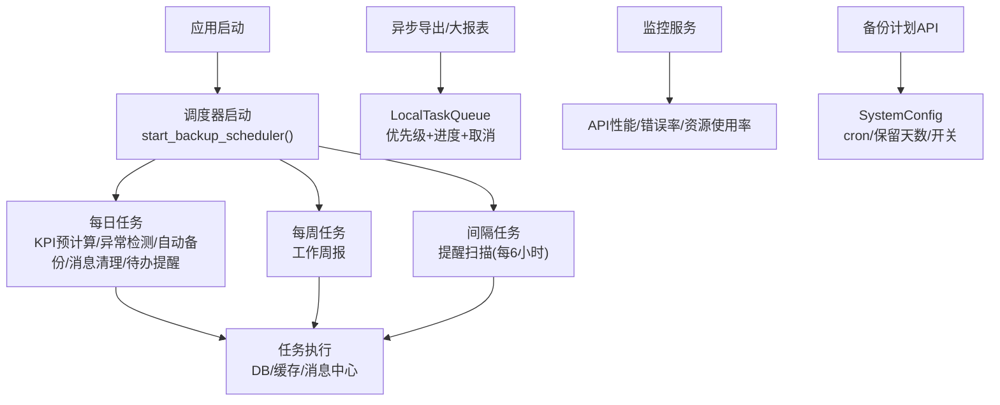
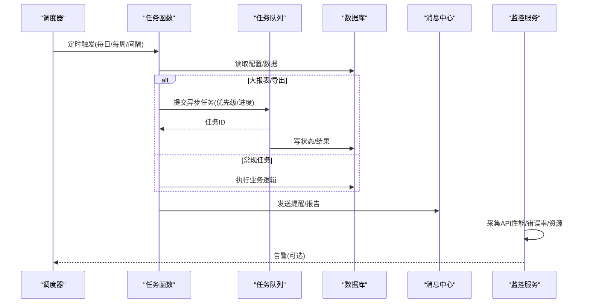
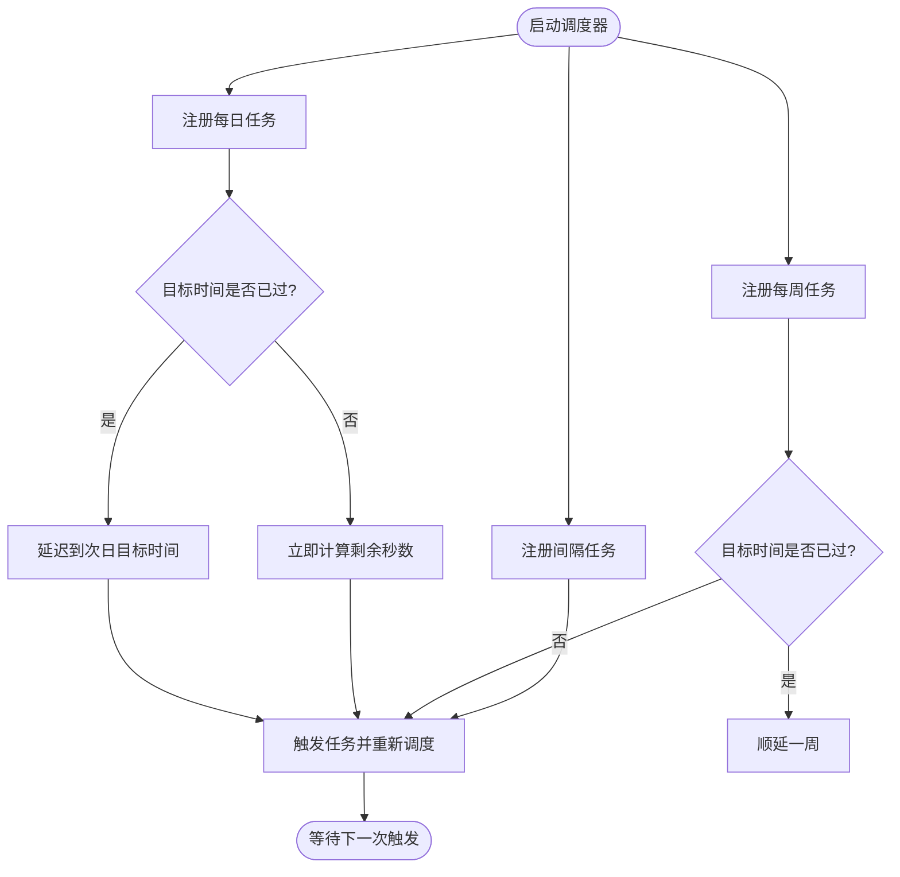
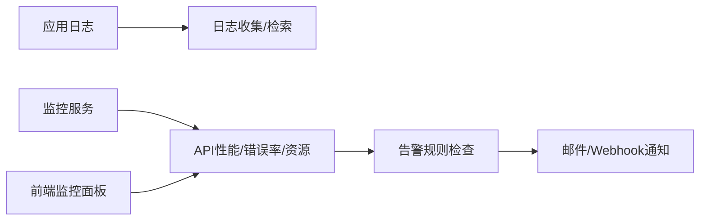
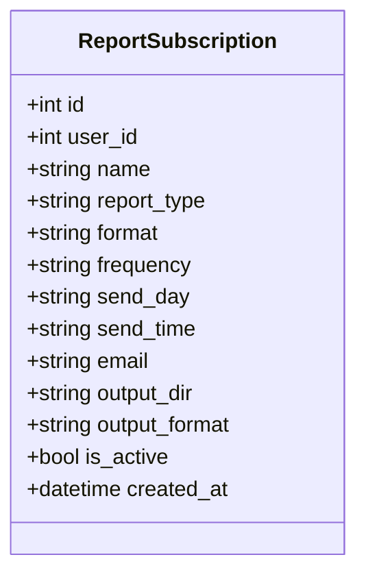
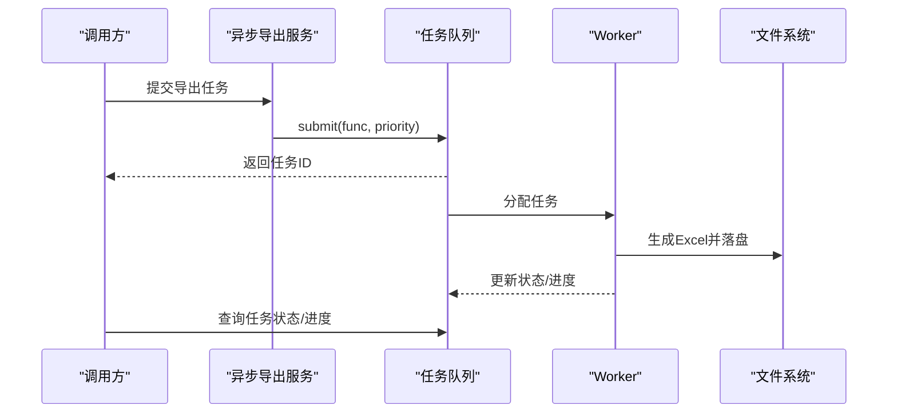
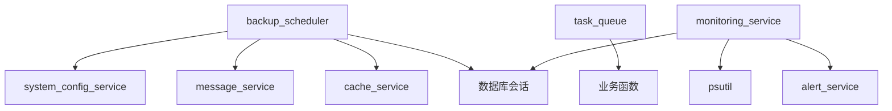

# 定时任务调度

<cite>
**本文引用的文件**
- [backend/app/services/backup_scheduler.py](file://backend/app/services/backup_scheduler.py)
- [backend/app/services/task_queue.py](file://backend/app/services/task_queue.py)
- [backend/app/services/monitoring_service.py](file://backend/app/services/monitoring_service.py)
- [backend/app/api/v1/system/backup.py](file://backend/app/api/v1/system/backup.py)
- [backend/app/models/system_config.py](file://backend/app/models/system_config.py)
- [backend/app/services/report_service.py](file://backend/app/services/report_service.py)
- [backend/app/schemas/supported_village.py](file://backend/app/schemas/supported_village.py)
- [backend/app/api/v1/data/data/reports.py](file://backend/app/api/v1/data/data/reports.py)
- [backend/app/services/async_export_service.py](file://backend/app/services/async_export_service.py)
- [frontend/src/views/system/MonitoringDashboard.vue](file://frontend/src/views/system/MonitoringDashboard.vue)
</cite>

## 目录
1. [简介](#简介)
2. [项目结构](#项目结构)
3. [核心组件](#核心组件)
4. [架构总览](#架构总览)
5. [详细组件分析](#详细组件分析)
6. [依赖关系分析](#依赖关系分析)
7. [性能与高可用](#性能与高可用)
8. [故障排查指南](#故障排查指南)
9. [结论](#结论)
10. [附录：配置与使用清单](#附录：配置与使用清单)

## 简介
本指南面向“报表定时生成与自动推送”的运维与使用者，覆盖以下目标：
- 如何配置报表的定时生成与自动推送（含 Cron 表达式、执行频率）
- 任务依赖管理与执行顺序控制
- 失败重试机制与异常处理策略
- 任务监控与执行日志查看
- 性能监控与资源占用分析工具使用方法
- 大规模定时任务的调度优化与高可用部署方案

本项目采用“后端统一调度 + 轻量线程定时器 + 内存任务队列”的组合方式，提供稳定可靠的后台任务能力。

## 项目结构
与定时任务相关的核心代码集中在后端 services 层与系统 API 层：
- 调度器：基于 threading.Timer 的轻量调度器，负责每日/每周/固定间隔的任务触发
- 任务队列：本地内存优先级队列，用于异步导出等长耗时任务
- 监控服务：API 性能、错误率、资源使用率统计与告警
- 备份与打包：自动备份、自动打包、消息清理、数据库维护等周期性任务
- 报表订阅：用户可创建报表订阅，支持按周/月等频率生成并输出到指定位置或邮箱

图表来源
- [backend/app/services/backup_scheduler.py:455-542](file://backend/app/services/backup_scheduler.py#L455-L542)
- [backend/app/services/task_queue.py:124-288](file://backend/app/services/task_queue.py#L124-L288)
- [backend/app/services/monitoring_service.py:26-181](file://backend/app/services/monitoring_service.py#L26-L181)
- [backend/app/api/v1/system/backup.py:408-467](file://backend/app/api/v1/system/backup.py#L408-L467)
- [backend/app/models/system_config.py:11-26](file://backend/app/models/system_config.py#L11-L26)

章节来源
- [backend/app/services/backup_scheduler.py:455-542](file://backend/app/services/backup_scheduler.py#L455-L542)
- [backend/app/services/task_queue.py:124-288](file://backend/app/services/task_queue.py#L124-L288)
- [backend/app/services/monitoring_service.py:26-181](file://backend/app/services/monitoring_service.py#L26-L181)
- [backend/app/api/v1/system/backup.py:408-467](file://backend/app/api/v1/system/backup.py#L408-L467)
- [backend/app/models/system_config.py:11-26](file://backend/app/models/system_config.py#L11-L26)

## 核心组件
- 调度器（backup_scheduler）：以 threading.Timer 实现每日/每周/固定间隔调度；每个任务在独立事件循环中运行，避免阻塞主进程；内置失败日志记录与通知。
- 任务队列（task_queue）：内存优先级队列，支持提交任务、进度更新、取消、清理；适用于大报表导出等异步场景。
- 监控服务（monitoring_service）：聚合 API 性能指标、错误率、资源使用率，并支持规则化告警。
- 备份计划 API（system/backup）：读取/写入 SystemConfig 中的 cron、保留天数、开关等，作为备份策略的唯一真相源。
- 报表订阅（report_service + schemas）：用户可创建订阅，定义报表类型、格式、频率、发送时间、输出目录/邮箱等。

章节来源
- [backend/app/services/backup_scheduler.py:60-365](file://backend/app/services/backup_scheduler.py#L60-L365)
- [backend/app/services/task_queue.py:20-122](file://backend/app/services/task_queue.py#L20-L122)
- [backend/app/services/monitoring_service.py:26-181](file://backend/app/services/monitoring_service.py#L26-L181)
- [backend/app/api/v1/system/backup.py:408-467](file://backend/app/api/v1/system/backup.py#L408-L467)
- [backend/app/services/report_service.py:171-242](file://backend/app/services/report_service.py#L171-L242)
- [backend/app/schemas/supported_village.py:181-198](file://backend/app/schemas/supported_village.py#L181-L198)

## 架构总览
下图展示从“调度触发 → 任务执行 → 结果落盘/消息 → 监控告警”的端到端流程。

图表来源
- [backend/app/services/backup_scheduler.py:467-529](file://backend/app/services/backup_scheduler.py#L467-L529)
- [backend/app/services/task_queue.py:158-214](file://backend/app/services/task_queue.py#L158-L214)
- [backend/app/services/monitoring_service.py:29-181](file://backend/app/services/monitoring_service.py#L29-L181)

## 详细组件分析

### 调度器：Cron 与执行频率
- 每日任务：通过 _schedule_daily 设置目标时/分，若目标已过则顺延至次日。
- 每周任务：通过 _schedule_weekly 设置目标星期与时分，若目标已过则顺延至下周。
- 间隔任务：通过 _schedule_interval 固定秒级间隔重复执行。
- 当前内置任务：
  - KPI 预计算（每日 00:30）
  - 回收站清理（每日 04:30）
  - 资金异常检测（每日 01:00）
  - 自动备份（每日 02:00）
  - 自动打包（每日 03:00）
  - 消息清理（每日 03:30）
  - 提醒扫描（每 6 小时）
  - 待办提醒（每日 08:00）
  - 工作周报（每周一 06:30）

注意：备份策略的 cron 由 SystemConfig 管理，前端可通过备份计划接口读写；调度器内部仍按固定时间点触发，但“是否启用/保留天数/下次运行时间”由配置决定。

图表来源
- [backend/app/services/backup_scheduler.py:476-529](file://backend/app/services/backup_scheduler.py#L476-L529)

章节来源
- [backend/app/services/backup_scheduler.py:455-542](file://backend/app/services/backup_scheduler.py#L455-L542)

### 任务依赖与执行顺序
- 调度器内各任务相互独立，按各自频率触发，无显式依赖图。
- 如需强依赖（例如先完成“数据清洗”再“生成报表”），建议：
  - 将上游任务完成后写入 SystemConfig 或数据库标记位
  - 下游任务启动时检查该标记位，满足条件才执行
  - 或使用任务队列提交下游任务，并在上游任务回调中触发

章节来源
- [backend/app/services/backup_scheduler.py:455-542](file://backend/app/services/backup_scheduler.py#L455-L542)
- [backend/app/models/system_config.py:11-26](file://backend/app/models/system_config.py#L11-L26)

### 失败重试与异常处理
- 调度器在执行异步任务时，捕获异常并记录日志，不中断其他任务。
- 关键任务（如自动备份）失败时会尝试发送站内消息提醒管理员。
- 任务队列对单个任务失败仅记录错误并标记为 failed，不影响其他任务。
- 当前未实现指数退避的重试机制；如需重试，可在任务函数内部封装重试逻辑，或在调度层增加重试计数器。

章节来源
- [backend/app/services/backup_scheduler.py:467-475](file://backend/app/services/backup_scheduler.py#L467-L475)
- [backend/app/services/backup_scheduler.py:60-148](file://backend/app/services/backup_scheduler.py#L60-L148)
- [backend/app/services/task_queue.py:269-284](file://backend/app/services/task_queue.py#L269-L284)

### 任务监控与执行日志
- 监控服务提供：
  - API 性能统计（请求量、平均响应时间、P50/P95/P99、错误率）
  - 端点维度统计
  - 错误统计（按状态码分组）
  - 系统资源统计（CPU/内存/磁盘）
- 前端监控面板会拉取健康检查与快照数据，便于观察系统状态。
- 调度器与任务队列均通过标准日志记录执行结果与异常，便于集中收集与分析。

图表来源
- [backend/app/services/monitoring_service.py:29-181](file://backend/app/services/monitoring_service.py#L29-L181)
- [frontend/src/views/system/MonitoringDashboard.vue:649-687](file://frontend/src/views/system/MonitoringDashboard.vue#L649-L687)

章节来源
- [backend/app/services/monitoring_service.py:29-181](file://backend/app/services/monitoring_service.py#L29-L181)
- [frontend/src/views/system/MonitoringDashboard.vue:649-687](file://frontend/src/views/system/MonitoringDashboard.vue#L649-L687)

### 报表订阅与自动推送
- 用户可创建报表订阅，包含：名称、报表类型、格式、频率（weekly/monthly）、发送日/时间、邮箱、输出目录、输出格式等。
- 订阅信息持久化后，可由调度器或外部触发器按频率生成报表并推送。
- 报表导出支持同步与异步两种模式；大数据量建议使用异步导出并通过任务队列追踪进度。

图表来源
- [backend/app/schemas/supported_village.py:181-198](file://backend/app/schemas/supported_village.py#L181-L198)
- [backend/app/services/report_service.py:171-242](file://backend/app/services/report_service.py#L171-L242)

章节来源
- [backend/app/services/report_service.py:171-242](file://backend/app/services/report_service.py#L171-L242)
- [backend/app/schemas/supported_village.py:181-198](file://backend/app/schemas/supported_village.py#L181-L198)

### 异步导出与进度追踪
- 异步导出服务会将任务提交到全局 LocalTaskQueue，后台 worker 执行导出并落盘，同时更新 ExportTask 状态。
- 支持进度查询与任务取消；适合大报表、综合报表等耗时操作。

图表来源
- [backend/app/services/async_export_service.py:344-364](file://backend/app/services/async_export_service.py#L344-L364)
- [backend/app/services/task_queue.py:158-214](file://backend/app/services/task_queue.py#L158-L214)

章节来源
- [backend/app/services/async_export_service.py:344-364](file://backend/app/services/async_export_service.py#L344-L364)
- [backend/app/services/task_queue.py:158-214](file://backend/app/services/task_queue.py#L158-L214)

## 依赖关系分析
- 调度器依赖：
  - 数据库会话上下文（事务与查询）
  - 系统配置服务（读取开关、保留天数、cron）
  - 消息服务（发送提醒/报告）
  - 缓存服务（KPI 预计算写入缓存）
- 任务队列依赖：
  - asyncio 并发原语
  - 业务函数（可为协程或同步函数）
- 监控服务依赖：
  - 数据库（APIMetric/AlertRule/AlertHistory）
  - 系统资源库（psutil）
  - 告警服务（邮件/Webhook）

图表来源
- [backend/app/services/backup_scheduler.py:20-23](file://backend/app/services/backup_scheduler.py#L20-L23)
- [backend/app/services/task_queue.py:7-15](file://backend/app/services/task_queue.py#L7-L15)
- [backend/app/services/monitoring_service.py:13-21](file://backend/app/services/monitoring_service.py#L13-L21)

章节来源
- [backend/app/services/backup_scheduler.py:20-23](file://backend/app/services/backup_scheduler.py#L20-L23)
- [backend/app/services/task_queue.py:7-15](file://backend/app/services/task_queue.py#L7-L15)
- [backend/app/services/monitoring_service.py:13-21](file://backend/app/services/monitoring_service.py#L13-L21)

## 性能与高可用
- 性能要点
  - 调度器使用独立事件循环执行异步任务，避免阻塞主线程。
  - 大报表导出走任务队列，支持优先级与进度追踪，降低前端超时风险。
  - 监控服务提供 API 性能与资源使用率指标，便于定位瓶颈。
- 高可用建议
  - 多实例部署时，确保同一时刻只有一个实例运行调度器（可通过分布式锁或外部调度器协调）。
  - 将 SystemConfig 置于共享存储（如数据库），保证配置一致性。
  - 对关键任务（备份、打包）增加幂等性与断点续传能力。
  - 结合外部监控与告警（邮件/Webhook）提升可观测性。

[本节为通用指导，不直接分析具体文件]

## 故障排查指南
- 常见问题
  - 任务未触发：检查调度器是否已启动、Timer 是否被取消、目标时间计算是否正确。
  - 任务执行失败：查看日志中的异常堆栈；确认数据库连接、外部依赖可用性。
  - 备份失败：检查备份目录权限、磁盘空间、加密密钥配置。
  - 报表导出为空：确认异步导出参数与数据源；检查任务队列是否真正执行。
- 排查步骤
  - 查看调度器日志与任务队列状态。
  - 通过监控面板查看 API 性能与错误率。
  - 核对 SystemConfig 中的开关与 cron 配置。
  - 必要时重启调度器或清理过期任务。

章节来源
- [backend/app/services/backup_scheduler.py:467-475](file://backend/app/services/backup_scheduler.py#L467-L475)
- [backend/app/services/task_queue.py:269-284](file://backend/app/services/task_queue.py#L269-L284)
- [backend/app/api/v1/system/backup.py:408-467](file://backend/app/api/v1/system/backup.py#L408-L467)

## 结论
本系统通过轻量调度器与内存任务队列实现了稳定可靠的定时任务能力，配合监控与告警体系，可满足报表定时生成与自动推送的日常需求。对于大规模场景，建议引入分布式锁或外部调度器，并结合更完善的重试与幂等设计，以提升整体可靠性与可维护性。

[本节为总结，不直接分析具体文件]

## 附录：配置与使用清单
- 备份计划配置
  - 获取配置：GET /api/v1/system/backup/schedule
  - 更新配置：PUT /api/v1/system/backup/schedule（enabled、keep_count、schedule）
  - 配置项说明：
    - auto_backup：是否启用自动备份
    - backup_retention_days：备份保留天数
    - backup_schedule_cron：备份调度 Cron（示例：0 2 * * *）
- 报表订阅
  - 创建订阅：POST /api/v1/reports/subscriptions（name、report_type、format、frequency、send_day、send_time、email、output_dir、output_format）
  - 列表订阅：GET /api/v1/reports/subscriptions
  - 更新订阅：PUT /api/v1/reports/subscriptions/{id}
- 异步导出
  - 提交导出：POST /api/v1/async-export/reports（export_type、query_params、file_name）
  - 查询进度：GET /api/v1/async-export/tasks/{task_id}
  - 取消任务：DELETE /api/v1/async-export/tasks/{task_id}
- 监控与告警
  - API 性能：GET /api/v1/system/monitor/api-stats?hours=24
  - 资源使用率：GET /api/v1/system/monitor/resource-stats
  - 告警规则：通过 AlertRule 配置阈值与持续时间，触发后发送邮件或 Webhook

章节来源
- [backend/app/api/v1/system/backup.py:408-467](file://backend/app/api/v1/system/backup.py#L408-L467)
- [backend/app/services/report_service.py:171-242](file://backend/app/services/report_service.py#L171-L242)
- [backend/app/schemas/supported_village.py:181-198](file://backend/app/schemas/supported_village.py#L181-L198)
- [backend/app/services/async_export_service.py:344-364](file://backend/app/services/async_export_service.py#L344-L364)
- [backend/app/services/monitoring_service.py:29-181](file://backend/app/services/monitoring_service.py#L29-L181)