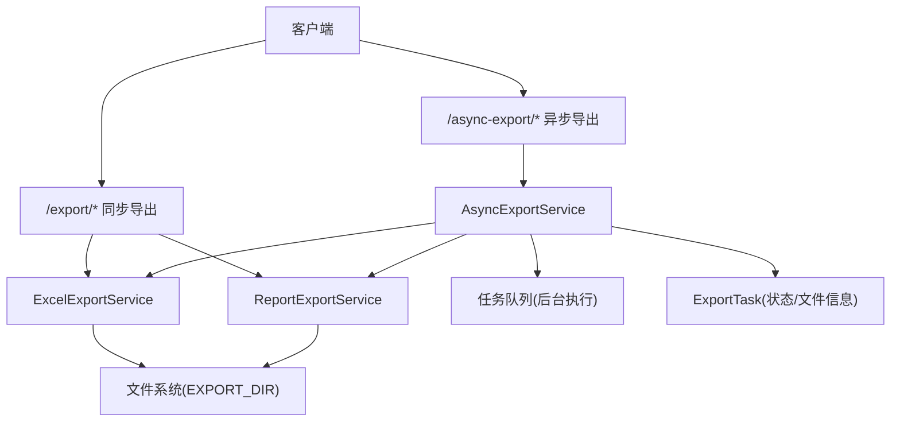
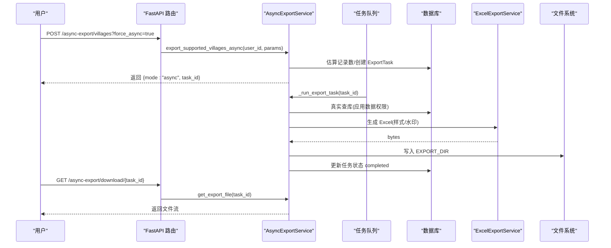
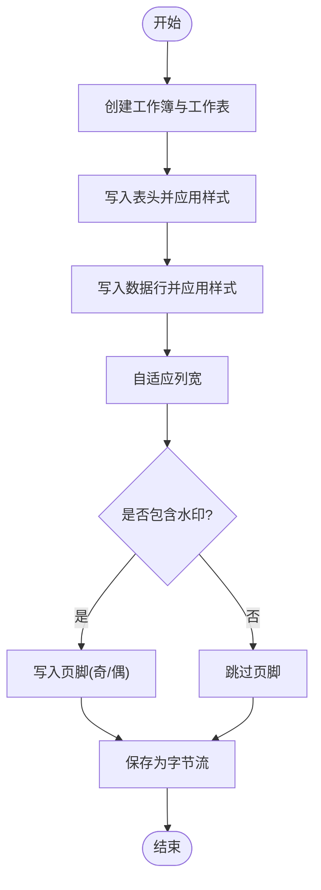
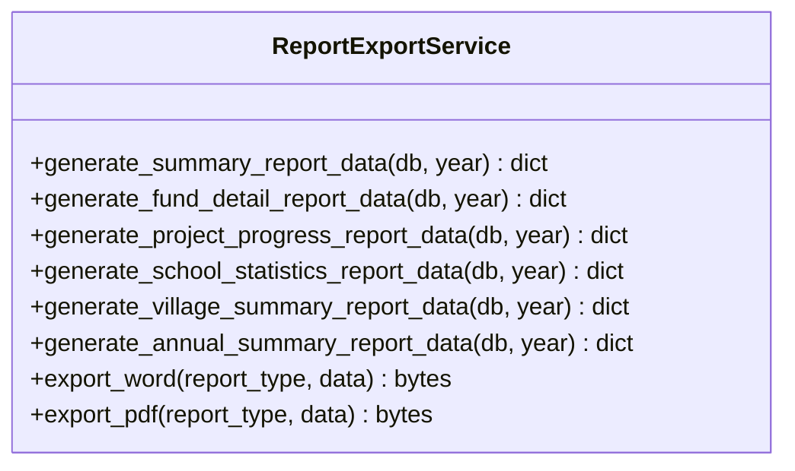
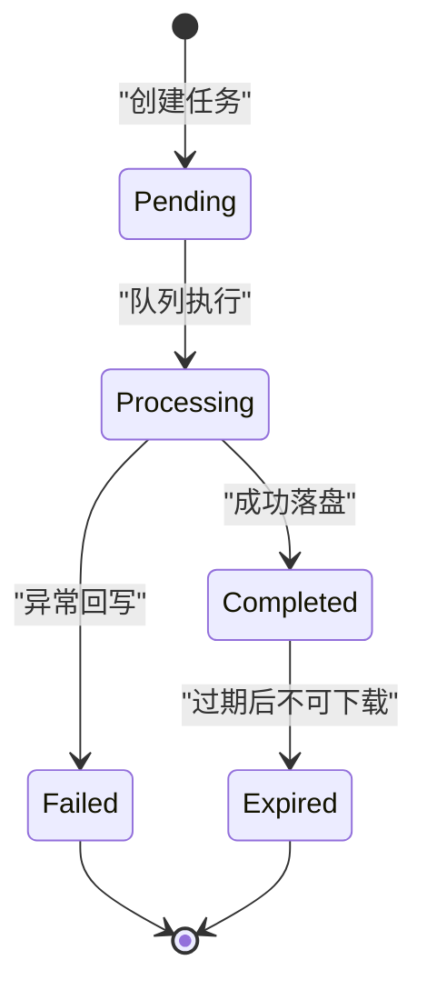
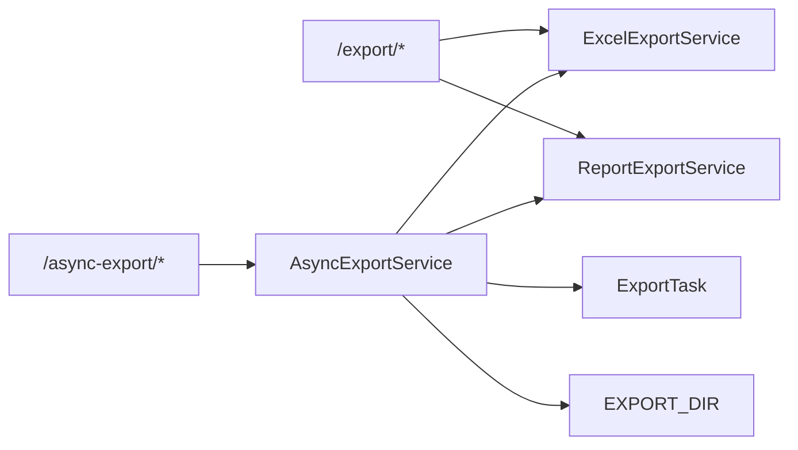

# 导出格式配置

<cite>
**本文引用的文件**
- [export_service.py](file://backend/app/services/export_service.py)
- [async_export_service.py](file://backend/app/services/async_export_service.py)
- [export_task.py](file://backend/app/models/export_task.py)
- [excel_template_service.py](file://backend/app/services/excel_template_service.py)
- [report_export_service.py](file://backend/app/services/report_export_service.py)
- [export.py](file://backend/app/api/v1/import_export/export.py)
- [async_export.py](file://backend/app/api/v1/import_export/async_export.py)
- [config.py](file://backend/app/core/config.py)
</cite>

## 目录
1. [简介](#简介)
2. [项目结构](#项目结构)
3. [核心组件](#核心组件)
4. [架构总览](#架构总览)
5. [详细组件分析](#详细组件分析)
6. [依赖关系分析](#依赖关系分析)
7. [性能与内存优化](#性能与内存优化)
8. [故障排查指南](#故障排查指南)
9. [结论](#结论)
10. [附录：API 与配置速查](#附录api-与配置速查)

## 简介
本指南面向“导出格式配置”功能，覆盖 Excel、PDF、Word、CSV 等格式的样式与布局设置、模板自定义与扩展、分页/页眉页脚/水印配置、批量与异步导出任务管理、性能优化与内存管理建议，以及不同业务场景下的最佳实践与兼容性处理方案。内容基于后端服务实现与 API 端点，提供可操作的配置指引与排错方法。

## 项目结构
导出能力由“数据导出服务 + 报表导出服务 + 异步任务服务 + API 路由 + 模型与配置”组成：
- Excel 导出：ExcelExportService 负责生成带样式的 Excel（含多 sheet、汇总、水印）。
- 报表导出：ReportExportService 生成 Word/PDF 公文报告（统一数据结构渲染）。
- 异步导出：AsyncExportService 负责大记录数导出任务创建、执行、状态查询与下载。
- API：/export/* 同步导出；/async-export/* 异步导出与任务管理。
- 模型：ExportTask 持久化任务元数据与状态。
- 配置：EXPORT_DIR 控制导出文件落盘路径。

图表来源
- [export.py:22-72](file://backend/app/api/v1/import_export/export.py#L22-L72)
- [async_export.py:100-333](file://backend/app/api/v1/import_export/async_export.py#L100-L333)
- [export_service.py:10-189](file://backend/app/services/export_service.py#L10-L189)
- [report_export_service.py:46-448](file://backend/app/services/report_export_service.py#L46-L448)
- [async_export_service.py:330-516](file://backend/app/services/async_export_service.py#L330-L516)
- [export_task.py:18-121](file://backend/app/models/export_task.py#L18-L121)

章节来源
- [export.py:22-72](file://backend/app/api/v1/import_export/export.py#L22-L72)
- [async_export.py:100-333](file://backend/app/api/v1/import_export/async_export.py#L100-L333)
- [export_service.py:10-189](file://backend/app/services/export_service.py#L10-L189)
- [report_export_service.py:46-448](file://backend/app/services/report_export_service.py#L46-L448)
- [async_export_service.py:330-516](file://backend/app/services/async_export_service.py#L330-L516)
- [export_task.py:18-121](file://backend/app/models/export_task.py#L18-L121)

## 核心组件
- ExcelExportService：统一的 Excel 工作簿构建器，支持表头样式、边框、对齐、自适应列宽、审计水印（写入页脚），并提供综合报表多 sheet 导出。
- ReportExportService：统一的数据结构（标题/段落/表格）渲染为 Word 或 PDF，内置中文字体与 A4 页面边距。
- AsyncExportService：按实体类型真实查库、估算记录数、选择同步/异步模式、提交任务队列、落盘并更新任务状态。
- ExportTask：导出任务的状态机（pending/processing/completed/failed/expired）、过期控制、下载权限校验。
- ExcelTemplateService：导入模板生成（A4 打印风格、下拉验证、填写说明），可用于导出模板的样式参考与扩展。

章节来源
- [export_service.py:10-189](file://backend/app/services/export_service.py#L10-L189)
- [report_export_service.py:46-448](file://backend/app/services/report_export_service.py#L46-L448)
- [async_export_service.py:330-516](file://backend/app/services/async_export_service.py#L330-L516)
- [export_task.py:18-121](file://backend/app/models/export_task.py#L18-L121)
- [excel_template_service.py:91-631](file://backend/app/services/excel_template_service.py#L91-L631)

## 架构总览
导出流程分为两类：
- 同步导出：API 直接查询数据并生成文件返回（适用于小数据集）。
- 异步导出：当记录数超过阈值时，创建任务并提交到后台队列，完成后落盘并可下载。

图表来源
- [async_export.py:150-198](file://backend/app/api/v1/import_export/async_export.py#L150-L198)
- [async_export_service.py:454-481](file://backend/app/services/async_export_service.py#L454-L481)
- [async_export_service.py:330-387](file://backend/app/services/async_export_service.py#L330-L387)
- [export_service.py:24-58](file://backend/app/services/export_service.py#L24-L58)
- [config.py:170-173](file://backend/app/core/config.py#L170-L173)

## 详细组件分析

### Excel 导出与样式配置
- 表头样式：加粗、主题色填充、白字、居中、细边框。
- 数据行：居中对齐、细边框。
- 列宽：根据内容自适应，上限限制避免过宽。
- 水印：将审计信息（导出人/时间）写入奇偶页脚，便于溯源。
- 综合报表：多 sheet（汇总/村庄/项目/经费），每个 sheet 独立表头与列宽。

图表来源
- [export_service.py:24-58](file://backend/app/services/export_service.py#L24-L58)
- [export_service.py:134-186](file://backend/app/services/export_service.py#L134-L186)

章节来源
- [export_service.py:24-58](file://backend/app/services/export_service.py#L24-L58)
- [export_service.py:134-186](file://backend/app/services/export_service.py#L134-L186)

### 报表导出（Word/PDF）与页面元素
- 统一数据结构：sections 包含标题、段落、可选表格。
- Word：使用 python-docx，设置中文字体、标题与正文样式、表格样式。
- PDF：使用 reportlab，注册 CID 中文字体，设置 A4 边距、表格样式与对齐。
- 空数据处理：无数据时输出“暂无相关数据”，避免空文件。

图表来源
- [report_export_service.py:46-448](file://backend/app/services/report_export_service.py#L46-L448)

章节来源
- [report_export_service.py:46-448](file://backend/app/services/report_export_service.py#L46-L448)

### 异步导出与任务管理
- 阈值判断：记录数超过阈值（默认 5000）自动切换异步模式，也可强制异步。
- 任务生命周期：pending → processing → completed/failed，失败时记录错误信息。
- 文件落盘：导出文件写入 EXPORT_DIR，文件名包含任务 ID 与导出类型。
- 下载控制：仅 completed 且未过期的任务可下载，支持权限校验。

图表来源
- [export_task.py:18-121](file://backend/app/models/export_task.py#L18-L121)
- [async_export_service.py:330-387](file://backend/app/services/async_export_service.py#L330-L387)
- [async_export.py:201-333](file://backend/app/api/v1/import_export/async_export.py#L201-L333)

章节来源
- [export_task.py:18-121](file://backend/app/models/export_task.py#L18-L121)
- [async_export_service.py:330-387](file://backend/app/services/async_export_service.py#L330-L387)
- [async_export.py:201-333](file://backend/app/api/v1/import_export/async_export.py#L201-L333)

### 模板自定义与扩展
- Excel 模板：通过 ExcelTemplateService 生成标准 A4 打印模板，包含标题区、数据表、填写说明、下拉验证、斑马纹、冻结表头、页脚版本信息等。
- 扩展方式：新增实体类型字段定义（如 VILLAGE_FIELDS/POLICY_FIELDS），在模板构建逻辑中接入；对枚举字段添加 DataValidation 下拉列表。
- 样式复用：颜色常量、字体、边框、对齐对象集中定义，便于统一风格。

章节来源
- [excel_template_service.py:91-631](file://backend/app/services/excel_template_service.py#L91-L631)

### 分页、页眉页脚、水印配置
- Excel 分页：模板服务设置 A4 纸张、横向、fitToWidth=1，页边距上下左右及页眉页脚高度。
- 页眉页脚：模板服务设置 page_margins.header/footer；Excel 导出服务将审计信息写入 oddFooter/evenFooter。
- 水印：当前实现为“页脚水印”，用于审计溯源；如需视觉水印，可在后续扩展中增加背景水印层。

章节来源
- [excel_template_service.py:329-345](file://backend/app/services/excel_template_service.py#L329-L345)
- [export_service.py:53-58](file://backend/app/services/export_service.py#L53-L58)

### 批量导出与异步导出任务管理
- 批量导出：API 支持按实体类型批量导出（users/villages/schools/projects/funds），均受数据权限过滤与 MAX_EXPORT_ROWS 限制。
- 异步导出：/async-export/villages 支持 force_async 参数；/async-export/reports 支持按报表类型导出；/async-export/tasks 分页查询任务列表；/async-export/status/{task_id} 查询状态；/async-export/download/{task_id} 下载文件。

章节来源
- [export.py:75-358](file://backend/app/api/v1/import_export/export.py#L75-L358)
- [async_export.py:100-333](file://backend/app/api/v1/import_export/async_export.py#L100-L333)

## 依赖关系分析
- API 层依赖服务层：/export/* 调用 ExcelExportService 与 ReportExportService；/async-export/* 调用 AsyncExportService。
- 服务层依赖模型与配置：ExportTask 存储任务状态；EXPORT_DIR 控制文件落盘路径。
- 服务间协作：AsyncExportService 内部复用 ExcelExportService 与 ReportExportService 完成具体格式生成。

图表来源
- [export.py:22-72](file://backend/app/api/v1/import_export/export.py#L22-L72)
- [async_export.py:100-333](file://backend/app/api/v1/import_export/async_export.py#L100-L333)
- [async_export_service.py:330-516](file://backend/app/services/async_export_service.py#L330-L516)
- [config.py:170-173](file://backend/app/core/config.py#L170-L173)

章节来源
- [export.py:22-72](file://backend/app/api/v1/import_export/export.py#L22-L72)
- [async_export.py:100-333](file://backend/app/api/v1/import_export/async_export.py#L100-L333)
- [async_export_service.py:330-516](file://backend/app/services/async_export_service.py#L330-L516)
- [config.py:170-173](file://backend/app/core/config.py#L170-L173)

## 性能与内存优化
- 记录数阈值：超过 5000 条自动走异步导出，避免阻塞请求线程。
- 最大行数限制：MAX_EXPORT_ROWS = 10000，防止一次性加载过多数据导致内存峰值过高。
- 流式生成：Excel 使用 BytesIO 保存为字节流，减少磁盘 IO；PDF/Word 同样以内存缓冲生成。
- 分页与限制：综合报表明细 sheet 限制前 100 条，降低大报表体积。
- 并发与队列：任务队列后台执行，独立会话生成文件，避免与主请求共享资源。
- 建议：
  - 大数据量优先使用异步导出，前端轮询状态并下载。
  - 合理设置筛选条件以减少查询结果集。
  - 定期清理过期导出文件（结合 EXPORT_DIR 与任务过期策略）。
  - 监控日志中的导出耗时与失败原因，定位瓶颈。

章节来源
- [async_export_service.py:30-31](file://backend/app/services/async_export_service.py#L30-L31)
- [export.py:26](file://backend/app/api/v1/import_export/export.py#L26)
- [async_export_service.py:315-327](file://backend/app/services/async_export_service.py#L315-L327)
- [async_export_service.py:244-312](file://backend/app/services/async_export_service.py#L244-L312)

## 故障排查指南
- 任务一直 pending：检查任务队列是否启动；确认异步任务已提交至队列。
- 导出为空文件：确认 API 传入的筛选条件与数据权限；检查 MAX_EXPORT_ROWS 限制。
- 下载失败：
  - “正在处理中”：等待任务完成后再下载。
  - “任务失败”：查看任务 error_message 定位错误。
  - “文件已过期”：任务 expires_at 已过，需重新导出。
- 中文乱码：CSV 使用 utf-8-sig 编码；Word/PDF 使用内建中文字体。
- 样式不生效：确认使用的是 ExcelExportService 的样式常量；模板服务样式集中在常量区域。

章节来源
- [async_export.py:201-333](file://backend/app/api/v1/import_export/async_export.py#L201-L333)
- [export.py:45-72](file://backend/app/api/v1/import_export/export.py#L45-L72)
- [report_export_service.py:318-443](file://backend/app/services/report_export_service.py#L318-L443)
- [export_task.py:85-121](file://backend/app/models/export_task.py#L85-L121)

## 结论
本系统提供了完善的导出格式配置能力：Excel 样式与水印、Word/PDF 公文报告、CSV 兼容、模板自定义与扩展、分页与页眉页脚配置、批量与异步任务管理、性能优化与内存控制。通过合理的筛选条件与异步策略，可在保证用户体验的同时稳定处理大规模数据导出。建议在业务场景中优先采用异步导出，并结合任务状态与过期策略进行文件生命周期管理。

## 附录：API 与配置速查
- 同步导出（Excel/CSV）：
  - /export/users、/export/villages、/export/schools、/export/projects、/export/funds、/export/comprehensive
  - 参数：format=xlsx|csv，keyword/status/type 等筛选
- 公文报告导出（Word/PDF）：
  - /export/report-word、/export/report-pdf
  - 参数：report_type=summary|fund_detail|project_progress|school_statistics|village_summary|annual_summary，year
- 异步导出与任务管理：
  - POST /async-export/villages（支持 force_async）
  - POST /async-export/reports（按报表类型导出）
  - GET /async-export/status/{task_id}
  - GET /async-export/download/{task_id}
  - GET /async-export/tasks（分页、状态筛选）
- 配置项：
  - EXPORT_DIR：导出文件落盘目录（默认 ./exports）
  - MAX_EXPORT_ROWS：单次导出最大记录数（默认 10000）
  - 异步阈值：ASYNC_THRESHOLD（默认 5000）

章节来源
- [export.py:75-449](file://backend/app/api/v1/import_export/export.py#L75-L449)
- [async_export.py:100-333](file://backend/app/api/v1/import_export/async_export.py#L100-L333)
- [config.py:170-173](file://backend/app/core/config.py#L170-L173)
- [async_export_service.py:30-31](file://backend/app/services/async_export_service.py#L30-L31)