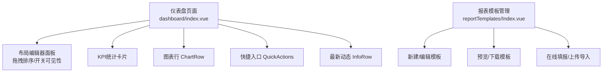
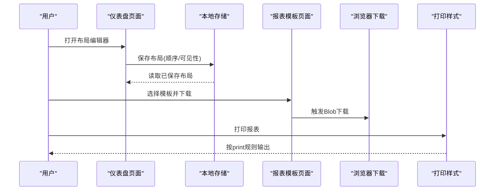
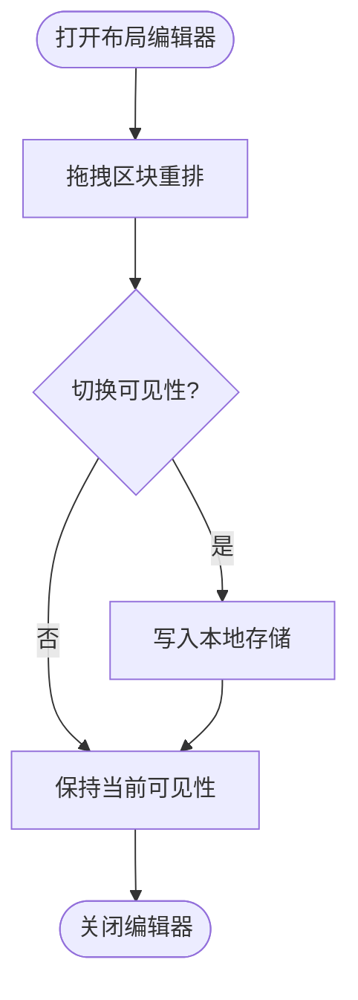
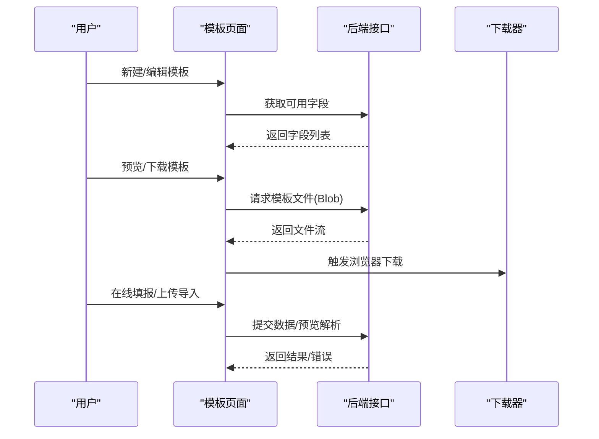
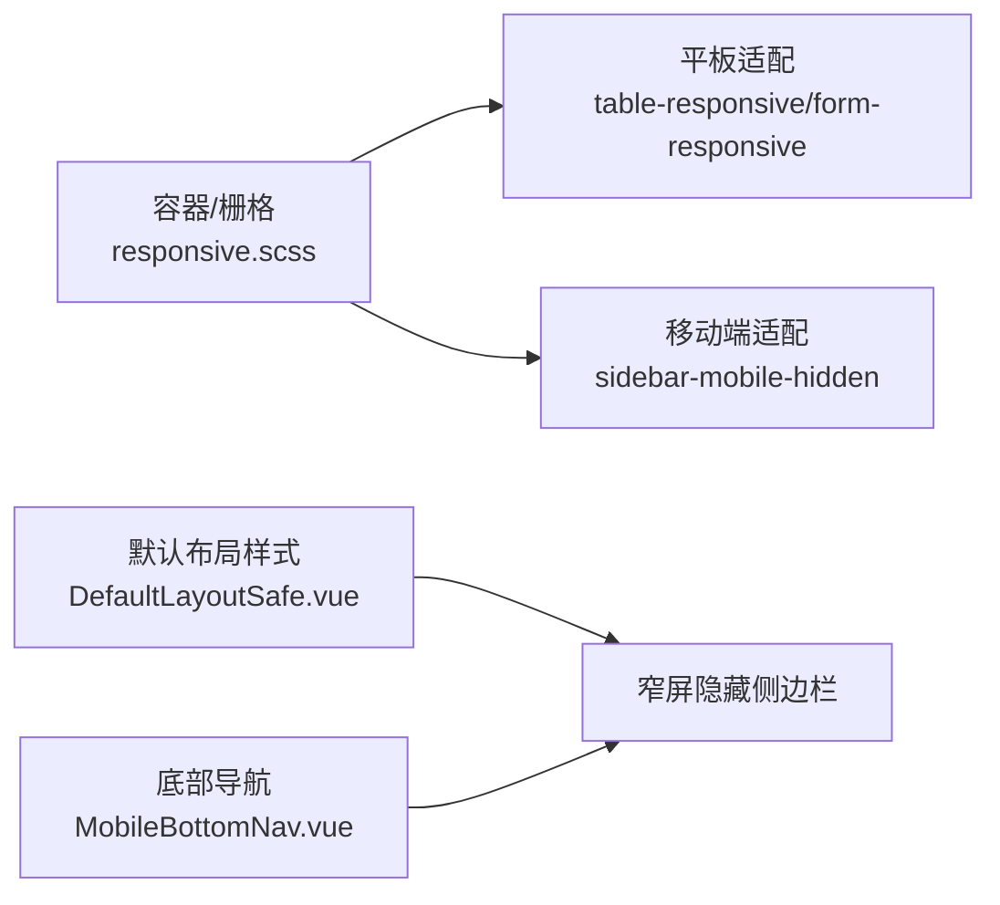
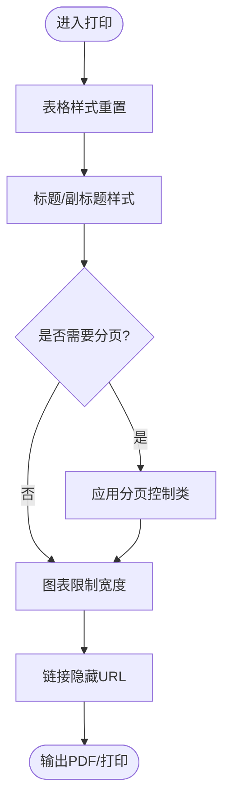
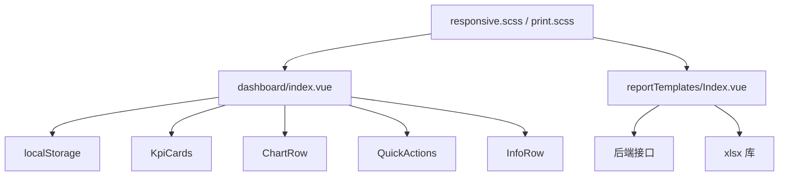

# 布局设计器

<cite>
**本文引用的文件**
- [frontend/src/views/dashboard/index.vue](file://frontend/src/views/dashboard/index.vue)
- [frontend/src/styles/print.scss](file://frontend/src/styles/print.scss)
- [frontend/src/styles/responsive.scss](file://frontend/src/styles/responsive.scss)
- [frontend/src/layouts/DefaultLayoutSafe.vue](file://frontend/src/layouts/DefaultLayoutSafe.vue)
- [frontend/src/components/layout/MobileBottomNav.vue](file://frontend/src/components/layout/MobileBottomNav.vue)
- [frontend/src/views/reportTemplates/Index.vue](file://frontend/src/views/reportTemplates/Index.vue)
</cite>

## 目录
1. [简介](#简介)
2. [项目结构](#项目结构)
3. [核心组件](#核心组件)
4. [架构总览](#架构总览)
5. [详细组件分析](#详细组件分析)
6. [依赖关系分析](#依赖关系分析)
7. [性能考虑](#性能考虑)
8. [故障排查指南](#故障排查指南)
9. [结论](#结论)
10. [附录](#附录)

## 简介
本指南面向使用“布局设计器”的用户与实施人员，说明如何在系统中通过拖拽式界面设计报表布局，包括表格、图表、文本框等组件的添加与配置；介绍属性设置与样式定制方法；解释响应式布局适配与多设备显示优化；说明布局模板的保存、分享与复用；提供布局预览与打印优化的配置选项；并给出复杂报表布局的设计模式与用户体验优化建议。

## 项目结构
系统在前端提供了两类与“布局”相关的功能：
- 仪表盘自定义布局：支持在仪表盘中对区块进行拖拽排序与可见性控制，并将布局持久化到本地存储。
- 报表模板管理：提供导入/导出模板的创建、编辑、预览、下载与在线填报能力，便于统一数据格式与批量处理。

图示来源
- [frontend/src/views/dashboard/index.vue:1-200](file://frontend/src/views/dashboard/index.vue#L1-L200)
- [frontend/src/views/reportTemplates/Index.vue:1-120](file://frontend/src/views/reportTemplates/Index.vue#L1-L120)

章节来源
- [frontend/src/views/dashboard/index.vue:1-200](file://frontend/src/views/dashboard/index.vue#L1-L200)
- [frontend/src/views/reportTemplates/Index.vue:1-120](file://frontend/src/views/reportTemplates/Index.vue#L1-L120)

## 核心组件
- 仪表盘布局编辑器：提供拖拽排序、可见性切换、预设模板应用与恢复默认等功能，布局状态保存在本地存储中。
- 报表模板管理：提供模板的创建、字段映射、预览、下载、在线填报与上传导入（含增量/全量覆盖）流程。
- 响应式与打印样式：提供跨设备适配与打印输出优化，确保在不同屏幕尺寸和打印场景下的可读性与一致性。

章节来源
- [frontend/src/views/dashboard/index.vue:160-200](file://frontend/src/views/dashboard/index.vue#L160-L200)
- [frontend/src/views/reportTemplates/Index.vue:459-750](file://frontend/src/views/reportTemplates/Index.vue#L459-L750)
- [frontend/src/styles/responsive.scss:106-134](file://frontend/src/styles/responsive.scss#L106-L134)
- [frontend/src/styles/print.scss:78-149](file://frontend/src/styles/print.scss#L78-L149)

## 架构总览
布局设计器由“交互层（页面与对话框）—状态层（本地存储/表单）—渲染层（组件与样式）—导出/打印层（Blob下载与print样式）”构成。用户通过拖拽与开关调整布局，状态写入本地存储；报表模板通过前端生成Excel或调用后端接口完成下载与导入。

图示来源
- [frontend/src/views/dashboard/index.vue:172-200](file://frontend/src/views/dashboard/index.vue#L172-L200)
- [frontend/src/views/reportTemplates/Index.vue:732-750](file://frontend/src/views/reportTemplates/Index.vue#L732-L750)
- [frontend/src/styles/print.scss:78-149](file://frontend/src/styles/print.scss#L78-L149)

## 详细组件分析

### 仪表盘布局编辑器
- 功能要点
  - 拖拽排序：通过原生 drag/drop 事件实现区块重排。
  - 可见性控制：每个区块提供开关，实时控制渲染。
  - 预设模板：内置多种布局预设（如管理员、访客等），一键应用。
  - 持久化：将布局顺序与可见性保存到 localStorage，刷新后恢复。
- 关键流程
  - 打开编辑器 → 拖拽排序 → 切换可见性 → 自动保存 → 关闭时提示“已保存”。

图示来源
- [frontend/src/views/dashboard/index.vue:27-46](file://frontend/src/views/dashboard/index.vue#L27-L46)
- [frontend/src/views/dashboard/index.vue:172-200](file://frontend/src/views/dashboard/index.vue#L172-L200)

章节来源
- [frontend/src/views/dashboard/index.vue:1-200](file://frontend/src/views/dashboard/index.vue#L1-L200)

### 报表模板管理
- 功能要点
  - 模板类型：导入模板与导出模板。
  - 字段映射：选择模块后加载可用字段，支持对象数组形式的字段映射。
  - 预览与下载：预览模板元信息与字段，下载为 Excel。
  - 在线填报：根据模板字段生成表单，导出为 Excel。
  - 上传导入：支持增量导入与全量覆盖两种模式，提供数据预览与错误详情。
- 关键流程
  - 新建/编辑模板 → 选择字段 → 预览/下载 → 在线填报 → 上传导入（预览→确认）。

图示来源
- [frontend/src/views/reportTemplates/Index.vue:106-175](file://frontend/src/views/reportTemplates/Index.vue#L106-L175)
- [frontend/src/views/reportTemplates/Index.vue:208-283](file://frontend/src/views/reportTemplates/Index.vue#L208-L283)
- [frontend/src/views/reportTemplates/Index.vue:285-413](file://frontend/src/views/reportTemplates/Index.vue#L285-L413)
- [frontend/src/views/reportTemplates/Index.vue:732-750](file://frontend/src/views/reportTemplates/Index.vue#L732-L750)

章节来源
- [frontend/src/views/reportTemplates/Index.vue:106-413](file://frontend/src/views/reportTemplates/Index.vue#L106-L413)
- [frontend/src/views/reportTemplates/Index.vue:732-750](file://frontend/src/views/reportTemplates/Index.vue#L732-L750)

### 响应式布局与多设备适配
- 容器与栅格：提供响应式容器与栅格类，适配不同屏幕宽度。
- 移动端导航：窄屏下隐藏侧边栏，底部导航固定高度避免遮挡内容。
- 表格与表单：平板端表格横向滚动，表单间距与标签对齐优化。
- 媒体查询：针对小屏设备调整布局与字体大小，提升可阅读性。

图示来源
- [frontend/src/styles/responsive.scss:106-134](file://frontend/src/styles/responsive.scss#L106-L134)
- [frontend/src/styles/responsive.scss:312-381](file://frontend/src/styles/responsive.scss#L312-L381)
- [frontend/src/layouts/DefaultLayoutSafe.vue:1114-1128](file://frontend/src/layouts/DefaultLayoutSafe.vue#L1114-L1128)
- [frontend/src/components/layout/MobileBottomNav.vue](file://frontend/src/components/layout/MobileBottomNav.vue)

章节来源
- [frontend/src/styles/responsive.scss:106-134](file://frontend/src/styles/responsive.scss#L106-L134)
- [frontend/src/styles/responsive.scss:312-381](file://frontend/src/styles/responsive.scss#L312-L381)
- [frontend/src/layouts/DefaultLayoutSafe.vue:1114-1128](file://frontend/src/layouts/DefaultLayoutSafe.vue#L1114-L1128)
- [frontend/src/components/layout/MobileBottomNav.vue](file://frontend/src/components/layout/MobileBottomNav.vue)

### 打印优化与预览
- 表格打印：强制边框、字号与背景色，避免分页打断。
- 标题与副标题：统一字号与居中，增强封面感。
- 分页控制：提供页面前/内分页控制类，避免内容被截断。
- 图表打印：限制最大宽度，避免溢出；交互式图表在打印时以静态形式呈现。
- 链接处理：打印时不显示URL后缀，保持版面整洁。

图示来源
- [frontend/src/styles/print.scss:78-149](file://frontend/src/styles/print.scss#L78-L149)

章节来源
- [frontend/src/styles/print.scss:78-149](file://frontend/src/styles/print.scss#L78-L149)

## 依赖关系分析
- 仪表盘布局编辑器依赖本地存储进行持久化，并通过组件组合渲染各区块。
- 报表模板管理依赖前端库（如 xlsx）与后端接口完成模板下载与导入。
- 响应式与打印样式作为全局样式被页面引用，影响整体布局与输出效果。

图示来源
- [frontend/src/views/dashboard/index.vue:172-200](file://frontend/src/views/dashboard/index.vue#L172-L200)
- [frontend/src/views/reportTemplates/Index.vue:573-582](file://frontend/src/views/reportTemplates/Index.vue#L573-L582)
- [frontend/src/styles/responsive.scss:106-134](file://frontend/src/styles/responsive.scss#L106-L134)
- [frontend/src/styles/print.scss:78-149](file://frontend/src/styles/print.scss#L78-L149)

章节来源
- [frontend/src/views/dashboard/index.vue:172-200](file://frontend/src/views/dashboard/index.vue#L172-L200)
- [frontend/src/views/reportTemplates/Index.vue:573-582](file://frontend/src/views/reportTemplates/Index.vue#L573-L582)
- [frontend/src/styles/responsive.scss:106-134](file://frontend/src/styles/responsive.scss#L106-L134)
- [frontend/src/styles/print.scss:78-149](file://frontend/src/styles/print.scss#L78-L149)

## 性能考虑
- 本地存储读写：布局变更频繁时注意序列化与解析开销，避免过大对象。
- 模板下载：大文件下载建议使用分块或后台任务，前端仅负责触发与提示。
- 打印渲染：大量图表与表格时，建议在打印前生成静态图以减少DOM复杂度。
- 响应式计算：媒体查询与动态样式应尽量减少重排与重绘。

[本节为通用指导，无需特定文件来源]

## 故障排查指南
- 布局未保存
  - 检查本地存储是否被清理或受限；确认布局写入逻辑是否执行。
  - 参考：布局持久化逻辑位置。
- 模板下载失败
  - 检查网络与权限；确认接口返回是否为 Blob；查看错误提示。
  - 参考：下载触发与错误处理位置。
- 上传导入报错
  - 检查文件格式与大小限制；查看预览错误列表；确认导入模式选择。
  - 参考：上传预览与确认导入流程。
- 打印排版异常
  - 检查是否使用了分页控制类；确认表格与图表样式是否被覆盖。
  - 参考：打印样式定义位置。

章节来源
- [frontend/src/views/dashboard/index.vue:172-200](file://frontend/src/views/dashboard/index.vue#L172-L200)
- [frontend/src/views/reportTemplates/Index.vue:732-750](file://frontend/src/views/reportTemplates/Index.vue#L732-L750)
- [frontend/src/views/reportTemplates/Index.vue:285-413](file://frontend/src/views/reportTemplates/Index.vue#L285-L413)
- [frontend/src/styles/print.scss:78-149](file://frontend/src/styles/print.scss#L78-L149)

## 结论
本布局设计器通过直观的拖拽与开关操作，帮助用户快速构建个性化仪表盘布局；配合报表模板管理，可实现标准化的数据导入导出与在线填报。响应式与打印样式保障多设备一致体验与高质量输出。建议在实际使用中结合业务角色与数据规模，合理选择布局预设与模板策略，以获得最佳效率与稳定性。

[本节为总结性内容，无需特定文件来源]

## 附录
- 常用快捷键与操作
  - 打开布局编辑器：点击页面头部设置按钮。
  - 拖拽排序：按住区块左侧手柄拖动至目标位置。
  - 切换可见性：点击区块右侧开关。
  - 应用预设：在下拉菜单中选择模板并确认。
- 最佳实践
  - 将高频使用的区块置顶，减少滚动成本。
  - 为不同角色配置专属布局预设，提升信息密度。
  - 报表模板命名规范清晰，便于检索与复用。
  - 打印前预览并启用分页控制，避免内容截断。

[本节为补充说明，无需特定文件来源]