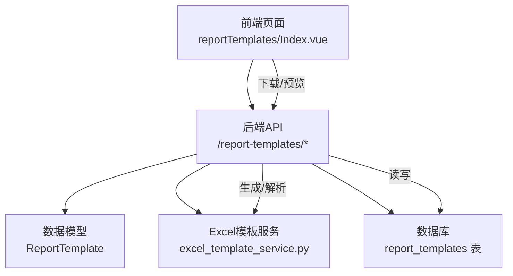
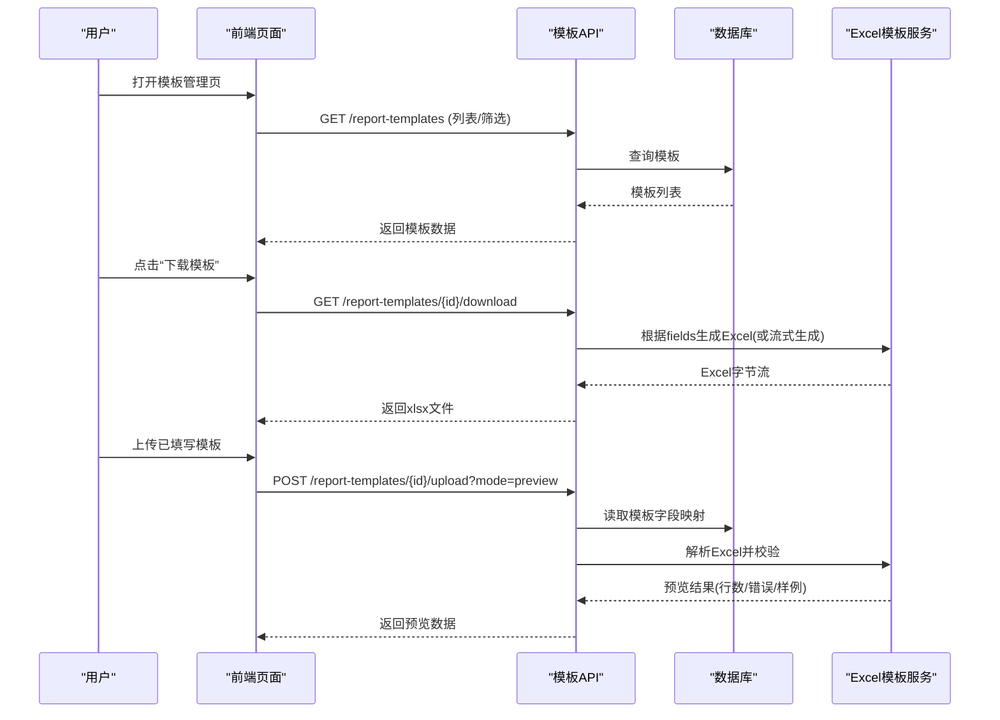
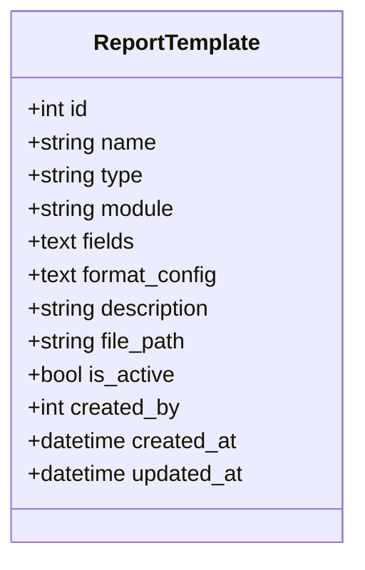
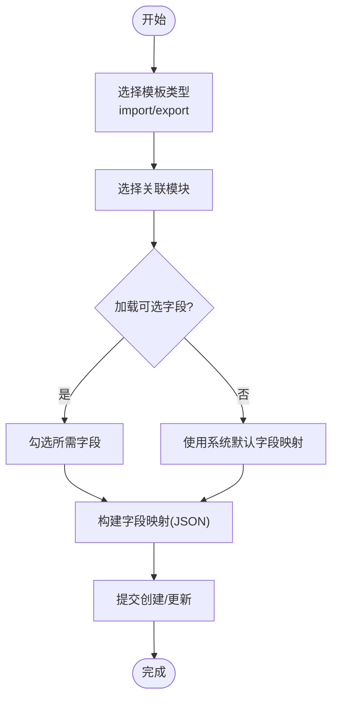
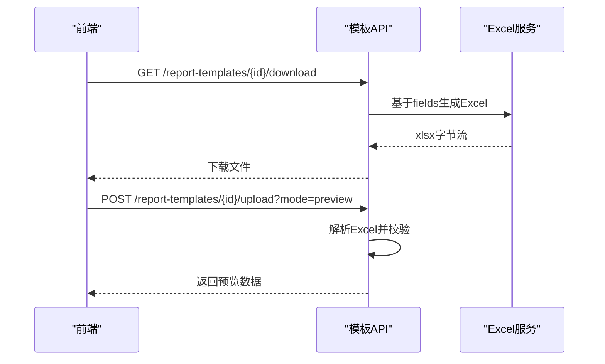
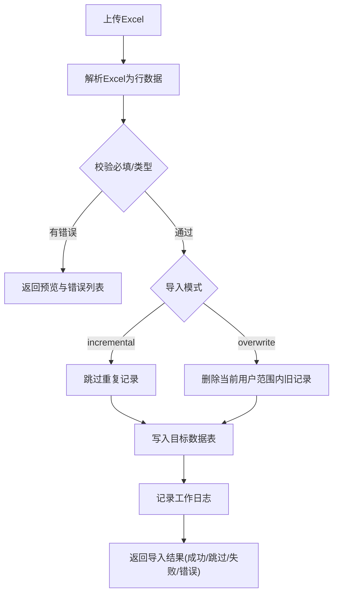
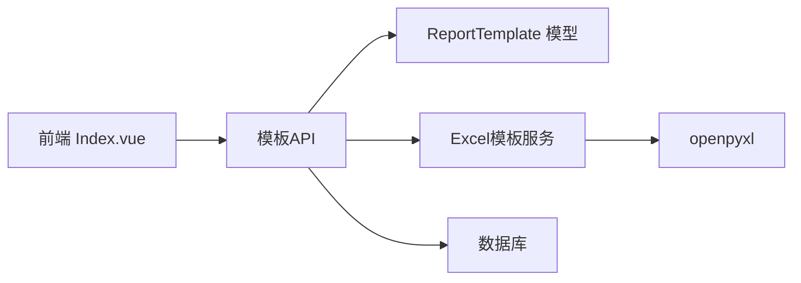

# 报表模板管理

<cite>
**本文引用的文件**
- [backend/app/models/report_template.py](file://backend/app/models/report_template.py)
- [backend/app/api/v1/report_templates.py](file://backend/app/api/v1/report_templates.py)
- [backend/app/services/excel_template_service.py](file://backend/app/services/excel_template_service.py)
- [frontend/src/views/reportTemplates/Index.vue](file://frontend/src/views/reportTemplates/Index.vue)
- [docs/03-开发文档/03-API文档/API接口文档.md](file://docs/03-开发文档/03-API文档/API接口文档.md)
- [backend/tests/unit/test_report_templates_api.py](file://backend/tests/unit/test_report_templates_api.py)
</cite>

## 目录
1. [简介](#简介)
2. [项目结构](#项目结构)
3. [核心组件](#核心组件)
4. [架构总览](#架构总览)
5. [详细组件分析](#详细组件分析)
6. [依赖关系分析](#依赖关系分析)
7. [性能与容量](#性能与容量)
8. [故障排查指南](#故障排查指南)
9. [结论](#结论)
10. [附录：API 速查](#附录api-速查)

## 简介
本指南面向系统管理员与业务用户，系统性说明“报表模板管理”功能的使用方法与最佳实践。内容涵盖：
- 如何创建、编辑和管理报表模板（导入/导出）
- 模板结构设计、字段定义与样式配置
- 内置模板的使用与自定义模板的创建流程
- 模板版本管理与共享机制说明
- 模板参数化与动态内容插入方法
- 模板预览与测试操作
- 模板导入导出与批量操作的最佳实践

## 项目结构
报表模板管理由前后端协同实现：
- 后端提供模板CRUD、Excel模板生成、上传解析与数据导入能力
- 前端提供模板列表、筛选、新建/编辑、预览、下载、在线填报、上传填报等交互界面

图表来源
- [backend/app/api/v1/report_templates.py:298-443](file://backend/app/api/v1/report_templates.py#L298-L443)
- [backend/app/models/report_template.py:44-72](file://backend/app/models/report_template.py#L44-L72)
- [backend/app/services/excel_template_service.py:256-323](file://backend/app/services/excel_template_service.py#L256-L323)
- [frontend/src/views/reportTemplates/Index.vue:1-104](file://frontend/src/views/reportTemplates/Index.vue#L1-L104)

章节来源
- [frontend/src/views/reportTemplates/Index.vue:1-104](file://frontend/src/views/reportTemplates/Index.vue#L1-L104)
- [backend/app/api/v1/report_templates.py:298-443](file://backend/app/api/v1/report_templates.py#L298-L443)
- [backend/app/models/report_template.py:44-72](file://backend/app/models/report_template.py#L44-L72)
- [backend/app/services/excel_template_service.py:256-323](file://backend/app/services/excel_template_service.py#L256-L323)

## 核心组件
- 数据模型 ReportTemplate：存储模板名称、类型（import/export）、关联模块、字段映射（JSON）、格式配置（JSON）、是否启用、创建人与时间戳等
- 模板API：提供模板列表、详情、创建、更新、删除、下载、上传解析与导入
- Excel模板服务：按模块生成带样式、示例行、下拉校验与填写说明的A4打印版Excel模板
- 前端模板页：支持搜索、筛选、新建/编辑、预览、下载、在线填报、上传填报等操作

章节来源
- [backend/app/models/report_template.py:44-72](file://backend/app/models/report_template.py#L44-L72)
- [backend/app/api/v1/report_templates.py:298-443](file://backend/app/api/v1/report_templates.py#L298-L443)
- [backend/app/services/excel_template_service.py:256-323](file://backend/app/services/excel_template_service.py#L256-L323)
- [frontend/src/views/reportTemplates/Index.vue:1-104](file://frontend/src/views/reportTemplates/Index.vue#L1-L104)

## 架构总览

图表来源
- [backend/app/api/v1/report_templates.py:298-443](file://backend/app/api/v1/report_templates.py#L298-L443)
- [backend/app/api/v1/report_templates.py:1178-1250](file://backend/app/api/v1/report_templates.py#L1178-L1250)
- [backend/app/services/excel_template_service.py:256-323](file://backend/app/services/excel_template_service.py#L256-L323)

## 详细组件分析

### 数据模型与字段设计
- 模板类型：导入模板(import)、导出模板(export)
- 关联模块：village/school/fund/project/rural_work/comprehensive
- 字段映射：以JSON数组形式保存，包含Excel列、表头、数据库字段名、是否必填等
- 格式配置：以JSON字符串保存纸张大小、页眉页脚、列宽等
- 启用状态：is_active控制模板是否可用

图表来源
- [backend/app/models/report_template.py:44-72](file://backend/app/models/report_template.py#L44-L72)

章节来源
- [backend/app/models/report_template.py:44-72](file://backend/app/models/report_template.py#L44-L72)

### 模板创建与编辑
- 创建：选择模板类型、关联模块；可勾选“可选字段”组合生成字段映射，未勾选则使用系统默认字段映射；可设置描述
- 编辑：可修改名称、描述、是否启用；字段映射与格式配置可在后续扩展中调整
- 校验：后端对type/module进行白名单校验，非法值将拒绝

图表来源
- [backend/app/api/v1/report_templates.py:335-378](file://backend/app/api/v1/report_templates.py#L335-L378)
- [backend/app/api/v1/report_templates.py:1253-1294](file://backend/app/api/v1/report_templates.py#L1253-L1294)
- [frontend/src/views/reportTemplates/Index.vue:106-175](file://frontend/src/views/reportTemplates/Index.vue#L106-L175)

章节来源
- [backend/app/api/v1/report_templates.py:335-378](file://backend/app/api/v1/report_templates.py#L335-L378)
- [backend/app/api/v1/report_templates.py:1253-1294](file://backend/app/api/v1/report_templates.py#L1253-L1294)
- [frontend/src/views/reportTemplates/Index.vue:106-175](file://frontend/src/views/reportTemplates/Index.vue#L106-L175)

### 模板下载与预览
- 下载：根据模板的字段映射，后端动态生成Excel文件，包含标题、表头、必填标注、列宽等样式
- 预览：上传已填写模板后，可选择预览模式查看解析结果（总行数、有效行数、错误列表、前10条样例数据）

图表来源
- [backend/app/api/v1/report_templates.py:446-502](file://backend/app/api/v1/report_templates.py#L446-L502)
- [backend/app/api/v1/report_templates.py:1178-1250](file://backend/app/api/v1/report_templates.py#L1178-L1250)
- [backend/app/services/excel_template_service.py:256-323](file://backend/app/services/excel_template_service.py#L256-L323)

章节来源
- [backend/app/api/v1/report_templates.py:446-502](file://backend/app/api/v1/report_templates.py#L446-L502)
- [backend/app/api/v1/report_templates.py:1178-1250](file://backend/app/api/v1/report_templates.py#L1178-L1250)

### 模板导入与数据写入
- 上传后支持两种模式：
  - 增量导入(incremental)：跳过重复记录
  - 全量覆盖(overwrite)：先删除当前用户数据范围内的旧记录，再导入新数据
- 支持的模块：village/school/project/rural_work；fund暂不支持通过Excel导入
- 导入过程会记录工作日志，便于审计追踪

图表来源
- [backend/app/api/v1/report_templates.py:1178-1250](file://backend/app/api/v1/report_templates.py#L1178-L1250)
- [backend/app/api/v1/report_templates.py:617-740](file://backend/app/api/v1/report_templates.py#L617-L740)
- [backend/app/api/v1/report_templates.py:854-1025](file://backend/app/api/v1/report_templates.py#L854-L1025)
- [backend/app/api/v1/report_templates.py:1028-1172](file://backend/app/api/v1/report_templates.py#L1028-L1172)

章节来源
- [backend/app/api/v1/report_templates.py:1178-1250](file://backend/app/api/v1/report_templates.py#L1178-L1250)
- [backend/app/api/v1/report_templates.py:617-740](file://backend/app/api/v1/report_templates.py#L617-L740)
- [backend/app/api/v1/report_templates.py:854-1025](file://backend/app/api/v1/report_templates.py#L854-L1025)
- [backend/app/api/v1/report_templates.py:1028-1172](file://backend/app/api/v1/report_templates.py#L1028-L1172)

### 内置模板与样式配置
- 内置模板：系统为各模块预置了默认字段映射，便于快速创建模板
- 样式配置：Excel模板采用正式风格A4打印版，包含深绿主题、金色装饰线、斑马纹、冻结表头、下拉校验、填写说明页等
- 可通过format_config进一步定制纸张大小、页边距、列宽等（JSON格式）

章节来源
- [backend/app/api/v1/report_templates.py:109-293](file://backend/app/api/v1/report_templates.py#L109-L293)
- [backend/app/services/excel_template_service.py:21-88](file://backend/app/services/excel_template_service.py#L21-L88)
- [backend/app/services/excel_template_service.py:295-323](file://backend/app/services/excel_template_service.py#L295-L323)

### 模板参数化与动态内容插入
- 字段映射中的db_field用于将Excel列映射到数据库字段，从而实现参数化导入
- 对于日期/布尔/数值等类型，后端提供安全转换函数，确保数据一致性
- 动态内容：可在format_config中配置动态元素（如页眉页脚文本），在生成模板时注入

章节来源
- [backend/app/api/v1/report_templates.py:552-615](file://backend/app/api/v1/report_templates.py#L552-L615)
- [backend/app/services/excel_template_service.py:295-323](file://backend/app/services/excel_template_service.py#L295-L323)

### 模板预览与测试
- 预览：上传模板后选择mode=preview，返回总行数、有效行数、错误列表与前10条样例数据
- 测试建议：
  - 先用少量数据预览，确认字段映射正确
  - 检查必填项与数据类型是否符合预期
  - 确认导入模式（incremental/overwrite）符合业务需求

章节来源
- [backend/app/api/v1/report_templates.py:1178-1250](file://backend/app/api/v1/report_templates.py#L1178-L1250)
- [backend/tests/unit/test_report_templates_api.py:352-374](file://backend/tests/unit/test_report_templates_api.py#L352-L374)

### 模板版本管理与共享
- 版本管理：当前模板表无独立版本字段，但具备created_at/updated_at与创建人信息，可用于基础变更追踪
- 共享机制：模板通过is_active控制启用状态，结合权限体系可实现组织内共享；如需细粒度共享，可在上层权限管理中配置
- 建议：重要模板变更前复制为新模板并保留历史版本，避免误改影响生产

章节来源
- [backend/app/models/report_template.py:44-72](file://backend/app/models/report_template.py#L44-L72)
- [backend/app/api/v1/report_templates.py:298-320](file://backend/app/api/v1/report_templates.py#L298-L320)

### 模板导入导出与批量操作最佳实践
- 导入：
  - 优先使用预览模式验证数据质量
  - 合理选择导入模式：增量导入避免重复，全量覆盖用于重置数据
  - 注意必填项与数据类型，减少错误率
- 导出：
  - 使用导出模板下载标准格式，保证输出一致性
  - 结合format_config统一纸张与样式，便于打印归档
- 批量操作：
  - 大文件分批处理，避免内存压力
  - 记录工作日志，便于问题追溯

章节来源
- [backend/app/api/v1/report_templates.py:1178-1250](file://backend/app/api/v1/report_templates.py#L1178-L1250)
- [backend/app/services/excel_template_service.py:295-323](file://backend/app/services/excel_template_service.py#L295-L323)

## 依赖关系分析

图表来源
- [frontend/src/views/reportTemplates/Index.vue:1-104](file://frontend/src/views/reportTemplates/Index.vue#L1-L104)
- [backend/app/api/v1/report_templates.py:298-443](file://backend/app/api/v1/report_templates.py#L298-L443)
- [backend/app/models/report_template.py:44-72](file://backend/app/models/report_template.py#L44-L72)
- [backend/app/services/excel_template_service.py:256-323](file://backend/app/services/excel_template_service.py#L256-L323)

章节来源
- [backend/app/api/v1/report_templates.py:298-443](file://backend/app/api/v1/report_templates.py#L298-L443)
- [backend/app/models/report_template.py:44-72](file://backend/app/models/report_template.py#L44-L72)
- [backend/app/services/excel_template_service.py:256-323](file://backend/app/services/excel_template_service.py#L256-L323)
- [frontend/src/views/reportTemplates/Index.vue:1-104](file://frontend/src/views/reportTemplates/Index.vue#L1-L104)

## 性能与容量
- Excel解析：使用只读模式加载工作簿，降低内存占用
- 导入限制：单次导入建议控制在合理范围（例如1000条以内），避免超时与内存压力
- 并发与事务：导入过程使用事务保障一致性，异常时回滚
- 索引与查询：模板列表支持按类型、模块、启用状态过滤，提升检索效率

章节来源
- [backend/app/api/v1/report_templates.py:508-546](file://backend/app/api/v1/report_templates.py#L508-L546)
- [backend/app/api/v1/report_templates.py:298-320](file://backend/app/api/v1/report_templates.py#L298-L320)

## 故障排查指南
- 无法解析Excel：检查文件格式是否为.xlsx/.xls，并确保模板存在字段映射
- 必填项缺失：预览阶段查看错误列表，修正后再导入
- 导入失败：检查数据类型与枚举值映射是否正确；核对导入模式是否符合预期
- 权限问题：确认当前用户具有模板操作权限与数据范围访问权限

章节来源
- [backend/app/api/v1/report_templates.py:1178-1250](file://backend/app/api/v1/report_templates.py#L1178-L1250)
- [backend/tests/unit/test_report_templates_api.py:236-267](file://backend/tests/unit/test_report_templates_api.py#L236-L267)

## 结论
报表模板管理提供了从模板创建、样式配置、预览测试到导入导出的完整闭环能力。通过字段映射与格式配置，既能满足标准化输出，又能灵活适配不同业务场景。建议在关键模板变更前保留历史版本，并结合权限体系实现组织内共享与管控。

## 附录：API 速查
- 获取模板列表：GET /report-templates
- 创建模板：POST /report-templates
- 获取可用字段：GET /report-templates/available-fields
- 获取模板详情：GET /report-templates/{template_id}
- 更新模板：PUT /report-templates/{template_id}
- 删除模板：DELETE /report-templates/{template_id}
- 下载模板：GET /report-templates/{template_id}/download
- 上传模板：POST /report-templates/{template_id}/upload?mode=preview|confirm&import_mode=incremental|overwrite

章节来源
- [docs/03-开发文档/03-API文档/API接口文档.md:789-800](file://docs/03-开发文档/03-API文档/API接口文档.md#L789-L800)