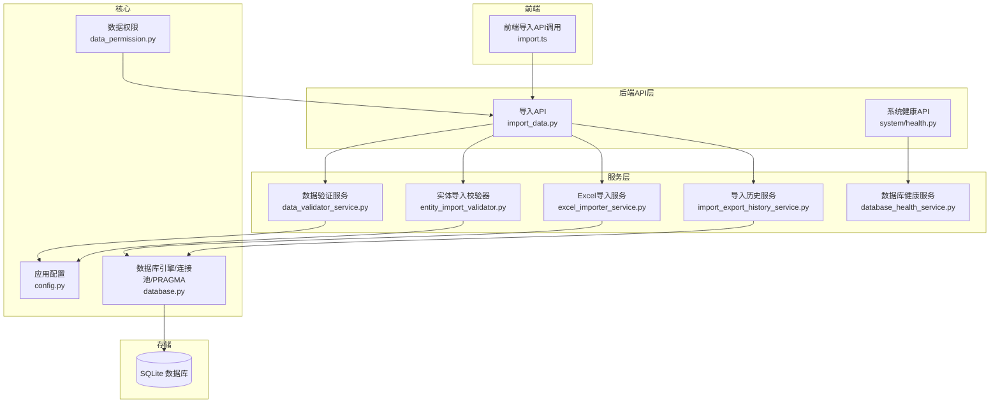
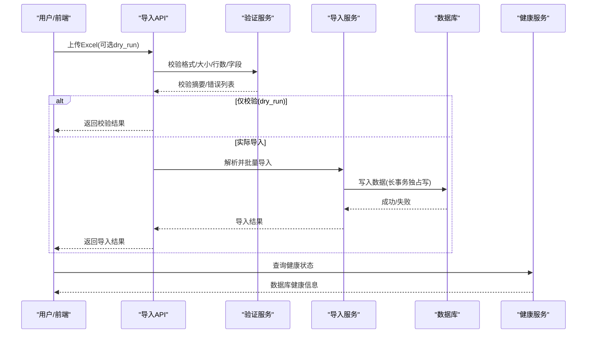
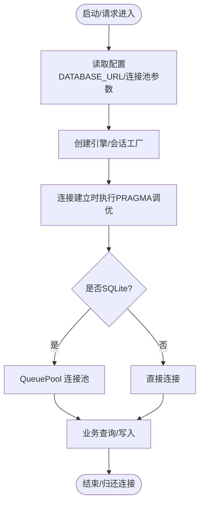
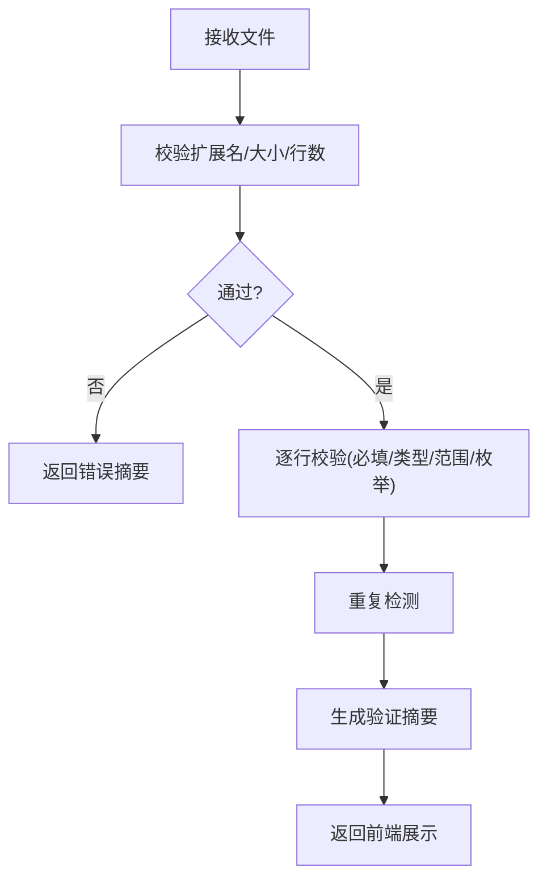
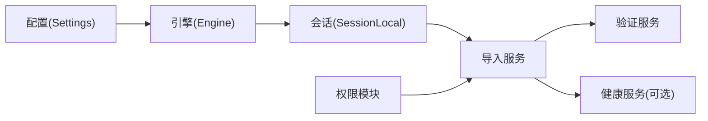

# 数据源配置

<cite>
**本文引用的文件**
- [backend/app/core/config.py](file://backend/app/core/config.py)
- [backend/app/core/database.py](file://backend/app/core/database.py)
- [backend/app/api/v1/import_export/import_data.py](file://backend/app/api/v1/import_export/import_data.py)
- [backend/app/services/data_validator_service.py](file://backend/app/services/data_validator_service.py)
- [backend/app/services/entity_import_validator.py](file://backend/app/services/entity_import_validator.py)
- [backend/app/services/excel_importer_service.py](file://backend/app/services/excel_importer_service.py)
- [backend/app/services/import_export_history_service.py](file://backend/app/services/import_export_history_service.py)
- [backend/app/models/import_history.py](file://backend/app/models/import_history.py)
- [backend/app/core/data_permission.py](file://backend/app/core/data_permission.py)
- [backend/app/api/v1/system/health.py](file://backend/app/api/v1/system/health.py)
- [backend/app/services/database_health_service.py](file://backend/app/services/database_health_service.py)
- [frontend/src/api/import.ts](file://frontend/src/api/import.ts)
</cite>

## 目录
1. [简介](#简介)
2. [项目结构](#项目结构)
3. [核心组件](#核心组件)
4. [架构总览](#架构总览)
5. [详细组件分析](#详细组件分析)
6. [依赖关系分析](#依赖关系分析)
7. [性能考虑](#性能考虑)
8. [故障排查指南](#故障排查指南)
9. [结论](#结论)
10. [附录](#附录)

## 简介
本指南面向“乡村振兴系统”的数据源配置与使用，覆盖以下目标：
- 数据库连接、API接口、文件导入等数据源的接入方式
- 数据源验证机制与连接池配置
- 数据映射规则定义与数据转换函数编写
- 数据源权限控制与访问策略
- 数据源监控与健康检查
- 大数据量数据源的优化与调优建议

## 项目结构
后端采用 FastAPI + SQLAlchemy（SQLite 为主）的架构，数据源相关能力集中在 core（配置与数据库）、services（导入/验证/健康检查）、api（导入与系统健康端点），以及前端 import API 调用。



**图表来源**
- [backend/app/api/v1/import_export/import_data.py:114-281](file://backend/app/api/v1/import_export/import_data.py#L114-L281)
- [backend/app/services/excel_importer_service.py:617-654](file://backend/app/services/excel_importer_service.py#L617-L654)
- [backend/app/services/data_validator_service.py:165-199](file://backend/app/services/data_validator_service.py#L165-L199)
- [backend/app/services/entity_import_validator.py:463-522](file://backend/app/services/entity_import_validator.py#L463-L522)
- [backend/app/core/database.py:55-67](file://backend/app/core/database.py#L55-L67)
- [backend/app/core/config.py:95-104](file://backend/app/core/config.py#L95-L104)
- [backend/app/api/v1/system/health.py:59-88](file://backend/app/api/v1/system/health.py#L59-L88)

**章节来源**
- [backend/app/core/config.py:95-104](file://backend/app/core/config.py#L95-L104)
- [backend/app/core/database.py:55-67](file://backend/app/core/database.py#L55-L67)
- [backend/app/api/v1/import_export/import_data.py:114-281](file://backend/app/api/v1/import_export/import_data.py#L114-L281)

## 核心组件
- 配置中心：集中管理数据库URL、连接池参数、加密开关、路径等
- 数据库引擎：SQLAlchemy Engine/Session、SQLite PRAGMA 调优、写入协调器
- 导入服务：Excel 解析、批量导入、增量/全量模式、预览与校验
- 验证服务：文件格式/大小/行数限制、字段类型与范围校验、重复检测
- 权限控制：基于角色/组织的数据范围过滤与记录级访问控制
- 健康检查：数据库完整性、快速检查、统计指标与启动自检
- 导入历史：操作审计、结果持久化与查询

**章节来源**
- [backend/app/core/config.py:75-104](file://backend/app/core/config.py#L75-L104)
- [backend/app/core/database.py:78-157](file://backend/app/core/database.py#L78-L157)
- [backend/app/api/v1/import_export/import_data.py:166-281](file://backend/app/api/v1/import_export/import_data.py#L166-L281)
- [backend/app/services/data_validator_service.py:165-199](file://backend/app/services/data_validator_service.py#L165-L199)
- [backend/app/core/data_permission.py:20-80](file://backend/app/core/data_permission.py#L20-L80)
- [backend/app/services/database_health_service.py:16-46](file://backend/app/services/database_health_service.py#L16-L46)

## 架构总览
数据源配置贯穿“配置—连接—导入—验证—权限—监控”的全链路：
- 配置通过 Settings 加载环境变量或默认值，并动态修正路径与安全策略
- 数据库引擎在连接时执行 PRAGMA 调优，启用 WAL、外键约束、超时与内存缓存
- 导入流程提供模板下载、预览、校验与实际导入，支持 dry-run 安全试跑
- 权限模块按用户角色/组织自动裁剪查询范围，保障数据安全
- 健康检查提供数据库完整性与运行状态，便于运维监控



**图表来源**
- [backend/app/api/v1/import_export/import_data.py:185-281](file://backend/app/api/v1/import_export/import_data.py#L185-L281)
- [backend/app/services/data_validator_service.py:514-590](file://backend/app/services/data_validator_service.py#L514-L590)
- [backend/app/core/database.py:198-285](file://backend/app/core/database.py#L198-L285)
- [backend/app/api/v1/system/health.py:59-88](file://backend/app/api/v1/system/health.py#L59-L88)

## 详细组件分析

### 数据库连接与连接池配置
- 数据库URL与路径：支持 SQLite 本地文件，自动将相对路径转换为绝对路径，避免权限问题
- 连接池参数：pool_size、max_overflow、pool_timeout、pool_recycle、pool_pre_ping、echo
- SQLite 调优：WAL 模式、外键开启、busy_timeout、cache_size、mmap_size、临时表内存存储、自动索引、WAL checkpoint
- 写入协调器：长事务独占写上下文管理器，避免 SQLITE_BUSY；兼容队列串行写入
- 磁盘空间检查：备份/导入前检查可用空间



**图表来源**
- [backend/app/core/config.py:75-104](file://backend/app/core/config.py#L75-L104)
- [backend/app/core/database.py:55-67](file://backend/app/core/database.py#L55-L67)
- [backend/app/core/database.py:78-157](file://backend/app/core/database.py#L78-L157)
- [backend/app/core/database.py:198-285](file://backend/app/core/database.py#L198-L285)

**章节来源**
- [backend/app/core/config.py:75-104](file://backend/app/core/config.py#L75-L104)
- [backend/app/core/database.py:55-67](file://backend/app/core/database.py#L55-L67)
- [backend/app/core/database.py:78-157](file://backend/app/core/database.py#L78-L157)
- [backend/app/core/database.py:198-285](file://backend/app/core/database.py#L198-L285)

### 文件导入与数据映射
- 模板下载：按实体类型生成带示例数据的 Excel 模板
- 导入入口：通用实体导入 /v1/import/entities，支持 incremental/full 模式与 dry_run
- 解析与映射：根据表头映射到内部字段名，跳过示例行与空行
- 数据类型转换：int/float/bool/date/枚举标准化（中文→英文）
- 预览与校验：解析后返回前50行预览，标注错误与重复标记

```mermaid
sequenceDiagram
participant FE as "前端"
participant API as "导入API"
participant PAR as "解析器"
participant MAP as "映射/转换"
participant DB as "数据库"
FE->>API : POST /import/entities (file, mode, entity_type, dry_run)
API->>PAR : 解析Excel为行列表
PAR-->>API : 行数据+表头映射
API->>MAP : 类型转换/枚举标准化
MAP-->>API : 转换后的行
alt dry_run
API-->>FE : 返回校验结果(不入库)
else 实际导入
API->>DB : 批量写入(长事务独占写)
DB-->>API : 写入结果
API-->>FE : 返回导入结果
end
```

**图表来源**
- [backend/app/api/v1/import_export/import_data.py:114-163](file://backend/app/api/v1/import_export/import_data.py#L114-L163)
- [backend/app/api/v1/import_export/import_data.py:185-281](file://backend/app/api/v1/import_export/import_data.py#L185-L281)
- [backend/app/services/entity_import_validator.py:463-522](file://backend/app/services/entity_import_validator.py#L463-L522)

**章节来源**
- [backend/app/api/v1/import_export/import_data.py:114-163](file://backend/app/api/v1/import_export/import_data.py#L114-L163)
- [backend/app/api/v1/import_export/import_data.py:185-281](file://backend/app/api/v1/import_export/import_data.py#L185-L281)
- [backend/app/services/entity_import_validator.py:463-522](file://backend/app/services/entity_import_validator.py#L463-L522)

### 数据验证机制
- 文件级校验：扩展名、文件大小、行数上限
- 字段级校验：必填字段、类型、范围、县/市枚举、布尔值规范化
- 重复检测：按关键列组合去重，提示重复行号
- 验证摘要：按错误类型/字段分组统计，返回前10条错误详情



**图表来源**
- [backend/app/services/data_validator_service.py:165-199](file://backend/app/services/data_validator_service.py#L165-L199)
- [backend/app/services/data_validator_service.py:218-302](file://backend/app/services/data_validator_service.py#L218-L302)
- [backend/app/services/data_validator_service.py:304-339](file://backend/app/services/data_validator_service.py#L304-L339)
- [backend/app/services/data_validator_service.py:514-590](file://backend/app/services/data_validator_service.py#L514-L590)

**章节来源**
- [backend/app/services/data_validator_service.py:165-199](file://backend/app/services/data_validator_service.py#L165-L199)
- [backend/app/services/data_validator_service.py:218-302](file://backend/app/services/data_validator_service.py#L218-L302)
- [backend/app/services/data_validator_service.py:304-339](file://backend/app/services/data_validator_service.py#L304-L339)
- [backend/app/services/data_validator_service.py:514-590](file://backend/app/services/data_validator_service.py#L514-L590)

### 数据映射规则与转换函数
- 表头映射：Excel 列名→内部字段名（如“序号”→“sequence_no”）
- 类型转换：字符串→int/float/bool/date，空值处理
- 枚举标准化：中文/混合输入→英文枚举值（如项目类型、学校类型、帮扶状态）
- 扩展点：可按实体类型扩展字段定义与转换逻辑

**章节来源**
- [backend/app/services/data_validator_service.py:136-160](file://backend/app/services/data_validator_service.py#L136-L160)
- [backend/app/services/entity_import_validator.py:463-522](file://backend/app/services/entity_import_validator.py#L463-L522)

### 权限控制与访问策略
- 数据范围：ALL（超级管理员）、OWN_DEPT（本部门）、OWN（本人）
- 查询过滤：自动为查询附加组织/创建者条件
- 记录访问：单条记录的归属/组织校验，越权返回403
- 导入历史查看：仅本人或管理员可查

**章节来源**
- [backend/app/core/data_permission.py:20-80](file://backend/app/core/data_permission.py#L20-L80)
- [backend/app/core/data_permission.py:83-170](file://backend/app/core/data_permission.py#L83-L170)
- [backend/app/api/v1/import_export/import_data.py:561-606](file://backend/app/api/v1/import_export/import_data.py#L561-L606)

### 监控与健康检查
- 数据库健康：完整性检查、快速检查、VACUUM 间隔、统计指标
- 健康API：/system/health/database-health 返回状态、统计与问题列表
- 启动自检：启动时执行 quick_check，异常降级为 error 状态
- 资源监控：CPU/内存/磁盘/响应时间/数据库大小（前端仪表盘）

**章节来源**
- [backend/app/services/database_health_service.py:16-46](file://backend/app/services/database_health_service.py#L16-L46)
- [backend/app/api/v1/system/health.py:59-88](file://backend/app/api/v1/system/health.py#L59-L88)

### API 接口与前端集成
- 导入模板：GET /import/template
- 导入实体：POST /import/entities（支持 dry_run）
- 数据校验：POST /import/validate
- 导入预览：POST /import/preview
- 导入历史：GET /import/history 与 GET /import/history/{id}
- 前端调用：封装了 getImportHistory、validateImport 等方法

**章节来源**
- [backend/app/api/v1/import_export/import_data.py:114-163](file://backend/app/api/v1/import_export/import_data.py#L114-L163)
- [backend/app/api/v1/import_export/import_data.py:185-281](file://backend/app/api/v1/import_export/import_data.py#L185-L281)
- [backend/app/api/v1/import_export/import_data.py:356-408](file://backend/app/api/v1/import_export/import_data.py#L356-L408)
- [backend/app/api/v1/import_export/import_data.py:477-558](file://backend/app/api/v1/import_export/import_data.py#L477-L558)
- [backend/app/api/v1/import_export/import_data.py:561-606](file://backend/app/api/v1/import_export/import_data.py#L561-L606)
- [frontend/src/api/import.ts:159-208](file://frontend/src/api/import.ts#L159-L208)

## 依赖关系分析
- 配置依赖：Settings 提供 DATABASE_URL、连接池参数、加密开关、路径等
- 引擎依赖：create_engine 使用 QueuePool（SQLite）并设置 connect_args
- 事件监听：connect/close 钩子执行 PRAGMA 调优与优化
- 服务依赖：导入服务依赖验证器与数据库会话；健康服务独立于主引擎
- 权限依赖：所有查询可通过 filter_by_data_scope 统一注入范围



**图表来源**
- [backend/app/core/config.py:95-104](file://backend/app/core/config.py#L95-L104)
- [backend/app/core/database.py:55-67](file://backend/app/core/database.py#L55-L67)
- [backend/app/api/v1/import_export/import_data.py:185-281](file://backend/app/api/v1/import_export/import_data.py#L185-L281)
- [backend/app/core/data_permission.py:164-170](file://backend/app/core/data_permission.py#L164-L170)

**章节来源**
- [backend/app/core/config.py:95-104](file://backend/app/core/config.py#L95-L104)
- [backend/app/core/database.py:55-67](file://backend/app/core/database.py#L55-L67)
- [backend/app/api/v1/import_export/import_data.py:185-281](file://backend/app/api/v1/import_export/import_data.py#L185-L281)
- [backend/app/core/data_permission.py:164-170](file://backend/app/core/data_permission.py#L164-L170)

## 性能考虑
- 连接池调优：根据并发需求调整 pool_size、max_overflow、pool_recycle、pool_timeout
- SQLite PRAGMA：WAL、NORMAL同步、busy_timeout、cache_size、mmap_size、temp_store=MEMORY
- 长事务保护：使用 exclusive_write 上下文管理器避免 SQLITE_BUSY
- 慢查询阈值：SLOW_QUERY_THRESHOLD_MS 用于识别慢查询
- 导入优化：批量写入、dry_run 预检、增量导入减少冲突
- 监控告警：结合健康检查与资源指标进行容量规划

**章节来源**
- [backend/app/core/config.py:95-104](file://backend/app/core/config.py#L95-L104)
- [backend/app/core/database.py:78-157](file://backend/app/core/database.py#L78-L157)
- [backend/app/core/database.py:198-285](file://backend/app/core/database.py#L198-L285)

## 故障排查指南
- 导入失败：检查文件格式/大小/行数限制、字段必填与类型、重复数据
- 权限错误：确认用户角色与数据范围，检查组织/创建者字段
- 数据库异常：查看健康API返回的状态与问题列表，必要时执行 VACUUM
- 连接池耗尽：观察 pool_size/overflow，适当扩容或回收周期
- 磁盘不足：导入前检查剩余空间，确保备份路径有足够容量

**章节来源**
- [backend/app/services/data_validator_service.py:165-199](file://backend/app/services/data_validator_service.py#L165-L199)
- [backend/app/core/data_permission.py:137-170](file://backend/app/core/data_permission.py#L137-L170)
- [backend/app/api/v1/system/health.py:59-88](file://backend/app/api/v1/system/health.py#L59-L88)
- [backend/app/core/database.py:292-343](file://backend/app/core/database.py#L292-L343)

## 结论
本系统提供了完善的数据源配置与导入能力：以配置为中心，结合连接池与SQLite深度调优，实现稳定高效的数据接入；通过严格的验证与权限控制，保障数据质量与安全；借助健康检查与监控，支撑运维与容量规划。对于大数据量场景，建议优先使用 dry_run 预检、增量导入、合理连接池与长事务独占写策略，并结合监控指标持续优化。

## 附录
- 常用配置项参考
  - 数据库URL与路径：由 Settings 动态计算，支持相对路径转绝对路径
  - 连接池：DB_POOL_SIZE、DB_MAX_OVERFLOW、DB_POOL_TIMEOUT、DB_POOL_RECYCLE、DB_POOL_PRE_PING、DB_ECHO
  - 慢查询阈值：SLOW_QUERY_THRESHOLD_MS
  - 文件上传：MAX_FILE_SIZE、ALLOWED_FILE_TYPES
  - 监控：METRICS_ENABLED、HEALTH_CHECK_ENABLED

**章节来源**
- [backend/app/core/config.py:75-104](file://backend/app/core/config.py#L75-L104)
- [backend/app/core/config.py:170-188](file://backend/app/core/config.py#L170-L188)