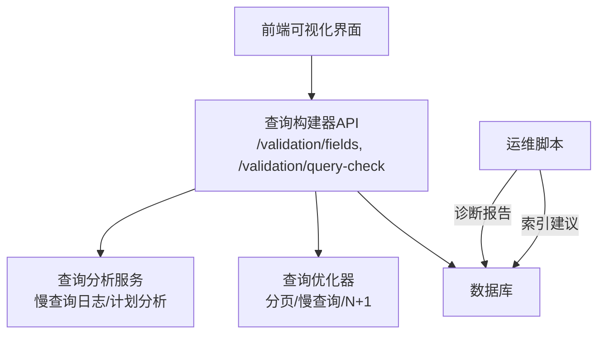
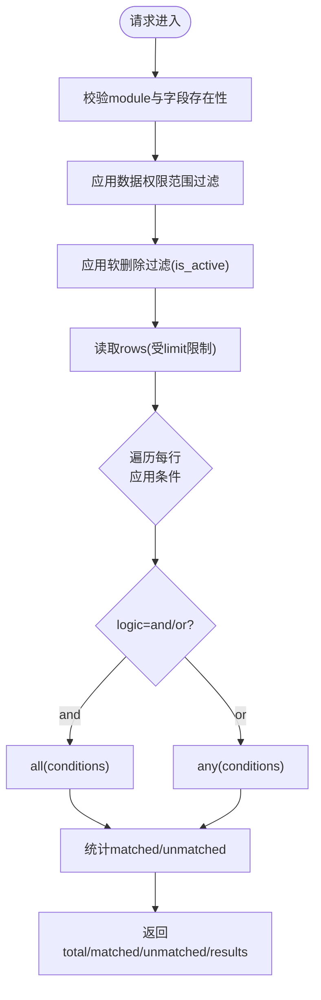
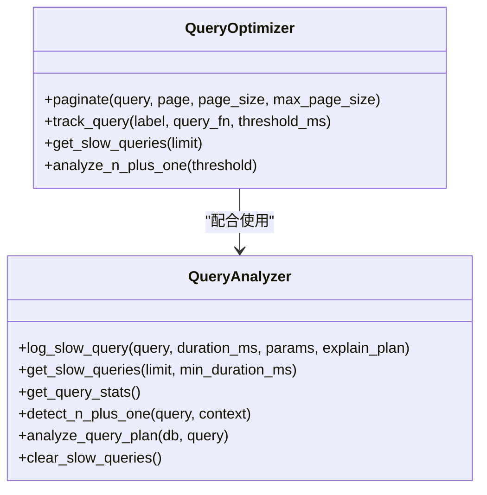
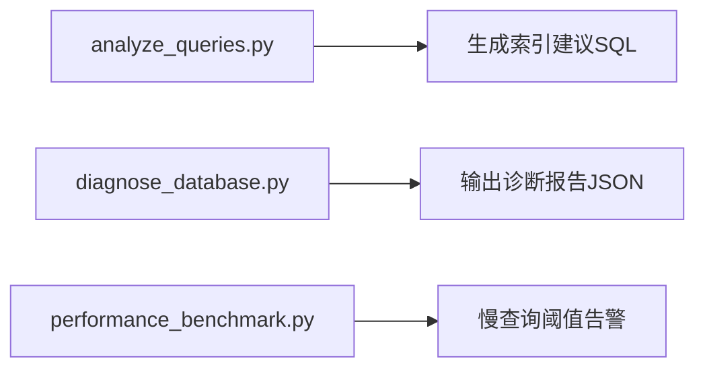
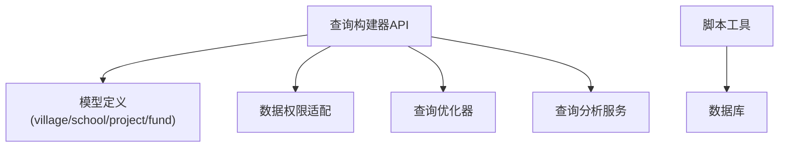

# 查询构建器

<cite>
**本文引用的文件**
- [backend/app/api/v1/validation.py](file://backend/app/api/v1/validation.py)
- [backend/app/core/query_optimizer.py](file://backend/app/core/query_optimizer.py)
- [backend/app/services/query_analyzer_service.py](file://backend/app/services/query_analyzer_service.py)
- [backend/scripts/analyze_queries.py](file://backend/scripts/analyze_queries.py)
- [backend/scripts/diagnose_database.py](file://backend/scripts/diagnose_database.py)
- [backend/scripts/performance_benchmark.py](file://backend/scripts/performance_benchmark.py)
- [backend/tests/unit/test_validation.py](file://backend/tests/unit/test_validation.py)
- [backend/tests/unit/test_coverage_validation_extra.py](file://backend/tests/unit/test_coverage_validation_extra.py)
</cite>

## 目录
1. [简介](#简介)
2. [项目结构](#项目结构)
3. [核心组件](#核心组件)
4. [架构总览](#架构总览)
5. [详细组件分析](#详细组件分析)
6. [依赖关系分析](#依赖关系分析)
7. [性能考虑](#性能考虑)
8. [故障排查指南](#故障排查指南)
9. [结论](#结论)
10. [附录](#附录)

## 简介
本指南面向使用可视化界面构建复杂查询的用户与开发者，聚焦“查询构建器”能力：通过字段、运算符与值的组合，支持多条件与逻辑（与/或）的灵活拼装；提供查询结果预览与匹配统计；并配套慢查询监控、N+1检测、索引建议与数据库诊断工具，帮助在复杂业务场景下高效、安全地构建与优化查询。

## 项目结构
查询构建器由后端 API、查询优化与分析服务、脚本工具三部分组成：
- 可视化查询校验 API：暴露“字段元数据”和“条件查询校验”接口，供前端下拉式面板驱动。
- 查询优化与分析服务：提供分页、慢查询追踪、N+1检测、查询计划分析等能力。
- 脚本工具：生成索引建议、执行数据库诊断、性能基准测试。



图表来源
- [backend/app/api/v1/validation.py:428-508](file://backend/app/api/v1/validation.py#L428-L508)
- [backend/app/core/query_optimizer.py:23-177](file://backend/app/core/query_optimizer.py#L23-L177)
- [backend/app/services/query_analyzer_service.py:17-160](file://backend/app/services/query_analyzer_service.py#L17-L160)
- [backend/scripts/analyze_queries.py:166-192](file://backend/scripts/analyze_queries.py#L166-L192)
- [backend/scripts/diagnose_database.py:145-196](file://backend/scripts/diagnose_database.py#L145-L196)

章节来源
- [backend/app/api/v1/validation.py:428-508](file://backend/app/api/v1/validation.py#L428-L508)
- [backend/app/core/query_optimizer.py:23-177](file://backend/app/core/query_optimizer.py#L23-L177)
- [backend/app/services/query_analyzer_service.py:17-160](file://backend/app/services/query_analyzer_service.py#L17-L160)

## 核心组件
- 可视化查询校验 API
  - 获取模块可查询字段（含中文标签），用于前端下拉选择。
  - 条件查询校验：以“字段 + 运算符 + 值 + 与/或”组合，对指定模块数据进行匹配/不匹配判定，返回匹配数、未匹配数及明细。
- 查询优化与分析服务
  - 分页：统一的分页封装，限制最大页大小，避免大结果集拖垮系统。
  - 慢查询追踪：记录慢查询并输出告警，便于定位热点。
  - N+1检测：装饰器统计方法内查询次数，识别潜在 N+1 问题。
  - 查询计划分析：对 SQLite 执行 EXPLAIN QUERY PLAN，辅助判断是否走索引。
- 脚本工具
  - 索引建议：基于常见查询模式生成推荐索引 SQL。
  - 数据库诊断：检查 PRAGMA、外键、完整性，输出健康报告与建议。
  - 性能基准：统计各查询平均耗时，按阈值标记慢查询。

章节来源
- [backend/app/api/v1/validation.py:348-508](file://backend/app/api/v1/validation.py#L348-L508)
- [backend/app/core/query_optimizer.py:23-177](file://backend/app/core/query_optimizer.py#L23-L177)
- [backend/app/services/query_analyzer_service.py:17-160](file://backend/app/services/query_analyzer_service.py#L17-L160)
- [backend/scripts/analyze_queries.py:166-192](file://backend/scripts/analyze_queries.py#L166-L192)
- [backend/scripts/diagnose_database.py:145-196](file://backend/scripts/diagnose_database.py#L145-L196)
- [backend/scripts/performance_benchmark.py:135-148](file://backend/scripts/performance_benchmark.py#L135-L148)

## 架构总览
下图展示从前端到后端的完整调用链，包括字段枚举、条件校验、权限范围过滤、分页与慢查询监控。

```mermaid
sequenceDiagram
participant U as "用户"
participant FE as "前端界面"
participant API as "查询构建器API"
participant DS as "数据权限适配"
participant DB as "数据库"
participant OPT as "查询优化器"
participant QA as "查询分析服务"
U->>FE : 打开查询构建器
FE->>API : GET /validation/fields?module=xxx
API-->>FE : 返回字段列表(含中文标签)
FE->>API : POST /validation/query-check {module, logic, conditions, limit}
API->>DS : apply_scope_filter(应用数据权限)
API->>DB : 查询模型(带软删除过滤)
DB-->>API : 原始行集合
API->>OPT : track_query(label, query_fn)
API->>QA : log_slow_query(可选)
API-->>FE : 返回 total/matched/unmatched/results
```

图表来源
- [backend/app/api/v1/validation.py:428-508](file://backend/app/api/v1/validation.py#L428-L508)
- [backend/app/core/query_optimizer.py:62-108](file://backend/app/core/query_optimizer.py#L62-L108)
- [backend/app/services/query_analyzer_service.py:25-60](file://backend/app/services/query_analyzer_service.py#L25-L60)

## 详细组件分析

### 可视化查询校验 API
- 字段枚举接口
  - 功能：根据 module 动态加载对应模型列，返回 key 与 label（中文）。
  - 用途：前端下拉框渲染字段与运算符选项。
- 条件查询校验接口
  - 输入：module、logic（and/or）、conditions（field/operator/value）、limit。
  - 处理：
    - 校验 module 合法性与字段存在性。
    - 应用数据权限范围过滤与软删除过滤。
    - 逐行应用条件（空值/包含/数值比较等），统计 matched/unmatched。
  - 输出：total、matched、unmatched、results（每条记录的 id、matched、values）。
- 支持的运算符
  - empty/not_empty、contains/not_contains、eq/ne/gt/gte/lt/lte。
  - 数值比较会在双方可转 float 时按数值比较，否则回退为字符串比较。



图表来源
- [backend/app/api/v1/validation.py:348-508](file://backend/app/api/v1/validation.py#L348-L508)

章节来源
- [backend/app/api/v1/validation.py:348-508](file://backend/app/api/v1/validation.py#L348-L508)
- [backend/tests/unit/test_validation.py:415-466](file://backend/tests/unit/test_validation.py#L415-L466)
- [backend/tests/unit/test_coverage_validation_extra.py:88-198](file://backend/tests/unit/test_coverage_validation_extra.py#L88-L198)

### 查询优化与分析服务
- 分页
  - 统一封装 count、offset、limit，限制最大 page_size，防止超大结果集。
- 慢查询追踪
  - 记录每次查询耗时，超过阈值输出警告，维护最近若干条慢查询日志。
- N+1检测
  - 装饰器统计方法内查询次数，超过阈值提示可能的 N+1 问题。
- 查询计划分析
  - 对 SQLite 执行 EXPLAIN QUERY PLAN，返回扫描/索引使用情况，辅助优化。



图表来源
- [backend/app/core/query_optimizer.py:23-177](file://backend/app/core/query_optimizer.py#L23-L177)
- [backend/app/services/query_analyzer_service.py:17-160](file://backend/app/services/query_analyzer_service.py#L17-L160)

章节来源
- [backend/app/core/query_optimizer.py:23-177](file://backend/app/core/query_optimizer.py#L23-L177)
- [backend/app/services/query_analyzer_service.py:17-160](file://backend/app/services/query_analyzer_service.py#L17-L160)

### 脚本工具：索引建议与数据库诊断
- 索引建议
  - 针对高频聚合、筛选维度生成推荐索引 SQL，减少回表与全表扫描。
- 数据库诊断
  - 检查 PRAGMA 配置、外键约束、完整性，输出健康状态与建议项。
- 性能基准
  - 统计各查询平均耗时，按阈值输出慢查询清单。



图表来源
- [backend/scripts/analyze_queries.py:166-192](file://backend/scripts/analyze_queries.py#L166-L192)
- [backend/scripts/diagnose_database.py:145-196](file://backend/scripts/diagnose_database.py#L145-L196)
- [backend/scripts/performance_benchmark.py:135-148](file://backend/scripts/performance_benchmark.py#L135-L148)

章节来源
- [backend/scripts/analyze_queries.py:166-192](file://backend/scripts/analyze_queries.py#L166-L192)
- [backend/scripts/diagnose_database.py:145-196](file://backend/scripts/diagnose_database.py#L145-L196)
- [backend/scripts/performance_benchmark.py:135-148](file://backend/scripts/performance_benchmark.py#L135-L148)

## 依赖关系分析
- 模块耦合
  - 查询构建器 API 依赖数据权限适配与模型定义，确保查询范围正确。
  - 查询优化与分析服务被 API 调用以增强性能与可观测性。
  - 脚本工具独立于运行时，用于离线分析与优化建议。
- 外部依赖
  - SQLAlchemy ORM 用于查询构建与执行。
  - SQLite 的 EXPLAIN QUERY PLAN 用于查询计划分析（当前实现）。



图表来源
- [backend/app/api/v1/validation.py:367-380](file://backend/app/api/v1/validation.py#L367-L380)
- [backend/app/core/query_optimizer.py:23-177](file://backend/app/core/query_optimizer.py#L23-L177)
- [backend/app/services/query_analyzer_service.py:17-160](file://backend/app/services/query_analyzer_service.py#L17-L160)

章节来源
- [backend/app/api/v1/validation.py:367-380](file://backend/app/api/v1/validation.py#L367-L380)
- [backend/app/core/query_optimizer.py:23-177](file://backend/app/core/query_optimizer.py#L23-L177)
- [backend/app/services/query_analyzer_service.py:17-160](file://backend/app/services/query_analyzer_service.py#L17-L160)

## 性能考虑
- 分页与限流
  - 使用统一分页函数限制最大页大小，避免一次性拉取过多数据。
- 慢查询监控
  - 通过 track_query 记录耗时，结合 get_slow_queries 快速定位热点。
- N+1检测
  - 在服务方法上使用 analyze_n_plus_one 装饰器，当查询次数超过阈值时告警。
- 查询计划分析
  - 使用 analyze_query_plan 查看 EXPLAIN 输出，确认是否命中索引。
- 索引建议
  - 参考 analyze_queries.py 生成的推荐索引 SQL，优先为高频筛选与聚合维度建立复合索引。
- 性能基准
  - 使用 performance_benchmark.py 统计各查询平均耗时，按阈值输出慢查询清单。

[本节为通用性能指导，无需特定文件引用]

## 故障排查指南
- 常见问题
  - 字段不存在：API 会返回 400，提示字段在模块中不存在。
  - 不支持的模块：返回 400，仅支持 village/school/project/fund。
  - 非法逻辑：logic 仅支持 and/or，其他值返回 400。
- 调试步骤
  - 使用 /validation/fields 确认字段名与中文标签。
  - 使用 /validation/query-check 逐步缩小条件范围，观察 matched/unmatched 变化。
  - 开启慢查询追踪，查看 get_slow_queries 输出。
  - 使用 analyze_query_plan 分析具体 SQL 的执行计划。
  - 运行 diagnose_database.py 输出数据库健康报告与建议。
- 指标与阈值
  - 慢查询阈值可通过配置调整，performance_benchmark.py 会按阈值输出告警。

章节来源
- [backend/app/api/v1/validation.py:428-508](file://backend/app/api/v1/validation.py#L428-L508)
- [backend/app/core/query_optimizer.py:62-108](file://backend/app/core/query_optimizer.py#L62-L108)
- [backend/app/services/query_analyzer_service.py:25-60](file://backend/app/services/query_analyzer_service.py#L25-L60)
- [backend/scripts/diagnose_database.py:145-196](file://backend/scripts/diagnose_database.py#L145-L196)
- [backend/scripts/performance_benchmark.py:135-148](file://backend/scripts/performance_benchmark.py#L135-L148)

## 结论
查询构建器通过可视化的字段与运算符组合，降低了复杂查询的使用门槛；配合数据权限与软删除过滤，确保查询范围正确与安全。查询优化与分析服务提供了分页、慢查询监控、N+1检测与查询计划分析，帮助定位与解决性能瓶颈。脚本工具则进一步提供索引建议与数据库诊断，形成完整的查询构建与优化闭环。

[本节为总结性内容，无需特定文件引用]

## 附录
- 常用接口
  - GET /validation/fields?module=village
  - POST /validation/query-check
- 典型用例
  - 多条件与/或组合：例如“所在县=赫章县 且 部队合计投入≥80”。
  - 模糊匹配：包含/不包含某关键词。
  - 数值区间：大于/小于/等于/不等于。
- 最佳实践
  - 先使用 fields 接口确认字段名与标签。
  - 逐步增加条件，观察 matched/unmatched 变化，定位问题。
  - 对高频筛选维度建立复合索引，减少回表。
  - 使用 analyze_query_plan 验证索引命中情况。
  - 定期运行性能基准与数据库诊断，持续优化。

[本节为补充说明，无需特定文件引用]