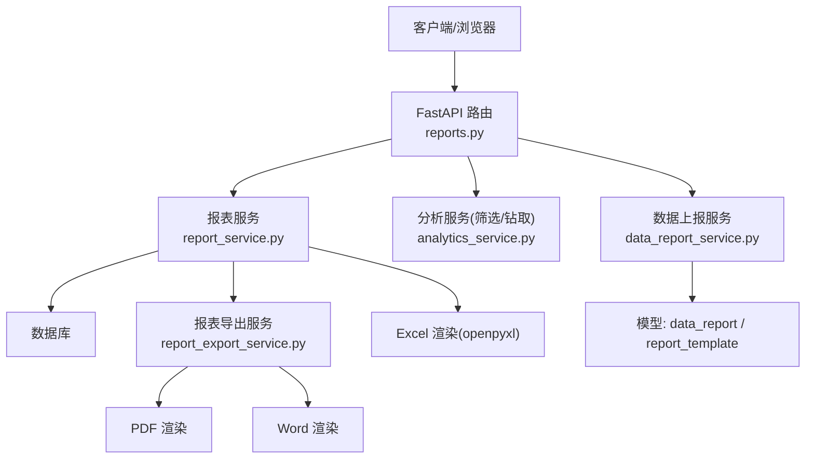
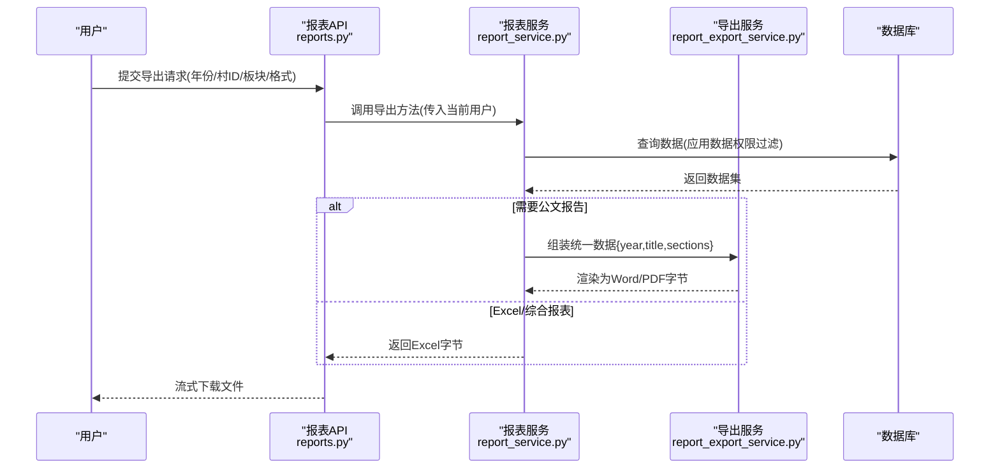
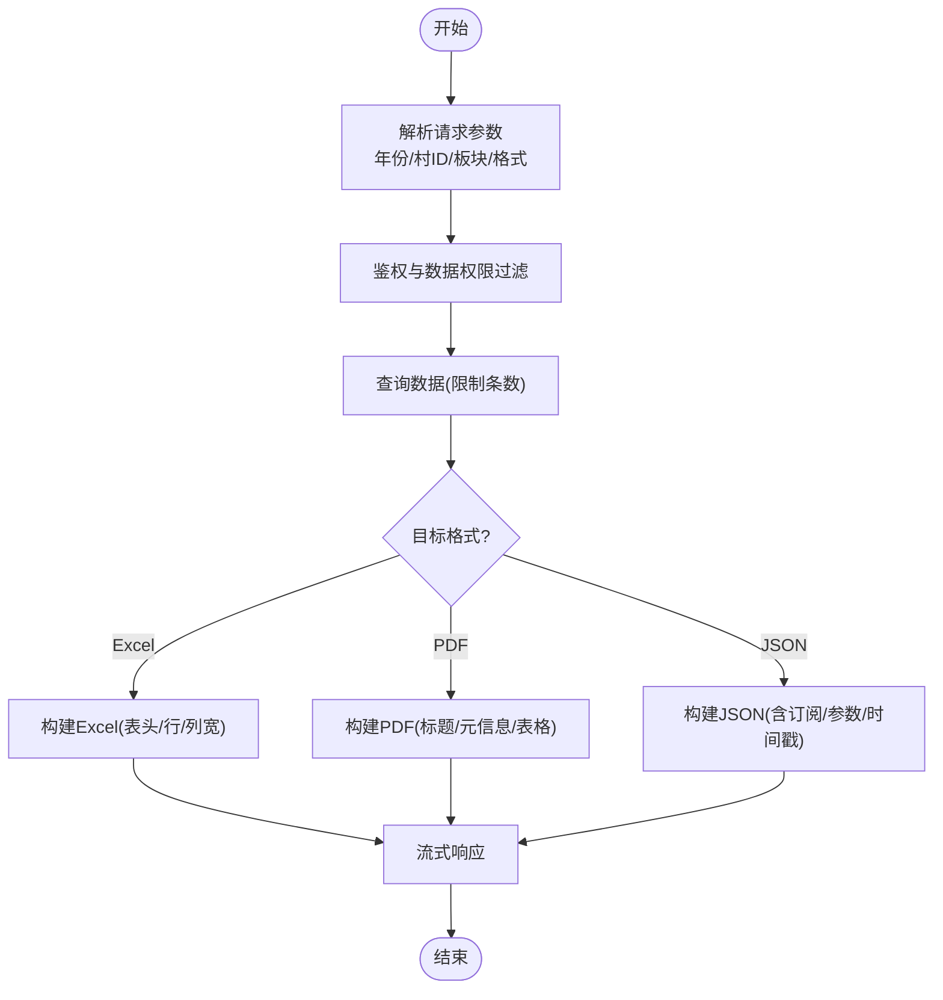
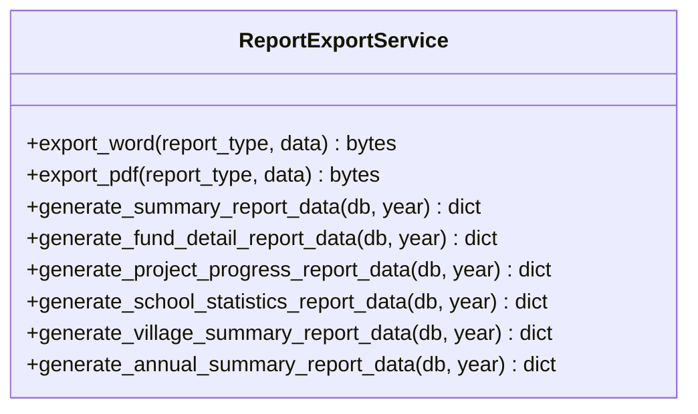
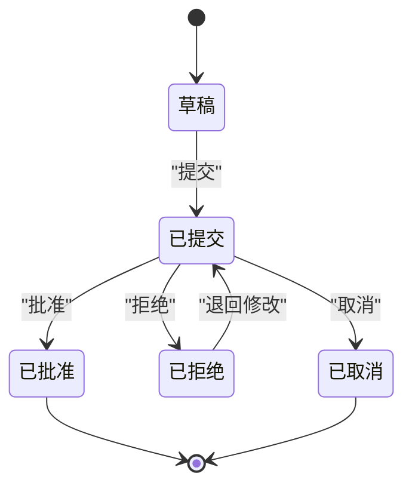
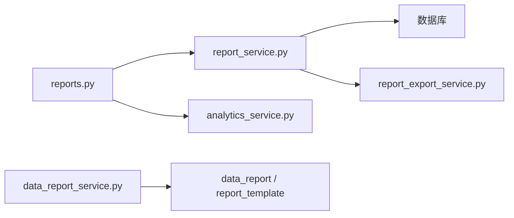

# 自定义报表创建

<cite>
**本文引用的文件**
- [reports.py](file://backend/app/api/v1/data/data/reports.py)
- [report_service.py](file://backend/app/services/report_service.py)
- [report_export_service.py](file://backend/app/services/report_export_service.py)
- [data_report_service.py](file://backend/app/services/data_report_service.py)
- [report_template.py](file://backend/app/models/report_template.py)
- [data_report.py](file://backend/app/models/data_report.py)
- [print.scss](file://frontend/src/styles/print.scss)
</cite>

## 目录
1. [简介](#简介)
2. [项目结构](#项目结构)
3. [核心组件](#核心组件)
4. [架构总览](#架构总览)
5. [详细组件分析](#详细组件分析)
6. [依赖关系分析](#依赖关系分析)
7. [性能考虑](#性能考虑)
8. [故障排查指南](#故障排查指南)
9. [结论](#结论)
10. [附录](#附录)

## 简介
本指南面向业务用户与实施人员，系统讲解如何基于现有后端能力创建“自定义报表”。内容覆盖：选择数据源、配置查询条件、设计报表布局（表格/图表/混合）、字段映射与数据转换、参数设置与动态绑定、定时生成与自动推送、分享与权限控制，以及大数据量场景下的性能调优实践。

## 项目结构
本项目围绕“报表导出与分析”提供完整链路：API路由负责接收请求与返回流式文件；服务层封装数据获取、模板渲染与导出；模型层定义模板与上报工作流；前端提供打印样式以支持报表输出。

**图示来源**
- [reports.py:54-155](file://backend/app/api/v1/data/data/reports.py#L54-L155)
- [report_service.py:27-152](file://backend/app/services/report_service.py#L27-L152)
- [report_export_service.py:318-443](file://backend/app/services/report_export_service.py#L318-L443)
- [data_report_service.py:110-235](file://backend/app/services/data_report_service.py#L110-L235)

**章节来源**
- [reports.py:1-779](file://backend/app/api/v1/data/data/reports.py#L1-L779)
- [report_service.py:1-357](file://backend/app/services/report_service.py#L1-L357)
- [report_export_service.py:1-448](file://backend/app/services/report_export_service.py#L1-L448)
- [data_report_service.py:1-492](file://backend/app/services/data_report_service.py#L1-L492)
- [report_template.py:1-73](file://backend/app/models/report_template.py#L1-L73)
- [data_report.py:1-141](file://backend/app/models/data_report.py#L1-L141)
- [print.scss:78-149](file://frontend/src/styles/print.scss#L78-L149)

## 核心组件
- 报表导出服务：统一生成 Excel/PDF/综合报表，并处理文件名与空数据兜底。
- 报表导出服务（公文版）：按“标题/段落/表格”三段式数据结构渲染 Word/PDF。
- 数据分析服务：提供筛选选项、多维筛选、钻取、对比等能力，支撑报表的查询条件与可视化。
- 数据上报服务：管理上报生命周期（草稿/提交/审批/拒绝/取消），用于跨组织的数据流转与审计。
- 模板模型：定义导入/导出模板、字段映射与格式配置，便于复用与定制。
- 上报模型：记录上报单状态、截止时间、提交/审批人等信息，支撑流程化管控。

**章节来源**
- [report_service.py:27-152](file://backend/app/services/report_service.py#L27-L152)
- [report_export_service.py:51-300](file://backend/app/services/report_export_service.py#L51-L300)
- [data_report_service.py:81-235](file://backend/app/services/data_report_service.py#L81-L235)
- [report_template.py:26-73](file://backend/app/models/report_template.py#L26-L73)
- [data_report.py:19-141](file://backend/app/models/data_report.py#L19-L141)

## 架构总览
下图展示从“创建自定义报表”到“下载/订阅推送”的端到端流程，涵盖参数校验、数据权限过滤、多格式导出与订阅机制。

**图示来源**
- [reports.py:54-155](file://backend/app/api/v1/data/data/reports.py#L54-L155)
- [report_service.py:27-152](file://backend/app/services/report_service.py#L27-L152)
- [report_export_service.py:318-443](file://backend/app/services/report_export_service.py#L318-L443)

## 详细组件分析

### 组件A：报表导出与订阅（Excel/PDF/JSON）
- 功能要点
  - 导出 Excel：根据查询参数生成表格，自动列宽，限制行数避免过大。
  - 导出 PDF：若未安装依赖则返回友好提示；否则使用内置字体渲染。
  - 综合报表：聚合多板块数据，默认导出为 Excel。
  - 订阅管理：创建/更新/删除/启用禁用订阅；支持频率、发送时间、邮箱、输出目录与格式。
  - 下载接口：支持按订阅重新生成 JSON/Excel 并流式返回。
- 关键路径
  - POST /reports/export/excel
  - POST /reports/export/pdf
  - GET /reports/export/comprehensive/{year}
  - POST /reports/subscriptions
  - GET/PUT/DELETE /reports/subscriptions/{id}
  - GET /reports/{report_id}/download?format=excel|json

**图示来源**
- [reports.py:54-155](file://backend/app/api/v1/data/data/reports.py#L54-L155)
- [report_service.py:27-152](file://backend/app/services/report_service.py#L27-L152)
- [reports.py:345-586](file://backend/app/api/v1/data/data/reports.py#L345-L586)
- [reports.py:711-779](file://backend/app/api/v1/data/data/reports.py#L711-L779)

**章节来源**
- [reports.py:54-155](file://backend/app/api/v1/data/data/reports.py#L54-L155)
- [reports.py:345-586](file://backend/app/api/v1/data/data/reports.py#L345-L586)
- [reports.py:711-779](file://backend/app/api/v1/data/data/reports.py#L711-L779)
- [report_service.py:27-152](file://backend/app/services/report_service.py#L27-L152)

### 组件B：公文类报表（Word/PDF）
- 功能要点
  - 统一数据结构：{year, title, sections:[{title, paragraphs[], table:{headers, rows}}]}
  - 渲染器：分别用 python-docx 与 reportlab 输出 Word/PDF，空数据时输出“暂无相关数据”。
  - 数据生成器：针对经费明细、项目进度、学校统计、帮扶村汇总、年度综合总结等模块。
- 适用场景
  - 需要正式公文排版、固定页眉页脚、表格合计行的汇报材料。

**图示来源**
- [report_export_service.py:46-300](file://backend/app/services/report_export_service.py#L46-L300)
- [report_export_service.py:318-443](file://backend/app/services/report_export_service.py#L318-L443)

**章节来源**
- [report_export_service.py:51-300](file://backend/app/services/report_export_service.py#L51-L300)
- [report_export_service.py:318-443](file://backend/app/services/report_export_service.py#L318-L443)

### 组件C：数据上报工作流（跨组织）
- 功能要点
  - 状态机：草稿→提交→批准/拒绝；拒绝可退回修改或取消。
  - 通知：提交后通知上级，审批结果通知下级。
  - 统计与看板：按组织维度统计上报数量、逾期、批准率等。
- 适用场景
  - 下级向上级报送数据，上级审核与反馈，形成闭环管理。

**图示来源**
- [data_report_service.py:87-103](file://backend/app/services/data_report_service.py#L87-L103)
- [data_report_service.py:163-235](file://backend/app/services/data_report_service.py#L163-L235)

**章节来源**
- [data_report_service.py:81-235](file://backend/app/services/data_report_service.py#L81-L235)
- [data_report.py:19-141](file://backend/app/models/data_report.py#L19-L141)

### 组件D：模板与字段映射
- 功能要点
  - 模板类型：导入模板/导出模板。
  - 关联模块：村/校/资金/项目/农务/综合等。
  - 字段映射：Excel 列与数据库字段对应，支持必填标记。
  - 格式配置：纸张大小、页眉页脚、列宽等。
- 使用方式
  - 在导入场景中，依据模板将 Excel 列映射至数据库字段，实现批量导入。
  - 在导出场景中，复用模板的格式配置，保证报表一致性。

**章节来源**
- [report_template.py:26-73](file://backend/app/models/report_template.py#L26-L73)

### 组件E：前端打印与布局
- 功能要点
  - 打印样式：表格边框、分页控制、封面风格、图表容器适配。
  - 页面断点：避免表格行被截断，图表保持比例。
- 使用建议
  - 在浏览器中直接打印报表页面，可获得稳定排版效果。

**章节来源**
- [print.scss:78-149](file://frontend/src/styles/print.scss#L78-L149)

## 依赖关系分析
- 路由层依赖服务层：reports.py 通过依赖注入获取 ReportService、AnalyticsService。
- 服务层依赖数据访问：ReportService 查询 SupportedVillage 并应用数据权限过滤。
- 导出服务解耦渲染：ReportExportService 专注 Word/PDF 渲染，不耦合具体业务查询。
- 上报服务独立于导出：DataReportService 管理上报生命周期，与导出流程无强耦合。

**图示来源**
- [reports.py:41-48](file://backend/app/api/v1/data/data/reports.py#L41-L48)
- [report_service.py:301-328](file://backend/app/services/report_service.py#L301-L328)
- [report_export_service.py:318-443](file://backend/app/services/report_export_service.py#L318-L443)
- [data_report_service.py:110-235](file://backend/app/services/data_report_service.py#L110-L235)

**章节来源**
- [reports.py:41-48](file://backend/app/api/v1/data/data/reports.py#L41-L48)
- [report_service.py:301-328](file://backend/app/services/report_service.py#L301-L328)
- [report_export_service.py:318-443](file://backend/app/services/report_export_service.py#L318-L443)
- [data_report_service.py:110-235](file://backend/app/services/data_report_service.py#L110-L235)

## 性能考虑
- 数据量控制
  - 列表导出限制条数（如 limit 100），避免一次性加载过多数据导致内存占用过高。
  - PDF 导出限制行数（如最多 50 行），防止单页过长。
- 查询优化
  - 使用数据权限过滤函数减少不必要的数据扫描。
  - 对常用维度建立索引（如组织、状态、时间）。
- 渲染优化
  - 优先使用流式响应，降低首包延迟。
  - 大表导出建议使用 Excel；复杂公文报告使用 Word/PDF。
- 缓存策略
  - 对高频筛选/汇总结果可引入缓存（需结合业务一致性要求）。
- 资源隔离
  - 将耗时导出放入后台任务队列，避免阻塞主线程。

[本节为通用指导，无需特定文件引用]

## 故障排查指南
- 导出失败（Excel/PDF）
  - 检查依赖是否安装（openpyxl、reportlab）。
  - 查看日志中的异常堆栈，确认数据库连接与查询是否正常。
- 订阅创建/更新失败
  - 检查入参是否为空或非法；确认用户权限。
  - 数据库事务失败时回滚，重试前检查约束冲突。
- 下载接口返回 500
  - 确认订阅是否存在；若无订阅，将返回基础 JSON。
- 上报状态错误
  - 检查当前状态与目标状态是否符合状态机规则。
  - 若不存在上报记录，会抛出“上报不存在”错误。

**章节来源**
- [reports.py:83-119](file://backend/app/api/v1/data/data/reports.py#L83-L119)
- [reports.py:345-586](file://backend/app/api/v1/data/data/reports.py#L345-L586)
- [reports.py:711-779](file://backend/app/api/v1/data/data/reports.py#L711-L779)
- [data_report_service.py:30-46](file://backend/app/services/data_report_service.py#L30-L46)
- [data_report_service.py:441-452](file://backend/app/services/data_report_service.py#L441-L452)

## 结论
本系统提供了从“数据筛选—模板渲染—多格式导出—订阅推送—上报工作流”的一体化能力。通过合理配置查询条件、选择合适的导出格式、利用模板与字段映射、设置订阅与权限控制，并结合性能调优策略，可满足多样化业务报表需求。

[本节为总结性内容，无需特定文件引用]

## 附录

### 快速上手清单
- 选择数据源：确定年份、组织范围、村/校/项目/资金等维度。
- 配置查询条件：使用筛选接口获取可用选项，组合多维度条件。
- 设计报表布局：选择 Excel（表格为主）或 Word/PDF（公文排版）。
- 字段映射与转换：在导入模板中定义 Excel 列与数据库字段映射；在导出中按需格式化金额、百分比等。
- 参数与动态绑定：通过订阅保存常用参数（年份、村ID、板块），下次一键生成。
- 定时与推送：配置订阅的频率、发送时间与邮箱，实现自动推送。
- 分享与权限：基于用户与数据权限控制可见范围；必要时通过上报工作流进行跨组织流转。
- 性能调优：限制导出规模、使用合适格式、必要时异步化与缓存。

[本节为操作指引，无需特定文件引用]