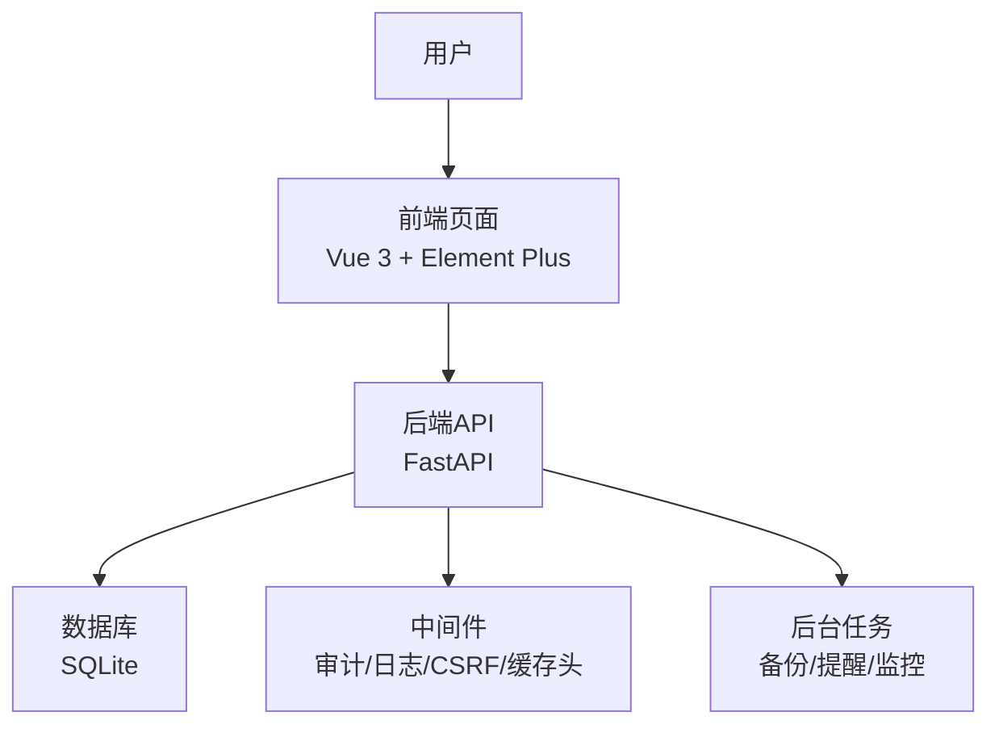
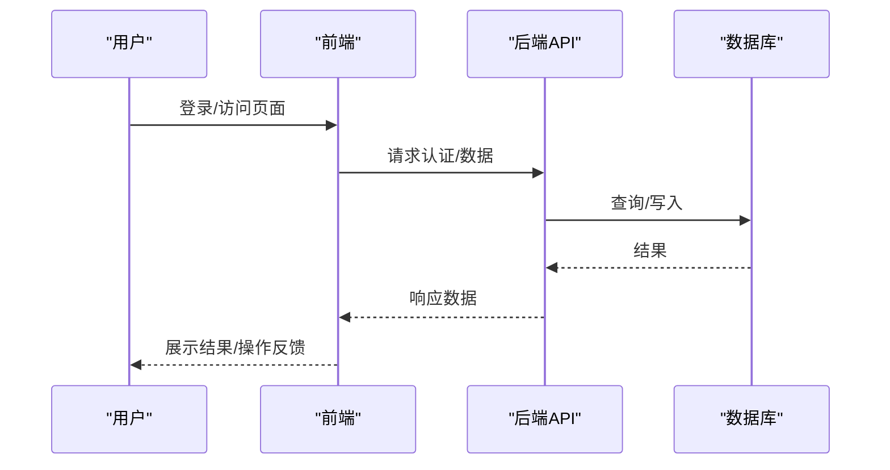
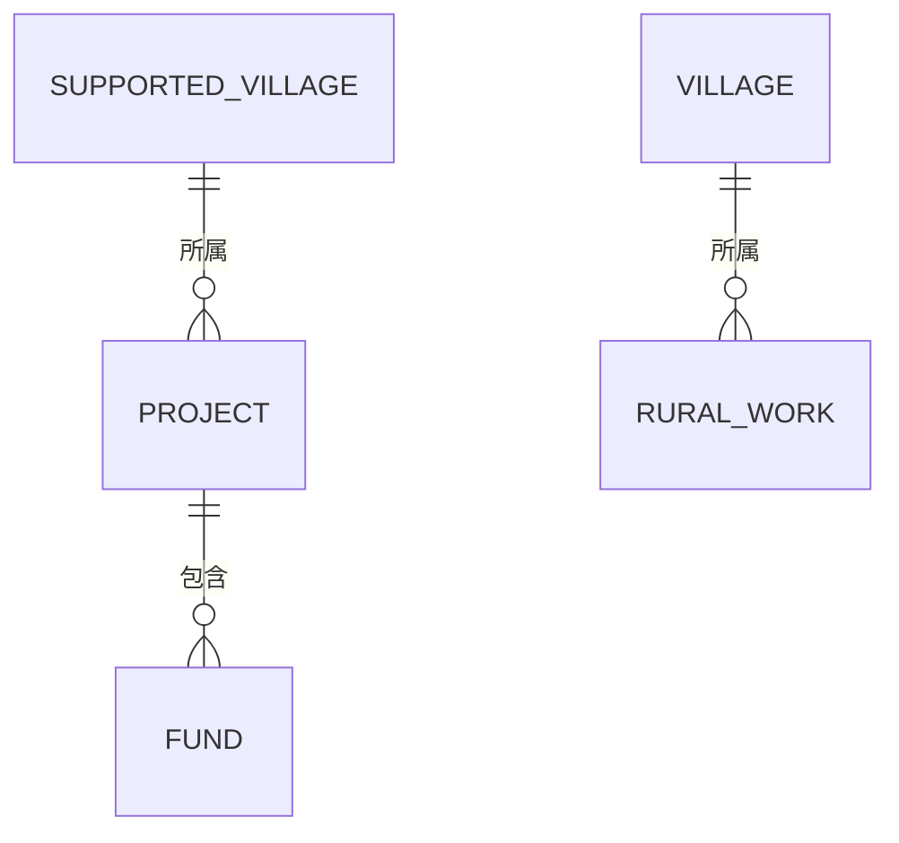

# 用户手册

<cite>
**本文引用的文件**
- [README.md](file://README.md)
- [使用指南.md](file://docs/02-用户手册/使用指南.md)
- [经费管理模块操作说明.md](file://docs/02-用户手册/经费管理模块操作说明.md)
- [backend/app/main.py](file://backend/app/main.py)
- [backend/app/models/project.py](file://backend/app/models/project.py)
- [backend/app/models/fund.py](file://backend/app/models/fund.py)
- [backend/app/models/rural_work.py](file://backend/app/models/rural_work.py)
- [frontend/src/views/dataAnalysis/Index.vue](file://frontend/src/views/dataAnalysis/Index.vue)
</cite>

## 目录
1. [简介](#简介)
2. [项目结构](#项目结构)
3. [核心功能与角色概览](#核心功能与角色概览)
4. [架构总览](#架构总览)
5. [详细操作指南](#详细操作指南)
6. [依赖关系与数据流](#依赖关系与数据流)
7. [性能与可用性建议](#性能与可用性建议)
8. [故障排查与常见问题](#故障排查与常见问题)
9. [结论](#结论)
10. [附录](#附录)

## 简介
本手册面向乡村振兴帮扶管理系统的日常使用者，覆盖仪表盘、项目管理、经费管理、乡村工作、审批流程、数据分析等核心功能的操作步骤与最佳实践。系统为离线桌面应用（Electron），内嵌后端服务与本地数据库，开箱即用；支持多机协同数据同步。默认管理员账号首次登录后请修改密码。

## 项目结构
- 前端：Vue 3 + TypeScript + Element Plus + ECharts，提供可视化界面与交互
- 后端：FastAPI + SQLAlchemy + SQLite，提供 API、权限、审计、备份、任务调度等能力
- 桌面壳：Electron，打包为 Windows/Linux 安装包，内置运行时
- 文档：用户手册、开发文档、部署文档等

**章节来源**
- [README.md:30-90](file://README.md#L30-L90)
- [backend/app/main.py:111-178](file://backend/app/main.py#L111-L178)

## 核心功能与角色概览
- 仪表盘：关键指标汇总、快捷入口、待办与提醒
- 项目管理：项目立项、进度跟踪、里程碑、预算与实际花费对比
- 经费管理：申请、审批、拨付、使用、结算、审计与统计分析
- 乡村工作：工作任务登记、状态流转、统计报表
- 审批流程：统一审批中心，任务驱动的状态变更与通知
- 数据分析：多维度统计图表、导出与打印

角色与权限要点
- 管理员：系统配置、组织与用户管理、备份恢复、全局数据可见
- 项目经理：项目全生命周期管理、进度与交付物管理
- 财务人员：经费申请/拨付/结算/审计、报表与导出
- 基层工作人员：乡村工作录入、数据上报、查看个人相关数据

**章节来源**
- [使用指南.md:94-113](file://docs/02-用户手册/使用指南.md#L94-L113)
- [经费管理模块操作说明.md:7-9](file://docs/02-用户手册/经费管理模块操作说明.md#L7-L9)

## 架构总览
系统采用前后端分离的桌面应用架构，前端通过 API 与后端交互，后端负责业务逻辑、权限控制、审计与数据持久化。启动时完成数据库初始化、迁移、种子数据、监控与定时任务。

**图示来源**
- [backend/app/main.py:66-107](file://backend/app/main.py#L66-L107)
- [backend/app/main.py:111-178](file://backend/app/main.py#L111-L178)

**章节来源**
- [backend/app/main.py:66-107](file://backend/app/main.py#L66-L107)

## 详细操作指南

### 登录与初始设置
- 访问地址：生产环境 http://localhost:8000；开发环境 http://localhost:5173
- 默认管理员账号：admin / admin123（首次登录强制修改密码）
- 若忘记密码，可使用脚本重置管理员密码

操作步骤
1. 启动系统后打开浏览器访问前端地址
2. 输入用户名与密码登录
3. 按提示修改密码并完善个人信息

**章节来源**
- [README.md:61-69](file://README.md#L61-L69)
- [使用指南.md:94-113](file://docs/02-用户手册/使用指南.md#L94-L113)

### 仪表盘操作
- 进入“首页”或“仪表盘”，查看关键指标（项目数、经费总额、使用率、待办事项等）
- 快捷入口：项目管理、经费管理、乡村工作、审批中心、数据分析
- 待办与提醒：查看需处理的任务与通知

操作要点
- 点击卡片跳转对应模块
- 筛选条件可快速定位关注范围
- 定期刷新以获取最新数据

**章节来源**
- [使用指南.md:114-183](file://docs/02-用户手册/使用指南.md#L114-L183)

### 项目管理
- 路径：侧边栏 → 项目管理
- 主要功能：新增项目、编辑信息、查看进度、里程碑管理、预算与实际花费对比、导出
- 关键字段：项目名称、类型、状态、预算、实际花费、开始/结束日期、负责人、联系方式（加密存储）

操作步骤
1. 新建项目：填写基本信息、目标、预算、时间计划、负责人等
2. 更新进度：维护里程碑与实际花费，系统自动计算偏差
3. 导出报告：选择时间与字段导出

注意事项
- 联系人电话等敏感字段采用透明加密存储
- 软删除标记用于保留历史数据

**章节来源**
- [backend/app/models/project.py:47-175](file://backend/app/models/project.py#L47-L175)

### 经费管理
- 路径：侧边栏 → 经费管理
- 全流程步骤条：预算编制 → 申请 → 审批 → 拨付 → 使用执行 → 报销核销 → 决算结算 → 归档
- 列表页支持搜索、类型/状态筛选、快捷审批/拨付、导出
- 详情页包含基本信息、金额信息、审批信息、审计信息、附件管理
- 统计分析：时间/类型/来源/状态维度切换，图表与明细导出
- 资金周期与决算结算：七阶段生命周期视图与绩效指标

操作步骤（新增经费）
1. 在经费列表点击“新增经费”
2. 填写名称、类型、来源、金额、申请人等
3. 保存后状态为“待审批”

操作步骤（审批/拨付/使用/结算）
1. 审批：对“待审批”记录填写意见并批准或驳回
2. 拨付：对“已批准”记录填写拨付金额与方式
3. 使用：将“已拨付”标记为使用中，完成后标记为已完成
4. 审计：对“已完成”进行审计并填写结果与意见

附件管理
- 上传分类：合同、发票、收据、报告、其他
- 预览：图片弹窗、PDF新窗口、其他格式下载
- 下载/删除：确认后删除

导出数据
- 支持 CSV/Excel/PDF，可自定义筛选与字段

**章节来源**
- [经费管理模块操作说明.md:25-130](file://docs/02-用户手册/经费管理模块操作说明.md#L25-L130)
- [经费管理模块操作说明.md:132-208](file://docs/02-用户手册/经费管理模块操作说明.md#L132-L208)
- [backend/app/models/fund.py:61-166](file://backend/app/models/fund.py#L61-L166)

### 乡村工作
- 路径：侧边栏 → 乡村工作
- 功能：任务登记、状态流转（计划/进行中/完成/延期）、统计报表
- 字段：编码、名称、类型、状态、所属村、负责人、联系电话（加密）、起止时间、目标、进度

操作步骤
1. 新增任务：填写基本信息、类型、目标、时间计划
2. 更新状态：根据进展调整状态与进度
3. 生成报表：按类型/状态/年份聚合统计

**章节来源**
- [backend/app/models/rural_work.py:34-76](file://backend/app/models/rural_work.py#L34-L76)

### 审批流程
- 统一审批中心：集中处理各类审批任务（经费、项目、政策等）
- 任务驱动：提交后自动生成审批任务，支持批注与意见
- 通知与提醒：审批节点到期提醒、结果通知

操作流程
1. 提交申请：填写表单与附件
2. 审批处理：查看任务详情，填写意见并批准/驳回
3. 结果回写：状态变更回写到业务实体

**章节来源**
- [backend/app/main.py:66-95](file://backend/app/main.py#L66-L95)

### 数据分析
- 路径：侧边栏 → 数据分析
- 功能：多维度统计、趋势对比、导出与打印
- 指标：项目进度、经费使用率、乡村工作完成率等

操作步骤
1. 选择分析维度与时间范围
2. 查看图表与明细表格
3. 导出结果至本地

**章节来源**
- [frontend/src/views/dataAnalysis/Index.vue:273-353](file://frontend/src/views/dataAnalysis/Index.vue#L273-L353)

## 依赖关系与数据流
- 项目与经费关联：项目下有多笔经费记录，便于统计与审计
- 乡村工作与村庄关联：任务归属具体村庄，便于区域统计
- 数据权限：按组织与创建人隔离，确保数据安全

**图示来源**
- [backend/app/models/project.py:70-175](file://backend/app/models/project.py#L70-L175)
- [backend/app/models/fund.py:104-166](file://backend/app/models/fund.py#L104-L166)
- [backend/app/models/rural_work.py:34-76](file://backend/app/models/rural_work.py#L34-L76)

**章节来源**
- [backend/app/models/project.py:70-175](file://backend/app/models/project.py#L70-L175)
- [backend/app/models/fund.py:104-166](file://backend/app/models/fund.py#L104-L166)
- [backend/app/models/rural_work.py:34-76](file://backend/app/models/rural_work.py#L34-L76)

## 性能与可用性建议
- 合理使用筛选与分页，避免一次性加载过多数据
- 导出前确认筛选条件，减少不必要的数据量
- 定期备份数据，启用定时自动备份（管理员）
- 关注系统健康检查与日志，及时处理异常

[本节为通用指导，不直接分析具体文件]

## 故障排查与常见问题
- 无法启动：检查端口占用、依赖安装、日志错误
- 导入失败：核对模板格式、必填项、日期与金额格式
- 密码遗忘：运行重置脚本重置管理员密码
- 浏览器兼容：推荐使用 Chrome/Edge/Firefox/Safari
- 数据存储位置：数据库位于 backend/data/，上传文件在 backend/uploads/，备份在 backend/app/backups/
- 备份与恢复：系统管理 → 备份管理，支持加密备份与恢复

**章节来源**
- [使用指南.md:316-369](file://docs/02-用户手册/使用指南.md#L316-L369)

## 结论
本手册覆盖了系统的主要功能与操作要点，帮助不同角色高效完成日常工作。建议结合模块操作说明与数据分析功能，形成规范化的工作流程与数据治理习惯。

[本节为总结性内容，不直接分析具体文件]

## 附录
- 快速开始与停止：使用一键脚本启动/停止所有服务
- 开发环境：手动启动前后端服务与依赖安装
- 环境变量与日志：查看 .env 与 logs 目录

**章节来源**
- [README.md:30-90](file://README.md#L30-L90)
- [使用指南.md:30-93](file://docs/02-用户手册/使用指南.md#L30-L93)