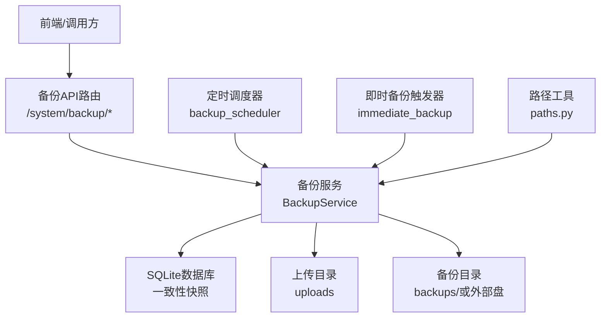
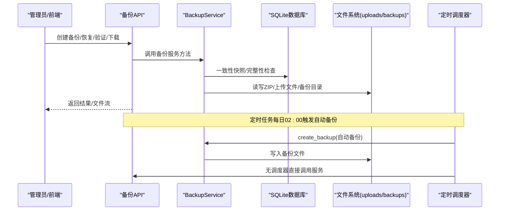
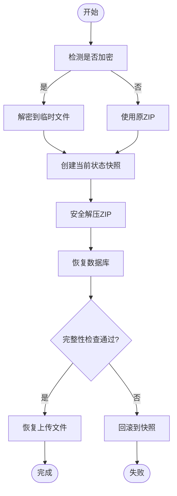
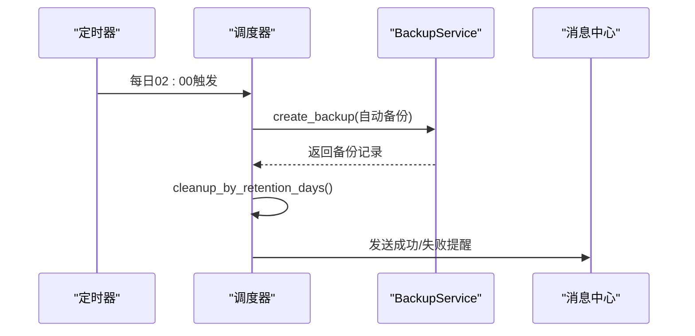
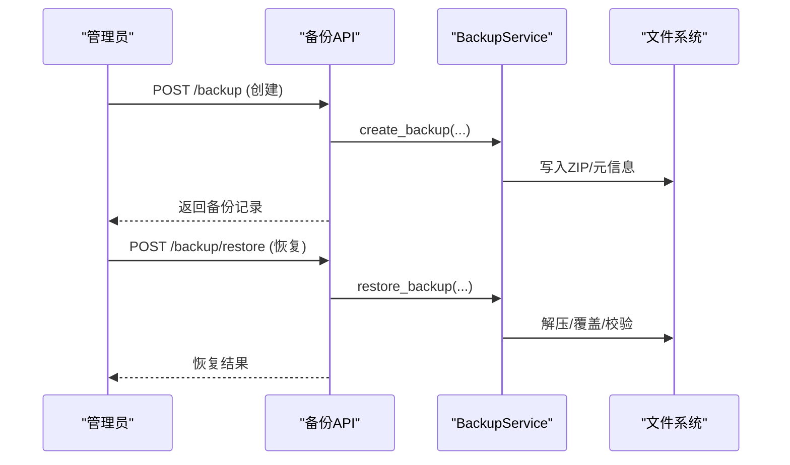
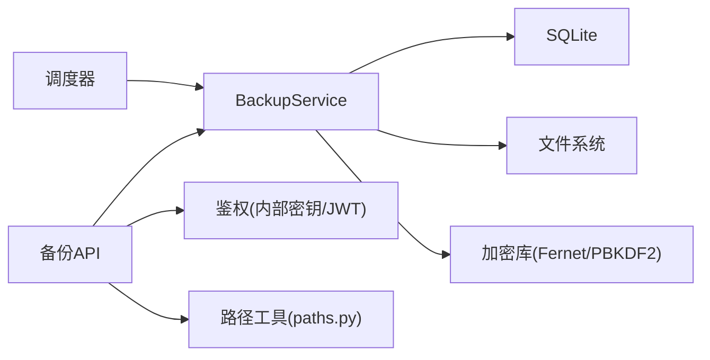

# 备份与恢复

<cite>
**本文引用的文件**
- [backend/app/services/backup_service.py](file://backend/app/services/backup_service.py)
- [backend/app/services/backup_scheduler.py](file://backend/app/services/backup_scheduler.py)
- [backend/app/api/v1/system/backup.py](file://backend/app/api/v1/system/backup.py)
- [backend/app/services/immediate_backup.py](file://backend/app/services/immediate_backup.py)
- [backend/app/utils/paths.py](file://backend/app/utils/paths.py)
- [docs/02-用户手册/备份管理操作说明.md](file://docs/02-用户手册/备份管理操作说明.md)
- [backend/tests/unit/test_backup_service_full.py](file://backend/tests/unit/test_backup_service_full.py)
- [backend/tests/unit/test_backup_target.py](file://backend/tests/unit/test_backup_target.py)
</cite>

## 目录
1. [简介](#简介)
2. [项目结构](#项目结构)
3. [核心组件](#核心组件)
4. [架构总览](#架构总览)
5. [详细组件分析](#详细组件分析)
6. [依赖关系分析](#依赖关系分析)
7. [性能与安全优化](#性能与安全优化)
8. [故障排查指南](#故障排查指南)
9. [结论](#结论)
10. [附录：配置项与API速查](#附录：配置项与api速查)

## 简介
本指南面向系统管理员与运维人员，提供完整的备份与恢复操作说明。内容涵盖：
- 全量备份、增量备份、定时备份的配置与执行
- 本地存储、移动盘（U盘/移动硬盘）等目标存储后端的配置与管理
- 自动备份计划的创建、修改与执行监控
- 数据恢复流程、注意事项与回滚机制
- 备份完整性验证与数据一致性检查
- 压缩、加密传输等安全与性能优化选项
- 常见故障排查与灾难恢复最佳实践

## 项目结构
备份与恢复能力由后端服务层、调度器、API 路由与路径工具共同实现：
- 服务层：备份服务负责打包、校验、加密、恢复、清理与统计
- 调度器：基于线程定时器实现每日自动备份与保留策略
- API：提供创建、列表、下载、预览、验证、恢复、上传恢复、计划管理等接口
- 路径工具：统一解析数据库、上传目录、备份目录，避免多环境路径分叉
- 即时备份：在关键操作前后触发一次轻量备份，降低误操作风险

图表来源
- [backend/app/api/v1/system/backup.py:173-703](file://backend/app/api/v1/system/backup.py#L173-L703)
- [backend/app/services/backup_service.py:319-600](file://backend/app/services/backup_service.py#L319-L600)
- [backend/app/services/backup_scheduler.py:60-148](file://backend/app/services/backup_scheduler.py#L60-L148)
- [backend/app/services/immediate_backup.py:17-57](file://backend/app/services/immediate_backup.py#L17-L57)
- [backend/app/utils/paths.py:142-155](file://backend/app/utils/paths.py#L142-L155)

章节来源
- [backend/app/api/v1/system/backup.py:173-703](file://backend/app/api/v1/system/backup.py#L173-L703)
- [backend/app/services/backup_service.py:319-600](file://backend/app/services/backup_service.py#L319-L600)
- [backend/app/services/backup_scheduler.py:60-148](file://backend/app/services/backup_scheduler.py#L60-L148)
- [backend/app/services/immediate_backup.py:17-57](file://backend/app/services/immediate_backup.py#L17-L57)
- [backend/app/utils/paths.py:142-155](file://backend/app/utils/paths.py#L142-L155)

## 核心组件
- 备份服务（BackupService）
  - 全量备份：生成 SQLite 一致性快照并打包为 ZIP，可选包含上传文件，支持 AES-256（Fernet）加密与压缩级别配置
  - 增量备份：维护 last_manifest.json，比较哈希差异仅打包变更文件
  - 恢复流程：解压→覆盖数据库与上传目录→完整性校验→失败回滚到快照
  - 清理策略：按数量或天数清理旧备份
  - 磁盘空间预检：默认≥500MB，不足则拒绝写入，避免损坏包
- 定时调度器（backup_scheduler）
  - 每日 02:00 自动备份，读取 backup_retention_days 清理过期备份
  - 自动备份可启用加密，密钥来自运行时持久化随机密钥
  - 向管理员发送站内消息通知成功/失败
- API 路由（/system/backup/*）
  - 创建、列表、下载、预览、验证、恢复、上传恢复、设置目标目录、获取/更新备份计划
  - 鉴权：内部通道（Electron）或管理员 JWT；下载与恢复需管理员权限
- 路径工具（paths.py）
  - 统一解析数据库、上传、备份目录，避免 Electron 注入 DATABASE_URL 导致的路径分叉
- 即时备份（immediate_backup）
  - 关键操作前/后触发一次后台备份，幂等保护同一时刻只执行一次

章节来源
- [backend/app/services/backup_service.py:74-1149](file://backend/app/services/backup_service.py#L74-L1149)
- [backend/app/services/backup_scheduler.py:60-148](file://backend/app/services/backup_scheduler.py#L60-L148)
- [backend/app/api/v1/system/backup.py:173-703](file://backend/app/api/v1/system/backup.py#L173-L703)
- [backend/app/utils/paths.py:216-301](file://backend/app/utils/paths.py#L216-L301)
- [backend/app/services/immediate_backup.py:17-57](file://backend/app/services/immediate_backup.py#L17-L57)

## 架构总览
备份与恢复的整体交互如下：

图表来源
- [backend/app/api/v1/system/backup.py:173-703](file://backend/app/api/v1/system/backup.py#L173-L703)
- [backend/app/services/backup_service.py:319-600](file://backend/app/services/backup_service.py#L319-L600)
- [backend/app/services/backup_scheduler.py:60-148](file://backend/app/services/backup_scheduler.py#L60-L148)

## 详细组件分析

### 备份服务（BackupService）
- 全量备份
  - 使用 SQLite Backup API 生成一致性快照，失败回退 WAL checkpoint + 裸拷贝
  - 打包数据库与可选上传文件，写入 ZIP，附加 backup_info.json
  - 完整性校验：必须包含数据库文件，否则删除半成品并抛出异常
  - 可选加密：AES-256（Fernet），PBKDF2 派生密钥，文件头标记识别
- 增量备份
  - 维护 last_manifest.json，计算文件哈希，仅打包变更文件
  - 未启用时降级为全量备份
- 恢复流程
  - 检测加密并解密到临时文件（不破坏原始加密备份）
  - 创建当前状态快照（数据库+上传目录）
  - 解压→覆盖数据库→覆盖上传目录→完整性校验
  - 失败回滚到快照，清理临时文件
- 清理与统计
  - 按数量或天数清理旧备份
  - 统计总数、大小、最早/最新时间、磁盘空间信息

图表来源
- [backend/app/services/backup_service.py:420-600](file://backend/app/services/backup_service.py#L420-L600)
- [backend/app/services/backup_service.py:990-1076](file://backend/app/services/backup_service.py#L990-L1076)

章节来源
- [backend/app/services/backup_service.py:74-1149](file://backend/app/services/backup_service.py#L74-L1149)

### 定时调度器（backup_scheduler）
- 自动备份任务
  - 每日 02:00 触发，读取 auto_backup、backup_interval_days、backup_retention_days
  - 目标目录不可写时回退默认目录
  - 自动备份可启用加密，密钥从运行时持久化随机密钥读取
  - 完成后按保留天数清理旧备份，并向管理员发送站内消息
- 其他定时任务
  - KPI 预计算、资金异常检测、待办提醒、消息清理、周报、回收站清理、提醒扫描等

图表来源
- [backend/app/services/backup_scheduler.py:60-148](file://backend/app/services/backup_scheduler.py#L60-L148)
- [backend/app/services/backup_scheduler.py:455-542](file://backend/app/services/backup_scheduler.py#L455-L542)

章节来源
- [backend/app/services/backup_scheduler.py:60-148](file://backend/app/services/backup_scheduler.py#L60-L148)
- [backend/app/services/backup_scheduler.py:455-542](file://backend/app/services/backup_scheduler.py#L455-L542)

### API 路由（/system/backup/*）
- 创建备份：支持描述、是否包含上传、密码、目标目录
- 列表/统计：列出备份、统计信息、下次运行时间
- 下载/预览：管理员权限，路径安全检查
- 验证：检查 ZIP 完整性、数据库完整性（非加密）
- 恢复：从备份恢复系统，支持上传恢复（分块流式落盘，限制大小）
- 计划管理：获取/更新自动备份开关、保留天数、Cron 表达式
- 目标目录：检测可用目录（固定盘/可移动盘/网络盘），设置备份目标

图表来源
- [backend/app/api/v1/system/backup.py:173-703](file://backend/app/api/v1/system/backup.py#L173-L703)

章节来源
- [backend/app/api/v1/system/backup.py:173-703](file://backend/app/api/v1/system/backup.py#L173-L703)

### 即时备份（immediate_backup）
- 在关键操作前后触发一次后台备份，幂等保护同一时刻只执行一次
- 不阻塞 API 响应，适合批量导入/删除/恢复等高风险操作

章节来源
- [backend/app/services/immediate_backup.py:17-57](file://backend/app/services/immediate_backup.py#L17-L57)

### 路径与存储后端
- 默认备份目录：应用数据目录下的 backups/
- 目标存储后端：
  - 本地固定盘：适用于服务器磁盘
  - 可移动盘（U盘/移动硬盘）：页面列出可用盘符，建议插盘常驻以防灾难性丢失
  - 网络盘：需确保可写与稳定连接
- 路径解析：统一通过 paths.py 解析数据库、上传、备份目录，避免多环境分叉

章节来源
- [backend/app/utils/paths.py:142-155](file://backend/app/utils/paths.py#L142-L155)
- [backend/app/api/v1/system/backup.py:352-405](file://backend/app/api/v1/system/backup.py#L352-L405)
- [backend/tests/unit/test_backup_target.py:137-172](file://backend/tests/unit/test_backup_target.py#L137-L172)

## 依赖关系分析
- 备份服务依赖：
  - SQLite：一致性快照、完整性检查
  - 文件系统：ZIP 打包/解压、上传目录遍历、备份目录写入
  - 加密库：PBKDF2 + Fernet 实现 AES-256 加密
  - 系统配置：读取/写入备份策略与目标目录
- 调度器依赖：
  - 线程定时器：替代 APScheduler，实现每日/每周/间隔任务
  - 消息中心：发送备份成功/失败提醒
- API 依赖：
  - 鉴权：内部通道密钥或管理员 JWT
  - 路径工具：统一解析备份目录、数据库路径、上传目录

图表来源
- [backend/app/services/backup_service.py:74-1149](file://backend/app/services/backup_service.py#L74-L1149)
- [backend/app/services/backup_scheduler.py:60-148](file://backend/app/services/backup_scheduler.py#L60-L148)
- [backend/app/api/v1/system/backup.py:173-703](file://backend/app/api/v1/system/backup.py#L173-L703)
- [backend/app/utils/paths.py:216-301](file://backend/app/utils/paths.py#L216-L301)

章节来源
- [backend/app/services/backup_service.py:74-1149](file://backend/app/services/backup_service.py#L74-L1149)
- [backend/app/services/backup_scheduler.py:60-148](file://backend/app/services/backup_scheduler.py#L60-L148)
- [backend/app/api/v1/system/backup.py:173-703](file://backend/app/api/v1/system/backup.py#L173-L703)
- [backend/app/utils/paths.py:216-301](file://backend/app/utils/paths.py#L216-L301)

## 性能与安全优化
- 压缩与性能
  - 压缩级别可通过环境变量配置（默认 6，范围 0-9）
  - 增量备份减少重复数据，提升备份速度
  - 一致性快照避免 WAL 不一致，提高恢复可靠性
- 安全与合规
  - 可选 AES-256（Fernet）加密，PBKDF2 派生密钥，文件头标记识别
  - 自动备份加密密钥来自运行时持久化随机密钥，避免硬编码
  - 路径安全检查：防止 zip slip、路径遍历攻击
  - 磁盘空间预检：默认≥500MB，不足拒绝写入，避免损坏包
- 传输与存储
  - 支持将备份写入 U 盘/移动硬盘，离线防丢
  - 上传恢复采用分块流式落盘，限制最大文件大小（10GB），避免 OOM

章节来源
- [backend/app/services/backup_service.py:145-203](file://backend/app/services/backup_service.py#L145-L203)
- [backend/app/services/backup_service.py:216-230](file://backend/app/services/backup_service.py#L216-L230)
- [backend/app/services/backup_service.py:849-882](file://backend/app/services/backup_service.py#L849-L882)
- [backend/app/api/v1/system/backup.py:706-800](file://backend/app/api/v1/system/backup.py#L706-L800)
- [backend/tests/unit/test_backup_service_full.py:45-91](file://backend/tests/unit/test_backup_service_full.py#L45-L91)

## 故障排查指南
- 常见问题
  - 磁盘空间不足：检查备份目录所在盘剩余空间，确保≥500MB
  - 目标目录不可写：确认路径存在且可写，或回退默认目录
  - 备份不完整：检查 ZIP 是否包含数据库文件，失败会删除半成品
  - 加密备份无法预览：加密包无法直接预览，需先解密或通过恢复流程验证
  - 恢复失败：查看日志，确认密码正确、ZIP 完整、数据库完整性检查通过
- 诊断步骤
  - 使用“验证备份”端点检查 ZIP 完整性与数据库完整性
  - 查看“备份列表”中 is_encrypted 与 database_included 字段
  - 检查自动备份任务日志与站内消息通知
  - 确认路径解析是否正确（数据库/上传/备份目录）
- 灾难恢复最佳实践
  - 定期执行手动备份并下载到离线介质（U盘/移动硬盘）
  - 开启自动备份与保留策略，确保最近 N 天备份可用
  - 恢复后建议重启应用以回收数据库连接池
  - 关键操作前触发即时备份，降低误操作风险

章节来源
- [backend/app/api/v1/system/backup.py:608-650](file://backend/app/api/v1/system/backup.py#L608-L650)
- [backend/app/services/backup_service.py:319-395](file://backend/app/services/backup_service.py#L319-L395)
- [backend/app/services/backup_service.py:558-600](file://backend/app/services/backup_service.py#L558-L600)
- [docs/02-用户手册/备份管理操作说明.md:1-43](file://docs/02-用户手册/备份管理操作说明.md#L1-L43)

## 结论
本系统的备份与恢复功能提供了完善的全量/增量备份、定时调度、加密压缩、完整性校验与灾难恢复能力。通过统一的路径解析与严格的安全检查，确保在不同环境下的一致性与安全性。建议结合离线存储与保留策略，建立可靠的备份体系，并在关键操作前后触发即时备份，最大化降低数据丢失风险。

## 附录：配置项与API速查
- 配置项
  - auto_backup：是否启用自动备份（默认 true）
  - backup_retention_days：保留天数（默认 7）
  - backup_schedule_cron：调度 Cron（默认 0 2 * * *）
  - backup_target_dir：备份目标目录（可选，支持 U 盘/移动硬盘）
  - INCREMENTAL_BACKUP_ENABLED：是否启用增量备份（默认 true）
  - BACKUP_COMPRESSION_LEVEL：压缩级别（默认 6）
- API 端点
  - POST /system/backup：创建备份
  - GET /system/backup：备份列表
  - GET /system/backup/stats：备份统计
  - GET /system/backup/dirs：检测可用备份目录
  - PUT /system/backup/target：设置备份目标目录
  - GET /system/backup/schedule：获取备份计划
  - PUT /system/backup/schedule：更新备份计划
  - DELETE /system/backup/{filename}：删除备份
  - GET /system/backup/download/{filename}：下载备份
  - GET /system/backup/preview/{filename}：预览备份内容
  - POST /system/backup/verify/{filename}：验证备份完整性
  - POST /system/backup/restore：从备份恢复
  - POST /system/backup/upload-restore：上传备份并恢复

章节来源
- [backend/app/api/v1/system/backup.py:173-703](file://backend/app/api/v1/system/backup.py#L173-L703)
- [backend/app/services/backup_scheduler.py:60-148](file://backend/app/services/backup_scheduler.py#L60-L148)
- [backend/app/utils/paths.py:142-155](file://backend/app/utils/paths.py#L142-L155)
- [docs/02-用户手册/备份管理操作说明.md:1-43](file://docs/02-用户手册/备份管理操作说明.md#L1-L43)