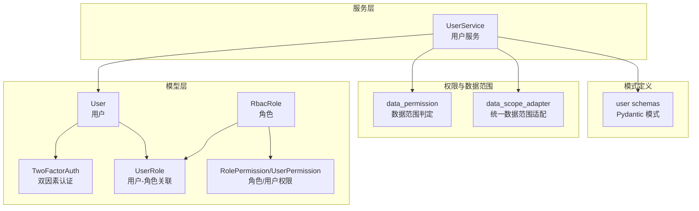
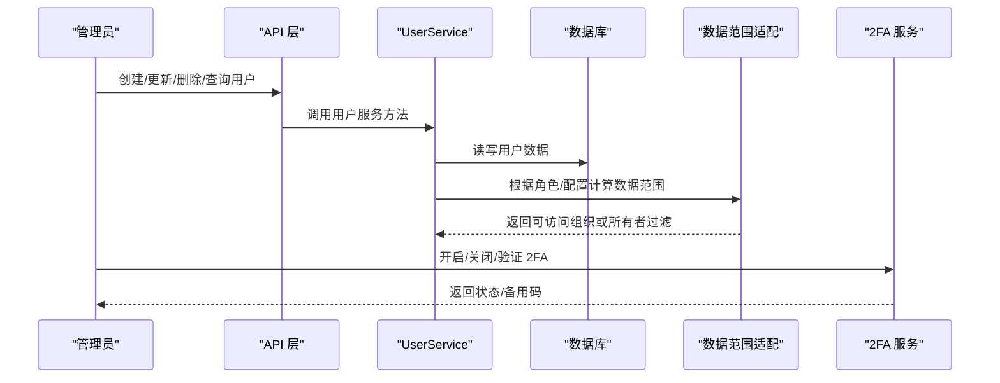
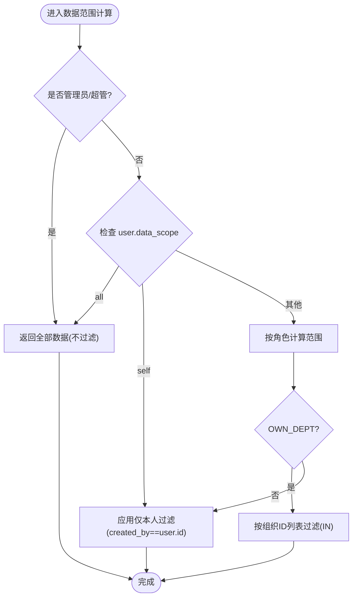
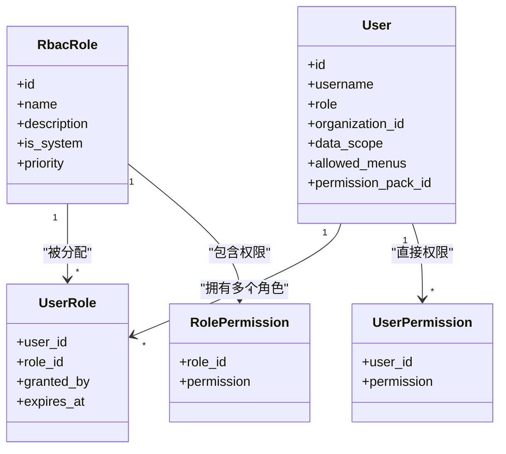
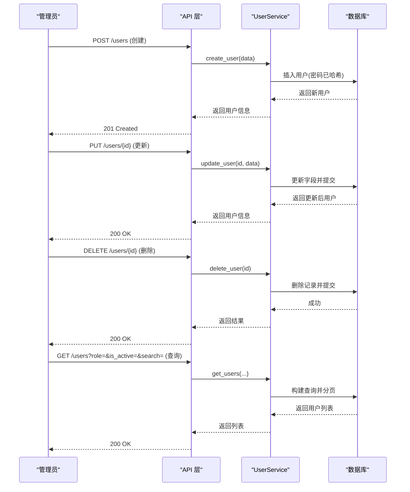
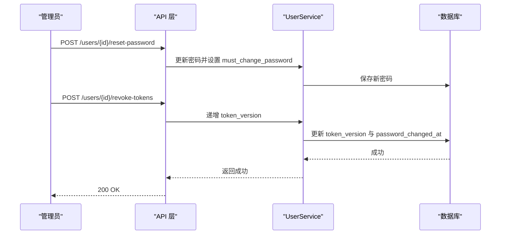
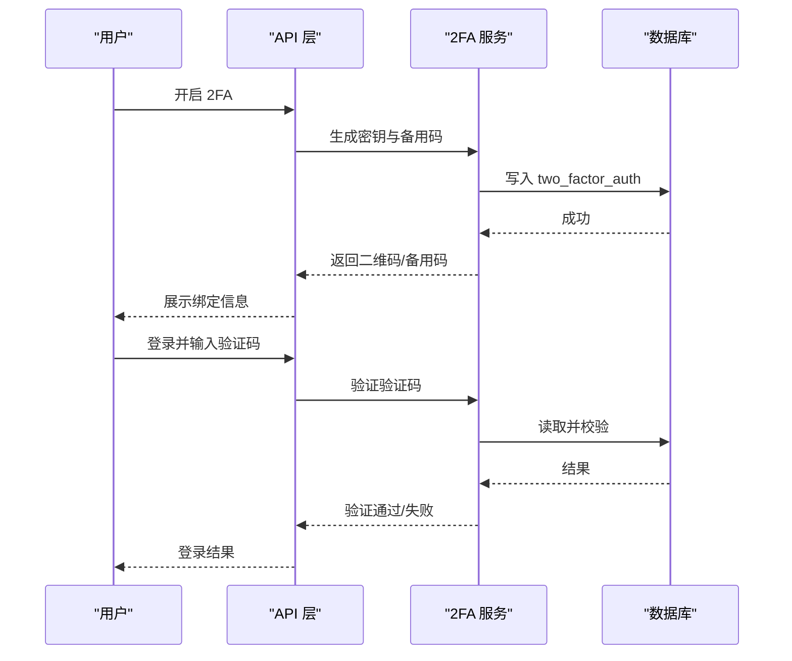
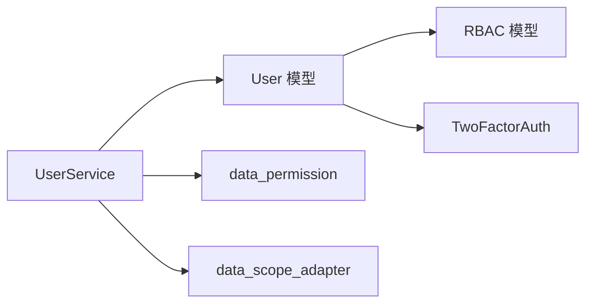

# 用户管理

<cite>
**本文引用的文件**
- [backend/app/models/user.py](file://backend/app/models/user.py)
- [backend/app/schemas/user.py](file://backend/app/schemas/user.py)
- [backend/app/services/user_service.py](file://backend/app/services/user_service.py)
- [backend/app/core/data_permission.py](file://backend/app/core/data_permission.py)
- [backend/app/core/data_scope_adapter.py](file://backend/app/core/data_scope_adapter.py)
- [backend/app/models/rbac.py](file://backend/app/models/rbac.py)
- [backend/app/models/two_factor_auth.py](file://backend/app/models/two_factor_auth.py)
</cite>

## 目录
1. [简介](#简介)
2. [项目结构](#项目结构)
3. [核心组件](#核心组件)
4. [架构总览](#架构总览)
5. [详细组件分析](#详细组件分析)
6. [依赖关系分析](#依赖关系分析)
7. [性能考虑](#性能考虑)
8. [故障排查指南](#故障排查指南)
9. [结论](#结论)
10. [附录](#附录)

## 简介
本指南面向系统管理员与运维人员，提供“用户管理”功能的完整操作说明。内容覆盖：
- 用户生命周期管理：创建、编辑、删除、状态启用/禁用
- 角色与权限：超级管理员、系统管理员、普通用户、访客等角色的差异
- 数据范围控制：全部数据、本组织及下级、仅本组织、仅自己
- 搜索与筛选：按用户名、姓名、邮箱、角色、状态等多条件查询
- 安全能力：密码重置、会话管理（Token 版本）、双因素认证（2FA）
- 高级功能：批量操作、权限包导入导出
- 常见问题与最佳实践

## 项目结构
围绕用户管理的后端实现主要包含以下层次：
- 模型层：用户主表、RBAC 角色/权限关联、双因素认证
- 服务层：用户 CRUD、列表查询、基础业务校验
- 权限与数据范围：基于角色与用户配置的数据访问范围计算与过滤
- 模式定义：用于请求/响应的 Pydantic Schema

图表来源
- [backend/app/models/user.py:26-90](file://backend/app/models/user.py#L26-L90)
- [backend/app/models/rbac.py:31-160](file://backend/app/models/rbac.py#L31-L160)
- [backend/app/models/two_factor_auth.py:13-35](file://backend/app/models/two_factor_auth.py#L13-L35)
- [backend/app/services/user_service.py:20-118](file://backend/app/services/user_service.py#L20-L118)
- [backend/app/core/data_permission.py:20-80](file://backend/app/core/data_permission.py#L20-L80)
- [backend/app/core/data_scope_adapter.py:58-183](file://backend/app/core/data_scope_adapter.py#L58-L183)
- [backend/app/schemas/user.py:9-53](file://backend/app/schemas/user.py#L9-L53)

章节来源
- [backend/app/models/user.py:26-90](file://backend/app/models/user.py#L26-L90)
- [backend/app/models/rbac.py:31-160](file://backend/app/models/rbac.py#L31-L160)
- [backend/app/models/two_factor_auth.py:13-35](file://backend/app/models/two_factor_auth.py#L13-L35)
- [backend/app/services/user_service.py:20-118](file://backend/app/services/user_service.py#L20-L118)
- [backend/app/core/data_permission.py:20-80](file://backend/app/core/data_permission.py#L20-L80)
- [backend/app/core/data_scope_adapter.py:58-183](file://backend/app/core/data_scope_adapter.py#L58-L183)
- [backend/app/schemas/user.py:9-53](file://backend/app/schemas/user.py#L9-L53)

## 核心组件
- 用户模型（User）
  - 关键字段：用户名、邮箱、加密密码、角色、是否激活、是否超级管理员、所属组织、数据范围、可见菜单、权限包绑定、Token 版本、登录失败计数、锁定截止时间、密码修改时间、最后登录时间等
  - 关系：与组织、双因素认证一对一；与项目等实体存在外键关系
- 角色与权限（RBAC）
  - 角色、用户-角色关联、角色-权限关联、用户直接权限、资源访问控制、访问日志、机器码权限
- 数据范围（Data Scope）
  - 基于角色与用户配置的访问范围：全部、本组织及下级、仅本组织、仅自己
  - 统一适配层兼容历史三种实现，支持 SQLAlchemy 2.0 Select 与旧式 Query
- 用户服务（UserService）
  - 提供用户查询、创建、更新、删除、多条件筛选等能力
- 双因素认证（2FA）
  - 用户级 2FA 密钥、备用恢复码、启用状态与验证时间

章节来源
- [backend/app/models/user.py:26-152](file://backend/app/models/user.py#L26-L152)
- [backend/app/models/rbac.py:31-263](file://backend/app/models/rbac.py#L31-L263)
- [backend/app/core/data_permission.py:20-187](file://backend/app/core/data_permission.py#L20-L187)
- [backend/app/core/data_scope_adapter.py:58-183](file://backend/app/core/data_scope_adapter.py#L58-L183)
- [backend/app/services/user_service.py:20-118](file://backend/app/services/user_service.py#L20-L118)
- [backend/app/models/two_factor_auth.py:13-35](file://backend/app/models/two_factor_auth.py#L13-L35)

## 架构总览
下图展示了用户管理与权限、数据范围、2FA 的交互关系。

图表来源
- [backend/app/services/user_service.py:50-118](file://backend/app/services/user_service.py#L50-L118)
- [backend/app/core/data_scope_adapter.py:114-183](file://backend/app/core/data_scope_adapter.py#L114-L183)
- [backend/app/models/two_factor_auth.py:13-35](file://backend/app/models/two_factor_auth.py#L13-L35)

## 详细组件分析

### 用户模型与数据范围
- 用户字段要点
  - 角色 role：super_admin、admin、user、viewer
  - 数据范围 data_scope：all、org_children、org、self
  - 可见菜单 allowed_menus：None 表示继承角色默认菜单；[] 表示无菜单；数组为自定义菜单 key 列表
  - 权限包 permission_pack_id：绑定后菜单解析优先级：allowed_menus > 权限包 > 角色默认
  - Token 版本 token_version：递增后使所有现有 JWT 失效
  - 安全相关：failed_login_count、locked_until、must_change_password、password_changed_at
- 数据范围语义
  - all：全部数据（管理员/超级管理员或显式配置）
  - org_children：本组织及下级（需结合组织树展开）
  - org：仅本组织
  - self：仅本人创建的数据
  - 当模型缺少组织或所有者字段时，采用 fail-closed 策略降级为“仅本人”或拒绝

图表来源
- [backend/app/core/data_permission.py:54-80](file://backend/app/core/data_permission.py#L54-L80)
- [backend/app/core/data_scope_adapter.py:114-183](file://backend/app/core/data_scope_adapter.py#L114-L183)

章节来源
- [backend/app/models/user.py:37-85](file://backend/app/models/user.py#L37-L85)
- [backend/app/core/data_permission.py:54-134](file://backend/app/core/data_permission.py#L54-L134)
- [backend/app/core/data_scope_adapter.py:58-183](file://backend/app/core/data_scope_adapter.py#L58-L183)

### 角色与权限机制
- 内置角色与权限
  - 超级管理员：拥有全部数据与系统级权限
  - 系统管理员：通常具备本组织及下级的数据访问与管理能力
  - 普通用户：默认仅本人数据，可按配置扩展
  - 访客：只读或受限访问
- 权限分配方式
  - 通过 RBAC 角色-权限关联授予
  - 用户可直接附加权限（UserPermission）
  - 可通过权限包（PermissionPack）批量授权并控制菜单可见性
- 菜单可见性
  - 允许为每个用户设置 allowed_menus，优先级高于权限包与角色默认

图表来源
- [backend/app/models/rbac.py:31-160](file://backend/app/models/rbac.py#L31-L160)
- [backend/app/models/user.py:37-85](file://backend/app/models/user.py#L37-L85)

章节来源
- [backend/app/models/rbac.py:31-160](file://backend/app/models/rbac.py#L31-L160)
- [backend/app/models/user.py:37-85](file://backend/app/models/user.py#L37-L85)

### 用户服务（CRUD 与查询）
- 创建用户
  - 必填：用户名、密码（最小长度限制）
  - 可选：邮箱、姓名、电话、角色、是否激活、是否超级管理员
  - 内部会进行密码哈希与角色规范化
- 更新用户
  - 支持更新邮箱、姓名、电话、状态、角色、密码等
  - 使用安全提交确保事务一致性
- 删除用户
  - 按 ID 删除，不存在则返回失败
- 查询用户列表
  - 支持分页 skip/limit
  - 支持按角色、是否激活、关键词（用户名/姓名/邮箱）筛选

图表来源
- [backend/app/services/user_service.py:50-118](file://backend/app/services/user_service.py#L50-L118)

章节来源
- [backend/app/services/user_service.py:50-118](file://backend/app/services/user_service.py#L50-L118)
- [backend/app/schemas/user.py:9-53](file://backend/app/schemas/user.py#L9-L53)

### 搜索与筛选
- 支持条件
  - 角色：精确匹配
  - 状态：是否激活
  - 关键词：用户名、姓名、邮箱模糊匹配
- 建议
  - 大数据量场景建议使用分页与索引字段（如 username、full_name、email）
  - 组合筛选时注意 SQL 条件复杂度，避免全表扫描

章节来源
- [backend/app/services/user_service.py:50-74](file://backend/app/services/user_service.py#L50-L74)

### 密码重置与会话管理
- 密码重置
  - 通过更新用户密码字段实现，新密码需满足最小长度要求
  - 若需要强制首次登录修改密码，可设置 must_change_password
- 会话管理（Token 版本）
  - 通过递增用户的 token_version，使所有现有 JWT 立即失效
  - 建议在密码重置或敏感操作后执行此流程

图表来源
- [backend/app/models/user.py:78-85](file://backend/app/models/user.py#L78-L85)
- [backend/app/models/user.py:145-149](file://backend/app/models/user.py#L145-L149)

章节来源
- [backend/app/models/user.py:78-85](file://backend/app/models/user.py#L78-L85)
- [backend/app/models/user.py:145-149](file://backend/app/models/user.py#L145-L149)

### 双因素认证（2FA）
- 功能要点
  - 用户级 2FA 密钥与备用恢复码存储
  - 启用/验证状态与时间戳记录
  - 与用户模型一对一关系
- 操作流程
  - 生成并绑定 2FA 密钥
  - 用户登录时要求输入一次性验证码
  - 提供备用恢复码用于账户恢复

图表来源
- [backend/app/models/two_factor_auth.py:13-35](file://backend/app/models/two_factor_auth.py#L13-L35)

章节来源
- [backend/app/models/two_factor_auth.py:13-35](file://backend/app/models/two_factor_auth.py#L13-L35)

### 批量操作与权限包导入导出
- 批量操作
  - 批量启用/禁用、批量分配角色、批量重置密码等
  - 建议分批处理，避免单次事务过大导致锁表或超时
- 权限包
  - 通过权限包集中管理一组权限与菜单可见性
  - 用户可绑定权限包，菜单解析优先级：allowed_menus > 权限包 > 角色默认
  - 支持导入/导出权限包以在不同环境间迁移配置

章节来源
- [backend/app/models/user.py:63-77](file://backend/app/models/user.py#L63-L77)

## 依赖关系分析
- 模块耦合
  - UserService 依赖 User 模型与数据范围工具
  - 数据范围适配层依赖权限判定与组织树展开逻辑
  - RBAC 模型与用户模型通过关联表建立多对多关系
- 外部依赖
  - 数据库：SQLAlchemy ORM
  - 安全：密码哈希、JWT 版本控制
  - 2FA：密钥与备用码存储

图表来源
- [backend/app/services/user_service.py:20-118](file://backend/app/services/user_service.py#L20-L118)
- [backend/app/models/user.py:26-90](file://backend/app/models/user.py#L26-L90)
- [backend/app/core/data_permission.py:20-80](file://backend/app/core/data_permission.py#L20-L80)
- [backend/app/core/data_scope_adapter.py:58-183](file://backend/app/core/data_scope_adapter.py#L58-L183)
- [backend/app/models/rbac.py:31-160](file://backend/app/models/rbac.py#L31-L160)
- [backend/app/models/two_factor_auth.py:13-35](file://backend/app/models/two_factor_auth.py#L13-L35)

章节来源
- [backend/app/services/user_service.py:20-118](file://backend/app/services/user_service.py#L20-L118)
- [backend/app/models/user.py:26-90](file://backend/app/models/user.py#L26-L90)
- [backend/app/core/data_permission.py:20-80](file://backend/app/core/data_permission.py#L20-L80)
- [backend/app/core/data_scope_adapter.py:58-183](file://backend/app/core/data_scope_adapter.py#L58-L183)
- [backend/app/models/rbac.py:31-160](file://backend/app/models/rbac.py#L31-L160)
- [backend/app/models/two_factor_auth.py:13-35](file://backend/app/models/two_factor_auth.py#L13-L35)

## 性能考虑
- 查询优化
  - 合理使用分页与索引字段（username、full_name、email、role、is_active）
  - 避免在高频接口中进行复杂字符串匹配
- 事务与锁
  - 批量操作分批次提交，降低锁竞争
  - 大事务拆分为小事务，减少长时间持有连接
- 数据范围
  - 优先使用组织 ID IN 过滤，避免全表扫描
  - 对于“仅本人”范围，确保 owner 字段存在且命中索引

[本节为通用性能建议，不直接分析具体文件]

## 故障排查指南
- 无法查看数据
  - 检查用户角色与 data_scope 配置
  - 确认目标模型是否存在组织或所有者字段，否则将触发 fail-closed 降级
- 用户被锁定
  - 检查 failed_login_count 与 locked_until，必要时解锁或等待过期
- 2FA 无法登录
  - 核对 two_factor_auth.enabled 与 verified_at
  - 使用备用恢复码进行恢复
- 权限未生效
  - 检查 RBAC 角色-权限关联是否正确
  - 确认用户 allowed_menus 与权限包绑定优先级

章节来源
- [backend/app/core/data_permission.py:120-134](file://backend/app/core/data_permission.py#L120-L134)
- [backend/app/core/data_scope_adapter.py:170-183](file://backend/app/core/data_scope_adapter.py#L170-L183)
- [backend/app/models/user.py:78-85](file://backend/app/models/user.py#L78-L85)
- [backend/app/models/two_factor_auth.py:13-35](file://backend/app/models/two_factor_auth.py#L13-L35)

## 结论
本指南基于代码库中的用户模型、RBAC、数据范围适配与用户服务，提供了从创建到权限、数据范围、2FA 与批量操作的完整操作说明。遵循最佳实践与故障排查建议，可保障用户管理的安全性与稳定性。

[本节为总结性内容，不直接分析具体文件]

## 附录
- 常用字段参考
  - 用户角色：super_admin、admin、user、viewer
  - 数据范围：all、org_children、org、self
  - 菜单可见性：allowed_menus（None/[]/[keys]）
  - 权限包：permission_pack_id（绑定后影响菜单解析）
- 推荐流程
  - 新建用户：创建 -> 分配角色 -> 设置数据范围 -> 可选开启 2FA
  - 权限变更：调整角色/权限包 -> 刷新菜单 -> 审计日志
  - 安全加固：定期重置密码 -> 递增 token_version -> 启用 2FA

[本节为补充信息，不直接分析具体文件]