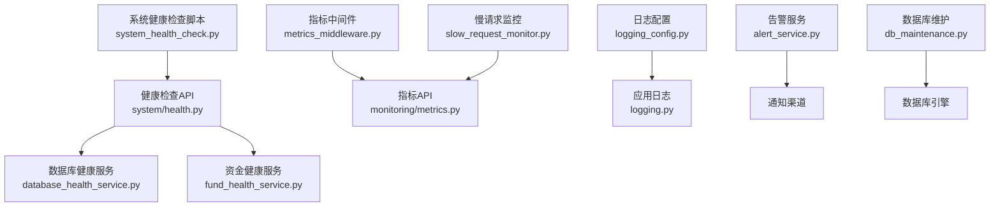
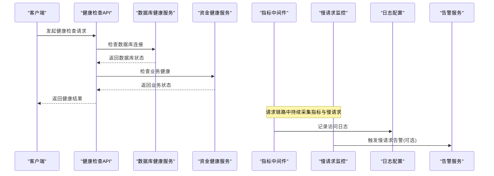
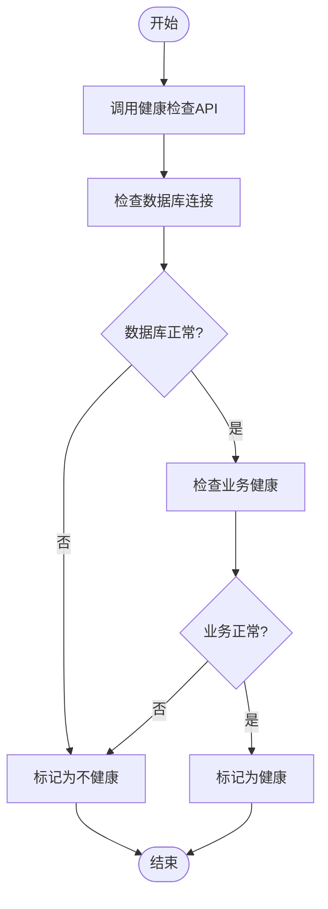
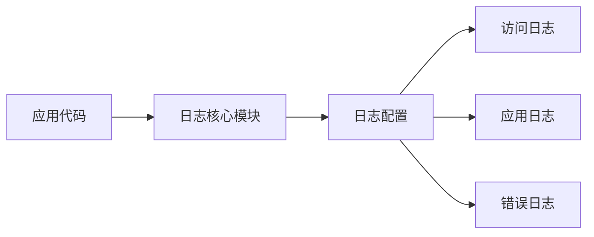
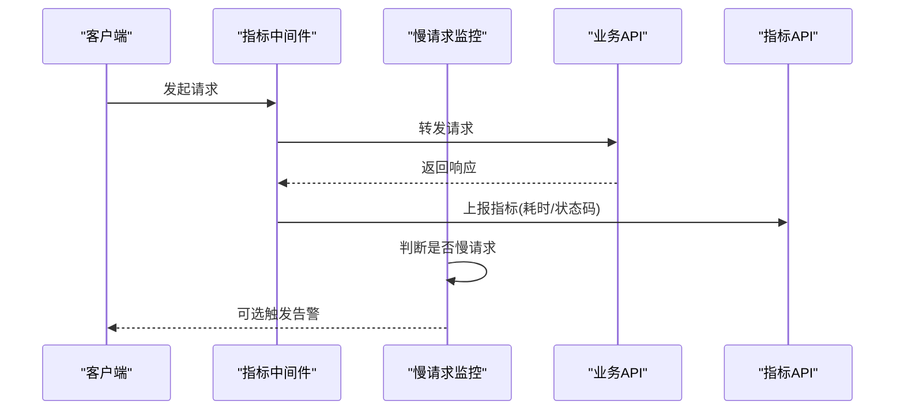
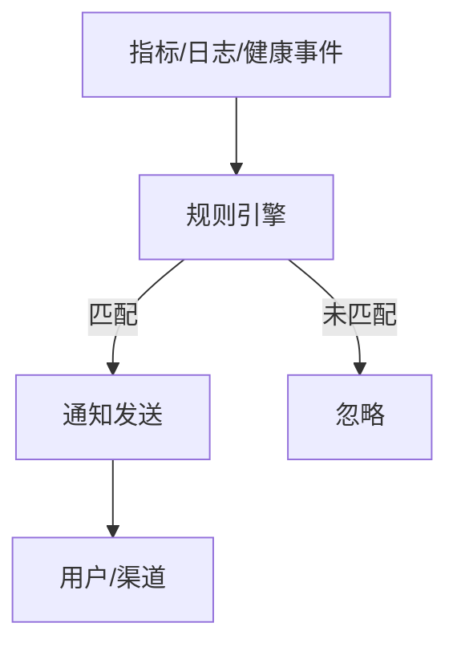
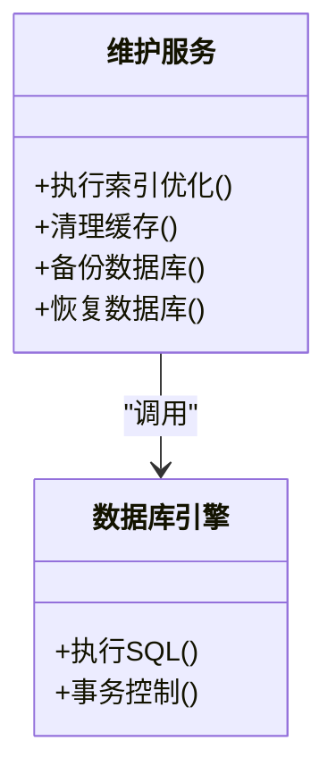
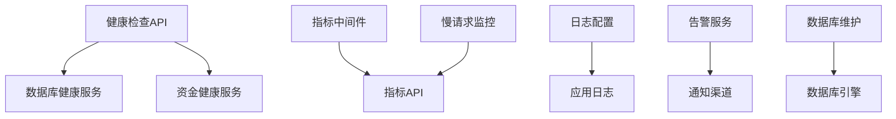

# 监控与维护

<cite>
**本文引用的文件**
- [backend/app/api/v1/system/health.py](file://backend/app/api/v1/system/health.py)
- [backend/app/services/database_health_service.py](file://backend/app/services/database_health_service.py)
- [backend/app/services/fund_health_service.py](file://backend/app/services/fund_health_service.py)
- [backend/app/core/logging_config.py](file://backend/app/core/logging_config.py)
- [backend/app/core/logging.py](file://backend/app/core/logging.py)
- [backend/app/middleware/metrics_middleware.py](file://backend/app/middleware/metrics_middleware.py)
- [backend/app/middleware/slow_request_monitor.py](file://backend/app/middleware/slow_request_monitor.py)
- [backend/app/api/v1/monitoring/metrics.py](file://backend/app/api/v1/monitoring/metrics.py)
- [backend/app/services/alert_service.py](file://backend/app/services/alert_service.py)
- [backend/app/services/db_maintenance.py](file://backend/app/services/db_maintenance.py)
- [backend/scripts/system_health_check.py](file://backend/scripts/system_health_check.py)
- [backend/app/models/system_monitor.py](file://backend/app/models/system_monitor.py)
- [backend/app/models/monitoring.py](file://backend/app/models/monitoring.py)
</cite>

## 目录
1. [简介](#简介)
2. [项目结构](#项目结构)
3. [核心组件](#核心组件)
4. [架构总览](#架构总览)
5. [详细组件分析](#详细组件分析)
6. [依赖关系分析](#依赖关系分析)
7. [性能考量](#性能考量)
8. [故障诊断指南](#故障诊断指南)
9. [结论](#结论)
10. [附录](#附录)

## 简介
本指南面向运维与开发人员，系统化说明系统的监控与维护能力，覆盖健康检查、日志管理、性能监控、告警配置以及系统维护工具的使用。通过后端健康检查接口、指标采集中间件、日志配置与脚本工具，实现对数据库连接状态、磁盘空间、内存使用、CPU负载等关键指标的实时监控；对应用日志、访问日志、错误日志进行分类查看与分析；提供API响应时间、数据库查询性能、前端性能指标的监控数据与优化建议；并给出告警阈值、通知方式与规则的配置方法，以及缓存清理、索引优化、数据库维护等运维操作与常见问题的快速定位方案。

## 项目结构
与监控和维护相关的代码主要分布在以下位置：
- 健康检查：系统健康检查API与健康服务
- 日志：日志配置与应用日志模块
- 性能监控：指标中间件、慢请求监控、指标API
- 告警：告警服务
- 维护：数据库维护服务与系统健康检查脚本
- 模型：系统监控相关的数据模型

图表来源
- [backend/app/api/v1/system/health.py](file://backend/app/api/v1/system/health.py)
- [backend/app/services/database_health_service.py](file://backend/app/services/database_health_service.py)
- [backend/app/services/fund_health_service.py](file://backend/app/services/fund_health_service.py)
- [backend/app/middleware/metrics_middleware.py](file://backend/app/middleware/metrics_middleware.py)
- [backend/app/middleware/slow_request_monitor.py](file://backend/app/middleware/slow_request_monitor.py)
- [backend/app/api/v1/monitoring/metrics.py](file://backend/app/api/v1/monitoring/metrics.py)
- [backend/app/core/logging_config.py](file://backend/app/core/logging_config.py)
- [backend/app/core/logging.py](file://backend/app/core/logging.py)
- [backend/app/services/alert_service.py](file://backend/app/services/alert_service.py)
- [backend/app/services/db_maintenance.py](file://backend/app/services/db_maintenance.py)
- [backend/scripts/system_health_check.py](file://backend/scripts/system_health_check.py)

章节来源
- [backend/app/api/v1/system/health.py](file://backend/app/api/v1/system/health.py)
- [backend/app/services/database_health_service.py](file://backend/app/services/database_health_service.py)
- [backend/app/services/fund_health_service.py](file://backend/app/services/fund_health_service.py)
- [backend/app/middleware/metrics_middleware.py](file://backend/app/middleware/metrics_middleware.py)
- [backend/app/middleware/slow_request_monitor.py](file://backend/app/middleware/slow_request_monitor.py)
- [backend/app/api/v1/monitoring/metrics.py](file://backend/app/api/v1/monitoring/metrics.py)
- [backend/app/core/logging_config.py](file://backend/app/core/logging_config.py)
- [backend/app/core/logging.py](file://backend/app/core/logging.py)
- [backend/app/services/alert_service.py](file://backend/app/services/alert_service.py)
- [backend/app/services/db_maintenance.py](file://backend/app/services/db_maintenance.py)
- [backend/scripts/system_health_check.py](file://backend/scripts/system_health_check.py)

## 核心组件
- 健康检查：提供系统健康检查接口，聚合数据库连接状态、资源使用情况等指标，支持外部探针或定时任务调用。
- 日志管理：集中化日志配置，支持应用日志、访问日志、错误日志的分类输出与轮转策略。
- 性能监控：通过中间件采集API响应时间、慢请求统计、数据库查询耗时等指标，并提供统一指标查询接口。
- 告警机制：基于阈值与规则触发告警，支持多种通知方式（如邮件、Webhook等），便于自动化监控与及时处置。
- 维护工具：提供数据库维护（如索引优化、表修复）、缓存清理、备份恢复等运维操作入口。

章节来源
- [backend/app/api/v1/system/health.py](file://backend/app/api/v1/system/health.py)
- [backend/app/core/logging_config.py](file://backend/app/core/logging_config.py)
- [backend/app/middleware/metrics_middleware.py](file://backend/app/middleware/metrics_middleware.py)
- [backend/app/services/alert_service.py](file://backend/app/services/alert_service.py)
- [backend/app/services/db_maintenance.py](file://backend/app/services/db_maintenance.py)

## 架构总览
系统监控与维护的整体流程如下：
- 健康检查：客户端调用健康检查API，内部聚合数据库健康服务与业务健康服务结果，返回整体健康状态。
- 指标采集：请求进入时由指标中间件记录响应时间与状态码；慢请求监控捕获超时的请求并上报。
- 日志输出：所有请求与异常通过日志配置写入对应日志文件，便于分类检索与分析。
- 告警触发：当指标超过阈值或出现异常时，告警服务根据规则发送通知。
- 维护操作：通过维护服务执行数据库维护任务，保障系统稳定运行。

图表来源
- [backend/app/api/v1/system/health.py](file://backend/app/api/v1/system/health.py)
- [backend/app/services/database_health_service.py](file://backend/app/services/database_health_service.py)
- [backend/app/services/fund_health_service.py](file://backend/app/services/fund_health_service.py)
- [backend/app/middleware/metrics_middleware.py](file://backend/app/middleware/metrics_middleware.py)
- [backend/app/middleware/slow_request_monitor.py](file://backend/app/middleware/slow_request_monitor.py)
- [backend/app/core/logging_config.py](file://backend/app/core/logging_config.py)
- [backend/app/services/alert_service.py](file://backend/app/services/alert_service.py)

## 详细组件分析

### 健康检查组件
- 功能要点：
  - 聚合数据库连接状态、业务子系统健康状态，返回整体健康信息。
  - 支持外部探针周期性调用，用于负载均衡与健康探测。
- 实现要点：
  - 健康检查API作为入口，调用数据库健康服务与业务健康服务。
  - 可结合系统健康检查脚本进行本地或定时自检。
- 使用建议：
  - 将健康检查接口暴露给容器编排或负载均衡器进行存活检测。
  - 在CI/CD流水线中加入健康检查步骤，确保部署后服务可用。

图表来源
- [backend/app/api/v1/system/health.py](file://backend/app/api/v1/system/health.py)
- [backend/app/services/database_health_service.py](file://backend/app/services/database_health_service.py)
- [backend/app/services/fund_health_service.py](file://backend/app/services/fund_health_service.py)

章节来源
- [backend/app/api/v1/system/health.py](file://backend/app/api/v1/system/health.py)
- [backend/app/services/database_health_service.py](file://backend/app/services/database_health_service.py)
- [backend/app/services/fund_health_service.py](file://backend/app/services/fund_health_service.py)
- [backend/scripts/system_health_check.py](file://backend/scripts/system_health_check.py)

### 日志管理组件
- 功能要点：
  - 统一日志配置，支持按级别、模块、请求上下文分类输出。
  - 支持访问日志、应用日志、错误日志的分离与轮转策略。
- 实现要点：
  - 日志配置模块负责初始化日志器、设置输出目标与格式。
  - 应用日志模块提供统一的日志记录接口，便于在各层调用。
- 使用建议：
  - 在生产环境开启结构化日志，便于日志平台采集与分析。
  - 针对敏感信息启用脱敏策略，避免泄露。

图表来源
- [backend/app/core/logging_config.py](file://backend/app/core/logging_config.py)
- [backend/app/core/logging.py](file://backend/app/core/logging.py)

章节来源
- [backend/app/core/logging_config.py](file://backend/app/core/logging_config.py)
- [backend/app/core/logging.py](file://backend/app/core/logging.py)

### 性能监控与分析组件
- 功能要点：
  - 指标中间件记录API响应时间、状态码、路径等指标。
  - 慢请求监控捕获耗时过长的请求，便于定位瓶颈。
  - 指标API提供查询接口，供前端或监控系统消费。
- 实现要点：
  - 中间件在请求前后埋点，计算耗时并写入指标存储。
  - 慢请求监控根据阈值判断是否上报告警或记录详情。
- 使用建议：
  - 结合Prometheus/Grafana等工具可视化指标趋势。
  - 对高频慢请求进行SQL分析与索引优化。

图表来源
- [backend/app/middleware/metrics_middleware.py](file://backend/app/middleware/metrics_middleware.py)
- [backend/app/middleware/slow_request_monitor.py](file://backend/app/middleware/slow_request_monitor.py)
- [backend/app/api/v1/monitoring/metrics.py](file://backend/app/api/v1/monitoring/metrics.py)

章节来源
- [backend/app/middleware/metrics_middleware.py](file://backend/app/middleware/metrics_middleware.py)
- [backend/app/middleware/slow_request_monitor.py](file://backend/app/middleware/slow_request_monitor.py)
- [backend/app/api/v1/monitoring/metrics.py](file://backend/app/api/v1/monitoring/metrics.py)

### 告警配置组件
- 功能要点：
  - 基于阈值与规则触发告警，支持多种通知渠道。
  - 可配置告警等级、去重、静默期等策略。
- 实现要点：
  - 告警服务封装规则匹配与通知发送逻辑。
  - 与指标、日志、健康检查联动，形成闭环监控。
- 使用建议：
  - 合理设置阈值，避免误报与漏报。
  - 对重要告警设置升级策略，确保及时处理。

图表来源
- [backend/app/services/alert_service.py](file://backend/app/services/alert_service.py)

章节来源
- [backend/app/services/alert_service.py](file://backend/app/services/alert_service.py)

### 系统维护工具
- 功能要点：
  - 数据库维护：索引优化、表修复、统计信息更新等。
  - 缓存清理：清理过期或无效缓存，释放内存与存储空间。
  - 备份恢复：定期备份与恢复，保障数据安全。
- 实现要点：
  - 维护服务封装具体运维操作，提供安全校验与回滚机制。
  - 可通过API或脚本执行，便于自动化运维。
- 使用建议：
  - 在低峰期执行维护任务，减少对业务影响。
  - 维护前进行快照或备份，确保可回滚。

图表来源
- [backend/app/services/db_maintenance.py](file://backend/app/services/db_maintenance.py)

章节来源
- [backend/app/services/db_maintenance.py](file://backend/app/services/db_maintenance.py)

## 依赖关系分析
- 健康检查依赖数据库健康服务与业务健康服务，形成松耦合的健康聚合。
- 指标中间件与慢请求监控共同贡献指标数据，指标API对外提供查询。
- 日志配置为各模块提供统一的日志输出能力。
- 告警服务依赖指标与日志事件，触发通知。
- 维护服务依赖数据库引擎执行底层操作。

图表来源
- [backend/app/api/v1/system/health.py](file://backend/app/api/v1/system/health.py)
- [backend/app/services/database_health_service.py](file://backend/app/services/database_health_service.py)
- [backend/app/services/fund_health_service.py](file://backend/app/services/fund_health_service.py)
- [backend/app/middleware/metrics_middleware.py](file://backend/app/middleware/metrics_middleware.py)
- [backend/app/middleware/slow_request_monitor.py](file://backend/app/middleware/slow_request_monitor.py)
- [backend/app/api/v1/monitoring/metrics.py](file://backend/app/api/v1/monitoring/metrics.py)
- [backend/app/core/logging_config.py](file://backend/app/core/logging_config.py)
- [backend/app/core/logging.py](file://backend/app/core/logging.py)
- [backend/app/services/alert_service.py](file://backend/app/services/alert_service.py)
- [backend/app/services/db_maintenance.py](file://backend/app/services/db_maintenance.py)

章节来源
- [backend/app/api/v1/system/health.py](file://backend/app/api/v1/system/health.py)
- [backend/app/services/database_health_service.py](file://backend/app/services/database_health_service.py)
- [backend/app/services/fund_health_service.py](file://backend/app/services/fund_health_service.py)
- [backend/app/middleware/metrics_middleware.py](file://backend/app/middleware/metrics_middleware.py)
- [backend/app/middleware/slow_request_monitor.py](file://backend/app/middleware/slow_request_monitor.py)
- [backend/app/api/v1/monitoring/metrics.py](file://backend/app/api/v1/monitoring/metrics.py)
- [backend/app/core/logging_config.py](file://backend/app/core/logging_config.py)
- [backend/app/core/logging.py](file://backend/app/core/logging.py)
- [backend/app/services/alert_service.py](file://backend/app/services/alert_service.py)
- [backend/app/services/db_maintenance.py](file://backend/app/services/db_maintenance.py)

## 性能考量
- 指标采集开销：指标中间件应在生产环境控制采样率与存储容量，避免对主链路造成显著延迟。
- 慢请求阈值：合理设置慢请求阈值，兼顾灵敏度与噪音控制。
- 日志轮转：配置合理的日志文件大小与保留策略，防止磁盘占满。
- 数据库维护：在低峰期执行索引优化与统计信息更新，减少锁竞争与查询抖动。
- 告警风暴：启用去重与静默期，避免告警风暴影响处理效率。

## 故障诊断指南
- 健康检查失败：
  - 检查数据库连接配置与网络连通性。
  - 查看数据库健康服务的错误日志，确认是否存在连接池耗尽或权限问题。
- 指标缺失或异常：
  - 确认指标中间件已正确挂载且未抛出异常。
  - 检查指标API的存储后端是否可用。
- 慢请求频发：
  - 分析慢请求日志，定位热点接口与SQL。
  - 对慢查询进行索引优化或改写。
- 告警过多：
  - 调整阈值与规则，启用去重与静默期。
  - 检查是否有系统性问题导致告警风暴。
- 维护任务失败：
  - 检查数据库权限与锁状态。
  - 在执行前进行备份与预检，确保可回滚。

章节来源
- [backend/app/api/v1/system/health.py](file://backend/app/api/v1/system/health.py)
- [backend/app/services/database_health_service.py](file://backend/app/services/database_health_service.py)
- [backend/app/middleware/metrics_middleware.py](file://backend/app/middleware/metrics_middleware.py)
- [backend/app/middleware/slow_request_monitor.py](file://backend/app/middleware/slow_request_monitor.py)
- [backend/app/services/alert_service.py](file://backend/app/services/alert_service.py)
- [backend/app/services/db_maintenance.py](file://backend/app/services/db_maintenance.py)

## 结论
本系统提供了完善的监控与维护能力，涵盖健康检查、日志管理、性能监控、告警配置与系统维护工具。通过健康检查接口与脚本工具，可实现对数据库连接状态、资源使用情况的实时监控；通过指标中间件与慢请求监控，可对API响应时间与数据库查询性能进行分析与优化；通过告警服务，可实现自动化监控与及时通知；通过维护服务，可执行数据库维护与缓存清理等运维操作。建议在生产环境中合理配置阈值与策略，结合日志平台与可视化工具，形成闭环的监控与维护体系。

## 附录
- 常用命令与脚本：
  - 系统健康检查脚本：用于本地或定时自检。
  - 指标查询接口：用于获取API响应时间与状态码等指标。
- 参考模型：
  - 系统监控模型：用于持久化监控数据。
  - 监控数据模型：用于存储各类监控指标。

章节来源
- [backend/scripts/system_health_check.py](file://backend/scripts/system_health_check.py)
- [backend/app/api/v1/monitoring/metrics.py](file://backend/app/api/v1/monitoring/metrics.py)
- [backend/app/models/system_monitor.py](file://backend/app/models/system_monitor.py)
- [backend/app/models/monitoring.py](file://backend/app/models/monitoring.py)