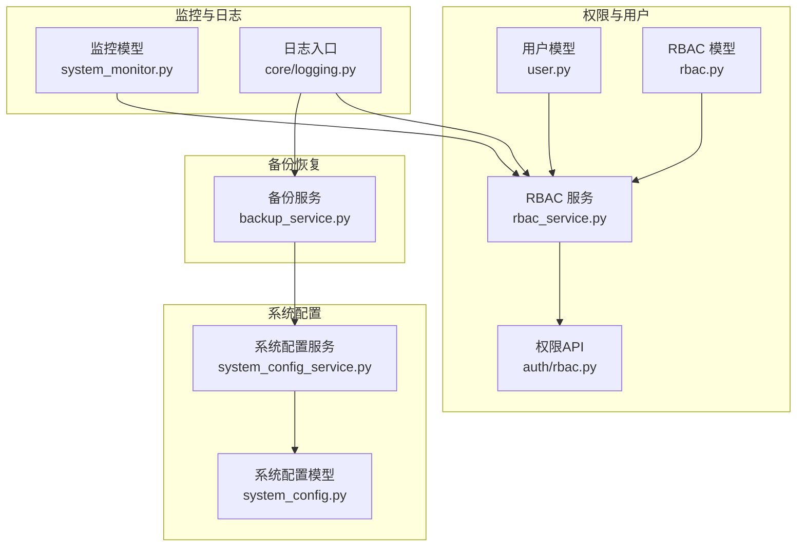
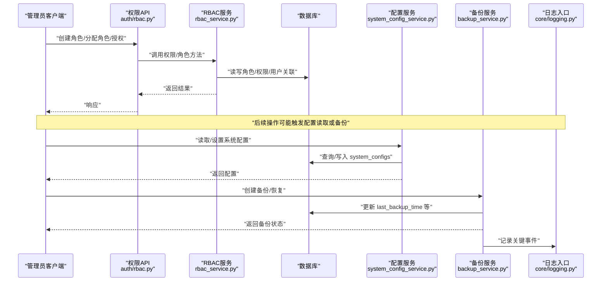
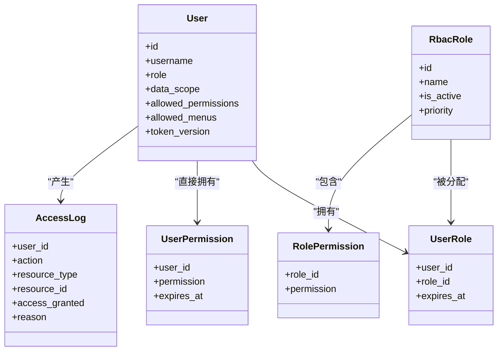
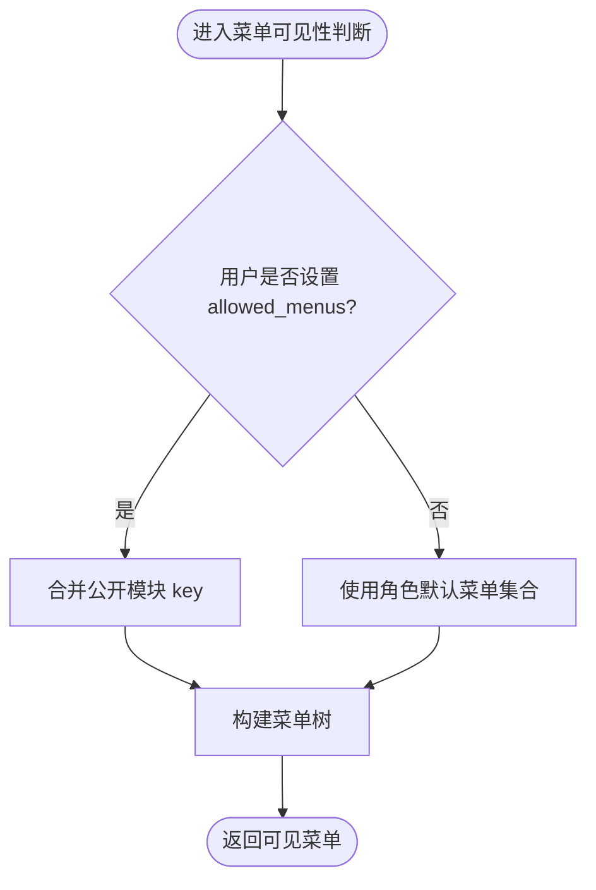
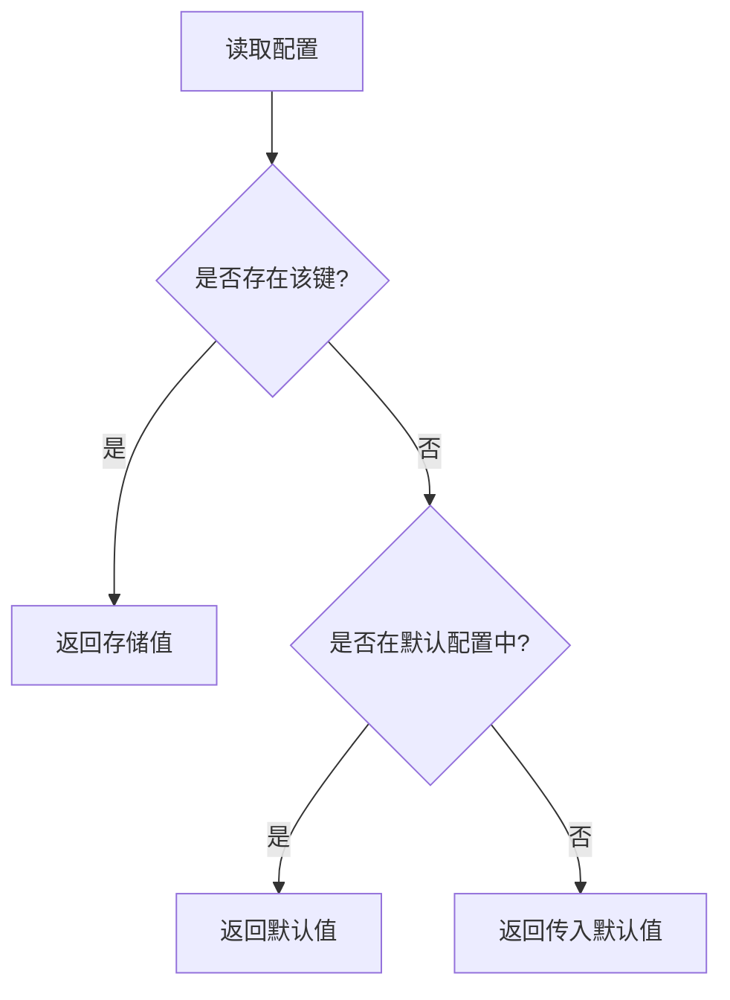
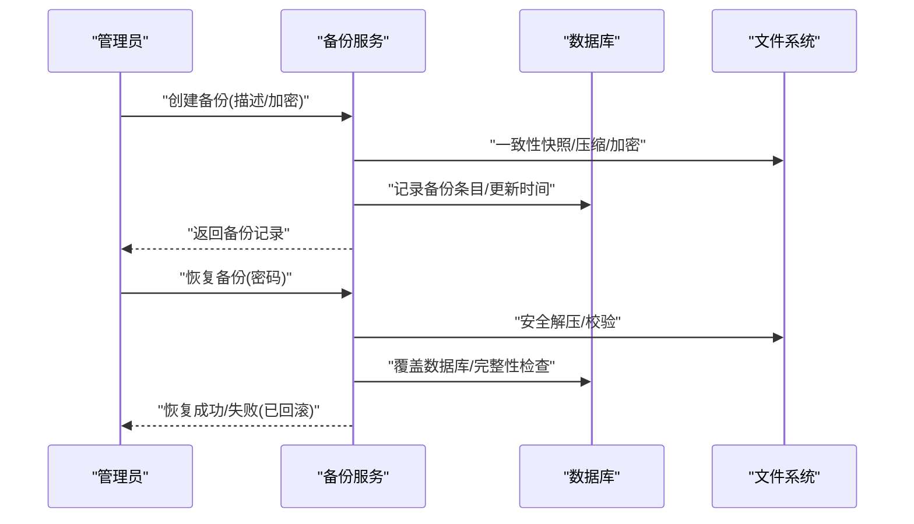
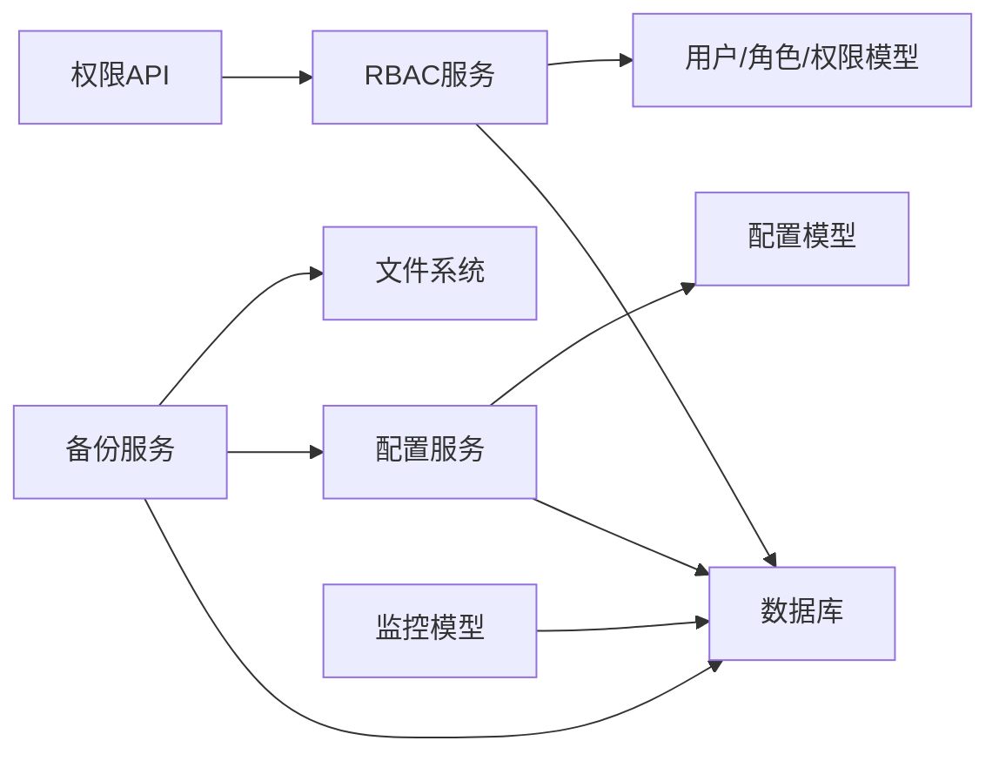

# 系统管理操作指南

<cite>
**本文引用的文件**
- [backend/app/models/user.py](file://backend/app/models/user.py)
- [backend/app/models/rbac.py](file://backend/app/models/rbac.py)
- [backend/app/services/rbac_service.py](file://backend/app/services/rbac_service.py)
- [backend/app/api/v1/auth/rbac.py](file://backend/app/api/v1/auth/rbac.py)
- [backend/app/models/system_config.py](file://backend/app/models/system_config.py)
- [backend/app/services/system_config_service.py](file://backend/app/services/system_config_service.py)
- [backend/app/services/backup_service.py](file://backend/app/services/backup_service.py)
- [backend/app/models/system_monitor.py](file://backend/app/models/system_monitor.py)
- [backend/app/core/logging.py](file://backend/app/core/logging.py)
- [backend/tests/unit/test_menu_api_extended.py](file://backend/tests/unit/test_menu_api_extended.py)
</cite>

## 目录
1. [简介](#简介)
2. [项目结构](#项目结构)
3. [核心组件](#核心组件)
4. [架构总览](#架构总览)
5. [详细组件分析](#详细组件分析)
6. [依赖关系分析](#依赖关系分析)
7. [性能考虑](#性能考虑)
8. [故障排查指南](#故障排查指南)
9. [结论](#结论)
10. [附录](#附录)

## 简介
本指南面向系统管理员，覆盖用户与权限、菜单与功能权限、系统配置、备份恢复与数据维护、监控与性能调优、安全与日志、以及升级与维护等运维场景。内容基于后端模型与服务实现，提供可操作的流程说明与排错建议。

## 项目结构
系统管理相关能力主要分布在以下模块：
- 用户与权限：用户模型、RBAC 模型与 RBAC 服务、权限 API
- 菜单与功能权限：菜单可见性控制（角色默认与用户自定义）
- 系统配置：配置模型与配置服务（含默认值、导入导出）
- 备份恢复：备份服务（全量/增量、加密、校验、清理策略）
- 监控与日志：监控指标模型、统一日志入口
- 测试用例：菜单权限行为验证（角色默认、可见性规则）

**图表来源**
- [backend/app/models/user.py:26-85](file://backend/app/models/user.py#L26-L85)
- [backend/app/models/rbac.py:31-160](file://backend/app/models/rbac.py#L31-L160)
- [backend/app/services/rbac_service.py:104-222](file://backend/app/services/rbac_service.py#L104-L222)
- [backend/app/api/v1/auth/rbac.py:144-179](file://backend/app/api/v1/auth/rbac.py#L144-L179)
- [backend/app/models/system_config.py:11-29](file://backend/app/models/system_config.py#L11-L29)
- [backend/app/services/system_config_service.py:68-126](file://backend/app/services/system_config_service.py#L68-L126)
- [backend/app/services/backup_service.py:74-118](file://backend/app/services/backup_service.py#L74-L118)
- [backend/app/models/system_monitor.py:11-49](file://backend/app/models/system_monitor.py#L11-L49)
- [backend/app/core/logging.py:1-24](file://backend/app/core/logging.py#L1-L24)

**章节来源**
- [backend/app/models/user.py:26-85](file://backend/app/models/user.py#L26-L85)
- [backend/app/models/rbac.py:31-160](file://backend/app/models/rbac.py#L31-L160)
- [backend/app/services/rbac_service.py:104-222](file://backend/app/services/rbac_service.py#L104-L222)
- [backend/app/api/v1/auth/rbac.py:144-179](file://backend/app/api/v1/auth/rbac.py#L144-L179)
- [backend/app/models/system_config.py:11-29](file://backend/app/models/system_config.py#L11-L29)
- [backend/app/services/system_config_service.py:68-126](file://backend/app/services/system_config_service.py#L68-L126)
- [backend/app/services/backup_service.py:74-118](file://backend/app/services/backup_service.py#L74-L118)
- [backend/app/models/system_monitor.py:11-49](file://backend/app/models/system_monitor.py#L11-L49)
- [backend/app/core/logging.py:1-24](file://backend/app/core/logging.py#L1-L24)

## 核心组件
- 用户与角色：用户表包含角色、数据范围、白名单权限、可见菜单等字段；RBAC 模型定义角色、用户-角色、角色-权限、用户直接权限、资源访问控制与访问日志。
- RBAC 服务：提供权限计算、授予/撤销、批量保存、角色分配/撤销、访问日志记录等能力，并支持机器码限制权限的缓存与过滤。
- 系统配置：集中管理键值对配置，提供默认值、类型转换、初始化、导入导出等功能。
- 备份服务：提供一致性快照、压缩、可选 AES-256 加密、完整性校验、增量清单、保留策略与回滚机制。
- 监控与日志：监控指标模型用于持久化系统指标；日志通过统一入口初始化与输出。

**章节来源**
- [backend/app/models/user.py:26-85](file://backend/app/models/user.py#L26-L85)
- [backend/app/models/rbac.py:31-160](file://backend/app/models/rbac.py#L31-L160)
- [backend/app/services/rbac_service.py:104-222](file://backend/app/services/rbac_service.py#L104-L222)
- [backend/app/services/system_config_service.py:68-126](file://backend/app/services/system_config_service.py#L68-L126)
- [backend/app/services/backup_service.py:74-118](file://backend/app/services/backup_service.py#L74-L118)
- [backend/app/models/system_monitor.py:11-49](file://backend/app/models/system_monitor.py#L11-L49)
- [backend/app/core/logging.py:1-24](file://backend/app/core/logging.py#L1-L24)

## 架构总览
下图展示从请求到权限判定、配置读取、备份执行与日志记录的端到端交互。

**图表来源**
- [backend/app/api/v1/auth/rbac.py:144-179](file://backend/app/api/v1/auth/rbac.py#L144-L179)
- [backend/app/services/rbac_service.py:104-222](file://backend/app/services/rbac_service.py#L104-L222)
- [backend/app/services/system_config_service.py:68-126](file://backend/app/services/system_config_service.py#L68-L126)
- [backend/app/services/backup_service.py:319-395](file://backend/app/services/backup_service.py#L319-L395)
- [backend/app/core/logging.py:1-24](file://backend/app/core/logging.py#L1-L24)

## 详细组件分析

### 用户管理与角色权限
- 用户模型关键字段：用户名、邮箱、角色、是否激活、数据范围、白名单权限、可见菜单、绑定权限包、Token 版本、登录失败计数与锁定时间等。
- RBAC 模型：角色、用户-角色、角色-权限、用户直接权限、资源访问控制、访问日志、机器码权限。
- RBAC 服务：
  - 权限检查：优先机器码限制，再管理员、直接权限、角色权限、资源级权限，最后拒绝并记录日志。
  - 权限计算：合并直接权限与角色权限，应用用户白名单交集，减去机器码限制。
  - 角色与权限操作：创建角色、分配/撤销角色、授予/撤销/批量保存权限。
  - 事务边界：多数写操作使用 flush，由外层事务管理器提交，保证原子性。

**图表来源**
- [backend/app/models/user.py:26-85](file://backend/app/models/user.py#L26-L85)
- [backend/app/models/rbac.py:31-160](file://backend/app/models/rbac.py#L31-L160)
- [backend/app/models/rbac.py:191-218](file://backend/app/models/rbac.py#L191-L218)

**章节来源**
- [backend/app/models/user.py:26-85](file://backend/app/models/user.py#L26-L85)
- [backend/app/models/rbac.py:31-160](file://backend/app/models/rbac.py#L31-L160)
- [backend/app/services/rbac_service.py:104-222](file://backend/app/services/rbac_service.py#L104-L222)
- [backend/app/services/rbac_service.py:322-363](file://backend/app/services/rbac_service.py#L322-L363)
- [backend/app/services/rbac_service.py:518-586](file://backend/app/services/rbac_service.py#L518-L586)

### 菜单管理与功能权限控制
- 菜单可见性：支持按角色默认菜单集合与用户自定义 allowed_menus 控制；公开模块（如政策法规、数据分析）会强制并入。
- 角色默认菜单：不同角色（如 super_admin/admin/viewer）具有不同的默认菜单集合；非管理员无法查看角色默认菜单配置。
- 前端可见性：接口 /menus/accessible 返回当前用户可见菜单树；/menus/role-defaults 仅管理员可获取各角色默认菜单。

**图表来源**
- [backend/tests/unit/test_menu_api_extended.py:176-189](file://backend/tests/unit/test_menu_api_extended.py#L176-L189)
- [backend/tests/unit/test_menu_api_extended.py:513-541](file://backend/tests/unit/test_menu_api_extended.py#L513-L541)
- [backend/tests/unit/test_menu_api_extended.py:674-695](file://backend/tests/unit/test_menu_api_extended.py#L674-L695)

**章节来源**
- [backend/tests/unit/test_menu_api_extended.py:176-189](file://backend/tests/unit/test_menu_api_extended.py#L176-L189)
- [backend/tests/unit/test_menu_api_extended.py:513-541](file://backend/tests/unit/test_menu_api_extended.py#L513-L541)
- [backend/tests/unit/test_menu_api_extended.py:674-695](file://backend/tests/unit/test_menu_api_extended.py#L674-L695)

### 系统配置参数设置与优化
- 配置项：包括自动备份开关、保留天数、间隔、最大数量、目标目录、加密开关、异常检测阈值、数据保留天数、系统版本等。
- 配置服务：提供 get/set/get_bool/get_json/get_all/initialize_defaults/export/import 等方法；支持无数据库会话时返回默认值。
- 典型优化：
  - 调整 backup_retention_days 与 max_backup_count 控制磁盘占用。
  - 启用 data_package_encryption 提升数据包安全性。
  - 根据业务需求设置 anomaly_* 阈值以平衡误报与漏报。

**图表来源**
- [backend/app/services/system_config_service.py:100-126](file://backend/app/services/system_config_service.py#L100-L126)
- [backend/app/services/system_config_service.py:72-95](file://backend/app/services/system_config_service.py#L72-L95)

**章节来源**
- [backend/app/models/system_config.py:11-29](file://backend/app/models/system_config.py#L11-L29)
- [backend/app/services/system_config_service.py:68-126](file://backend/app/services/system_config_service.py#L68-L126)
- [backend/app/services/system_config_service.py:155-189](file://backend/app/services/system_config_service.py#L155-L189)
- [backend/app/services/system_config_service.py:203-218](file://backend/app/services/system_config_service.py#L203-L218)

### 备份恢复与数据维护
- 全量备份：生成 SQLite 一致性快照（优先 Backup API，失败回退 WAL checkpoint+拷贝），打包为 zip，可选 AES-256 加密，校验必须包含数据库文件。
- 增量备份：维护 last_manifest.json，对比文件哈希与元信息，仅复制变更文件。
- 恢复流程：解压前进行路径安全检查，解密后解压，先恢复数据库再恢复上传文件，恢复后执行完整性检查，失败则回滚到快照。
- 清理策略：支持按数量保留与按保留天数清理；自动备份受系统配置控制。

**图表来源**
- [backend/app/services/backup_service.py:231-318](file://backend/app/services/backup_service.py#L231-L318)
- [backend/app/services/backup_service.py:319-395](file://backend/app/services/backup_service.py#L319-L395)
- [backend/app/services/backup_service.py:420-600](file://backend/app/services/backup_service.py#L420-L600)
- [backend/app/services/backup_service.py:676-736](file://backend/app/services/backup_service.py#L676-L736)

**章节来源**
- [backend/app/services/backup_service.py:74-118](file://backend/app/services/backup_service.py#L74-L118)
- [backend/app/services/backup_service.py:231-318](file://backend/app/services/backup_service.py#L231-L318)
- [backend/app/services/backup_service.py:319-395](file://backend/app/services/backup_service.py#L319-L395)
- [backend/app/services/backup_service.py:420-600](file://backend/app/services/backup_service.py#L420-L600)
- [backend/app/services/backup_service.py:676-736](file://backend/app/services/backup_service.py#L676-L736)

### 系统监控与性能调优
- 监控指标：CPU/内存/磁盘使用率、网络流量、活跃用户数、请求数、错误数、数据库连接数与查询耗时等，均持久化至 system_monitors。
- 性能建议：
  - 合理设置备份间隔与保留天数，避免频繁 I/O 影响在线服务。
  - 关注 db_query_time 与 error_count，结合慢查询日志定位瓶颈。
  - 在高峰期降低批量任务并发，必要时扩容实例。

**章节来源**
- [backend/app/models/system_monitor.py:11-49](file://backend/app/models/system_monitor.py#L11-L49)

### 安全设置与日志管理
- 安全要点：
  - 用户敏感字段（如电话）采用透明加密存储。
  - 权限判定考虑机器码限制与用户白名单，最小权限原则。
  - 备份支持 AES-256 加密，恢复需密码。
- 日志管理：
  - 统一日志入口 init_logging 初始化日志系统。
  - 权限访问、备份关键步骤均有日志记录，便于审计与排障。

**章节来源**
- [backend/app/models/user.py:49-49](file://backend/app/models/user.py#L49-L49)
- [backend/app/services/rbac_service.py:133-222](file://backend/app/services/rbac_service.py#L133-L222)
- [backend/app/services/backup_service.py:145-213](file://backend/app/services/backup_service.py#L145-L213)
- [backend/app/core/logging.py:1-24](file://backend/app/core/logging.py#L1-L24)

### 系统升级与维护操作流程
- 升级前准备：
  - 确认系统版本与兼容性（system_version）。
  - 执行全量备份并记录 checksum。
  - 评估变更影响面，制定回滚方案。
- 升级步骤：
  - 停止服务或切换到只读模式（如有）。
  - 应用新版本代码与迁移脚本。
  - 启动服务并验证核心功能。
- 回滚策略：
  - 若出现严重问题，立即恢复最近一次有效备份。
  - 恢复后进行完整性检查与功能验证。

[本节为通用流程说明，不直接引用具体代码文件]

## 依赖关系分析
- 权限链路：API -> RBAC 服务 -> 模型（用户/角色/权限）-> 数据库
- 配置链路：配置服务 -> 配置模型 -> 数据库
- 备份链路：备份服务 -> 文件系统/SQLite -> 配置服务（记录时间/策略）-> 日志
- 监控链路：监控模型 -> 数据库（供报表/告警消费）

**图表来源**
- [backend/app/api/v1/auth/rbac.py:144-179](file://backend/app/api/v1/auth/rbac.py#L144-L179)
- [backend/app/services/rbac_service.py:104-222](file://backend/app/services/rbac_service.py#L104-L222)
- [backend/app/models/rbac.py:31-160](file://backend/app/models/rbac.py#L31-L160)
- [backend/app/services/system_config_service.py:68-126](file://backend/app/services/system_config_service.py#L68-L126)
- [backend/app/models/system_config.py:11-29](file://backend/app/models/system_config.py#L11-L29)
- [backend/app/services/backup_service.py:319-395](file://backend/app/services/backup_service.py#L319-L395)
- [backend/app/models/system_monitor.py:11-49](file://backend/app/models/system_monitor.py#L11-L49)

**章节来源**
- [backend/app/api/v1/auth/rbac.py:144-179](file://backend/app/api/v1/auth/rbac.py#L144-L179)
- [backend/app/services/rbac_service.py:104-222](file://backend/app/services/rbac_service.py#L104-L222)
- [backend/app/models/rbac.py:31-160](file://backend/app/models/rbac.py#L31-L160)
- [backend/app/services/system_config_service.py:68-126](file://backend/app/services/system_config_service.py#L68-L126)
- [backend/app/models/system_config.py:11-29](file://backend/app/models/system_config.py#L11-L29)
- [backend/app/services/backup_service.py:319-395](file://backend/app/services/backup_service.py#L319-L395)
- [backend/app/models/system_monitor.py:11-49](file://backend/app/models/system_monitor.py#L11-L49)

## 性能考虑
- 权限计算：
  - 使用请求级缓存减少重复查询（机器码限制权限）。
  - 批量授予/撤销权限，减少数据库往返。
- 备份与恢复：
  - 一致性快照避免锁库与数据不一致。
  - 压缩级别与增量备份降低 I/O 压力。
  - 磁盘空间预检避免写出损坏文件。
- 配置读取：
  - 默认配置兜底，避免冷启动失败。
  - 批量导入/导出配置时注意事务与校验。

[本节提供通用指导，不直接分析具体文件]

## 故障排查指南
- 权限相关问题：
  - 检查用户是否被机器码限制或白名单过滤。
  - 确认角色是否激活且未过期。
  - 查看访问日志中的拒绝原因。
- 备份失败：
  - 检查磁盘剩余空间是否满足最低阈值。
  - 确认备份包是否包含数据库文件。
  - 加密备份恢复需提供正确密码。
- 配置异常：
  - 核对键名与类型转换是否正确。
  - 导入 JSON 格式是否合法。
- 日志问题：
  - 确认日志初始化已执行。
  - 检查日志输出路径与权限。

**章节来源**
- [backend/app/services/rbac_service.py:133-222](file://backend/app/services/rbac_service.py#L133-L222)
- [backend/app/services/backup_service.py:216-230](file://backend/app/services/backup_service.py#L216-L230)
- [backend/app/services/backup_service.py:319-395](file://backend/app/services/backup_service.py#L319-L395)
- [backend/app/services/system_config_service.py:145-153](file://backend/app/services/system_config_service.py#L145-L153)
- [backend/app/core/logging.py:1-24](file://backend/app/core/logging.py#L1-L24)

## 结论
本指南围绕用户与权限、菜单与功能权限、系统配置、备份恢复、监控与日志、升级维护等方面提供了系统化操作说明。建议在生产环境中严格遵循最小权限原则、定期备份与演练恢复、持续监控关键指标，并结合日志进行问题定位与性能优化。

## 附录
- 常用配置键参考：
  - auto_backup：是否自动备份
  - backup_retention_days：备份保留天数
  - backup_interval_days：备份间隔（天）
  - max_backup_count：最大备份数量
  - backup_target_dir：备份目标目录
  - backup_encrypt：自动备份默认加密
  - data_retention_days：数据保留天数
  - system_version：系统版本
  - anomaly_*：异常检测相关阈值与开关

**章节来源**
- [backend/app/services/system_config_service.py:72-95](file://backend/app/services/system_config_service.py#L72-L95)