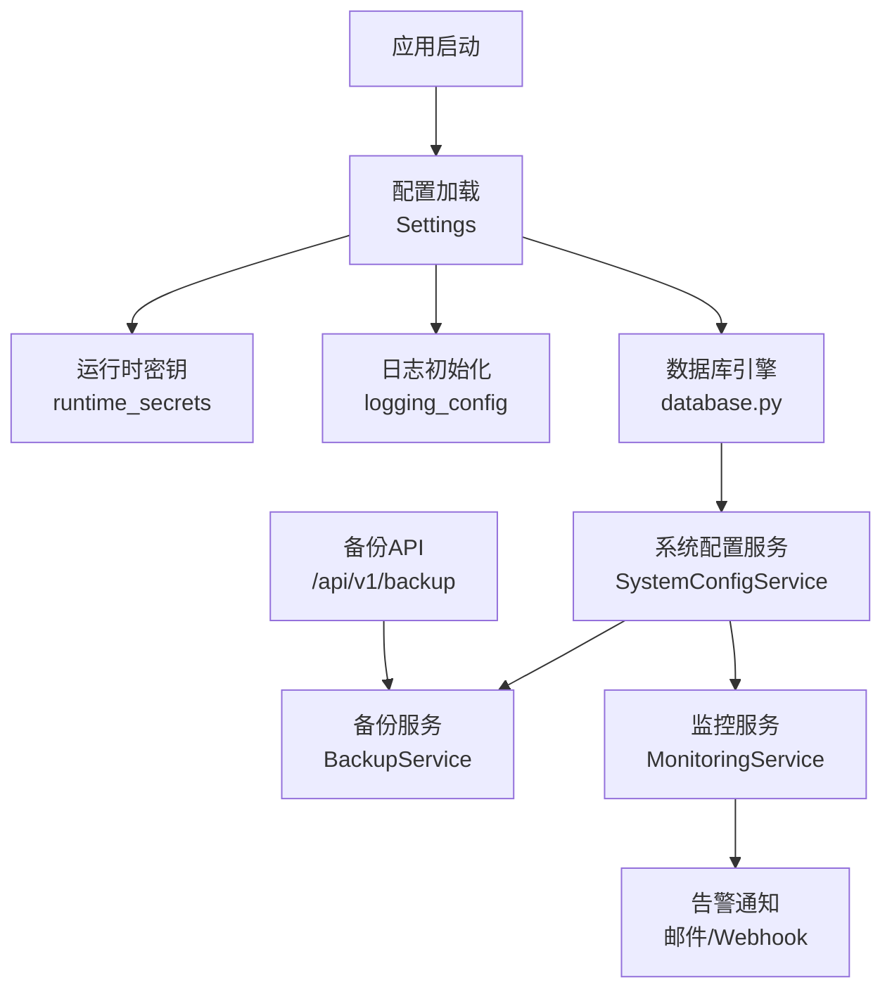
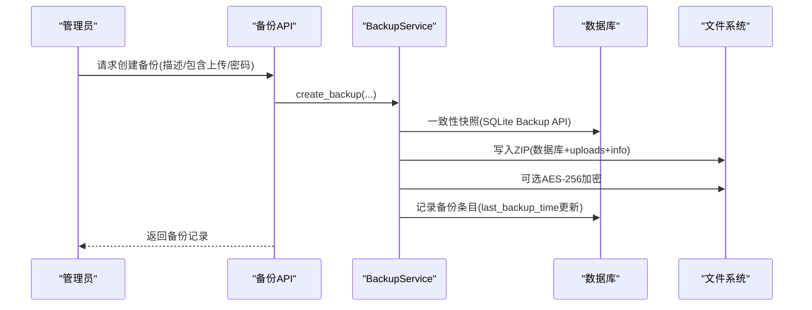
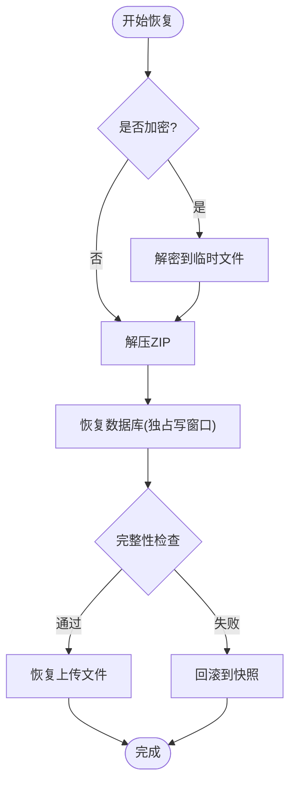
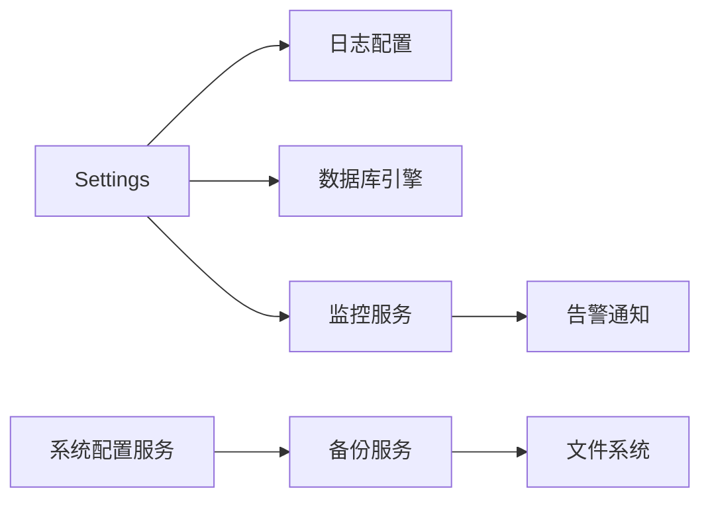

# 系统设置

<cite>
**本文引用的文件**
- [backend/app/core/config.py](file://backend/app/core/config.py)
- [backend/app/models/system_config.py](file://backend/app/models/system_config.py)
- [backend/app/services/system_config_service.py](file://backend/app/services/system_config_service.py)
- [backend/app/services/secrets_manager.py](file://backend/app/services/secrets_manager.py)
- [backend/app/services/backup_service.py](file://backend/app/services/backup_service.py)
- [backend/app/api/v1/system/backup.py](file://backend/app/api/v1/system/backup.py)
- [backend/app/services/monitoring_service.py](file://backend/app/services/monitoring_service.py)
- [backend/app/core/logging_config.py](file://backend/app/core/logging_config.py)
- [backend/app/core/database.py](file://backend/app/core/database.py)
</cite>

## 目录
1. [简介](#简介)
2. [项目结构](#项目结构)
3. [核心组件](#核心组件)
4. [架构总览](#架构总览)
5. [详细组件分析](#详细组件分析)
6. [依赖关系分析](#依赖关系分析)
7. [性能与调优](#性能与调优)
8. [故障排查指南](#故障排查指南)
9. [结论](#结论)
10. [附录：配置项速查](#附录：配置项速查)

## 简介
本指南面向运维与管理员，系统化说明“系统设置管理”的配置、初始化、安全、监控、备份恢复与升级维护等能力。内容基于后端代码实现，覆盖基础设置、安全策略、性能参数、环境变量与敏感信息、监控指标、备份计划与保留策略、以及版本兼容与导入导出等。

## 项目结构
系统设置相关能力由以下模块协同完成：
- 配置加载与安全：应用级 Settings、运行时密钥、加密配置加载
- 运行时系统配置：持久化键值配置（system_configs）
- 备份与恢复：数据库与上传文件的打包、校验、加密、恢复回滚
- 监控与告警：API 性能统计、资源使用、规则告警与通知
- 日志：结构化 JSON 日志、轮转、敏感信息脱敏
- 数据库：SQLite 连接池、WAL、PRAGMA 优化、SQLCipher 支持

图表来源
- [backend/app/core/config.py:54-206](file://backend/app/core/config.py#L54-L206)
- [backend/app/core/logging_config.py:161-274](file://backend/app/core/logging_config.py#L161-L274)
- [backend/app/core/database.py:55-157](file://backend/app/core/database.py#L55-L157)
- [backend/app/services/system_config_service.py:68-266](file://backend/app/services/system_config_service.py#L68-L266)
- [backend/app/services/backup_service.py:74-395](file://backend/app/services/backup_service.py#L74-L395)
- [backend/app/services/monitoring_service.py:26-312](file://backend/app/services/monitoring_service.py#L26-L312)
- [backend/app/api/v1/system/backup.py:170-200](file://backend/app/api/v1/system/backup.py#L170-L200)

章节来源
- [backend/app/core/config.py:54-206](file://backend/app/core/config.py#L54-L206)
- [backend/app/core/logging_config.py:161-274](file://backend/app/core/logging_config.py#L161-L274)
- [backend/app/core/database.py:55-157](file://backend/app/core/database.py#L55-L157)
- [backend/app/services/system_config_service.py:68-266](file://backend/app/services/system_config_service.py#L68-L266)
- [backend/app/services/backup_service.py:74-395](file://backend/app/services/backup_service.py#L74-L395)
- [backend/app/services/monitoring_service.py:26-312](file://backend/app/services/monitoring_service.py#L26-L312)
- [backend/app/api/v1/system/backup.py:170-200](file://backend/app/api/v1/system/backup.py#L170-L200)

## 核心组件
- 应用配置（Settings）：集中管理环境变量与默认值，动态解析路径、强制生产环境安全基线、可选加密密钥加载。
- 运行时密钥（runtime_secrets）：自动创建并持久化 SECRET_KEY、CSRF_SECRET_KEY、ENCRYPTION_KEY 等敏感值。
- 系统配置（SystemConfigService + SystemConfig 模型）：提供可持久化的键值配置，含默认值、类型转换、导入导出。
- 备份服务（BackupService）：一致性快照、ZIP 打包、完整性校验、AES-256 加密、恢复回滚与清理策略。
- 监控服务（MonitoringService）：API 性能统计、错误率、资源使用、规则告警与通知。
- 日志（logging_config）：JSON/文本格式、按天/大小轮转、敏感信息脱敏、Windows 安全轮转。
- 数据库（database.py）：SQLite 连接池、WAL、PRAGMA 优化、SQLCipher 加密探测与校验。

章节来源
- [backend/app/core/config.py:54-383](file://backend/app/core/config.py#L54-L383)
- [backend/app/services/secrets_manager.py:13-193](file://backend/app/services/secrets_manager.py#L13-L193)
- [backend/app/models/system_config.py:11-51](file://backend/app/models/system_config.py#L11-L51)
- [backend/app/services/system_config_service.py:68-266](file://backend/app/services/system_config_service.py#L68-L266)
- [backend/app/services/backup_service.py:74-737](file://backend/app/services/backup_service.py#L74-L737)
- [backend/app/services/monitoring_service.py:26-312](file://backend/app/services/monitoring_service.py#L26-L312)
- [backend/app/core/logging_config.py:161-274](file://backend/app/core/logging_config.py#L161-L274)
- [backend/app/core/database.py:55-157](file://backend/app/core/database.py#L55-L157)

## 架构总览
系统设置以“配置中心 + 运行时密钥 + 持久化配置表”为核心，驱动备份、监控、日志与数据库行为。

图表来源
- [backend/app/api/v1/system/backup.py:170-200](file://backend/app/api/v1/system/backup.py#L170-L200)
- [backend/app/services/backup_service.py:319-395](file://backend/app/services/backup_service.py#L319-L395)
- [backend/app/core/database.py:78-157](file://backend/app/core/database.py#L78-L157)

## 详细组件分析

### 应用配置与环境变量（Settings）
- 作用：统一从 .env 或环境变量读取配置，提供默认值与安全基线。
- 关键能力：
  - 动态数据目录与数据库路径解析（解决 Windows 安装版权限问题）。
  - 生产环境强制关闭 SQL echo，防止敏感信息入日志。
  - 自动为 ENCRYPTION_KEY 生成并持久化到运行时密钥存储。
  - 可选从加密文件加载 SECRET_KEY、CSRF_SECRET_KEY、SMTP_PASSWORD、DB_ENCRYPTION_KEY。
- 建议：
  - 生产环境务必设置 ENVIRONMENT=production。
  - 通过环境变量控制 CORS、速率限制、日志级别、监控端口等。

章节来源
- [backend/app/core/config.py:54-206](file://backend/app/core/config.py#L54-L206)
- [backend/app/core/config.py:243-383](file://backend/app/core/config.py#L243-L383)

### 运行时密钥与敏感信息管理
- 运行时密钥：SECRET_KEY、CSRF_SECRET_KEY、ENCRYPTION_KEY 等由 ensure_runtime_secrets 自动生成并落盘，避免明文硬编码。
- 密钥管理服务：提供密钥版本、轮换、撤销与过期清理，便于密钥生命周期管理。
- 安全建议：
  - 不要将密钥写入仓库；优先使用环境变量或运行时密钥文件。
  - 定期轮换密钥并评估历史密文兼容性。

章节来源
- [backend/app/core/config.py:366-383](file://backend/app/core/config.py#L366-L383)
- [backend/app/services/secrets_manager.py:13-193](file://backend/app/services/secrets_manager.py#L13-L193)

### 系统配置（持久化键值）
- 模型：system_configs 表，key/value/description/时间戳。
- 服务：SystemConfigService 提供 get/set/get_all/export/import 等方法，内置默认配置（如自动备份开关、保留天数、目标目录、自动打包策略等）。
- 典型用途：
  - 自动备份开关与保留策略（auto_backup、backup_retention_days、max_backup_count、backup_target_dir）。
  - 自动数据包打包（auto_package_enabled、interval_months、target_dir）。
  - 异常检测阈值（anomaly_*）。
- 操作建议：
  - 通过 API 或脚本调用 set_config/get_config 修改运行期配置。
  - 使用 export_config/import_config 进行配置迁移与备份。

章节来源
- [backend/app/models/system_config.py:11-51](file://backend/app/models/system_config.py#L11-L51)
- [backend/app/services/system_config_service.py:68-266](file://backend/app/services/system_config_service.py#L68-L266)

### 备份与恢复
- 一致性快照：优先使用 SQLite Backup API 合并 WAL，失败回退 checkpoint + 裸拷贝。
- 完整性校验：备份包必须包含数据库文件，否则视为失败并删除半成品。
- 加密：可选 AES-256（Fernet），恢复时自动检测并解密到临时文件。
- 恢复流程：解压→校验→替换数据库→替换上传目录→完整性检查→失败回滚到快照。
- 清理策略：按数量或保留天数清理旧备份。
- API：/api/v1/backup 提供创建、列表、删除、恢复等操作，支持内部通道免 JWT 与管理员 JWT 鉴权。

图表来源
- [backend/app/services/backup_service.py:420-600](file://backend/app/services/backup_service.py#L420-L600)
- [backend/app/api/v1/system/backup.py:170-200](file://backend/app/api/v1/system/backup.py#L170-L200)

章节来源
- [backend/app/services/backup_service.py:74-737](file://backend/app/services/backup_service.py#L74-L737)
- [backend/app/api/v1/system/backup.py:170-200](file://backend/app/api/v1/system/backup.py#L170-L200)

### 监控与告警
- API 性能统计：请求量、平均/分位响应时间、错误率。
- 端点统计：按端点聚合请求与错误。
- 资源监控：CPU、内存、磁盘使用率。
- 告警规则：响应时间、错误率、资源使用率阈值触发告警，支持邮件与 Webhook 通知。
- 建议：
  - 根据业务规模调整 METRICS_ENABLED、METRICS_PORT。
  - 合理设置告警阈值与通知渠道，避免告警风暴。

章节来源
- [backend/app/services/monitoring_service.py:26-312](file://backend/app/services/monitoring_service.py#L26-L312)

### 日志配置
- 格式：JSON（推荐）或文本；控制台彩色输出（开发环境）。
- 轮转：按天或按大小；Windows 下安全重试避免 WinError 32。
- 敏感信息脱敏：身份证号、手机号、邮箱、口令/令牌等自动脱敏。
- 建议：
  - 生产环境使用 JSON 格式并开启按天轮转。
  - 严格控制 LOG_LEVEL，避免 DEBUG 泄露敏感信息。

章节来源
- [backend/app/core/logging_config.py:161-274](file://backend/app/core/logging_config.py#L161-L274)

### 数据库连接与优化
- 连接池：QueuePool 针对 SQLite 调优，支持并发读与有限写。
- WAL 模式：提升并发读写能力，配合 PRAGMA 优化缓存、mmap、busy_timeout。
- SQLCipher：启用时自动探测驱动、校验密钥、拒绝假加密。
- 长事务协调器：批量导入等场景使用独占写窗口，避免 SQLITE_BUSY。
- 建议：
  - 根据硬件调整 SQLITE_CACHE_SIZE、SQLITE_MMAP_SIZE。
  - 生产环境保持 WAL 与 NORMAL 同步模式。

章节来源
- [backend/app/core/database.py:55-157](file://backend/app/core/database.py#L55-L157)

## 依赖关系分析
- 配置层（config.py）驱动日志、数据库、监控、备份等行为。
- 系统配置服务（system_config_service.py）提供运行时可编辑的键值配置，影响备份调度与策略。
- 备份服务依赖数据库路径解析、文件系统权限、加密库。
- 监控服务依赖 APIMetric 模型与 AlertRule/AlertHistory。
- 日志子系统独立于业务，但受 Settings 控制。

图表来源
- [backend/app/core/config.py:54-206](file://backend/app/core/config.py#L54-L206)
- [backend/app/services/system_config_service.py:68-266](file://backend/app/services/system_config_service.py#L68-L266)
- [backend/app/services/backup_service.py:74-395](file://backend/app/services/backup_service.py#L74-L395)
- [backend/app/services/monitoring_service.py:26-312](file://backend/app/services/monitoring_service.py#L26-L312)

章节来源
- [backend/app/core/config.py:54-206](file://backend/app/core/config.py#L54-L206)
- [backend/app/services/system_config_service.py:68-266](file://backend/app/services/system_config_service.py#L68-L266)
- [backend/app/services/backup_service.py:74-395](file://backend/app/services/backup_service.py#L74-L395)
- [backend/app/services/monitoring_service.py:26-312](file://backend/app/services/monitoring_service.py#L26-L312)

## 性能与调优
- 数据库：
  - 启用 WAL 与 NORMAL 同步，提高并发读性能。
  - 调整 cache_size 与 mmap_size 适配内存。
  - busy_timeout 放宽至 10s，降低长事务冲突失败概率。
- 备份：
  - 使用一致性快照减少 WAL 不一致风险。
  - 压缩级别可通过环境变量 BACKUP_COMPRESSION_LEVEL 调整。
- 监控：
  - 合理设置 METRICS_PORT，避免与主服务冲突。
  - 告警规则避免过频触发，结合冷却机制。
- 日志：
  - 生产环境使用 JSON 并按天轮转，控制文件大小与保留数量。

[本节为通用指导，不直接分析具体文件]

## 故障排查指南
- 备份失败：
  - 检查磁盘空间是否充足（最低 500MB）。
  - 确认 ZIP 包包含数据库文件；若缺失会抛出“不完整”异常。
  - 加密备份恢复需提供正确密码。
- 恢复失败：
  - 恢复后执行完整性检查，失败将回滚到快照。
  - 注意释放连接池与清理残留 -wal/-shm 文件。
- 日志轮转失败（Windows）：
  - SafeTimedRotatingFileHandler 已内置重试逻辑；若仍失败，检查杀毒软件或索引器占用。
- 数据库加密：
  - 启用 DB_ENCRYPTION_ENABLED 需确保驱动支持 SQLCipher，且密钥文件存在且非空。

章节来源
- [backend/app/services/backup_service.py:216-395](file://backend/app/services/backup_service.py#L216-L395)
- [backend/app/services/backup_service.py:420-600](file://backend/app/services/backup_service.py#L420-L600)
- [backend/app/core/logging_config.py:21-73](file://backend/app/core/logging_config.py#L21-L73)
- [backend/app/core/database.py:89-131](file://backend/app/core/database.py#L89-L131)

## 结论
系统设置围绕“配置—密钥—持久化配置—备份—监控—日志—数据库”形成闭环。通过环境变量与运行时密钥保障安全，通过系统配置表实现灵活可调的运维策略，借助备份与恢复保证数据安全，监控与日志提供可观测性，数据库优化确保单机高性能。建议在生产环境严格遵循安全基线与性能调优建议，并建立规范的备份与告警流程。

## 附录：配置项速查
- 基础设置
  - PROJECT_NAME、PROJECT_VERSION、API_PREFIX、HOST、PORT、DEBUG、ENVIRONMENT
- 安全设置
  - SECRET_KEY、ALGORITHM、ACCESS_TOKEN_EXPIRE_MINUTES、REFRESH_TOKEN_EXPIRE_DAYS、BCRYPT_ROUNDS、PASSWORD_EXPIRE_DAYS、MAX_FAILED_LOGIN_ATTEMPTS、ACCOUNT_LOCKOUT_MINUTES、CORS_ORIGINS、CSRF_ENABLED、RATE_LIMIT_*
- 加密与密钥
  - USE_ENCRYPTED_SECRETS、SECRETS_FILE_PATH、MASTER_KEY_PATH、ENCRYPTION_KEY、ENCRYPTION_BACKEND、ENCRYPTION_KEY_DERIVATION、DB_ENCRYPTION_ENABLED、DB_ENCRYPTION_KEY_PATH
- 数据库
  - DATABASE_URL、DB_POOL_SIZE、DB_MAX_OVERFLOW、DB_POOL_TIMEOUT、DB_POOL_RECYCLE、DB_POOL_PRE_PING、DB_ECHO、SLOW_QUERY_THRESHOLD_MS
- 缓存与Redis
  - CACHE_DIR、CACHE_SIZE_LIMIT、REDIS_ENABLED、REDIS_HOST、REDIS_PORT、REDIS_DB、REDIS_PASSWORD、REDIS_MAX_CONNECTIONS
- 文件与上传
  - UPLOAD_DIR、EXPORT_DIR、LOG_DIR、MAX_FILE_SIZE、ALLOWED_FILE_TYPES
- 监控与告警
  - METRICS_ENABLED、METRICS_PORT、HEALTH_CHECK_ENABLED、ALERT_EMAIL_RECIPIENTS、SMTP_*、ALERT_WEBHOOK_URL、ALERT_WEBHOOK_TYPE
- 日志
  - LOG_LEVEL、LOG_FILE、LOG_FORMAT、LOG_ROTATION、LOG_RETENTION、LOG_MAX_SIZE_MB、LOG_BACKUP_COUNT
- 备份与恢复
  - auto_backup、backup_retention_days、backup_interval_days、max_backup_count、backup_target_dir、backup_encrypt、backup_reminder_days
- 自动打包
  - auto_package_enabled、auto_package_interval_months、auto_package_dir、last_package_time
- 其他
  - ENABLE_AUTO_MIGRATION、APP_NAME、CACHE_ENABLED、CACHE_DEFAULT_TTL、CACHE_MAX_SIZE

[本节汇总自各配置文件与服务默认值，便于快速查阅]