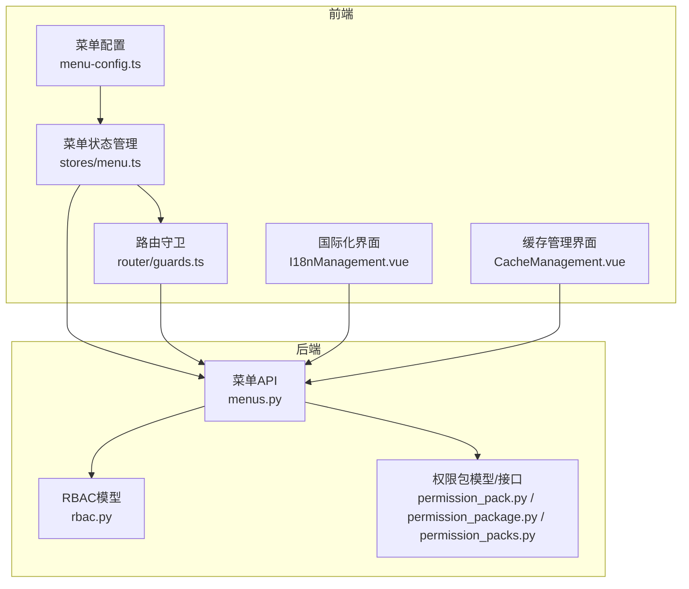
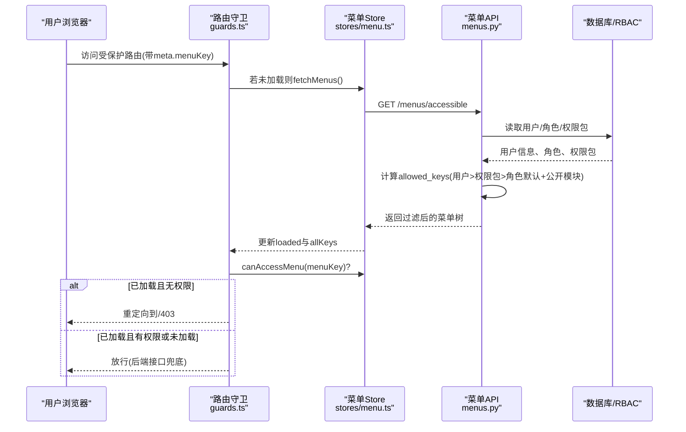
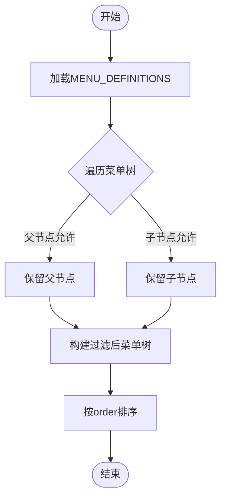
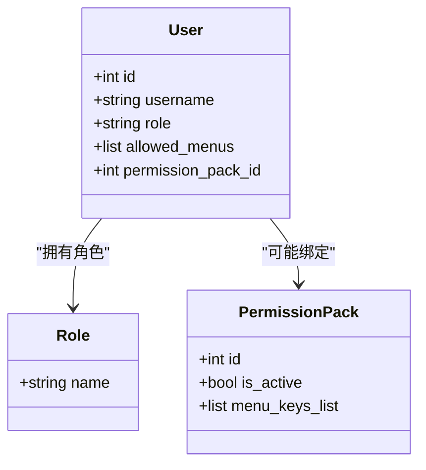
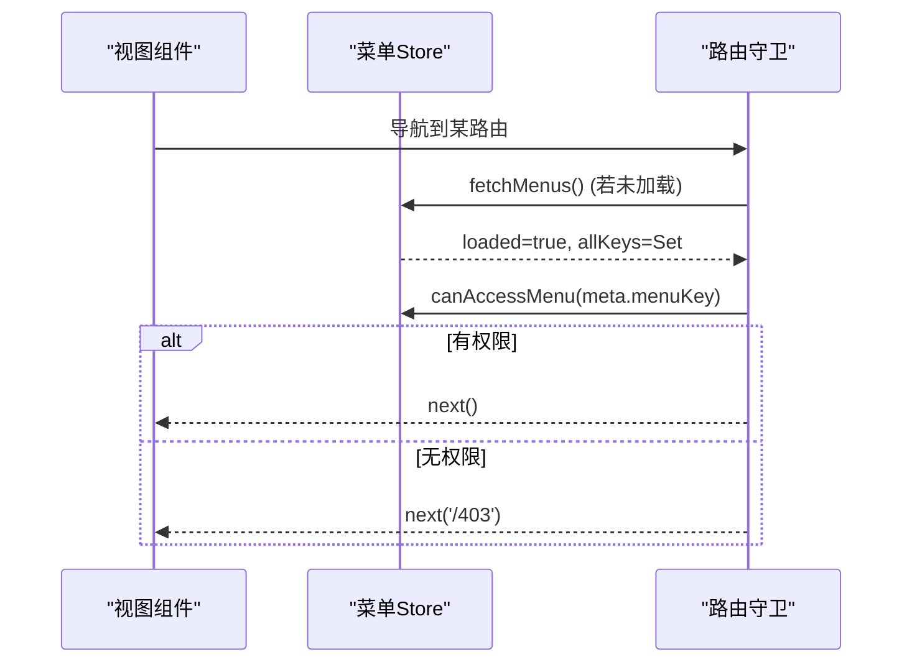
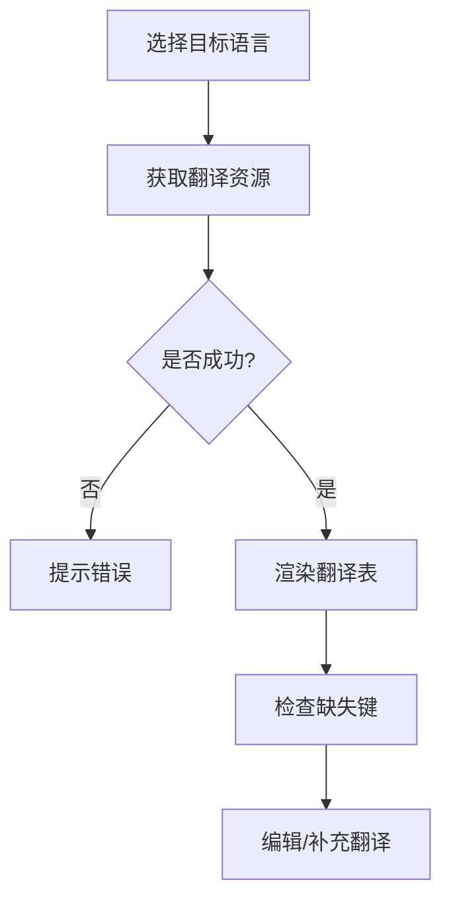
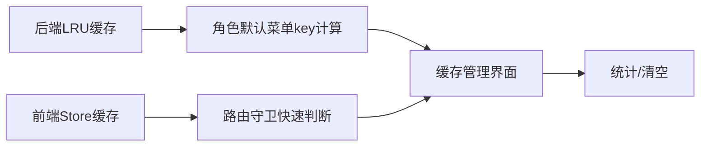
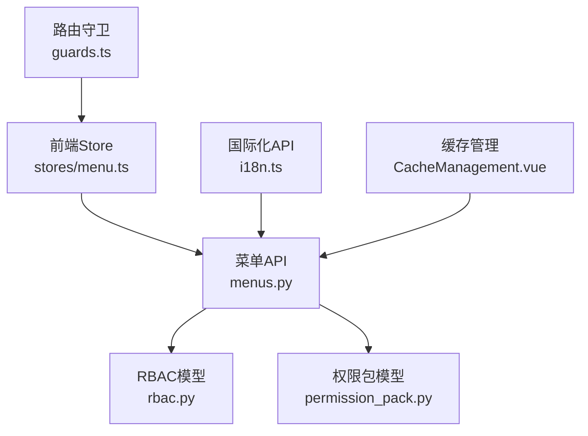

# 菜单配置管理

<cite>
**本文引用的文件**
- [backend/app/api/v1/menus.py](file://backend/app/api/v1/menus.py)
- [frontend/src/config/menu-config.ts](file://frontend/src/config/menu-config.ts)
- [frontend/src/stores/menu.ts](file://frontend/src/stores/menu.ts)
- [frontend/src/router/guards.ts](file://frontend/src/router/guards.ts)
- [backend/app/models/rbac.py](file://backend/app/models/rbac.py)
- [backend/app/core/permission_utils.py](file://backend/app/core/permission_utils.py)
- [backend/app/services/rbac_service.py](file://backend/app/services/rbac_service.py)
- [backend/app/models/permission_pack.py](file://backend/app/models/permission_pack.py)
- [backend/app/schemas/permission_pack.py](file://backend/app/schemas/permission_pack.py)
- [backend/app/api/v1/permission_package.py](file://backend/app/api/v1/permission_package.py)
- [backend/app/api/v1/permission_packs.py](file://backend/app/api/v1/permission_packs.py)
- [frontend/src/api/i18n.ts](file://frontend/src/api/i18n.ts)
- [frontend/src/views/system/I18nManagement.vue](file://frontend/src/views/system/I18nManagement.vue)
- [frontend/src/views/system/CacheManagement.vue](file://frontend/src/views/system/CacheManagement.vue)
- [backend/tests/unit/test_menu_api_extended.py](file://backend/tests/unit/test_menu_api_extended.py)
- [frontend/tests/unit/router/guards.test.ts](file://frontend/tests/unit/router/guards.test.ts)
</cite>

## 目录
1. [简介](#简介)
2. [项目结构](#项目结构)
3. [核心组件](#核心组件)
4. [架构总览](#架构总览)
5. [详细组件分析](#详细组件分析)
6. [依赖关系分析](#依赖关系分析)
7. [性能与缓存](#性能与缓存)
8. [故障排查指南](#故障排查指南)
9. [结论](#结论)
10. [附录：最佳实践与常见问题](#附录最佳实践与常见问题)

## 简介
本指南面向系统管理员、前端开发与后端开发，系统性说明“菜单配置管理”的完整能力与实践方法。内容覆盖：
- 菜单树结构管理：创建、编辑、排序与层级关系配置
- 权限绑定机制：菜单与角色/用户/权限包的关联与动态显示控制
- 前端维护：路由映射、组件集成、权限守卫配置
- 国际化支持：多语言菜单项的配置与管理
- 缓存机制与性能优化：命中率监控、缓存清理策略
- 安全与错误处理：权限验证流程、异常兜底与安全边界
- 最佳实践与常见问题解决方案

## 项目结构
围绕菜单配置的核心代码分布在前后端：
- 后端提供菜单定义、过滤、用户可见菜单计算、角色默认菜单、用户级菜单配置等 API
- 前端通过 store 拉取并缓存当前用户可见菜单，配合路由守卫进行访问控制
- RBAC 模型与权限包为菜单权限提供数据基础
- 国际化模块提供翻译资源管理能力，便于多语言菜单文案管理
- 缓存管理页面提供统计与清空能力，支撑性能调优

**图示来源**
- [backend/app/api/v1/menus.py:1-853](file://backend/app/api/v1/menus.py#L1-L853)
- [frontend/src/config/menu-config.ts:1-364](file://frontend/src/config/menu-config.ts#L1-L364)
- [frontend/src/stores/menu.ts:1-145](file://frontend/src/stores/menu.ts#L1-L145)
- [frontend/src/router/guards.ts:41-87](file://frontend/src/router/guards.ts#L41-L87)
- [backend/app/models/rbac.py:1-263](file://backend/app/models/rbac.py#L1-L263)
- [backend/app/models/permission_pack.py](file://backend/app/models/permission_pack.py)
- [backend/app/api/v1/permission_package.py](file://backend/app/api/v1/permission_package.py)
- [backend/app/api/v1/permission_packs.py](file://backend/app/api/v1/permission_packs.py)

**章节来源**
- [backend/app/api/v1/menus.py:1-853](file://backend/app/api/v1/menus.py#L1-L853)
- [frontend/src/config/menu-config.ts:1-364](file://frontend/src/config/menu-config.ts#L1-L364)
- [frontend/src/stores/menu.ts:1-145](file://frontend/src/stores/menu.ts#L1-L145)
- [frontend/src/router/guards.ts:41-87](file://frontend/src/router/guards.ts#L41-L87)
- [backend/app/models/rbac.py:1-263](file://backend/app/models/rbac.py#L1-L263)

## 核心组件
- 菜单定义与过滤（后端）：集中定义菜单树、按角色/用户/权限包计算可见集合、返回过滤后的菜单树
- 菜单状态管理（前端）：加载、缓存、组织策略合并、可访问键集合维护
- 路由守卫（前端）：登录态检查、角色校验、菜单可见性校验、降级放行策略
- RBAC 与权限包（后端）：角色、用户-角色、角色-权限、用户直接权限、资源访问控制、机器码权限；权限包作为菜单套餐
- 国际化（前端）：语言列表、翻译资源获取、缺失键检测与编辑
- 缓存管理（前端/后端）：缓存统计、健康状态、清空操作

**章节来源**
- [backend/app/api/v1/menus.py:47-637](file://backend/app/api/v1/menus.py#L47-L637)
- [frontend/src/stores/menu.ts:22-145](file://frontend/src/stores/menu.ts#L22-L145)
- [frontend/src/router/guards.ts:41-87](file://frontend/src/router/guards.ts#L41-L87)
- [backend/app/models/rbac.py:31-263](file://backend/app/models/rbac.py#L31-L263)
- [frontend/src/api/i18n.ts:1-67](file://frontend/src/api/i18n.ts#L1-L67)
- [frontend/src/views/system/CacheManagement.vue:1-37](file://frontend/src/views/system/CacheManagement.vue#L1-L37)

## 架构总览
菜单权限体系采用“后端权威 + 前端展示”的双层设计：
- 后端集中维护 MENU_DEFINITIONS，并通过算法计算每个用户的实际可见菜单 key 集合，返回过滤后的菜单树
- 前端 store 缓存该菜单树，并在路由守卫中基于 menuKey 做可见性判断；若菜单未加载或加载失败，则放行由后端接口兜底
- 权限来源优先级：用户级 allowed_menus > 绑定的启用中权限包 > 角色默认；同时强制并入“公开模块”（如政策法规、数据分析）
- 管理员可通过 API 查看/设置用户菜单配置，并参考各角色的默认菜单集合

**图示来源**
- [frontend/src/router/guards.ts:41-87](file://frontend/src/router/guards.ts#L41-L87)
- [frontend/src/stores/menu.ts:87-145](file://frontend/src/stores/menu.ts#L87-L145)
- [backend/app/api/v1/menus.py:661-695](file://backend/app/api/v1/menus.py#L661-L695)
- [backend/app/api/v1/menus.py:587-637](file://backend/app/api/v1/menus.py#L587-L637)

## 详细组件分析

### 菜单树结构与排序
- 菜单定义位于后端集中管理，包含 key、label、path、icon、order、roles、children 等字段
- 通过递归遍历构建菜单树，子节点同样受 roles 约束
- 排序依据 order 字段，建议保持唯一且递增，便于前端渲染顺序稳定

**图示来源**
- [backend/app/api/v1/menus.py:50-538](file://backend/app/api/v1/menus.py#L50-L538)
- [backend/app/api/v1/menus.py:610-637](file://backend/app/api/v1/menus.py#L610-L637)

**章节来源**
- [backend/app/api/v1/menus.py:50-538](file://backend/app/api/v1/menus.py#L50-L538)
- [backend/app/api/v1/menus.py:610-637](file://backend/app/api/v1/menus.py#L610-L637)

### 权限绑定机制（角色/用户/权限包）
- 权限来源优先级：用户级 allowed_menus > 绑定的启用中权限包 > 角色默认
- 公开模块（政策法规、数据分析相关）对所有角色强制可见
- 管理员可查询/设置用户菜单配置，支持恢复角色默认、清空或自定义菜单集合
- 权限包作为“菜单套餐”，可为用户批量授予一组菜单 key

**图示来源**
- [backend/app/models/rbac.py:31-161](file://backend/app/models/rbac.py#L31-L161)
- [backend/app/models/permission_pack.py](file://backend/app/models/permission_pack.py)
- [backend/app/api/v1/menus.py:560-607](file://backend/app/api/v1/menus.py#L560-L607)

**章节来源**
- [backend/app/api/v1/menus.py:560-607](file://backend/app/api/v1/menus.py#L560-L607)
- [backend/app/models/rbac.py:31-161](file://backend/app/models/rbac.py#L31-L161)
- [backend/app/models/permission_pack.py](file://backend/app/models/permission_pack.py)

### 前端菜单配置与维护
- 前端维护一份静态菜单配置（用于降级与本地渲染），需与后端同步 key 与层级
- Store 负责从后端拉取当前用户可见菜单，缓存 allKeys，并提供 canAccessMenu 判断
- 路由守卫在首次访问时加载菜单，结合 meta.menuKey 进行可见性校验；若未加载或加载失败，则放行由后端兜底

**图示来源**
- [frontend/src/stores/menu.ts:87-145](file://frontend/src/stores/menu.ts#L87-L145)
- [frontend/src/router/guards.ts:65-87](file://frontend/src/router/guards.ts#L65-L87)
- [frontend/src/config/menu-config.ts:1-364](file://frontend/src/config/menu-config.ts#L1-L364)

**章节来源**
- [frontend/src/stores/menu.ts:87-145](file://frontend/src/stores/menu.ts#L87-L145)
- [frontend/src/router/guards.ts:65-87](file://frontend/src/router/guards.ts#L65-L87)
- [frontend/src/config/menu-config.ts:1-364](file://frontend/src/config/menu-config.ts#L1-L364)

### 菜单国际化支持
- 前端提供国际化 API，支持获取语言列表、翻译资源、缺失键报告与单键翻译
- 国际化管理界面支持选择目标语言、刷新翻译、检查缺失键并编辑
- 菜单文案可通过翻译 key 管理，确保多语言一致性

**图示来源**
- [frontend/src/api/i18n.ts:53-67](file://frontend/src/api/i18n.ts#L53-L67)
- [frontend/src/views/system/I18nManagement.vue:1-40](file://frontend/src/views/system/I18nManagement.vue#L1-L40)

**章节来源**
- [frontend/src/api/i18n.ts:1-67](file://frontend/src/api/i18n.ts#L1-L67)
- [frontend/src/views/system/I18nManagement.vue:1-40](file://frontend/src/views/system/I18nManagement.vue#L1-L40)

### 菜单缓存机制与性能优化
- 前端 Store 缓存当前用户可见菜单树，避免重复请求
- 后端使用 LRU 缓存角色默认菜单 key 集合，减少重复计算
- 前端提供缓存管理界面，可查看命中率、键数、大小，并支持清空缓存
- 后端提供性能接口用于缓存健康检查与清空

**图示来源**
- [backend/app/api/v1/menus.py:541-557](file://backend/app/api/v1/menus.py#L541-L557)
- [frontend/src/stores/menu.ts:35-54](file://frontend/src/stores/menu.ts#L35-L54)
- [frontend/src/views/system/CacheManagement.vue:1-37](file://frontend/src/views/system/CacheManagement.vue#L1-L37)

**章节来源**
- [backend/app/api/v1/menus.py:541-557](file://backend/app/api/v1/menus.py#L541-L557)
- [frontend/src/stores/menu.ts:35-54](file://frontend/src/stores/menu.ts#L35-L54)
- [frontend/src/views/system/CacheManagement.vue:1-37](file://frontend/src/views/system/CacheManagement.vue#L1-L37)

## 依赖关系分析
- 菜单 API 依赖 RBAC 模型与权限包模型，以计算用户可见菜单
- 前端 Store 依赖路由守卫与菜单 API，实现菜单加载与可见性判断
- 国际化与缓存管理作为辅助功能，增强用户体验与运维能力

**图示来源**
- [backend/app/api/v1/menus.py:1-853](file://backend/app/api/v1/menus.py#L1-L853)
- [backend/app/models/rbac.py:1-263](file://backend/app/models/rbac.py#L1-L263)
- [backend/app/models/permission_pack.py](file://backend/app/models/permission_pack.py)
- [frontend/src/stores/menu.ts:1-145](file://frontend/src/stores/menu.ts#L1-L145)
- [frontend/src/router/guards.ts:41-87](file://frontend/src/router/guards.ts#L41-L87)
- [frontend/src/api/i18n.ts:1-67](file://frontend/src/api/i18n.ts#L1-L67)
- [frontend/src/views/system/CacheManagement.vue:1-37](file://frontend/src/views/system/CacheManagement.vue#L1-L37)

**章节来源**
- [backend/app/api/v1/menus.py:1-853](file://backend/app/api/v1/menus.py#L1-L853)
- [backend/app/models/rbac.py:1-263](file://backend/app/models/rbac.py#L1-L263)
- [frontend/src/stores/menu.ts:1-145](file://frontend/src/stores/menu.ts#L1-L145)
- [frontend/src/router/guards.ts:41-87](file://frontend/src/router/guards.ts#L41-L87)

## 性能与缓存
- 前端 Store 缓存菜单树，避免重复请求；组织策略合并提升局部可见性控制效率
- 后端 LRU 缓存角色默认菜单 key 集合，降低重复计算开销
- 缓存管理界面提供命中率、键数、大小统计，支持一键清空，便于问题定位与性能调优
- 建议在菜单变更频繁场景下，定期评估缓存命中情况，必要时调整缓存策略

[本节为通用性能讨论，不直接分析具体文件]

## 故障排查指南
- 菜单未加载导致导航被阻断：前端守卫在菜单未加载时放行，由后端接口兜底；若仍出现 403，检查后端 /menus/accessible 接口与网络状态
- 角色归一化问题：旧角色名（如 manager、approval_leader）会被归一化为 admin/user，确保路由守卫正确放行
- 菜单 key 不一致：前后端 key 必须一致，否则前端无法匹配；可使用 getAllMenuKeys 工具函数对齐
- 权限包未生效：确认权限包处于启用状态且用户已绑定；检查用户 allowed_menus 是否为空或覆盖了权限包
- 国际化翻译缺失：使用缺失键检测功能，补充目标语言翻译，确保菜单文案完整

**章节来源**
- [frontend/tests/unit/router/guards.test.ts:79-119](file://frontend/tests/unit/router/guards.test.ts#L79-L119)
- [backend/tests/unit/test_menu_api_extended.py:611-663](file://backend/tests/unit/test_menu_api_extended.py#L611-L663)

## 结论
本系统通过“后端权威 + 前端展示”的菜单权限体系，实现了灵活的菜单树管理、细粒度的权限绑定、友好的国际化支持与完善的缓存机制。管理员可通过 API 精确控制用户菜单可见性，开发者可借助前端 Store 与路由守卫实现安全的导航控制。建议在生产环境中持续监控缓存命中率与菜单加载成功率，结合国际化与权限包管理，保障系统的可扩展性与安全性。

[本节为总结性内容，不直接分析具体文件]

## 附录：最佳实践与常见问题
- 菜单定义规范
  - 保持 key 全局唯一，父子节点层级清晰
  - 合理设置 order，保证渲染顺序稳定
  - 子节点 roles 应严格限制，避免越权可见
- 权限绑定策略
  - 优先使用权限包批量授权，减少用户级配置复杂度
  - 公开模块（政策法规、数据分析）无需额外配置即可全角色可见
- 前端维护要点
  - 前后端菜单 key 必须同步，建议使用工具函数校验
  - 路由守卫中仅做可见性判断，真实权限由后端接口兜底
- 国际化与缓存
  - 定期检查翻译缺失，确保多语言一致性
  - 关注缓存命中率，必要时调整缓存策略或清理缓存

[本节为通用指导，不直接分析具体文件]