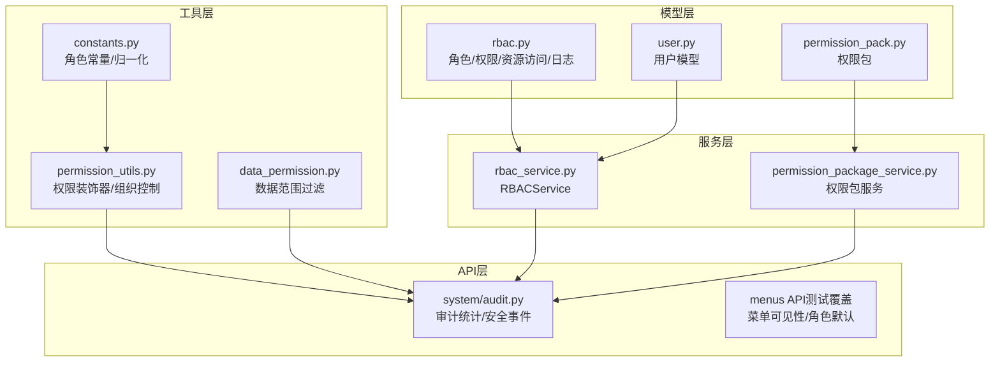
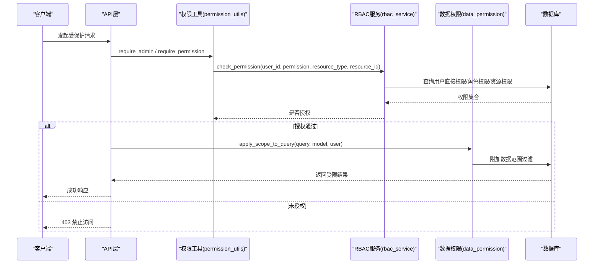
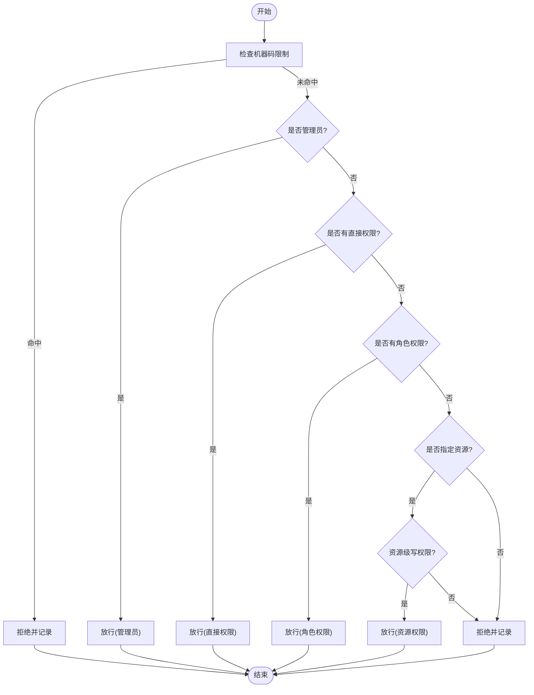
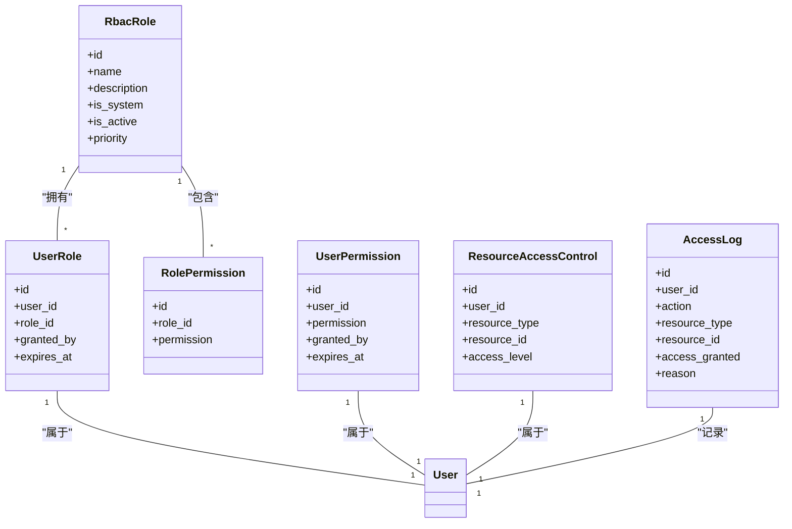
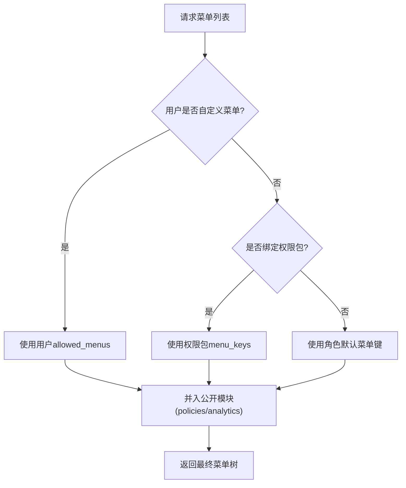
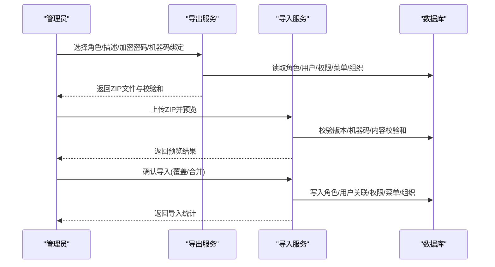
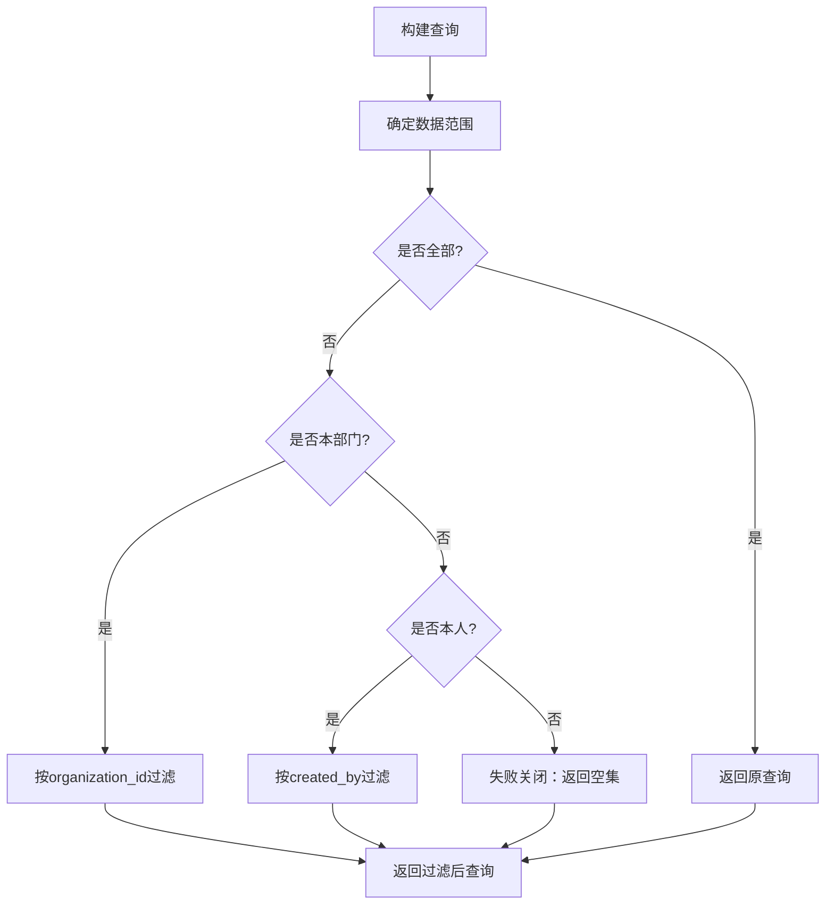
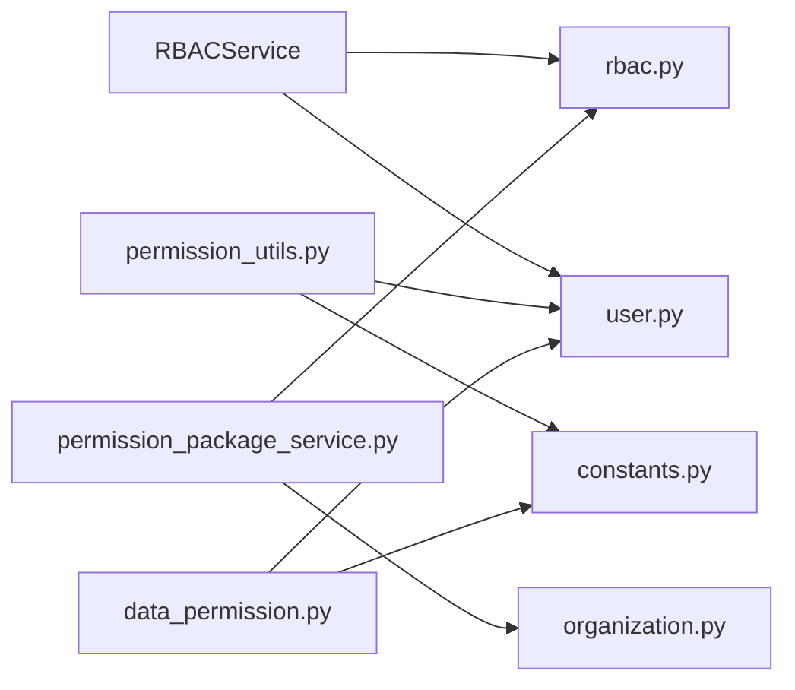

# 角色与权限管理

<cite>
**本文引用的文件**
- [backend/app/models/rbac.py](file://backend/app/models/rbac.py)
- [backend/app/models/user.py](file://backend/app/models/user.py)
- [backend/app/models/permission_pack.py](file://backend/app/models/permission_pack.py)
- [backend/app/services/rbac_service.py](file://backend/app/services/rbac_service.py)
- [backend/app/core/permission_utils.py](file://backend/app/core/permission_utils.py)
- [backend/app/core/data_permission.py](file://backend/app/core/data_permission.py)
- [backend/app/core/constants.py](file://backend/app/core/constants.py)
- [backend/app/services/permission_package_service.py](file://backend/app/services/permission_package_service.py)
- [backend/app/api/v1/system/audit.py](file://backend/app/api/v1/system/audit.py)
- [backend/tests/unit/test_menu_api_extended.py](file://backend/tests/unit/test_menu_api_extended.py)
</cite>

## 目录
1. [简介](#简介)
2. [项目结构](#项目结构)
3. [核心组件](#核心组件)
4. [架构总览](#架构总览)
5. [详细组件分析](#详细组件分析)
6. [依赖关系分析](#依赖关系分析)
7. [性能考虑](#性能考虑)
8. [故障排查指南](#故障排查指南)
9. [结论](#结论)
10. [附录](#附录)

## 简介
本操作指南面向系统管理员与实施工程师，系统性说明基于角色的访问控制（RBAC）模型在本项目中的设计与使用方法。内容涵盖：
- RBAC数据模型、权限计算流程与验证机制
- 内置角色定义与默认权限策略
- 自定义角色创建与管理（含权限分配、过期时间、优先级等）
- 菜单级、按钮级、数据级的细粒度权限控制
- 权限包的创建、配置与分发（支持加密、机器码绑定、跨机迁移）
- 数据隔离策略与安全最佳实践
- 权限审计与常见问题排查

## 项目结构
本项目在后端采用分层设计：
- 模型层：定义用户、角色、权限、资源访问控制、访问日志等实体
- 服务层：封装RBAC业务逻辑（权限检查、角色/权限分配、批量操作）
- 工具层：提供权限校验装饰器、组织边界控制、数据范围过滤
- API层：暴露权限相关接口（菜单、审计、权限包导入导出等）
- 前端：通过菜单API与指令实现页面/按钮级可见性与可操作性的控制

图表来源
- [backend/app/models/rbac.py:31-263](file://backend/app/models/rbac.py#L31-L263)
- [backend/app/models/user.py:26-152](file://backend/app/models/user.py#L26-L152)
- [backend/app/models/permission_pack.py:16-47](file://backend/app/models/permission_pack.py#L16-L47)
- [backend/app/services/rbac_service.py:104-746](file://backend/app/services/rbac_service.py#L104-L746)
- [backend/app/services/permission_package_service.py:46-985](file://backend/app/services/permission_package_service.py#L46-L985)
- [backend/app/core/permission_utils.py:17-360](file://backend/app/core/permission_utils.py#L17-L360)
- [backend/app/core/data_permission.py:20-187](file://backend/app/core/data_permission.py#L20-L187)
- [backend/app/core/constants.py:27-87](file://backend/app/core/constants.py#L27-L87)
- [backend/app/api/v1/system/audit.py:395-432](file://backend/app/api/v1/system/audit.py#L395-L432)
- [backend/tests/unit/test_menu_api_extended.py:150-689](file://backend/tests/unit/test_menu_api_extended.py#L150-L689)

章节来源
- [backend/app/models/rbac.py:31-263](file://backend/app/models/rbac.py#L31-L263)
- [backend/app/models/user.py:26-152](file://backend/app/models/user.py#L26-L152)
- [backend/app/models/permission_pack.py:16-47](file://backend/app/models/permission_pack.py#L16-L47)
- [backend/app/services/rbac_service.py:104-746](file://backend/app/services/rbac_service.py#L104-L746)
- [backend/app/core/permission_utils.py:17-360](file://backend/app/core/permission_utils.py#L17-L360)
- [backend/app/core/data_permission.py:20-187](file://backend/app/core/data_permission.py#L20-L187)
- [backend/app/core/constants.py:27-87](file://backend/app/core/constants.py#L27-L87)
- [backend/app/services/permission_package_service.py:46-985](file://backend/app/services/permission_package_service.py#L46-L985)
- [backend/app/api/v1/system/audit.py:395-432](file://backend/app/api/v1/system/audit.py#L395-L432)
- [backend/tests/unit/test_menu_api_extended.py:150-689](file://backend/tests/unit/test_menu_api_extended.py#L150-L689)

## 核心组件
- RBAC数据模型：角色、用户-角色关联、角色-权限关联、用户直接权限、资源访问控制、访问日志、机器码权限
- RBAC服务：权限检查、角色分配/撤销、权限授予/撤销（单条与批量）、用户权限聚合（含白名单与机器码限制）
- 权限工具：超级管理员/管理员判定、组织边界控制、资源权限装饰器
- 数据权限：按数据范围（全部/本部门/本人）过滤查询
- 权限包：导出/导入完整权限配置（ZIP），支持加密、机器码绑定、内容校验和
- 菜单权限：角色默认菜单、用户自定义菜单、公开模块强制可见、前端指令控制按钮可见性

章节来源
- [backend/app/models/rbac.py:31-263](file://backend/app/models/rbac.py#L31-L263)
- [backend/app/services/rbac_service.py:104-746](file://backend/app/services/rbac_service.py#L104-L746)
- [backend/app/core/permission_utils.py:17-360](file://backend/app/core/permission_utils.py#L17-L360)
- [backend/app/core/data_permission.py:20-187](file://backend/app/core/data_permission.py#L20-L187)
- [backend/app/services/permission_package_service.py:46-985](file://backend/app/services/permission_package_service.py#L46-L985)
- [backend/tests/unit/test_menu_api_extended.py:150-689](file://backend/tests/unit/test_menu_api_extended.py#L150-L689)

## 架构总览
下图展示了从请求进入、权限校验到数据过滤的完整链路，以及菜单权限与权限包在其中的作用点。

图表来源
- [backend/app/core/permission_utils.py:61-114](file://backend/app/core/permission_utils.py#L61-L114)
- [backend/app/core/permission_utils.py:272-309](file://backend/app/core/permission_utils.py#L272-L309)
- [backend/app/services/rbac_service.py:133-222](file://backend/app/services/rbac_service.py#L133-L222)
- [backend/app/core/data_permission.py:83-134](file://backend/app/core/data_permission.py#L83-L134)

## 详细组件分析

### RBAC数据模型与权限计算
- 角色与权限
  - 角色：名称、描述、是否系统内置、是否启用、优先级（越小越高）
  - 角色-权限关联：每个角色可绑定多个权限标识
  - 用户直接权限：可直接授予用户特定权限，支持过期时间
  - 用户-角色关联：支持过期时间与授权人记录
  - 资源访问控制：针对具体资源的读写删级别访问
  - 访问日志：记录每次权限检查的结果与原因
  - 机器码权限：限制特定机器上的功能权限

- 权限计算流程
  1) 先检查机器码限制（若命中则拒绝并记录）
  2) 若用户拥有管理员角色或admin:all，直接放行
  3) 检查用户直接权限
  4) 检查角色权限（仅启用且未过期的角色）
  5) 若指定了资源类型与ID，检查资源级访问权限
  6) 否则拒绝并记录“权限不足”

图表来源
- [backend/app/services/rbac_service.py:133-222](file://backend/app/services/rbac_service.py#L133-L222)
- [backend/app/models/rbac.py:110-218](file://backend/app/models/rbac.py#L110-L218)

章节来源
- [backend/app/models/rbac.py:31-263](file://backend/app/models/rbac.py#L31-L263)
- [backend/app/services/rbac_service.py:133-222](file://backend/app/services/rbac_service.py#L133-L222)

### 内置角色与默认权限
- 精简后的实用角色：super_admin、admin、user、viewer
- 历史角色兼容映射：approval_leader → admin；manager → admin；operator → user
- 默认权限策略
  - 普通用户默认具备基础读取与备份创建、数据分析读取等能力
  - 管理员具备更广泛的写入与系统管理能力
  - 超级管理员具备所有权限（admin:all）

- 菜单默认可见性
  - 不同角色拥有不同的默认菜单键集合
  - 某些模块（如政策法规、数据分析）对非管理员也可见（公开模块）
  - 管理员可通过用户级allowed_menus覆盖默认菜单

章节来源
- [backend/app/core/constants.py:27-87](file://backend/app/core/constants.py#L27-L87)
- [backend/app/services/rbac_service.py:107-127](file://backend/app/services/rbac_service.py#L107-L127)
- [backend/tests/unit/test_menu_api_extended.py:150-689](file://backend/tests/unit/test_menu_api_extended.py#L150-L689)

### 自定义角色创建与管理
- 创建角色：设置名称、描述、是否系统内置、初始权限列表
- 分配角色给用户：支持设置过期时间、授权人
- 撤销角色：删除用户-角色关联
- 权限分配：
  - 单条授予/撤销
  - 批量授予/撤销（原子保存：一次性删除旧权限+授予新权限）
- 优先级与继承：
  - 角色有优先级字段，用于排序与合并策略（由上层逻辑决定）
  - 用户可同时拥有多个角色，权限取并集（除白名单与机器码限制外）

图表来源
- [backend/app/models/rbac.py:31-218](file://backend/app/models/rbac.py#L31-L218)

章节来源
- [backend/app/services/rbac_service.py:322-586](file://backend/app/services/rbac_service.py#L322-L586)
- [backend/app/models/rbac.py:31-218](file://backend/app/models/rbac.py#L31-L218)

### 菜单权限控制机制
- 菜单可见性优先级：用户级 allowed_menus > 绑定的启用中权限包 > 角色默认菜单
- 公开模块强制可见：政策法规、数据分析等模块对非管理员也可见
- 前端按钮级控制：通过指令或权限判断隐藏/禁用按钮
- 菜单API：
  - 获取当前用户可访问菜单
  - 查看角色默认菜单键集合
  - 管理员可查询/编辑其他用户的菜单配置

图表来源
- [backend/app/models/permission_pack.py:16-47](file://backend/app/models/permission_pack.py#L16-L47)
- [backend/tests/unit/test_menu_api_extended.py:150-689](file://backend/tests/unit/test_menu_api_extended.py#L150-L689)

章节来源
- [backend/app/models/permission_pack.py:16-47](file://backend/app/models/permission_pack.py#L16-L47)
- [backend/tests/unit/test_menu_api_extended.py:150-689](file://backend/tests/unit/test_menu_api_extended.py#L150-L689)

### 权限包创建、配置与分发
- 导出：将角色、用户-角色关联、用户直接权限、用户菜单覆盖、遗留权限字段、组织信息打包为ZIP，支持可选加密与机器码绑定，生成内容校验和
- 导入预览：校验ZIP结构、版本、机器码绑定、内容校验和，返回预览信息
- 导入确认：可选择完全替换或合并模式，恢复角色、用户关联、权限、菜单与组织信息
- 安全特性：
  - 内容校验和防篡改
  - 可选Fernet整包加密
  - 机器码绑定限制导入设备
  - 异常信息脱敏，避免泄露内部细节

图表来源
- [backend/app/services/permission_package_service.py:56-298](file://backend/app/services/permission_package_service.py#L56-L298)
- [backend/app/services/permission_package_service.py:304-580](file://backend/app/services/permission_package_service.py#L304-L580)

章节来源
- [backend/app/services/permission_package_service.py:56-580](file://backend/app/services/permission_package_service.py#L56-L580)

### 权限验证机制与数据隔离策略
- 权限验证
  - 装饰器：require_admin、require_permission
  - 服务方法：check_permission（含机器码限制、管理员特权、直接/角色/资源权限）
  - 用户白名单：allowed_permissions_list与角色权限取交集
- 数据隔离
  - 数据范围：全部(all)、本部门(own_dept)、本人(own)
  - 查询过滤：apply_scope_to_query根据用户角色与组织自动附加过滤条件
  - 记录访问：check_record_access用于单条记录访问校验

图表来源
- [backend/app/core/data_permission.py:54-134](file://backend/app/core/data_permission.py#L54-L134)

章节来源
- [backend/app/core/permission_utils.py:61-114](file://backend/app/core/permission_utils.py#L61-L114)
- [backend/app/core/permission_utils.py:272-309](file://backend/app/core/permission_utils.py#L272-L309)
- [backend/app/core/data_permission.py:54-134](file://backend/app/core/data_permission.py#L54-L134)

### 安全最佳实践
- 最小权限原则：为用户仅分配必要权限，优先使用角色而非直接权限
- 白名单与机器码限制：结合allowed_permissions与机器码权限进一步收敛
- 过期时间：为临时权限与角色分配设置合理过期时间
- 审计与监控：开启访问日志与安全事件记录，定期审查
- 权限包安全：使用加密与机器码绑定，确保传输与导入安全
- 失败关闭：当模型缺少必要字段时，数据范围过滤应返回空集，避免越权

章节来源
- [backend/app/services/rbac_service.py:224-320](file://backend/app/services/rbac_service.py#L224-L320)
- [backend/app/core/data_permission.py:120-134](file://backend/app/core/data_permission.py#L120-L134)
- [backend/app/services/permission_package_service.py:235-298](file://backend/app/services/permission_package_service.py#L235-L298)

## 依赖关系分析
- RBAC服务依赖模型层：RbacRole、UserRole、RolePermission、UserPermission、ResourceAccessControl、AccessLog
- 权限工具依赖常量与用户模型：normalize_role、ADMIN_ROLES、用户属性(role/is_superuser/organization_id)
- 数据权限依赖用户模型与常量：get_data_scope、apply_scope_to_query
- 权限包服务依赖模型与组织模型：导出/导入角色、用户、权限、菜单、组织
- 菜单API依赖用户模型与权限包：解析allowed_menus与权限包menu_keys

图表来源
- [backend/app/services/rbac_service.py:18-27](file://backend/app/services/rbac_service.py#L18-L27)
- [backend/app/core/permission_utils.py:12-14](file://backend/app/core/permission_utils.py#L12-L14)
- [backend/app/core/data_permission.py:14-16](file://backend/app/core/data_permission.py#L14-L16)
- [backend/app/services/permission_package_service.py:30-37](file://backend/app/services/permission_package_service.py#L30-L37)

章节来源
- [backend/app/services/rbac_service.py:18-27](file://backend/app/services/rbac_service.py#L18-L27)
- [backend/app/core/permission_utils.py:12-14](file://backend/app/core/permission_utils.py#L12-L14)
- [backend/app/core/data_permission.py:14-16](file://backend/app/core/data_permission.py#L14-L16)
- [backend/app/services/permission_package_service.py:30-37](file://backend/app/services/permission_package_service.py#L30-L37)

## 性能考虑
- 请求级缓存：RBACService使用ContextVar缓存机器码限制权限，避免单次请求重复查询
- 批量操作：grant_permissions_batch、revoke_permissions_batch、save_permissions减少数据库往返
- 预查询去重：批量授予前预查询已存在权限，避免重复插入
- 索引优化：角色名唯一索引、用户-角色联合索引、权限联合索引提升查询效率
- 菜单解析：角色默认菜单键使用frozenset，提高集合运算性能

章节来源
- [backend/app/services/rbac_service.py:45-47](file://backend/app/services/rbac_service.py#L45-L47)
- [backend/app/services/rbac_service.py:407-454](file://backend/app/services/rbac_service.py#L407-L454)
- [backend/app/services/rbac_service.py:518-586](file://backend/app/services/rbac_service.py#L518-L586)
- [backend/app/models/rbac.py:35-37](file://backend/app/models/rbac.py#L35-L37)
- [backend/app/models/rbac.py:85-87](file://backend/app/models/rbac.py#L85-L87)
- [backend/app/models/rbac.py:114-116](file://backend/app/models/rbac.py#L114-L116)
- [backend/app/models/rbac.py:141-143](file://backend/app/models/rbac.py#L141-L143)

## 故障排查指南
- 权限不足
  - 检查用户是否拥有对应角色或直接权限
  - 检查角色是否启用且未过期
  - 检查是否存在机器码限制
  - 查看访问日志中的拒绝原因
- 菜单不可见
  - 检查用户allowed_menus是否为空数组或包含目标菜单
  - 检查是否绑定了启用的权限包且包含目标菜单
  - 检查角色默认菜单是否包含目标菜单
- 权限包导入失败
  - 检查ZIP结构与版本匹配
  - 检查机器码绑定是否允许本机导入
  - 检查内容校验和是否一致
  - 查看错误消息与警告信息
- 审计与统计
  - 使用审计统计接口查看操作趋势
  - 使用安全事件接口筛选未授权访问等事件

章节来源
- [backend/app/services/rbac_service.py:716-741](file://backend/app/services/rbac_service.py#L716-L741)
- [backend/app/api/v1/system/audit.py:395-432](file://backend/app/api/v1/system/audit.py#L395-L432)
- [backend/app/services/permission_package_service.py:304-580](file://backend/app/services/permission_package_service.py#L304-L580)
- [backend/tests/unit/test_menu_api_extended.py:150-689](file://backend/tests/unit/test_menu_api_extended.py#L150-L689)

## 结论
本系统的RBAC模型以角色为核心，结合直接权限、资源级权限与机器码限制，形成多层次、可配置的访问控制体系。通过菜单权限与数据范围过滤，实现了页面级、按钮级与数据级的细粒度控制。权限包功能支持跨机协作与批量管理，配合审计与安全机制，满足复杂场景下的权限治理需求。建议在实际使用中遵循最小权限原则，合理使用角色与白名单，并结合过期时间与审计进行持续治理。

## 附录
- 常用权限标识示例：user:read、org:write、village:export、policy:publish、backup:create、analytics:read、admin:all
- 数据范围枚举：all、own_dept、own
- 角色常量与归一化：ROLE_SUPER_ADMIN、ROLE_ADMIN、ROLE_USER、ROLE_VIEWER；normalize_role处理历史角色
- 菜单可见性规则：用户自定义 > 权限包 > 角色默认；公开模块强制可见

章节来源
- [backend/app/services/rbac_service.py:52-99](file://backend/app/services/rbac_service.py#L52-L99)
- [backend/app/core/data_permission.py:20-31](file://backend/app/core/data_permission.py#L20-L31)
- [backend/app/core/constants.py:27-87](file://backend/app/core/constants.py#L27-L87)
- [backend/tests/unit/test_menu_api_extended.py:150-689](file://backend/tests/unit/test_menu_api_extended.py#L150-L689)