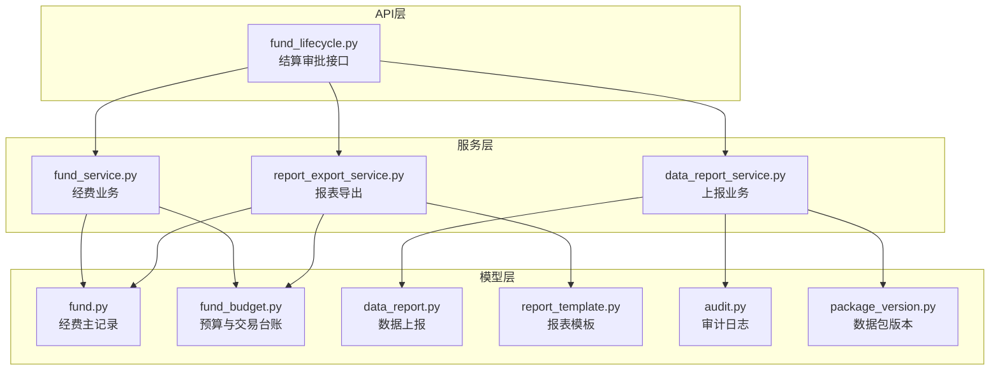
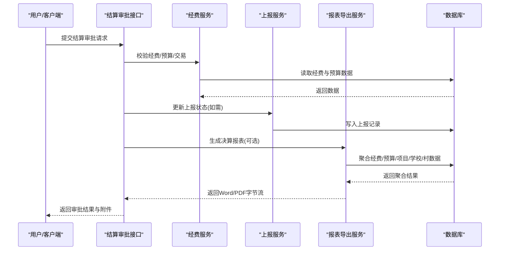
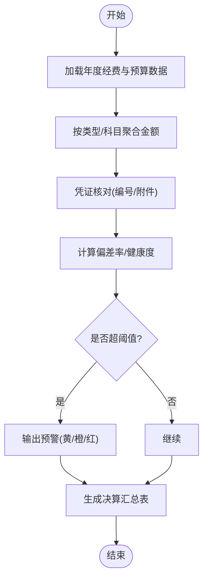
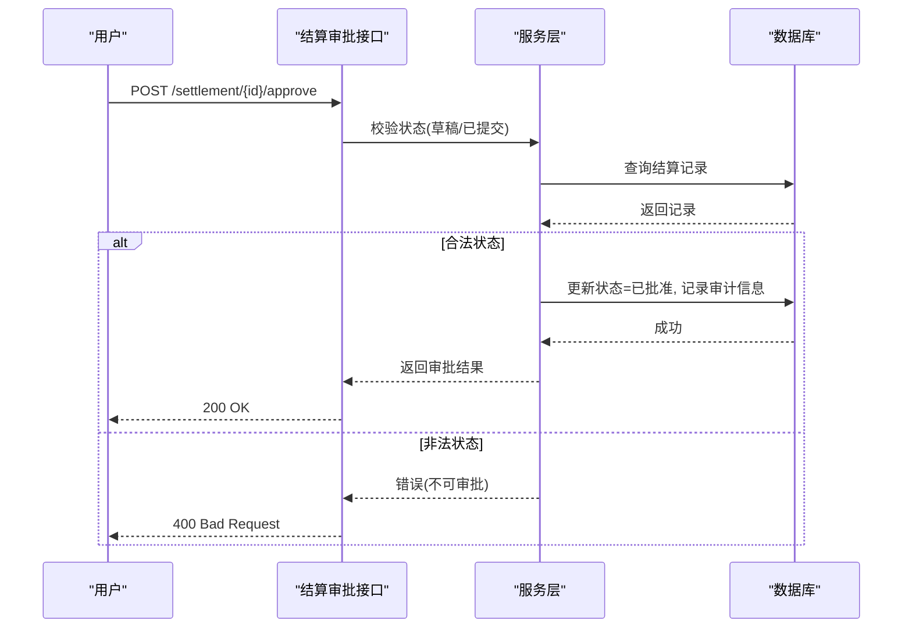
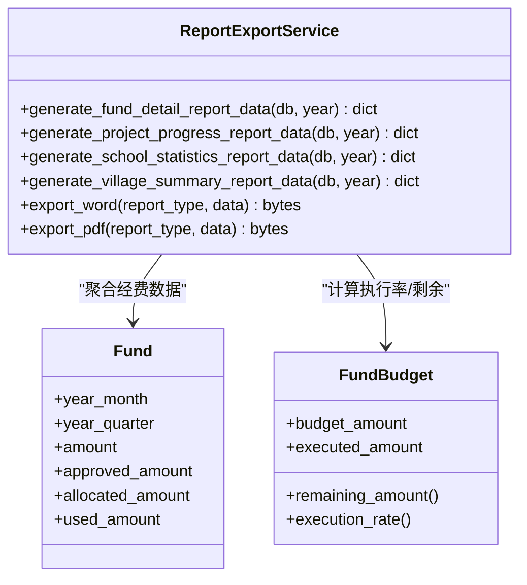
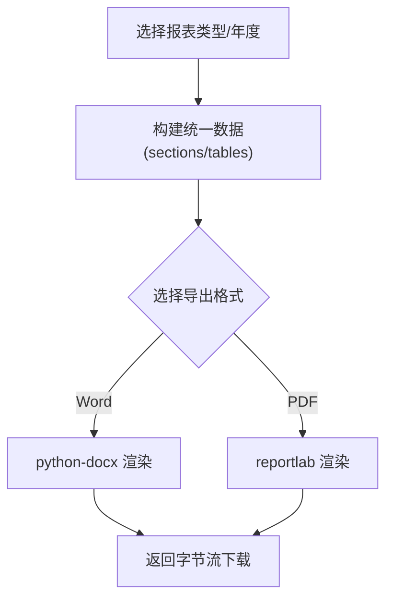
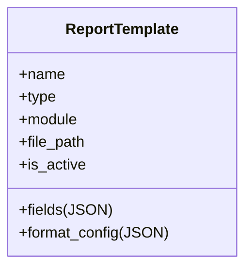
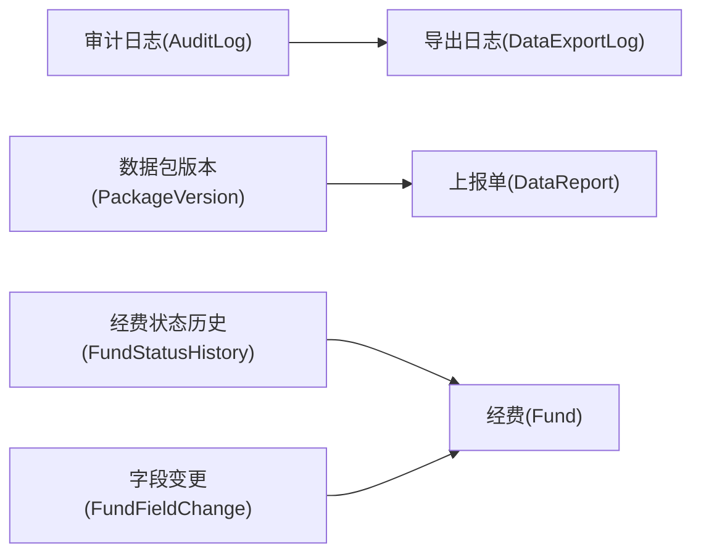
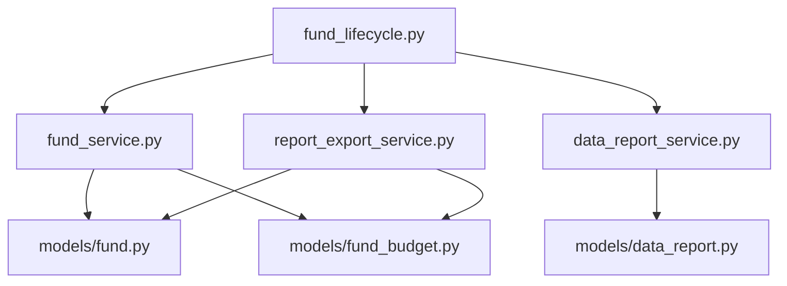

# 决算结算与报表

<cite>
**本文引用的文件**
- [backend/app/models/fund.py](file://backend/app/models/fund.py)
- [backend/app/models/fund_budget.py](file://backend/app/models/fund_budget.py)
- [backend/app/models/fund_history.py](file://backend/app/models/fund_history.py)
- [backend/app/models/data_report.py](file://backend/app/models/data_report.py)
- [backend/app/models/report_template.py](file://backend/app/models/report_template.py)
- [backend/app/models/audit.py](file://backend/app/models/audit.py)
- [backend/app/models/package_version.py](file://backend/app/models/package_version.py)
- [backend/app/services/fund_service.py](file://backend/app/services/fund_service.py)
- [backend/app/services/data_report_service.py](file://backend/app/services/data_report_service.py)
- [backend/app/services/report_export_service.py](file://backend/app/services/report_export_service.py)
- [backend/app/api/v1/fund_lifecycle.py](file://backend/app/api/v1/fund_lifecycle.py)
</cite>

## 目录
1. [简介](#简介)
2. [项目结构](#项目结构)
3. [核心组件](#核心组件)
4. [架构总览](#架构总览)
5. [详细组件分析](#详细组件分析)
6. [依赖关系分析](#依赖关系分析)
7. [性能考量](#性能考量)
8. [故障排查指南](#故障排查指南)
9. [结论](#结论)
10. [附录](#附录)

## 简介
本操作指南面向“决算结算与报表”模块，覆盖以下目标：
- 项目决算编制流程：费用汇总、凭证核对、差异分析。
- 结算审核流程：结算申请、审核确认、归档管理。
- 财务报表生成：支出明细表、预算执行表、资产统计表等。
- 数据导出：支持 Excel、PDF 等多种格式。
- 自定义报表模板与数据分析工具。
- 决算数据的审计追踪与版本管理。

## 项目结构
该模块由模型层（资金、预算、上报、模板、审计）、服务层（经费、上报、报表导出）与 API 层（生命周期/结算审批）组成，形成“数据—业务—接口”的分层架构。

**图表来源**
- [backend/app/models/fund.py:1-299](file://backend/app/models/fund.py#L1-L299)
- [backend/app/models/fund_budget.py:1-202](file://backend/app/models/fund_budget.py#L1-L202)
- [backend/app/models/data_report.py:1-141](file://backend/app/models/data_report.py#L1-L141)
- [backend/app/models/report_template.py:1-73](file://backend/app/models/report_template.py#L1-L73)
- [backend/app/models/audit.py:1-205](file://backend/app/models/audit.py#L1-L205)
- [backend/app/models/package_version.py:1-44](file://backend/app/models/package_version.py#L1-L44)
- [backend/app/services/fund_service.py:1-304](file://backend/app/services/fund_service.py#L1-L304)
- [backend/app/services/data_report_service.py:1-492](file://backend/app/services/data_report_service.py#L1-L492)
- [backend/app/services/report_export_service.py:1-448](file://backend/app/services/report_export_service.py#L1-L448)
- [backend/app/api/v1/fund_lifecycle.py:1538-1569](file://backend/app/api/v1/fund_lifecycle.py#L1538-L1569)

**章节来源**
- [backend/app/models/fund.py:1-299](file://backend/app/models/fund.py#L1-L299)
- [backend/app/services/report_export_service.py:1-448](file://backend/app/services/report_export_service.py#L1-L448)

## 核心组件
- 经费与预算：经费主记录、预算科目、交易台账、预警阈值。
- 数据上报：上报单状态机、提交/审批流转、逾期与统计。
- 报表导出：统一数据结构、Word/PDF 渲染、多类报表聚合。
- 审计与版本：审计日志、数据包版本、字段变更历史。

**章节来源**
- [backend/app/models/fund_budget.py:1-202](file://backend/app/models/fund_budget.py#L1-L202)
- [backend/app/models/data_report.py:1-141](file://backend/app/models/data_report.py#L1-L141)
- [backend/app/services/report_export_service.py:1-448](file://backend/app/services/report_export_service.py#L1-L448)
- [backend/app/models/audit.py:1-205](file://backend/app/models/audit.py#L1-L205)
- [backend/app/models/package_version.py:1-44](file://backend/app/models/package_version.py#L1-L44)

## 架构总览
决算结算与报表的整体调用链如下：前端或外部系统通过 API 发起结算审批；服务层校验并执行业务逻辑；模型层持久化数据；报表导出服务从数据库聚合数据并渲染为 Word/PDF；审计与版本记录全程留痕。

**图表来源**
- [backend/app/api/v1/fund_lifecycle.py:1538-1569](file://backend/app/api/v1/fund_lifecycle.py#L1538-L1569)
- [backend/app/services/fund_service.py:1-304](file://backend/app/services/fund_service.py#L1-L304)
- [backend/app/services/data_report_service.py:1-492](file://backend/app/services/data_report_service.py#L1-L492)
- [backend/app/services/report_export_service.py:1-448](file://backend/app/services/report_export_service.py#L1-L448)

## 详细组件分析

### 组件A：决算编制（费用汇总、凭证核对、差异分析）
- 费用汇总
  - 以年度为单位，按经费类型聚合申请金额、批准金额、拨付金额、使用金额，生成“经费执行明细表”。
  - 数据来源：经费主记录与交易台账，支持按年份过滤与分组聚合。
- 凭证核对
  - 依据交易台账的凭证编号与附件路径进行勾稽核对，确保账实相符。
- 差异分析
  - 对比预算执行额与实际使用额，计算偏差率与健康度，触发预算预警（黄/橙/红）。

**图表来源**
- [backend/app/services/report_export_service.py:90-146](file://backend/app/services/report_export_service.py#L90-L146)
- [backend/app/models/fund_budget.py:143-202](file://backend/app/models/fund_budget.py#L143-L202)
- [backend/app/models/fund.py:88-160](file://backend/app/models/fund.py#L88-L160)

**章节来源**
- [backend/app/services/report_export_service.py:90-146](file://backend/app/services/report_export_service.py#L90-L146)
- [backend/app/models/fund_budget.py:143-202](file://backend/app/models/fund_budget.py#L143-L202)
- [backend/app/models/fund.py:88-160](file://backend/app/models/fund.py#L88-L160)

### 组件B：结算审核（申请、审核确认、归档）
- 结算申请
  - 创建结算单（含项目编号、结算编号、状态），可关联数据包与上报单。
- 审核确认
  - 仅允许在草稿或已提交状态下审批；审批通过后记录审计人、审计意见与绩效评分/等级。
- 归档管理
  - 审批完成后，将决算报告与相关凭证归档，支持导出 PDF/Word 作为归档附件。

**图表来源**
- [backend/app/api/v1/fund_lifecycle.py:1538-1569](file://backend/app/api/v1/fund_lifecycle.py#L1538-L1569)

**章节来源**
- [backend/app/api/v1/fund_lifecycle.py:1538-1569](file://backend/app/api/v1/fund_lifecycle.py#L1538-L1569)

### 组件C：财务报表生成（支出明细表、预算执行表、资产统计表）
- 支出明细表
  - 按经费类型聚合笔数与金额，输出合计行。
- 预算执行表
  - 基于预算科目与执行额计算执行率，展示剩余金额与预警级别。
- 资产统计表
  - 汇总帮扶学校/村庄数量及学生/教职工规模，用于资产与资源盘点。

**图表来源**
- [backend/app/services/report_export_service.py:55-300](file://backend/app/services/report_export_service.py#L55-L300)
- [backend/app/models/fund.py:88-160](file://backend/app/models/fund.py#L88-L160)
- [backend/app/models/fund_budget.py:19-75](file://backend/app/models/fund_budget.py#L19-L75)

**章节来源**
- [backend/app/services/report_export_service.py:55-300](file://backend/app/services/report_export_service.py#L55-L300)
- [backend/app/models/fund_budget.py:19-75](file://backend/app/models/fund_budget.py#L19-L75)

### 组件D：数据导出（Excel、PDF 等）
- 导出能力
  - 支持 Word/PDF 公文报告导出；内部统一数据结构便于扩展其他格式（如 Excel）。
- 数据源
  - 经费明细、项目进度、学校统计、村庄汇总等。
- 渲染
  - Word 使用 python-docx；PDF 使用 reportlab，内置中文字体，无需额外字体文件。

**图表来源**
- [backend/app/services/report_export_service.py:318-443](file://backend/app/services/report_export_service.py#L318-L443)

**章节来源**
- [backend/app/services/report_export_service.py:318-443](file://backend/app/services/report_export_service.py#L318-L443)

### 组件E：自定义报表模板与数据分析
- 模板定义
  - 模板类型（导入/导出）、关联模块（村/校/经费/项目/综合）、字段映射 JSON、格式配置 JSON。
- 使用方式
  - 上级创建模板并分配给下级；下级下载模板填写后上传，后端解析并自动导入对应数据表。
- 数据分析
  - 结合导出报表与模板映射，实现多维度分析与可视化。

**图表来源**
- [backend/app/models/report_template.py:44-73](file://backend/app/models/report_template.py#L44-L73)

**章节来源**
- [backend/app/models/report_template.py:44-73](file://backend/app/models/report_template.py#L44-L73)

### 组件F：审计追踪与版本管理
- 审计追踪
  - 审计日志记录用户动作、资源、新旧值、请求/响应、耗时等；导出数据亦记录导出日志。
- 版本管理
  - 数据包版本记录版本号、变更记录与说明，支持回溯与比对。
- 字段变更历史
  - 经费字段变更与状态变更均被记录，便于审计与问题定位。

**图表来源**
- [backend/app/models/audit.py:53-205](file://backend/app/models/audit.py#L53-L205)
- [backend/app/models/package_version.py:15-44](file://backend/app/models/package_version.py#L15-L44)
- [backend/app/models/fund_history.py:18-159](file://backend/app/models/fund_history.py#L18-L159)
- [backend/app/models/data_report.py:29-141](file://backend/app/models/data_report.py#L29-L141)
- [backend/app/models/fund.py:129-143](file://backend/app/models/fund.py#L129-L143)

**章节来源**
- [backend/app/models/audit.py:53-205](file://backend/app/models/audit.py#L53-L205)
- [backend/app/models/package_version.py:15-44](file://backend/app/models/package_version.py#L15-L44)
- [backend/app/models/fund_history.py:18-159](file://backend/app/models/fund_history.py#L18-L159)
- [backend/app/models/data_report.py:29-141](file://backend/app/models/data_report.py#L29-L141)
- [backend/app/models/fund.py:129-143](file://backend/app/models/fund.py#L129-L143)

## 依赖关系分析
- 服务对模型的依赖
  - 经费服务依赖经费与预算模型，提供分页查询、批量状态更新等。
  - 上报服务依赖上报模型与组织服务，实现提交/审批与通知。
  - 报表导出服务依赖经费、项目、学校、村庄等模型，聚合数据并渲染。
- API 对服务的依赖
  - 结算审批接口调用经费服务与上报服务，完成状态流转与审计记录。

**图表来源**
- [backend/app/api/v1/fund_lifecycle.py:1538-1569](file://backend/app/api/v1/fund_lifecycle.py#L1538-L1569)
- [backend/app/services/fund_service.py:1-304](file://backend/app/services/fund_service.py#L1-L304)
- [backend/app/services/data_report_service.py:1-492](file://backend/app/services/data_report_service.py#L1-L492)
- [backend/app/services/report_export_service.py:1-448](file://backend/app/services/report_export_service.py#L1-L448)
- [backend/app/models/fund.py:1-299](file://backend/app/models/fund.py#L1-L299)
- [backend/app/models/fund_budget.py:1-202](file://backend/app/models/fund_budget.py#L1-L202)
- [backend/app/models/data_report.py:1-141](file://backend/app/models/data_report.py#L1-L141)

**章节来源**
- [backend/app/services/fund_service.py:1-304](file://backend/app/services/fund_service.py#L1-L304)
- [backend/app/services/data_report_service.py:1-492](file://backend/app/services/data_report_service.py#L1-L492)
- [backend/app/services/report_export_service.py:1-448](file://backend/app/services/report_export_service.py#L1-L448)

## 性能考量
- 索引优化
  - 经费表针对年/月/季度/状态/来源建立复合索引，加速聚合与筛选。
- 预加载与去重
  - 列表与详情查询使用 joinedload/selectinload 避免 N+1，并使用 unique() 防止笛卡尔积重复。
- 聚合冗余字段
  - 自动填充 year/year_month/year_quarter，减少运行时字符串处理开销。
- 批量更新
  - 批量状态更新采用 bulk update，提升大批量场景性能。

**章节来源**
- [backend/app/models/fund.py:66-86](file://backend/app/models/fund.py#L66-L86)
- [backend/app/models/fund.py:199-226](file://backend/app/models/fund.py#L199-L226)
- [backend/app/services/fund_service.py:55-93](file://backend/app/services/fund_service.py#L55-L93)
- [backend/app/services/fund_service.py:245-288](file://backend/app/services/fund_service.py#L245-L288)

## 故障排查指南
- 审批失败
  - 检查当前状态是否允许审批（仅草稿/已提交可审批），若已批准则拒绝重复审批。
- 报表为空
  - 检查年度数据是否存在；若查询异常，服务会记录警告并输出空表提示。
- 预算预警
  - 当执行率达到阈值时，系统输出预警信息，需关注并控制后续支出。
- 审计与版本
  - 通过审计日志与数据包版本快速定位问题与回滚。

**章节来源**
- [backend/app/api/v1/fund_lifecycle.py:1538-1569](file://backend/app/api/v1/fund_lifecycle.py#L1538-L1569)
- [backend/app/services/report_export_service.py:140-146](file://backend/app/services/report_export_service.py#L140-L146)
- [backend/app/models/fund_budget.py:143-202](file://backend/app/models/fund_budget.py#L143-L202)
- [backend/app/models/audit.py:53-205](file://backend/app/models/audit.py#L53-L205)

## 结论
本模块围绕“经费—预算—上报—报表—审计”的主线，提供了完整的决算编制、结算审核与报表导出能力。通过索引优化、预加载与批量更新等手段保障性能；通过审计日志与版本管理确保可追溯性与合规性。建议在实际使用中：
- 严格遵循状态机与审批规则。
- 充分利用模板与导出功能，提高报表效率。
- 定期查看预算预警与审计日志，及时纠偏。

## 附录
- 常用报表类型
  - 年度帮扶工作总结、帮扶资金拨付明细表、帮扶项目进度统计表、帮扶学校统计表、帮扶村年度汇总表、年度综合总结报告。
- 关键模型字段
  - 经费：year/year_month/year_quarter、amount/approved_amount/allocated_amount/used_amount、settlement_status、audit_*。
  - 预算：budget_amount/executed_amount、执行率与剩余金额属性。
  - 上报：status(DRAFT/SUBMITTED/APPROVED/REJECTED/CANCELLED)、deadline、submitted_at/reviewed_at。
  - 模板：type/import/export、module、fields(JSON)、format_config(JSON)。
  - 审计：AuditLog/DataExportLog/FundStatusHistory/FundFieldChange。

**章节来源**
- [backend/app/services/report_export_service.py:17-25](file://backend/app/services/report_export_service.py#L17-L25)
- [backend/app/models/fund.py:88-160](file://backend/app/models/fund.py#L88-L160)
- [backend/app/models/fund_budget.py:19-75](file://backend/app/models/fund_budget.py#L19-L75)
- [backend/app/models/data_report.py:19-141](file://backend/app/models/data_report.py#L19-L141)
- [backend/app/models/report_template.py:26-73](file://backend/app/models/report_template.py#L26-L73)
- [backend/app/models/audit.py:53-205](file://backend/app/models/audit.py#L53-L205)