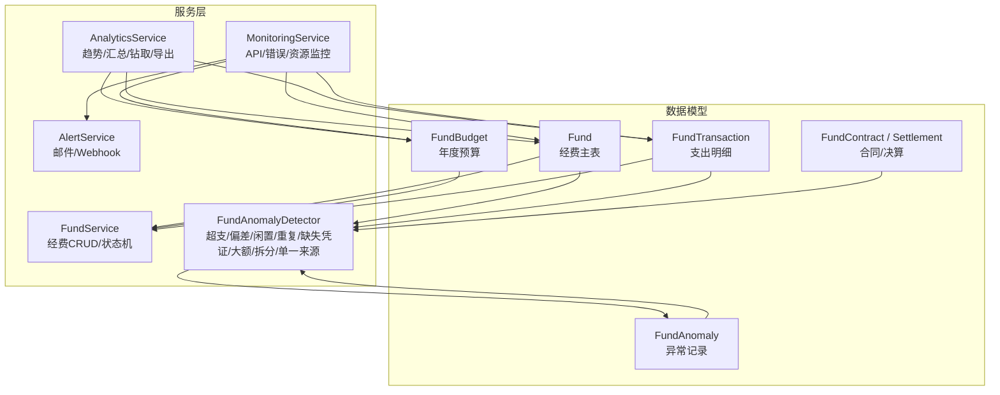
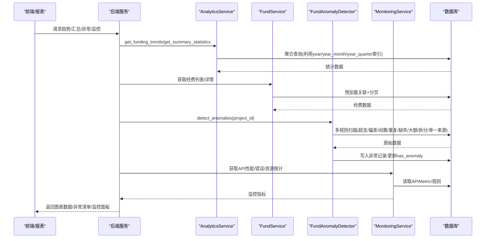
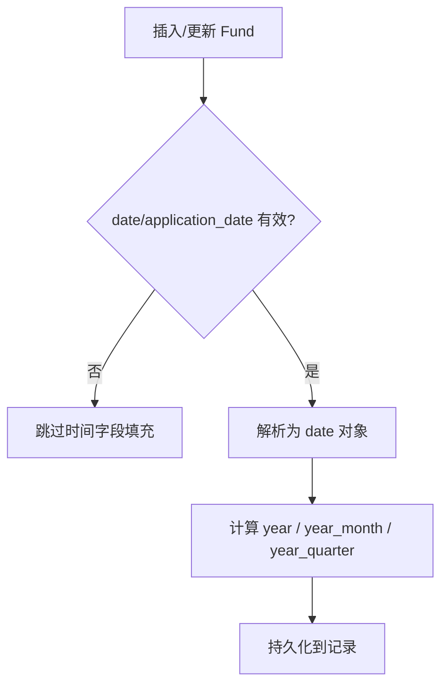
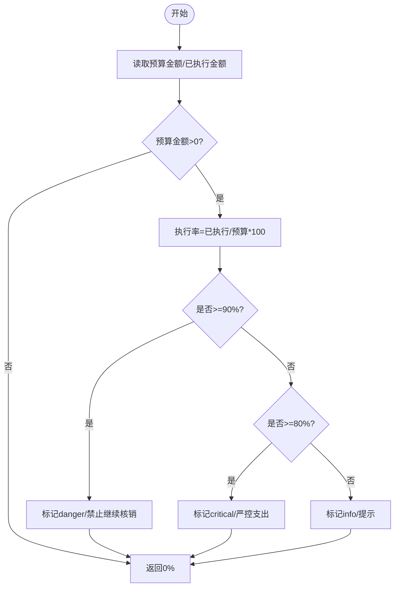
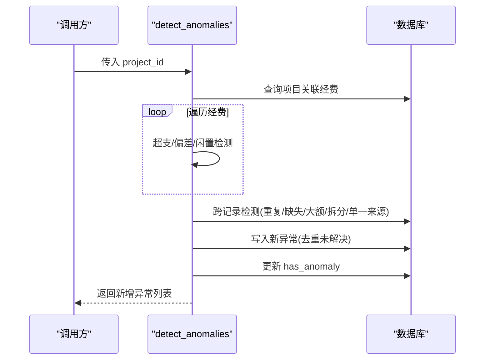
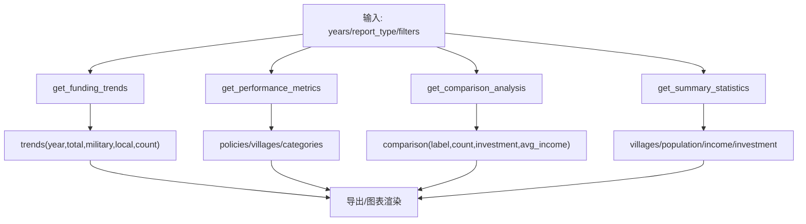
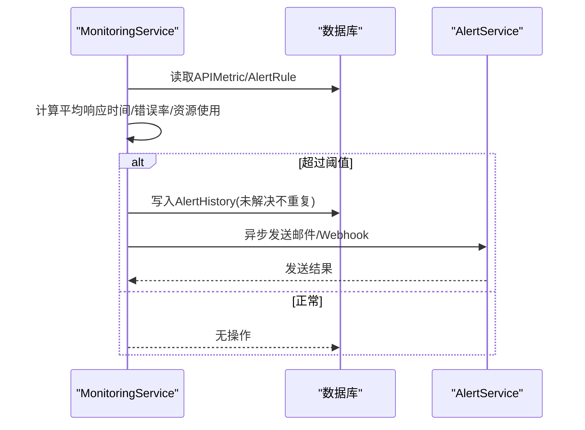
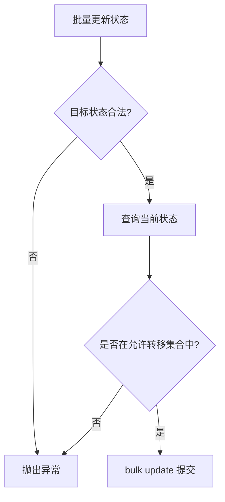
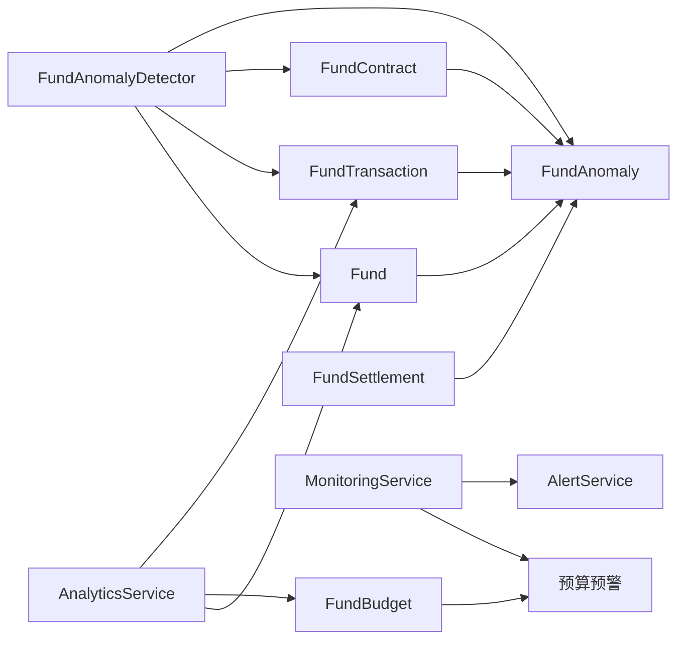

# 经费分析与监控

<cite>
**本文引用的文件**
- [backend/app/models/fund.py](file://backend/app/models/fund.py)
- [backend/app/models/fund_budget.py](file://backend/app/models/fund_budget.py)
- [backend/app/models/fund_lifecycle.py](file://backend/app/models/fund_lifecycle.py)
- [backend/app/services/fund_anomaly_detector.py](file://backend/app/services/fund_anomaly_detector.py)
- [backend/app/services/fund_service.py](file://backend/app/services/fund_service.py)
- [backend/app/services/analytics_service.py](file://backend/app/services/analytics_service.py)
- [backend/app/services/monitoring_service.py](file://backend/app/services/monitoring_service.py)
- [backend/app/services/alert_service.py](file://backend/app/services/alert_service.py)
</cite>

## 目录
1. [简介](#简介)
2. [项目结构](#项目结构)
3. [核心组件](#核心组件)
4. [架构总览](#架构总览)
5. [详细组件分析](#详细组件分析)
6. [依赖关系分析](#依赖关系分析)
7. [性能与优化](#性能与优化)
8. [故障排查指南](#故障排查指南)
9. [结论](#结论)
10. [附录：操作指南与可视化建议](#附录操作指南与可视化建议)

## 简介
本模块面向“经费使用统计分析、异常检测、实时监控与告警、可视化图表展示、自定义维度筛选、数据导出与报告生成”等能力，提供从数据模型、服务层到监控告警的完整闭环。通过预聚合字段与索引优化统计查询，结合规则化异常检测引擎与多渠道告警通知，支撑大屏与报表场景下的资金健康度评估与风险预警。

## 项目结构
围绕经费分析与监控的关键代码分布如下：
- 数据模型层：经费主表、预算与交易明细、生命周期与异常记录
- 服务层：经费业务服务、数据分析服务、异常检测服务、监控与告警服务
- 监控与告警：系统指标采集、规则检查、邮件/Webhook通知

**图示来源**
- [backend/app/models/fund.py:61-167](file://backend/app/models/fund.py#L61-L167)
- [backend/app/models/fund_budget.py:19-76](file://backend/app/models/fund_budget.py#L19-L76)
- [backend/app/models/fund_budget.py:78-141](file://backend/app/models/fund_budget.py#L78-L141)
- [backend/app/models/fund_lifecycle.py:324-362](file://backend/app/models/fund_lifecycle.py#L324-L362)
- [backend/app/services/fund_service.py:29-99](file://backend/app/services/fund_service.py#L29-L99)
- [backend/app/services/analytics_service.py:22-218](file://backend/app/services/analytics_service.py#L22-L218)
- [backend/app/services/fund_anomaly_detector.py:34-93](file://backend/app/services/fund_anomaly_detector.py#L34-L93)
- [backend/app/services/monitoring_service.py:26-155](file://backend/app/services/monitoring_service.py#L26-L155)

**章节来源**
- [backend/app/models/fund.py:61-167](file://backend/app/models/fund.py#L61-L167)
- [backend/app/models/fund_budget.py:19-141](file://backend/app/models/fund_budget.py#L19-L141)
- [backend/app/models/fund_lifecycle.py:324-362](file://backend/app/models/fund_lifecycle.py#L324-L362)
- [backend/app/services/fund_service.py:29-99](file://backend/app/services/fund_service.py#L29-L99)
- [backend/app/services/analytics_service.py:22-218](file://backend/app/services/analytics_service.py#L22-L218)
- [backend/app/services/fund_anomaly_detector.py:34-93](file://backend/app/services/fund_anomaly_detector.py#L34-L93)
- [backend/app/services/monitoring_service.py:26-155](file://backend/app/services/monitoring_service.py#L26-L155)

## 核心组件
- 经费主模型与时间聚合字段：用于高效按年/年月/季度聚合统计，避免全表扫描。
- 预算与交易明细：预算执行率计算、科目级执行跟踪。
- 异常检测引擎：覆盖超支、进度偏差、资金闲置、重复支付、缺失凭证、大额提现、合同拆分、单一来源采购等规则。
- 数据分析服务：资金趋势、绩效指标、对比分析、汇总统计、数据钻取、导出。
- 监控与告警：API性能、错误率、资源占用监控；规则触发后发送邮件或Webhook。

**章节来源**
- [backend/app/models/fund.py:156-167](file://backend/app/models/fund.py#L156-L167)
- [backend/app/models/fund_budget.py:19-76](file://backend/app/models/fund_budget.py#L19-L76)
- [backend/app/services/fund_anomaly_detector.py:34-93](file://backend/app/services/fund_anomaly_detector.py#L34-L93)
- [backend/app/services/analytics_service.py:173-218](file://backend/app/services/analytics_service.py#L173-L218)
- [backend/app/services/monitoring_service.py:26-155](file://backend/app/services/monitoring_service.py#L26-L155)

## 架构总览
经费分析与监控采用“模型-服务-监控-告警”的分层架构：
- 模型层提供经费、预算、交易、异常等实体及索引优化。
- 服务层封装统计计算、异常检测、导出与监控指标。
- 监控层采集系统指标并基于规则触发告警。
- 告警层通过邮件与Webhook进行多渠道通知。

**图示来源**
- [backend/app/services/analytics_service.py:173-218](file://backend/app/services/analytics_service.py#L173-L218)
- [backend/app/services/fund_service.py:40-99](file://backend/app/services/fund_service.py#L40-L99)
- [backend/app/services/fund_anomaly_detector.py:34-93](file://backend/app/services/fund_anomaly_detector.py#L34-L93)
- [backend/app/services/monitoring_service.py:29-155](file://backend/app/services/monitoring_service.py#L29-L155)

## 详细组件分析

### 经费主模型与时间聚合优化
- 设计要点：在插入/更新前自动填充 year、year_month、year_quarter，配合复合索引实现按年/月/季度的快速聚合。
- 关键收益：消除 GROUP BY 函数计算导致的索引失效，显著降低大屏统计查询成本。

**图示来源**
- [backend/app/models/fund.py:199-226](file://backend/app/models/fund.py#L199-L226)

**章节来源**
- [backend/app/models/fund.py:61-167](file://backend/app/models/fund.py#L61-L167)
- [backend/app/models/fund.py:199-226](file://backend/app/models/fund.py#L199-L226)

### 预算执行率与预算预警
- 预算执行率：根据已执行金额与预算金额计算百分比，支持空值保护。
- 预算预警阈值：80%（提醒）、90%（警告）、100%（禁止线），对接近或超过阈值的预算生成预警信息。

**图示来源**
- [backend/app/models/fund_budget.py:63-73](file://backend/app/models/fund_budget.py#L63-L73)
- [backend/app/models/fund_budget.py:145-201](file://backend/app/models/fund_budget.py#L145-L201)

**章节来源**
- [backend/app/models/fund_budget.py:19-76](file://backend/app/models/fund_budget.py#L19-L76)
- [backend/app/models/fund_budget.py:145-201](file://backend/app/models/fund_budget.py#L145-L201)

### 异常检测引擎（超支预警、异常交易识别、风险指标）
- 规则覆盖：超支、进度偏差、资金闲置、重复支付、缺失凭证、大额提现、合同拆分、单一来源采购。
- 处理流程：对指定项目运行全部规则，去重写入异常记录，并更新经费的 has_anomaly 标志。

**图示来源**
- [backend/app/services/fund_anomaly_detector.py:34-93](file://backend/app/services/fund_anomaly_detector.py#L34-L93)
- [backend/app/services/fund_anomaly_detector.py:99-315](file://backend/app/services/fund_anomaly_detector.py#L99-L315)

**章节来源**
- [backend/app/services/fund_anomaly_detector.py:34-93](file://backend/app/services/fund_anomaly_detector.py#L34-L93)
- [backend/app/services/fund_anomaly_detector.py:99-315](file://backend/app/services/fund_anomaly_detector.py#L99-L315)
- [backend/app/models/fund_lifecycle.py:324-362](file://backend/app/models/fund_lifecycle.py#L324-L362)

### 数据分析服务（趋势、效率评估、钻取、导出）
- 资金趋势：按年份聚合军地资金总额与村数，支持近N年趋势。
- 绩效指标：政策发布、示范村、分类投资等。
- 对比分析：按省份/梯队对比投资与收入。
- 汇总统计：综合帮扶村特征、人口、收入、产业/基建/教育投资。
- 数据导出：将汇总数据导出为Excel字节流。

**图示来源**
- [backend/app/services/analytics_service.py:173-218](file://backend/app/services/analytics_service.py#L173-L218)
- [backend/app/services/analytics_service.py:220-385](file://backend/app/services/analytics_service.py#L220-L385)
- [backend/app/services/analytics_service.py:511-703](file://backend/app/services/analytics_service.py#L511-L703)

**章节来源**
- [backend/app/services/analytics_service.py:173-218](file://backend/app/services/analytics_service.py#L173-L218)
- [backend/app/services/analytics_service.py:220-385](file://backend/app/services/analytics_service.py#L220-L385)
- [backend/app/services/analytics_service.py:511-703](file://backend/app/services/analytics_service.py#L511-L703)

### 监控与告警（实时仪表盘与通知）
- 监控指标：API响应时间、错误率、端点统计、系统资源(CPU/内存/磁盘)。
- 规则检查：按配置的时间窗口与阈值检查指标，触发告警。
- 告警通知：异步发送电子邮件或Webhook，支持多种类型。

**图示来源**
- [backend/app/services/monitoring_service.py:29-155](file://backend/app/services/monitoring_service.py#L29-L155)
- [backend/app/services/monitoring_service.py:183-312](file://backend/app/services/monitoring_service.py#L183-L312)
- [backend/app/services/alert_service.py:20-111](file://backend/app/services/alert_service.py#L20-L111)

**章节来源**
- [backend/app/services/monitoring_service.py:29-155](file://backend/app/services/monitoring_service.py#L29-L155)
- [backend/app/services/monitoring_service.py:183-312](file://backend/app/services/monitoring_service.py#L183-L312)
- [backend/app/services/alert_service.py:20-111](file://backend/app/services/alert_service.py#L20-L111)

### 经费业务服务（列表、详情、状态机）
- 列表与详情：使用预加载与分页，避免N+1问题。
- 状态机：严格校验状态流转，批量更新时整体拒绝非法流转。
- 编号生成：ZJ+年份+6位流水，保证唯一性。

**图示来源**
- [backend/app/services/fund_service.py:245-288](file://backend/app/services/fund_service.py#L245-L288)

**章节来源**
- [backend/app/services/fund_service.py:40-99](file://backend/app/services/fund_service.py#L40-L99)
- [backend/app/services/fund_service.py:114-185](file://backend/app/services/fund_service.py#L114-L185)
- [backend/app/services/fund_service.py:245-288](file://backend/app/services/fund_service.py#L245-L288)

## 依赖关系分析
- 模型依赖：Fund 与 FundBudget/FundTransaction 形成预算-执行-明细的闭环；生命周期模型提供异常、合同、决算等扩展。
- 服务依赖：AnalyticsService 依赖模型进行聚合；FundAnomalyDetector 依赖生命周期模型记录异常；MonitoringService 依赖监控指标与规则。
- 外部集成：AlertService 通过SMTP与HTTP Webhook对外通知。

**图示来源**
- [backend/app/models/fund.py:61-167](file://backend/app/models/fund.py#L61-L167)
- [backend/app/models/fund_budget.py:19-141](file://backend/app/models/fund_budget.py#L19-L141)
- [backend/app/models/fund_lifecycle.py:324-362](file://backend/app/models/fund_lifecycle.py#L324-L362)
- [backend/app/services/analytics_service.py:173-218](file://backend/app/services/analytics_service.py#L173-L218)
- [backend/app/services/fund_anomaly_detector.py:34-93](file://backend/app/services/fund_anomaly_detector.py#L34-L93)
- [backend/app/services/monitoring_service.py:29-155](file://backend/app/services/monitoring_service.py#L29-L155)
- [backend/app/services/alert_service.py:20-111](file://backend/app/services/alert_service.py#L20-L111)

**章节来源**
- [backend/app/models/fund.py:61-167](file://backend/app/models/fund.py#L61-L167)
- [backend/app/models/fund_budget.py:19-141](file://backend/app/models/fund_budget.py#L19-L141)
- [backend/app/models/fund_lifecycle.py:324-362](file://backend/app/models/fund_lifecycle.py#L324-L362)
- [backend/app/services/analytics_service.py:173-218](file://backend/app/services/analytics_service.py#L173-L218)
- [backend/app/services/fund_anomaly_detector.py:34-93](file://backend/app/services/fund_anomaly_detector.py#L34-L93)
- [backend/app/services/monitoring_service.py:29-155](file://backend/app/services/monitoring_service.py#L29-L155)
- [backend/app/services/alert_service.py:20-111](file://backend/app/services/alert_service.py#L20-L111)

## 性能与优化
- 时间聚合冗余字段与复合索引：year、year_month、year_quarter 直接命中索引，避免函数计算导致的全表扫描。
- 预加载与分页：列表查询使用 joinedload/selectinload 与独立 count 语句，减少 N+1 与额外开销。
- 批量更新：使用 bulk update 提升状态变更性能。
- 监控指标采样：按小时窗口聚合，限制返回数量，降低查询压力。

**章节来源**
- [backend/app/models/fund.py:66-86](file://backend/app/models/fund.py#L66-L86)
- [backend/app/services/fund_service.py:55-99](file://backend/app/services/fund_service.py#L55-L99)
- [backend/app/services/monitoring_service.py:86-128](file://backend/app/services/monitoring_service.py#L86-L128)

## 故障排查指南
- 预算执行率为零或异常：检查预算金额是否为0或负数，以及已执行金额是否正确累计。
- 异常检测未触发：确认项目是否存在关联经费与交易；检查阈值配置与时间窗口；核对 has_anomaly 标志更新逻辑。
- 告警未送达：检查 SMTP/Webhook 配置是否完整；查看后台任务是否成功创建；确认网络连通性与认证信息。
- 统计查询缓慢：确认 year/year_month/year_quarter 字段已正确填充；验证复合索引是否存在且被使用。

**章节来源**
- [backend/app/models/fund_budget.py:63-73](file://backend/app/models/fund_budget.py#L63-L73)
- [backend/app/services/fund_anomaly_detector.py:34-93](file://backend/app/services/fund_anomaly_detector.py#L34-L93)
- [backend/app/services/monitoring_service.py:183-312](file://backend/app/services/monitoring_service.py#L183-L312)
- [backend/app/services/alert_service.py:20-111](file://backend/app/services/alert_service.py#L20-L111)

## 结论
本模块以“模型优化+规则引擎+监控告警”为核心，构建了完整的经费分析与监控体系。通过时间聚合与索引优化保障统计性能，借助多维度异常检测实现风险前置，结合多渠道告警确保及时处置。同时提供丰富的可视化与导出能力，满足大屏与报表需求。

## 附录：操作指南与可视化建议
- 支出趋势分析
  - 使用资金趋势接口获取近N年军地资金总额与村数，绘制折线图观察增长/波动。
  - 参考路径：[backend/app/services/analytics_service.py:173-218](file://backend/app/services/analytics_service.py#L173-L218)
- 预算执行率计算
  - 基于预算与已执行金额计算执行率，设置80%/90%/100%阈值，生成柱状图与预警标签。
  - 参考路径：[backend/app/models/fund_budget.py:63-73](file://backend/app/models/fund_budget.py#L63-L73)、[backend/app/models/fund_budget.py:145-201](file://backend/app/models/fund_budget.py#L145-L201)
- 资金使用效率评估
  - 结合绩效指标与分类投资，评估各科目投入产出比，使用饼图展示结构占比。
  - 参考路径：[backend/app/services/analytics_service.py:220-287](file://backend/app/services/analytics_service.py#L220-L287)
- 自定义分析维度与筛选条件
  - 支持按省份、梯队、部门、区域、三区三州、重点县等多维筛选，并进行分页与总数统计。
  - 参考路径：[backend/app/services/analytics_service.py:600-683](file://backend/app/services/analytics_service.py#L600-L683)
- 实时监控仪表盘与告警通知
  - 展示API响应时间、错误率、端点统计与系统资源；规则触发后发送邮件/Webhook。
  - 参考路径：[backend/app/services/monitoring_service.py:29-155](file://backend/app/services/monitoring_service.py#L29-L155)、[backend/app/services/monitoring_service.py:183-312](file://backend/app/services/monitoring_service.py#L183-L312)、[backend/app/services/alert_service.py:20-111](file://backend/app/services/alert_service.py#L20-L111)
- 数据导出与报告生成
  - 汇总统计与基础指标导出为Excel；支持综合/村庄资金/政策执行等报告类型。
  - 参考路径：[backend/app/services/analytics_service.py:343-385](file://backend/app/services/analytics_service.py#L343-L385)、[backend/app/services/analytics_service.py:685-703](file://backend/app/services/analytics_service.py#L685-L703)