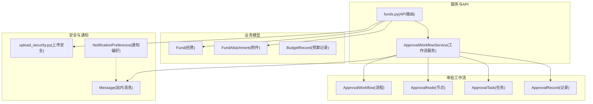
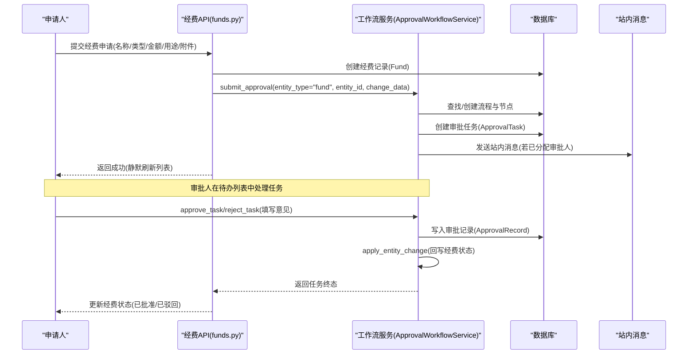
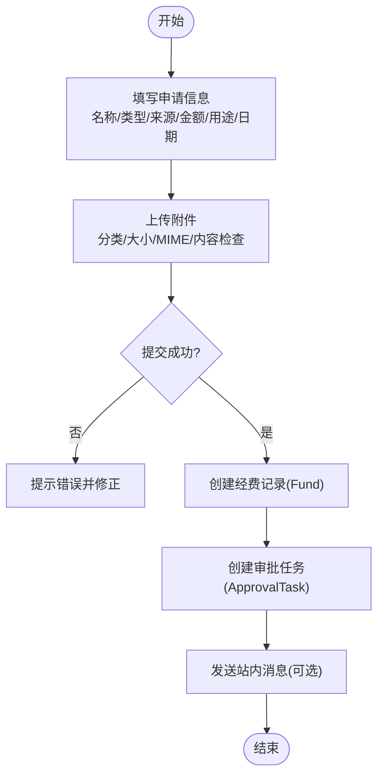
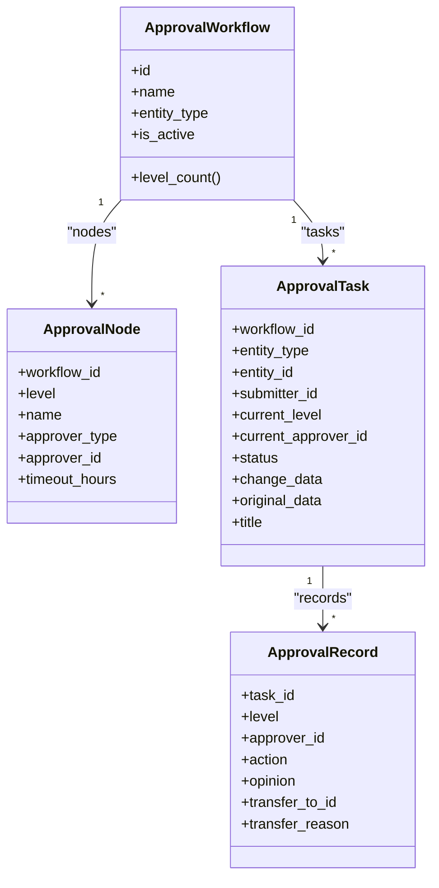
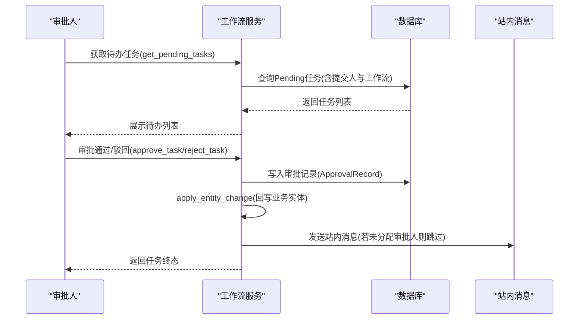
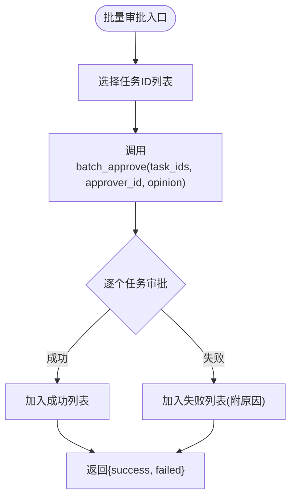
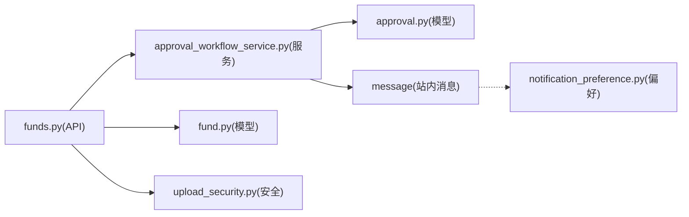

# 经费申请与审批

<cite>
**本文引用的文件**
- [backend/app/models/fund.py](file://backend/app/models/fund.py)
- [backend/app/models/approval.py](file://backend/app/models/approval.py)
- [backend/app/services/approval_workflow_service.py](file://backend/app/services/approval_workflow_service.py)
- [backend/app/api/v1/funds.py](file://backend/app/api/v1/funds.py)
- [backend/app/schemas/fund.py](file://backend/app/schemas/fund.py)
- [backend/app/core/upload_security.py](file://backend/app/core/upload_security.py)
- [backend/app/models/notification_preference.py](file://backend/app/models/notification_preference.py)
- [docs/02-用户手册/经费管理模块操作说明.md](file://docs/02-用户手册/经费管理模块操作说明.md)
</cite>

## 目录
1. [简介](#简介)
2. [项目结构](#项目结构)
3. [核心组件](#核心组件)
4. [架构总览](#架构总览)
5. [详细组件分析](#详细组件分析)
6. [依赖关系分析](#依赖关系分析)
7. [性能考虑](#性能考虑)
8. [故障排查指南](#故障排查指南)
9. [结论](#结论)
10. [附录](#附录)

## 简介
本指南面向“经费申请与审批”模块的操作与实现，覆盖从申请提交流程、附件上传、申请类型选择，到多级审批（初审、复审、终审）、状态跟踪与通知、快速审批与批量审批、历史记录与意见管理，以及权限控制与数据安全保护等关键能力。文档既提供业务操作步骤说明，也给出后端数据模型、服务与API的对应关系，帮助使用者与开发者全面理解系统行为。

## 项目结构
该模块由“业务模型 + 工作流服务 + API路由 + 安全与通知”构成：
- 业务模型：经费记录、附件、预算记录等
- 审批工作流：流程配置、节点、任务、记录
- API路由：经费创建、状态流转、附件上传、审批闭环
- 安全与通知：上传校验、通知偏好、站内消息

图表来源
- [backend/app/models/fund.py:61-167](file://backend/app/models/fund.py#L61-L167)
- [backend/app/models/approval.py:53-199](file://backend/app/models/approval.py#L53-L199)
- [backend/app/services/approval_workflow_service.py:30-278](file://backend/app/services/approval_workflow_service.py#L30-L278)
- [backend/app/api/v1/funds.py:75-203](file://backend/app/api/v1/funds.py#L75-L203)
- [backend/app/core/upload_security.py:19-127](file://backend/app/core/upload_security.py#L19-L127)
- [backend/app/models/notification_preference.py:17-132](file://backend/app/models/notification_preference.py#L17-L132)

章节来源
- [backend/app/models/fund.py:61-167](file://backend/app/models/fund.py#L61-L167)
- [backend/app/models/approval.py:53-199](file://backend/app/models/approval.py#L53-L199)
- [backend/app/services/approval_workflow_service.py:30-278](file://backend/app/services/approval_workflow_service.py#L30-L278)
- [backend/app/api/v1/funds.py:75-203](file://backend/app/api/v1/funds.py#L75-L203)
- [backend/app/core/upload_security.py:19-127](file://backend/app/core/upload_security.py#L19-L127)
- [backend/app/models/notification_preference.py:17-132](file://backend/app/models/notification_preference.py#L17-L132)

## 核心组件
- 经费模型与字段：包含金额、状态、日期、组织归属、生命周期与风控字段，并自动填充统计聚合字段以优化查询。
- 审批工作流模型：支持最多5级审批节点，可配置按用户或角色审批；任务记录变更前后数据，记录每次审批意见与时间。
- 审批工作流服务：负责提交审批、推进级别、通过/驳回、转交、批量审批、历史查询、重试回写等。
- 经费API：提供经费CRUD、状态流转（审批通过/驳回、拨付、开始使用、完成、审计）、附件上传、与审批任务的闭环联动。
- 上传安全：白名单扩展名、MIME校验、大小限制、内容安全检查。
- 通知偏好：邮件、站内消息、推送三类通道的开关配置。

章节来源
- [backend/app/models/fund.py:30-167](file://backend/app/models/fund.py#L30-L167)
- [backend/app/models/approval.py:29-291](file://backend/app/models/approval.py#L29-L291)
- [backend/app/services/approval_workflow_service.py:30-800](file://backend/app/services/approval_workflow_service.py#L30-L800)
- [backend/app/api/v1/funds.py:211-400](file://backend/app/api/v1/funds.py#L211-L400)
- [backend/app/core/upload_security.py:19-127](file://backend/app/core/upload_security.py#L19-L127)
- [backend/app/models/notification_preference.py:17-132](file://backend/app/models/notification_preference.py#L17-L132)

## 架构总览
经费申请与审批的整体流程如下：
- 前端提交经费申请（含类型、金额、用途、附件等）
- 后端创建经费记录并自动创建审批任务（若无活跃流程则自动创建默认单节点流程）
- 审批人处理待办任务（通过/驳回/转交），系统推进至下一节点或结束
- 审批终态触发业务实体状态回写（如 pending → approved/rejected）
- 同时生成站内消息通知当前审批人或提交人
- 后续拨付、使用、完成、审计等状态在经费模块内独立流转

图表来源
- [backend/app/api/v1/funds.py:75-203](file://backend/app/api/v1/funds.py#L75-L203)
- [backend/app/services/approval_workflow_service.py:203-278](file://backend/app/services/approval_workflow_service.py#L203-L278)
- [backend/app/services/approval_workflow_service.py:447-539](file://backend/app/services/approval_workflow_service.py#L447-L539)

## 详细组件分析

### 经费申请提交流程
- 申请信息填写：包括名称、类型、来源、金额、用途、经办人、接收人、起止日期等，支持关联项目、帮扶村、学校。
- 附件上传：支持合同、发票、收据、报告等分类，受上传安全策略约束（扩展名白名单、MIME校验、大小限制、内容安全检查）。
- 申请类型选择：支持项目经费、运营经费、教育帮扶、基础设施、应急经费、其他。
- 提交后自动进入“待审批”，并创建审批任务；如无活跃流程则自动创建默认单节点流程。

图表来源
- [backend/app/models/fund.py:88-167](file://backend/app/models/fund.py#L88-L167)
- [backend/app/core/upload_security.py:19-127](file://backend/app/core/upload_security.py#L19-L127)
- [backend/app/services/approval_workflow_service.py:203-278](file://backend/app/services/approval_workflow_service.py#L203-L278)

章节来源
- [backend/app/models/fund.py:88-167](file://backend/app/models/fund.py#L88-L167)
- [backend/app/core/upload_security.py:19-127](file://backend/app/core/upload_security.py#L19-L127)
- [backend/app/services/approval_workflow_service.py:203-278](file://backend/app/services/approval_workflow_service.py#L203-L278)
- [docs/02-用户手册/经费管理模块操作说明.md:57-63](file://docs/02-用户手册/经费管理模块操作说明.md#L57-L63)

### 多级审批流程（初审、复审、终审）
- 流程配置：支持最多5级审批节点，每级可指定具体用户或角色；节点可设置超时时间。
- 任务推进：通过当前级别后自动推进到下一级；最后一级通过后标记为已通过。
- 角色解析：当节点类型为角色时，系统解析为具体用户（单机版解析为管理员）。
- 回写机制：审批终态（通过/驳回）会调用业务模块注册的处理器，将业务实体状态同步更新。

图表来源
- [backend/app/models/approval.py:53-199](file://backend/app/models/approval.py#L53-L199)

章节来源
- [backend/app/models/approval.py:53-199](file://backend/app/models/approval.py#L53-L199)
- [backend/app/services/approval_workflow_service.py:76-198](file://backend/app/services/approval_workflow_service.py#L76-L198)
- [backend/app/services/approval_workflow_service.py:447-539](file://backend/app/services/approval_workflow_service.py#L447-L539)

### 审批状态跟踪与通知机制
- 状态跟踪：任务状态包含待审批、已通过、已拒绝、已撤回；支持按实体类型、状态、提交人、时间范围筛选与分页。
- 通知机制：提交审批任务时，若已分配审批人，则创建站内消息；用户可在通知偏好中配置是否接收审批类通知。
- 历史查看：支持获取审批历史记录与任务变更对比，便于追溯审批意见与数据变化。

图表来源
- [backend/app/services/approval_workflow_service.py:318-422](file://backend/app/services/approval_workflow_service.py#L318-L422)
- [backend/app/services/approval_workflow_service.py:447-539](file://backend/app/services/approval_workflow_service.py#L447-L539)
- [backend/app/models/notification_preference.py:17-132](file://backend/app/models/notification_preference.py#L17-L132)

章节来源
- [backend/app/services/approval_workflow_service.py:318-422](file://backend/app/services/approval_workflow_service.py#L318-L422)
- [backend/app/services/approval_workflow_service.py:447-539](file://backend/app/services/approval_workflow_service.py#L447-L539)
- [backend/app/models/notification_preference.py:17-132](file://backend/app/models/notification_preference.py#L17-L132)

### 快速审批与批量审批
- 快速审批：在经费详情页可直接对“待审批”状态的经费执行批准或驳回，系统将同步完结关联的审批任务，形成闭环。
- 批量审批：支持对多个待办任务进行批量同意，每个任务独立事务，单个失败不影响其余任务。
- 自动批量通过：提供一键通过所有待审批任务的能力（单机模式常用）。

图表来源
- [backend/app/services/approval_workflow_service.py:706-753](file://backend/app/services/approval_workflow_service.py#L706-L753)
- [backend/app/api/v1/funds.py:865-892](file://backend/app/api/v1/funds.py#L865-L892)

章节来源
- [backend/app/services/approval_workflow_service.py:706-753](file://backend/app/services/approval_workflow_service.py#L706-L753)
- [backend/app/api/v1/funds.py:865-892](file://backend/app/api/v1/funds.py#L865-L892)

### 审批历史记录与意见管理
- 历史记录：支持按实体类型、实体ID、提交人、状态过滤，返回审批记录列表（含审批人、操作、意见、时间）。
- 意见管理：每次审批操作均记录意见；重新提交被驳回的任务会新增“重新提交”动作，避免显示旧的驳回原因。
- 变更对比：提供任务变更对比（变更前后数据），便于审查差异。

章节来源
- [backend/app/services/approval_workflow_service.py:759-800](file://backend/app/services/approval_workflow_service.py#L759-L800)
- [backend/app/services/approval_workflow_service.py:582-625](file://backend/app/services/approval_workflow_service.py#L582-L625)

### 审批权限控制与数据安全保护
- 权限控制：
  - 数据权限隔离：通过统一的数据范围适配器，基于组织树展开进行过滤，确保不同组织间数据不可见。
  - 角色控制：普通用户(user)可完整操作经费全流程；viewer仅只读；管理员可编辑所有经费。
  - 资源访问控制：RBAC模型支持用户权限与资源访问控制表。
- 数据安全：
  - 上传安全：扩展名白名单、MIME类型校验、文件大小限制、内容安全检查（禁止可执行与脚本特征）。
  - 软删除与审计：经费记录支持软删除标记；状态变更写入历史，保证审计可追溯。
  - 通知偏好：用户可配置邮件、站内消息、推送三类通知的开关，减少无关打扰。

章节来源
- [backend/app/api/v1/funds.py:345-352](file://backend/app/api/v1/funds.py#L345-L352)
- [backend/app/core/upload_security.py:19-127](file://backend/app/core/upload_security.py#L19-L127)
- [backend/app/models/notification_preference.py:17-132](file://backend/app/models/notification_preference.py#L17-L132)
- [docs/02-用户手册/经费管理模块操作说明.md:88-110](file://docs/02-用户手册/经费管理模块操作说明.md#L88-L110)

## 依赖关系分析
- 经费API依赖工作流服务进行审批任务创建与推进；工作流服务依赖审批模型（流程、节点、任务、记录）。
- 经费API在审批终态时调用工作流服务的回写处理器，将业务实体状态同步更新。
- 上传功能依赖上传安全模块进行校验；通知依赖站内消息模型与通知偏好。

图表来源
- [backend/app/api/v1/funds.py:75-203](file://backend/app/api/v1/funds.py#L75-L203)
- [backend/app/services/approval_workflow_service.py:30-278](file://backend/app/services/approval_workflow_service.py#L30-L278)
- [backend/app/models/approval.py:53-199](file://backend/app/models/approval.py#L53-L199)
- [backend/app/models/fund.py:61-167](file://backend/app/models/fund.py#L61-L167)
- [backend/app/core/upload_security.py:19-127](file://backend/app/core/upload_security.py#L19-L127)
- [backend/app/models/notification_preference.py:17-132](file://backend/app/models/notification_preference.py#L17-L132)

章节来源
- [backend/app/api/v1/funds.py:75-203](file://backend/app/api/v1/funds.py#L75-L203)
- [backend/app/services/approval_workflow_service.py:30-278](file://backend/app/services/approval_workflow_service.py#L30-L278)
- [backend/app/models/approval.py:53-199](file://backend/app/models/approval.py#L53-L199)
- [backend/app/models/fund.py:61-167](file://backend/app/models/fund.py#L61-L167)
- [backend/app/core/upload_security.py:19-127](file://backend/app/core/upload_security.py#L19-L127)
- [backend/app/models/notification_preference.py:17-132](file://backend/app/models/notification_preference.py#L17-L132)

## 性能考虑
- 索引优化：经费模型针对状态、类型、来源、项目、村庄、日期及复合条件建立索引，提升常见过滤与聚合查询性能。
- 聚合冗余字段：自动填充年份、年月、年季度字段，替代运行时函数计算，直接命中索引进行分组统计。
- 预加载与N+1规避：列表查询使用selectinload预加载关联对象，避免逐行触发额外查询。
- 批量与独立事务：批量审批采用独立事务处理，单个失败不影响整体，提高鲁棒性。

章节来源
- [backend/app/models/fund.py:66-86](file://backend/app/models/fund.py#L66-L86)
- [backend/app/models/fund.py:199-226](file://backend/app/models/fund.py#L199-L226)
- [backend/app/api/v1/funds.py:380-389](file://backend/app/api/v1/funds.py#L380-L389)
- [backend/app/services/approval_workflow_service.py:727-753](file://backend/app/services/approval_workflow_service.py#L727-L753)

## 故障排查指南
- 审批任务未分配审批人：
  - 现象：提交审批后无站内消息推送。
  - 原因：节点为角色且解析失败，或流程未配置审批人。
  - 处理：检查流程节点配置；单机模式下任何登录用户可审批未分配任务。
- 审批终态回写失败：
  - 现象：任务状态为“已通过_apply_failed”。
  - 原因：业务实体不存在或回写逻辑异常。
  - 处理：使用重试接口恢复终态；检查业务实体是否存在与权限。
- 附件上传失败：
  - 现象：提示不允许的文件类型或文件过大。
  - 原因：扩展名不在白名单、MIME不匹配、超过大小限制、内容安全检查失败。
  - 处理：调整文件格式与大小；确认内容不含可执行或脚本特征。
- 通知未收到：
  - 现象：审批任务未推送站内消息。
  - 原因：通知偏好关闭或消息模块不可用。
  - 处理：检查用户通知偏好；确认消息模块可用。

章节来源
- [backend/app/services/approval_workflow_service.py:253-277](file://backend/app/services/approval_workflow_service.py#L253-L277)
- [backend/app/services/approval_workflow_service.py:541-566](file://backend/app/services/approval_workflow_service.py#L541-L566)
- [backend/app/core/upload_security.py:87-127](file://backend/app/core/upload_security.py#L87-L127)
- [backend/app/models/notification_preference.py:62-111](file://backend/app/models/notification_preference.py#L62-L111)

## 结论
本模块以“经费模型 + 审批工作流 + API路由 + 安全与通知”为核心，实现了从申请、审批到拨付、使用、完成、审计的全生命周期管理。通过多级审批、状态跟踪、通知机制、快速与批量审批、历史记录与意见管理，以及严格的权限与安全控制，保障了业务流程的规范性与数据的安全性。建议在实际使用中结合组织策略配置流程节点与通知偏好，充分利用索引与预加载优化查询性能，并通过重试机制保障审批终态一致性。

## 附录
- 用户操作参考：详见“经费管理模块操作说明”，涵盖列表、详情、工作流操作、附件管理、统计分析、报表导出等。
- 数据模型参考：经费模型、审批模型、通知偏好模型定义与字段说明。
- API参考：经费API路由与服务方法，用于集成与自动化处理。

章节来源
- [docs/02-用户手册/经费管理模块操作说明.md:1-283](file://docs/02-用户手册/经费管理模块操作说明.md#L1-L283)
- [backend/app/models/fund.py:61-167](file://backend/app/models/fund.py#L61-L167)
- [backend/app/models/approval.py:53-291](file://backend/app/models/approval.py#L53-L291)
- [backend/app/models/notification_preference.py:17-132](file://backend/app/models/notification_preference.py#L17-L132)