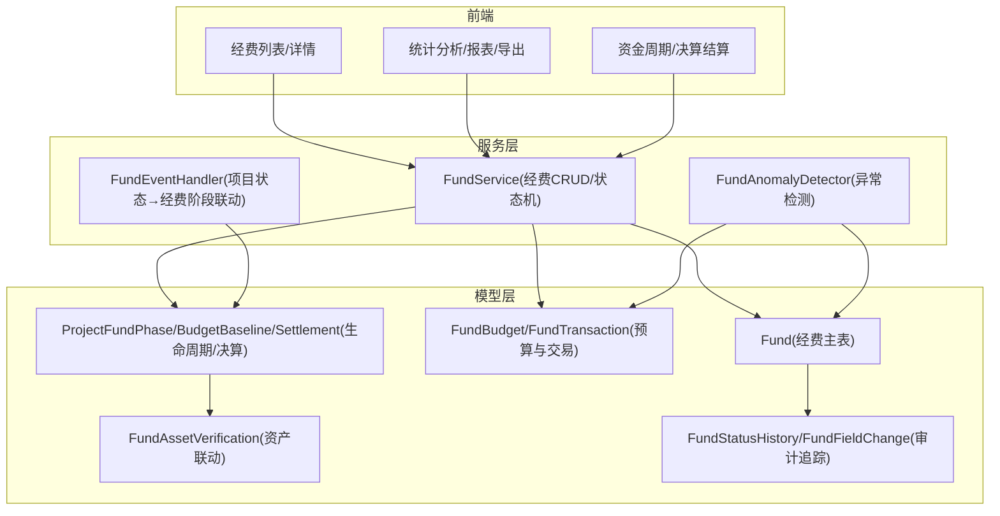
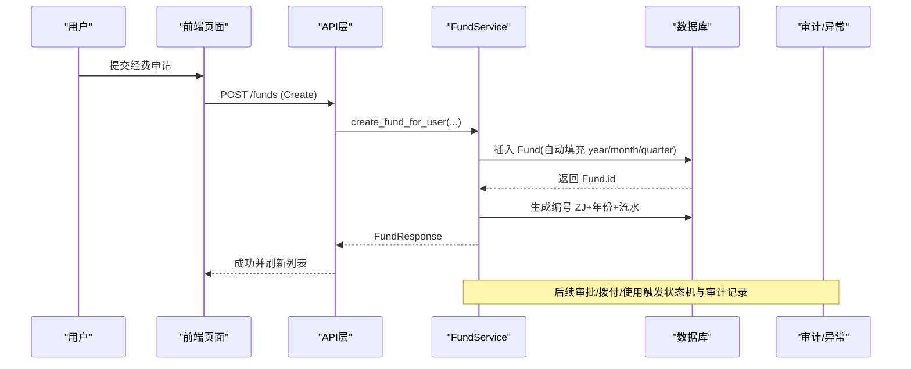
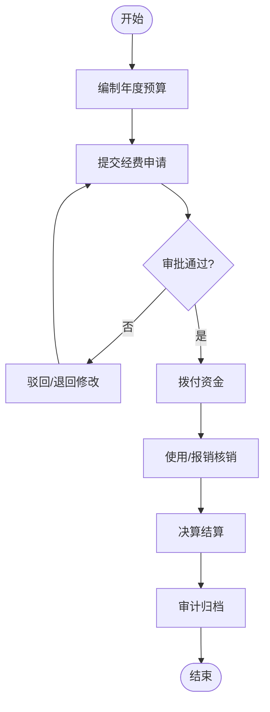
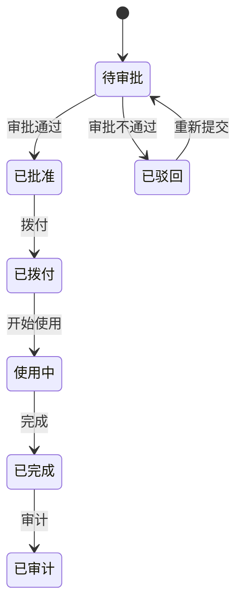
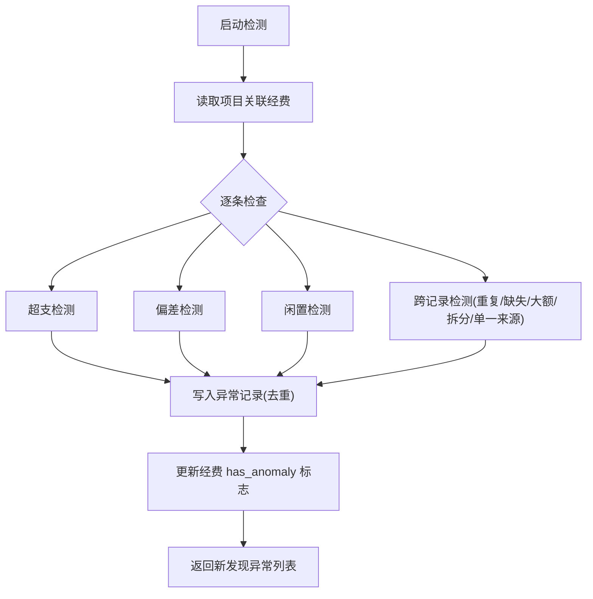
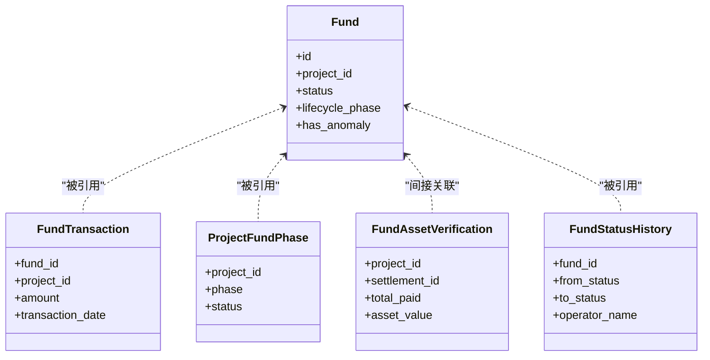

# 经费管理操作指南

<cite>
**本文引用的文件**
- [backend/app/models/fund.py](file://backend/app/models/fund.py)
- [backend/app/models/fund_budget.py](file://backend/app/models/fund_budget.py)
- [backend/app/models/fund_lifecycle.py](file://backend/app/models/fund_lifecycle.py)
- [backend/app/models/fund_asset_verification.py](file://backend/app/models/fund_asset_verification.py)
- [backend/app/models/fund_history.py](file://backend/app/models/fund_history.py)
- [backend/app/schemas/fund.py](file://backend/app/schemas/fund.py)
- [backend/app/services/fund_service.py](file://backend/app/services/fund_service.py)
- [backend/app/services/fund_anomaly_detector.py](file://backend/app/services/fund_anomaly_detector.py)
- [backend/app/services/fund_event_handler.py](file://backend/app/services/fund_event_handler.py)
- [docs/02-用户手册/经费管理模块操作说明.md](file://docs/02-用户手册/经费管理模块操作说明.md)
</cite>

## 目录
1. [简介](#简介)
2. [项目结构](#项目结构)
3. [核心组件](#核心组件)
4. [架构总览](#架构总览)
5. [详细组件分析](#详细组件分析)
6. [依赖关系分析](#依赖关系分析)
7. [性能与合规](#性能与合规)
8. [故障排查](#故障排查)
9. [结论](#结论)
10. [附录：常用流程与数据模型](#附录常用流程与数据模型)

## 简介
本指南面向经费管理人员、审批人员与审计人员，提供从“预算编制—资金申请—拨付审批—使用执行—决算结算—归档审计”的完整操作说明。内容覆盖：
- 经费项目的创建与管理（含预算编制、资金申请、拨付审批）
- 经费状态跟踪与生命周期管理
- 财务报表生成与数据导出
- 资产登记、盘点与处置联动校验
- 经费分析工具（支出统计、趋势分析、异常检测）
- 与项目管理的关联与数据同步机制
- 合规要求与审计追踪

## 项目结构
后端围绕“模型层—服务层—API层—前端页面”分层组织。经费管理相关的关键代码位于：
- 模型层：定义经费主表、预算与交易明细、生命周期阶段、资产联动校验、历史记录等
- 服务层：封装业务逻辑（创建/更新/批量状态流转）、异常检测、事件联动
- API层：对外暴露经费全生命周期接口（不在本文展开）
- 前端：列表、详情、统计分析、报表、导出、资金周期与决算结算页面

图表来源
- [backend/app/models/fund.py:61-167](file://backend/app/models/fund.py#L61-L167)
- [backend/app/models/fund_budget.py:19-141](file://backend/app/models/fund_budget.py#L19-L141)
- [backend/app/models/fund_lifecycle.py:119-449](file://backend/app/models/fund_lifecycle.py#L119-L449)
- [backend/app/models/fund_asset_verification.py:22-60](file://backend/app/models/fund_asset_verification.py#L22-L60)
- [backend/app/models/fund_history.py:18-159](file://backend/app/models/fund_history.py#L18-L159)
- [backend/app/services/fund_service.py:29-288](file://backend/app/services/fund_service.py#L29-L288)
- [backend/app/services/fund_anomaly_detector.py:34-93](file://backend/app/services/fund_anomaly_detector.py#L34-L93)
- [backend/app/services/fund_event_handler.py:27-80](file://backend/app/services/fund_event_handler.py#L27-L80)

章节来源
- [docs/02-用户手册/经费管理模块操作说明.md:1-283](file://docs/02-用户手册/经费管理模块操作说明.md#L1-L283)

## 核心组件
- 经费主记录（Fund）：承载经费基本信息、金额字段、状态、生命周期阶段、健康度与异常标记、时间聚合冗余字段（year/year_month/year_quarter）以优化统计查询
- 预算与交易（FundBudget/FundTransaction）：年度预算科目与执行明细，支持预算预警阈值控制
- 生命周期（ProjectFundPhase/BudgetBaseline/Settlement）：七阶段跟踪、基线锁定、决算与绩效
- 资产联动（FundAssetVerification）：已付款与转固资产价值比对，作为销号前置条件
- 审计追踪（FundStatusHistory/FundFieldChange/FundOperationLog）：状态变更、字段变更、附件操作留痕
- 服务层（FundService/FundAnomalyDetector/FundEventHandler）：状态机、异常检测、项目状态到经费阶段的联动

章节来源
- [backend/app/models/fund.py:30-167](file://backend/app/models/fund.py#L30-L167)
- [backend/app/models/fund_budget.py:19-202](file://backend/app/models/fund_budget.py#L19-L202)
- [backend/app/models/fund_lifecycle.py:24-449](file://backend/app/models/fund_lifecycle.py#L24-L449)
- [backend/app/models/fund_asset_verification.py:22-60](file://backend/app/models/fund_asset_verification.py#L22-L60)
- [backend/app/models/fund_history.py:18-159](file://backend/app/models/fund_history.py#L18-L159)
- [backend/app/services/fund_service.py:29-288](file://backend/app/services/fund_service.py#L29-L288)
- [backend/app/services/fund_anomaly_detector.py:34-93](file://backend/app/services/fund_anomaly_detector.py#L34-L93)
- [backend/app/services/fund_event_handler.py:27-80](file://backend/app/services/fund_event_handler.py#L27-L80)

## 架构总览
经费管理采用“领域模型 + 服务编排”的分层架构：
- 模型层通过索引与冗余字段提升统计与查询性能
- 服务层实现状态机、异常检测、事件联动，保证业务一致性与可追溯性
- 前端提供可视化工作流、统计分析与报表导出

图表来源
- [backend/app/services/fund_service.py:132-185](file://backend/app/services/fund_service.py#L132-L185)
- [backend/app/models/fund.py:199-226](file://backend/app/models/fund.py#L199-L226)

## 详细组件分析

### 经费项目创建与管理（预算编制、资金申请、拨付审批）
- 预算编制
  - 在年度维度按科目设置预算金额，系统计算执行率并触发预警（黄/橙/红）
  - 超支禁止：达到100%时禁止继续核销
- 资金申请
  - 普通用户可在“经费申请”页提交申请；系统自动生成编号与基础信息
  - 默认状态为待审批，进入审批中心
- 拨付审批
  - 管理员或具备权限的用户进行审批；通过后进入拨付环节
  - 拨付后状态流转至使用中，支持分批使用与报销核销

图表来源
- [backend/app/models/fund_budget.py:143-202](file://backend/app/models/fund_budget.py#L143-L202)
- [docs/02-用户手册/经费管理模块操作说明.md:25-109](file://docs/02-用户手册/经费管理模块操作说明.md#L25-L109)

章节来源
- [backend/app/models/fund_budget.py:19-202](file://backend/app/models/fund_budget.py#L19-L202)
- [backend/app/services/fund_service.py:132-185](file://backend/app/services/fund_service.py#L132-L185)
- [docs/02-用户手册/经费管理模块操作说明.md:25-109](file://docs/02-用户手册/经费管理模块操作说明.md#L25-L109)

### 经费状态跟踪与生命周期管理
- 状态机
  - 合法流转：pending→planned/approved/rejected；approved→allocated/rejected；allocated→in_use；in_use→completed；completed→audited
  - 批量状态更新会校验当前状态与目标状态的合法性，任一非法则整体拒绝
- 生命周期七阶段
  - 论证立项→汇总审核→计划下达与资金拨付→对接与资金划转→组织实施与过程监管→核查督查与效益评估→常态监管与项目决算
  - 项目状态变更时自动推进对应经费阶段，并同步更新经费记录的 lifecycle_phase

图表来源
- [backend/app/services/fund_service.py:230-288](file://backend/app/services/fund_service.py#L230-L288)
- [backend/app/models/fund_lifecycle.py:24-54](file://backend/app/models/fund_lifecycle.py#L24-L54)

章节来源
- [backend/app/services/fund_service.py:230-288](file://backend/app/services/fund_service.py#L230-L288)
- [backend/app/models/fund_lifecycle.py:119-154](file://backend/app/models/fund_lifecycle.py#L119-L154)
- [backend/app/services/fund_event_handler.py:27-80](file://backend/app/services/fund_event_handler.py#L27-L80)

### 财务报表生成与数据导出
- 报表生成
  - 支持月度/季度/年度报表，包含数据表格、统计汇总、类型分布图、使用趋势图
- 数据导出
  - 支持CSV/Excel/PDF导出；CSV带BOM头，可直接用Excel打开中文不乱码
  - 导出前提供数据预览，支持按类型、状态筛选与字段选择

章节来源
- [docs/02-用户手册/经费管理模块操作说明.md:158-208](file://docs/02-用户手册/经费管理模块操作说明.md#L158-L208)

### 资产登记、盘点与处置管理
- 资产联动校验
  - 项目完工后自动比对“已付款总额”与“转固资产价值”，差异率纳入校验结果
  - 校验未通过或未完成将影响项目销号
- 决算结算
  - 决算单包含总预算、总支出、总结余、绩效评分与等级，支持审批与意见记录

章节来源
- [backend/app/models/fund_asset_verification.py:22-60](file://backend/app/models/fund_asset_verification.py#L22-L60)
- [backend/app/models/fund_lifecycle.py:364-409](file://backend/app/models/fund_lifecycle.py#L364-L409)

### 经费分析工具（支出统计、趋势分析、异常检测）
- 统计分析
  - 多维度切换：时间、类型、来源、状态；展示分布饼图、利用率柱状图、年度对比图与明细表
- 异常检测规则
  - 超支、进度偏差、资金闲置、重复支付、缺失凭证、大额提现、合同拆分、单一来源采购
  - 检测结果写入异常表，并更新经费的 has_anomaly 标志

图表来源
- [backend/app/services/fund_anomaly_detector.py:34-93](file://backend/app/services/fund_anomaly_detector.py#L34-L93)
- [backend/app/services/fund_anomaly_detector.py:99-315](file://backend/app/services/fund_anomaly_detector.py#L99-L315)

章节来源
- [docs/02-用户手册/经费管理模块操作说明.md:132-155](file://docs/02-用户手册/经费管理模块操作说明.md#L132-L155)
- [backend/app/services/fund_anomaly_detector.py:34-93](file://backend/app/services/fund_anomaly_detector.py#L34-L93)

### 与项目管理的关联关系与数据同步机制
- 关联关系
  - 经费记录通过 project_id 与项目关联；交易明细也支持 project_id 维度统计
- 数据同步
  - 项目状态变更时，自动推进经费生命周期阶段，并同步更新经费的 lifecycle_phase
  - 预算基线在阶段2锁定，用于后续偏差与决算对比

章节来源
- [backend/app/models/fund.py:104-110](file://backend/app/models/fund.py#L104-L110)
- [backend/app/models/fund_budget.py:91-127](file://backend/app/models/fund_budget.py#L91-L127)
- [backend/app/models/fund_lifecycle.py:156-189](file://backend/app/models/fund_lifecycle.py#L156-L189)
- [backend/app/services/fund_event_handler.py:27-80](file://backend/app/services/fund_event_handler.py#L27-L80)

### 合规要求与审计追踪
- 审计追踪
  - 状态变更历史：记录 from_status→to_status、操作人、时间、备注
  - 字段变更记录：记录字段名、旧值、新值、修改人、时间
  - 操作日志：记录附件上传/删除等操作细节
- 合规要点
  - 预算超支禁止线（100%）
  - 异常检测与处理闭环（未解决异常标记）
  - 资产联动校验作为销号前置条件

章节来源
- [backend/app/models/fund_history.py:18-159](file://backend/app/models/fund_history.py#L18-L159)
- [backend/app/models/fund_budget.py:143-202](file://backend/app/models/fund_budget.py#L143-L202)
- [backend/app/models/fund_asset_verification.py:22-60](file://backend/app/models/fund_asset_verification.py#L22-L60)

## 依赖关系分析
- 模型间依赖
  - Fund 与 Project/Village/School/Organization 存在外键关联
  - FundTransaction 与 Fund/Budget/Project/Village 关联
  - Lifecycle 各表与 Fund/Project 关联
  - Asset Verification 与 Project/Settlement 关联
- 服务依赖
  - FundService 依赖 Fund 模型与事务工具
  - AnomalyDetector 依赖 Fund/FundTransaction/FundAnomaly
  - EventHandler 依赖 ProjectFundPhase/Fund

图表来源
- [backend/app/models/fund.py:61-167](file://backend/app/models/fund.py#L61-L167)
- [backend/app/models/fund_budget.py:78-141](file://backend/app/models/fund_budget.py#L78-L141)
- [backend/app/models/fund_lifecycle.py:119-154](file://backend/app/models/fund_lifecycle.py#L119-L154)
- [backend/app/models/fund_asset_verification.py:22-60](file://backend/app/models/fund_asset_verification.py#L22-L60)
- [backend/app/models/fund_history.py:18-63](file://backend/app/models/fund_history.py#L18-L63)

## 性能与合规
- 性能优化
  - 统计聚合冗余字段（year/year_month/year_quarter）配合复合索引，避免全表扫描
  - 列表查询使用 joinedload/selectinload 预加载，减少 N+1 问题
  - 批量状态更新使用 bulk update，提升性能
- 合规与风控
  - 预算执行率阈值预警与超支禁止
  - 异常检测规则持续运行，未解决异常标记经费
  - 资产联动校验保障销号合规

章节来源
- [backend/app/models/fund.py:66-86](file://backend/app/models/fund.py#L66-L86)
- [backend/app/models/fund.py:156-161](file://backend/app/models/fund.py#L156-L161)
- [backend/app/services/fund_service.py:40-99](file://backend/app/services/fund_service.py#L40-L99)
- [backend/app/services/fund_service.py:245-288](file://backend/app/services/fund_service.py#L245-L288)
- [backend/app/models/fund_budget.py:143-202](file://backend/app/models/fund_budget.py#L143-L202)
- [backend/app/services/fund_anomaly_detector.py:34-93](file://backend/app/services/fund_anomaly_detector.py#L34-L93)

## 故障排查
- 常见问题
  - 看不到工作流按钮：确认角色权限（viewer 只读，user 及以上可见）
  - 附件上传失败：检查文件类型是否在支持列表
  - CSV 乱码：后端导出含 BOM 头，建议使用 Excel 导入 UTF-8
  - 统计数据不一致：点击“查询”刷新最新数据
- 定位建议
  - 查看异常检测记录与 has_anomaly 标志
  - 核对预算执行率与预警阈值
  - 检查资产联动校验是否通过

章节来源
- [docs/02-用户手册/经费管理模块操作说明.md:255-273](file://docs/02-用户手册/经费管理模块操作说明.md#L255-L273)
- [backend/app/services/fund_anomaly_detector.py:34-93](file://backend/app/services/fund_anomaly_detector.py#L34-L93)

## 结论
本指南基于代码库中的模型与服务实现，系统化梳理了经费管理的全流程操作与后台能力。通过状态机、生命周期、异常检测与资产联动校验，确保经费管理在合规、可追溯与高性能的前提下运行。结合统计分析、报表与导出功能，满足日常管理与决策需求。

## 附录：常用流程与数据模型

### 经费状态机与生命周期映射
- 状态机：pending→planned/approved/rejected→allocated→in_use→completed→audited
- 生命周期：七阶段跟踪，项目状态变更自动推进

章节来源
- [backend/app/services/fund_service.py:230-288](file://backend/app/services/fund_service.py#L230-L288)
- [backend/app/models/fund_lifecycle.py:24-54](file://backend/app/models/fund_lifecycle.py#L24-L54)

### 预算预警与禁止线
- 80% 提醒、90% 警告、100% 禁止继续核销

章节来源
- [backend/app/models/fund_budget.py:143-202](file://backend/app/models/fund_budget.py#L143-L202)

### 异常检测规则清单
- 超支、偏差、闲置、重复支付、缺失凭证、大额提现、合同拆分、单一来源采购

章节来源
- [backend/app/services/fund_anomaly_detector.py:99-315](file://backend/app/services/fund_anomaly_detector.py#L99-L315)

### 资产联动校验
- 已付款总额 vs 转固资产价值，差异率纳入校验结果，作为销号前置条件

章节来源
- [backend/app/models/fund_asset_verification.py:22-60](file://backend/app/models/fund_asset_verification.py#L22-L60)