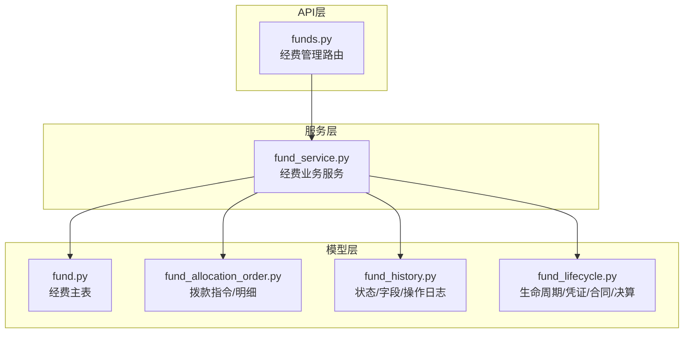
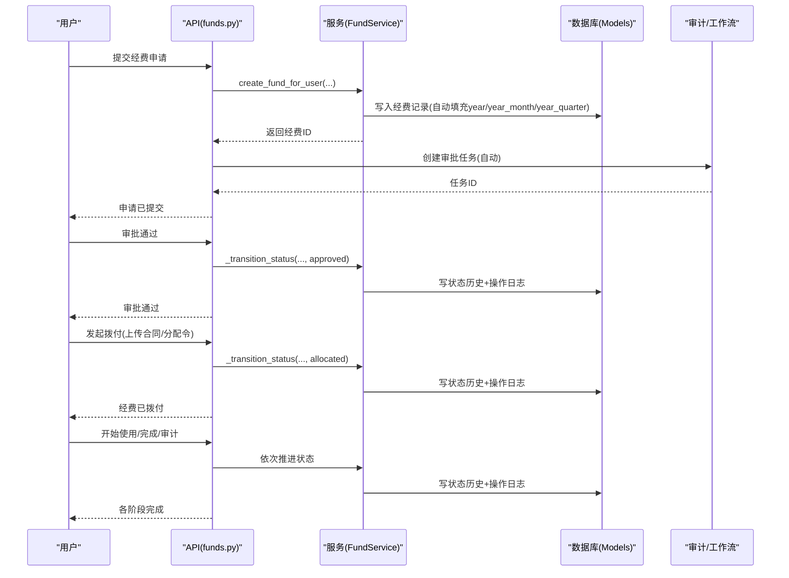
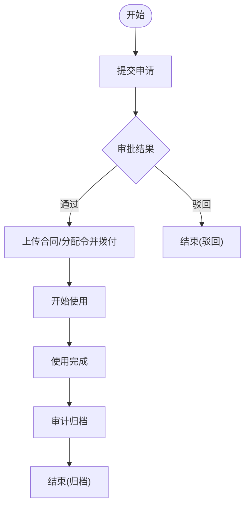
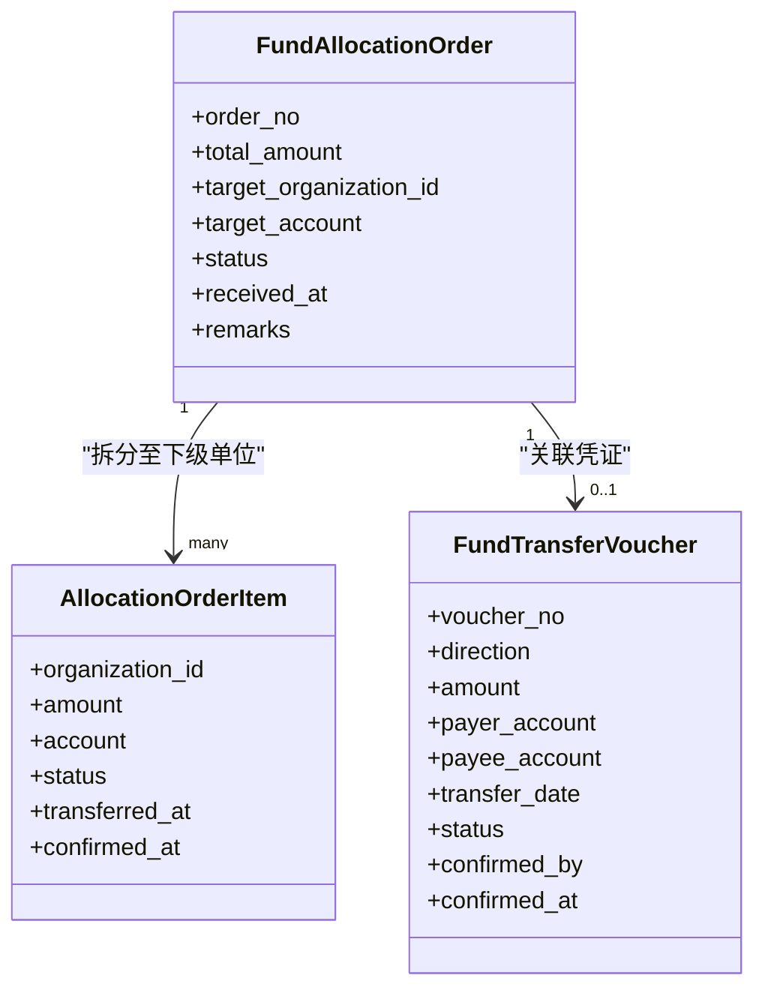
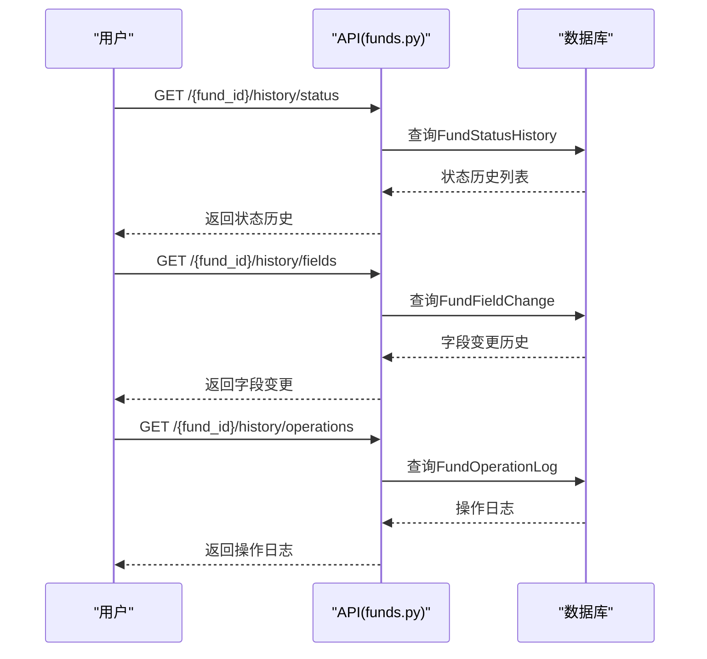
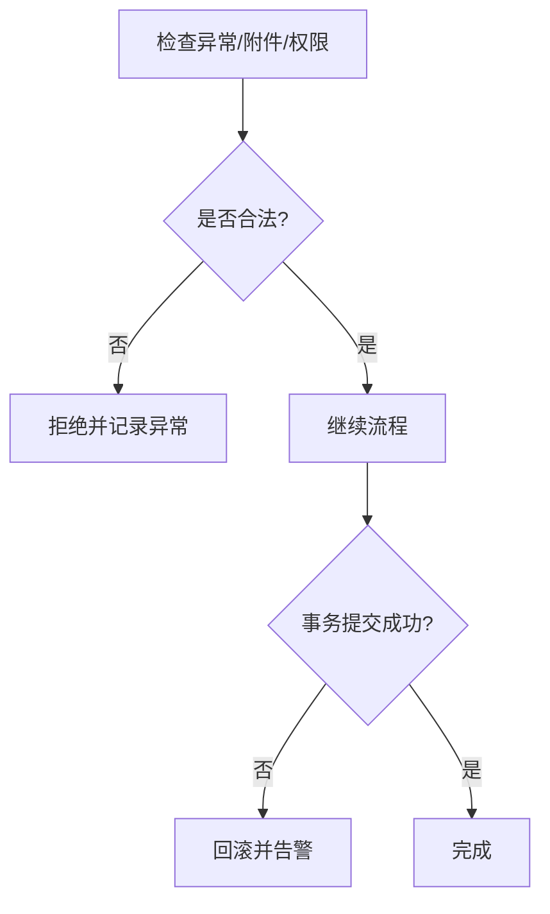
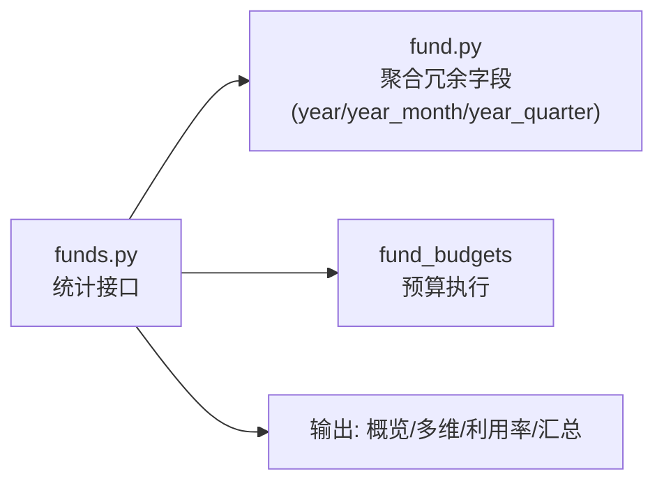
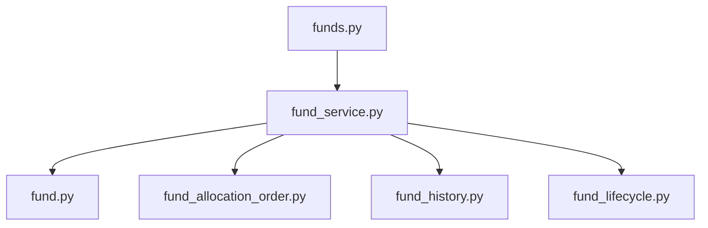

# 资金拨付与跟踪

<cite>
**本文引用的文件**
- [backend/app/models/fund.py](file://backend/app/models/fund.py)
- [backend/app/models/fund_allocation_order.py](file://backend/app/models/fund_allocation_order.py)
- [backend/app/models/fund_history.py](file://backend/app/models/fund_history.py)
- [backend/app/models/fund_lifecycle.py](file://backend/app/models/fund_lifecycle.py)
- [backend/app/services/fund_service.py](file://backend/app/services/fund_service.py)
- [backend/app/api/v1/funds.py](file://backend/app/api/v1/funds.py)
</cite>

## 目录
1. [简介](#简介)
2. [项目结构](#项目结构)
3. [核心组件](#核心组件)
4. [架构总览](#架构总览)
5. [详细组件分析](#详细组件分析)
6. [依赖关系分析](#依赖关系分析)
7. [性能考量](#性能考量)
8. [故障排查指南](#故障排查指南)
9. [结论](#结论)
10. [附录](#附录)

## 简介
本操作指南围绕“资金拨付与跟踪”模块，面向业务与运维人员，系统说明：
- 资金拨付的发起流程：申请、审批、拨付方式选择、收款账户配置等。
- 资金拨付状态跟踪：待拨付、已拨付、到账确认等状态流转。
- 资金拨付记录管理与历史查询：状态变更、字段变更、操作日志。
- 拨付异常处理与回退机制：异常检测、凭证校验、回滚策略。
- 资金流向分析与拨付效率统计：多维度统计、利用率、预算执行率。
- 资金安全验证与防重复拨付：附件校验、状态机约束、幂等性保障。

## 项目结构
资金拨付与跟踪涉及模型层、服务层与API层协同：
- 模型层：经费主表、拨款指令/明细、生命周期阶段、历史记录等。
- 服务层：经费CRUD、批量状态更新、事务控制、审计联动。
- API层：经费申请、审批、拨付、使用、完成、审计、统计、历史查询、附件管理等接口。

**图表来源**
- [backend/app/api/v1/funds.py:360-445](file://backend/app/api/v1/funds.py#L360-L445)
- [backend/app/services/fund_service.py:29-130](file://backend/app/services/fund_service.py#L29-L130)
- [backend/app/models/fund.py:61-166](file://backend/app/models/fund.py#L61-L166)
- [backend/app/models/fund_allocation_order.py:23-113](file://backend/app/models/fund_allocation_order.py#L23-L113)
- [backend/app/models/fund_history.py:18-159](file://backend/app/models/fund_history.py#L18-L159)
- [backend/app/models/fund_lifecycle.py:119-449](file://backend/app/models/fund_lifecycle.py#L119-L449)

**章节来源**
- [backend/app/api/v1/funds.py:360-445](file://backend/app/api/v1/funds.py#L360-L445)
- [backend/app/services/fund_service.py:29-130](file://backend/app/services/fund_service.py#L29-L130)
- [backend/app/models/fund.py:61-166](file://backend/app/models/fund.py#L61-L166)
- [backend/app/models/fund_allocation_order.py:23-113](file://backend/app/models/fund_allocation_order.py#L23-L113)
- [backend/app/models/fund_history.py:18-159](file://backend/app/models/fund_history.py#L18-L159)
- [backend/app/models/fund_lifecycle.py:119-449](file://backend/app/models/fund_lifecycle.py#L119-L449)

## 核心组件
- 经费主数据（Fund）：承载金额、状态、时间、关联对象、聚合冗余字段等。
- 拨款指令（FundAllocationOrder/AllocationOrderItem）：指标文数字化解析、拆分至下级单位虚拟账户、状态跟踪。
- 生命周期（ProjectFundPhase/FundTransferVoucher/FundContract*）：七阶段推进、划转凭证、合同付款联动。
- 历史记录（FundStatusHistory/FundFieldChange/FundOperationLog）：状态变更、字段变更、操作日志。
- 服务（FundService）：创建、更新、批量状态更新、事务控制、审计联动。
- API（funds.py）：申请、审批、拨付、使用、完成、审计、统计、历史查询、附件管理。

**章节来源**
- [backend/app/models/fund.py:61-166](file://backend/app/models/fund.py#L61-L166)
- [backend/app/models/fund_allocation_order.py:23-113](file://backend/app/models/fund_allocation_order.py#L23-L113)
- [backend/app/models/fund_lifecycle.py:119-449](file://backend/app/models/fund_lifecycle.py#L119-L449)
- [backend/app/models/fund_history.py:18-159](file://backend/app/models/fund_history.py#L18-L159)
- [backend/app/services/fund_service.py:29-288](file://backend/app/services/fund_service.py#L29-L288)
- [backend/app/api/v1/funds.py:483-962](file://backend/app/api/v1/funds.py#L483-L962)

## 架构总览
资金拨付从申请到到账确认的关键路径如下：

**图表来源**
- [backend/app/api/v1/funds.py:507-531](file://backend/app/api/v1/funds.py#L507-L531)
- [backend/app/api/v1/funds.py:863-962](file://backend/app/api/v1/funds.py#L863-L962)
- [backend/app/services/fund_service.py:114-185](file://backend/app/services/fund_service.py#L114-L185)
- [backend/app/models/fund.py:199-226](file://backend/app/models/fund.py#L199-L226)
- [backend/app/models/fund_history.py:18-159](file://backend/app/models/fund_history.py#L18-L159)

## 详细组件分析

### 资金拨付发起流程（申请、审批、拨付、使用、完成、审计）
- 申请：支持普通用户提交申请，自动进入待审批；管理员可直接创建并进入审批。
- 审批：通过/驳回，通过后经费进入可拨付状态；同时同步完结相关审批任务。
- 拨付：需上传必需附件（合同、分配令），成功后经费状态变更为已拨付，并记录拨付日期。
- 使用/完成/审计：按顺序推进，分别记录开始/结束/审计日期。

**图表来源**
- [backend/app/api/v1/funds.py:507-531](file://backend/app/api/v1/funds.py#L507-L531)
- [backend/app/api/v1/funds.py:863-962](file://backend/app/api/v1/funds.py#L863-L962)

**章节来源**
- [backend/app/api/v1/funds.py:507-531](file://backend/app/api/v1/funds.py#L507-L531)
- [backend/app/api/v1/funds.py:863-962](file://backend/app/api/v1/funds.py#L863-L962)
- [backend/app/services/fund_service.py:230-288](file://backend/app/services/fund_service.py#L230-L288)

### 拨付方式选择与收款账户配置
- 拨款指令（FundAllocationOrder）：记录指标文编号、总金额、目标单位、目标账户、下达/生效/失效日期、状态（草稿/已下发/已接收/已完成/已取消）。
- 拨款明细（AllocationOrderItem）：将总额拆分至下级单位虚拟账户，记录分配金额、接收账户、状态（待划转/已划转/已确认）、划转与确认时间。
- 资金划转凭证（FundTransferVoucher）：记录划转方向、金额、付款/收款账户、划转日期、凭证状态、确认人与时间。

**图表来源**
- [backend/app/models/fund_allocation_order.py:23-113](file://backend/app/models/fund_allocation_order.py#L23-L113)
- [backend/app/models/fund_lifecycle.py:191-238](file://backend/app/models/fund_lifecycle.py#L191-L238)

**章节来源**
- [backend/app/models/fund_allocation_order.py:23-113](file://backend/app/models/fund_allocation_order.py#L23-L113)
- [backend/app/models/fund_lifecycle.py:191-238](file://backend/app/models/fund_lifecycle.py#L191-L238)

### 资金拨付状态跟踪（待拨付、已拨付、到账确认）
- 经费状态机：pending→planned→approved→allocated→in_use→completed→audited。
- 状态变更落库：每次合法流转均记录FundStatusHistory，包含原状态、新状态、操作人、时间、备注。
- 操作日志：状态流转同时写入FundOperationLog，便于详情页展示。

**图表来源**
- [backend/app/services/fund_service.py:230-288](file://backend/app/services/fund_service.py#L230-L288)
- [backend/app/models/fund_history.py:18-63](file://backend/app/models/fund_history.py#L18-L63)

**章节来源**
- [backend/app/services/fund_service.py:230-288](file://backend/app/services/fund_service.py#L230-L288)
- [backend/app/models/fund_history.py:18-63](file://backend/app/models/fund_history.py#L18-L63)

### 资金拨付记录管理与历史查询
- 状态历史：按经费ID查询最近100条状态变更记录。
- 字段变更历史：记录每次字段修改的旧值/新值、修改人、时间。
- 操作日志：记录附件上传/删除、状态流转等操作详情。
- 审批流程视图：根据当前状态与历史推导节点到达情况，用于前端流程展示。

**图表来源**
- [backend/app/api/v1/funds.py:1146-1240](file://backend/app/api/v1/funds.py#L1146-L1240)
- [backend/app/models/fund_history.py:18-159](file://backend/app/models/fund_history.py#L18-L159)

**章节来源**
- [backend/app/api/v1/funds.py:1146-1240](file://backend/app/api/v1/funds.py#L1146-L1240)
- [backend/app/models/fund_history.py:18-159](file://backend/app/models/fund_history.py#L18-L159)

### 拨付异常处理与回退机制
- 异常类型：超支、偏差、闲置、重复、缺失凭证等。
- 异常记录：FundAnomaly记录异常类型、严重程度、描述、检测时间、解决状态与解决信息。
- 回退策略：
  - 状态机约束：非法状态流转直接拒绝，避免错误推进。
  - 附件校验：拨付前强制要求上传合同与分配令，否则拒绝。
  - 事务控制：服务层提供auto_commit参数，复杂流程由外层统一控制事务，防止半截子数据。
  - 软删除：经费记录采用软删标记，保留审计轨迹。

**图表来源**
- [backend/app/models/fund_lifecycle.py:324-362](file://backend/app/models/fund_lifecycle.py#L324-L362)
- [backend/app/api/v1/funds.py:768-862](file://backend/app/api/v1/funds.py#L768-L862)
- [backend/app/services/fund_service.py:114-185](file://backend/app/services/fund_service.py#L114-L185)

**章节来源**
- [backend/app/models/fund_lifecycle.py:324-362](file://backend/app/models/fund_lifecycle.py#L324-L362)
- [backend/app/api/v1/funds.py:768-862](file://backend/app/api/v1/funds.py#L768-L862)
- [backend/app/services/fund_service.py:114-185](file://backend/app/services/fund_service.py#L114-L185)

### 资金流向分析与拨付效率统计
- 概览统计：总数、总金额、各状态计数、已用/已拨金额、预算总额/执行额/剩余/使用率。
- 多维度统计：按周期（月/季/年）、类型、来源、状态分组，计算总量、已拨、已用与利用率。
- 帮扶村/学校汇总：按年度统计计划/批准/拨付/使用金额与结余。
- 利用率统计：总体实际投资与计划投资比率。

**图表来源**
- [backend/app/api/v1/funds.py:617-760](file://backend/app/api/v1/funds.py#L617-L760)
- [backend/app/models/fund.py:156-166](file://backend/app/models/fund.py#L156-L166)

**章节来源**
- [backend/app/api/v1/funds.py:617-760](file://backend/app/api/v1/funds.py#L617-L760)
- [backend/app/models/fund.py:156-166](file://backend/app/models/fund.py#L156-L166)

### 资金安全验证与防重复拨付措施
- 权限隔离：所有查询与操作通过数据权限适配器过滤组织范围，跨组织访问返回明确错误。
- 附件强制校验：拨付前必须上传合同与分配令，否则拒绝。
- 状态机白名单：仅允许合法状态流转，非法流转直接拒绝。
- 幂等性与事务：服务层支持auto_commit控制，复杂流程由外层统一事务；关键操作记录日志与历史，便于追溯。
- 软删除与审计：经费记录软删，保留deleted_at与操作日志，支持恢复与审计。

**章节来源**
- [backend/app/api/v1/funds.py:345-445](file://backend/app/api/v1/funds.py#L345-L445)
- [backend/app/api/v1/funds.py:768-862](file://backend/app/api/v1/funds.py#L768-L862)
- [backend/app/services/fund_service.py:114-185](file://backend/app/services/fund_service.py#L114-L185)
- [backend/app/models/fund_history.py:112-159](file://backend/app/models/fund_history.py#L112-L159)

## 依赖关系分析
- API层依赖服务层进行业务编排与事务控制。
- 服务层依赖模型层进行数据持久化与审计记录。
- 模型层之间通过外键与索引建立强关联，确保数据一致性与查询性能。
- 生命周期与凭证、合同、决算等扩展模型支撑完整资金闭环。

**图表来源**
- [backend/app/api/v1/funds.py:360-445](file://backend/app/api/v1/funds.py#L360-L445)
- [backend/app/services/fund_service.py:29-130](file://backend/app/services/fund_service.py#L29-L130)
- [backend/app/models/fund.py:61-166](file://backend/app/models/fund.py#L61-L166)
- [backend/app/models/fund_allocation_order.py:23-113](file://backend/app/models/fund_allocation_order.py#L23-L113)
- [backend/app/models/fund_history.py:18-159](file://backend/app/models/fund_history.py#L18-L159)
- [backend/app/models/fund_lifecycle.py:119-449](file://backend/app/models/fund_lifecycle.py#L119-L449)

**章节来源**
- [backend/app/api/v1/funds.py:360-445](file://backend/app/api/v1/funds.py#L360-L445)
- [backend/app/services/fund_service.py:29-130](file://backend/app/services/fund_service.py#L29-L130)
- [backend/app/models/fund.py:61-166](file://backend/app/models/fund.py#L61-L166)
- [backend/app/models/fund_allocation_order.py:23-113](file://backend/app/models/fund_allocation_order.py#L23-L113)
- [backend/app/models/fund_history.py:18-159](file://backend/app/models/fund_history.py#L18-L159)
- [backend/app/models/fund_lifecycle.py:119-449](file://backend/app/models/fund_lifecycle.py#L119-L449)

## 性能考量
- 聚合冗余字段：year、year_month、year_quarter在插入/更新时自动填充，避免全表扫描与函数计算。
- 复合索引：针对常见过滤条件（状态、类型、来源、项目、村庄、日期）建立索引，提升查询性能。
- N+1优化：列表与详情查询使用joinedload/selectinload预加载关联数据，减少额外查询。
- 批量更新：批量状态更新使用bulk update，避免循环逐条更新。
- 分页优化：支持offset与keyset两种分页方式，适配大数据量场景。

**章节来源**
- [backend/app/models/fund.py:66-86](file://backend/app/models/fund.py#L66-L86)
- [backend/app/models/fund.py:199-226](file://backend/app/models/fund.py#L199-L226)
- [backend/app/services/fund_service.py:40-99](file://backend/app/services/fund_service.py#L40-L99)
- [backend/app/services/fund_service.py:245-288](file://backend/app/services/fund_service.py#L245-L288)
- [backend/app/api/v1/funds.py:360-445](file://backend/app/api/v1/funds.py#L360-L445)

## 故障排查指南
- 状态流转失败：检查当前状态是否在允许集合内，查看FundStatusHistory定位问题。
- 附件缺失：拨付前需上传合同与分配令，若缺少将抛出错误。
- 权限不足：跨组织访问会返回403，确认数据权限与组织范围。
- 事务异常：服务层auto_commit=False时，需外层统一提交；若失败检查日志与事务边界。
- 历史查询为空：确认fund_id是否正确，检查FundStatusHistory/FundFieldChange/FundOperationLog是否存在记录。

**章节来源**
- [backend/app/api/v1/funds.py:768-862](file://backend/app/api/v1/funds.py#L768-L862)
- [backend/app/api/v1/funds.py:1146-1240](file://backend/app/api/v1/funds.py#L1146-L1240)
- [backend/app/services/fund_service.py:114-185](file://backend/app/services/fund_service.py#L114-L185)

## 结论
本模块通过严格的状态机、附件校验、审计记录与高性能查询设计，实现了资金拨付的全流程管控与可追溯。结合拨款指令与生命周期模型，支持多级单位拆分、凭证管理与合同联动，满足复杂业务场景下的资金安全与效率需求。建议在实际使用中：
- 规范附件上传与字段填写，确保拨付合规。
- 关注状态历史与操作日志，及时发现问题。
- 利用统计接口进行资金流向分析与效率评估。
- 在复杂流程中使用事务控制，保证数据一致性。

## 附录
- 常用接口参考：
  - 经费申请：POST /funds/apply
  - 审批通过：POST /funds/{id}/approve
  - 审批驳回：POST /funds/{id}/reject
  - 发起拨付：POST /funds/{id}/allocate
  - 开始使用：POST /funds/{id}/start-use
  - 使用完成：POST /funds/{id}/complete
  - 审计归档：POST /funds/{id}/audit
  - 状态历史：GET /funds/{id}/history/status
  - 字段历史：GET /funds/{id}/history/fields
  - 操作日志：GET /funds/{id}/history/operations
  - 统计概览：GET /funds/statistics/overview
  - 多维统计：GET /funds/statistics/multi-dimension

**章节来源**
- [backend/app/api/v1/funds.py:507-962](file://backend/app/api/v1/funds.py#L507-L962)
- [backend/app/api/v1/funds.py:1146-1240](file://backend/app/api/v1/funds.py#L1146-L1240)
- [backend/app/api/v1/funds.py:617-760](file://backend/app/api/v1/funds.py#L617-L760)