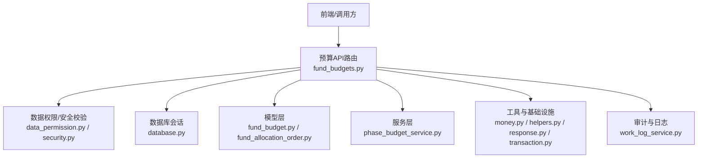
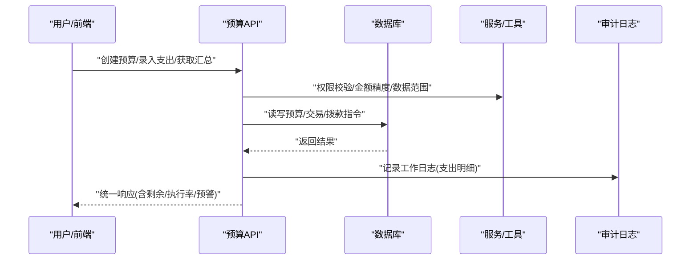
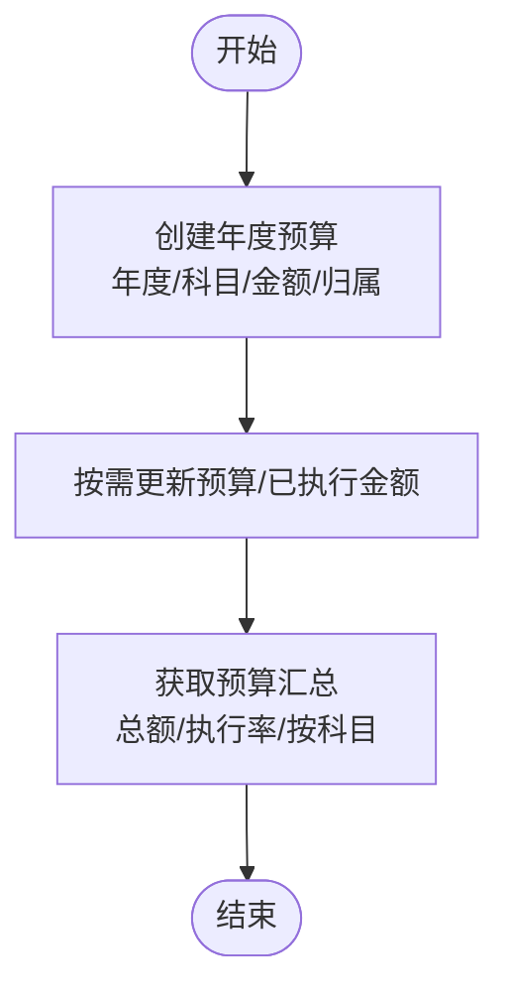
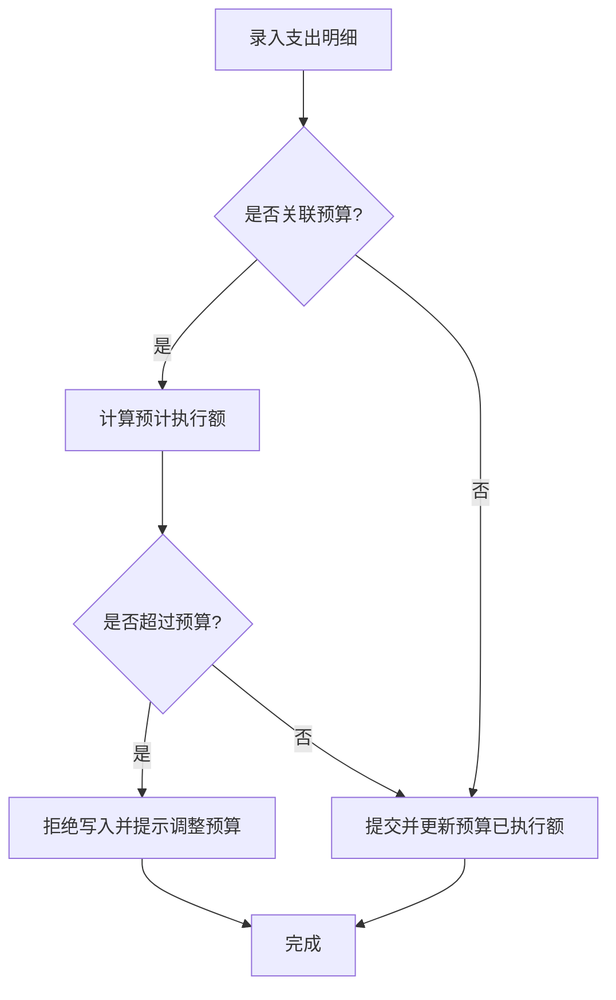
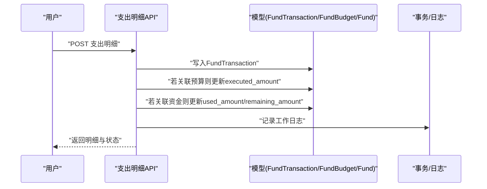
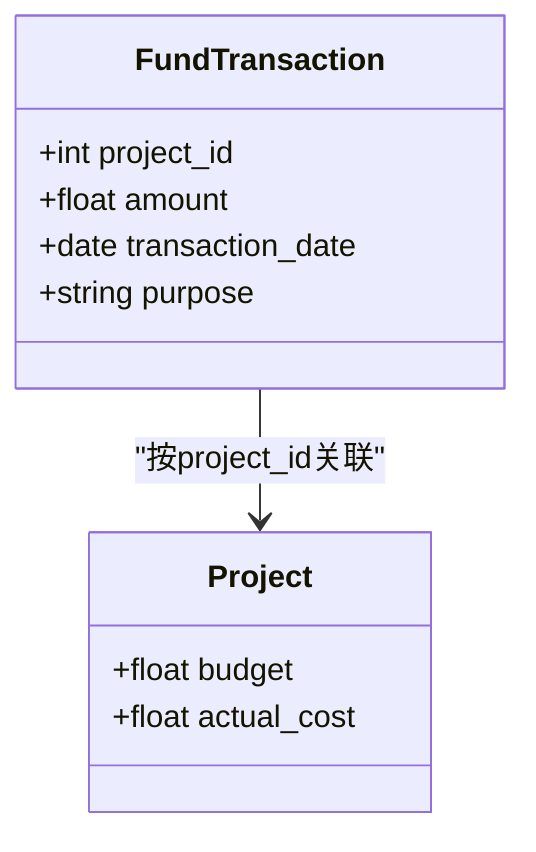
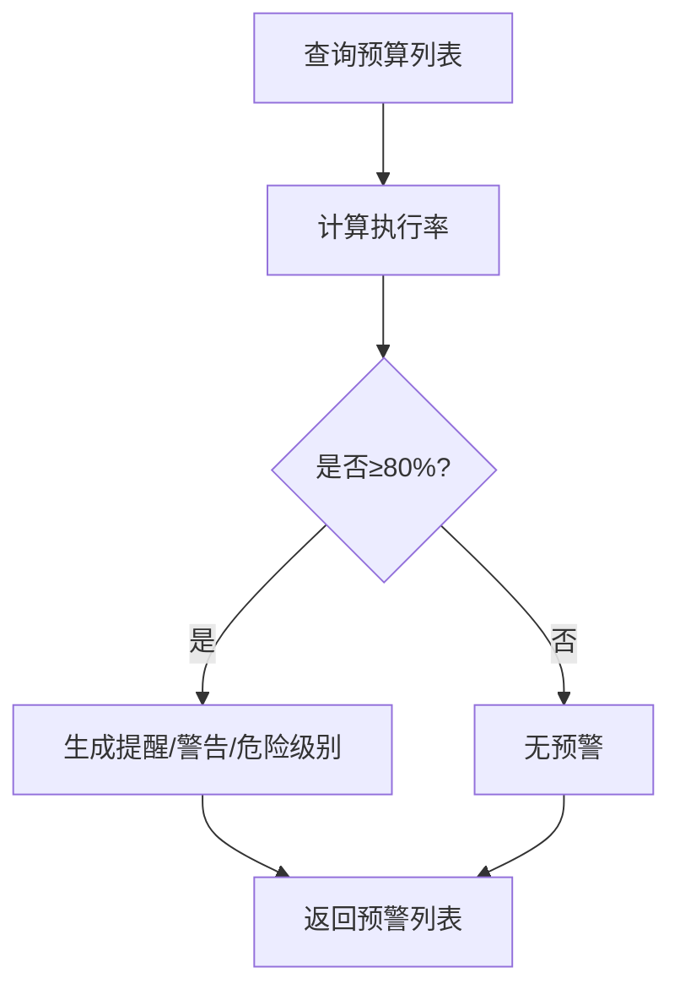
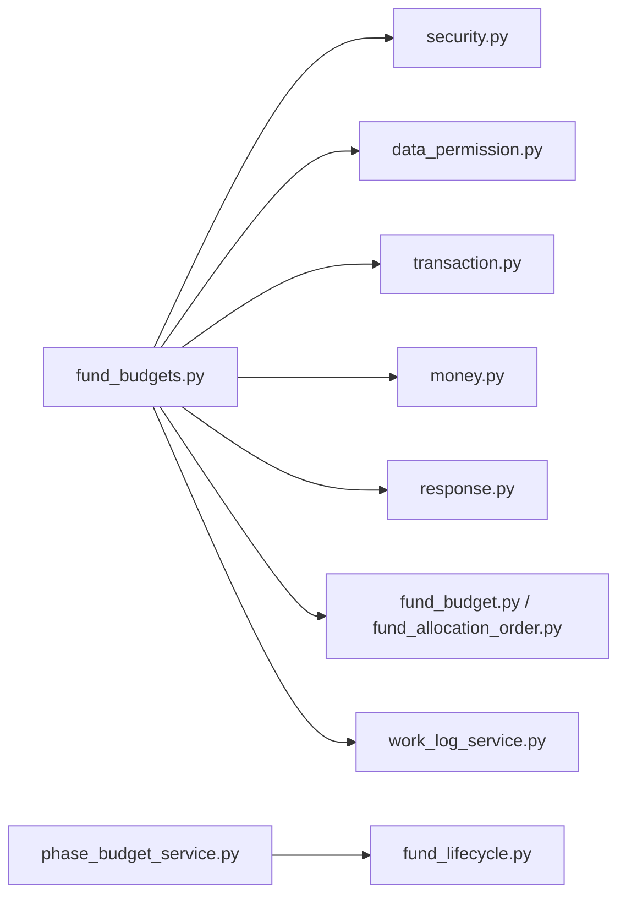

# 预算管理

<cite>
**本文引用的文件**
- [backend/app/models/fund_budget.py](file://backend/app/models/fund_budget.py)
- [backend/app/api/v1/fund_budgets.py](file://backend/app/api/v1/fund_budgets.py)
- [backend/app/services/funding/phase_budget_service.py](file://backend/app/services/funding/phase_budget_service.py)
- [backend/app/models/fund_allocation_order.py](file://backend/app/models/fund_allocation_order.py)
- [backend/app/models/fund_lifecycle.py](file://backend/app/models/fund_lifecycle.py)
- [backend/app/api/v1/assessment.py](file://backend/app/api/v1/assessment.py)
- [backend/app/api/v1/data/data/statistics.py](file://backend/app/api/v1/data/data/statistics.py)
- [backend/app/api/v1/data/data/data_quality.py](file://backend/app/api/v1/data/data/data_quality.py)
- [backend/app/core/money.py](file://backend/app/core/money.py)
- [backend/app/utils/helpers.py](file://backend/app/utils/helpers.py)
- [backend/app/core/response.py](file://backend/app/core/response.py)
- [backend/app/core/security.py](file://backend/app/core/security.py)
- [backend/app/core/database.py](file://backend/app/core/database.py)
- [backend/app/core/data_permission.py](file://backend/app/core/data_permission.py)
- [backend/app/core/transaction.py](file://backend/app/core/transaction.py)
- [backend/app/services/work_log_service.py](file://backend/app/services/work_log_service.py)
</cite>

## 目录
1. [简介](#简介)
2. [项目结构](#项目结构)
3. [核心组件](#核心组件)
4. [架构总览](#架构总览)
5. [详细组件分析](#详细组件分析)
6. [依赖关系分析](#依赖关系分析)
7. [性能考虑](#性能考虑)
8. [故障排查指南](#故障排查指南)
9. [结论](#结论)
10. [附录](#附录)

## 简介
本操作指南面向预算管理人员与系统使用者，围绕年度预算编制、预算调整、预算执行跟踪、预算与项目关联、执行监控与预警、报表生成与导出、合规与审计追踪等关键能力，提供端到端流程说明与最佳实践。文档基于后端模型、API与服务实现进行梳理，确保与实际代码行为一致。

## 项目结构
预算管理相关能力主要分布在以下位置：
- 数据模型：年度预算、使用明细、拨款指令等实体定义
- API 接口：预算的增删改查、使用明细录入、汇总统计、预警查询、附件上报
- 服务层：预算基线管理（阶段化汇总审核）
- 辅助能力：金额精度处理、权限控制、事务提交、工作日志记录

图表来源
- [backend/app/api/v1/fund_budgets.py:114-204](file://backend/app/api/v1/fund_budgets.py#L114-L204)
- [backend/app/models/fund_budget.py:19-76](file://backend/app/models/fund_budget.py#L19-L76)
- [backend/app/models/fund_allocation_order.py:23-76](file://backend/app/models/fund_allocation_order.py#L23-L76)
- [backend/app/services/funding/phase_budget_service.py:14-45](file://backend/app/services/funding/phase_budget_service.py#L14-L45)

章节来源
- [backend/app/api/v1/fund_budgets.py:114-204](file://backend/app/api/v1/fund_budgets.py#L114-L204)
- [backend/app/models/fund_budget.py:19-76](file://backend/app/models/fund_budget.py#L19-L76)
- [backend/app/models/fund_allocation_order.py:23-76](file://backend/app/models/fund_allocation_order.py#L23-L76)
- [backend/app/services/funding/phase_budget_service.py:14-45](file://backend/app/services/funding/phase_budget_service.py#L14-L45)

## 核心组件
- 年度预算模型与计算属性：支持按年度、科目、帮扶村维度管理预算，并提供剩余金额与执行率计算
- 经费使用明细台账：记录每笔支出，支持关联预算、项目、资金、村庄，并自动回写预算执行额与资金已用额
- 预算预警机制：基于执行率阈值触发多级预警，超预算禁止继续核销
- 预算汇总与统计：提供年度总预算、已执行、剩余及按科目维度的汇总
- 预算附件上报：支持上传批复文件、凭证等资料，并在备注中保留上传轨迹
- 拨款指令与分配：支持指标文数字化解析与向目标单位虚拟账户分配，状态可追踪
- 预算基线管理：阶段化汇总审核，形成可锁定、可追溯的预算基线

章节来源
- [backend/app/models/fund_budget.py:19-76](file://backend/app/models/fund_budget.py#L19-L76)
- [backend/app/models/fund_budget.py:78-141](file://backend/app/models/fund_budget.py#L78-L141)
- [backend/app/models/fund_budget.py:143-202](file://backend/app/models/fund_budget.py#L143-L202)
- [backend/app/api/v1/fund_budgets.py:114-204](file://backend/app/api/v1/fund_budgets.py#L114-L204)
- [backend/app/api/v1/fund_budgets.py:226-289](file://backend/app/api/v1/fund_budgets.py#L226-L289)
- [backend/app/api/v1/fund_budgets.py:295-406](file://backend/app/api/v1/fund_budgets.py#L295-L406)
- [backend/app/api/v1/fund_budgets.py:412-494](file://backend/app/api/v1/fund_budgets.py#L412-L494)
- [backend/app/models/fund_allocation_order.py:23-113](file://backend/app/models/fund_allocation_order.py#L23-L113)
- [backend/app/services/funding/phase_budget_service.py:14-45](file://backend/app/services/funding/phase_budget_service.py#L14-L45)

## 架构总览
预算管理采用“模型-服务-API”分层架构：
- 模型层：定义预算、交易、拨款指令等实体，提供计算属性与约束
- 服务层：封装复杂业务逻辑（如预算基线汇总、锁定）
- API层：暴露REST接口，负责参数校验、权限控制、事务提交与响应封装
- 横切关注点：数据权限、安全认证、金额精度、审计日志、统一响应

图表来源
- [backend/app/api/v1/fund_budgets.py:146-204](file://backend/app/api/v1/fund_budgets.py#L146-L204)
- [backend/app/api/v1/fund_budgets.py:324-376](file://backend/app/api/v1/fund_budgets.py#L324-L376)
- [backend/app/core/security.py](file://backend/app/core/security.py)
- [backend/app/core/data_permission.py](file://backend/app/core/data_permission.py)
- [backend/app/core/money.py](file://backend/app/core/money.py)
- [backend/app/core/response.py](file://backend/app/core/response.py)
- [backend/app/services/work_log_service.py](file://backend/app/services/work_log_service.py)

## 详细组件分析

### 年度预算编制流程
- 预算项目创建：通过预算创建接口录入年度、科目、预算金额、所属单位/帮扶村、说明与备注；系统自动计算剩余金额与执行率
- 金额分配：可在创建时或后续更新中调整预算金额与已执行金额；支持按科目维度汇总
- 预算审批：结合拨款指令与预算基线管理，形成从下达、分配到锁定的完整闭环

图表来源
- [backend/app/api/v1/fund_budgets.py:146-204](file://backend/app/api/v1/fund_budgets.py#L146-L204)
- [backend/app/api/v1/fund_budgets.py:249-289](file://backend/app/api/v1/fund_budgets.py#L249-L289)

章节来源
- [backend/app/api/v1/fund_budgets.py:146-204](file://backend/app/api/v1/fund_budgets.py#L146-L204)
- [backend/app/api/v1/fund_budgets.py:249-289](file://backend/app/api/v1/fund_budgets.py#L249-L289)

### 预算调整机制
- 动态调整：支持对预算金额与已执行金额进行增量更新
- 防超支保护：录入支出时若将导致执行率超过100%，接口拒绝写入并提示需先调整预算
- 删除回滚：删除支出明细时，自动扣减对应预算已执行金额与资金已用金额

图表来源
- [backend/app/api/v1/fund_budgets.py:324-376](file://backend/app/api/v1/fund_budgets.py#L324-L376)

章节来源
- [backend/app/api/v1/fund_budgets.py:324-376](file://backend/app/api/v1/fund_budgets.py#L324-L376)

### 预算执行跟踪与数据同步
- 执行台账：每笔支出均记录用途、日期、凭证编号、经办人、审批人、状态等，支持按资金、项目、村庄、预算维度检索
- 自动同步：关联预算时自动更新预算已执行额；关联资金时自动更新资金已用额与剩余额度
- 删除回写：删除支出时反向扣减预算与资金的已用额度，保证数据一致性

图表来源
- [backend/app/api/v1/fund_budgets.py:324-376](file://backend/app/api/v1/fund_budgets.py#L324-L376)
- [backend/app/core/transaction.py](file://backend/app/core/transaction.py)
- [backend/app/services/work_log_service.py](file://backend/app/services/work_log_service.py)

章节来源
- [backend/app/api/v1/fund_budgets.py:295-406](file://backend/app/api/v1/fund_budgets.py#L295-L406)

### 预算与项目的关联关系和数据同步
- 关联方式：支出明细可关联项目ID，便于按项目维度归集执行数据
- 项目预算对比：评估模块支持识别实际成本超预算的项目，并生成预警信息
- 统计聚合：统计数据接口可按项目维度汇总预算与实际成本，支撑报表与分析

图表来源
- [backend/app/models/fund_budget.py:78-141](file://backend/app/models/fund_budget.py#L78-L141)
- [backend/app/api/v1/assessment.py:225-243](file://backend/app/api/v1/assessment.py#L225-L243)
- [backend/app/api/v1/data/data/statistics.py:388-417](file://backend/app/api/v1/data/data/statistics.py#L388-L417)

章节来源
- [backend/app/models/fund_budget.py:78-141](file://backend/app/models/fund_budget.py#L78-L141)
- [backend/app/api/v1/assessment.py:225-243](file://backend/app/api/v1/assessment.py#L225-L243)
- [backend/app/api/v1/data/data/statistics.py:388-417](file://backend/app/api/v1/data/data/statistics.py#L388-L417)

### 预算执行情况监控和预警功能
- 预警阈值：执行率达到80%提醒、90%警告、100%禁止继续核销
- 预警查询：提供按年度筛选的预警列表，用于首页仪表板展示
- 超预算拦截：在支出录入时进行实时校验，防止超预算核销

图表来源
- [backend/app/models/fund_budget.py:143-202](file://backend/app/models/fund_budget.py#L143-L202)
- [backend/app/api/v1/fund_budgets.py:226-243](file://backend/app/api/v1/fund_budgets.py#L226-L243)

章节来源
- [backend/app/models/fund_budget.py:143-202](file://backend/app/models/fund_budget.py#L143-L202)
- [backend/app/api/v1/fund_budgets.py:226-243](file://backend/app/api/v1/fund_budgets.py#L226-L243)

### 预算报表生成与数据导出
- 预算汇总：提供年度总预算、已执行、剩余与执行率，以及按科目维度的明细汇总
- 项目统计：支持按项目维度汇总预算与实际成本，便于绩效评估
- 数据质量：检测异常数据（如负预算），给出修复建议
- 导出能力：系统具备异步导出服务与模板能力，可用于批量导出预算与执行数据（具体以导出服务为准）

章节来源
- [backend/app/api/v1/fund_budgets.py:249-289](file://backend/app/api/v1/fund_budgets.py#L249-L289)
- [backend/app/api/v1/data/data/statistics.py:388-417](file://backend/app/api/v1/data/data/statistics.py#L388-L417)
- [backend/app/api/v1/data/data/data_quality.py:238-248](file://backend/app/api/v1/data/data/data_quality.py#L238-L248)

### 合规要求与审计追踪
- 权限控制：预算与支出操作需具备相应角色权限
- 数据范围：查询与写入受数据权限策略限制，保障组织/村庄级隔离
- 审计日志：支出明细的创建会记录工作日志，包含操作人、时间、金额与用途摘要
- 附件留痕：预算附件上传后在备注中以JSON数组形式留存上传者、时间与文件路径，便于审计回溯

章节来源
- [backend/app/api/v1/fund_budgets.py:146-204](file://backend/app/api/v1/fund_budgets.py#L146-L204)
- [backend/app/api/v1/fund_budgets.py:324-376](file://backend/app/api/v1/fund_budgets.py#L324-L376)
- [backend/app/api/v1/fund_budgets.py:412-494](file://backend/app/api/v1/fund_budgets.py#L412-L494)
- [backend/app/core/security.py](file://backend/app/core/security.py)
- [backend/app/core/data_permission.py](file://backend/app/core/data_permission.py)
- [backend/app/services/work_log_service.py](file://backend/app/services/work_log_service.py)

## 依赖关系分析
- 模型依赖：预算与交易通过外键与资金、项目、村庄、预算等实体关联
- API依赖：预算API依赖安全、数据权限、事务、金额精度与统一响应
- 服务依赖：预算基线服务依赖异步会话与生命周期模型

图表来源
- [backend/app/api/v1/fund_budgets.py:114-204](file://backend/app/api/v1/fund_budgets.py#L114-L204)
- [backend/app/services/funding/phase_budget_service.py:14-45](file://backend/app/services/funding/phase_budget_service.py#L14-L45)

章节来源
- [backend/app/api/v1/fund_budgets.py:114-204](file://backend/app/api/v1/fund_budgets.py#L114-L204)
- [backend/app/services/funding/phase_budget_service.py:14-45](file://backend/app/services/funding/phase_budget_service.py#L14-L45)

## 性能考虑
- 索引优化：预算表与交易表针对年度、科目、村庄、日期等字段建立索引，提升查询效率
- 分页与过滤：支出明细查询支持分页与多维度过滤，避免全表扫描
- 金额精度：使用统一的金额精度处理，减少浮点误差带来的重复计算开销
- 汇总计算：按科目汇总与执行率计算在服务层进行，避免前端重复计算

章节来源
- [backend/app/models/fund_budget.py:24-29](file://backend/app/models/fund_budget.py#L24-L29)
- [backend/app/models/fund_budget.py:83-89](file://backend/app/models/fund_budget.py#L83-L89)
- [backend/app/api/v1/fund_budgets.py:295-321](file://backend/app/api/v1/fund_budgets.py#L295-L321)
- [backend/app/core/money.py](file://backend/app/core/money.py)

## 故障排查指南
- 超预算无法录入：检查是否已接近或达到100%执行率；如需继续支出，请先调整预算金额
- 数据不一致：确认删除支出明细是否正确回写预算与资金已用额；必要时重新核对交易记录
- 权限问题：确认当前用户是否具备预算与支出操作权限；检查数据范围策略是否限制了可见范围
- 附件未显示：检查预算备注中的附件JSON格式是否正确；确认上传路径与访问权限

章节来源
- [backend/app/api/v1/fund_budgets.py:324-376](file://backend/app/api/v1/fund_budgets.py#L324-L376)
- [backend/app/api/v1/fund_budgets.py:379-406](file://backend/app/api/v1/fund_budgets.py#L379-L406)
- [backend/app/api/v1/fund_budgets.py:412-494](file://backend/app/api/v1/fund_budgets.py#L412-L494)

## 结论
本模块提供了完整的年度预算编制、调整、执行跟踪、监控预警、报表统计与审计追踪能力。通过严格的权限控制、数据范围与金额精度处理，确保预算管理的合规性与准确性。建议在实际使用中结合拨款指令与预算基线管理，形成从下达、分配到执行的闭环管控。

## 附录
- 常用接口概览
  - 预算列表与筛选：GET /fund-budgets
  - 创建预算：POST /fund-budgets
  - 更新预算：PUT /fund-budgets/{budget_id}
  - 删除预算：DELETE /fund-budgets/{budget_id}
  - 预算预警：GET /fund-budgets/alerts
  - 预算汇总：GET /fund-budgets/summary
  - 支出明细列表：GET /fund-budgets/transactions
  - 创建支出明细：POST /fund-budgets/transactions
  - 删除支出明细：DELETE /fund-budgets/transactions/{transaction_id}
  - 预算附件上传：POST /fund-budgets/{budget_id}/attachments
  - 预算附件列表：GET /fund-budgets/{budget_id}/attachments

章节来源
- [backend/app/api/v1/fund_budgets.py:114-494](file://backend/app/api/v1/fund_budgets.py#L114-L494)