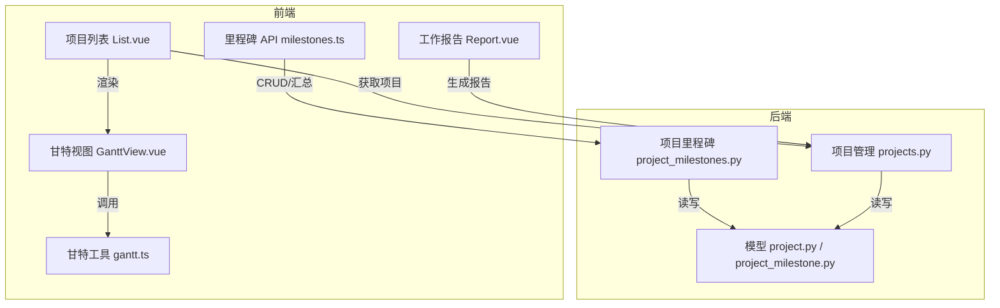
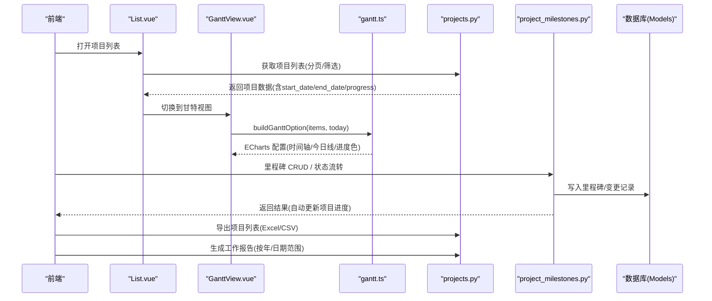
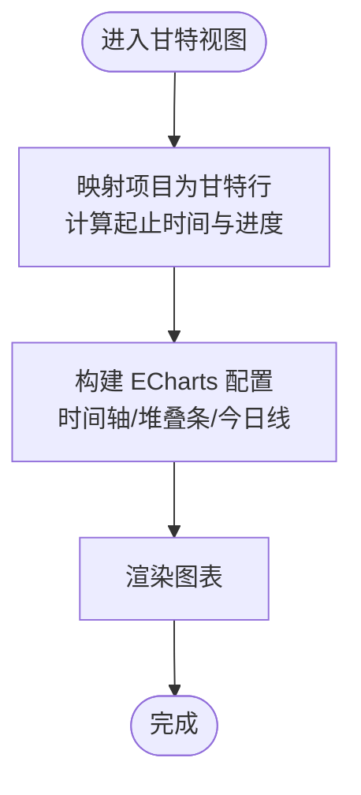
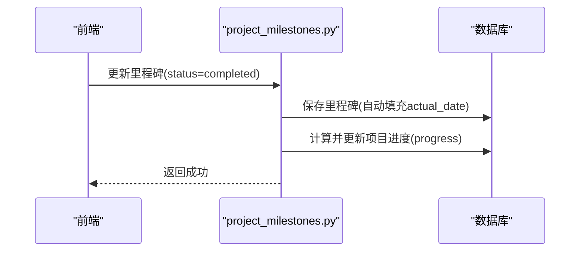
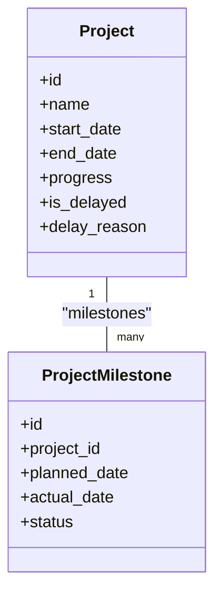
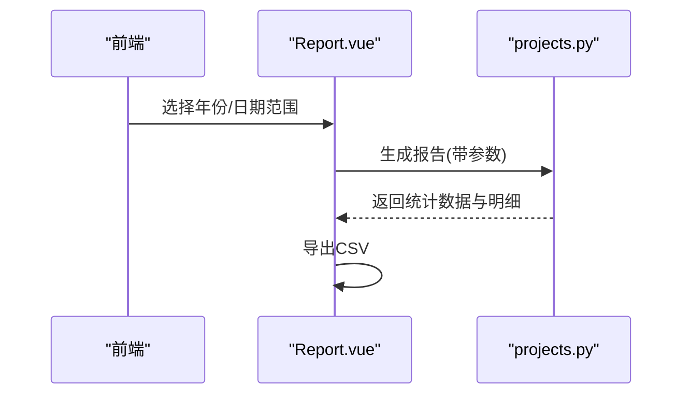
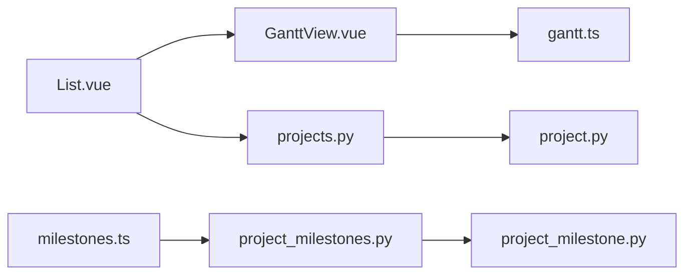

# 进度跟踪与甘特图

<cite>
**本文引用的文件**
- [backend/app/models/project.py](file://backend/app/models/project.py)
- [backend/app/models/project_milestone.py](file://backend/app/models/project_milestone.py)
- [backend/app/api/v1/projects.py](file://backend/app/api/v1/projects.py)
- [backend/app/api/v1/project_milestones.py](file://backend/app/api/v1/project_milestones.py)
- [frontend/src/utils/gantt.ts](file://frontend/src/utils/gantt.ts)
- [frontend/src/views/projects/GanttView.vue](file://frontend/src/views/projects/GanttView.vue)
- [frontend/src/views/projects/List.vue](file://frontend/src/views/projects/List.vue)
- [frontend/src/api/milestones.ts](file://frontend/src/api/milestones.ts)
- [frontend/src/views/ruralWorks/Report.vue](file://frontend/src/views/ruralWorks/Report.vue)
</cite>

## 目录
1. [简介](#简介)
2. [项目结构](#项目结构)
3. [核心组件](#核心组件)
4. [架构总览](#架构总览)
5. [详细组件分析](#详细组件分析)
6. [依赖关系分析](#依赖关系分析)
7. [性能考虑](#性能考虑)
8. [故障排查指南](#故障排查指南)
9. [结论](#结论)
10. [附录](#附录)

## 简介
本操作指南面向“进度跟踪与甘特图”功能，覆盖以下目标：
- 视图切换与使用：在列表页以表格/甘特两种视图查看项目进度；时间轴展示、任务条显示、今日线标注。
- 进度数据录入与更新：支持手动更新项目进度；里程碑完成自动计算并回写项目进度；提供偏差与风险相关指标（如延期标记）。
- 交互操作：基于 ECharts 的时间轴缩放与滚动；双击编辑任务（通过项目详情/任务管理）；拖拽调整时间（当前为轻量实现，不直接支持拖拽修改日期）。
- 报告生成：按年份/日期范围生成工作/项目进度报告，导出 CSV；结合里程碑与项目状态进行趋势分析与预警。
- 导出与分享：项目列表导出 Excel/CSV；报告导出 CSV；可配合系统权限进行分享。
- 最佳实践与优化：分页加载、批量查询、索引优化、避免 N+1 查询等。

## 项目结构
该功能由前后端协同实现：
- 后端提供项目、里程碑、变更记录、统计与导出接口；包含进度自动计算与状态流转校验。
- 前端在“项目列表”中新增“甘特视图”，通过 ECharts 渲染轻量甘特图；里程碑 API 用于维护里程碑与进度联动；报告页面支持按年/日期范围生成与导出。

图表来源
- [frontend/src/views/projects/List.vue:253-355](file://frontend/src/views/projects/List.vue#L253-L355)
- [frontend/src/views/projects/GanttView.vue:1-23](file://frontend/src/views/projects/GanttView.vue#L1-L23)
- [frontend/src/utils/gantt.ts:1-88](file://frontend/src/utils/gantt.ts#L1-L88)
- [frontend/src/api/milestones.ts:1-55](file://frontend/src/api/milestones.ts#L1-L55)
- [backend/app/api/v1/projects.py:513-753](file://backend/app/api/v1/projects.py#L513-L753)
- [backend/app/api/v1/project_milestones.py:105-465](file://backend/app/api/v1/project_milestones.py#L105-L465)
- [backend/app/models/project.py:47-175](file://backend/app/models/project.py#L47-L175)
- [backend/app/models/project_milestone.py:12-105](file://backend/app/models/project_milestone.py#L12-L105)

章节来源
- [frontend/src/views/projects/List.vue:253-355](file://frontend/src/views/projects/List.vue#L253-L355)
- [frontend/src/views/projects/GanttView.vue:1-23](file://frontend/src/views/projects/GanttView.vue#L1-L23)
- [frontend/src/utils/gantt.ts:1-88](file://frontend/src/utils/gantt.ts#L1-L88)
- [backend/app/api/v1/projects.py:513-753](file://backend/app/api/v1/projects.py#L513-L753)
- [backend/app/api/v1/project_milestones.py:105-465](file://backend/app/api/v1/project_milestones.py#L105-L465)
- [backend/app/models/project.py:47-175](file://backend/app/models/project.py#L47-L175)
- [backend/app/models/project_milestone.py:12-105](file://backend/app/models/project_milestone.py#L12-L105)

## 核心组件
- 轻量甘特图渲染：基于 ECharts 的堆叠条形图模拟横条，支持时间轴、今日线、按进度着色。
- 项目列表视图切换：在列表页以单选模式切换“表格/甘特”。
- 里程碑管理：创建、更新、删除里程碑；更新时若标记完成且未填实际日期则自动填充；自动计算并回写项目进度。
- 项目进度与状态流转：支持项目状态变更校验与准入条件检查；记录变更日志；支持延期标记与原因。
- 报告与导出：项目列表导出 Excel/CSV；工作报告按年/日期范围生成并导出 CSV。

章节来源
- [frontend/src/utils/gantt.ts:1-88](file://frontend/src/utils/gantt.ts#L1-L88)
- [frontend/src/views/projects/List.vue:253-355](file://frontend/src/views/projects/List.vue#L253-L355)
- [backend/app/api/v1/project_milestones.py:105-465](file://backend/app/api/v1/project_milestones.py#L105-L465)
- [backend/app/models/project_milestone.py:107-187](file://backend/app/models/project_milestone.py#L107-L187)
- [backend/app/api/v1/projects.py:555-651](file://backend/app/api/v1/projects.py#L555-L651)
- [frontend/src/views/ruralWorks/Report.vue:1-197](file://frontend/src/views/ruralWorks/Report.vue#L1-L197)

## 架构总览
下图展示了从前端到后端的完整数据流与关键处理点：

图表来源
- [frontend/src/views/projects/List.vue:253-355](file://frontend/src/views/projects/List.vue#L253-L355)
- [frontend/src/views/projects/GanttView.vue:1-23](file://frontend/src/views/projects/GanttView.vue#L1-L23)
- [frontend/src/utils/gantt.ts:1-88](file://frontend/src/utils/gantt.ts#L1-L88)
- [backend/app/api/v1/projects.py:513-753](file://backend/app/api/v1/projects.py#L513-L753)
- [backend/app/api/v1/project_milestones.py:105-465](file://backend/app/api/v1/project_milestones.py#L105-L465)
- [backend/app/models/project.py:47-175](file://backend/app/models/project.py#L47-L175)
- [backend/app/models/project_milestone.py:12-105](file://backend/app/models/project_milestone.py#L12-L105)

## 详细组件分析

### 甘特图渲染与视图切换
- 数据源：项目列表中的 start_date、end_date、progress。
- 渲染逻辑：将项目映射为甘特行，使用两个堆叠系列（偏移占位 + 工期条），根据进度设置颜色；X 轴为时间轴，Y 轴为项目名称；绘制“今日”虚线。
- 视图切换：列表页提供“表格/甘特”切换，点击后以相同数据渲染甘特图。

图表来源
- [frontend/src/utils/gantt.ts:28-87](file://frontend/src/utils/gantt.ts#L28-L87)
- [frontend/src/views/projects/GanttView.vue:1-23](file://frontend/src/views/projects/GanttView.vue#L1-L23)
- [frontend/src/views/projects/List.vue:331-341](file://frontend/src/views/projects/List.vue#L331-L341)

章节来源
- [frontend/src/utils/gantt.ts:1-88](file://frontend/src/utils/gantt.ts#L1-L88)
- [frontend/src/views/projects/GanttView.vue:1-23](file://frontend/src/views/projects/GanttView.vue#L1-L23)
- [frontend/src/views/projects/List.vue:253-355](file://frontend/src/views/projects/List.vue#L253-L355)

### 里程碑管理与进度自动计算
- 里程碑 CRUD：创建、更新、删除里程碑；更新时若标记完成且未填写实际日期，自动填充当天。
- 自动进度：每次增删改里程碑后，后端根据里程碑完成比例计算项目进度并回写。
- 状态流转：提供规则查询与执行接口，校验合法流转路径与准入字段，记录变更日志。

图表来源
- [backend/app/api/v1/project_milestones.py:143-180](file://backend/app/api/v1/project_milestones.py#L143-L180)
- [backend/app/api/v1/project_milestones.py:458-465](file://backend/app/api/v1/project_milestones.py#L458-L465)
- [backend/app/models/project_milestone.py:181-187](file://backend/app/models/project_milestone.py#L181-L187)

章节来源
- [backend/app/api/v1/project_milestones.py:105-465](file://backend/app/api/v1/project_milestones.py#L105-L465)
- [backend/app/models/project_milestone.py:12-105](file://backend/app/models/project_milestone.py#L12-L105)
- [backend/app/models/project_milestone.py:107-187](file://backend/app/models/project_milestone.py#L107-L187)

### 项目进度数据录入与更新机制
- 手动进度更新：项目更新接口支持传入 progress（0-100），并在列表/详情中展示。
- 自动进度计算：里程碑完成后自动计算并回写项目进度。
- 偏差与风险：项目模型包含 is_delayed、delay_reason 等字段，可用于识别延期与风险；列表接口返回这些字段以便前端展示。

图表来源
- [backend/app/models/project.py:47-175](file://backend/app/models/project.py#L47-L175)
- [backend/app/models/project_milestone.py:12-105](file://backend/app/models/project_milestone.py#L12-L105)

章节来源
- [backend/app/models/project.py:47-175](file://backend/app/models/project.py#L47-L175)
- [backend/app/api/v1/projects.py:410-507](file://backend/app/api/v1/projects.py#L410-L507)
- [backend/app/api/v1/project_milestones.py:458-465](file://backend/app/api/v1/project_milestones.py#L458-L465)

### 交互操作说明
- 时间轴调整：ECharts 时间轴支持缩放与滚动，便于查看不同时间粒度。
- 任务条显示：按项目起止日期显示横条，颜色随进度变化；无日期项目显示占位灰条。
- 拖拽调整时间：当前为轻量实现，未提供拖拽修改日期的能力；如需调整时间，请在项目详情或任务管理中编辑。
- 双击编辑任务：通过项目详情/任务管理界面进行编辑（不在本模块内直接实现）。

章节来源
- [frontend/src/utils/gantt.ts:44-87](file://frontend/src/utils/gantt.ts#L44-L87)
- [frontend/src/views/projects/List.vue:331-341](file://frontend/src/views/projects/List.vue#L331-L341)

### 进度报告与风险预警
- 报告生成：支持按年份与日期范围生成工作报告，展示统计卡片与工作明细。
- 导出：支持导出 CSV，便于离线分析与分享。
- 风险预警：结合里程碑即将到期与已逾期接口，可在首页仪表板展示预警信息。

图表来源
- [frontend/src/views/ruralWorks/Report.vue:1-197](file://frontend/src/views/ruralWorks/Report.vue#L1-L197)
- [backend/app/api/v1/projects.py:555-651](file://backend/app/api/v1/projects.py#L555-L651)

章节来源
- [frontend/src/views/ruralWorks/Report.vue:1-197](file://frontend/src/views/ruralWorks/Report.vue#L1-L197)
- [backend/app/api/v1/projects.py:555-651](file://backend/app/api/v1/projects.py#L555-L651)

## 依赖关系分析
- 前端依赖：
  - 列表页依赖甘特视图组件与工具函数。
  - 里程碑 API 用于里程碑管理与进度联动。
- 后端依赖：
  - 项目与里程碑模型定义数据结构与关系。
  - 里程碑 API 负责状态流转校验、变更记录与进度自动计算。
  - 项目 API 负责列表、详情、统计、导出等功能。

图表来源
- [frontend/src/views/projects/List.vue:253-355](file://frontend/src/views/projects/List.vue#L253-L355)
- [frontend/src/views/projects/GanttView.vue:1-23](file://frontend/src/views/projects/GanttView.vue#L1-L23)
- [frontend/src/utils/gantt.ts:1-88](file://frontend/src/utils/gantt.ts#L1-L88)
- [frontend/src/api/milestones.ts:1-55](file://frontend/src/api/milestones.ts#L1-L55)
- [backend/app/api/v1/project_milestones.py:105-465](file://backend/app/api/v1/project_milestones.py#L105-L465)
- [backend/app/api/v1/projects.py:513-753](file://backend/app/api/v1/projects.py#L513-L753)
- [backend/app/models/project_milestone.py:12-105](file://backend/app/models/project_milestone.py#L12-L105)
- [backend/app/models/project.py:47-175](file://backend/app/models/project.py#L47-L175)

章节来源
- [frontend/src/views/projects/List.vue:253-355](file://frontend/src/views/projects/List.vue#L253-L355)
- [frontend/src/api/milestones.ts:1-55](file://frontend/src/api/milestones.ts#L1-L55)
- [backend/app/api/v1/project_milestones.py:105-465](file://backend/app/api/v1/project_milestones.py#L105-L465)
- [backend/app/api/v1/projects.py:513-753](file://backend/app/api/v1/projects.py#L513-L753)
- [backend/app/models/project_milestone.py:12-105](file://backend/app/models/project_milestone.py#L12-L105)
- [backend/app/models/project.py:47-175](file://backend/app/models/project.py#L47-L175)

## 性能考虑
- 列表分页与筛选：后端接口支持分页、关键词、类型、状态、地区、年份等多维筛选，减少数据传输量。
- 批量查询：项目列表批量获取经费健康度字段，避免 N+1 查询。
- 预加载关联：使用 selectinload 预加载任务、经费、村庄、组织等关联数据，降低多次查询开销。
- 索引优化：项目表与里程碑表建立多列索引，提升常见查询性能。
- 导出限制：导出上限 10000 条，防止内存溢出。

章节来源
- [backend/app/api/v1/projects.py:657-753](file://backend/app/api/v1/projects.py#L657-L753)
- [backend/app/api/v1/projects.py:353-404](file://backend/app/api/v1/projects.py#L353-L404)
- [backend/app/models/project.py:52-68](file://backend/app/models/project.py#L52-L68)
- [backend/app/models/project_milestone.py:17-21](file://backend/app/models/project_milestone.py#L17-L21)
- [backend/app/api/v1/projects.py:555-651](file://backend/app/api/v1/projects.py#L555-L651)

## 故障排查指南
- 里程碑不存在：更新或删除里程碑时若找不到对应记录，会返回 404。
- 项目不存在：所有涉及项目的接口在找不到项目时返回 404。
- 状态流转非法：提交的状态转换不符合规则或缺少必填字段时，返回错误信息与缺失字段提示。
- 报告生成失败：前端捕获后端错误消息并提示用户重试。

章节来源
- [backend/app/api/v1/project_milestones.py:143-180](file://backend/app/api/v1/project_milestones.py#L143-L180)
- [backend/app/api/v1/project_milestones.py:183-212](file://backend/app/api/v1/project_milestones.py#L183-L212)
- [backend/app/api/v1/project_milestones.py:249-306](file://backend/app/api/v1/project_milestones.py#L249-L306)
- [frontend/src/views/ruralWorks/Report.vue:93-125](file://frontend/src/views/ruralWorks/Report.vue#L93-L125)

## 结论
本功能通过轻量甘特图、里程碑管理与项目状态流转，实现了项目进度的可视化与自动化计算。结合报告生成与导出能力，满足日常进度跟踪、趋势分析与风险预警需求。建议在大规模数据场景下继续使用分页、批量查询与索引优化策略，确保系统稳定高效。

## 附录
- 常用接口参考：
  - 项目列表与详情：GET/POST/PUT/DELETE /projects
  - 里程碑管理：/projects/{project_id}/milestones
  - 状态流转：/projects/{project_id}/transition-rules、/projects/{project_id}/transition
  - 变更记录：/projects/{project_id}/change-logs
  - 即将到期/已逾期里程碑：/projects/dashboard/upcoming-milestones、/projects/dashboard/overdue-milestones
  - 导出：/projects/export（Excel/CSV）
  - 报告：/rural-works/report/generate（前端调用）

章节来源
- [docs/03-开发文档/03-API文档/API接口文档.md:742-754](file://docs/03-开发文档/03-API文档/API接口文档.md#L742-L754)
- [backend/app/api/v1/projects.py:513-753](file://backend/app/api/v1/projects.py#L513-L753)
- [backend/app/api/v1/project_milestones.py:105-465](file://backend/app/api/v1/project_milestones.py#L105-L465)
- [frontend/src/views/ruralWorks/Report.vue:1-197](file://frontend/src/views/ruralWorks/Report.vue#L1-L197)