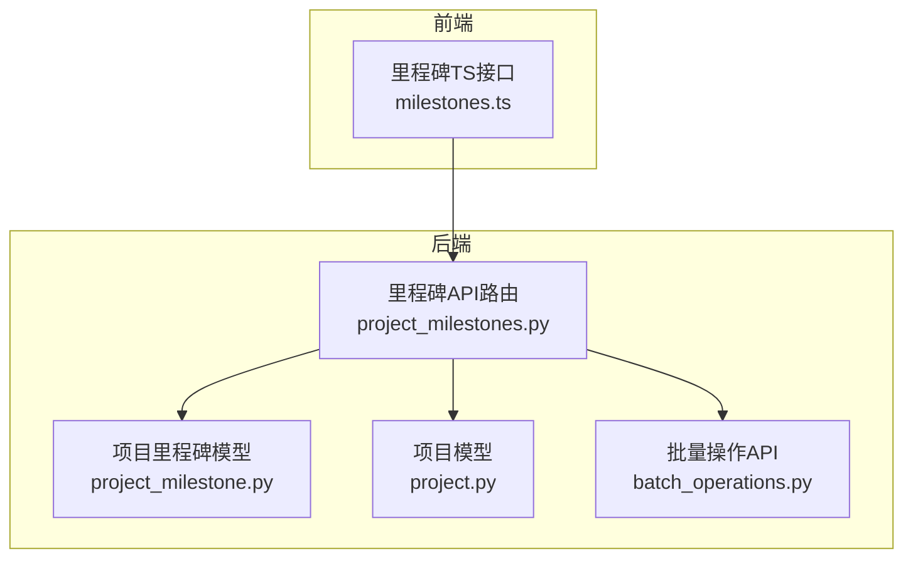
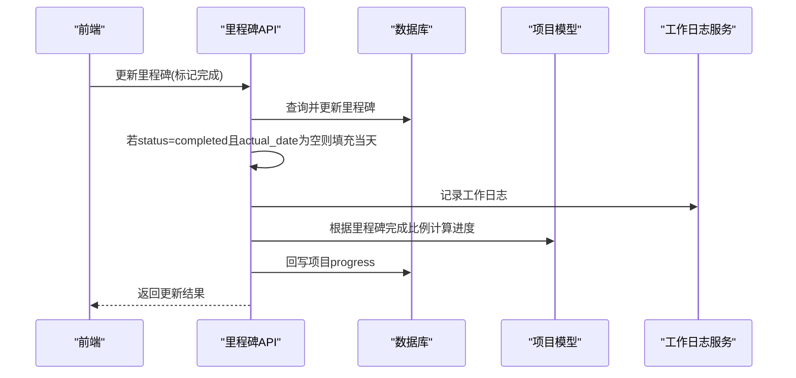
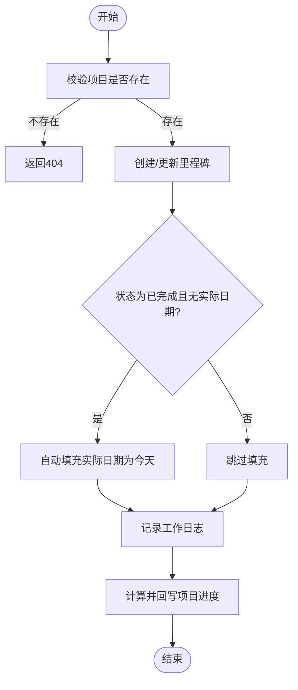
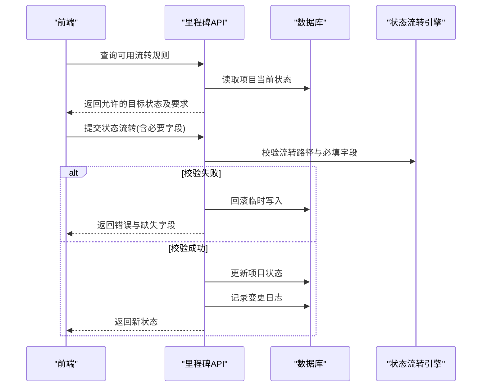
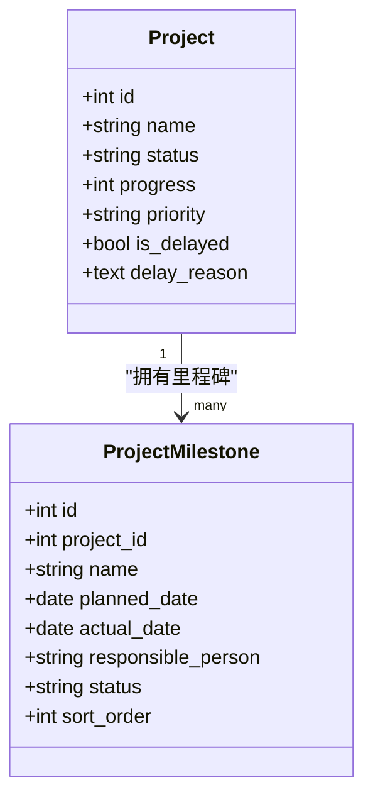
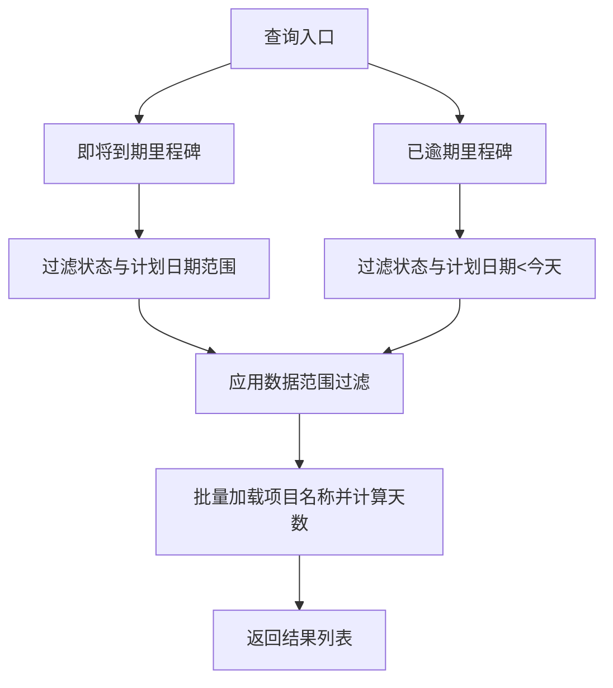
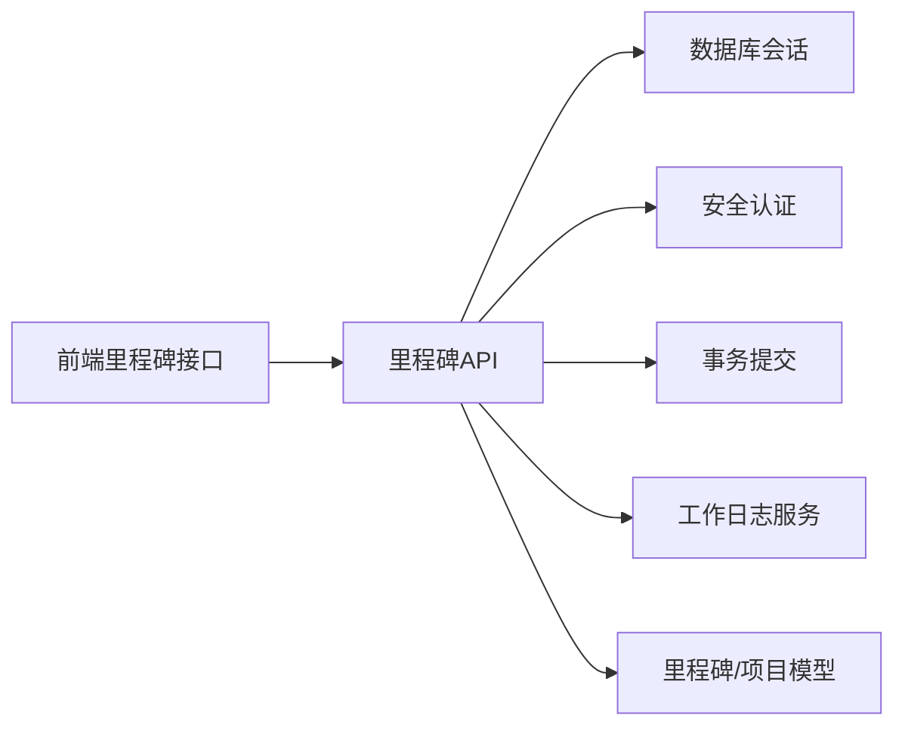

# 里程碑管理

<cite>
**本文引用的文件**
- [backend/app/models/project_milestone.py](file://backend/app/models/project_milestone.py)
- [backend/app/api/v1/project_milestones.py](file://backend/app/api/v1/project_milestones.py)
- [backend/app/models/project.py](file://backend/app/models/project.py)
- [frontend/src/api/milestones.ts](file://frontend/src/api/milestones.ts)
- [backend/app/api/v1/batch_operations.py](file://backend/app/api/v1/batch_operations.py)
</cite>

## 目录
1. [简介](#简介)
2. [项目结构](#项目结构)
3. [核心组件](#核心组件)
4. [架构总览](#架构总览)
5. [详细组件分析](#详细组件分析)
6. [依赖关系分析](#依赖关系分析)
7. [性能考虑](#性能考虑)
8. [故障排查指南](#故障排查指南)
9. [结论](#结论)
10. [附录](#附录)

## 简介
本指南面向使用与运维人员，系统化说明里程碑管理的创建、配置、状态跟踪、报告与批量操作能力。内容覆盖：
- 里程碑名称定义、时间节点设置、优先级排序等核心配置
- 里程碑与项目进度的关联关系（自动进度回写）
- 依赖关系、前置条件检查与状态流转规则
- 状态跟踪（进行中、已完成、延期等）的更新与管理
- 报告能力（即将到期、已逾期统计）
- 批量操作与模板化思路
- 最佳实践与常见问题解决方案

## 项目结构
里程碑功能由后端模型、API 路由与前端接口组成，形成“数据模型—业务逻辑—对外接口—前端调用”的清晰分层。

图表来源
- [backend/app/models/project_milestone.py:12-57](file://backend/app/models/project_milestone.py#L12-L57)
- [backend/app/api/v1/project_milestones.py:105-213](file://backend/app/api/v1/project_milestones.py#L105-L213)
- [backend/app/models/project.py:47-104](file://backend/app/models/project.py#L47-L104)
- [frontend/src/api/milestones.ts:7-55](file://frontend/src/api/milestones.ts#L7-L55)
- [backend/app/api/v1/batch_operations.py:121-220](file://backend/app/api/v1/batch_operations.py#L121-L220)

章节来源
- [backend/app/models/project_milestone.py:12-57](file://backend/app/models/project_milestone.py#L12-L57)
- [backend/app/api/v1/project_milestones.py:105-213](file://backend/app/api/v1/project_milestones.py#L105-L213)
- [backend/app/models/project.py:47-104](file://backend/app/models/project.py#L47-L104)
- [frontend/src/api/milestones.ts:7-55](file://frontend/src/api/milestones.ts#L7-L55)
- [backend/app/api/v1/batch_operations.py:121-220](file://backend/app/api/v1/batch_operations.py#L121-L220)

## 核心组件
- 里程碑数据模型：包含名称、描述、计划完成日期、实际完成日期、负责人、状态、排序序号等字段，并建立与项目的关联关系。
- 里程碑API：提供列表、新增、更新、删除、状态流转查询与执行、变更记录查询、即将到期/已逾期里程碑查询等能力。
- 项目模型：承载项目基本信息、进度、优先级、是否延期及延期原因等，用于与里程碑联动。
- 前端接口：封装里程碑CRUD与进度汇总方法，便于页面调用。
- 批量操作API：提供跨表的批量更新、删除、导出能力，可用于大规模里程碑数据的统一维护。

章节来源
- [backend/app/models/project_milestone.py:12-57](file://backend/app/models/project_milestone.py#L12-L57)
- [backend/app/api/v1/project_milestones.py:105-213](file://backend/app/api/v1/project_milestones.py#L105-L213)
- [backend/app/models/project.py:47-104](file://backend/app/models/project.py#L47-L104)
- [frontend/src/api/milestones.ts:7-55](file://frontend/src/api/milestones.ts#L7-L55)
- [backend/app/api/v1/batch_operations.py:121-220](file://backend/app/api/v1/batch_operations.py#L121-L220)

## 架构总览
里程碑管理与项目进度通过“里程碑变更→计算进度→回写项目进度”的机制紧密耦合；同时提供状态流转校验与审计日志记录，确保流程可控可追溯。

图表来源
- [backend/app/api/v1/project_milestones.py:143-180](file://backend/app/api/v1/project_milestones.py#L143-L180)
- [backend/app/api/v1/project_milestones.py:458-464](file://backend/app/api/v1/project_milestones.py#L458-L464)
- [backend/app/models/project_milestone.py:181-186](file://backend/app/models/project_milestone.py#L181-L186)

## 详细组件分析

### 里程碑数据模型与索引
- 关键字段：名称、描述、计划完成日期、实际完成日期、负责人、状态、排序序号、创建/更新时间。
- 索引优化：针对项目ID、状态、计划完成日期建立索引，提升查询效率。
- 关联关系：与项目存在一对多关系，支持通过项目反向获取里程碑集合。

章节来源
- [backend/app/models/project_milestone.py:12-57](file://backend/app/models/project_milestone.py#L12-L57)

### 里程碑API与业务流程
- 列表：按排序序号与计划日期排序返回里程碑清单。
- 新增：校验所属项目存在后写入里程碑，并记录工作日志。
- 更新：支持更新名称、描述、计划日期、实际日期、负责人、状态、排序；当状态为“已完成”且未填写实际日期时自动填充当天。
- 删除：删除里程碑并记录工作日志。
- 自动进度回写：在增删改后，基于里程碑完成比例计算并回写项目进度。

图表来源
- [backend/app/api/v1/project_milestones.py:121-180](file://backend/app/api/v1/project_milestones.py#L121-L180)
- [backend/app/api/v1/project_milestones.py:458-464](file://backend/app/api/v1/project_milestones.py#L458-L464)

章节来源
- [backend/app/api/v1/project_milestones.py:121-180](file://backend/app/api/v1/project_milestones.py#L121-L180)
- [backend/app/api/v1/project_milestones.py:458-464](file://backend/app/api/v1/project_milestones.py#L458-L464)

### 状态流转与前置条件检查
- 合法流转路径：定义了从草稿到待审批、已审批、进行中、已完成、取消等状态的允许跳转。
- 准入条件：不同流转路径可能要求填写特定字段（如启动需实际开始日期，完成需实际结束日期与成果）。
- 流转查询：提供当前项目可用目标状态及对应要求的查询接口，便于前端展示与引导。
- 流转执行：将请求中携带的必填字段临时写入项目，进行校验；校验失败回滚，成功则持久化并记录变更日志。

图表来源
- [backend/app/api/v1/project_milestones.py:218-306](file://backend/app/api/v1/project_milestones.py#L218-L306)
- [backend/app/models/project_milestone.py:110-178](file://backend/app/models/project_milestone.py#L110-L178)

章节来源
- [backend/app/api/v1/project_milestones.py:218-306](file://backend/app/api/v1/project_milestones.py#L218-L306)
- [backend/app/models/project_milestone.py:110-178](file://backend/app/models/project_milestone.py#L110-L178)

### 里程碑与项目进度的关联
- 进度计算：根据里程碑完成数量占总数的比例计算项目进度百分比。
- 自动回写：在里程碑增删改后，自动触发进度计算并更新项目进度字段。
- 项目字段：项目包含进度、优先级、是否延期、延期原因等字段，便于综合评估。

图表来源
- [backend/app/models/project.py:47-104](file://backend/app/models/project.py#L47-L104)
- [backend/app/models/project_milestone.py:12-57](file://backend/app/models/project_milestone.py#L12-L57)
- [backend/app/api/v1/project_milestones.py:458-464](file://backend/app/api/v1/project_milestones.py#L458-L464)
- [backend/app/models/project_milestone.py:181-186](file://backend/app/models/project_milestone.py#L181-L186)

章节来源
- [backend/app/models/project.py:47-104](file://backend/app/models/project.py#L47-L104)
- [backend/app/models/project_milestone.py:181-186](file://backend/app/models/project_milestone.py#L181-L186)
- [backend/app/api/v1/project_milestones.py:458-464](file://backend/app/api/v1/project_milestones.py#L458-L464)

### 里程碑状态跟踪与提醒
- 即将到期：查询未来N天内计划完成且未完成（待处理或进行中）的里程碑，并计算剩余天数与是否逾期。
- 已逾期：查询计划完成日期早于今天且未完成（待处理或进行中）的里程碑，并计算逾期天数。
- 数据隔离：所有查询均应用数据范围过滤，确保用户仅看到权限范围内的项目里程碑。

图表来源
- [backend/app/api/v1/project_milestones.py:342-398](file://backend/app/api/v1/project_milestones.py#L342-L398)
- [backend/app/api/v1/project_milestones.py:404-452](file://backend/app/api/v1/project_milestones.py#L404-L452)

章节来源
- [backend/app/api/v1/project_milestones.py:342-398](file://backend/app/api/v1/project_milestones.py#L342-L398)
- [backend/app/api/v1/project_milestones.py:404-452](file://backend/app/api/v1/project_milestones.py#L404-L452)

### 里程碑报告能力
- 完成情况统计：通过里程碑列表与状态聚合，可计算完成数与完成率（前端提供进度汇总方法）。
- 延期原因分析：结合项目模型的延期标志与延期原因字段，可在报表中呈现延期情况与原因。
- 改进建议生成：系统未内置AI建议生成接口；可在上层报表服务中结合历史数据与规则进行扩展。

章节来源
- [frontend/src/api/milestones.ts:48-55](file://frontend/src/api/milestones.ts#L48-L55)
- [backend/app/models/project.py:103-131](file://backend/app/models/project.py#L103-L131)

### 批量操作与模板化设置
- 批量更新/删除/导出：提供统一的批量操作接口，支持对指定表进行批量更新、删除（含软删除）与导出（xlsx/csv/json），并对敏感字段进行限制。
- 模板化思路：系统内存在消息模板、报告模板等通用模板能力；里程碑本身未提供专用模板接口，但可通过批量导入/导出与外部模板工具实现批量初始化与标准化。

章节来源
- [backend/app/api/v1/batch_operations.py:121-220](file://backend/app/api/v1/batch_operations.py#L121-L220)

### 前端集成要点
- 类型定义：定义了里程碑对象与进度汇总对象，便于前端类型安全使用。
- 接口封装：提供列表、新增、更新、删除与进度汇总方法，简化页面调用。
- 进度展示：前端可根据里程碑状态计算完成比例，并结合后端自动回写的进度字段进行展示。

章节来源
- [frontend/src/api/milestones.ts:7-55](file://frontend/src/api/milestones.ts#L7-L55)

## 依赖关系分析
- 模型依赖：里程碑模型依赖项目模型，形成一对多关系；项目模型包含进度、优先级、延期信息等字段。
- API依赖：里程碑API依赖数据库会话、安全认证、事务提交与工作日志服务；状态流转依赖状态引擎函数。
- 前端依赖：前端通过HTTP接口与后端交互，类型定义与后端模型保持一致。

图表来源
- [backend/app/api/v1/project_milestones.py:1-28](file://backend/app/api/v1/project_milestones.py#L1-L28)
- [backend/app/models/project_milestone.py:12-57](file://backend/app/models/project_milestone.py#L12-L57)
- [backend/app/models/project.py:47-104](file://backend/app/models/project.py#L47-L104)
- [frontend/src/api/milestones.ts:7-55](file://frontend/src/api/milestones.ts#L7-L55)

章节来源
- [backend/app/api/v1/project_milestones.py:1-28](file://backend/app/api/v1/project_milestones.py#L1-L28)
- [backend/app/models/project_milestone.py:12-57](file://backend/app/models/project_milestone.py#L12-L57)
- [backend/app/models/project.py:47-104](file://backend/app/models/project.py#L47-L104)
- [frontend/src/api/milestones.ts:7-55](file://frontend/src/api/milestones.ts#L7-L55)

## 性能考虑
- 索引优化：里程碑表针对项目ID、状态、计划完成日期建立索引，提升常见查询性能。
- 批量加载：即将到期与已逾期查询中，批量加载项目名称以避免N+1问题。
- 数据范围过滤：所有查询应用数据范围过滤，减少不必要的数据扫描。
- 进度计算：仅在里程碑增删改后触发进度计算，避免频繁重算。

章节来源
- [backend/app/models/project_milestone.py:17-21](file://backend/app/models/project_milestone.py#L17-L21)
- [backend/app/api/v1/project_milestones.py:377-398](file://backend/app/api/v1/project_milestones.py#L377-L398)
- [backend/app/api/v1/project_milestones.py:433-452](file://backend/app/api/v1/project_milestones.py#L433-L452)
- [backend/app/api/v1/project_milestones.py:458-464](file://backend/app/api/v1/project_milestones.py#L458-L464)

## 故障排查指南
- 里程碑不存在：更新或删除时若找不到里程碑，将返回404错误，请检查项目ID与里程碑ID是否正确。
- 状态流转非法：尝试不合法的流转路径或缺少必填字段时，会返回错误信息与缺失字段列表，请按提示补齐后再试。
- 进度未更新：确认是否在里程碑增删改后触发了自动进度回写；检查项目进度字段是否被其他逻辑覆盖。
- 数据权限问题：即将到期与已逾期查询受数据范围限制，若结果为空，请确认当前用户是否有权限访问对应项目。

章节来源
- [backend/app/api/v1/project_milestones.py:143-180](file://backend/app/api/v1/project_milestones.py#L143-L180)
- [backend/app/api/v1/project_milestones.py:218-306](file://backend/app/api/v1/project_milestones.py#L218-L306)
- [backend/app/api/v1/project_milestones.py:342-398](file://backend/app/api/v1/project_milestones.py#L342-L398)
- [backend/app/api/v1/project_milestones.py:404-452](file://backend/app/api/v1/project_milestones.py#L404-L452)

## 结论
里程碑管理通过清晰的模型设计、完善的API能力与自动化的进度回写机制，实现了从创建、配置、状态跟踪到报告的全流程管理。借助状态流转校验与审计日志，确保了操作的合规性与可追溯性。批量操作与模板化思路为大规模里程碑维护提供了便利。建议在实践中结合数据范围过滤与索引优化，保障性能与安全。

## 附录
- 里程碑字段说明：名称、描述、计划完成日期、实际完成日期、负责人、状态、排序序号、创建/更新时间。
- 项目字段说明：进度、优先级、是否延期、延期原因等，用于综合评估与报告。
- 常用接口：
  - 里程碑列表、新增、更新、删除
  - 状态流转规则查询与执行
  - 变更记录查询
  - 即将到期与已逾期里程碑查询
  - 批量更新、删除、导出

章节来源
- [backend/app/models/project_milestone.py:12-57](file://backend/app/models/project_milestone.py#L12-L57)
- [backend/app/models/project.py:47-104](file://backend/app/models/project.py#L47-L104)
- [backend/app/api/v1/project_milestones.py:105-464](file://backend/app/api/v1/project_milestones.py#L105-L464)
- [backend/app/api/v1/batch_operations.py:121-220](file://backend/app/api/v1/batch_operations.py#L121-L220)
- [frontend/src/api/milestones.ts:7-55](file://frontend/src/api/milestones.ts#L7-L55)