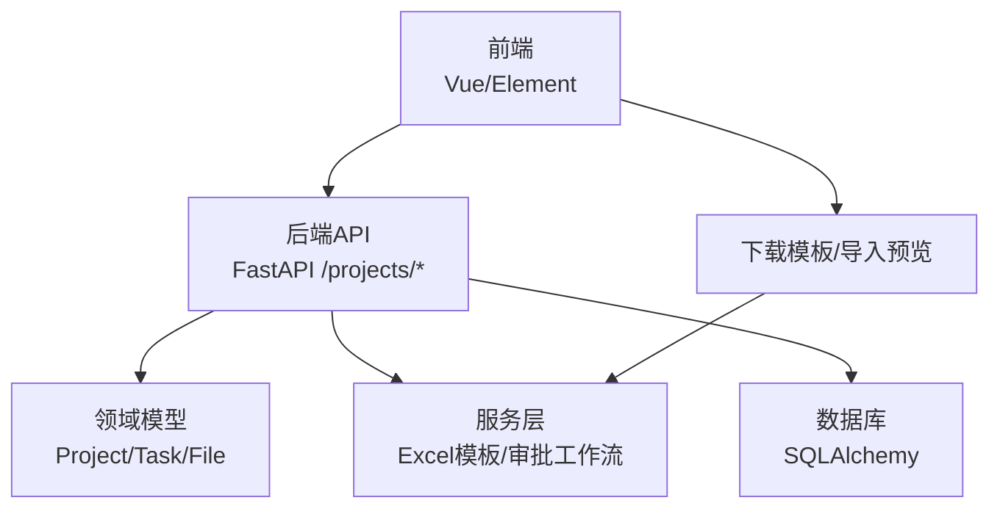
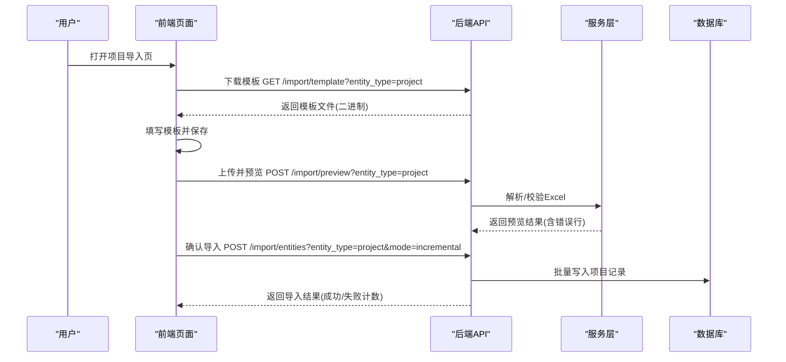
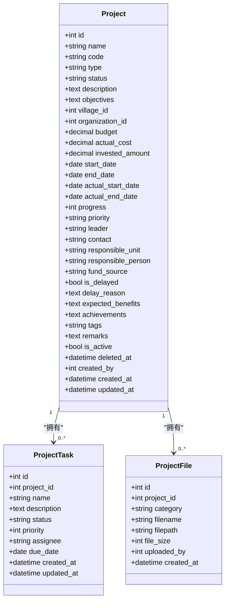
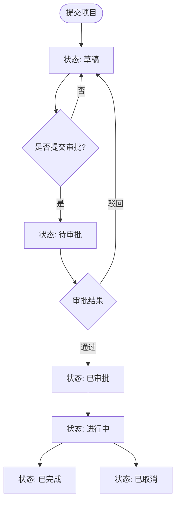
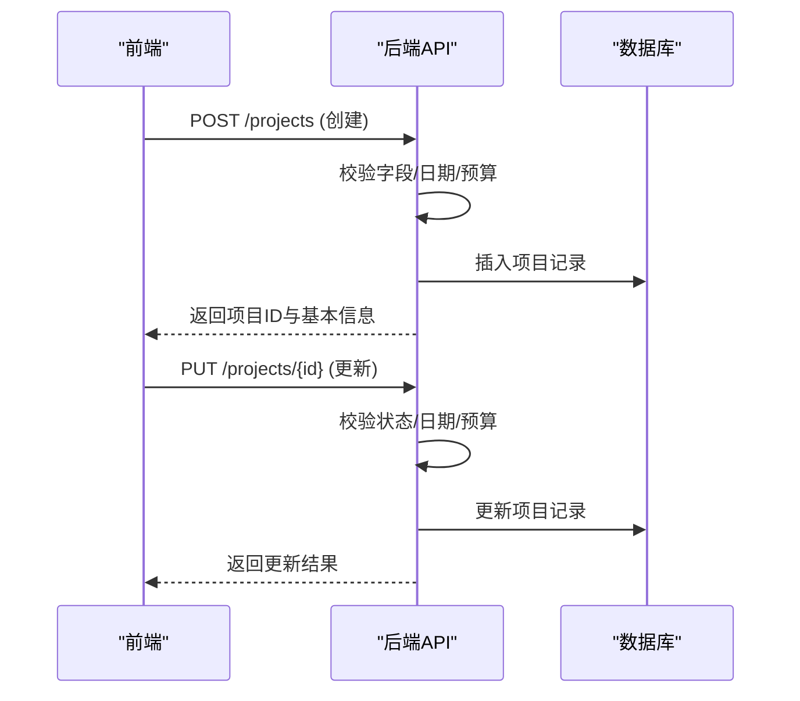
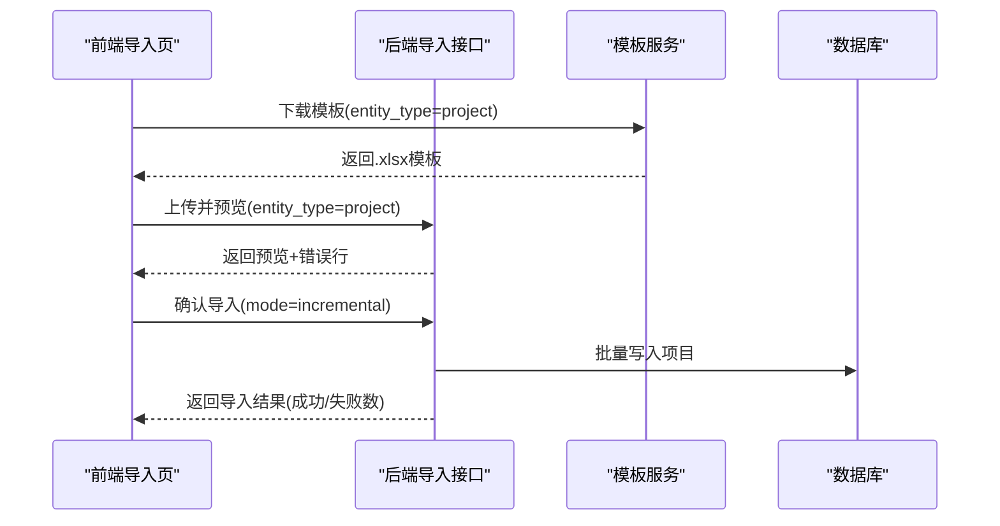
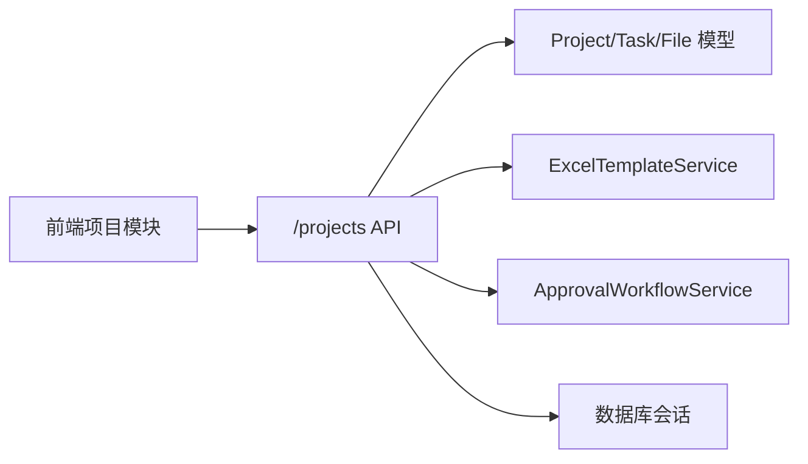

# 项目创建与基础管理

<cite>
**本文引用的文件**
- [backend/app/models/project.py](file://backend/app/models/project.py)
- [backend/app/schemas/project.py](file://backend/app/schemas/project.py)
- [backend/app/api/v1/projects.py](file://backend/app/api/v1/projects.py)
- [backend/app/services/excel_template_service.py](file://backend/app/services/excel_template_service.py)
- [backend/app/services/approval_workflow_service.py](file://backend/app/services/approval_workflow_service.py)
- [frontend/src/api/projects.ts](file://frontend/src/api/projects.ts)
- [frontend/src/views/projects/Import.vue](file://frontend/src/views/projects/Import.vue)
</cite>

## 目录
1. [简介](#简介)
2. [项目结构](#项目结构)
3. [核心组件](#核心组件)
4. [架构总览](#架构总览)
5. [详细组件分析](#详细组件分析)
6. [依赖关系分析](#依赖关系分析)
7. [性能考虑](#性能考虑)
8. [故障排查指南](#故障排查指南)
9. [结论](#结论)
10. [附录](#附录)

## 简介
本指南面向系统使用者与实施人员，围绕“项目创建与基础管理”提供端到端操作说明。内容涵盖：
- 项目基本信息填写（名称、类型、地区、年份等）、描述编写、预算编制、负责人分配等核心字段设置
- 项目模板使用与批量导入流程
- 项目状态管理机制（草稿、待审批、已审批等）及切换规则
- 项目编辑（信息修改、附件上传、成员/任务管理）
- 项目删除与回收站操作
- 最佳实践与常见问题解决方案

## 项目结构
本项目采用前后端分离架构：
- 后端以 FastAPI 暴露 RESTful API，包含模型定义、Schema 校验、业务服务与模板生成
- 前端基于 Vue + Element Plus，提供项目列表、详情、导入、文件管理等页面
- 数据持久化通过 SQLAlchemy ORM 映射到数据库表，支持软删除与权限隔离

图表来源
- [backend/app/api/v1/projects.py:657-753](file://backend/app/api/v1/projects.py#L657-L753)
- [backend/app/models/project.py:47-175](file://backend/app/models/project.py#L47-L175)
- [backend/app/services/excel_template_service.py:256-323](file://backend/app/services/excel_template_service.py#L256-L323)

章节来源
- [backend/app/api/v1/projects.py:657-753](file://backend/app/api/v1/projects.py#L657-L753)
- [backend/app/models/project.py:47-175](file://backend/app/models/project.py#L47-L175)

## 核心组件
- 项目模型与枚举：定义项目实体、状态、类型、关联关系与软删标记
- 请求/响应 Schema：用于参数校验与返回结构约束
- 项目管理 API：提供列表、详情、创建、更新、导出、统计、导入、文件、任务、经费等接口
- Excel 模板服务：生成标准 A4 打印版导入模板，含下拉校验与示例行
- 审批工作流服务：注册并执行审批终态回写，驱动项目状态流转

章节来源
- [backend/app/models/project.py:25-175](file://backend/app/models/project.py#L25-L175)
- [backend/app/schemas/project.py:9-75](file://backend/app/schemas/project.py#L9-L75)
- [backend/app/api/v1/projects.py:152-258](file://backend/app/api/v1/projects.py#L152-L258)
- [backend/app/services/excel_template_service.py:91-323](file://backend/app/services/excel_template_service.py#L91-L323)
- [backend/app/services/approval_workflow_service.py:30-70](file://backend/app/services/approval_workflow_service.py#L30-L70)

## 架构总览
下图展示从前端发起项目创建/导入到后端处理、审批回写与数据落库的完整链路。

图表来源
- [frontend/src/views/projects/Import.vue:354-482](file://frontend/src/views/projects/Import.vue#L354-L482)
- [backend/app/services/excel_template_service.py:256-323](file://backend/app/services/excel_template_service.py#L256-L323)

## 详细组件分析

### 项目模型与字段体系
- 项目主表 projects：包含名称、编号、类型、状态、描述、目标、帮扶村、负责单位、预算、实际花费、投资额、起止日期、进度、优先级、负责人、联系方式、资金来源、拨款/收款账户信息、紧急程度、合同号、资金负责人、资金使用计划、是否延期、延期原因、预期效益、成果、标签、备注、扩展经济指标、软删标记、创建人/时间、更新时间等
- 项目任务 project_tasks：任务名、描述、状态、优先级、负责人、截止日期、创建/更新时间
- 项目附件 project_files：按阶段分类存储（研究/实施/验收/照片），记录文件名、路径、大小、上传人、上传时间

图表来源
- [backend/app/models/project.py:47-175](file://backend/app/models/project.py#L47-L175)
- [backend/app/models/project.py:239-320](file://backend/app/models/project.py#L239-L320)

章节来源
- [backend/app/models/project.py:47-175](file://backend/app/models/project.py#L47-L175)
- [backend/app/models/project.py:239-320](file://backend/app/models/project.py#L239-L320)

### 项目状态管理与审批闭环
- 状态枚举：草稿(draft)、待审批(pending)、已审批(approved)、进行中(in_progress)、已完成(completed)、已取消(cancelled)
- 审批终态回写：当审批任务为“通过”且项目当前状态为“待审批”时，自动将项目状态更新为“已审批”，实现审批板块与项目板块的闭环

图表来源
- [backend/app/models/project.py:25-34](file://backend/app/models/project.py#L25-L34)
- [backend/app/api/v1/projects.py:100-112](file://backend/app/api/v1/projects.py#L100-L112)
- [backend/app/services/approval_workflow_service.py:30-70](file://backend/app/services/approval_workflow_service.py#L30-L70)

章节来源
- [backend/app/models/project.py:25-34](file://backend/app/models/project.py#L25-L34)
- [backend/app/api/v1/projects.py:100-112](file://backend/app/api/v1/projects.py#L100-L112)
- [backend/app/services/approval_workflow_service.py:30-70](file://backend/app/services/approval_workflow_service.py#L30-L70)

### 项目创建与编辑
- 创建项目：支持必填字段校验（如名称、日期格式、结束不早于开始、预算非负等），可自动生成项目编号；支持地区与年份筛选查询
- 更新项目：允许选择性更新关键字段（名称、类型、描述、预算、日期、进度、状态、负责人、联系方式、紧急程度、合同号、资金信息等），并对状态进行合法性校验
- 列表与详情：支持分页、关键词搜索、类型/状态/村庄/地区/年份过滤、排序；详情返回完整字段与关联数量（经费、任务）

图表来源
- [backend/app/api/v1/projects.py:790-800](file://backend/app/api/v1/projects.py#L790-L800)
- [backend/app/api/v1/projects.py:152-258](file://backend/app/api/v1/projects.py#L152-L258)
- [backend/app/api/v1/projects.py:657-753](file://backend/app/api/v1/projects.py#L657-L753)

章节来源
- [backend/app/api/v1/projects.py:152-258](file://backend/app/api/v1/projects.py#L152-L258)
- [backend/app/api/v1/projects.py:657-753](file://backend/app/api/v1/projects.py#L657-L753)
- [backend/app/api/v1/projects.py:790-800](file://backend/app/api/v1/projects.py#L790-L800)

### 项目模板与批量导入
- 模板下载：前端调用模板接口获取标准 .xlsx 模板，模板包含标题区、数据表头、示例行、下拉校验与填写说明
- 数据预览：上传后服务端解析并返回预览数据与错误行，前端展示校验结果
- 确认导入：确认后执行增量导入，返回成功/失败统计

图表来源
- [frontend/src/views/projects/Import.vue:354-482](file://frontend/src/views/projects/Import.vue#L354-L482)
- [backend/app/services/excel_template_service.py:256-323](file://backend/app/services/excel_template_service.py#L256-L323)

章节来源
- [frontend/src/views/projects/Import.vue:354-482](file://frontend/src/views/projects/Import.vue#L354-L482)
- [backend/app/services/excel_template_service.py:256-323](file://backend/app/services/excel_template_service.py#L256-L323)

### 项目附件与成员/任务管理
- 附件上传：支持按阶段分类上传（研究/实施/验收/照片），提供列表、下载、预览、删除能力
- 任务管理：支持创建、更新、删除项目任务，任务包含名称、描述、状态、优先级、负责人、截止日期等
- 经费关联：支持查看与添加项目经费项，便于后续预算执行跟踪

章节来源
- [frontend/src/api/projects.ts:55-88](file://frontend/src/api/projects.ts#L55-L88)
- [backend/app/models/project.py:239-320](file://backend/app/models/project.py#L239-L320)

### 项目删除与回收站
- 软删除：项目支持软删标记（is_active）与删除时间（deleted_at），默认列表隐藏已软删记录
- 恢复与彻底删除：提供恢复接口与彻底删除接口（需二次确认密码），管理员可通过参数控制是否显示已软删记录
- 审计可见性：详情返回“为何可见”的元数据，便于审计与排障

章节来源
- [backend/app/models/project.py:143-146](file://backend/app/models/project.py#L143-L146)
- [backend/app/api/v1/projects.py:657-753](file://backend/app/api/v1/projects.py#L657-L753)
- [frontend/src/api/projects.ts:36-40](file://frontend/src/api/projects.ts#L36-L40)

## 依赖关系分析
- 前端依赖后端接口：项目CRUD、导入、文件、任务、经费、统计、导出、回收站
- 后端依赖模型与服务：项目模型、Excel模板服务、审批工作流服务、数据库会话
- 权限与范围：统一的数据权限适配，支持组织维度隔离与下级组织可见

图表来源
- [frontend/src/api/projects.ts:29-98](file://frontend/src/api/projects.ts#L29-L98)
- [backend/app/api/v1/projects.py:1-50](file://backend/app/api/v1/projects.py#L1-L50)
- [backend/app/services/excel_template_service.py:91-323](file://backend/app/services/excel_template_service.py#L91-L323)
- [backend/app/services/approval_workflow_service.py:30-70](file://backend/app/services/approval_workflow_service.py#L30-L70)

章节来源
- [frontend/src/api/projects.ts:29-98](file://frontend/src/api/projects.ts#L29-L98)
- [backend/app/api/v1/projects.py:1-50](file://backend/app/api/v1/projects.py#L1-L50)

## 性能考虑
- 列表查询优化：使用 selectinload 预加载关联（任务、经费、村庄、组织），避免 N+1 查询
- 批量计算经费健康度：一次性拉取多项目经费并在内存分组计算执行率与偏差率
- 导出限制：导出上限 10000 条，防止内存溢出；优先使用 openpyxl 生成 xlsx，降级为 csv
- 索引设计：对状态、类型、村庄、组织、创建人、开始/结束日期、是否启用等多列建立单列与复合索引，提升常见查询效率

章节来源
- [backend/app/api/v1/projects.py:680-731](file://backend/app/api/v1/projects.py#L680-L731)
- [backend/app/api/v1/projects.py:555-651](file://backend/app/api/v1/projects.py#L555-L651)
- [backend/app/models/project.py:52-68](file://backend/app/models/project.py#L52-L68)

## 故障排查指南
- 日期格式错误：确保 YYYY-MM-DD 格式，否则校验失败
- 结束日期早于开始日期：校验器会拒绝该请求
- 无效状态：仅允许枚举值，非法状态将被拒绝
- 导入失败：检查模板列顺序与必填字段，关注预览阶段的错误行提示
- 权限问题：跨组织访问会被拒绝，确认当前用户所属组织或是否为管理员
- 回收站误删：如需恢复，使用恢复接口；彻底删除需二次确认密码

章节来源
- [backend/app/api/v1/projects.py:188-203](file://backend/app/api/v1/projects.py#L188-L203)
- [backend/app/api/v1/projects.py:251-257](file://backend/app/api/v1/projects.py#L251-L257)
- [frontend/src/views/projects/Import.vue:408-447](file://frontend/src/views/projects/Import.vue#L408-L447)
- [backend/app/api/v1/projects.py:127-146](file://backend/app/api/v1/projects.py#L127-L146)

## 结论
本项目提供了完善的项目创建与基础管理能力，覆盖从模板下载、数据导入、状态审批到编辑、附件与任务管理的完整生命周期。通过严格的字段校验、权限隔离与性能优化，保障数据质量与系统稳定性。建议在实际使用中遵循最佳实践，确保数据准确、流程合规、操作留痕。

## 附录
- 常用字段说明
  - 项目名称/编号：唯一标识，编号可自动生成
  - 项目类型：基础设施、教育、医疗、农业、工业、其他
  - 地区/年份：通过帮扶村与开始日期进行筛选
  - 预算/实际花费/已投资：金额单位为万元
  - 起止日期：严格校验格式与先后关系
  - 负责人/联系方式：可加密存储敏感信息
  - 资金来源/拨款与收款账户：便于财务对接
  - 紧急程度/优先级：辅助资源调度
  - 是否延期/延期原因：进度跟踪与复盘
  - 预期效益/成果：评估指标
  - 标签/备注：灵活扩展
- 最佳实践
  - 使用标准模板批量导入，减少手工录入错误
  - 先草稿再提交审批，确保关键信息完整
  - 定期导出备份，结合统计看板监控进度与预算执行
  - 附件按阶段分类归档，便于验收与审计
- 常见问题
  - 导入后未生效：检查预览错误行与状态流转
  - 无法编辑他人项目：确认是否为创建人或具备管理员权限
  - 导出为空：确认筛选条件与权限范围