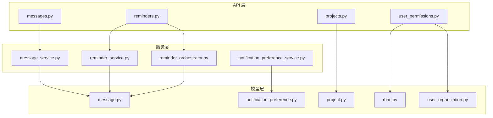
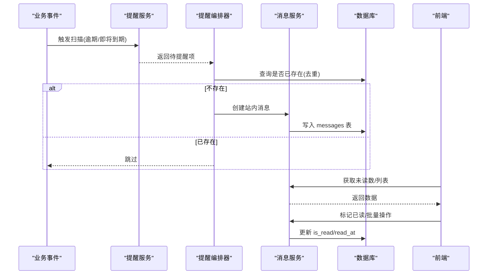
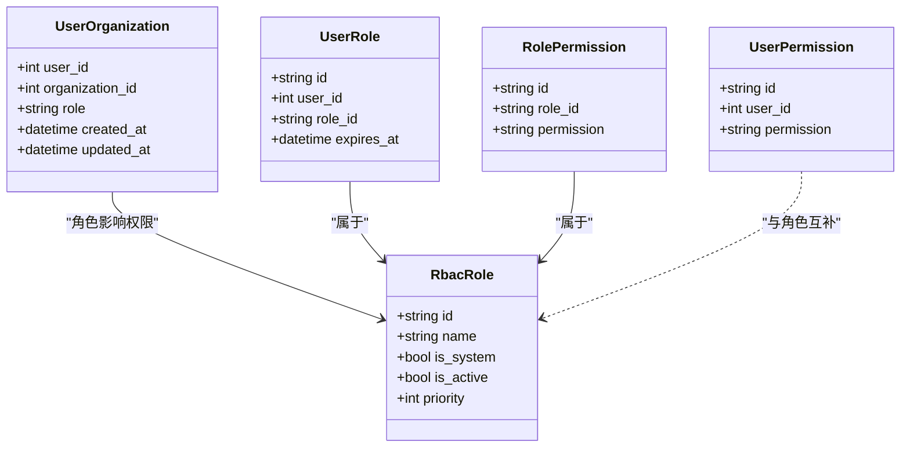
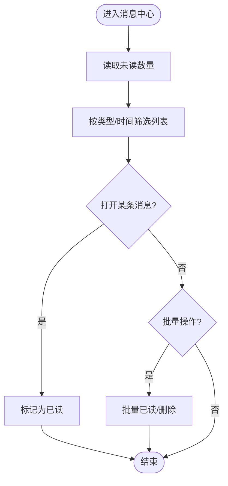
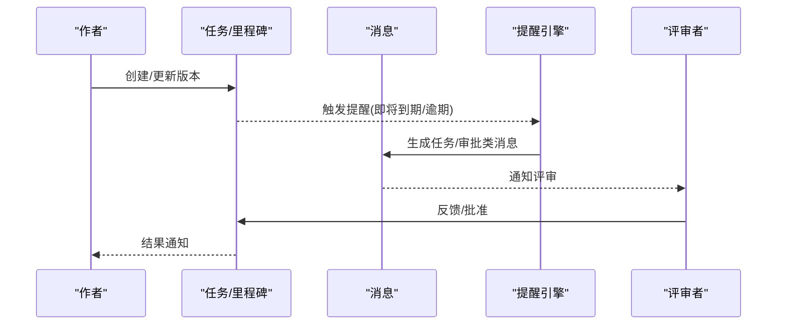
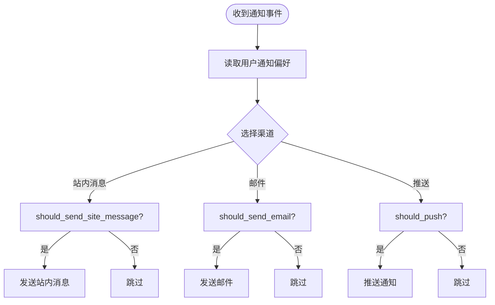
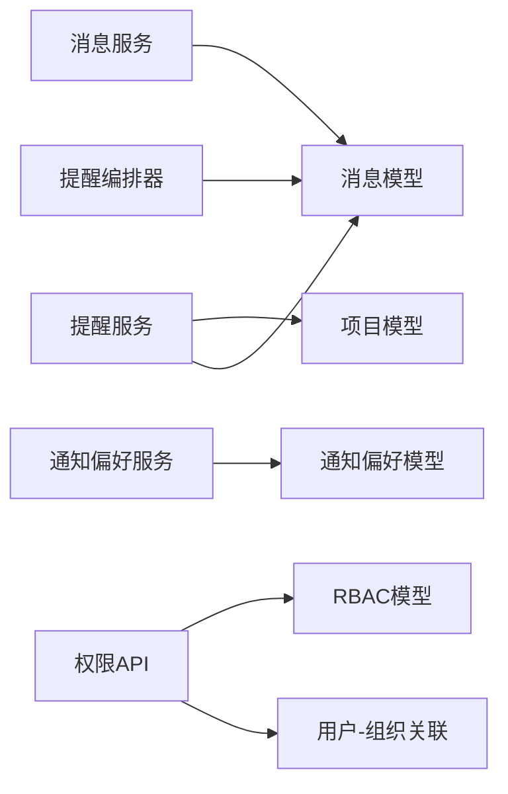

# 项目协作与沟通

<cite>
**本文引用的文件**
- [backend/app/models/message.py](file://backend/app/models/message.py)
- [backend/app/services/message_service.py](file://backend/app/services/message_service.py)
- [backend/app/models/notification_preference.py](file://backend/app/models/notification_preference.py)
- [backend/app/services/notification_preference_service.py](file://backend/app/services/notification_preference_service.py)
- [backend/app/models/project.py](file://backend/app/models/project.py)
- [backend/app/models/rbac.py](file://backend/app/models/rbac.py)
- [backend/app/models/user_organization.py](file://backend/app/models/user_organization.py)
- [backend/app/api/v1/messages.py](file://backend/app/api/v1/messages.py)
- [backend/app/api/v1/reminders.py](file://backend/app/api/v1/reminders.py)
- [backend/app/api/v1/projects.py](file://backend/app/api/v1/projects.py)
- [backend/app/api/v1/user_permissions.py](file://backend/app/api/v1/user_permissions.py)
- [backend/app/services/reminder_service.py](file://backend/app/services/reminder_service.py)
- [backend/app/services/reminder_orchestrator.py](file://backend/app/services/reminder_orchestrator.py)
</cite>

## 目录
1. [简介](#简介)
2. [项目结构](#项目结构)
3. [核心组件](#核心组件)
4. [架构总览](#架构总览)
5. [详细组件分析](#详细组件分析)
6. [依赖关系分析](#依赖关系分析)
7. [性能考虑](#性能考虑)
8. [故障排查指南](#故障排查指南)
9. [结论](#结论)
10. [附录](#附录)

## 简介
本操作指南聚焦“项目协作与沟通”能力，覆盖以下主题：
- 项目团队成员管理：成员邀请、角色分配、权限设置
- 项目内消息通信：站内消息、文件共享、评论讨论（以消息与附件为核心）
- 项目文档协作：版本控制、在线编辑、协同审核（结合任务与提醒机制）
- 通知机制：邮件通知、系统提醒、移动端推送（基于偏好配置）
- 会议管理与会议纪要：通过任务与消息进行组织与归档
- 最佳实践与团队协作规范建议

## 项目结构
围绕协作与沟通的后端关键模块包括：
- 数据模型层：消息、通知偏好、项目与项目文件、RBAC 角色与权限、用户-组织关联
- 服务层：消息服务、通知偏好服务、提醒引擎与编排器
- API 层：消息接口、提醒接口、项目接口、用户权限接口

图表来源
- [backend/app/api/v1/messages.py](file://backend/app/api/v1/messages.py)
- [backend/app/api/v1/reminders.py](file://backend/app/api/v1/reminders.py)
- [backend/app/api/v1/projects.py](file://backend/app/api/v1/projects.py)
- [backend/app/api/v1/user_permissions.py](file://backend/app/api/v1/user_permissions.py)
- [backend/app/services/message_service.py](file://backend/app/services/message_service.py)
- [backend/app/services/notification_preference_service.py](file://backend/app/services/notification_preference_service.py)
- [backend/app/services/reminder_service.py](file://backend/app/services/reminder_service.py)
- [backend/app/services/reminder_orchestrator.py](file://backend/app/services/reminder_orchestrator.py)
- [backend/app/models/message.py](file://backend/app/models/message.py)
- [backend/app/models/notification_preference.py](file://backend/app/models/notification_preference.py)
- [backend/app/models/project.py](file://backend/app/models/project.py)
- [backend/app/models/rbac.py](file://backend/app/models/rbac.py)
- [backend/app/models/user_organization.py](file://backend/app/models/user_organization.py)

章节来源
- [backend/app/models/message.py:25-87](file://backend/app/models/message.py#L25-L87)
- [backend/app/services/message_service.py:24-416](file://backend/app/services/message_service.py#L24-L416)
- [backend/app/models/notification_preference.py:17-132](file://backend/app/models/notification_preference.py#L17-L132)
- [backend/app/services/notification_preference_service.py:26-301](file://backend/app/services/notification_preference_service.py#L26-L301)
- [backend/app/models/project.py:47-320](file://backend/app/models/project.py#L47-L320)
- [backend/app/models/rbac.py:31-263](file://backend/app/models/rbac.py#L31-L263)
- [backend/app/models/user_organization.py:21-69](file://backend/app/models/user_organization.py#L21-L69)

## 核心组件
- 站内消息中心：支持发送系统/审批/任务三类消息，未读计数、列表筛选、已读标记、批量删除与清理。
- 通知偏好：按渠道（站内消息、邮件、实时推送）和类型（系统/审批/任务）精细化控制是否发送。
- 项目与附件：项目生命周期字段完善，项目文件按阶段分类存储，支撑文档协作与资料共享。
- 团队与权限：用户-组织多对多关系，RBAC 角色与权限，支持直接授权与资源访问控制。
- 提醒与通知编排：定时扫描逾期/即将到期等事件，生成站内消息并去重投递。

章节来源
- [backend/app/services/message_service.py:44-130](file://backend/app/services/message_service.py#L44-L130)
- [backend/app/models/notification_preference.py:62-111](file://backend/app/models/notification_preference.py#L62-L111)
- [backend/app/models/project.py:47-175](file://backend/app/models/project.py#L47-L175)
- [backend/app/models/rbac.py:31-188](file://backend/app/models/rbac.py#L31-L188)
- [backend/app/services/reminder_orchestrator.py:35-126](file://backend/app/services/reminder_orchestrator.py#L35-L126)

## 架构总览
协作与沟通的端到端流程如下：
- 业务触发（如项目截止日临近、审批超时）由提醒引擎扫描并生成提醒项
- 提醒编排器将提醒写入站内消息表，并进行幂等去重
- 前端通过消息 API 拉取未读数量与列表，用户可标记已读或批量处理
- 通知偏好决定是否需要额外发送邮件或推送

图表来源
- [backend/app/services/reminder_service.py:214-250](file://backend/app/services/reminder_service.py#L214-L250)
- [backend/app/services/reminder_orchestrator.py:35-126](file://backend/app/services/reminder_orchestrator.py#L35-L126)
- [backend/app/services/message_service.py:134-316](file://backend/app/services/message_service.py#L134-L316)
- [backend/app/models/message.py:34-68](file://backend/app/models/message.py#L34-L68)

## 详细组件分析

### 团队成员管理（邀请、角色、权限）
- 成员加入组织：通过用户-组织关联表记录用户在组织中的角色（admin/member/viewer），支持多组织场景。
- 角色与权限：使用 RBAC 模型定义角色、角色权限、用户直接权限与资源访问控制；支持过期时间与授权人记录。
- 权限校验：测试用例覆盖了分配组织角色与授予角色的权限校验逻辑，确保只有具备权限的管理员才能执行敏感操作。

图表来源
- [backend/app/models/user_organization.py:21-69](file://backend/app/models/user_organization.py#L21-L69)
- [backend/app/models/rbac.py:31-188](file://backend/app/models/rbac.py#L31-L188)

章节来源
- [backend/app/models/user_organization.py:21-69](file://backend/app/models/user_organization.py#L21-L69)
- [backend/app/models/rbac.py:31-188](file://backend/app/models/rbac.py#L31-L188)
- [backend/app/api/v1/user_permissions.py](file://backend/app/api/v1/user_permissions.py)

### 项目内消息通信（站内消息、文件共享、评论讨论）
- 站内消息：支持系统/审批/任务三类消息，提供未读计数、分页列表、按类型与时间筛选、单条/批量已读标记、批量删除与历史清理。
- 文件共享：项目附件按阶段分类存储（研究/实施/验收/照片），便于文档与资料集中管理。
- 评论讨论：可通过任务与消息组合实现（在项目中创建任务或发送任务类消息作为讨论载体）。

图表来源
- [backend/app/services/message_service.py:134-316](file://backend/app/services/message_service.py#L134-L316)
- [backend/app/models/message.py:34-68](file://backend/app/models/message.py#L34-L68)
- [backend/app/models/project.py:278-320](file://backend/app/models/project.py#L278-L320)

章节来源
- [backend/app/services/message_service.py:44-416](file://backend/app/services/message_service.py#L44-L416)
- [backend/app/models/message.py:25-87](file://backend/app/models/message.py#L25-L87)
- [backend/app/models/project.py:278-320](file://backend/app/models/project.py#L278-L320)

### 项目文档协作（版本控制、在线编辑、协同审核）
- 版本控制：通过项目任务与提醒机制驱动版本迭代（例如里程碑任务、评审任务），配合站内消息通知相关责任人。
- 在线编辑：结合项目文件与任务状态流转，多人协作编辑时通过任务指派与消息提醒推进进度。
- 协同审核：利用审批提醒与任务提醒，形成“提交—评审—修改—确认”的闭环。

图表来源
- [backend/app/services/reminder_service.py:214-250](file://backend/app/services/reminder_service.py#L214-L250)
- [backend/app/services/message_service.py:44-130](file://backend/app/services/message_service.py#L44-L130)
- [backend/app/models/project.py:239-276](file://backend/app/models/project.py#L239-L276)

章节来源
- [backend/app/models/project.py:239-320](file://backend/app/models/project.py#L239-L320)
- [backend/app/services/reminder_service.py:214-250](file://backend/app/services/reminder_service.py#L214-L250)
- [backend/app/services/message_service.py:44-130](file://backend/app/services/message_service.py#L44-L130)

### 通知机制（邮件、系统提醒、移动端推送）
- 通知偏好：用户可按渠道（站内消息/邮件/推送）与类型（系统/审批/任务）自定义接收策略。
- 默认策略：站内消息默认开启，邮件根据类型默认不同，推送默认开启。
- 过滤规则：服务层提供 should_send_site_message / should_send_email / should_push 等方法，统一决策是否发送。

图表来源
- [backend/app/models/notification_preference.py:62-111](file://backend/app/models/notification_preference.py#L62-L111)
- [backend/app/services/notification_preference_service.py:167-215](file://backend/app/services/notification_preference_service.py#L167-L215)

章节来源
- [backend/app/models/notification_preference.py:17-132](file://backend/app/models/notification_preference.py#L17-L132)
- [backend/app/services/notification_preference_service.py:26-301](file://backend/app/services/notification_preference_service.py#L26-L301)

### 会议管理与会议纪要
- 会议安排：通过创建项目任务（里程碑/任务）设定会议时间、参与人与议题。
- 会议纪要：以站内消息或任务描述形式沉淀纪要，并通过提醒引擎在会前/会后自动提醒相关人员。
- 跟进事项：将会议决议拆分为子任务，设置截止日期与负责人，逾期自动提醒。

章节来源
- [backend/app/models/project.py:239-276](file://backend/app/models/project.py#L239-L276)
- [backend/app/services/reminder_service.py:214-250](file://backend/app/services/reminder_service.py#L214-L250)
- [backend/app/services/message_service.py:44-130](file://backend/app/services/message_service.py#L44-L130)

## 依赖关系分析
- 消息服务依赖消息模型与事务封装，提供统一的增删改查与统计能力。
- 通知偏好服务依赖偏好模型，提供按渠道与类型的过滤决策。
- 提醒服务与编排器依赖项目模型与消息模型，完成事件扫描、去重与投递。
- 团队与权限模块通过 RBAC 与用户-组织关联，支撑细粒度访问控制。

图表来源
- [backend/app/services/message_service.py:24-416](file://backend/app/services/message_service.py#L24-L416)
- [backend/app/models/message.py:34-68](file://backend/app/models/message.py#L34-L68)
- [backend/app/services/notification_preference_service.py:26-301](file://backend/app/services/notification_preference_service.py#L26-L301)
- [backend/app/models/notification_preference.py:17-132](file://backend/app/models/notification_preference.py#L17-L132)
- [backend/app/services/reminder_service.py:214-250](file://backend/app/services/reminder_service.py#L214-L250)
- [backend/app/models/project.py:47-175](file://backend/app/models/project.py#L47-L175)
- [backend/app/models/rbac.py:31-188](file://backend/app/models/rbac.py#L31-L188)
- [backend/app/models/user_organization.py:21-69](file://backend/app/models/user_organization.py#L21-L69)

章节来源
- [backend/app/services/message_service.py:24-416](file://backend/app/services/message_service.py#L24-L416)
- [backend/app/services/notification_preference_service.py:26-301](file://backend/app/services/notification_preference_service.py#L26-L301)
- [backend/app/services/reminder_service.py:214-250](file://backend/app/services/reminder_service.py#L214-L250)
- [backend/app/models/project.py:47-175](file://backend/app/models/project.py#L47-L175)
- [backend/app/models/rbac.py:31-188](file://backend/app/models/rbac.py#L31-L188)
- [backend/app/models/user_organization.py:21-69](file://backend/app/models/user_organization.py#L21-L69)

## 性能考虑
- 索引优化：消息表针对 user_id、is_read、created_at 建立复合索引，提升未读计数与列表查询性能。
- 去重机制：提醒编排器通过 link+type 去重，避免重复消息造成冗余。
- 批量操作：消息已读/删除采用批量更新，减少数据库往返。
- 保留策略：消息清理按保留天数批量删除，控制存储增长。

章节来源
- [backend/app/models/message.py:61-68](file://backend/app/models/message.py#L61-L68)
- [backend/app/services/reminder_orchestrator.py:35-126](file://backend/app/services/reminder_orchestrator.py#L35-L126)
- [backend/app/services/message_service.py:254-392](file://backend/app/services/message_service.py#L254-L392)

## 故障排查指南
- 无法确定接收人：当提醒项缺少 user_id 或项目无归属人时，会记录警告并跳过，避免整批失败。
- 权限不足：分配组织角色或授予角色时，若当前用户无权限，接口返回 403。
- 无效参数：角色或数据范围不合法时，接口返回 400。
- 消息未显示：检查是否被偏好过滤或未正确标记已读；核对消息类型与筛选条件。

章节来源
- [backend/app/services/reminder_service.py:214-250](file://backend/app/services/reminder_service.py#L214-L250)
- [backend/app/services/reminder_orchestrator.py:56-64](file://backend/app/services/reminder_orchestrator.py#L56-L64)
- [backend/tests/unit/test_user_permissions.py:18-46](file://backend/tests/unit/test_user_permissions.py#L18-L46)
- [backend/tests/unit/test_auth_users_api.py:663-683](file://backend/tests/unit/test_auth_users_api.py#L663-L683)

## 结论
本项目协作与沟通体系以“消息中心 + 通知偏好 + 提醒编排”为核心，结合 RBAC 与用户-组织模型，实现了从成员管理到消息触达的完整闭环。通过项目与任务/里程碑的联动，支撑文档协作与会议管理的日常流程。建议在团队中统一使用任务与消息进行协作留痕，并合理配置通知偏好以避免信息过载。

## 附录
- 常用操作路径参考
  - 发送站内消息：[backend/app/services/message_service.py:44-130](file://backend/app/services/message_service.py#L44-L130)
  - 获取未读数量与列表：[backend/app/services/message_service.py:134-237](file://backend/app/services/message_service.py#L134-L237)
  - 标记已读/批量操作：[backend/app/services/message_service.py:254-316](file://backend/app/services/message_service.py#L254-L316)
  - 通知偏好查询与更新：[backend/app/services/notification_preference_service.py:39-119](file://backend/app/services/notification_preference_service.py#L39-L119)
  - 项目截止提醒生成：[backend/app/services/reminder_service.py:214-250](file://backend/app/services/reminder_service.py#L214-L250)
  - 提醒编排与去重：[backend/app/services/reminder_orchestrator.py:35-126](file://backend/app/services/reminder_orchestrator.py#L35-L126)
  - 项目文件上传与分类：[backend/app/models/project.py:278-320](file://backend/app/models/project.py#L278-L320)
  - 用户-组织角色管理：[backend/app/models/user_organization.py:21-69](file://backend/app/models/user_organization.py#L21-L69)
  - RBAC 角色与权限：[backend/app/models/rbac.py:31-188](file://backend/app/models/rbac.py#L31-L188)