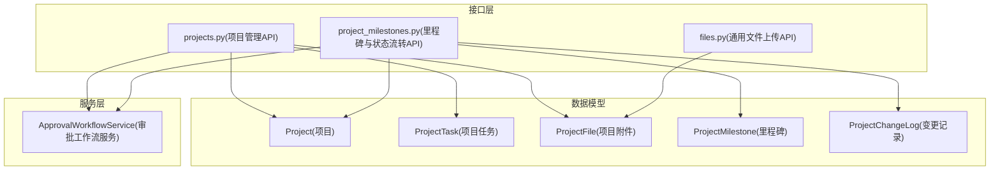
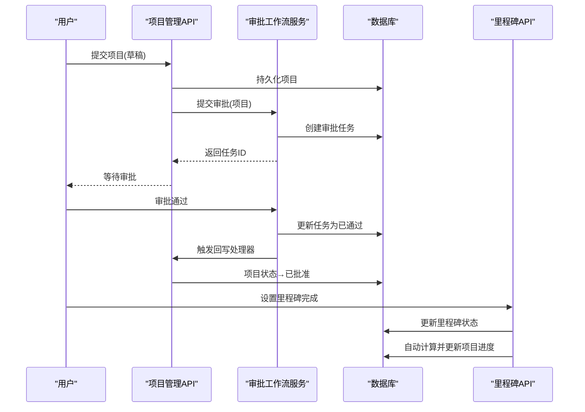
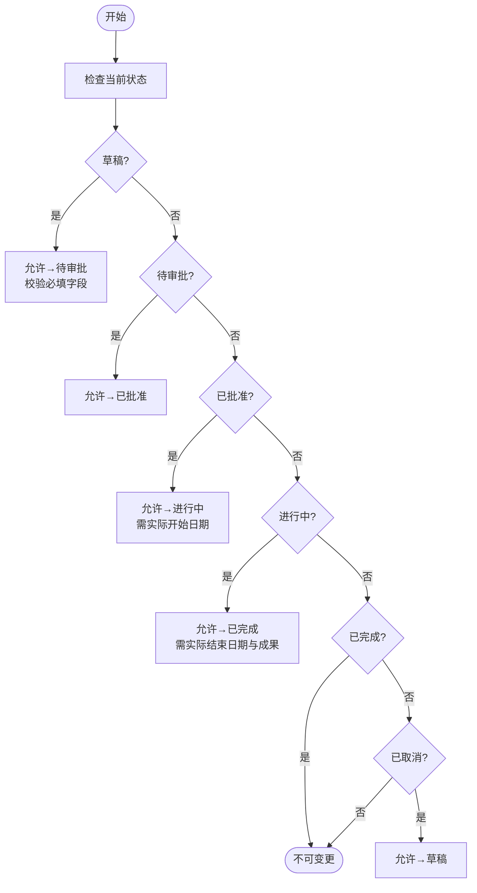
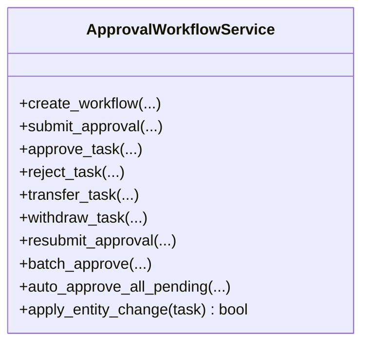
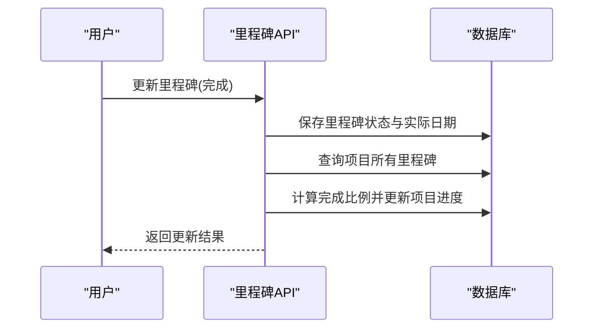
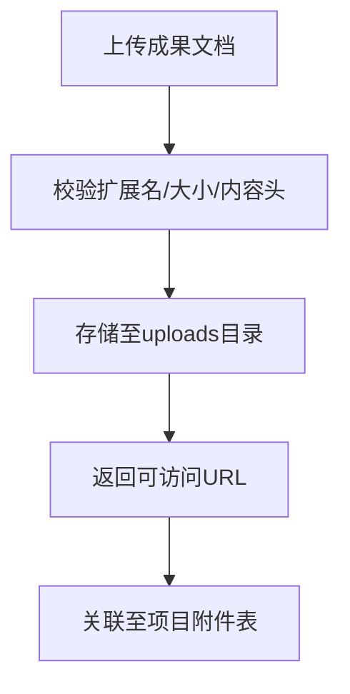
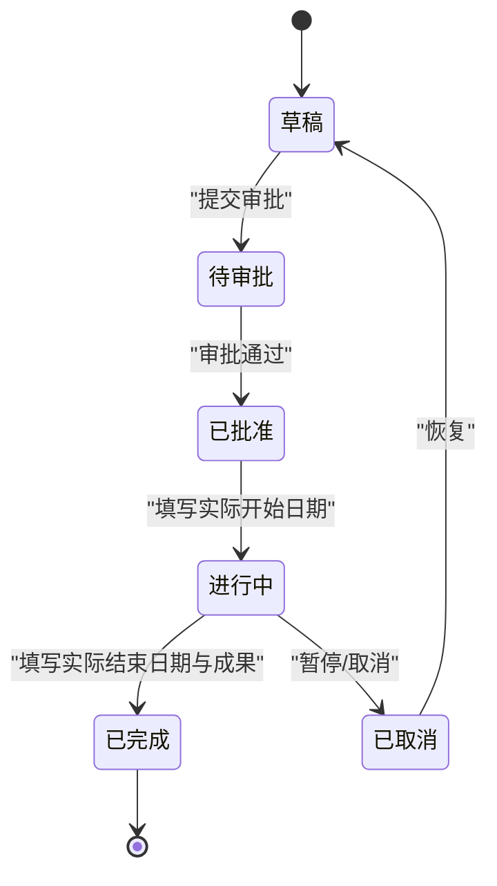
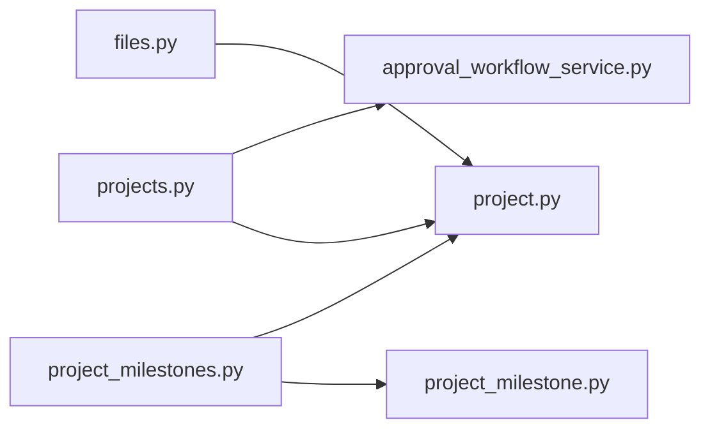

# 项目生命周期管理

<cite>
**本文引用的文件**
- [backend/app/models/project.py](file://backend/app/models/project.py)
- [backend/app/models/project_milestone.py](file://backend/app/models/project_milestone.py)
- [backend/app/api/v1/projects.py](file://backend/app/api/v1/projects.py)
- [backend/app/api/v1/project_milestones.py](file://backend/app/api/v1/project_milestones.py)
- [backend/app/services/approval_workflow_service.py](file://backend/app/services/approval_workflow_service.py)
- [backend/app/schemas/project.py](file://backend/app/schemas/project.py)
- [backend/app/api/v1/files.py](file://backend/app/api/v1/files.py)
</cite>

## 目录
1. [简介](#简介)
2. [项目结构](#项目结构)
3. [核心组件](#核心组件)
4. [架构总览](#架构总览)
5. [详细组件分析](#详细组件分析)
6. [依赖关系分析](#依赖关系分析)
7. [性能考虑](#性能考虑)
8. [故障排查指南](#故障排查指南)
9. [结论](#结论)
10. [附录](#附录)

## 简介
本指南面向乡村振兴系统的项目生命周期管理，覆盖从创建到收尾的完整流程：规划、执行、监控与收尾。重点说明：
- 项目状态流转规则、审批流程与权限控制
- 进度跟踪（里程碑驱动、完成度评估）
- 成果汇报（文档上传、验收标准、质量评估）
- 暂停、恢复与取消操作
- 最佳实践与异常处理方案

## 项目结构
后端围绕“项目模型 + 里程碑/变更记录 + 审批工作流 + API路由”组织：
- 数据模型：项目、任务、附件、里程碑、变更记录
- 服务层：审批工作流服务（含回写处理器注册机制）
- 接口层：项目管理API、里程碑与状态流转API、通用文件上传API
- 校验与响应：Pydantic Schema、统一响应封装

**图表来源**
- [backend/app/models/project.py:47-175](file://backend/app/models/project.py#L47-L175)
- [backend/app/models/project_milestone.py:12-104](file://backend/app/models/project_milestone.py#L12-L104)
- [backend/app/api/v1/projects.py:54-112](file://backend/app/api/v1/projects.py#L54-L112)
- [backend/app/api/v1/project_milestones.py:28-25](file://backend/app/api/v1/project_milestones.py#L28-L25)
- [backend/app/api/v1/files.py:19-127](file://backend/app/api/v1/files.py#L19-L127)
- [backend/app/services/approval_workflow_service.py:30-70](file://backend/app/services/approval_workflow_service.py#L30-L70)

**章节来源**
- [backend/app/models/project.py:47-175](file://backend/app/models/project.py#L47-L175)
- [backend/app/models/project_milestone.py:12-104](file://backend/app/models/project_milestone.py#L12-L104)
- [backend/app/api/v1/projects.py:54-112](file://backend/app/api/v1/projects.py#L54-L112)
- [backend/app/api/v1/project_milestones.py:28-25](file://backend/app/api/v1/project_milestones.py#L28-L25)
- [backend/app/api/v1/files.py:19-127](file://backend/app/api/v1/files.py#L19-L127)
- [backend/app/services/approval_workflow_service.py:30-70](file://backend/app/services/approval_workflow_service.py#L30-L70)

## 核心组件
- 项目模型与枚举：定义项目状态、类型、关键业务字段与索引优化
- 里程碑与变更记录：支撑进度计算与审计追踪
- 审批工作流服务：提供提交、审批、驳回、转交、批量处理与实体回写
- 项目管理API：项目CRUD、统计、导出、任务与经费关联、审批集成
- 里程碑与状态流转API：里程碑CRUD、状态流转校验与记录、仪表板查询
- 通用文件上传API：安全校验、白名单、内容嗅探、静态URL返回

**章节来源**
- [backend/app/models/project.py:25-175](file://backend/app/models/project.py#L25-L175)
- [backend/app/models/project_milestone.py:12-104](file://backend/app/models/project_milestone.py#L12-L104)
- [backend/app/services/approval_workflow_service.py:30-70](file://backend/app/services/approval_workflow_service.py#L30-L70)
- [backend/app/api/v1/projects.py:513-787](file://backend/app/api/v1/projects.py#L513-L787)
- [backend/app/api/v1/project_milestones.py:105-306](file://backend/app/api/v1/project_milestones.py#L105-L306)
- [backend/app/api/v1/files.py:39-127](file://backend/app/api/v1/files.py#L39-L127)

## 架构总览
项目生命周期由“API → 服务 → 模型”的分层架构实现，结合审批工作流进行状态变更治理，并通过里程碑驱动进度更新。

**图表来源**
- [backend/app/api/v1/projects.py:790-875](file://backend/app/api/v1/projects.py#L790-L875)
- [backend/app/services/approval_workflow_service.py:203-278](file://backend/app/services/approval_workflow_service.py#L203-L278)
- [backend/app/api/v1/project_milestones.py:143-180](file://backend/app/api/v1/project_milestones.py#L143-L180)
- [backend/app/models/project_milestone.py:181-187](file://backend/app/models/project_milestone.py#L181-L187)

## 详细组件分析

### 项目模型与状态机
- 项目状态枚举：草稿、待审批、已批准、进行中、已完成、已取消
- 合法流转路径与准入条件：
  - 草稿→待审批：需填写名称、类型、预算、开始/结束日期、负责人
  - 已批准→进行中：需填写实际开始日期
  - 进行中→已完成：需填写实际结束日期与项目成果
- 进度百分比：基于里程碑完成比例计算

**图表来源**
- [backend/app/models/project_milestone.py:110-141](file://backend/app/models/project_milestone.py#L110-L141)
- [backend/app/models/project.py:25-34](file://backend/app/models/project.py#L25-L34)

**章节来源**
- [backend/app/models/project.py:25-34](file://backend/app/models/project.py#L25-L34)
- [backend/app/models/project_milestone.py:110-141](file://backend/app/models/project_milestone.py#L110-L141)

### 审批工作流与权限控制
- 工作流CRUD：创建、查询、更新、删除；支持最多5级节点
- 任务操作：提交、通过、拒绝、转交、撤回、重新提交、批量审批、自动批量审批
- 实体回写：通过注册处理器将审批结果写回业务实体（如项目状态）
- 权限控制：单机模式可跳过审批人校验；未分配审批人的任务可由登录用户处理

**图表来源**
- [backend/app/services/approval_workflow_service.py:76-178](file://backend/app/services/approval_workflow_service.py#L76-L178)
- [backend/app/services/approval_workflow_service.py:203-753](file://backend/app/services/approval_workflow_service.py#L203-L753)

**章节来源**
- [backend/app/services/approval_workflow_service.py:30-70](file://backend/app/services/approval_workflow_service.py#L30-L70)
- [backend/app/services/approval_workflow_service.py:203-753](file://backend/app/services/approval_workflow_service.py#L203-L753)

### 项目进度跟踪与里程碑
- 里程碑CRUD：创建、更新、删除；更新时若标记完成且无实际日期则自动填充
- 进度自动更新：根据里程碑完成比例计算并写入项目进度字段
- 仪表板查询：即将到期与逾期里程碑（带数据范围过滤）

**图表来源**
- [backend/app/api/v1/project_milestones.py:143-180](file://backend/app/api/v1/project_milestones.py#L143-L180)
- [backend/app/models/project_milestone.py:181-187](file://backend/app/models/project_milestone.py#L181-L187)

**章节来源**
- [backend/app/api/v1/project_milestones.py:105-180](file://backend/app/api/v1/project_milestones.py#L105-L180)
- [backend/app/models/project_milestone.py:181-187](file://backend/app/models/project_milestone.py#L181-L187)

### 项目成果汇报与验收
- 成果文档上传：使用通用文件上传API，支持多类别、大小限制、类型白名单、内容嗅探校验
- 验收标准设定：在项目完成阶段要求填写实际结束日期与项目成果（状态流转准入条件）
- 质量评估：可通过项目详情中的经费健康度、预算执行率、支付偏差率等指标辅助评估

**图表来源**
- [backend/app/api/v1/files.py:39-127](file://backend/app/api/v1/files.py#L39-L127)
- [backend/app/models/project.py:278-320](file://backend/app/models/project.py#L278-L320)

**章节来源**
- [backend/app/api/v1/files.py:39-127](file://backend/app/api/v1/files.py#L39-L127)
- [backend/app/models/project.py:278-320](file://backend/app/models/project.py#L278-L320)

### 暂停、恢复与取消
- 暂停：进行中项目可转入“已取消”或保留“进行中”但通过任务/里程碑标记暂缓（建议配合变更记录说明原因）
- 恢复：已取消项目可恢复为“草稿”，再按流程推进至“待审批”
- 取消：任何允许的状态均可流向“已取消”（依据状态机定义）

**图表来源**
- [backend/app/models/project_milestone.py:110-118](file://backend/app/models/project_milestone.py#L110-L118)

**章节来源**
- [backend/app/models/project_milestone.py:110-118](file://backend/app/models/project_milestone.py#L110-L118)

## 依赖关系分析
- 项目管理API依赖：
  - 项目模型（Project、ProjectTask、ProjectFile）
  - 审批工作流服务（提交审批、回写处理器）
  - 数据权限与范围过滤
- 里程碑API依赖：
  - 里程碑与变更记录模型
  - 项目模型（用于进度更新）
- 文件上传API独立于业务模块，提供通用能力

**图表来源**
- [backend/app/api/v1/projects.py:54-112](file://backend/app/api/v1/projects.py#L54-L112)
- [backend/app/api/v1/project_milestones.py:28-25](file://backend/app/api/v1/project_milestones.py#L28-L25)
- [backend/app/api/v1/files.py:19-127](file://backend/app/api/v1/files.py#L19-L127)

**章节来源**
- [backend/app/api/v1/projects.py:54-112](file://backend/app/api/v1/projects.py#L54-L112)
- [backend/app/api/v1/project_milestones.py:28-25](file://backend/app/api/v1/project_milestones.py#L28-L25)
- [backend/app/api/v1/files.py:19-127](file://backend/app/api/v1/files.py#L19-L127)

## 性能考虑
- N+1优化：列表接口使用selectinload预加载关联数据，批量获取经费健康度字段
- 索引优化：项目表针对状态、类型、村庄、组织、时间等多列建立复合索引
- 分页与限流：列表与导出接口采用分页与上限限制，避免内存溢出
- 事务安全：审批与状态流转使用安全提交，失败时回滚

[本节为通用指导，不直接分析具体文件]

## 故障排查指南
- 审批回写失败：
  - 现象：任务状态附加“_apply_failed”后缀
  - 处理：调用重试接口重新执行回写；检查业务处理器逻辑与数据库约束
- 状态流转失败：
  - 现象：返回valid=false与缺失字段提示
  - 处理：根据missing_fields补齐必填项后重试
- 文件上传失败：
  - 现象：类型不支持或内容与扩展名不匹配
  - 处理：检查扩展名白名单与文件头；确认大小限制

**章节来源**
- [backend/app/services/approval_workflow_service.py:49-70](file://backend/app/services/approval_workflow_service.py#L49-L70)
- [backend/app/services/approval_workflow_service.py:541-566](file://backend/app/services/approval_workflow_service.py#L541-L566)
- [backend/app/api/v1/project_milestones.py:249-306](file://backend/app/api/v1/project_milestones.py#L249-L306)
- [backend/app/api/v1/files.py:56-83](file://backend/app/api/v1/files.py#L56-L83)

## 结论
本项目生命周期管理以“状态机 + 审批工作流 + 里程碑驱动”为核心，实现了从创建、审批、执行到收尾的闭环管控。通过严格的准入校验、权限控制与审计留痕，保障流程合规与可追溯；借助里程碑与指标体系，实现进度可视化与质量评估。建议在复杂场景下结合自定义审批节点与质量门禁，进一步提升治理水平。

## 附录
- 常用接口参考：
  - 项目统计与导出：/projects/stats、/projects/export
  - 里程碑与状态流转：/projects/{id}/milestones、/projects/{id}/transition
  - 文件上传：/files/upload
- 数据模型参考：
  - 项目、任务、附件、里程碑、变更记录

[本节为概览性内容，不直接分析具体文件]