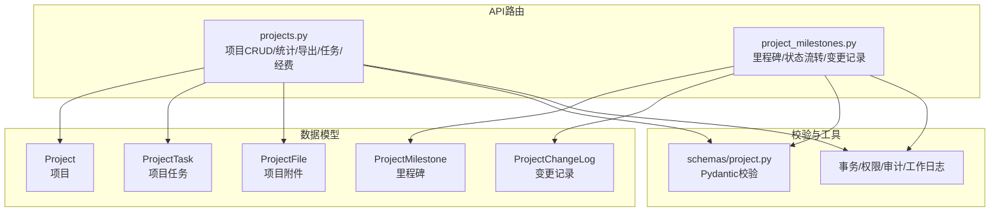
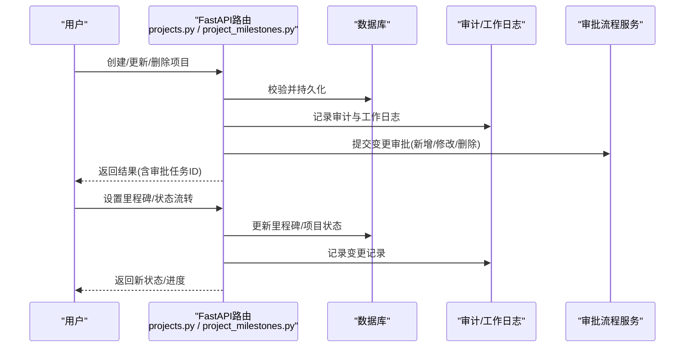
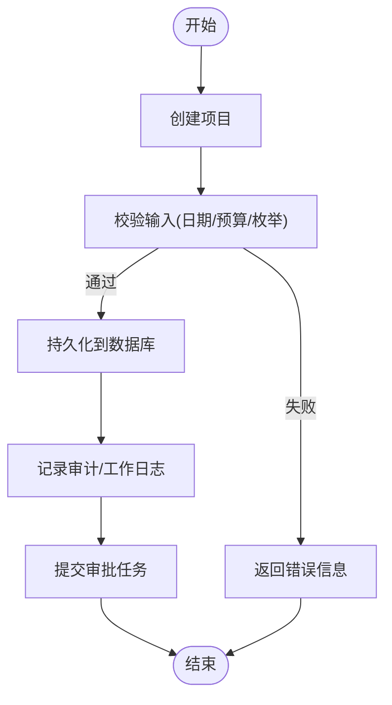
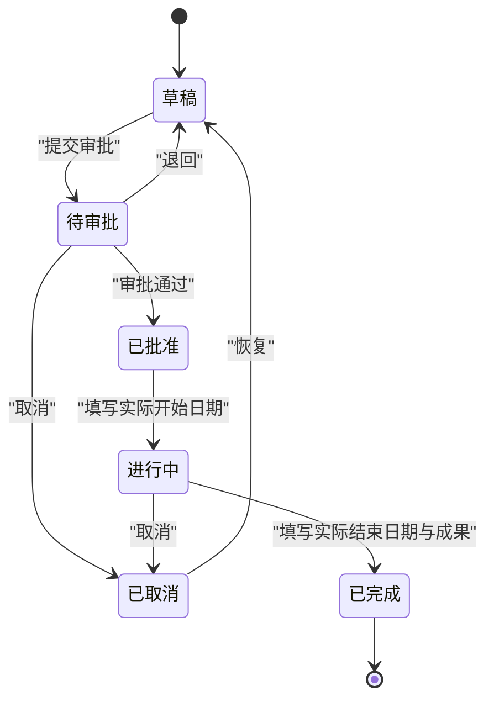
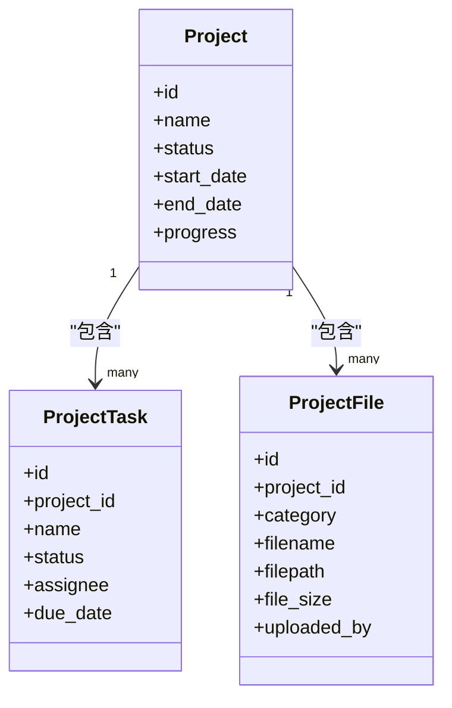
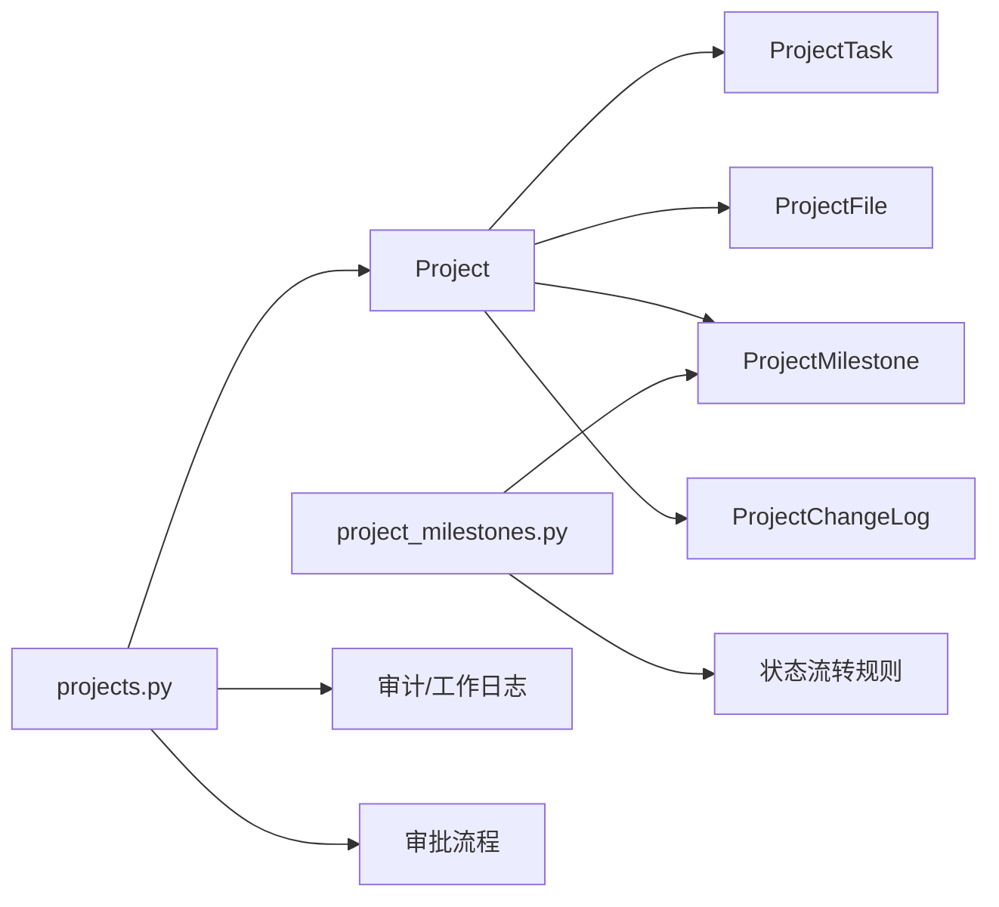

# 项目管理操作指南

<cite>
**本文引用的文件**
- [backend/app/models/project.py](file://backend/app/models/project.py)
- [backend/app/models/project_milestone.py](file://backend/app/models/project_milestone.py)
- [backend/app/api/v1/projects.py](file://backend/app/api/v1/projects.py)
- [backend/app/api/v1/project_milestones.py](file://backend/app/api/v1/project_milestones.py)
- [backend/app/schemas/project.py](file://backend/app/schemas/project.py)
</cite>

## 目录
1. [简介](#简介)
2. [项目结构](#项目结构)
3. [核心组件](#核心组件)
4. [架构总览](#架构总览)
5. [详细组件分析](#详细组件分析)
6. [依赖关系分析](#依赖关系分析)
7. [性能考虑](#性能考虑)
8. [故障排查指南](#故障排查指南)
9. [结论](#结论)
10. [附录](#附录)

## 简介
本指南面向使用“乡村振兴管理系统”中“项目管理模块”的用户与实施人员，覆盖项目创建、编辑、删除等基础操作；项目生命周期管理（状态流转、里程碑、进度跟踪、成果汇报）；协作功能（任务分配、评论讨论、文件共享）；模板与批量操作技巧；以及最佳实践与常见问题解决方案。文档基于后端模型、API与服务实现进行说明，确保与实际系统行为一致。

## 项目结构
项目管理模块由数据模型、API路由、校验Schema与里程碑/变更记录组成：
- 数据模型：项目、项目任务、项目附件、里程碑、变更记录
- API路由：项目CRUD、统计、导出、任务、经费、里程碑、状态流转、变更记录
- Schema：请求/响应体校验
- 服务层：审计日志、工作日志、审批流联动、缓存失效等

图表来源
- [backend/app/models/project.py:47-175](file://backend/app/models/project.py#L47-L175)
- [backend/app/models/project_milestone.py:12-104](file://backend/app/models/project_milestone.py#L12-L104)
- [backend/app/api/v1/projects.py:54-112](file://backend/app/api/v1/projects.py#L54-L112)
- [backend/app/api/v1/project_milestones.py:28-25](file://backend/app/api/v1/project_milestones.py#L28-L25)
- [backend/app/schemas/project.py:9-75](file://backend/app/schemas/project.py#L9-L75)

章节来源
- [backend/app/models/project.py:47-175](file://backend/app/models/project.py#L47-L175)
- [backend/app/models/project_milestone.py:12-104](file://backend/app/models/project_milestone.py#L12-L104)
- [backend/app/api/v1/projects.py:54-112](file://backend/app/api/v1/projects.py#L54-L112)
- [backend/app/api/v1/project_milestones.py:28-25](file://backend/app/api/v1/project_milestones.py#L28-L25)
- [backend/app/schemas/project.py:9-75](file://backend/app/schemas/project.py#L9-L75)

## 核心组件
- 项目主数据：包含基本信息、时间范围、预算与资金信息、负责人与联系方式、标签与备注、软删标记等
- 项目任务：用于任务分解与分配，支持状态与优先级
- 项目附件：按阶段分类存储（调研/实施/验收/照片），记录上传人与大小
- 里程碑：计划日期、实际完成日期、负责人、排序，自动计算项目进度
- 变更记录：记录字段变更类型、新旧值、原因、操作人及时间
- 状态流转：定义合法流转路径与准入条件，支持前端提示与后端校验

章节来源
- [backend/app/models/project.py:47-175](file://backend/app/models/project.py#L47-L175)
- [backend/app/models/project.py:239-320](file://backend/app/models/project.py#L239-L320)
- [backend/app/models/project_milestone.py:12-104](file://backend/app/models/project_milestone.py#L12-L104)
- [backend/app/models/project_milestone.py:110-187](file://backend/app/models/project_milestone.py#L110-L187)

## 架构总览
下图展示从前端到后端的调用链路：用户通过API发起项目创建/更新/删除、里程碑管理与状态流转，后端进行权限校验、数据持久化、审计与工作日志记录，并与审批流程联动。

图表来源
- [backend/app/api/v1/projects.py:790-920](file://backend/app/api/v1/projects.py#L790-L920)
- [backend/app/api/v1/projects.py:1030-1088](file://backend/app/api/v1/projects.py#L1030-L1088)
- [backend/app/api/v1/projects.py:1091-1181](file://backend/app/api/v1/projects.py#L1091-L1181)
- [backend/app/api/v1/project_milestones.py:121-180](file://backend/app/api/v1/project_milestones.py#L121-L180)
- [backend/app/api/v1/project_milestones.py:249-306](file://backend/app/api/v1/project_milestones.py#L249-L306)

## 详细组件分析

### 项目基础操作（创建、编辑、删除）
- 创建项目
  - 必填字段：项目名称、开始日期、预算等（依据请求体校验）
  - 自动生成项目编号（若未提供）
  - 创建后自动进入待审批板块，并返回审批任务ID
  - 记录审计日志与工作日志，触发仪表盘缓存失效
- 更新项目
  - 支持字段级更新，自动转换日期与金额精度
  - 若涉及状态变更，触发经费阶段联动事件
  - 记录Diff留痕与工作日志，必要时提交变更审批
- 删除项目
  - 采用软删除：将状态置为已取消，标记is_active=false，记录删除时间
  - 仅管理员或创建者可执行
  - 记录审计日志与工作日志，并提交删除审批

图表来源
- [backend/app/api/v1/projects.py:790-920](file://backend/app/api/v1/projects.py#L790-L920)
- [backend/app/schemas/project.py:9-23](file://backend/app/schemas/project.py#L9-L23)

章节来源
- [backend/app/api/v1/projects.py:790-920](file://backend/app/api/v1/projects.py#L790-L920)
- [backend/app/api/v1/projects.py:1030-1088](file://backend/app/api/v1/projects.py#L1030-L1088)
- [backend/app/api/v1/projects.py:1091-1181](file://backend/app/api/v1/projects.py#L1091-L1181)
- [backend/app/schemas/project.py:9-23](file://backend/app/schemas/project.py#L9-L23)

### 项目生命周期管理（状态流转、里程碑、进度、成果）
- 状态流转
  - 合法路径：草稿→待审批→已批准→进行中→已完成；可取消/恢复
  - 各阶段准入条件：如启动需填写实际开始日期，完成需填写实际结束日期与成果
  - 前端可通过规则接口获取当前可用目标状态与要求
- 里程碑
  - 支持创建、更新、删除，自动填充完成时的实际日期
  - 里程碑完成后自动计算并更新项目进度百分比
- 进度与成果
  - 项目进度可由里程碑完成率驱动
  - 完成时需填写项目成果，便于后续汇报与归档

图表来源
- [backend/app/models/project_milestone.py:110-141](file://backend/app/models/project_milestone.py#L110-L141)
- [backend/app/api/v1/project_milestones.py:218-306](file://backend/app/api/v1/project_milestones.py#L218-L306)

章节来源
- [backend/app/models/project_milestone.py:110-187](file://backend/app/models/project_milestone.py#L110-L187)
- [backend/app/api/v1/project_milestones.py:121-180](file://backend/app/api/v1/project_milestones.py#L121-L180)
- [backend/app/api/v1/project_milestones.py:218-306](file://backend/app/api/v1/project_milestones.py#L218-L306)

### 甘特图与项目时间线管理
- 时间线数据源
  - 项目起止日期、实际起止日期
  - 里程碑计划日期与实际完成日期
- 可视化建议
  - 以项目为行，时间轴为列，显示计划与实际的区间条
  - 里程碑用节点标注，颜色区分状态（计划/进行中/已完成/逾期）
  - 结合进度百分比与延期标记，辅助识别风险
- 数据来源接口
  - 项目详情接口返回项目时间字段
  - 里程碑列表接口返回计划与实际日期
  - 即将到期与逾期里程碑接口用于预警

章节来源
- [backend/app/models/project.py:98-101](file://backend/app/models/project.py#L98-L101)
- [backend/app/models/project_milestone.py:23-40](file://backend/app/models/project_milestone.py#L23-L40)
- [backend/app/api/v1/project_milestones.py:342-452](file://backend/app/api/v1/project_milestones.py#L342-L452)

### 项目协作功能（任务分配、评论讨论、文件共享）
- 任务分配
  - 项目任务支持名称、描述、状态、优先级、负责人、截止日期
  - 可在项目详情页查看与编辑任务
- 评论讨论
  - 系统通过工作日志记录关键操作与变更，可作为协作上下文
  - 建议在里程碑与任务更新时添加备注，便于追溯
- 文件共享
  - 项目附件按阶段分类存储（调研/实施/验收/照片）
  - 支持记录上传者、文件大小与路径，便于版本管理与归档

图表来源
- [backend/app/models/project.py:47-175](file://backend/app/models/project.py#L47-L175)
- [backend/app/models/project.py:239-320](file://backend/app/models/project.py#L239-L320)

章节来源
- [backend/app/models/project.py:239-320](file://backend/app/models/project.py#L239-L320)

### 项目模板与批量操作技巧
- 模板使用
  - 可使用Excel导入模板批量创建项目（参考系统导入能力）
  - 模板字段应与项目模型字段对齐（名称、类型、预算、日期、负责人等）
- 批量操作
  - 列表导出：支持按关键词、类型、状态筛选后导出Excel/CSV
  - 批量更新：通过批量接口或脚本对多项目进行状态或字段更新（注意权限与校验）
  - 批量删除：谨慎使用，建议先软删除并进入审批流程

章节来源
- [backend/app/api/v1/projects.py:555-651](file://backend/app/api/v1/projects.py#L555-L651)

## 依赖关系分析
- 模型依赖
  - Project 关联 SupportedVillage、Organization、User（创建者）
  - ProjectTask、ProjectFile、ProjectMilestone、ProjectChangeLog 均依赖 Project
- API依赖
  - projects.py 依赖权限、事务、审计、工作日志、审批流程服务
  - project_milestones.py 依赖状态流转规则与进度计算函数
- 外部集成
  - 审批流程：新增/修改/删除项目自动提交审批任务
  - 仪表盘缓存：关键操作后失效缓存，保证数据一致性

图表来源
- [backend/app/models/project.py:47-175](file://backend/app/models/project.py#L47-L175)
- [backend/app/models/project_milestone.py:12-104](file://backend/app/models/project_milestone.py#L12-L104)
- [backend/app/api/v1/projects.py:790-920](file://backend/app/api/v1/projects.py#L790-L920)
- [backend/app/api/v1/project_milestones.py:249-306](file://backend/app/api/v1/project_milestones.py#L249-L306)

章节来源
- [backend/app/models/project.py:47-175](file://backend/app/models/project.py#L47-L175)
- [backend/app/models/project_milestone.py:12-104](file://backend/app/models/project_milestone.py#L12-L104)
- [backend/app/api/v1/projects.py:790-920](file://backend/app/api/v1/projects.py#L790-L920)
- [backend/app/api/v1/project_milestones.py:249-306](file://backend/app/api/v1/project_milestones.py#L249-L306)

## 性能考虑
- 查询优化
  - 列表接口使用预加载（selectinload）避免N+1查询
  - 批量获取经费健康度字段，减少重复查询
- 导出限制
  - 导出上限10000条，防止内存溢出
- 索引设计
  - 项目表针对状态、类型、村庄、组织、创建者、日期等建立索引
  - 里程碑与变更记录针对项目ID、状态、日期建立索引

章节来源
- [backend/app/api/v1/projects.py:680-731](file://backend/app/api/v1/projects.py#L680-L731)
- [backend/app/api/v1/projects.py:555-651](file://backend/app/api/v1/projects.py#L555-L651)
- [backend/app/models/project.py:52-68](file://backend/app/models/project.py#L52-L68)
- [backend/app/models/project_milestone.py:17-21](file://backend/app/models/project_milestone.py#L17-L21)

## 故障排查指南
- 常见错误
  - 日期格式错误：请确保YYYY-MM-DD格式
  - 结束日期早于开始日期：检查时间范围逻辑
  - 状态流转非法：根据当前状态选择允许的目标状态
  - 权限不足：仅管理员或创建者可执行敏感操作
- 定位方法
  - 查看变更记录接口，确认字段变更历史
  - 检查工作日志，了解操作上下文
  - 检查审批任务，确认是否进入审批流程
- 处理建议
  - 修正输入后再试
  - 联系管理员调整权限或回退状态
  - 清理缓存后刷新页面

章节来源
- [backend/app/api/v1/projects.py:188-203](file://backend/app/api/v1/projects.py#L188-L203)
- [backend/app/api/v1/projects.py:938-944](file://backend/app/api/v1/projects.py#L938-L944)
- [backend/app/api/v1/project_milestones.py:249-306](file://backend/app/api/v1/project_milestones.py#L249-L306)
- [backend/app/api/v1/projects.py:1184-1193](file://backend/app/api/v1/projects.py#L1184-L1193)

## 结论
项目管理模块提供了完整的项目生命周期管理能力，涵盖基础操作、里程碑与进度、状态流转、协作与文件共享、模板与批量操作等。通过严格的校验、审计与工作日志、审批流程联动，保障数据一致性与可追溯性。建议在实际使用中遵循最佳实践，合理设置里程碑与进度，及时归档文件与成果，确保项目高效推进。

## 附录
- 常用接口
  - 项目列表与详情：/projects, /projects/{id}
  - 项目统计与导出：/projects/stats, /projects/export
  - 里程碑管理：/projects/{id}/milestones
  - 状态流转：/projects/{id}/transition-rules, /projects/{id}/transition
  - 变更记录：/projects/{id}/change-logs
- 最佳实践
  - 明确项目目标与里程碑，定期更新进度
  - 及时上传附件与成果，保持资料完整
  - 合理使用标签与备注，便于检索与汇报
  - 关注即将到期与逾期里程碑，及时处理风险