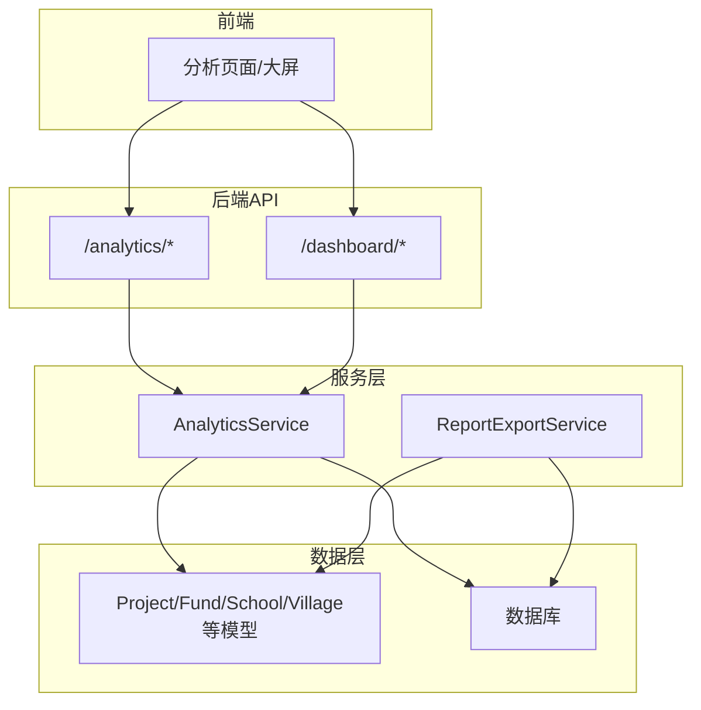
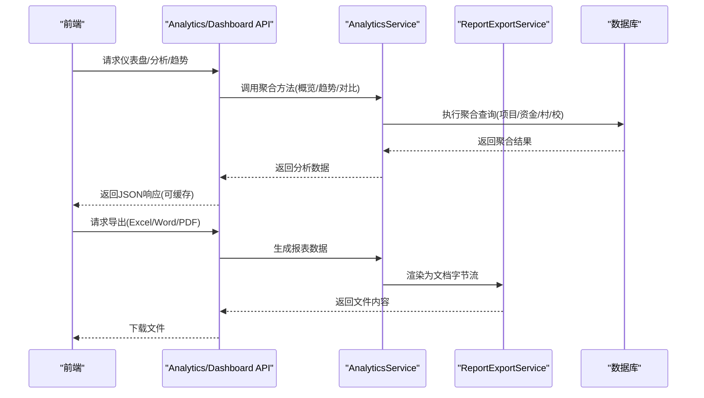
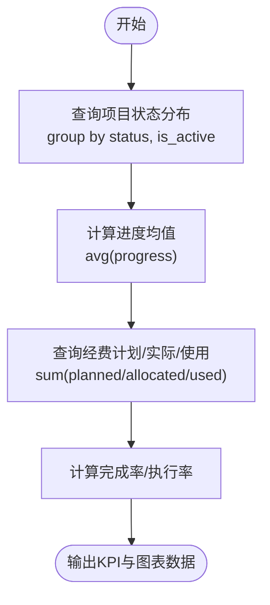
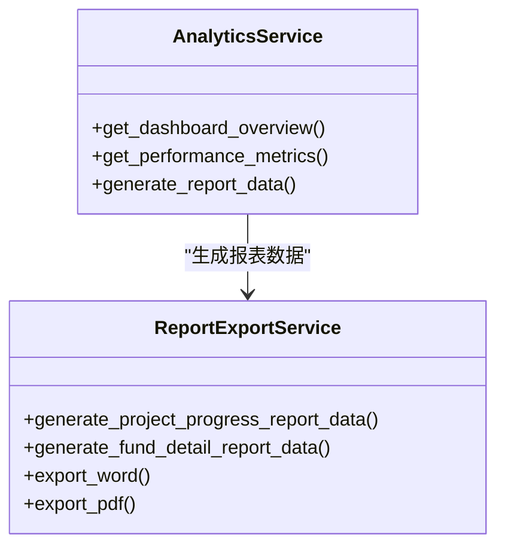
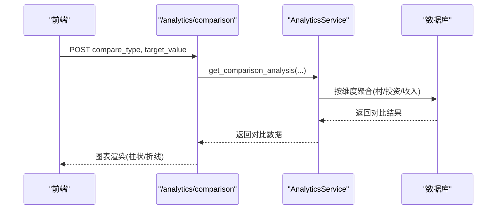
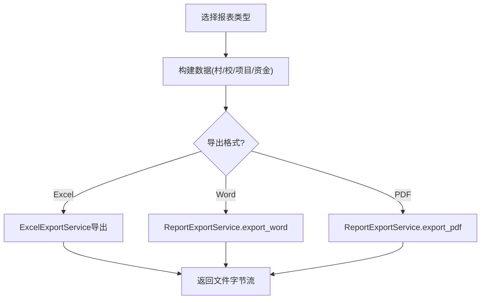
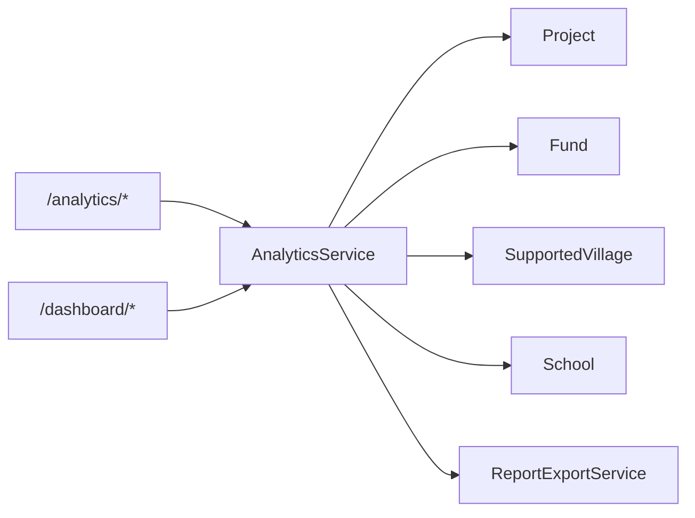

# 项目统计与分析

<cite>
**本文引用的文件**
- [backend/app/services/analytics_service.py](file://backend/app/services/analytics_service.py)
- [backend/app/api/v1/data/data/analytics.py](file://backend/app/api/v1/data/data/analytics.py)
- [backend/app/api/v1/data/data/dashboard.py](file://backend/app/api/v1/data/data/dashboard.py)
- [backend/app/models/dashboard.py](file://backend/app/models/dashboard.py)
- [backend/app/models/project.py](file://backend/app/models/project.py)
- [backend/app/services/report_export_service.py](file://backend/app/services/report_export_service.py)
- [docs/02-用户手册/数据分析功能使用指南.md](file://docs/02-用户手册/数据分析功能使用指南.md)
</cite>

## 目录
1. [简介](#简介)
2. [项目结构](#项目结构)
3. [核心组件](#核心组件)
4. [架构总览](#架构总览)
5. [详细组件分析](#详细组件分析)
6. [依赖关系分析](#依赖关系分析)
7. [性能考量](#性能考量)
8. [故障排查指南](#故障排查指南)
9. [结论](#结论)
10. [附录](#附录)

## 简介
本指南面向乡村振兴系统的项目统计与分析能力，覆盖以下目标：
- 项目数据统计：项目数量、进度分布、预算执行等核心指标展示。
- 分析报告生成：健康度评估、风险识别、绩效评分等维度。
- 对比分析：同类项目对比、历史数据对比、标杆项目分析。
- 报表导出：自定义模板、定时生成、多格式导出（Excel/Word/PDF）。
- 可视化图表：使用方法与自定义配置建议。
- 最佳实践：数据解读与使用建议。

## 项目结构
后端围绕“服务层 + API路由 + 模型”组织：
- 数据分析服务：聚合帮扶村、人口、收入、投资、政策等多维指标，提供汇总、趋势、对比、钻取与导出。
- 仪表盘API：提供首页KPI、年度趋势、近期动态等聚合接口，并实现缓存与数据权限过滤。
- 报告导出服务：统一数据结构，输出Word/PDF公文报告，支持经费明细、项目进度、学校/村庄汇总等。
- 模型层：项目、资金、帮扶村、学校、活动记录等实体，支撑统计口径与索引优化。

**图示来源**
- [backend/app/api/v1/data/data/analytics.py:84-202](file://backend/app/api/v1/data/data/analytics.py#L84-L202)
- [backend/app/api/v1/data/data/dashboard.py:365-508](file://backend/app/api/v1/data/data/dashboard.py#L365-L508)
- [backend/app/services/analytics_service.py:22-703](file://backend/app/services/analytics_service.py#L22-L703)
- [backend/app/services/report_export_service.py:46-448](file://backend/app/services/report_export_service.py#L46-L448)

**章节来源**
- [backend/app/api/v1/data/data/analytics.py:84-202](file://backend/app/api/v1/data/data/analytics.py#L84-L202)
- [backend/app/api/v1/data/data/dashboard.py:365-508](file://backend/app/api/v1/data/data/dashboard.py#L365-L508)
- [backend/app/services/analytics_service.py:22-703](file://backend/app/services/analytics_service.py#L22-L703)
- [backend/app/services/report_export_service.py:46-448](file://backend/app/services/report_export_service.py#L46-L448)

## 核心组件
- AnalyticsService：提供仪表盘总览、帮扶村分析、资金趋势、绩效指标、对比分析、报表数据生成、筛选与导出等能力。
- Dashboard API：提供统计数据、KPI趋势、年度趋势、近期动态等，内置缓存与数据范围过滤。
- ReportExportService：统一报表数据结构，输出Word/PDF，包含经费明细、项目进度、学校/村庄汇总等。
- Project/Fund/Village 模型：提供统计口径与索引优化，保障查询性能与一致性。

**章节来源**
- [backend/app/services/analytics_service.py:22-703](file://backend/app/services/analytics_service.py#L22-L703)
- [backend/app/api/v1/data/data/dashboard.py:365-508](file://backend/app/api/v1/data/data/dashboard.py#L365-L508)
- [backend/app/services/report_export_service.py:46-448](file://backend/app/services/report_export_service.py#L46-L448)
- [backend/app/models/project.py:47-175](file://backend/app/models/project.py#L47-L175)

## 架构总览
分析链路从前端请求到后端服务再到数据层，关键路径如下：
- 仪表盘与KPI：通过Dashboard API聚合项目、资金、学校、帮扶村数据，计算环比趋势并缓存。
- 分析与对比：AnalyticsService按省份/梯队/年份等维度聚合，返回对比与趋势数据。
- 报表导出：ReportExportService将结构化数据渲染为Word/PDF，供下载或归档。

**图示来源**
- [backend/app/api/v1/data/data/analytics.py:84-202](file://backend/app/api/v1/data/data/analytics.py#L84-L202)
- [backend/app/services/analytics_service.py:28-385](file://backend/app/services/analytics_service.py#L28-L385)
- [backend/app/services/report_export_service.py:318-443](file://backend/app/services/report_export_service.py#L318-L443)

## 详细组件分析

### 项目数据统计与指标展示
- 项目数量与状态分布：基于Project模型按status分组计数，结合is_active过滤，得到总数、进行中、已完成等。
- 进度分布：按项目progress字段统计平均进度，用于进度分布图。
- 预算执行：结合Fund的planned_amount/allocated_amount/used_amount，计算计划与实际投入，形成预算执行率。
- KPI汇总：compute_kpi_summary_data提供项目完成率、完成数、批准数等汇总口径。

**图示来源**
- [backend/app/api/v1/data/data/analytics.py:226-274](file://backend/app/api/v1/data/data/analytics.py#L226-L274)
- [backend/app/services/report_export_service.py:148-208](file://backend/app/services/report_export_service.py#L148-L208)
- [backend/app/models/project.py:47-175](file://backend/app/models/project.py#L47-L175)

**章节来源**
- [backend/app/api/v1/data/data/analytics.py:226-274](file://backend/app/api/v1/data/data/analytics.py#L226-L274)
- [backend/app/services/report_export_service.py:148-208](file://backend/app/services/report_export_service.py#L148-L208)
- [backend/app/models/project.py:47-175](file://backend/app/models/project.py#L47-L175)

### 项目分析报告生成（健康度/风险/绩效）
- 健康度评估：综合项目完成率、资金执行率、政策发布情况、示范村比例等指标，形成健康度评分。
- 风险识别：关注延期标记、预算超支、审批待办积压等信号。
- 绩效评分：结合产业/基建/教育投资额、人均收入增长、人口变化等维度进行加权评分。

**图示来源**
- [backend/app/services/analytics_service.py:220-385](file://backend/app/services/analytics_service.py#L220-L385)
- [backend/app/services/report_export_service.py:55-300](file://backend/app/services/report_export_service.py#L55-L300)

**章节来源**
- [backend/app/services/analytics_service.py:220-385](file://backend/app/services/analytics_service.py#L220-L385)
- [backend/app/services/report_export_service.py:55-300](file://backend/app/services/report_export_service.py#L55-L300)

### 项目对比分析（同类/历史/标杆）
- 同类项目对比：按province/tier分组，比较村数、总投资、平均收入等。
- 历史数据对比：按年份聚合资金趋势与项目数量，观察长期走势。
- 标杆项目分析：结合示范村、重点县、三区三州等标签，识别高绩效群体。

**图示来源**
- [backend/app/api/v1/data/data/analytics.py:154-164](file://backend/app/api/v1/data/data/analytics.py#L154-L164)
- [backend/app/services/analytics_service.py:292-341](file://backend/app/services/analytics_service.py#L292-L341)

**章节来源**
- [backend/app/api/v1/data/data/analytics.py:154-164](file://backend/app/api/v1/data/data/analytics.py#L154-L164)
- [backend/app/services/analytics_service.py:292-341](file://backend/app/services/analytics_service.py#L292-L341)

### 项目报表导出（模板/定时/多格式）
- 自定义报表模板：ReportExportService定义统一sections结构，支持标题、段落、表格组合。
- 定时报表生成：可通过任务调度触发导出流程（如每日/每月），结合缓存策略减少重复计算。
- 多格式导出：支持Excel（通过导出服务）、Word/PDF（通过ReportExportService）。

**图示来源**
- [backend/app/services/report_export_service.py:318-443](file://backend/app/services/report_export_service.py#L318-L443)
- [backend/app/services/analytics_service.py:685-702](file://backend/app/services/analytics_service.py#L685-L702)

**章节来源**
- [backend/app/services/report_export_service.py:318-443](file://backend/app/services/report_export_service.py#L318-L443)
- [backend/app/services/analytics_service.py:685-702](file://backend/app/services/analytics_service.py#L685-L702)

### 可视化图表使用与自定义配置
- 图表类型：地域分布（扇形/柱形）、投入构成（堆叠柱形）、年度趋势（折线）。
- 交互：点击扇区钻取至村列表；年份/部门/属性联动刷新。
- 自定义：前端可按API返回结构扩展维度（如增加区域细分、行业分类），后端需补充对应聚合逻辑。

**章节来源**
- [docs/02-用户手册/数据分析功能使用指南.md:1-35](file://docs/02-用户手册/数据分析功能使用指南.md#L1-L35)

## 依赖关系分析
- API与服务：Analytics API依赖AnalyticsService；Dashboard API依赖聚合函数与缓存。
- 服务与模型：AnalyticsService聚合Project/Fund/Village/School等模型；ReportExportService读取相同模型生成报表。
- 缓存：分析数据与仪表盘数据均使用缓存降低DB压力。

**图示来源**
- [backend/app/api/v1/data/data/analytics.py:84-202](file://backend/app/api/v1/data/data/analytics.py#L84-L202)
- [backend/app/api/v1/data/data/dashboard.py:365-508](file://backend/app/api/v1/data/data/dashboard.py#L365-L508)
- [backend/app/services/analytics_service.py:22-703](file://backend/app/services/analytics_service.py#L22-L703)
- [backend/app/services/report_export_service.py:46-448](file://backend/app/services/report_export_service.py#L46-L448)

**章节来源**
- [backend/app/api/v1/data/data/analytics.py:84-202](file://backend/app/api/v1/data/data/analytics.py#L84-L202)
- [backend/app/api/v1/data/data/dashboard.py:365-508](file://backend/app/api/v1/data/data/dashboard.py#L365-L508)
- [backend/app/services/analytics_service.py:22-703](file://backend/app/services/analytics_service.py#L22-L703)
- [backend/app/services/report_export_service.py:46-448](file://backend/app/services/report_export_service.py#L46-L448)

## 性能考量
- 聚合查询优化：使用GROUP BY与条件聚合减少多次COUNT/SUM；对常用字段建立索引（如status、type、organization_id、created_at）。
- 缓存策略：分析数据与仪表盘数据采用TTL缓存，降低重复计算；必要时支持强制刷新。
- 并发处理：近期动态等接口采用并行获取，缩短响应时间。
- 数据范围过滤：按组织/创建人进行数据权限过滤，避免全表扫描。

**章节来源**
- [backend/app/api/v1/data/data/dashboard.py:44-90](file://backend/app/api/v1/data/data/dashboard.py#L44-L90)
- [backend/app/api/v1/data/data/dashboard.py:681-711](file://backend/app/api/v1/data/data/dashboard.py#L681-L711)
- [backend/app/models/project.py:52-68](file://backend/app/models/project.py#L52-L68)

## 故障排查指南
- 缓存异常：若缓存读写失败，日志会记录警告；可尝试刷新参数跳过缓存。
- 查询失败：聚合查询失败时，服务层返回空结构或降级数据，确保前端不崩溃。
- 权限问题：跨组织对比仅管理员可用；普通用户受限数据范围。
- 导出失败：检查依赖库（python-docx/reportlab）是否安装；确认数据源存在。

**章节来源**
- [backend/app/api/v1/data/data/analytics.py:30-45](file://backend/app/api/v1/data/data/analytics.py#L30-L45)
- [backend/app/api/v1/data/data/dashboard.py:61-90](file://backend/app/api/v1/data/data/dashboard.py#L61-L90)
- [backend/app/api/v1/data/data/analytics.py:283-363](file://backend/app/api/v1/data/data/analytics.py#L283-L363)
- [backend/app/services/report_export_service.py:318-443](file://backend/app/services/report_export_service.py#L318-L443)

## 结论
本项目统计与分析模块以清晰的分层架构与高性能聚合查询为基础，提供全面的指标展示、对比分析、报告生成与导出能力。通过缓存与权限控制，兼顾性能与安全。建议在生产环境中结合任务调度实现定时报表，并根据业务需求扩展对比维度与可视化配置。

## 附录
- 使用指南参考：数据分析功能使用指南（KPI卡片区、图表区、筛选联动、导出说明）。
- 模型参考：Project/Fund/Village/School等模型字段与索引设计，支撑统计口径与性能优化。

**章节来源**
- [docs/02-用户手册/数据分析功能使用指南.md:1-35](file://docs/02-用户手册/数据分析功能使用指南.md#L1-L35)
- [backend/app/models/project.py:47-175](file://backend/app/models/project.py#L47-L175)