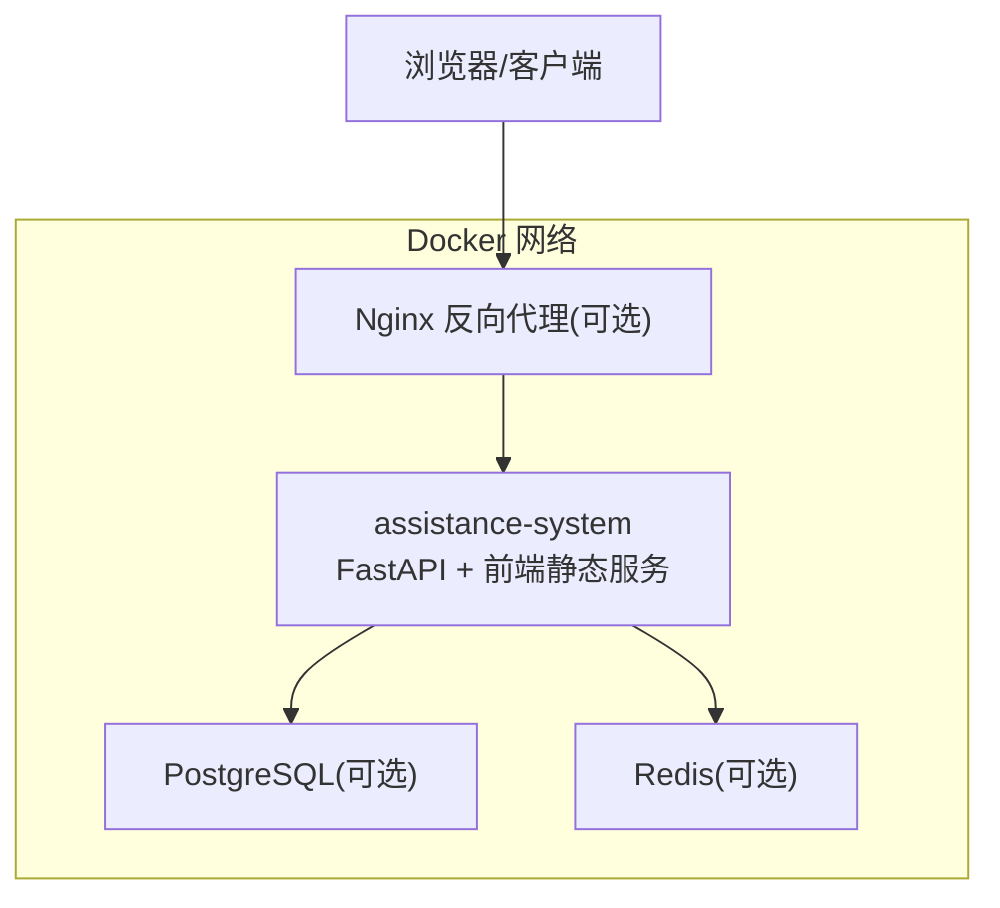
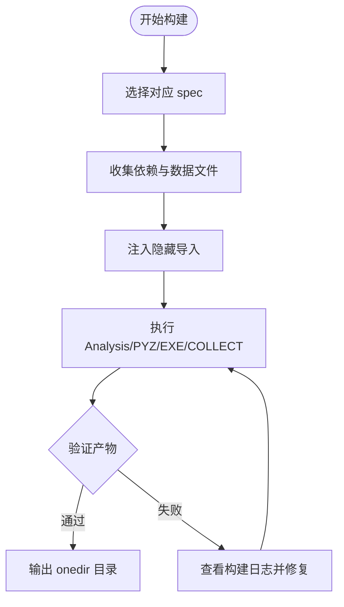
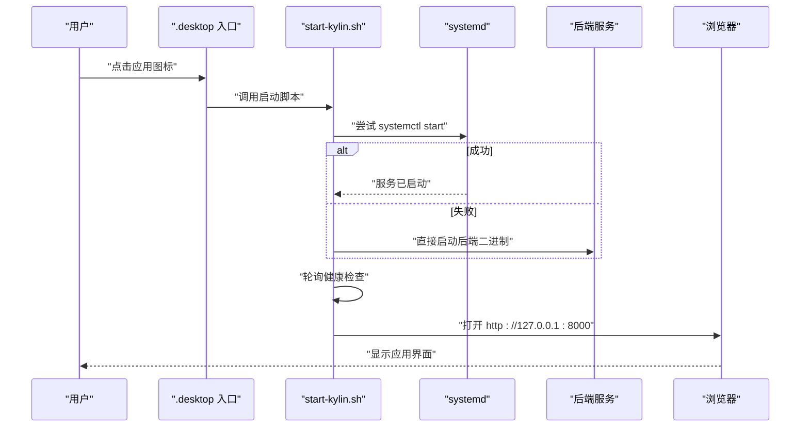
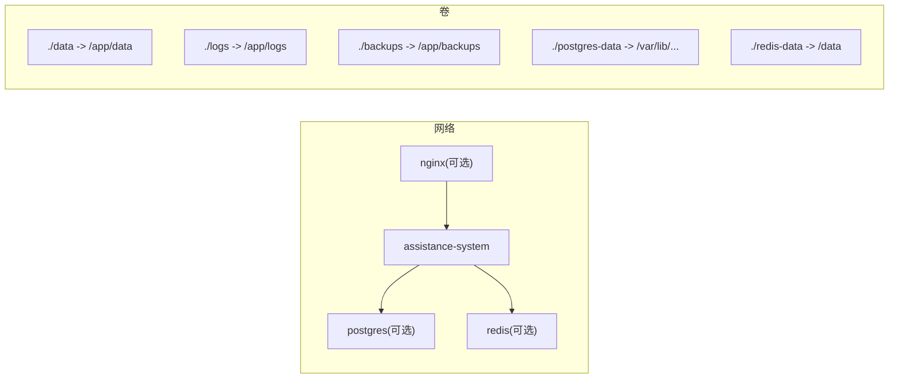

# Docker容器化部署

<cite>
**本文引用的文件**
- [docker/Dockerfile](file://docker/Dockerfile)
- [docker/Dockerfile.runtime](file://docker/Dockerfile.runtime)
- [docker/Dockerfile.backend-arm64](file://docker/Dockerfile.backend-arm64)
- [docker/Dockerfile.deb-complete](file://docker/Dockerfile.deb-complete)
- [docker/Dockerfile.kylin-amd64](file://docker/Dockerfile.kylin-amd64)
- [docker/Dockerfile.kylin-standalone](file://docker/Dockerfile.kylin-standalone)
- [docker-compose.yml](file://docker-compose.yml)
- [docker/docker-compose.e2e.yml](file://docker/docker-compose.e2e.yml)
- [backend/assistance-backend.spec](file://backend/assistance-backend.spec)
- [backend/backend_linux_arm64.spec](file://backend/backend_linux_arm64.spec)
- [backend/backend_linux_arm64_standalone.spec](file://backend/backend_linux_arm64_standalone.spec)
- [deploy/kylin/config/kylin.env](file://deploy/kylin/config/kylin.env)
- [deploy/kylin/scripts/start-kylin.sh](file://deploy/kylin/scripts/start-kylin.sh)
- [deploy/kylin/systemd/assistance-management-system.service](file://deploy/kylin/systemd/assistance-management-system.service)
</cite>

## 目录
1. [简介](#简介)
2. [项目结构](#项目结构)
3. [核心组件](#核心组件)
4. [架构总览](#架构总览)
5. [详细组件分析](#详细组件分析)
6. [依赖关系分析](#依赖关系分析)
7. [性能与资源限制](#性能与资源限制)
8. [故障排查指南](#故障排查指南)
9. [结论](#结论)
10. [附录：常用命令与最佳实践](#附录：常用命令与最佳实践)

## 简介
本指南面向在本地或服务器上使用 Docker 与 Docker Compose 部署“帮扶管理信息系统”的运维与开发人员。文档覆盖以下目标：
- 镜像构建与用途：基础镜像、后端二进制镜像、完整 DEB 包镜像、麒麟系统适配镜像（amd64/arm64）等
- Docker Compose 编排：服务依赖、网络、数据卷、环境变量、健康检查与日志
- 日常操作：启动、停止、重启、查看日志、监控与资源限制
- 多架构策略：amd64 与 arm64 的构建与部署方法
- 故障排查与最佳实践：常见问题定位、安全加固与可观测性建议

## 项目结构
仓库中与容器化相关的核心目录与文件如下：
- docker：包含多种 Dockerfile，分别用于通用运行时、ARM64 后端构建、DEB 打包、麒麟适配等
- docker-compose.yml：主编排文件，定义应用、数据库、缓存、反向代理等可选服务
- docker/docker-compose.e2e.yml：E2E 测试与性能压测环境叠加配置
- backend/*.spec：PyInstaller 打包配置，决定后端二进制产物结构与依赖
- deploy/kylin：麒麟系统桌面版安装与运行所需脚本、systemd 单元与环境配置

```mermaid
graph TB
A["Docker 镜像层"] --> B["通用运行时镜像<br/>Dockerfile.runtime"]
A --> C["全栈一体化镜像<br/>Dockerfile"]
A --> D["ARM64 后端构建镜像<br/>Dockerfile.backend-arm64"]
A --> E["DEB 专用构建镜像<br/>Dockerfile.deb-complete"]
A --> F["麒麟 amd64 适配镜像<br/>Dockerfile.kylin-amd64"]
A --> G["麒麟 arm64 单机版镜像<br/>Dockerfile.kylin-standalone"]
H["Compose 编排"] --> I["assistance-system"]
H --> J["postgres(可选)"]
H --> K["redis(可选)"]
H --> L["nginx(可选)"]
M["PyInstaller 打包"] --> N["assistance-backend.spec"]
M --> O["backend_linux_arm64.spec"]
M --> P["backend_linux_arm64_standalone.spec"]
Q["麒麟桌面集成"] --> R["start-kylin.sh"]
Q --> S["systemd 单元"]
Q --> T["kylin.env"]
```

图表来源
- [docker/Dockerfile](file://docker/Dockerfile)
- [docker/Dockerfile.runtime](file://docker/Dockerfile.runtime)
- [docker/Dockerfile.backend-arm64](file://docker/Dockerfile.backend-arm64)
- [docker/Dockerfile.deb-complete](file://docker/Dockerfile.deb-complete)
- [docker/Dockerfile.kylin-amd64](file://docker/Dockerfile.kylin-amd64)
- [docker/Dockerfile.kylin-standalone](file://docker/Dockerfile.kylin-standalone)
- [docker-compose.yml](file://docker-compose.yml)
- [backend/assistance-backend.spec](file://backend/assistance-backend.spec)
- [backend/backend_linux_arm64.spec](file://backend/backend_linux_arm64.spec)
- [backend/backend_linux_arm64_standalone.spec](file://backend/backend_linux_arm64_standalone.spec)
- [deploy/kylin/scripts/start-kylin.sh](file://deploy/kylin/scripts/start-kylin.sh)
- [deploy/kylin/systemd/assistance-management-system.service](file://deploy/kylin/systemd/assistance-management-system.service)
- [deploy/kylin/config/kylin.env](file://deploy/kylin/config/kylin.env)

章节来源
- [docker/Dockerfile:1-173](file://docker/Dockerfile#L1-L173)
- [docker/Dockerfile.runtime:1-70](file://docker/Dockerfile.runtime#L1-L70)
- [docker-compose.yml:1-214](file://docker-compose.yml#L1-L214)

## 核心组件
- 通用运行时镜像（Dockerfile.runtime）
  - 用途：生产环境中以 Python 运行时承载 FastAPI 后端，并托管前端静态资源
  - 特点：非 root 用户、健康检查、暴露 8000 端口、挂载数据/日志/上传/导出/备份目录
- 全栈一体化镜像（Dockerfile）
  - 用途：一次性构建前端与后端，并在容器中同时启动前后端服务
  - 特点：多阶段构建、非 root 用户、暴露 8000/3000 端口、提供统一启动脚本
- ARM64 后端构建镜像（Dockerfile.backend-arm64）
  - 用途：在 ARM64 平台构建 PyInstaller onedir 后端二进制，严格校验 GLIBC 兼容性
- DEB 专用构建镜像（Dockerfile.deb-complete）
  - 用途：仅生成 DEB 安装包（不生成 AppImage），减少构建体积与时间
- 麒麟适配镜像（Dockerfile.kylin-amd64 / Dockerfile.kylin-standalone）
  - 用途：为麒麟 V10 生成 amd64/arm64 的 DEB 包；使用 buster 基础镜像确保 GLIBC 兼容
  - 特点：集成 systemd、桌面快捷方式、polkit 规则、start-kylin.sh 启动器

章节来源
- [docker/Dockerfile.runtime:1-70](file://docker/Dockerfile.runtime#L1-L70)
- [docker/Dockerfile:1-173](file://docker/Dockerfile#L1-L173)
- [docker/Dockerfile.backend-arm64:1-100](file://docker/Dockerfile.backend-arm64#L1-L100)
- [docker/Dockerfile.deb-complete:1-58](file://docker/Dockerfile.deb-complete#L1-L58)
- [docker/Dockerfile.kylin-amd64:1-234](file://docker/Dockerfile.kylin-amd64#L1-L234)
- [docker/Dockerfile.kylin-standalone:1-244](file://docker/Dockerfile.kylin-standalone#L1-L244)

## 架构总览
下图展示基于 Compose 的典型部署拓扑：应用服务通过内部网络访问可选的 PostgreSQL 与 Redis，生产环境可通过 Nginx 反向代理对外暴露 HTTP/HTTPS。

图表来源
- [docker-compose.yml:15-188](file://docker-compose.yml#L15-L188)

章节来源
- [docker-compose.yml:1-214](file://docker-compose.yml#L1-L214)

## 详细组件分析

### 镜像构建与用途
- 通用运行时镜像（Dockerfile.runtime）
  - 构建前端静态资源后复制到运行时镜像，Python 依赖按需安装，设置健康检查与数据目录权限
  - 适合独立部署后端并提供前端静态资源
- 全栈一体化镜像（Dockerfile）
  - 多阶段构建：Node 构建前端、Python 构建后端二进制、最终运行时复制产物并启动前后端
  - 适合快速体验或单机演示
- ARM64 后端构建镜像（Dockerfile.backend-arm64）
  - 使用 buster 基础镜像，严格校验 GLIBC ≤ 2.28，输出 onedir 后端目录供后续打包或分发
- DEB 专用构建镜像（Dockerfile.deb-complete）
  - 仅生成 DEB 包，跳过 AppImage，提升 CI 效率
- 麒麟适配镜像（Dockerfile.kylin-amd64 / Dockerfile.kylin-standalone）
  - 分别在 amd64 与 arm64 平台构建 DEB；集成 systemd、桌面快捷方式、polkit 规则与启动脚本
  - 通过 buster 基础镜像保证 GLIBC 兼容，避免在麒麟 V10 上崩溃

章节来源
- [docker/Dockerfile:1-173](file://docker/Dockerfile#L1-L173)
- [docker/Dockerfile.runtime:1-70](file://docker/Dockerfile.runtime#L1-L70)
- [docker/Dockerfile.backend-arm64:1-100](file://docker/Dockerfile.backend-arm64#L1-L100)
- [docker/Dockerfile.deb-complete:1-58](file://docker/Dockerfile.deb-complete#L1-L58)
- [docker/Dockerfile.kylin-amd64:1-234](file://docker/Dockerfile.kylin-amd64#L1-L234)
- [docker/Dockerfile.kylin-standalone:1-244](file://docker/Dockerfile.kylin-standalone#L1-L244)

### PyInstaller 打包配置
- assistance-backend.spec
  - onedir 模式，自动收集 app 子模块，隐藏导入 uvicorn/fastapi/sqlalchemy 等关键库，排除测试与 GUI 依赖
- backend_linux_arm64.spec
  - 针对 Linux ARM64 的简化 spec，显式列出必要隐藏导入，便于在 ARM64 环境稳定构建
- backend_linux_arm64_standalone.spec
  - 麒麟 V10 专用 spec，额外收集 libmagic/libsqlite3 共享库，确保离线可用；保留控制台输出便于诊断

图表来源
- [backend/assistance-backend.spec:1-204](file://backend/assistance-backend.spec#L1-L204)
- [backend/backend_linux_arm64.spec:1-46](file://backend/backend_linux_arm64.spec#L1-L46)
- [backend/backend_linux_arm64_standalone.spec:1-176](file://backend/backend_linux_arm64_standalone.spec#L1-L176)

章节来源
- [backend/assistance-backend.spec:1-204](file://backend/assistance-backend.spec#L1-L204)
- [backend/backend_linux_arm64.spec:1-46](file://backend/backend_linux_arm64.spec#L1-L46)
- [backend/backend_linux_arm64_standalone.spec:1-176](file://backend/backend_linux_arm64_standalone.spec#L1-L176)

### 麒麟桌面集成与启动流程
- start-kylin.sh
  - 负责启动后端服务（优先 systemd，回退 pkexec 或直接运行二进制）、等待健康检查、打开浏览器
  - 具备健壮的健康检查实现（curl/wget/bash /dev/tcp），并在不可写目录时降级到用户目录
- systemd 单元
  - 指定运行用户/组、工作目录、EnvironmentFile、重启策略、日志输出、资源限制与 OOM 保护
- kylin.env
  - 定义数据库路径、数据/日志目录、CORS、CSRF、默认管理员等运行参数

图表来源
- [deploy/kylin/scripts/start-kylin.sh:1-167](file://deploy/kylin/scripts/start-kylin.sh#L1-L167)
- [deploy/kylin/systemd/assistance-management-system.service:1-51](file://deploy/kylin/systemd/assistance-management-system.service#L1-L51)
- [deploy/kylin/config/kylin.env:1-49](file://deploy/kylin/config/kylin.env#L1-L49)

章节来源
- [deploy/kylin/scripts/start-kylin.sh:1-167](file://deploy/kylin/scripts/start-kylin.sh#L1-L167)
- [deploy/kylin/systemd/assistance-management-system.service:1-51](file://deploy/kylin/systemd/assistance-management-system.service#L1-L51)
- [deploy/kylin/config/kylin.env:1-49](file://deploy/kylin/config/kylin.env#L1-L49)

## 依赖关系分析
- 服务依赖
  - assistance-system 可依赖 postgres 与 redis（通过 profiles 控制启用）
  - nginx 依赖 assistance-system 就绪
- 网络与卷
  - 自定义 bridge 网络 assistance-network，固定网段
  - 数据持久化通过本地目录或命名卷挂载
- 环境变量
  - 应用服务通过环境变量注入数据库连接、密钥、日志级别、时区等
  - 数据库与缓存服务通过各自的环境变量配置

图表来源
- [docker-compose.yml:15-214](file://docker-compose.yml#L15-L214)

章节来源
- [docker-compose.yml:1-214](file://docker-compose.yml#L1-L214)

## 性能与资源限制
- 资源限制
  - 应用服务：内存上限 2G、CPU 上限 2 核，预留 512M/0.5 核
  - 数据库：内存上限 1G、CPU 上限 1 核
  - 缓存：内存上限 512M、CPU 上限 0.5 核
  - Nginx：内存上限 256M、CPU 上限 0.5 核
- 健康检查
  - 应用服务：HTTP /health
  - 数据库：pg_isready
  - 缓存：redis-cli ping
- 日志
  - 应用服务：json-file 驱动，单文件 10MB，最多保留 3 个文件
- 缓存策略
  - Redis 开启 AOF，最大内存 256MB，淘汰策略 allkeys-lru

章节来源
- [docker-compose.yml:52-80](file://docker-compose.yml#L52-L80)
- [docker-compose.yml:109-155](file://docker-compose.yml#L109-L155)
- [docker-compose.yml:183-188](file://docker-compose.yml#L183-L188)

## 故障排查指南
- 服务无法启动
  - 检查 systemd 状态与 journal 日志（麒麟桌面版）
  - 检查 start-kylin.sh 中的健康检查与回退逻辑
- 数据库连接失败
  - 确认 DATABASE_URL 指向正确的 SQLite 文件或 PostgreSQL 实例
  - 检查数据目录权限与 SELinux/AppArmor 策略
- 前端无法访问
  - 确认端口映射与防火墙策略
  - 检查 Nginx 配置与证书挂载
- 构建失败（GLIBC 不兼容）
  - 使用 buster 基础镜像构建后端二进制，确保 GLIBC ≤ 2.28
  - 查看 PyInstaller 构建日志与 objdump 输出的最高 GLIBC 要求
- 权限问题
  - 确保数据/日志目录对运行用户可写
  - 麒麟桌面版在系统目录不可写时会自动降级到用户目录

章节来源
- [deploy/kylin/scripts/start-kylin.sh:30-76](file://deploy/kylin/scripts/start-kylin.sh#L30-L76)
- [deploy/kylin/systemd/assistance-management-system.service:7-48](file://deploy/kylin/systemd/assistance-management-system.service#L7-L48)
- [docker/Dockerfile.backend-arm64:44-51](file://docker/Dockerfile.backend-arm64#L44-L51)
- [docker/Dockerfile.kylin-standalone:126-138](file://docker/Dockerfile.kylin-standalone#L126-L138)

## 结论
本项目提供了完整的容器化方案，涵盖通用运行时、ARM64 后端构建、DEB 打包以及麒麟系统适配。通过 Docker Compose 可灵活组合服务，满足开发、测试与生产环境的多样化需求。建议在 CI 中固化多架构构建流程，结合健康检查与资源限制，确保系统稳定运行。

## 附录：常用命令与最佳实践
- 构建镜像
  - 通用运行时：docker build -f docker/Dockerfile.runtime -t mrrms:latest .
  - 全栈一体化：docker build -f docker/Dockerfile -t assistance-system:arm64-1.10.0 .
  - ARM64 后端：docker buildx build --platform linux/arm64 -f docker/Dockerfile.backend-arm64 --output type=local,dest=backend/dist .
  - DEB 包：docker build -f docker/Dockerfile.deb-complete -t deb-builder .
  - 麒麟 amd64：docker buildx build --platform linux/amd64 -f docker/Dockerfile.kylin-amd64 --target output .
  - 麒麟 arm64：docker buildx build --platform linux/arm64 -f docker/Dockerfile.kylin-standalone --target output .
- 启动与停止
  - 启动全部服务：docker compose up -d
  - 启动特定服务：docker compose up -d assistance-system
  - 停止服务：docker compose down
  - 重启服务：docker compose restart assistance-system
- 查看日志
  - 应用日志：docker compose logs -f assistance-system
  - Nginx 日志：docker compose logs -f nginx
  - 麒麟桌面版：journalctl -u assistance-management-system -n 50
- 健康检查
  - 应用：curl http://localhost:8000/health
  - 数据库：docker exec assistance-postgres pg_isready
  - 缓存：docker exec assistance-redis redis-cli ping
- 数据持久化
  - 将 ./data、./logs、./backups 等目录挂载到容器内对应路径
  - 数据库与缓存数据通过 ./postgres-data、./redis-data 持久化
- 多架构策略
  - 使用 docker buildx 进行跨平台构建
  - 在麒麟系统中优先使用 buster 基础镜像构建后端二进制，确保 GLIBC 兼容
- 最佳实践
  - 使用非 root 用户运行容器
  - 合理设置资源限制与健康检查
  - 将敏感信息通过环境变量或外部密钥管理
  - 定期备份数据目录与数据库文件

章节来源
- [docker/Dockerfile:1-173](file://docker/Dockerfile#L1-L173)
- [docker/Dockerfile.runtime:1-70](file://docker/Dockerfile.runtime#L1-L70)
- [docker/Dockerfile.backend-arm64:1-100](file://docker/Dockerfile.backend-arm64#L1-L100)
- [docker/Dockerfile.deb-complete:1-58](file://docker/Dockerfile.deb-complete#L1-L58)
- [docker/Dockerfile.kylin-amd64:1-234](file://docker/Dockerfile.kylin-amd64#L1-L234)
- [docker/Dockerfile.kylin-standalone:1-244](file://docker/Dockerfile.kylin-standalone#L1-L244)
- [docker-compose.yml:1-214](file://docker-compose.yml#L1-L214)
- [docker/docker-compose.e2e.yml:1-63](file://docker/docker-compose.e2e.yml#L1-L63)
- [deploy/kylin/scripts/start-kylin.sh:1-167](file://deploy/kylin/scripts/start-kylin.sh#L1-L167)
- [deploy/kylin/systemd/assistance-management-system.service:1-51](file://deploy/kylin/systemd/assistance-management-system.service#L1-L51)
- [deploy/kylin/config/kylin.env:1-49](file://deploy/kylin/config/kylin.env#L1-L49)