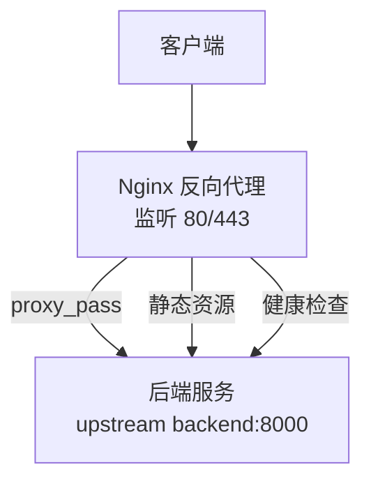
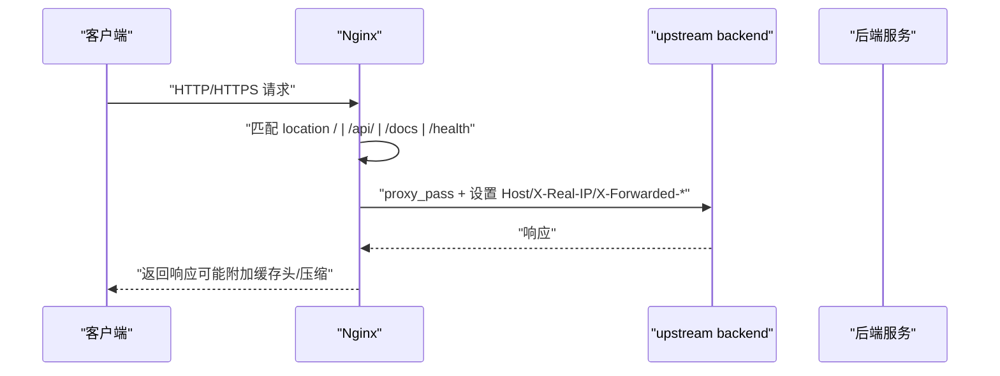
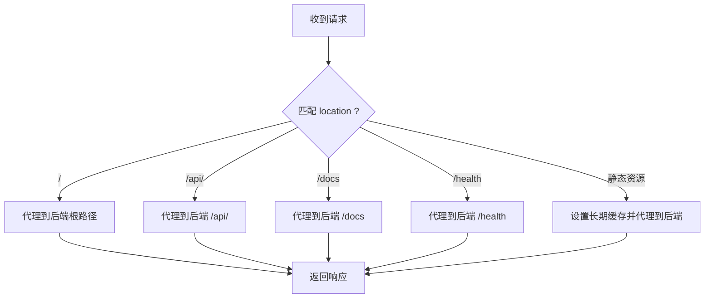
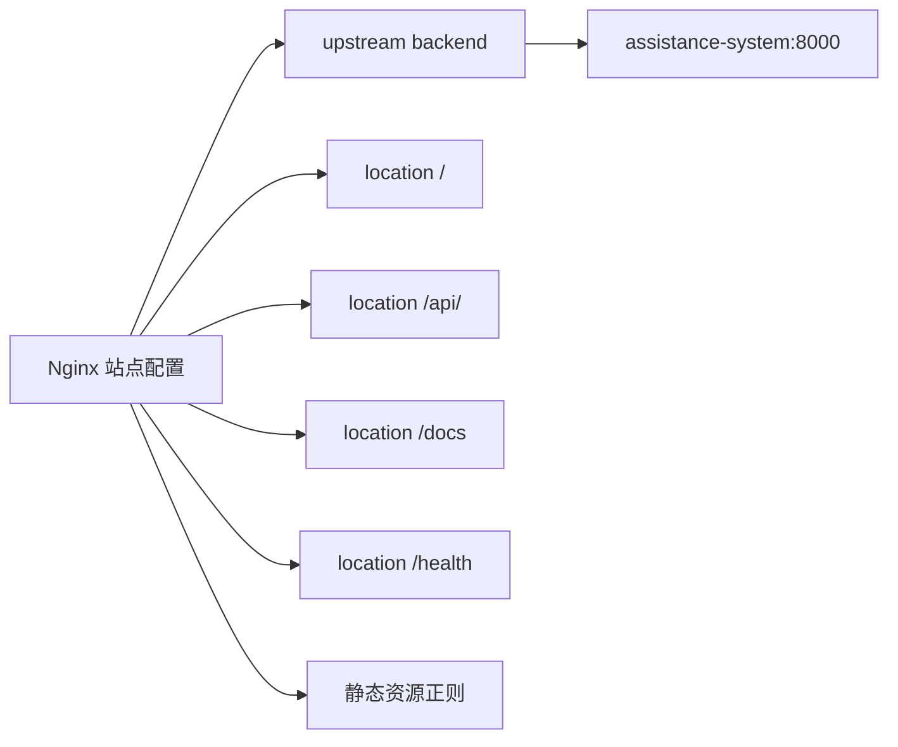

# Nginx反向代理配置

<cite>
**本文引用的文件**
- [nginx.conf](file://nginx/nginx.conf)
- [assistance.conf](file://nginx/conf.d/assistance.conf)
- [docker-compose.yml](file://docker-compose.yml)
- [security.py](file://backend/app/core/security.py)
- [cache_headers.py](file://backend/app/middleware/cache_headers.py)
</cite>

## 目录
1. [简介](#简介)
2. [项目结构](#项目结构)
3. [核心组件](#核心组件)
4. [架构总览](#架构总览)
5. [详细组件分析](#详细组件分析)
6. [依赖关系分析](#依赖关系分析)
7. [性能优化建议](#性能优化建议)
8. [安全加固指南](#安全加固指南)
9. [常见问题排查](#常见问题排查)
10. [结论](#结论)

## 简介
本指南面向在生产环境中使用 Nginx 作为反向代理部署本项目的运维与开发人员。内容覆盖：
- Nginx 主配置文件结构与关键参数（工作进程、连接数、缓冲区、日志、压缩等）
- 站点配置文件（虚拟主机、反向代理规则、静态资源缓存、健康检查）
- 反向代理进阶（负载均衡、WebSocket 支持、HTTPS 重定向与证书挂载）
- 安全加固（请求头过滤、访问控制、防 DDoS 与限流思路）
- 性能优化（gzip、浏览器缓存、连接池与超时调优）
- 常见问题定位与调优建议

说明：仓库已提供 Nginx 基础配置与 Docker 编排，本文在现有配置基础上给出生产级增强方案与落地步骤。

## 项目结构
- Nginx 主配置位于 nginx/nginx.conf，定义全局事件、HTTP 层通用设置与 gzip 压缩。
- 站点配置位于 nginx/conf.d/assistance.conf，定义 upstream、server、location 路由与健康检查。
- Docker Compose 将 Nginx 容器与后端服务关联，并映射 80/443 端口与 SSL 卷。

图表来源
- [nginx.conf:11-36](file://nginx/nginx.conf#L11-L36)
- [assistance.conf:1-48](file://nginx/conf.d/assistance.conf#L1-L48)
- [docker-compose.yml:159-187](file://docker-compose.yml#L159-L187)

章节来源
- [nginx.conf:1-36](file://nginx/nginx.conf#L1-L36)
- [assistance.conf:1-48](file://nginx/conf.d/assistance.conf#L1-L48)
- [docker-compose.yml:159-187](file://docker-compose.yml#L159-L187)

## 核心组件
- 主配置（nginx.conf）
  - 工作进程与事件：worker_processes auto；events.worker_connections 1024
  - HTTP 层：sendfile/tcp_nopush/tcp_nodelay/keepalive_timeout/types_hash_max_size/client_max_body_size
  - 日志：access_log/error_log 与自定义 main 格式
  - 压缩：gzip on/vary/proxied/comp_level/types
  - 包含站点：include /etc/nginx/conf.d/*.conf
- 站点配置（assistance.conf）
  - upstream backend 指向 assistance-system:8000
  - server 监听 80，server_name localhost
  - location 路由：根路径、/api/、/docs、/health
  - 静态资源匹配正则并设置长期缓存
- Docker 编排（docker-compose.yml）
  - nginx 容器暴露 80/443，挂载 nginx.conf、conf.d、ssl 目录与日志卷
  - 依赖 assistance-system 服务，限制 CPU/内存

章节来源
- [nginx.conf:1-36](file://nginx/nginx.conf#L1-L36)
- [assistance.conf:1-48](file://nginx/conf.d/assistance.conf#L1-L48)
- [docker-compose.yml:159-187](file://docker-compose.yml#L159-L187)

## 架构总览
Nginx 作为入口网关，统一处理 HTTPS 终止、静态资源缓存、请求转发与基本安全头。后端应用通过 upstream 被代理，支持健康检查与扩展为多实例负载均衡。

图表来源
- [assistance.conf:10-47](file://nginx/conf.d/assistance.conf#L10-L47)
- [nginx.conf:15-32](file://nginx/nginx.conf#L15-L32)

## 详细组件分析

### 主配置文件（nginx.conf）
- 工作进程与连接
  - worker_processes auto：按 CPU 核数自动分配
  - events.worker_connections 1024：单进程最大并发连接数
- HTTP 通用
  - sendfile/tcp_nopush/tcp_nodelay：提升静态文件传输效率
  - keepalive_timeout 65：长连接保持时间
  - client_max_body_size 100M：限制上传大小
  - types_hash_max_size 2048：MIME 类型哈希表大小
- 日志
  - access_log/main 格式记录远端地址、请求、状态、字节、Referer、UA、X-Forwarded-For
- 压缩
  - gzip on/vary/proxied any/comp_level 6/types 覆盖常见文本与 JSON/SVG
- 站点引入
  - include /etc/nginx/conf.d/*.conf

章节来源
- [nginx.conf:1-36](file://nginx/nginx.conf#L1-L36)

### 站点配置（assistance.conf）
- upstream backend
  - 当前仅单节点 assistance-system:8000，可扩展为多节点实现负载均衡
- server 与 location
  - 根路径 /：代理到后端，透传 Host、X-Real-IP、X-Forwarded-For、X-Forwarded-Proto
  - /api/：API 路由转发
  - /docs：文档路由转发
  - /health：健康检查路由转发
  - 静态资源正则匹配：jpg/jpeg/png/gif/ico/css/js/svg/woff/woff2/ttf/eot，设置 expires 1y 与 Cache-Control public, immutable
- 注意
  - 当前未启用 WebSocket 升级头，如需实时通信需补充 upgrade/connection 头
  - 未配置 HTTPS 与证书挂载，需在 docker-compose 或独立 Nginx 中完成

章节来源
- [assistance.conf:1-48](file://nginx/conf.d/assistance.conf#L1-L48)

### Docker 编排与端口/卷
- 端口映射
  - 80/443 由环境变量 NGINX_HTTP_PORT/NGINX_HTTPS_PORT 控制
- 卷挂载
  - nginx.conf、conf.d、ssl 目录只读挂载
  - 日志输出至 logs/nginx
- 资源限制
  - 限制 CPU 0.5、内存 256M

章节来源
- [docker-compose.yml:159-187](file://docker-compose.yml#L159-L187)

### 反向代理规则与扩展
- API 路由转发
  - /api/ 直接透传到后端对应路径，保留原始 Host 与客户端 IP 信息
- 静态资源缓存
  - 对图片、样式、脚本、字体等设置一年缓存与不可变策略，减少带宽与后端压力
- 健康检查
  - /health 用于外部探针探测后端可用性
- 负载均衡
  - 可在 upstream backend 中添加多个 server 实现轮询或加权
- WebSocket 支持
  - 若后端使用 WebSocket，需在对应 location 添加 proxy_http_version 1.1、proxy_set_header Upgrade $http_upgrade、proxy_set_header Connection "upgrade"

图表来源
- [assistance.conf:10-47](file://nginx/conf.d/assistance.conf#L10-L48)

## 依赖关系分析
- Nginx 依赖后端服务名称 assistance-system，通过 Docker 网络解析
- 站点配置中的 location 均依赖后端提供的路径语义（/api/, /docs, /health）
- 静态资源缓存策略与后端中间件的缓存头配合，避免重复请求

图表来源
- [assistance.conf:1-48](file://nginx/conf.d/assistance.conf#L1-L48)
- [docker-compose.yml:177-181](file://docker-compose.yml#L177-L181)

章节来源
- [assistance.conf:1-48](file://nginx/conf.d/assistance.conf#L1-L48)
- [docker-compose.yml:177-181](file://docker-compose.yml#L177-L181)

## 性能优化建议
- 连接与缓冲
  - 根据 CPU 核数调整 worker_processes；在高并发场景适当提高 worker_connections
  - 结合后端连接池（数据库/Redis）与 Nginx keepalive_timeout 调优
- 压缩
  - 已启用 gzip，可根据业务流量评估 comp_level 与 types 列表
- 缓存
  - 静态资源已设置长期缓存；后端中间件对部分 API 也设置了合理的 Cache-Control
- 日志
  - 生产环境建议开启请求耗时字段以便慢请求定位
- 上传
  - client_max_body_size 已设置为较大值，确保大文件上传不被拒绝

章节来源
- [nginx.conf:21-32](file://nginx/nginx.conf#L21-L32)
- [cache_headers.py:1-30](file://backend/app/middleware/cache_headers.py#L1-L30)

## 安全加固指南
- 安全响应头
  - 后端中间件已注入 X-Content-Type-Options、X-Frame-Options、X-XSS-Protection、Referrer-Policy 等，并在特定路径设置 Cache-Control
- 代理头信任
  - 默认不信任 X-Forwarded-For/X-Real-IP，仅在可信反代后启用 TRUST_PROXY_HEADERS，防止伪造客户端 IP
- 访问控制
  - 可通过 Nginx 的 allow/deny 或 geo/map 限制来源 IP
  - 对管理接口可加 Basic Auth 或基于 WAF 的白名单
- 防 DDoS 与限流
  - 建议在 Nginx 层使用 limit_req/limit_conn 进行请求与连接限速
  - 结合后端速率限制与渐进式惩罚机制，保护敏感接口
- HTTPS 与证书
  - 在 docker-compose 中挂载 ssl 目录，并在站点配置中启用 listen 443 ssl、配置证书与密钥、强制 HTTP→HTTPS 重定向

章节来源
- [security.py:609-712](file://backend/app/core/security.py#L609-L712)
- [docker-compose.yml:171-175](file://docker-compose.yml#L171-L175)

## 常见问题排查
- 无法访问后端
  - 检查 docker-compose 中 nginx 是否 depends_on assistance-system，且网络互通
  - 确认 upstream 名称与后端服务名一致
- 静态资源 404
  - 确认静态资源路径匹配正则，且后端确实提供该资源
  - 检查浏览器缓存是否生效（查看响应头 Cache-Control）
- 上传失败
  - 检查 client_max_body_size 是否足够
  - 检查后端接收大小限制与中间件 body size 校验
- 健康检查异常
  - 确认 /health 路由在后端可用，Nginx 正确转发
- 日志位置
  - 访问日志与错误日志位于容器内 /var/log/nginx，已通过卷映射到宿主机 logs/nginx

章节来源
- [assistance.conf:35-47](file://nginx/conf.d/assistance.conf#L35-L47)
- [nginx.conf:15-26](file://nginx/nginx.conf#L15-L26)
- [docker-compose.yml:171-175](file://docker-compose.yml#L171-L175)

## 结论
本项目已具备完整的 Nginx 反向代理基础配置，涵盖工作进程、连接、日志、压缩与基础路由。生产环境建议在此基础上：
- 启用 HTTPS 与证书，配置 HTTP→HTTPS 重定向
- 按需扩展 upstream 实现负载均衡
- 为需要 WebSocket 的路径添加升级头
- 增加访问控制与限流策略，强化安全
- 结合后端中间件的安全头与缓存策略，形成端到端的性能与安全闭环