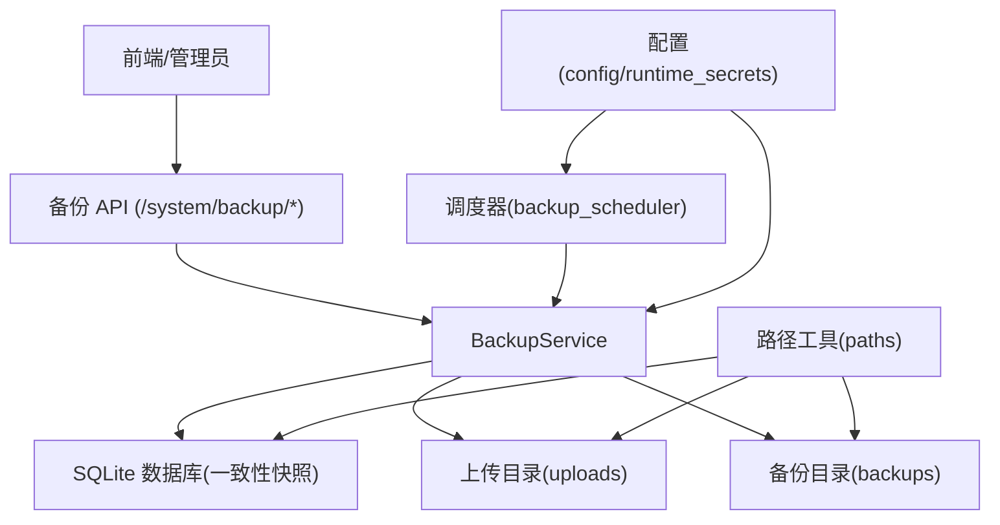
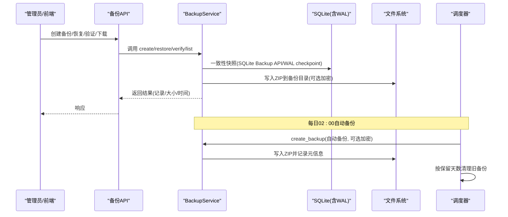
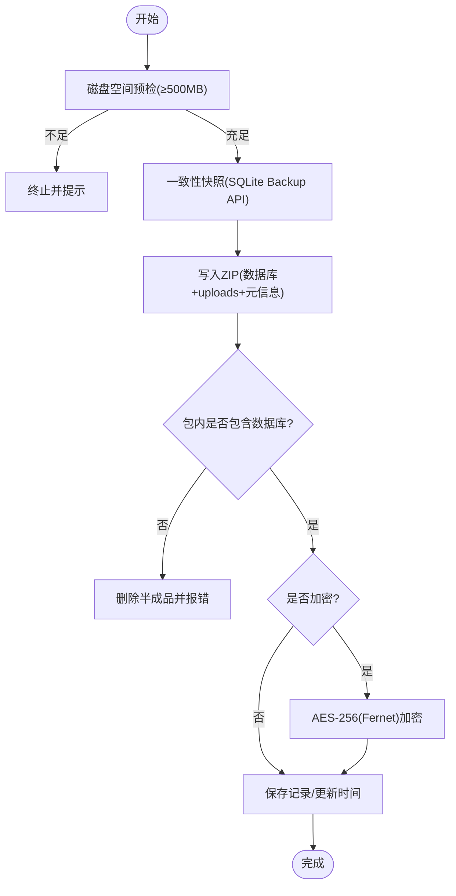
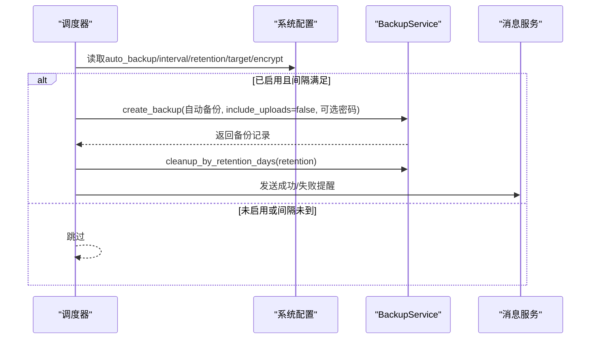
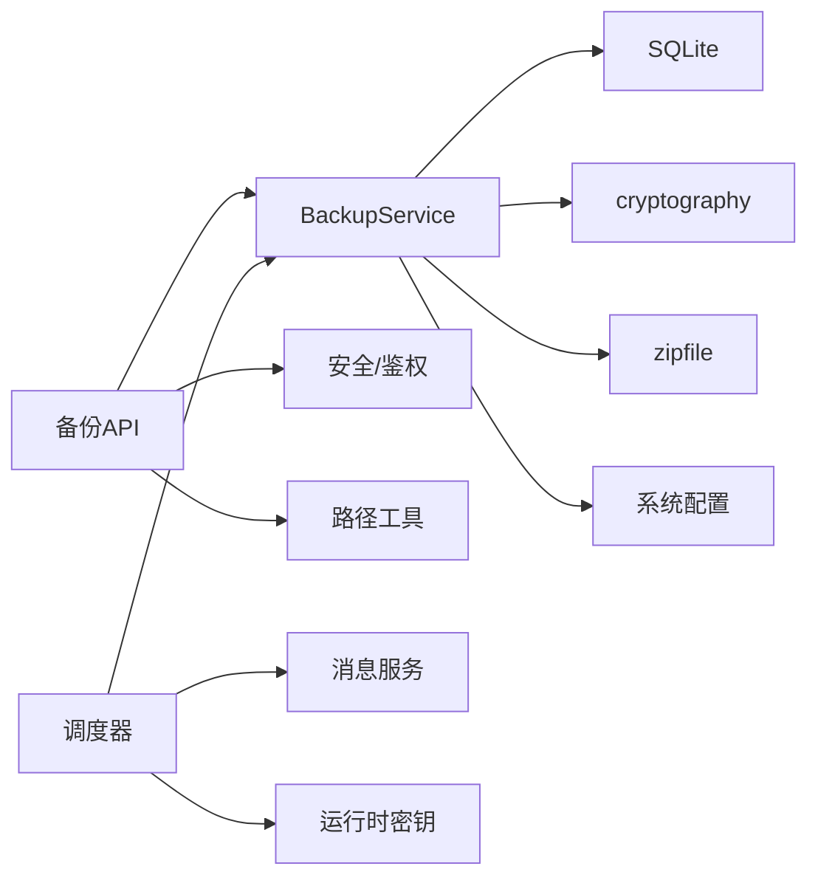

# 备份恢复

<cite>
**本文引用的文件**
- [backend/app/services/backup_service.py](file://backend/app/services/backup_service.py)
- [backend/app/services/backup_scheduler.py](file://backend/app/services/backup_scheduler.py)
- [backend/app/services/immediate_backup.py](file://backend/app/services/immediate_backup.py)
- [backend/app/api/v1/system/backup.py](file://backend/app/api/v1/system/backup.py)
- [backend/app/utils/paths.py](file://backend/app/utils/paths.py)
- [backend/app/core/config.py](file://backend/app/core/config.py)
- [docs/02-用户手册/备份管理操作说明.md](file://docs/02-用户手册/备份管理操作说明.md)
</cite>

## 目录
1. [简介](#简介)
2. [项目结构](#项目结构)
3. [核心组件](#核心组件)
4. [架构总览](#架构总览)
5. [详细组件分析](#详细组件分析)
6. [依赖关系分析](#依赖关系分析)
7. [性能与容量优化](#性能与容量优化)
8. [故障排查指南](#故障排查指南)
9. [结论](#结论)
10. [附录：配置项速查](#附录：配置项速查)

## 简介
本指南面向系统管理员与运维人员，提供完整的“系统备份与恢复”操作规范。内容覆盖数据库备份策略（全量、增量、定时）、文件备份范围（上传文件、配置文件、日志等）、存储位置与安全加密、恢复流程（手动/自动/灾难恢复）、数据完整性验证、性能优化与空间管理、以及监控告警配置。

## 项目结构
备份能力由后端服务层、调度器、API 接口与路径工具共同实现：
- 备份服务：封装备份创建、恢复、清理、校验、加密解密、一致性快照等核心逻辑
- 调度器：基于线程定时器实现每日定时任务（含自动备份）
- API：提供创建、列表、下载、预览、验证、恢复、目标目录设置等端点
- 路径工具：统一解析数据库、上传、备份、日志等目录，避免路径分叉
- 配置中心：集中读取环境变量与运行时密钥，支撑加密与路径动态化

图表来源
- [backend/app/api/v1/system/backup.py:173-703](file://backend/app/api/v1/system/backup.py#L173-L703)
- [backend/app/services/backup_service.py:74-760](file://backend/app/services/backup_service.py#L74-L760)
- [backend/app/services/backup_scheduler.py:60-148](file://backend/app/services/backup_scheduler.py#L60-L148)
- [backend/app/utils/paths.py:142-301](file://backend/app/utils/paths.py#L142-L301)
- [backend/app/core/config.py:296-383](file://backend/app/core/config.py#L296-L383)

章节来源
- [backend/app/api/v1/system/backup.py:173-703](file://backend/app/api/v1/system/backup.py#L173-L703)
- [backend/app/services/backup_service.py:74-760](file://backend/app/services/backup_service.py#L74-L760)
- [backend/app/services/backup_scheduler.py:60-148](file://backend/app/services/backup_scheduler.py#L60-L148)
- [backend/app/utils/paths.py:142-301](file://backend/app/utils/paths.py#L142-L301)
- [backend/app/core/config.py:296-383](file://backend/app/core/config.py#L296-L383)

## 核心组件
- BackupService：负责备份创建、恢复、清理、校验、加密/解密、一致性快照、磁盘空间预检、增量清单（预留扩展）
- backup_scheduler：后台定时任务，按策略执行自动备份、保留期清理、消息提醒
- immediate_backup：关键操作前后触发一次即时备份（后台线程，幂等保护）
- 备份 API：暴露创建、列表、下载、预览、验证、恢复、目标目录设置等能力
- paths：统一解析数据库、上传、备份、日志等路径，防止路径穿越
- config：集中加载环境变量与运行时密钥，保障生产安全基线

章节来源
- [backend/app/services/backup_service.py:74-760](file://backend/app/services/backup_service.py#L74-L760)
- [backend/app/services/backup_scheduler.py:60-148](file://backend/app/services/backup_scheduler.py#L60-L148)
- [backend/app/services/immediate_backup.py:17-58](file://backend/app/services/immediate_backup.py#L17-L58)
- [backend/app/api/v1/system/backup.py:173-703](file://backend/app/api/v1/system/backup.py#L173-L703)
- [backend/app/utils/paths.py:142-301](file://backend/app/utils/paths.py#L142-L301)
- [backend/app/core/config.py:296-383](file://backend/app/core/config.py#L296-L383)

## 架构总览
备份与恢复的关键调用链如下：

图表来源
- [backend/app/api/v1/system/backup.py:173-703](file://backend/app/api/v1/system/backup.py#L173-L703)
- [backend/app/services/backup_service.py:216-395](file://backend/app/services/backup_service.py#L216-L395)
- [backend/app/services/backup_scheduler.py:60-148](file://backend/app/services/backup_scheduler.py#L60-L148)

## 详细组件分析

### 备份服务（BackupService）
- 一致性快照：优先使用 SQLite Backup API 生成一致快照；失败回退 WAL checkpoint + 裸拷贝，确保备份可恢复
- 压缩与完整性：ZIP 压缩；强制校验包内必须包含数据库文件，否则视为失败并删除半成品
- 加密：AES-256（Fernet），PBKDF2 派生密钥；支持检测/解密到临时文件，不破坏原始加密备份
- 恢复：解压→复制数据库→复制上传文件→完整性检查→失败回滚到快照；恢复后建议重启以回收连接池
- 清理：按数量或按保留天数清理旧备份；计算备份目录总大小
- 增量：提供清单与哈希计算基础（last_manifest.json、SHA256），为后续增量策略预留扩展点

图表来源
- [backend/app/services/backup_service.py:216-395](file://backend/app/services/backup_service.py#L216-L395)

章节来源
- [backend/app/services/backup_service.py:74-760](file://backend/app/services/backup_service.py#L74-L760)

### 定时备份（backup_scheduler）
- 触发时机：每日 02:00 执行自动备份
- 策略控制：从系统配置读取 auto_backup、backup_interval_days、backup_retention_days、backup_target_dir、backup_encrypt
- 加密口令：自动备份的加密口令来自运行时持久化密钥（BACKUP_ENCRYPTION_KEY），避免硬编码
- 保留策略：按 retention_days 清理过期备份
- 通知：成功/失败均通过站内消息通知管理员

图表来源
- [backend/app/services/backup_scheduler.py:60-148](file://backend/app/services/backup_scheduler.py#L60-L148)

章节来源
- [backend/app/services/backup_scheduler.py:60-148](file://backend/app/services/backup_scheduler.py#L60-L148)

### 即时备份（immediate_backup）
- 场景：重大变更（导入/批量删除/恢复等）前后触发一次备份，确保可回退
- 特性：后台线程执行，同一时刻仅允许一个在跑（幂等锁），不阻塞主流程

章节来源
- [backend/app/services/immediate_backup.py:17-58](file://backend/app/services/immediate_backup.py#L17-L58)

### 备份 API（/system/backup/*）
- 创建备份：POST /api/v1/backup
- 列表/统计：GET /api/v1/backup、/stats
- 目标目录：GET /dirs、PUT /target
- 计划配置：GET /schedule、PUT /schedule
- 下载/预览/验证：GET /download/{f}、/preview/{f}、/verify/{f}
- 恢复：POST /restore、POST /upload-restore（流式上传、大小限制、路径校验）

权限与鉴权：
- 写操作需管理员或本机内部密钥（Electron 注入）
- 读列表支持任意登录用户或内部密钥

章节来源
- [backend/app/api/v1/system/backup.py:173-703](file://backend/app/api/v1/system/backup.py#L173-L703)

### 路径与存储位置
- 数据库路径：优先 DATABASE_URL → settings.DATABASE_URL → 默认 data/rural_revitalization.db
- 上传目录：优先 UPLOAD_DIR → settings.UPLOAD_DIR → 默认 uploads
- 备份目录：默认 app_data_dir/backups，可通过配置或请求参数指定外部盘符（U盘/移动硬盘）
- 日志目录：app_data_dir/logs

章节来源
- [backend/app/utils/paths.py:142-301](file://backend/app/utils/paths.py#L142-L301)
- [backend/app/core/config.py:296-383](file://backend/app/core/config.py#L296-L383)

## 依赖关系分析
- BackupService 依赖：
  - SQLite（一致性快照、WAL checkpoint）
  - cryptography（Fernet/AES-256、PBKDF2）
  - zipfile（打包/解压）
  - paths（数据库/上传/备份/日志路径）
  - system_config_service（读取/写入配置）
- backup_scheduler 依赖：
  - system_config_service（读取策略）
  - runtime_secrets（自动备份口令）
  - message_service（备份结果通知）
- API 依赖：
  - security（JWT/管理员校验）
  - drive_detect（目标目录可用性检测）

图表来源
- [backend/app/api/v1/system/backup.py:173-703](file://backend/app/api/v1/system/backup.py#L173-L703)
- [backend/app/services/backup_service.py:74-760](file://backend/app/services/backup_service.py#L74-L760)
- [backend/app/services/backup_scheduler.py:60-148](file://backend/app/services/backup_scheduler.py#L60-L148)

章节来源
- [backend/app/api/v1/system/backup.py:173-703](file://backend/app/api/v1/system/backup.py#L173-L703)
- [backend/app/services/backup_service.py:74-760](file://backend/app/services/backup_service.py#L74-L760)
- [backend/app/services/backup_scheduler.py:60-148](file://backend/app/services/backup_scheduler.py#L60-L148)

## 性能与容量优化
- 一致性快照：优先使用 SQLite Backup API，减少 WAL 合并开销；失败回退 checkpoint + 裸拷贝
- 压缩级别：可通过环境变量调整 BACKUP_COMPRESSION_LEVEL（0-9），平衡速度与体积
- 磁盘空间预检：默认要求 ≥500MB 剩余空间，避免写出损坏备份
- 恢复时连接池释放：恢复前 dispose 引擎，恢复后再次 dispose，降低句柄冲突风险
- 上传恢复流式处理：分块写入，限制最大 10GB，避免 OOM
- 增量备份预留：清单与哈希计算已就绪，可按需开启增量策略以降低带宽与存储压力

[本节为通用指导，无需特定文件引用]

## 故障排查指南
- 备份失败（不完整）：检查是否包含数据库文件；查看日志中“备份未能包含数据库文件”相关错误
- 恢复失败：确认备份文件是否加密及密码是否正确；检查磁盘空间与权限；恢复后如异常，回滚到快照
- 自动备份未执行：检查 auto_backup 开关、backup_interval_days 间隔、backup_target_dir 是否可写
- 目标目录不可用：使用 /system/backup/dirs 探测可用盘符；NTFS/exFAT 推荐；拔盘前确认任务完成
- 空间不足：清理旧备份（按数量/天数），或迁移备份目标到更大磁盘/U盘

章节来源
- [backend/app/services/backup_service.py:216-395](file://backend/app/services/backup_service.py#L216-L395)
- [backend/app/services/backup_scheduler.py:60-148](file://backend/app/services/backup_scheduler.py#L60-L148)
- [docs/02-用户手册/备份管理操作说明.md:1-43](file://docs/02-用户手册/备份管理操作说明.md#L1-L43)

## 结论
本系统提供了完善的全量备份、定时备份、即时备份与恢复能力，内置一致性快照、AES-256 加密、路径安全校验与空间预检，并通过调度器与消息机制实现自动化与可观测性。建议在生产环境：
- 保持自动备份开启，合理设置保留天数
- 将备份目标指向独立介质（U盘/移动硬盘）
- 定期验证备份完整性，演练恢复流程
- 结合监控与告警，及时发现备份失败与空间不足问题

[本节为总结性内容，无需特定文件引用]

## 附录：配置项速查
- 自动备份开关：auto_backup（true/false）
- 备份间隔：backup_interval_days（天）
- 保留天数：backup_retention_days（天）
- 备份目标目录：backup_target_dir（可为空，默认应用数据目录下的 backups）
- 自动备份加密：backup_encrypt（true/false）
- 压缩级别：BACKUP_COMPRESSION_LEVEL（0-9）
- 增量备份开关：INCREMENTAL_BACKUP_ENABLED（true/false）
- 运行时密钥：BACKUP_ENCRYPTION_KEY（自动备份口令，自动生成并持久化）

章节来源
- [backend/app/services/backup_scheduler.py:60-148](file://backend/app/services/backup_scheduler.py#L60-L148)
- [backend/app/services/backup_service.py:99-102](file://backend/app/services/backup_service.py#L99-L102)
- [backend/app/core/config.py:296-383](file://backend/app/core/config.py#L296-L383)