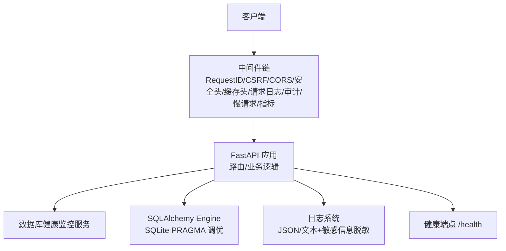
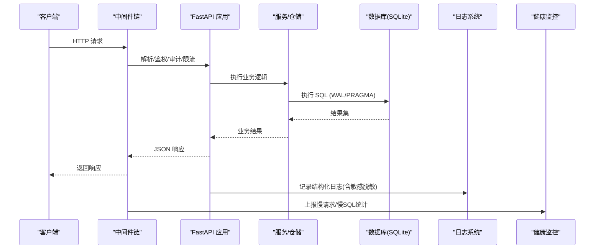
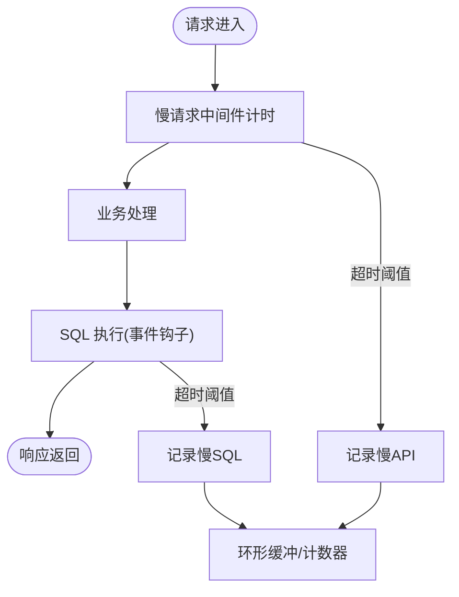
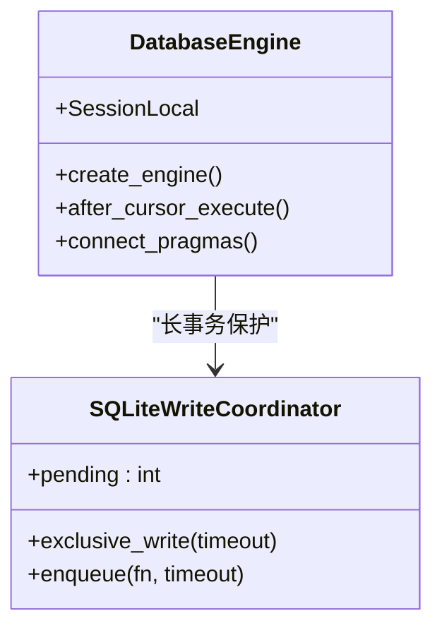
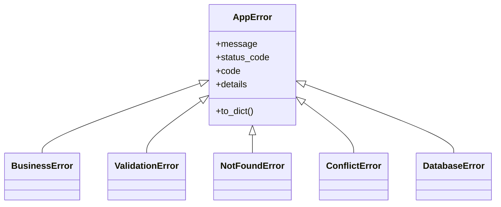
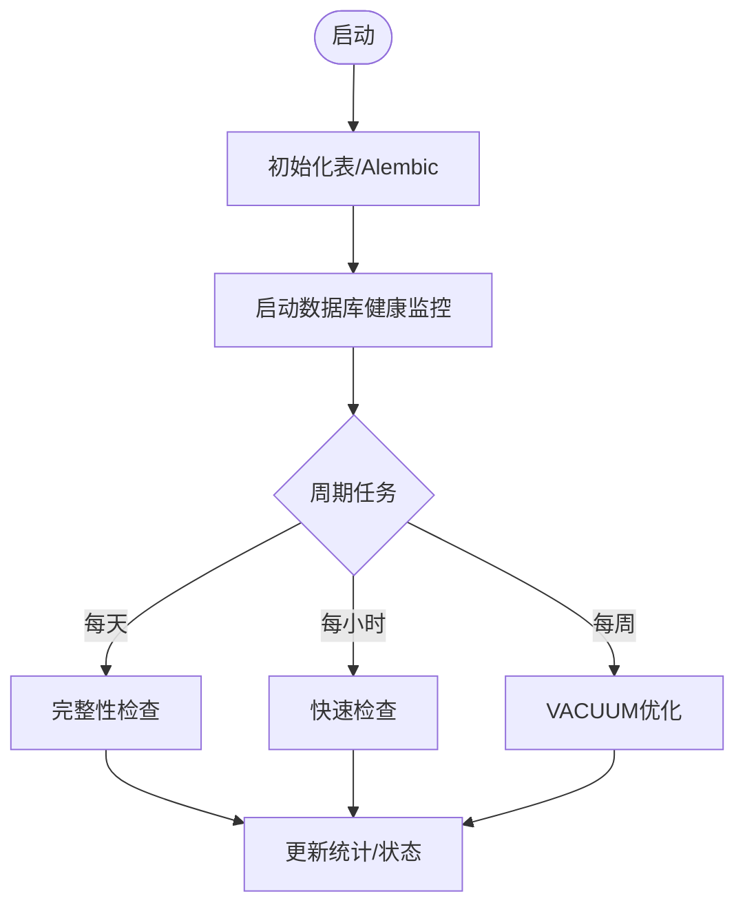

# 故障排查

<cite>
**本文引用的文件**
- [backend/app/main.py](file://backend/app/main.py)
- [backend/app/core/logging_config.py](file://backend/app/core/logging_config.py)
- [backend/app/core/logging.py](file://backend/app/core/logging.py)
- [backend/app/core/database.py](file://backend/app/core/database.py)
- [backend/app/core/exceptions.py](file://backend/app/core/exceptions.py)
- [backend/app/core/error_handler.py](file://backend/app/core/error_handler.py)
- [backend/app/middleware/slow_request_monitor.py](file://backend/app/middleware/slow_request_monitor.py)
- [backend/app/services/database_health_service.py](file://backend/app/services/database_health_service.py)
- [backend/scripts/system_health_check.py](file://backend/scripts/system_health_check.py)
- [backend/scripts/diagnose_database.py](file://backend/scripts/diagnose_database.py)
- [backend/scripts/profile_api.py](file://backend/scripts/profile_api.py)
- [backend/scripts/diagnose_issues.py](file://backend/scripts/diagnose_issues.py)
</cite>

## 目录
1. [简介](#简介)
2. [项目结构](#项目结构)
3. [核心组件](#核心组件)
4. [架构总览](#架构总览)
5. [详细组件分析](#详细组件分析)
6. [依赖关系分析](#依赖关系分析)
7. [性能与容量规划](#性能与容量规划)
8. [故障排查指南](#故障排查指南)
9. [结论](#结论)
10. [附录：常用命令与脚本](#附录常用命令与脚本)

## 简介
本指南面向运维与研发人员，系统化说明如何识别、诊断和恢复系统常见故障，包括数据库连接异常、API响应异常、内存与资源泄漏、慢查询与性能瓶颈等。文档基于仓库中的日志体系、健康检查服务、中间件监控、数据库优化配置以及配套诊断脚本，提供从“现象定位—根因分析—恢复操作—预防建议”的完整闭环。

## 项目结构
后端采用 FastAPI + SQLAlchemy（SQLite 深度优化）架构，内置请求链路追踪、慢请求/慢 SQL 监控、结构化日志与敏感信息脱敏、数据库健康监控与 WAL 维护、Alembic 迁移与健康暴露等能力。关键入口与能力分布如下：
- 应用启动与生命周期：[backend/app/main.py](file://backend/app/main.py)
- 日志体系与脱敏：[backend/app/core/logging_config.py](file://backend/app/core/logging_config.py)、[backend/app/core/logging.py](file://backend/app/core/logging.py)
- 数据库引擎与 SQLite PRAGMA 调优：[backend/app/core/database.py](file://backend/app/core/database.py)
- 统一异常处理与错误响应：[backend/app/core/exceptions.py](file://backend/app/core/exceptions.py)、[backend/app/core/error_handler.py](file://backend/app/core/error_handler.py)
- 慢请求/慢 SQL 监控中间件：[backend/app/middleware/slow_request_monitor.py](file://backend/app/middleware/slow_request_monitor.py)
- 数据库健康监控服务：[backend/app/services/database_health_service.py](file://backend/app/services/database_health_service.py)
- 系统健康检查脚本：[backend/scripts/system_health_check.py](file://backend/scripts/system_health_check.py)
- 数据库诊断脚本：[backend/scripts/diagnose_database.py](file://backend/scripts/diagnose_database.py)
- API 性能剖析脚本：[backend/scripts/profile_api.py](file://backend/scripts/profile_api.py)
- 数据问题诊断脚本：[backend/scripts/diagnose_issues.py](file://backend/scripts/diagnose_issues.py)

**图表来源**
- [backend/app/main.py:113-165](file://backend/app/main.py#L113-L165)
- [backend/app/core/database.py:78-157](file://backend/app/core/database.py#L78-L157)
- [backend/app/core/logging_config.py:161-253](file://backend/app/core/logging_config.py#L161-L253)
- [backend/app/services/database_health_service.py:80-133](file://backend/app/services/database_health_service.py#L80-L133)

**章节来源**
- [backend/app/main.py:68-181](file://backend/app/main.py#L68-L181)
- [backend/app/core/database.py:55-67](file://backend/app/core/database.py#L55-L67)
- [backend/app/core/logging_config.py:161-253](file://backend/app/core/logging_config.py#L161-L253)

## 核心组件
- 应用生命周期与启动自检：初始化数据库表、执行 Alembic 升级、记录迁移状态、启动备份/任务队列/健康监控等。
- 日志系统：统一初始化、按天/大小轮转、JSON 结构化输出、敏感信息自动脱敏。
- 数据库层：WAL 模式、PRAGMA 调优、连接池参数、长事务独占写协调器、磁盘空间检查。
- 异常处理：统一 AppError 体系、Pydantic 验证错误、全局未捕获异常兜底。
- 监控与可观测性：慢请求/慢 SQL 环形缓冲统计、指标中间件、审计日志、请求 ID 链路。
- 健康检查：/health 暴露版本与迁移状态；数据库健康服务定时完整性/快速检查/VACUUM。

**章节来源**
- [backend/app/main.py:68-181](file://backend/app/main.py#L68-L181)
- [backend/app/core/logging_config.py:161-253](file://backend/app/core/logging_config.py#L161-L253)
- [backend/app/core/database.py:78-157](file://backend/app/core/database.py#L78-L157)
- [backend/app/core/exceptions.py:121-145](file://backend/app/core/exceptions.py#L121-L145)
- [backend/app/middleware/slow_request_monitor.py:55-132](file://backend/app/middleware/slow_request_monitor.py#L55-L132)
- [backend/app/services/database_health_service.py:80-133](file://backend/app/services/database_health_service.py#L80-L133)

## 架构总览
下图展示一次请求从进入中间件到落库、再到返回的全链路，以及慢请求/慢 SQL 的采集路径。

**图表来源**
- [backend/app/main.py:113-165](file://backend/app/main.py#L113-L165)
- [backend/app/core/database.py:78-157](file://backend/app/core/database.py#L78-L157)
- [backend/app/core/logging_config.py:161-253](file://backend/app/core/logging_config.py#L161-L253)
- [backend/app/middleware/slow_request_monitor.py:55-132](file://backend/app/middleware/slow_request_monitor.py#L55-L132)

## 详细组件分析

### 日志与可观测性
- 统一初始化：通过配置项控制级别、格式、文件路径、轮转策略；控制台与文件双通道输出。
- 敏感信息脱敏：对身份证号、手机号、邮箱及常见密钥键值进行正则替换，避免凭据落入日志。
- 慢请求/慢 SQL：中间件在 ASGI 层记录超过阈值的 API 耗时；通过 SQLAlchemy 事件钩子记录慢 SQL 语句与参数片段。
- 请求链路：RequestID 贯穿全链路，便于聚合日志与问题定位。

**图表来源**
- [backend/app/middleware/slow_request_monitor.py:55-132](file://backend/app/middleware/slow_request_monitor.py#L55-L132)
- [backend/app/core/logging_config.py:75-119](file://backend/app/core/logging_config.py#L75-L119)

**章节来源**
- [backend/app/core/logging_config.py:161-253](file://backend/app/core/logging_config.py#L161-L253)
- [backend/app/middleware/slow_request_monitor.py:55-132](file://backend/app/middleware/slow_request_monitor.py#L55-L132)

### 数据库层与连接管理
- 引擎与连接池：针对 SQLite 使用 QueuePool，限制连接数并启用 pool_pre_ping 健康检查。
- PRAGMA 调优：WAL、NORMAL 同步、busy_timeout、cache_size、mmap_size、temp_store=MEMORY、自动索引、optimize 等。
- 写入协调器：长事务使用 exclusive_write 获取进程内互斥锁，避免 SQLITE_BUSY 中断。
- 加密支持：可选 SQLCipher 探测与密钥校验，失败时 fail-fast。
- 磁盘空间检查：防止备份/导出时磁盘不足导致失败。

**图表来源**
- [backend/app/core/database.py:55-67](file://backend/app/core/database.py#L55-L67)
- [backend/app/core/database.py:78-157](file://backend/app/core/database.py#L78-L157)
- [backend/app/core/database.py:198-285](file://backend/app/core/database.py#L198-L285)

**章节来源**
- [backend/app/core/database.py:55-67](file://backend/app/core/database.py#L55-L67)
- [backend/app/core/database.py:78-157](file://backend/app/core/database.py#L78-L157)
- [backend/app/core/database.py:198-285](file://backend/app/core/database.py#L198-L285)
- [backend/app/core/database.py:292-343](file://backend/app/core/database.py#L292-L343)

### 异常与错误响应
- 统一异常类：AppError 及其子类（BusinessError、ValidationError、NotFoundError、ConflictError、DatabaseError 等）。
- 全局处理器：注册 Pydantic 验证错误与全局未捕获异常处理器，保证一致的错误响应体。
- 便捷响应构建：error_response、not_found_response、forbidden_response、server_error_response。

**图表来源**
- [backend/app/core/exceptions.py:11-119](file://backend/app/core/exceptions.py#L11-L119)
- [backend/app/core/error_handler.py:38-108](file://backend/app/core/error_handler.py#L38-L108)

**章节来源**
- [backend/app/core/exceptions.py:121-145](file://backend/app/core/exceptions.py#L121-L145)
- [backend/app/core/error_handler.py:38-108](file://backend/app/core/error_handler.py#L38-L108)

### 健康检查与服务状态
- /health 端点：返回版本、构建信息与迁移是否达到 head（不暴露敏感原文）。
- 数据库健康服务：后台线程周期性执行完整性检查、快速检查、VACUUM 优化，并维护统计与状态。
- 系统健康检查脚本：检查 Python 版本、依赖包、目录权限、数据库存在性与大小、端口占用等。

**图表来源**
- [backend/app/main.py:68-98](file://backend/app/main.py#L68-L98)
- [backend/app/services/database_health_service.py:80-133](file://backend/app/services/database_health_service.py#L80-L133)
- [backend/scripts/system_health_check.py:161-215](file://backend/scripts/system_health_check.py#L161-L215)

**章节来源**
- [backend/app/main.py:237-262](file://backend/app/main.py#L237-L262)
- [backend/app/services/database_health_service.py:135-222](file://backend/app/services/database_health_service.py#L135-L222)
- [backend/scripts/system_health_check.py:29-159](file://backend/scripts/system_health_check.py#L29-L159)

## 依赖关系分析
- 中间件顺序决定执行时序：请求先经 RequestID → 安全头 → CORS → 驼峰转换 → CSRF → 请求日志 → 审计 → 慢请求 → 指标。
- 数据库事件监听：after_cursor_execute 将 SQL 计数注入当前请求上下文，供慢 SQL 监控消费。
- 健康监控与主进程解耦：独立线程运行，不影响主请求路径。

**图表来源**
- [backend/app/main.py:113-165](file://backend/app/main.py#L113-L165)
- [backend/app/core/database.py:70-76](file://backend/app/core/database.py#L70-L76)
- [backend/app/middleware/slow_request_monitor.py:70-101](file://backend/app/middleware/slow_request_monitor.py#L70-L101)

**章节来源**
- [backend/app/main.py:113-165](file://backend/app/main.py#L113-L165)
- [backend/app/core/database.py:70-76](file://backend/app/core/database.py#L70-L76)
- [backend/app/middleware/slow_request_monitor.py:70-101](file://backend/app/middleware/slow_request_monitor.py#L70-L101)

## 性能与容量规划
- SQLite 并发与锁：短事务依赖 busy_timeout 重试；长事务使用 exclusive_write 串行化，避免 SQLITE_BUSY。
- 内存与缓存：cache_size、mmap_size、temp_store=MEMORY 提升查询性能；按需调整环境变量。
- 日志轮转：按天或按大小轮转，避免磁盘占满；Windows 下安全轮转重试机制。
- 备份与 WAL：定期 checkpoint 与 VACUUM 控制 wal 文件大小与碎片。

[本节为通用指导，无需特定文件引用]

## 故障排查指南

### 一、常见问题类型与定位方法
- 数据库连接问题
  - 现象：启动时报错、接口频繁报 SQLITE_BUSY、备份失败。
  - 定位：查看数据库健康服务统计与日志；检查 PRAGMA 配置与连接池参数；确认磁盘空间充足。
  - 工具：系统健康检查脚本、数据库诊断脚本。
- API 响应异常
  - 现象：4xx/5xx 响应、参数校验失败、权限拒绝。
  - 定位：通过 RequestID 关联日志；检查异常处理器输出；核对入参与权限模型。
  - 工具：慢请求中间件统计、全局异常处理器日志。
- 内存与资源泄漏
  - 现象：进程内存持续增长、文件句柄未释放、日志无法轮转。
  - 定位：观察日志轮转是否成功；检查是否有未关闭的连接/文件；结合系统资源监控。
  - 工具：日志系统（带安全轮转）、系统健康检查脚本。
- 性能瓶颈
  - 现象：接口平均耗时升高、慢 SQL 增多。
  - 定位：慢请求/慢 SQL 环形缓冲；cProfile 剖析热点函数；必要时开启 SQL echo 辅助定位。
  - 工具：慢请求中间件、profile_api 脚本。

**章节来源**
- [backend/app/services/database_health_service.py:135-222](file://backend/app/services/database_health_service.py#L135-L222)
- [backend/app/middleware/slow_request_monitor.py:55-132](file://backend/app/middleware/slow_request_monitor.py#L55-L132)
- [backend/scripts/system_health_check.py:161-215](file://backend/scripts/system_health_check.py#L161-L215)
- [backend/scripts/profile_api.py:67-129](file://backend/scripts/profile_api.py#L67-L129)

### 二、日志分析方法
- 错误日志定位
  - 步骤：根据时间窗口筛选 ERROR/CRITICAL；用 RequestID 过滤同一请求；关注异常堆栈与模块名。
  - 要点：日志已做敏感信息脱敏，若需原始信息请查看服务端内部日志或调试环境。
- 堆栈跟踪分析
  - 步骤：定位异常抛出点；结合业务上下文判断根因；对照异常类型（如 DatabaseError、ValidationError）。
- 性能日志解读
  - 步骤：查看慢 API/慢 SQL 列表；计算最近 50 条平均值与峰值；定位重复出现的慢查询。
  - 工具：慢请求中间件统计接口、profile_api 输出。

**章节来源**
- [backend/app/core/logging_config.py:75-119](file://backend/app/core/logging_config.py#L75-L119)
- [backend/app/core/exceptions.py:121-145](file://backend/app/core/exceptions.py#L121-L145)
- [backend/app/middleware/slow_request_monitor.py:32-52](file://backend/app/middleware/slow_request_monitor.py#L32-L52)

### 三、系统健康检查工具
- 数据库健康检查
  - 功能：完整性检查、快速检查、VACUUM 优化、索引检查、统计信息分析。
  - 使用：服务启动后自动运行；可通过脚本触发或查看健康状态。
- 服务状态监控
  - 功能：/health 暴露版本与迁移状态；慢请求/慢 SQL 统计；指标中间件收集。
- 依赖服务检测
  - 功能：系统健康检查脚本校验 Python 版本、依赖包、目录权限、端口占用、数据库存在性。

**章节来源**
- [backend/app/services/database_health_service.py:135-331](file://backend/app/services/database_health_service.py#L135-L331)
- [backend/app/main.py:237-262](file://backend/app/main.py#L237-L262)
- [backend/scripts/system_health_check.py:29-159](file://backend/scripts/system_health_check.py#L29-L159)

### 四、调试工具与命令
- SQL 查询分析
  - 使用数据库诊断脚本生成报告，包含完整性、外键约束、PRAGMA 配置、统计信息等。
- 接口测试
  - 使用 profile_api 脚本对指定端点进行 cProfile 剖析，输出 Top 函数与 pstats 文件。
- 性能剖析
  - 批量分析核心端点，标记慢端点；保存 pstats 用 snakeviz 可视化。

**章节来源**
- [backend/scripts/diagnose_database.py:41-156](file://backend/scripts/diagnose_database.py#L41-L156)
- [backend/scripts/profile_api.py:67-129](file://backend/scripts/profile_api.py#L67-L129)

### 五、故障恢复标准操作流程
- 服务重启
  - 步骤：停止服务 → 检查日志与磁盘空间 → 修复配置/权限 → 重新启动服务。
  - 注意：生产环境迁移失败会中止启动，需先修复迁移后再上线。
- 数据修复
  - 步骤：运行数据库诊断脚本 → 根据报告修复外键违规或完整性问题 → 必要时执行 VACUUM。
- 配置回滚
  - 步骤：回滚 .env 或配置项 → 重启服务 → 验证 /health 与关键接口。
- 应急措施
  - 长事务阻塞：优先终止长时间运行的导入/导出任务；必要时重启服务释放锁。
  - 磁盘不足：清理旧日志/备份，扩大磁盘；调整日志轮转策略。

**章节来源**
- [backend/app/main.py:436-507](file://backend/app/main.py#L436-L507)
- [backend/scripts/diagnose_database.py:41-156](file://backend/scripts/diagnose_database.py#L41-L156)
- [backend/app/services/database_health_service.py:224-262](file://backend/app/services/database_health_service.py#L224-L262)

### 六、预防性维护与最佳实践
- 数据库
  - 保持 WAL 与 PRAGMA 配置生效；定期 VACUUM；监控空闲页与碎片率。
  - 长事务使用 exclusive_write 串行化；短事务避免跨请求持有连接。
- 日志
  - 启用 JSON 结构化日志；合理设置轮转策略；确保敏感信息脱敏生效。
- 监控
  - 关注慢请求/慢 SQL 趋势；设置告警阈值；定期导出健康报告。
- 变更管理
  - 所有 schema 变更走 Alembic；生产环境迁移失败应阻断发布；灰度验证后再全量。

[本节为通用指导，无需特定文件引用]

## 结论
本系统提供了完善的日志、健康检查、慢请求/慢 SQL 监控与数据库优化能力。通过标准化流程与配套脚本，可高效定位与恢复数据库连接、API 异常、性能瓶颈等问题。建议在生产环境中持续运行健康检查与监控，严格遵循变更管理与备份策略，降低故障风险。

[本节为总结，无需特定文件引用]

## 附录：常用命令与脚本
- 系统健康检查
  - 运行：python backend/scripts/system_health_check.py
  - 作用：检查 Python 版本、依赖、目录权限、数据库、端口占用。
- 数据库诊断
  - 运行：python backend/scripts/diagnose_database.py
  - 作用：完整性、外键、PRAGMA 配置、统计信息分析与建议。
- API 性能剖析
  - 单端点：python backend/scripts/profile_api.py --endpoint /api/v1/xxx --count 100
  - 批量：python backend/scripts/profile_api.py --batch --count 50
  - 输出 pstats：python backend/scripts/profile_api.py --endpoint /api/v1/xxx --output profile.pstats
- 数据问题诊断
  - 运行：python backend/scripts/diagnose_issues.py
  - 作用：检查管理员、学校、组织数据与常见权限问题。

**章节来源**
- [backend/scripts/system_health_check.py:161-215](file://backend/scripts/system_health_check.py#L161-L215)
- [backend/scripts/diagnose_database.py:159-197](file://backend/scripts/diagnose_database.py#L159-L197)
- [backend/scripts/profile_api.py:132-167](file://backend/scripts/profile_api.py#L132-L167)
- [backend/scripts/diagnose_issues.py:15-96](file://backend/scripts/diagnose_issues.py#L15-L96)