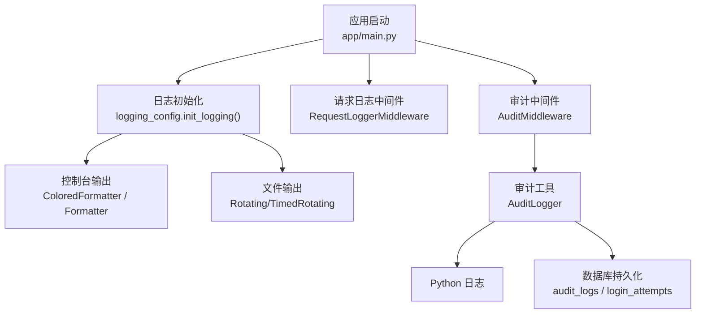
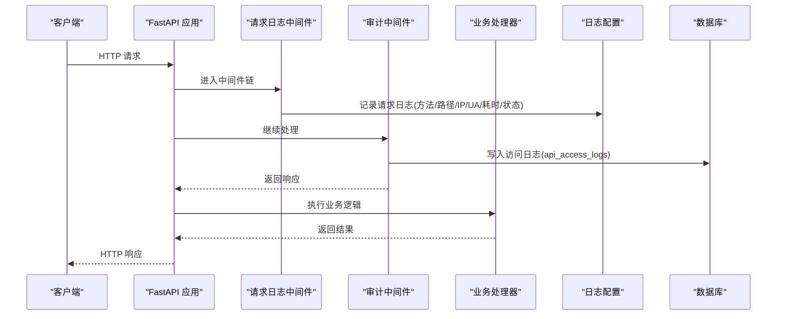
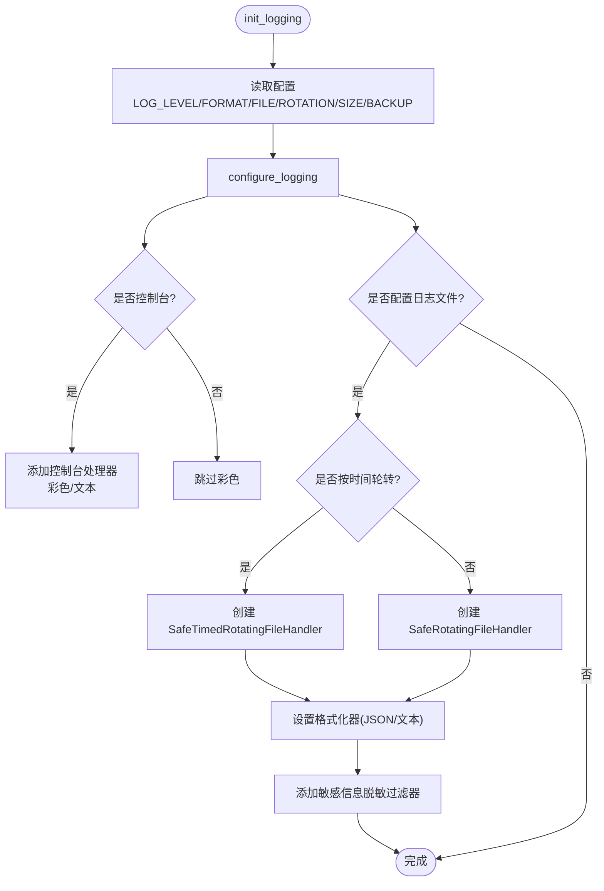
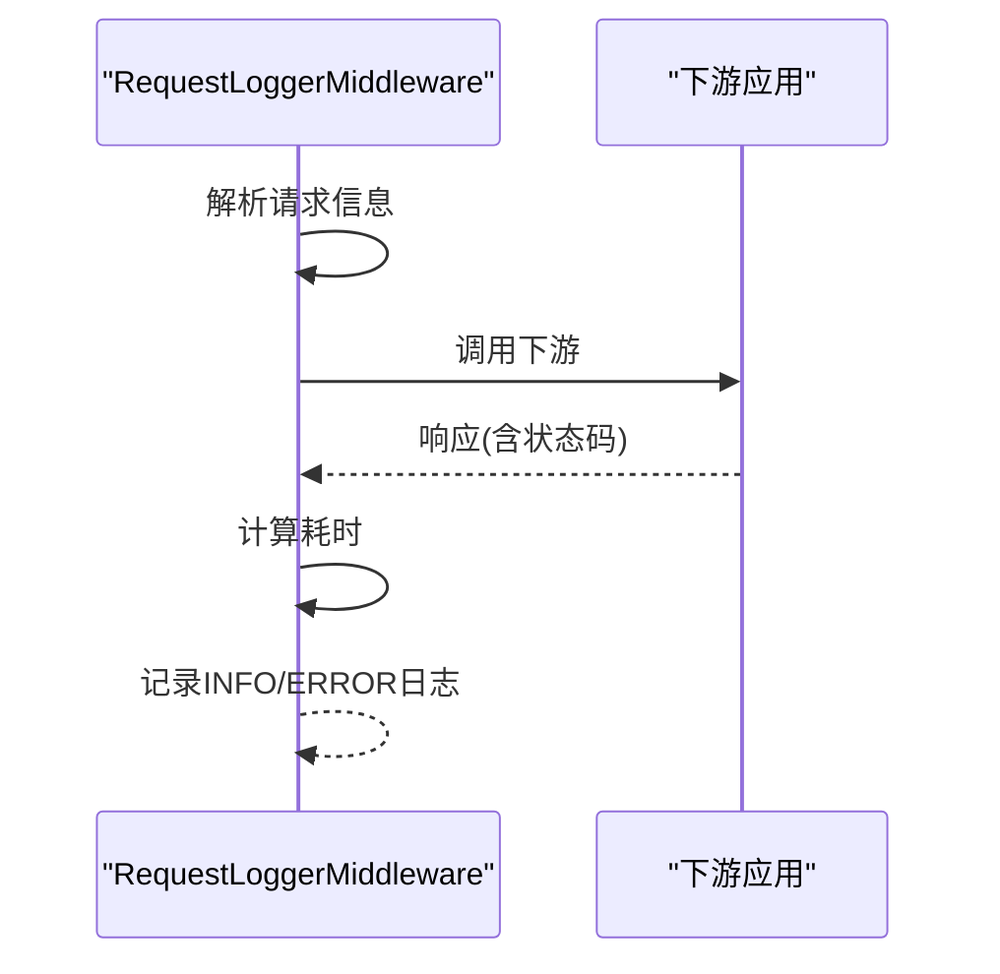
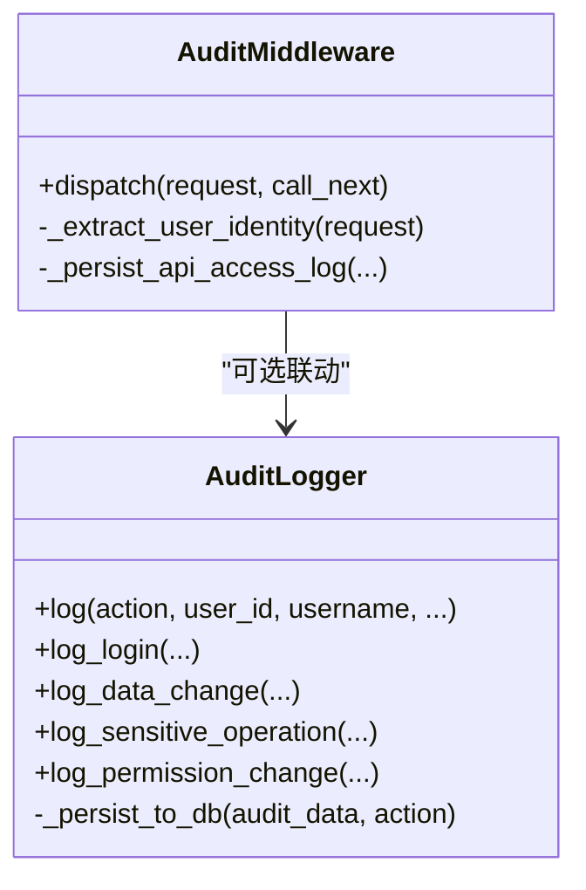
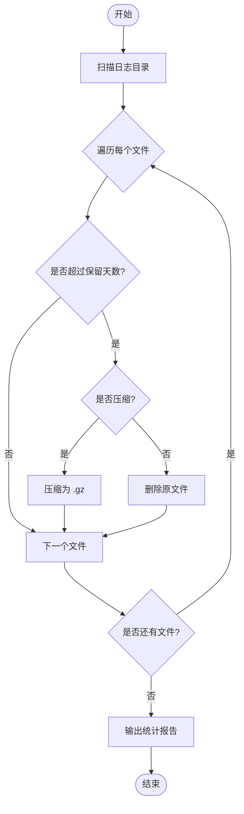
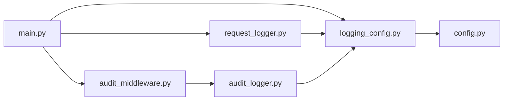

# 日志管理

<cite>
**本文引用的文件**
- [backend/app/core/logging_config.py](file://backend/app/core/logging_config.py)
- [backend/app/core/logging.py](file://backend/app/core/logging.py)
- [backend/app/core/config.py](file://backend/app/core/config.py)
- [backend/app/middleware/request_logger.py](file://backend/app/middleware/request_logger.py)
- [backend/app/core/audit_middleware.py](file://backend/app/core/audit_middleware.py)
- [backend/app/utils/audit_logger.py](file://backend/app/utils/audit_logger.py)
- [backend/scripts/cleanup_logs.py](file://backend/scripts/cleanup_logs.py)
- [backend/app/main.py](file://backend/app/main.py)
</cite>

## 目录
1. [简介](#简介)
2. [项目结构](#项目结构)
3. [核心组件](#核心组件)
4. [架构总览](#架构总览)
5. [详细组件分析](#详细组件分析)
6. [依赖关系分析](#依赖关系分析)
7. [性能考虑](#性能考虑)
8. [故障排查指南](#故障排查指南)
9. [结论](#结论)
10. [附录](#附录)

## 简介
本指南面向运维与开发人员，系统化说明本系统的日志配置、记录规范、文件组织、查询分析、清理维护以及性能优化与故障排查方法。系统采用统一的日志初始化入口，支持结构化 JSON 与文本格式输出，提供按大小或按时间的轮转策略，内置敏感信息脱敏，并配套审计日志与请求日志中间件，形成“应用日志 + 请求日志 + 审计日志”的完整体系。

## 项目结构
后端日志相关的关键位置：
- 日志配置与格式化：core/logging_config.py、core/logging.py
- 配置项来源：core/config.py（LOG_LEVEL、LOG_FORMAT、LOG_FILE、LOG_ROTATION、LOG_MAX_SIZE_MB、LOG_BACKUP_COUNT）
- 请求日志：middleware/request_logger.py
- 审计日志：core/audit_middleware.py、utils/audit_logger.py
- 清理脚本：scripts/cleanup_logs.py
- 中间件注册：app/main.py

图表来源
- [backend/app/main.py:128-133](file://backend/app/main.py#L128-L133)
- [backend/app/core/logging_config.py:161-274](file://backend/app/core/logging_config.py#L161-L274)
- [backend/app/middleware/request_logger.py:52-114](file://backend/app/middleware/request_logger.py#L52-L114)
- [backend/app/core/audit_middleware.py:11-109](file://backend/app/core/audit_middleware.py#L11-L109)
- [backend/app/utils/audit_logger.py:60-185](file://backend/app/utils/audit_logger.py#L60-L185)

章节来源
- [backend/app/core/logging_config.py:161-274](file://backend/app/core/logging_config.py#L161-L274)
- [backend/app/core/config.py:161-174](file://backend/app/core/config.py#L161-L174)
- [backend/app/middleware/request_logger.py:52-114](file://backend/app/middleware/request_logger.py#L52-L114)
- [backend/app/core/audit_middleware.py:11-109](file://backend/app/core/audit_middleware.py#L11-L109)
- [backend/app/utils/audit_logger.py:60-185](file://backend/app/utils/audit_logger.py#L60-L185)
- [backend/app/main.py:128-133](file://backend/app/main.py#L128-L133)

## 核心组件
- 统一日志初始化：通过 logging_config.init_logging 读取配置并安装处理器；兼容旧入口 logging.init_logging。
- 格式化器：
  - JsonFormatter：输出结构化 JSON 行，包含时间戳、级别、模块、函数、行号、异常等。
  - ColoredFormatter：终端彩色输出（开发环境）。
  - 文本格式：生产文件默认使用标准文本格式。
- 轮转策略：
  - 按大小：SafeRotatingFileHandler，支持 max_bytes 与 backup_count。
  - 按时间：SafeTimedRotatingFileHandler，when=midnight，支持 backupCount。
- 敏感信息脱敏：SensitiveDataFilter 对身份证号、手机号、邮箱、常见密钥键值进行正则替换，避免凭据落盘。
- 请求日志：RequestLoggerMiddleware 记录 HTTP 请求方法、路径、查询串、客户端 IP、UA、状态码、耗时，跳过静态与健康检查路径。
- 审计日志：AuditMiddleware 记录访问元数据并落库；AuditLogger 将关键业务操作同时写入 Python 日志与数据库表（audit_logs、login_attempts），失败不阻断主流程。

章节来源
- [backend/app/core/logging_config.py:21-140](file://backend/app/core/logging_config.py#L21-L140)
- [backend/app/core/logging_config.py:161-274](file://backend/app/core/logging_config.py#L161-L274)
- [backend/app/middleware/request_logger.py:52-114](file://backend/app/middleware/request_logger.py#L52-L114)
- [backend/app/core/audit_middleware.py:11-109](file://backend/app/core/audit_middleware.py#L11-L109)
- [backend/app/utils/audit_logger.py:60-185](file://backend/app/utils/audit_logger.py#L60-L185)

## 架构总览
下图展示一次 HTTP 请求在系统中的日志流转：

图表来源
- [backend/app/middleware/request_logger.py:52-114](file://backend/app/middleware/request_logger.py#L52-L114)
- [backend/app/core/audit_middleware.py:11-109](file://backend/app/core/audit_middleware.py#L11-L109)
- [backend/app/core/logging_config.py:161-274](file://backend/app/core/logging_config.py#L161-L274)

## 详细组件分析

### 日志配置与轮转
- 配置项
  - LOG_LEVEL：日志级别（DEBUG/INFO/WARNING/ERROR）
  - LOG_FORMAT：json 或 text
  - LOG_FILE：日志文件路径
  - LOG_ROTATION：若设置则启用按天轮转（when=midnight），否则按大小轮转
  - LOG_MAX_SIZE_MB：单文件最大 MB
  - LOG_BACKUP_COUNT：保留备份数
- 行为要点
  - 初始化时关闭并移除旧 handler，避免句柄泄漏导致 Windows 轮转失败
  - 所有 handler 均附加敏感信息脱敏过滤器
  - 第三方噪音日志（如 uvicorn.access、sqlalchemy.engine、PIL）降级为 WARNING
  - init_logging 可安全多次调用，异常时回退到 INFO+text 模式

图表来源
- [backend/app/core/logging_config.py:161-274](file://backend/app/core/logging_config.py#L161-L274)

章节来源
- [backend/app/core/logging_config.py:161-274](file://backend/app/core/logging_config.py#L161-L274)
- [backend/app/core/config.py:161-174](file://backend/app/core/config.py#L161-L174)

### 请求日志中间件
- 记录内容：方法、路径、查询串、客户端 IP（优先 X-Forwarded-For/X-Real-IP）、User-Agent、状态码、耗时
- 跳过路径：/health、/metrics、/favicon.ico、/static/
- 异常路径：捕获异常并记录错误日志后重新抛出

图表来源
- [backend/app/middleware/request_logger.py:52-114](file://backend/app/middleware/request_logger.py#L52-L114)

章节来源
- [backend/app/middleware/request_logger.py:52-114](file://backend/app/middleware/request_logger.py#L52-L114)

### 审计日志（访问与业务）
- 访问审计（AuditMiddleware）
  - 从 Authorization 头解析用户身份
  - 记录方法、路径、状态码、耗时、IP、UA
  - 独立短事务写入 api_access_logs，失败仅警告
- 业务审计（AuditLogger）
  - 统一封装登录、登出、数据变更、导出/导入、备份/恢复、配置变更、权限变更等
  - 同时写入 Python 日志与数据库（audit_logs、login_attempts）
  - 数据库写入失败不影响主流程

图表来源
- [backend/app/core/audit_middleware.py:11-109](file://backend/app/core/audit_middleware.py#L11-L109)
- [backend/app/utils/audit_logger.py:60-185](file://backend/app/utils/audit_logger.py#L60-L185)

章节来源
- [backend/app/core/audit_middleware.py:11-109](file://backend/app/core/audit_middleware.py#L11-L109)
- [backend/app/utils/audit_logger.py:60-185](file://backend/app/utils/audit_logger.py#L60-L185)

### 日志文件组织与管理策略
- 输出位置
  - 控制台：开发环境彩色输出，生产环境标准文本
  - 文件：由 LOG_FILE 指定，默认 ./logs/app.log
- 分类存储建议
  - 按时间：启用 LOG_ROTATION（例如 “10 days”）实现按天轮转，便于按日期归档与分析
  - 按模块：不同 logger name（如 app.request、app.audit）可通过日志收集系统按模块分流
  - 按级别：通过 LOG_LEVEL 控制采集粒度；生产建议 INFO 及以上
- 轮转与保留
  - 按大小：max_bytes 与 backup_count 控制单文件大小与历史数量
  - 按时间：when=midnight，backupCount 控制保留天数
- 清理策略
  - 使用 cleanup_logs.py 定期清理过期日志，支持压缩与试运行模式

章节来源
- [backend/app/core/logging_config.py:161-274](file://backend/app/core/logging_config.py#L161-L274)
- [backend/scripts/cleanup_logs.py:64-110](file://backend/scripts/cleanup_logs.py#L64-L110)

### 日志查询与分析
- 命令行
  - 查看统计：python backend/scripts/cleanup_logs.py --stats --log-dir ./logs
  - 试运行清理：python backend/scripts/cleanup_logs.py --days 30 --dry-run
  - 执行清理：python backend/scripts/cleanup_logs.py --days 30
- Web 界面
  - 当前仓库未提供内置日志 Web 界面；建议结合外部日志平台（如 ELK/Loki）或前端日志查看页面接入
- 结构化日志
  - JSON 格式便于机器解析与检索，可按 timestamp、level、module、function、line 等字段过滤

章节来源
- [backend/scripts/cleanup_logs.py:153-217](file://backend/scripts/cleanup_logs.py#L153-L217)
- [backend/app/core/logging_config.py:122-140](file://backend/app/core/logging_config.py#L122-L140)

### 日志清理与维护脚本
- 功能
  - 扫描 *.log、*.log.*、*.gz 文件
  - 基于修改时间判断是否超过保留天数
  - 支持压缩旧日志或直接删除
  - 显示目录统计（总数、总大小、最旧/最新文件）
- 参数
  - --log-dir：日志目录（默认 ./logs）
  - --days：保留最近 N 天（默认 30）
  - --no-compress：不压缩直接删除
  - --dry-run：试运行
  - --stats：仅统计

图表来源
- [backend/scripts/cleanup_logs.py:64-110](file://backend/scripts/cleanup_logs.py#L64-L110)

章节来源
- [backend/scripts/cleanup_logs.py:64-110](file://backend/scripts/cleanup_logs.py#L64-L110)
- [backend/scripts/cleanup_logs.py:153-217](file://backend/scripts/cleanup_logs.py#L153-L217)

## 依赖关系分析
- 初始化链路
  - main.py 注册中间件（审计、请求日志）
  - logging_config.init_logging 读取 core.config.Settings 中的日志配置
- 中间件与日志
  - RequestLoggerMiddleware 使用 app.request logger 记录请求日志
  - AuditMiddleware 记录访问日志并落库
  - AuditLogger 将业务审计事件写入 Python 日志与数据库
- 轮转与兼容性
  - SafeRotatingFileHandler / SafeTimedRotatingFileHandler 增强 Windows 下轮转稳定性
  - 所有 handler 附加 SensitiveDataFilter 防止敏感信息泄露

图表来源
- [backend/app/main.py:128-133](file://backend/app/main.py#L128-L133)
- [backend/app/core/logging_config.py:161-274](file://backend/app/core/logging_config.py#L161-L274)
- [backend/app/core/config.py:161-174](file://backend/app/core/config.py#L161-L174)
- [backend/app/middleware/request_logger.py:52-114](file://backend/app/middleware/request_logger.py#L52-L114)
- [backend/app/core/audit_middleware.py:11-109](file://backend/app/core/audit_middleware.py#L11-L109)
- [backend/app/utils/audit_logger.py:60-185](file://backend/app/utils/audit_logger.py#L60-L185)

章节来源
- [backend/app/main.py:128-133](file://backend/app/main.py#L128-L133)
- [backend/app/core/logging_config.py:161-274](file://backend/app/core/logging_config.py#L161-L274)
- [backend/app/core/config.py:161-174](file://backend/app/core/config.py#L161-L174)
- [backend/app/middleware/request_logger.py:52-114](file://backend/app/middleware/request_logger.py#L52-L114)
- [backend/app/core/audit_middleware.py:11-109](file://backend/app/core/audit_middleware.py#L11-L109)
- [backend/app/utils/audit_logger.py:60-185](file://backend/app/utils/audit_logger.py#L60-L185)

## 性能考虑
- 日志级别
  - 生产环境建议使用 INFO 及以上，降低 IO 压力
- 输出格式
  - JSON 便于解析但略增 CPU；高吞吐场景可评估文本格式
- 轮转策略
  - 按时间轮转减少大文件 I/O；合理设置 backupCount 平衡磁盘占用
- 脱敏开销
  - 正则匹配在高频日志下有一定成本；可根据业务敏感度选择性开启
- 中间件
  - 审计落库失败不阻塞主流程，避免影响可用性
- 文件句柄
  - 初始化时关闭旧 handler，避免 Windows 下句柄泄漏导致的轮转失败

[本节为通用指导，不直接分析具体文件]

## 故障排查指南
- 日志未输出
  - 检查 LOG_FILE 是否存在且可写；确认 init_logging 已调用
  - 检查 LOG_LEVEL 是否过高导致过滤
- 轮转失败（Windows）
  - 使用 SafeRotatingFileHandler / SafeTimedRotatingFileHandler 自动重试；如遇 WinError 32，会跳过本次轮转并继续写入
- 敏感信息泄露风险
  - 确认 SensitiveDataFilter 已附加至所有 handler；避免在消息中拼接明文凭据
- 审计日志缺失
  - 检查数据库连接与表结构；审计写入失败仅记录警告，不影响业务
- 请求日志缺失
  - 确认中间件已注册；检查是否命中跳过路径（/health、/metrics、/static/）

章节来源
- [backend/app/core/logging_config.py:188-253](file://backend/app/core/logging_config.py#L188-L253)
- [backend/app/core/audit_middleware.py:80-109](file://backend/app/core/audit_middleware.py#L80-L109)
- [backend/app/middleware/request_logger.py:67-114](file://backend/app/middleware/request_logger.py#L67-L114)

## 结论
本系统提供了完善的日志基础设施：统一初始化、结构化输出、双模式轮转、敏感信息脱敏、请求与审计日志分离、自动化清理脚本。建议在生产环境启用按时间轮转、保持合理的保留周期，并结合外部日志平台进行集中查询与分析。通过合理的级别控制与格式选择，可在可观测性与性能之间取得良好平衡。

[本节为总结性内容，不直接分析具体文件]

## 附录

### 日志配置项速查
- LOG_LEVEL：日志级别（DEBUG/INFO/WARNING/ERROR）
- LOG_FORMAT：json 或 text
- LOG_FILE：日志文件路径
- LOG_ROTATION：按天轮转开关（非空即启用 midnight 轮转）
- LOG_MAX_SIZE_MB：单文件最大 MB
- LOG_BACKUP_COUNT：保留备份数
- LOG_DIR：日志目录（供清理脚本使用）

章节来源
- [backend/app/core/config.py:161-174](file://backend/app/core/config.py#L161-L174)

### 常用命令示例
- 查看日志统计：python backend/scripts/cleanup_logs.py --stats
- 试运行清理：python backend/scripts/cleanup_logs.py --days 30 --dry-run
- 执行清理：python backend/scripts/cleanup_logs.py --days 30

章节来源
- [backend/scripts/cleanup_logs.py:153-217](file://backend/scripts/cleanup_logs.py#L153-L217)