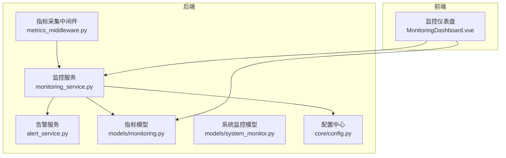
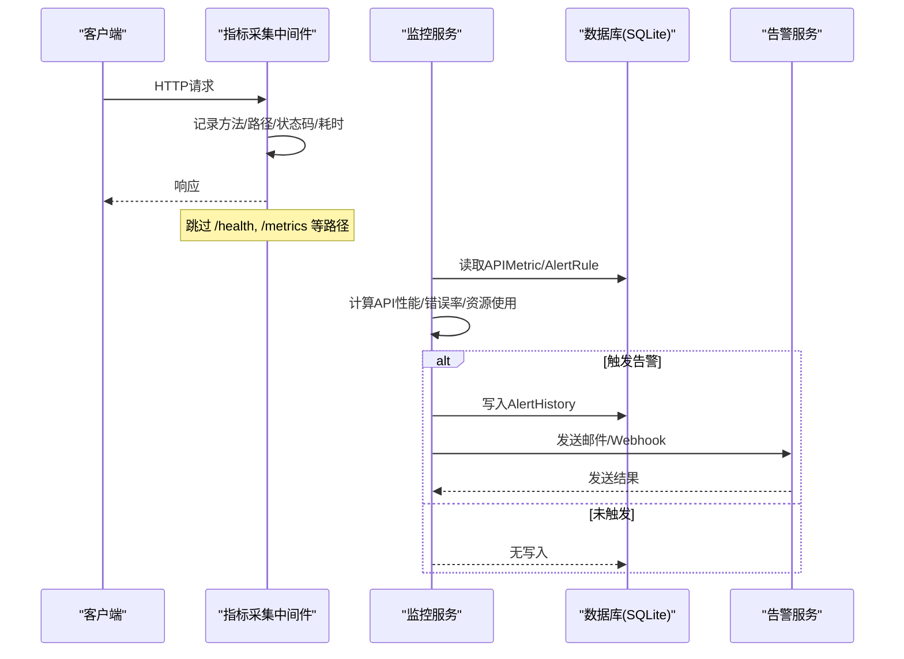
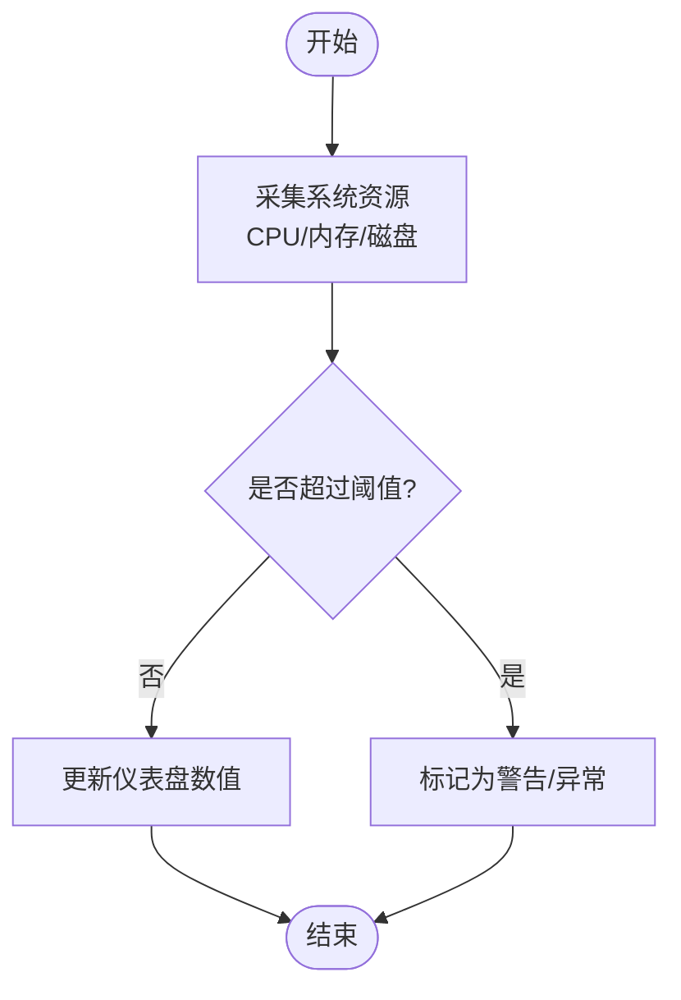
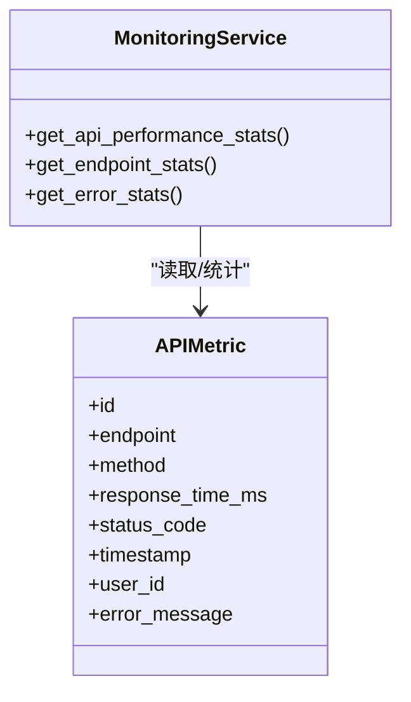
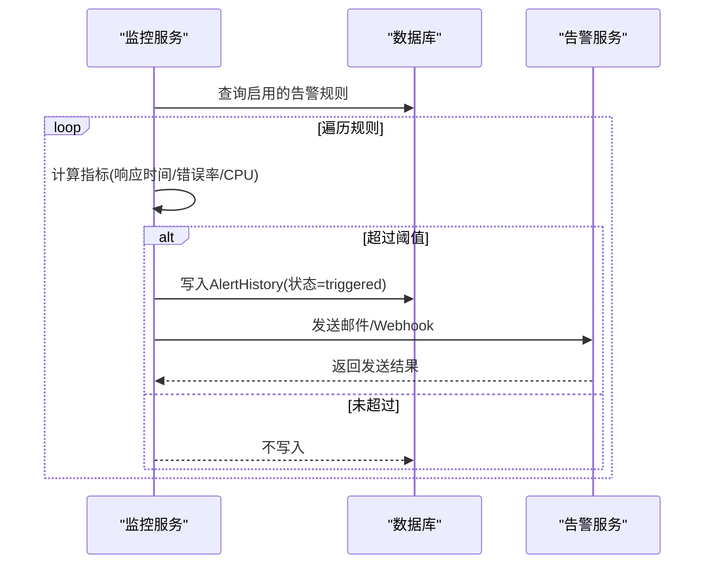
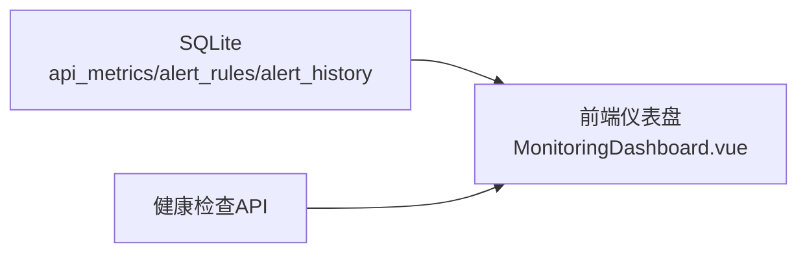
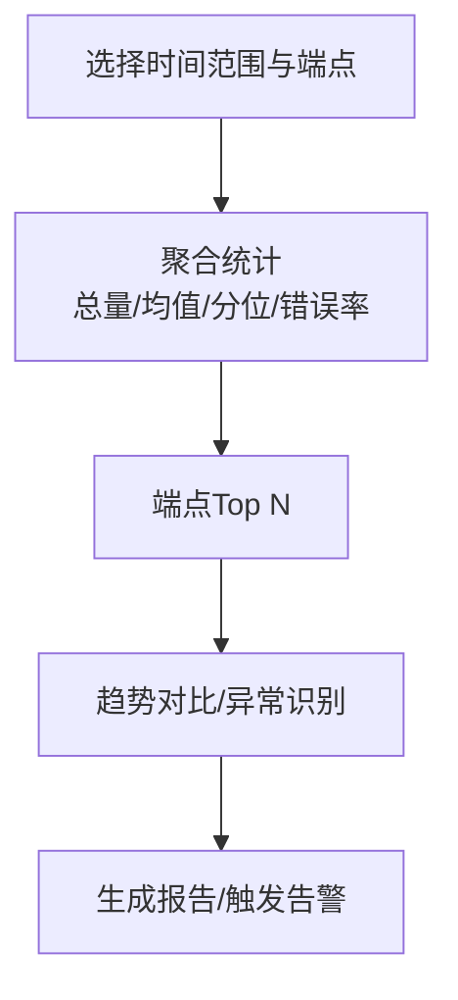
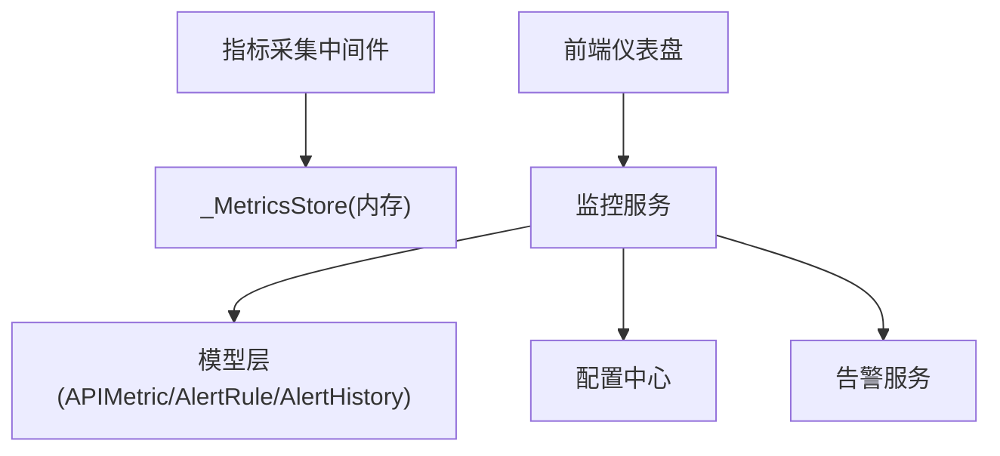

# 监控告警

<cite>
**本文引用的文件**
- [backend/app/services/monitoring_service.py](file://backend/app/services/monitoring_service.py)
- [backend/app/services/alert_service.py](file://backend/app/services/alert_service.py)
- [backend/app/models/monitoring.py](file://backend/app/models/monitoring.py)
- [backend/app/models/system_monitor.py](file://backend/app/models/system_monitor.py)
- [backend/app/core/config.py](file://backend/app/core/config.py)
- [backend/app/middleware/metrics_middleware.py](file://backend/app/middleware/metrics_middleware.py)
- [frontend/src/views/system/MonitoringDashboard.vue](file://frontend/src/views/system/MonitoringDashboard.vue)
- [backend/tests/unit/test_monitoring_service.py](file://backend/tests/unit/test_monitoring_service.py)
- [backend/tests/unit/test_system_metrics_api.py](file://backend/tests/unit/test_system_metrics_api.py)
- [backend/tests/unit/test_system_monitor_api.py](file://backend/tests/unit/test_system_monitor_api.py)
- [backend/tests/unit/test_performance_api.py](file://backend/tests/unit/test_performance_api.py)
- [backend/tests/unit/test_api_health_full.py](file://backend/tests/unit/test_api_health_full.py)
- [backend/tests/unit/test_system_health_api.py](file://backend/tests/unit/test_system_health_api.py)
</cite>

## 目录
1. [简介](#简介)
2. [项目结构](#项目结构)
3. [核心组件](#核心组件)
4. [架构总览](#架构总览)
5. [详细组件分析](#详细组件分析)
6. [依赖关系分析](#依赖关系分析)
7. [性能考虑](#性能考虑)
8. [故障排查指南](#故障排查指南)
9. [结论](#结论)
10. [附录](#附录)

## 简介
本指南面向系统运维与开发人员，提供“系统监控与告警”的完整配置与使用说明。内容覆盖：
- 系统级指标采集：CPU、内存、磁盘、网络等
- 应用性能监控：API响应时间、错误率、数据库查询性能、缓存命中率等业务指标
- 数据存储与可视化：基于SQLite的指标存储、前端仪表盘展示
- 告警规则与通知：阈值、持续时间、多渠道通知（邮件、Webhook）
- 数据查询与分析：历史检索、趋势分析、异常检测思路
- 性能优化与扩展建议

## 项目结构
后端通过中间件采集HTTP请求指标，服务层聚合系统资源与业务指标，模型层持久化指标与告警规则/历史；前端提供监控仪表盘与健康检查视图。

图表来源
- [backend/app/middleware/metrics_middleware.py:1-177](file://backend/app/middleware/metrics_middleware.py#L1-L177)
- [backend/app/services/monitoring_service.py:1-312](file://backend/app/services/monitoring_service.py#L1-L312)
- [backend/app/services/alert_service.py:1-111](file://backend/app/services/alert_service.py#L1-L111)
- [backend/app/models/monitoring.py:1-84](file://backend/app/models/monitoring.py#L1-L84)
- [backend/app/models/system_monitor.py:1-50](file://backend/app/models/system_monitor.py#L1-L50)
- [backend/app/core/config.py:185-199](file://backend/app/core/config.py#L185-L199)
- [frontend/src/views/system/MonitoringDashboard.vue:228-434](file://frontend/src/views/system/MonitoringDashboard.vue#L228-L434)

章节来源
- [backend/app/middleware/metrics_middleware.py:1-177](file://backend/app/middleware/metrics_middleware.py#L1-L177)
- [backend/app/services/monitoring_service.py:1-312](file://backend/app/services/monitoring_service.py#L1-L312)
- [backend/app/services/alert_service.py:1-111](file://backend/app/services/alert_service.py#L1-L111)
- [backend/app/models/monitoring.py:1-84](file://backend/app/models/monitoring.py#L1-L84)
- [backend/app/models/system_monitor.py:1-50](file://backend/app/models/system_monitor.py#L1-L50)
- [backend/app/core/config.py:185-199](file://backend/app/core/config.py#L185-L199)
- [frontend/src/views/system/MonitoringDashboard.vue:228-434](file://frontend/src/views/system/MonitoringDashboard.vue#L228-L434)

## 核心组件
- 指标采集中间件：记录请求计数、错误数、活跃请求、慢请求、按路径耗时等，支持跳过健康与指标端点。
- 监控服务：聚合API性能统计、错误统计、系统资源统计；评估告警规则并触发通知。
- 告警服务：发送邮件与Webhook告警，支持多种Webhook类型。
- 数据模型：API指标表、告警规则表、告警历史表、系统监控表。
- 配置中心：开关监控、健康检查、告警渠道及SMTP/Webhook参数。
- 前端仪表盘：展示系统资源、API统计、健康检查、日志过滤等。

章节来源
- [backend/app/middleware/metrics_middleware.py:1-177](file://backend/app/middleware/metrics_middleware.py#L1-L177)
- [backend/app/services/monitoring_service.py:1-312](file://backend/app/services/monitoring_service.py#L1-L312)
- [backend/app/services/alert_service.py:1-111](file://backend/app/services/alert_service.py#L1-L111)
- [backend/app/models/monitoring.py:1-84](file://backend/app/models/monitoring.py#L1-L84)
- [backend/app/models/system_monitor.py:1-50](file://backend/app/models/system_monitor.py#L1-L50)
- [backend/app/core/config.py:185-199](file://backend/app/core/config.py#L185-L199)
- [frontend/src/views/system/MonitoringDashboard.vue:228-434](file://frontend/src/views/system/MonitoringDashboard.vue#L228-L434)

## 架构总览
下图展示了从请求进入、指标采集、到告警触发的端到端流程。

图表来源
- [backend/app/middleware/metrics_middleware.py:142-177](file://backend/app/middleware/metrics_middleware.py#L142-L177)
- [backend/app/services/monitoring_service.py:184-312](file://backend/app/services/monitoring_service.py#L184-L312)
- [backend/app/models/monitoring.py:22-84](file://backend/app/models/monitoring.py#L22-L84)
- [backend/app/services/alert_service.py:23-111](file://backend/app/services/alert_service.py#L23-L111)

## 详细组件分析

### 系统级指标采集与展示
- CPU、内存、磁盘：通过系统工具获取百分比与绝对值，供仪表盘与告警规则使用。
- 网络与线程：前端卡片展示入/出流量与线程数，便于快速定位瓶颈。
- 健康评分：综合CPU、内存、磁盘、数据库完整性等计算总分，辅助判断系统健康度。

图表来源
- [backend/app/services/monitoring_service.py:157-181](file://backend/app/services/monitoring_service.py#L157-L181)
- [frontend/src/views/system/MonitoringDashboard.vue:389-434](file://frontend/src/views/system/MonitoringDashboard.vue#L389-L434)

章节来源
- [backend/app/services/monitoring_service.py:157-181](file://backend/app/services/monitoring_service.py#L157-L181)
- [frontend/src/views/system/MonitoringDashboard.vue:389-434](file://frontend/src/views/system/MonitoringDashboard.vue#L389-L434)

### 应用性能监控（API与数据库）
- API性能：统计总请求、平均响应时间、P50/P95/P99、错误率；按端点分组统计Top N。
- 数据库查询：结合慢查询阈值与查询统计，识别慢查询与热点接口。
- 缓存命中：通过本地缓存或可选Redis提升查询性能，减少数据库压力。

图表来源
- [backend/app/models/monitoring.py:22-35](file://backend/app/models/monitoring.py#L22-L35)
- [backend/app/services/monitoring_service.py:29-128](file://backend/app/services/monitoring_service.py#L29-L128)

章节来源
- [backend/app/services/monitoring_service.py:29-128](file://backend/app/services/monitoring_service.py#L29-L128)
- [backend/app/models/monitoring.py:22-35](file://backend/app/models/monitoring.py#L22-L35)
- [backend/tests/unit/test_performance_api.py:146-173](file://backend/tests/unit/test_performance_api.py#L146-L173)

### 告警规则与通知机制
- 规则类型：响应时间、错误率、资源使用率。
- 触发条件：在持续时间内超过阈值才触发，避免抖动误报。
- 通知渠道：邮件（SMTP）、Webhook（通用/钉钉/企业微信）。
- 防抖策略：同一规则未解决时不重复触发。

图表来源
- [backend/app/services/monitoring_service.py:184-312](file://backend/app/services/monitoring_service.py#L184-L312)
- [backend/app/services/alert_service.py:23-111](file://backend/app/services/alert_service.py#L23-L111)
- [backend/app/models/monitoring.py:37-84](file://backend/app/models/monitoring.py#L37-L84)

章节来源
- [backend/app/services/monitoring_service.py:184-312](file://backend/app/services/monitoring_service.py#L184-L312)
- [backend/app/services/alert_service.py:23-111](file://backend/app/services/alert_service.py#L23-L111)
- [backend/app/models/monitoring.py:37-84](file://backend/app/models/monitoring.py#L37-L84)
- [backend/tests/unit/test_monitoring_service.py:189-295](file://backend/tests/unit/test_monitoring_service.py#L189-L295)

### 数据存储与可视化
- 存储：指标与告警数据落库至SQLite，便于离线单机部署与长期留存。
- 可视化：前端仪表盘展示系统资源、API统计、健康检查、日志过滤等。
- 健康检查：提供基础/详细/数据库/缓存/存活等多维度健康检查。

图表来源
- [backend/app/models/monitoring.py:22-84](file://backend/app/models/monitoring.py#L22-L84)
- [frontend/src/views/system/MonitoringDashboard.vue:228-434](file://frontend/src/views/system/MonitoringDashboard.vue#L228-L434)
- [backend/tests/unit/test_api_health_full.py:1-38](file://backend/tests/unit/test_api_health_full.py#L1-L38)

章节来源
- [backend/app/models/monitoring.py:22-84](file://backend/app/models/monitoring.py#L22-L84)
- [frontend/src/views/system/MonitoringDashboard.vue:228-434](file://frontend/src/views/system/MonitoringDashboard.vue#L228-L434)
- [backend/tests/unit/test_api_health_full.py:1-38](file://backend/tests/unit/test_api_health_full.py#L1-L38)

### 监控数据的查询与分析
- 历史检索：按时间范围查询APIMetric，计算平均/分位/错误率。
- 趋势分析：按端点分组统计Top N，观察热点与退化。
- 异常检测：基于规则阈值与持续时间进行判定，结合告警历史回溯。

图表来源
- [backend/app/services/monitoring_service.py:29-128](file://backend/app/services/monitoring_service.py#L29-L128)
- [backend/tests/unit/test_monitoring_service.py:35-68](file://backend/tests/unit/test_monitoring_service.py#L35-L68)

章节来源
- [backend/app/services/monitoring_service.py:29-128](file://backend/app/services/monitoring_service.py#L29-L128)
- [backend/tests/unit/test_monitoring_service.py:35-68](file://backend/tests/unit/test_monitoring_service.py#L35-L68)

## 依赖关系分析
- 中间件依赖全局指标存储，记录请求级指标，避免对健康与指标端点的干扰。
- 监控服务依赖模型层读写指标与规则，依赖配置中心控制行为。
- 告警服务依赖配置中的SMTP与Webhook参数，实现多渠道通知。
- 前端依赖后端API与模型数据进行展示与交互。

图表来源
- [backend/app/middleware/metrics_middleware.py:26-129](file://backend/app/middleware/metrics_middleware.py#L26-L129)
- [backend/app/services/monitoring_service.py:1-312](file://backend/app/services/monitoring_service.py#L1-L312)
- [backend/app/models/monitoring.py:1-84](file://backend/app/models/monitoring.py#L1-L84)
- [backend/app/core/config.py:185-199](file://backend/app/core/config.py#L185-L199)
- [frontend/src/views/system/MonitoringDashboard.vue:228-434](file://frontend/src/views/system/MonitoringDashboard.vue#L228-L434)

章节来源
- [backend/app/middleware/metrics_middleware.py:26-129](file://backend/app/middleware/metrics_middleware.py#L26-L129)
- [backend/app/services/monitoring_service.py:1-312](file://backend/app/services/monitoring_service.py#L1-L312)
- [backend/app/models/monitoring.py:1-84](file://backend/app/models/monitoring.py#L1-L84)
- [backend/app/core/config.py:185-199](file://backend/app/core/config.py#L185-L199)
- [frontend/src/views/system/MonitoringDashboard.vue:228-434](file://frontend/src/views/system/MonitoringDashboard.vue#L228-L434)

## 性能考虑
- 指标采集开销：中间件仅记录必要字段，跳过健康与指标端点，降低额外开销。
- 慢请求限制：内存中保留最近N条慢请求，防止无限增长。
- 数据库索引：对时间戳、状态码、端点建立索引，提升查询效率。
- 告警防抖：未解决告警不重复触发，减少通知风暴。
- 缓存策略：对高频查询结果进行缓存，降低数据库压力。

[本节为通用性能建议，无需具体文件引用]

## 故障排查指南
- 指标缺失：确认中间件已启用且未被跳过；检查数据库连接与写入。
- 告警未触发：核对规则阈值与持续时间；检查是否有未解决的告警导致重复抑制。
- 通知失败：校验SMTP配置与Webhook地址；查看日志中的发送失败原因。
- 前端无数据：确认后端API可用；检查健康检查与认证是否正常。

章节来源
- [backend/app/middleware/metrics_middleware.py:142-177](file://backend/app/middleware/metrics_middleware.py#L142-L177)
- [backend/app/services/monitoring_service.py:184-312](file://backend/app/services/monitoring_service.py#L184-L312)
- [backend/app/services/alert_service.py:23-111](file://backend/app/services/alert_service.py#L23-L111)
- [backend/tests/unit/test_system_metrics_api.py:108-138](file://backend/tests/unit/test_system_metrics_api.py#L108-L138)
- [backend/tests/unit/test_system_monitor_api.py:186-214](file://backend/tests/unit/test_system_monitor_api.py#L186-L214)
- [backend/tests/unit/test_system_health_api.py:162-180](file://backend/tests/unit/test_system_health_api.py#L162-L180)

## 结论
本系统提供了完整的监控与告警能力：从系统级指标到应用性能，从数据存储到前端可视化，再到多渠道告警通知。通过合理的阈值与持续时间设置，可有效识别异常并减少误报。建议在生产环境中结合业务特征调优阈值与采样频率，并定期审查告警规则与通知渠道的有效性。

[本节为总结性内容，无需具体文件引用]

## 附录
- 关键配置项（示例）
  - 监控开关：METRICS_ENABLED、HEALTH_CHECK_ENABLED
  - 告警渠道：ALERT_EMAIL_RECIPIENTS、SMTP_*、ALERT_WEBHOOK_URL、ALERT_WEBHOOK_TYPE
  - 数据库：DATABASE_URL、DB_POOL_*、SLOW_QUERY_THRESHOLD_MS
- 常用API（参考测试用例）
  - 健康检查：/api/v1/health、/api/v1/health/detailed、/api/v1/health/db、/api/v1/health/cache、/api/v1/health/services、/api/v1/health/live
  - 性能统计：/performance/query-stats（由测试用例验证）
- 前端页面
  - 监控仪表盘：系统资源、API统计、健康检查、日志过滤

章节来源
- [backend/app/core/config.py:185-199](file://backend/app/core/config.py#L185-L199)
- [backend/tests/unit/test_api_health_full.py:1-38](file://backend/tests/unit/test_api_health_full.py#L1-L38)
- [backend/tests/unit/test_performance_api.py:146-173](file://backend/tests/unit/test_performance_api.py#L146-L173)
- [frontend/src/views/system/MonitoringDashboard.vue:228-434](file://frontend/src/views/system/MonitoringDashboard.vue#L228-L434)