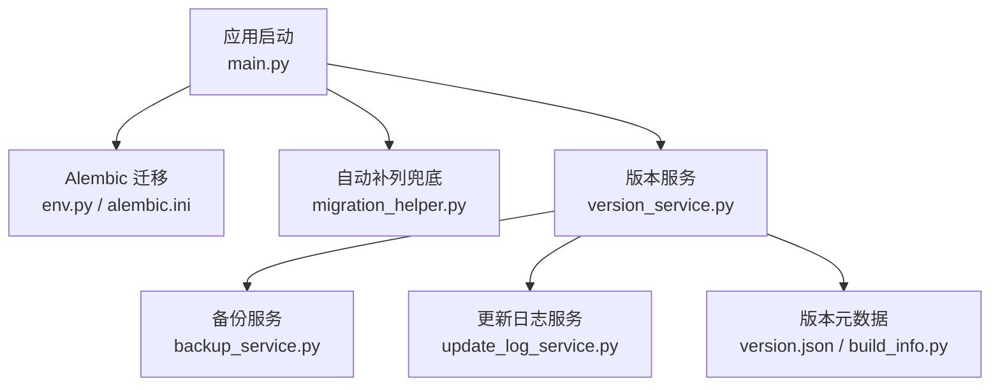
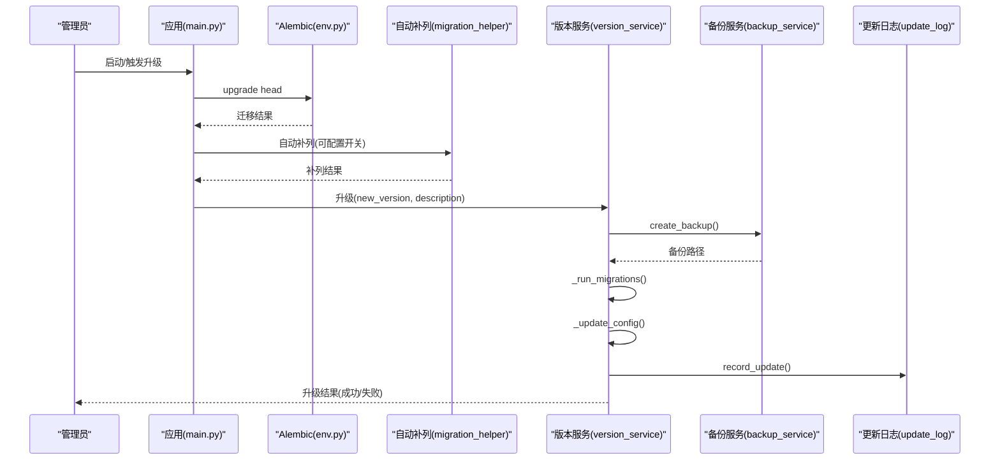
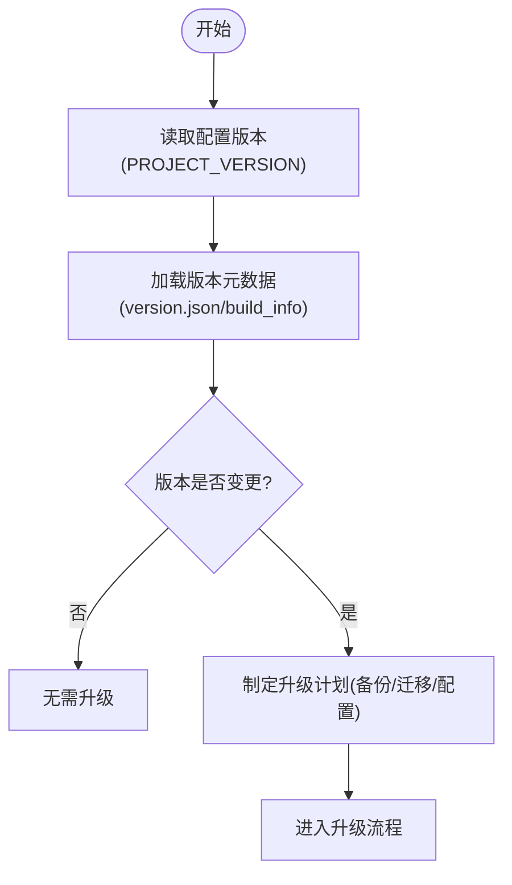
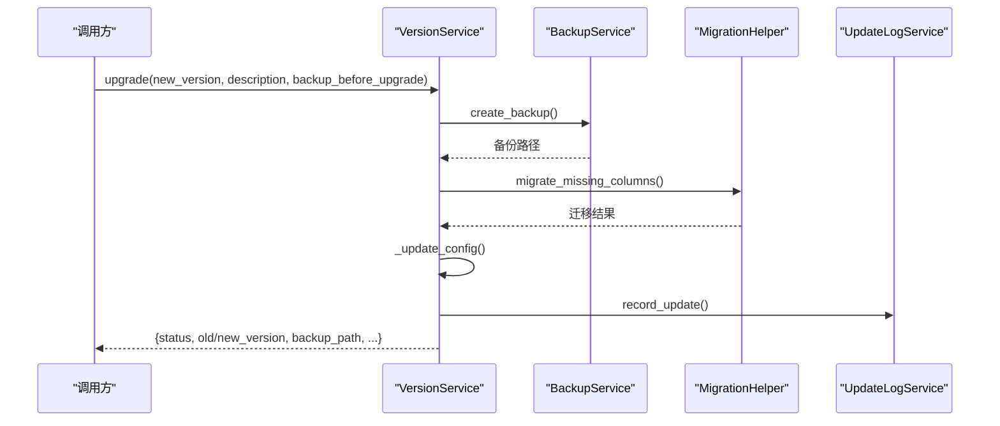
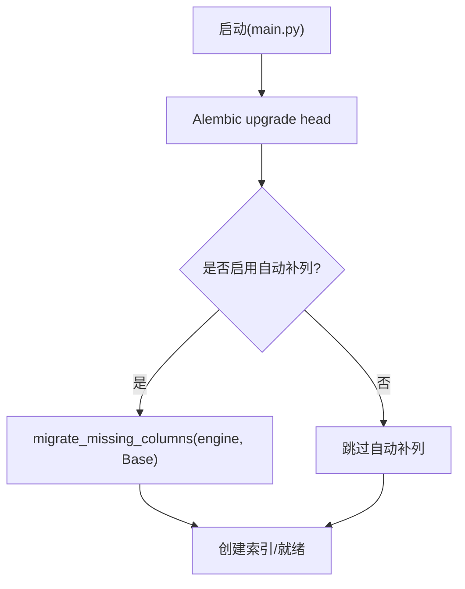
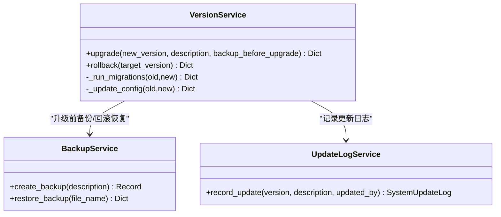
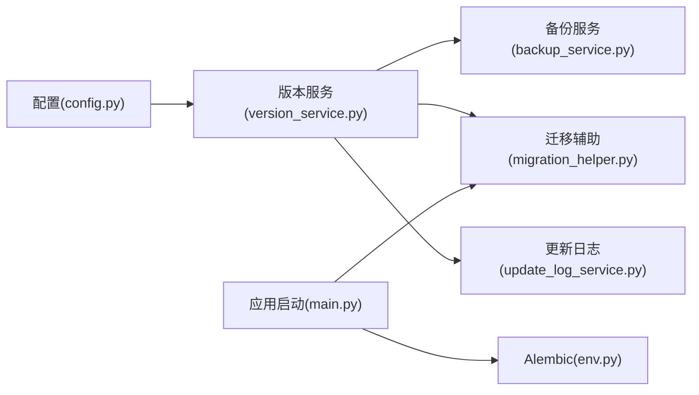

# 系统升级维护

<cite>
**本文引用的文件**
- [backend/version.json](file://backend/version.json)
- [backend/app/core/build_info.py](file://backend/app/core/build_info.py)
- [backend/app/services/version_service.py](file://backend/app/services/version_service.py)
- [backend/alembic.ini](file://backend/alembic.ini)
- [backend/alembic/env.py](file://backend/alembic/env.py)
- [backend/app/core/migration_helper.py](file://backend/app/core/migration_helper.py)
- [backend/app/main.py](file://backend/app/main.py)
- [backend/app/services/backup_service.py](file://backend/app/services/backup_service.py)
- [backend/app/core/config.py](file://backend/app/core/config.py)
- [backend/app/services/update_log_service.py](file://backend/app/services/update_log_service.py)
- [backend/app/api/v1/system/update_logs.py](file://backend/app/api/v1/system/update_logs.py)
- [docs/04-部署文档/OFFLINE_UPGRADE.md](file://docs/04-部署文档/OFFLINE_UPGRADE.md)
</cite>

## 目录
1. [简介](#简介)
2. [项目结构](#项目结构)
3. [核心组件](#核心组件)
4. [架构总览](#架构总览)
5. [详细组件分析](#详细组件分析)
6. [依赖关系分析](#依赖关系分析)
7. [性能与可靠性考虑](#性能与可靠性考虑)
8. [故障排查指南](#故障排查指南)
9. [结论](#结论)
10. [附录：升级检查清单与回滚策略](#附录：升级检查清单与回滚策略)

## 简介
本指南面向运维与实施人员，提供本系统的版本管理、在线/离线升级、数据库迁移、备份与回滚等全链路操作说明。系统为离线单机部署（Electron + FastAPI + SQLite），默认不启用自动更新；升级通过覆盖安装新版本包完成，首次启动时执行 Alembic 迁移并可选自动补齐缺失列。

## 项目结构
围绕升级与维护的关键位置如下：
- 版本元数据与构建信息：backend/version.json、backend/app/core/build_info.py
- 版本服务与历史：backend/app/services/version_service.py、backend/app/services/update_log_service.py
- 数据库迁移：backend/alembic.ini、backend/alembic/env.py、backend/app/core/migration_helper.py、backend/app/main.py
- 备份与恢复：backend/app/services/backup_service.py
- 配置与环境：backend/app/core/config.py
- 离线升级流程说明：docs/04-部署文档/OFFLINE_UPGRADE.md

**图示来源**
- [backend/app/main.py:418-445](file://backend/app/main.py#L418-L445)
- [backend/alembic/env.py:1-110](file://backend/alembic/env.py#L1-L110)
- [backend/app/core/migration_helper.py:68-154](file://backend/app/core/migration_helper.py#L68-L154)
- [backend/app/services/version_service.py:132-224](file://backend/app/services/version_service.py#L132-L224)
- [backend/app/services/backup_service.py:74-118](file://backend/app/services/backup_service.py#L74-L118)
- [backend/app/services/update_log_service.py:265-335](file://backend/app/services/update_log_service.py#L265-L335)
- [backend/version.json:1-16](file://backend/version.json#L1-L16)
- [backend/app/core/build_info.py:15-61](file://backend/app/core/build_info.py#L15-L61)

**章节来源**
- [backend/app/main.py:418-445](file://backend/app/main.py#L418-L445)
- [backend/alembic/env.py:1-110](file://backend/alembic/env.py#L1-L110)
- [backend/app/core/migration_helper.py:68-154](file://backend/app/core/migration_helper.py#L68-L154)
- [backend/app/services/version_service.py:132-224](file://backend/app/services/version_service.py#L132-L224)
- [backend/app/services/backup_service.py:74-118](file://backend/app/services/backup_service.py#L74-L118)
- [backend/app/services/update_log_service.py:265-335](file://backend/app/services/update_log_service.py#L265-L335)
- [backend/version.json:1-16](file://backend/version.json#L1-L16)
- [backend/app/core/build_info.py:15-61](file://backend/app/core/build_info.py#L15-L61)

## 核心组件
- 版本管理服务：负责读取当前版本、检测变更、执行升级（含备份、迁移、配置更新）、记录历史与回滚。
- 数据库迁移：Alembic 正式迁移 + 启动时自动补列兜底，确保新旧库兼容。
- 备份服务：支持完整/增量备份、压缩、加密、校验与恢复，用于升级前保护与失败回滚。
- 构建信息与版本元数据：CI 注入的构建指纹与运行时版本常量，便于健康检查与审计。
- 更新日志服务：持久化版本变更记录，支持初始化与同步历史摘要。

**章节来源**
- [backend/app/services/version_service.py:17-131](file://backend/app/services/version_service.py#L17-L131)
- [backend/alembic/env.py:45-109](file://backend/alembic/env.py#L45-L109)
- [backend/app/core/migration_helper.py:68-154](file://backend/app/core/migration_helper.py#L68-L154)
- [backend/app/services/backup_service.py:74-118](file://backend/app/services/backup_service.py#L74-L118)
- [backend/app/core/build_info.py:15-61](file://backend/app/core/build_info.py#L15-L61)
- [backend/app/services/update_log_service.py:265-335](file://backend/app/services/update_log_service.py#L265-L335)

## 架构总览
升级主流程（在线/离线均适用）：
- 离线升级：下载安装包 → 校验完整性 → 覆盖安装 → 首次启动自动迁移 → 验证功能。
- 在线升级（如通过 API 触发）：调用版本服务升级接口 → 备份 → 迁移 → 更新版本信息 → 记录日志。

**图示来源**
- [backend/app/main.py:418-445](file://backend/app/main.py#L418-L445)
- [backend/alembic/env.py:79-109](file://backend/alembic/env.py#L79-L109)
- [backend/app/core/migration_helper.py:68-154](file://backend/app/core/migration_helper.py#L68-L154)
- [backend/app/services/version_service.py:132-224](file://backend/app/services/version_service.py#L132-L224)
- [backend/app/services/backup_service.py:74-118](file://backend/app/services/backup_service.py#L74-L118)
- [backend/app/services/update_log_service.py:265-335](file://backend/app/services/update_log_service.py#L265-L335)

## 详细组件分析

### 版本管理与兼容性检查
- 版本号来源：
  - 运行时版本常量来自配置模块 PROJECT_VERSION。
  - 构建元数据由 CI 生成，包含 git_hash、build_time、builder 等。
  - 版本描述与发布日等信息保存在 version.json。
- 版本比较与变更检测：
  - 版本服务提供 compare_versions 与 check_version_change，用于判断是否发生版本变化。
- 兼容性策略：
  - 优先使用 Alembic 进行正式 schema 变更。
  - 启动时通过自动补列机制补齐缺失列，避免旧库与新模型不一致导致的运行期错误。
  - 可通过环境变量控制自动迁移行为，生产环境建议显式关闭自动补列，改用 Alembic 迁移。

**图示来源**
- [backend/app/core/config.py:54-74](file://backend/app/core/config.py#L54-L74)
- [backend/app/core/build_info.py:15-61](file://backend/app/core/build_info.py#L15-L61)
- [backend/version.json:1-16](file://backend/version.json#L1-L16)
- [backend/app/services/version_service.py:113-131](file://backend/app/services/version_service.py#L113-L131)

**章节来源**
- [backend/app/core/config.py:54-74](file://backend/app/core/config.py#L54-L74)
- [backend/app/core/build_info.py:15-61](file://backend/app/core/build_info.py#L15-L61)
- [backend/version.json:1-16](file://backend/version.json#L1-L16)
- [backend/app/services/version_service.py:113-131](file://backend/app/services/version_service.py#L113-L131)

### 在线升级流程（API 触发）
- 入口：版本服务的 upgrade 方法。
- 步骤：
  1) 备份数据库（可选但推荐）。
  2) 执行数据库迁移（调用自动补列或 Alembic）。
  3) 更新配置文件（按需）。
  4) 写入新版本信息与历史记录。
  5) 记录更新日志到数据库。
- 返回：包含新旧版本、备份路径、迁移与配置结果。

**图示来源**
- [backend/app/services/version_service.py:132-224](file://backend/app/services/version_service.py#L132-L224)
- [backend/app/services/backup_service.py:74-118](file://backend/app/services/backup_service.py#L74-L118)
- [backend/app/core/migration_helper.py:68-154](file://backend/app/core/migration_helper.py#L68-L154)
- [backend/app/services/update_log_service.py:265-335](file://backend/app/services/update_log_service.py#L265-L335)

**章节来源**
- [backend/app/services/version_service.py:132-224](file://backend/app/services/version_service.py#L132-L224)

### 离线升级方法
- 升级包获取与校验：从发布渠道获取安装包与 SHA256SUMS 清单，校验通过后执行覆盖安装。
- 执行升级：Windows 双击 Setup.exe；麒麟通过 dpkg 安装后重启服务。
- 首次启动：后端自动执行 Alembic 迁移，必要时自动补列兜底。
- 数据兼容：新版→旧库自动迁移；旧版→新库需连同数据库一起回退。

参考：离线升级与回滚指南。

**章节来源**
- [docs/04-部署文档/OFFLINE_UPGRADE.md:1-101](file://docs/04-部署文档/OFFLINE_UPGRADE.md#L1-L101)

### 数据库迁移管理（Alembic 与自动补列）
- Alembic 配置：
  - alembic.ini 指定脚本目录与数据库 URL。
  - env.py 在迁移前根据命令类型决定是否先执行自动补列，保证 autogenerate 看到完整结构。
- 自动补列：
  - migration_helper.migrate_missing_columns 检测模型与数据库差异，对缺失列添加类型与默认值，保障向后兼容。
- 启动集成：
  - main.py 在启动时执行 Alembic upgrade head，并在 ENABLE_AUTO_MIGRATION 开启时执行自动补列。

**图示来源**
- [backend/app/main.py:418-445](file://backend/app/main.py#L418-L445)
- [backend/alembic/env.py:79-109](file://backend/alembic/env.py#L79-L109)
- [backend/app/core/migration_helper.py:68-154](file://backend/app/core/migration_helper.py#L68-L154)

**章节来源**
- [backend/alembic.ini:1-40](file://backend/alembic.ini#L1-L40)
- [backend/alembic/env.py:1-110](file://backend/alembic/env.py#L1-L110)
- [backend/app/core/migration_helper.py:68-154](file://backend/app/core/migration_helper.py#L68-L154)
- [backend/app/main.py:418-445](file://backend/app/main.py#L418-L445)

### 备份与回滚
- 备份：
  - 支持完整/增量备份、压缩级别配置、AES-256 加密、最小剩余空间阈值校验。
  - 升级前自动备份（可配置），记录备份路径以便后续回滚。
- 恢复：
  - 版本服务 rollback 查找目标版本的备份记录，调用备份服务恢复，成功后更新版本信息与历史。
- 异常处理：
  - 恢复失败抛出专用异常，版本服务捕获并返回错误信息。

**图示来源**
- [backend/app/services/version_service.py:132-328](file://backend/app/services/version_service.py#L132-L328)
- [backend/app/services/backup_service.py:74-118](file://backend/app/services/backup_service.py#L74-L118)
- [backend/app/services/update_log_service.py:265-335](file://backend/app/services/update_log_service.py#L265-L335)

**章节来源**
- [backend/app/services/version_service.py:226-328](file://backend/app/services/version_service.py#L226-L328)
- [backend/app/services/backup_service.py:74-118](file://backend/app/services/backup_service.py#L74-L118)

### 更新日志与版本历史
- 更新日志服务提供记录、查询、初始化与同步版本历史的能力。
- 版本服务在升级时调用更新日志服务记录变更；前端可在“系统管理 → 更新日志”查看。
- 支持强制重新初始化与增量同步，确保历史摘要与当前版本一致。

**章节来源**
- [backend/app/services/update_log_service.py:265-516](file://backend/app/services/update_log_service.py#L265-L516)
- [backend/app/api/v1/system/update_logs.py:202-245](file://backend/app/api/v1/system/update_logs.py#L202-L245)

## 依赖关系分析
- 版本服务依赖：
  - 配置模块（PROJECT_VERSION、ENABLE_AUTO_MIGRATION 等）。
  - 备份服务（创建/恢复备份）。
  - 迁移辅助（自动补列）。
  - 更新日志服务（记录变更）。
- 启动流程依赖：
  - main.py 协调 Alembic 迁移与自动补列。
  - Alembic env.py 将应用配置注入迁移环境。

**图示来源**
- [backend/app/core/config.py:54-74](file://backend/app/core/config.py#L54-L74)
- [backend/app/services/version_service.py:132-224](file://backend/app/services/version_service.py#L132-L224)
- [backend/app/services/backup_service.py:74-118](file://backend/app/services/backup_service.py#L74-L118)
- [backend/app/core/migration_helper.py:68-154](file://backend/app/core/migration_helper.py#L68-L154)
- [backend/app/services/update_log_service.py:265-335](file://backend/app/services/update_log_service.py#L265-L335)
- [backend/app/main.py:418-445](file://backend/app/main.py#L418-L445)
- [backend/alembic/env.py:79-109](file://backend/alembic/env.py#L79-L109)

**章节来源**
- [backend/app/core/config.py:54-74](file://backend/app/core/config.py#L54-L74)
- [backend/app/services/version_service.py:132-224](file://backend/app/services/version_service.py#L132-L224)
- [backend/app/services/backup_service.py:74-118](file://backend/app/services/backup_service.py#L74-L118)
- [backend/app/core/migration_helper.py:68-154](file://backend/app/core/migration_helper.py#L68-L154)
- [backend/app/services/update_log_service.py:265-335](file://backend/app/services/update_log_service.py#L265-L335)
- [backend/app/main.py:418-445](file://backend/app/main.py#L418-L445)
- [backend/alembic/env.py:79-109](file://backend/alembic/env.py#L79-L109)

## 性能与可靠性考虑
- 迁移性能：
  - Alembic 迁移在首次启动时可能耗时较长，属正常现象。
  - 自动补列仅在存在缺失列时执行 ALTER TABLE ADD COLUMN，影响较小。
- 备份性能：
  - 支持增量备份与压缩级别配置，减少 I/O 与存储占用。
  - 加密备份增加 CPU 开销，建议在低峰时段执行。
- 可靠性：
  - 生产环境建议关闭自动补列（DISABLE_AUTO_MIGRATION=1），严格使用 Alembic 迁移。
  - 升级前必须备份，确保失败时可快速回滚。

[本节为通用指导，不直接分析具体文件]

## 故障排查指南
- 常见症状与定位：
  - 启动时报 Alembic 迁移失败：检查日志中是否有 “Alembic upgrade 失败”，确认数据库连接与权限。
  - 自动补列失败：查看日志中的警告信息，确认模型定义与数据库结构一致性。
  - 备份失败：检查磁盘剩余空间是否满足最低阈值，确认备份目录可写。
- 处理建议：
  - 若迁移失败但功能可用，记录日志并反馈；必要时手动执行 Alembic downgrade/upgrade。
  - 若备份不可用，优先恢复最近一次有效备份，再重试升级。
  - 回滚时务必同时恢复数据库与程序版本，避免旧版程序访问新版库结构导致不兼容。

**章节来源**
- [backend/app/main.py:418-445](file://backend/app/main.py#L418-L445)
- [backend/app/core/migration_helper.py:68-154](file://backend/app/core/migration_helper.py#L68-L154)
- [backend/app/services/backup_service.py:74-118](file://backend/app/services/backup_service.py#L74-L118)
- [docs/04-部署文档/OFFLINE_UPGRADE.md:70-101](file://docs/04-部署文档/OFFLINE_UPGRADE.md#L70-L101)

## 结论
本系统采用“Alembic 正式迁移 + 自动补列兜底”的双轨机制，配合完善的备份与回滚能力，确保升级过程安全可控。离线覆盖安装为首选方式，首次启动自动迁移，必要时自动补列保障兼容。建议在生产环境严格使用 Alembic 迁移，关闭自动补列，并通过版本服务与更新日志实现可审计的升级闭环。

[本节为总结性内容，不直接分析具体文件]

## 附录：升级检查清单与回滚策略
- 升级前准备：
  - 退出应用，确保数据库落盘。
  - 执行备份（应用内备份或复制 .db）。
  - 校验安装包完整性（SHA256SUMS）。
  - （证书到位后）校验数字签名。
- 执行升级：
  - Windows：双击 Setup.exe 覆盖安装。
  - 麒麟：dpkg -i 新版包，重启服务。
  - 首次启动等待迁移完成，查看日志无 “Alembic upgrade 失败”。
- 验证：
  - 登录系统，核对“更新日志”版本号。
  - 抽查核心列表页与导出功能。
- 回滚策略：
  - 仅程序回退：未启动过新版，直接安装旧版覆盖。
  - 程序+数据回退：已运行过新版，需恢复备份的数据库，再安装旧版。
  - 回滚后如需再次升级，重新走全流程。

**章节来源**
- [docs/04-部署文档/OFFLINE_UPGRADE.md:1-101](file://docs/04-部署文档/OFFLINE_UPGRADE.md#L1-L101)