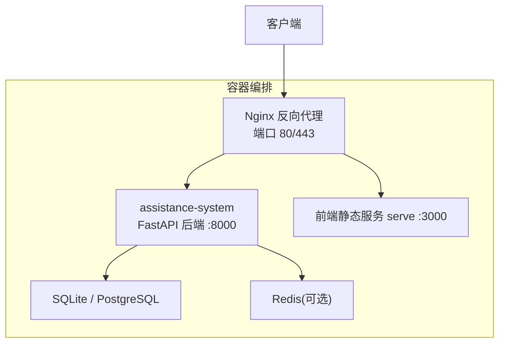
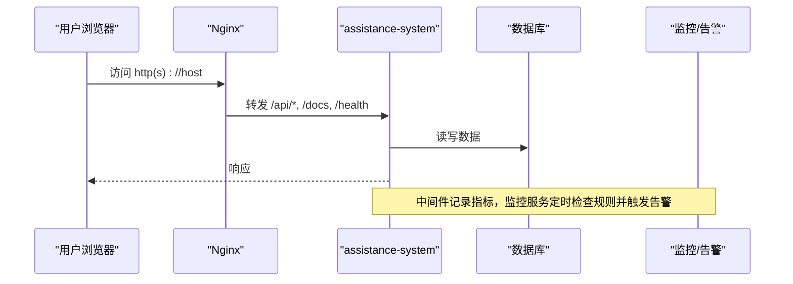
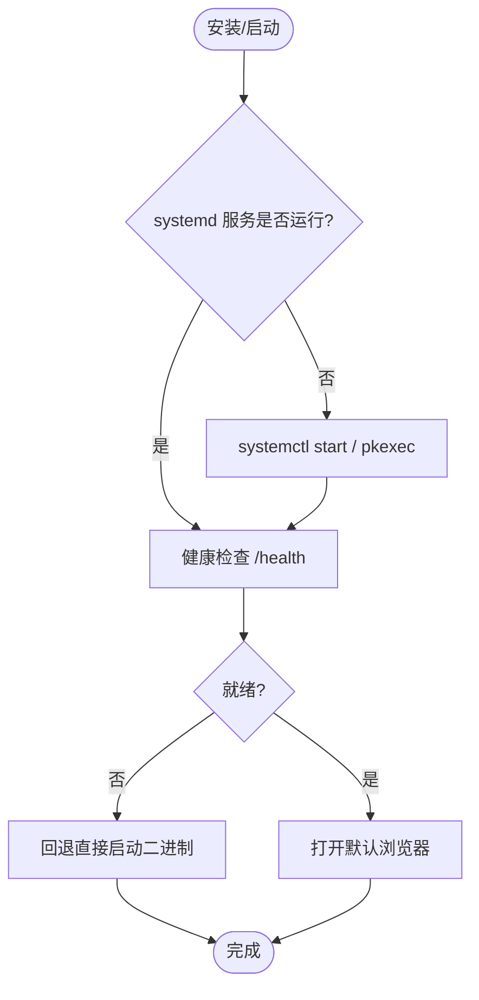
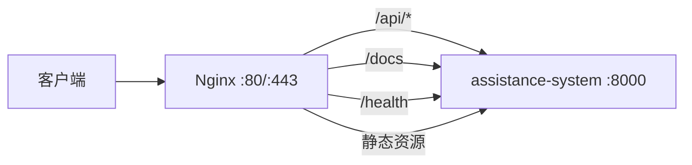
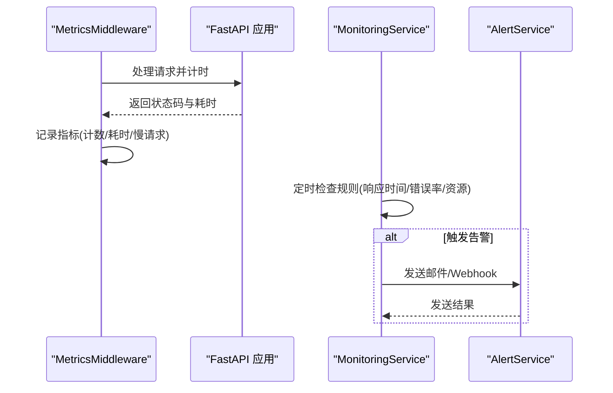
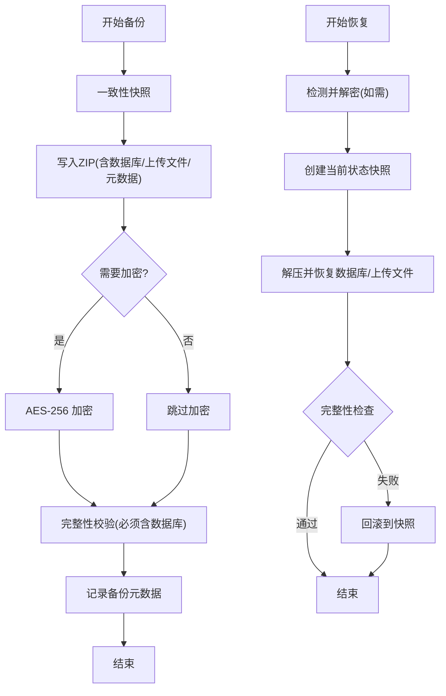
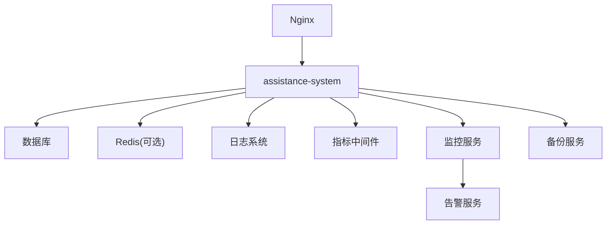

# 部署运维

<cite>
**本文引用的文件**
- [docker/Dockerfile](file://docker/Dockerfile)
- [docker/Dockerfile.kylin-amd64](file://docker/Dockerfile.kylin-amd64)
- [docker-compose.yml](file://docker-compose.yml)
- [nginx/conf.d/assistance.conf](file://nginx/conf.d/assistance.conf)
- [deploy/kylin/config/kylin.env](file://deploy/kylin/config/kylin.env)
- [deploy/kylin/systemd/assistance-management-system.service](file://deploy/kylin/systemd/assistance-management-system.service)
- [deploy/kylin/scripts/start-kylin.sh](file://deploy/kylin/scripts/start-kylin.sh)
- [backend/app/core/config.py](file://backend/app/core/config.py)
- [backend/app/core/logging_config.py](file://backend/app/core/logging_config.py)
- [backend/app/middleware/metrics_middleware.py](file://backend/app/middleware/metrics_middleware.py)
- [backend/app/services/monitoring_service.py](file://backend/app/services/monitoring_service.py)
- [backend/app/services/alert_service.py](file://backend/app/services/alert_service.py)
- [backend/app/services/backup_service.py](file://backend/app/services/backup_service.py)
</cite>

## 目录
1. [简介](#简介)
2. [项目结构](#项目结构)
3. [核心组件](#核心组件)
4. [架构总览](#架构总览)
5. [详细组件分析](#详细组件分析)
6. [依赖关系分析](#依赖关系分析)
7. [性能与容量规划](#性能与容量规划)
8. [故障排查指南](#故障排查指南)
9. [结论](#结论)
10. [附录：生产配置与安全加固清单](#附录生产配置与安全加固清单)

## 简介
本指南面向生产环境的系统部署与运维，覆盖 Docker 容器化、麒麟 V10 适配、Nginx 反向代理、日志管理、备份恢复、监控告警、升级维护、容量规划与安全加固等主题。文档基于仓库中实际的构建脚本、服务编排、系统服务与后端服务实现进行说明，确保可落地、可复现。

## 项目结构
- 容器化与编排
  - 通用运行时镜像与启动脚本：[docker/Dockerfile](file://docker/Dockerfile)
  - 麒麟 V10 专用打包（DEB）与 GLIBC 兼容性校验：[docker/Dockerfile.kylin-amd64](file://docker/Dockerfile.kylin-amd64)
  - Compose 编排（应用、Postgres、Redis、Nginx）：[docker-compose.yml](file://docker-compose.yml)
- 反向代理
  - Nginx 站点配置（静态资源缓存、API 转发、健康检查）：[nginx/conf.d/assistance.conf](file://nginx/conf.d/assistance.conf)
- 麒麟桌面版运行环境
  - systemd 服务单元与环境变量：[deploy/kylin/systemd/assistance-management-system.service](file://deploy/kylin/systemd/assistance-management-system.service)、[deploy/kylin/config/kylin.env](file://deploy/kylin/config/kylin.env)
  - 桌面启动入口与健康探测、浏览器打开：[deploy/kylin/scripts/start-kylin.sh](file://deploy/kylin/scripts/start-kylin.sh)
- 后端配置与运行时
  - 应用配置（端口、CORS、CSRF、加密、路径解析等）：[backend/app/core/config.py](file://backend/app/core/config.py)
  - 日志框架（JSON/文本、轮转、敏感信息脱敏）：[backend/app/core/logging_config.py](file://backend/app/core/logging_config.py)
  - 指标采集中间件（请求计数、耗时、慢请求）：[backend/app/middleware/metrics_middleware.py](file://backend/app/middleware/metrics_middleware.py)
  - 监控与告警（规则检查、邮件/Webhook）：[backend/app/services/monitoring_service.py](file://backend/app/services/monitoring_service.py)、[backend/app/services/alert_service.py](file://backend/app/services/alert_service.py)
  - 备份与恢复（一致性快照、压缩、加密、清理策略）：[backend/app/services/backup_service.py](file://backend/app/services/backup_service.py)

**图表来源**
- [docker-compose.yml:15-181](file://docker-compose.yml#L15-L181)
- [nginx/conf.d/assistance.conf:1-49](file://nginx/conf.d/assistance.conf#L1-L49)

**章节来源**
- [docker/Dockerfile:6-173](file://docker/Dockerfile#L6-L173)
- [docker/Dockerfile.kylin-amd64:14-234](file://docker/Dockerfile.kylin-amd64#L14-L234)
- [docker-compose.yml:1-214](file://docker-compose.yml#L1-L214)
- [nginx/conf.d/assistance.conf:1-49](file://nginx/conf.d/assistance.conf#L1-L49)
- [deploy/kylin/config/kylin.env:1-49](file://deploy/kylin/config/kylin.env#L1-L49)
- [deploy/kylin/systemd/assistance-management-system.service:1-51](file://deploy/kylin/systemd/assistance-management-system.service#L1-L51)
- [deploy/kylin/scripts/start-kylin.sh:1-167](file://deploy/kylin/scripts/start-kylin.sh#L1-L167)

## 核心组件
- 容器镜像与启动
  - 多阶段构建：前端 Node 构建、后端 PyInstaller 打包、最终运行时镜像；非 root 用户运行；暴露 8000/3000 端口并统一启动脚本。
- 麒麟 V10 适配
  - 使用 buster 基础镜像保证 GLIBC 兼容；构建时校验 GLIBC 版本；输出 DEB 包并集成 systemd、polkit、桌面快捷方式。
- 反向代理
  - Nginx 将 /api、/docs、/health 转发至后端，静态资源开启长期缓存。
- 配置中心
  - Settings 集中管理环境变量、路径解析、安全开关（CORS/CSRF）、数据库连接池、日志与监控开关。
- 日志体系
  - JSON/文本双格式、按大小或时间轮转、Windows 安全重试、敏感信息脱敏。
- 监控与告警
  - ASGI 中间件采集请求指标；监控服务聚合 API 性能、错误率、资源使用；支持邮件与 Webhook 通知。
- 备份与恢复
  - SQLite 一致性快照、ZIP 压缩、AES-256(Fernet) 加密、完整性校验、保留策略与自动调度。

**章节来源**
- [docker/Dockerfile:6-173](file://docker/Dockerfile#L6-L173)
- [docker/Dockerfile.kylin-amd64:36-134](file://docker/Dockerfile.kylin-amd64#L36-L134)
- [nginx/conf.d/assistance.conf:1-49](file://nginx/conf.d/assistance.conf#L1-L49)
- [backend/app/core/config.py:54-206](file://backend/app/core/config.py#L54-L206)
- [backend/app/core/logging_config.py:161-274](file://backend/app/core/logging_config.py#L161-L274)
- [backend/app/middleware/metrics_middleware.py:1-177](file://backend/app/middleware/metrics_middleware.py#L1-L177)
- [backend/app/services/monitoring_service.py:1-312](file://backend/app/services/monitoring_service.py#L1-L312)
- [backend/app/services/backup_service.py:231-395](file://backend/app/services/backup_service.py#L231-L395)

## 架构总览

**图表来源**
- [nginx/conf.d/assistance.conf:6-47](file://nginx/conf.d/assistance.conf#L6-L47)
- [docker-compose.yml:15-181](file://docker-compose.yml#L15-L181)
- [backend/app/middleware/metrics_middleware.py:132-177](file://backend/app/middleware/metrics_middleware.py#L132-L177)
- [backend/app/services/monitoring_service.py:183-312](file://backend/app/services/monitoring_service.py#L183-L312)

## 详细组件分析

### 容器化与麒麟 V10 适配
- 通用镜像
  - 前端构建产物由 Node 阶段生成，后端通过 PyInstaller 打包为单文件二进制；运行时以非 root 用户执行，暴露 8000/3000。
- 麒麟 V10 专用
  - 构建阶段使用 buster 镜像以满足 GLIBC 要求，并在构建后对 libpython 的 GLIBC 依赖进行校验；最终输出 DEB 包，包含 systemd 服务、polkit 规则与桌面快捷方式。
- 启动流程
  - systemd 加载 kylin.env 环境变量，启动后端二进制；桌面入口脚本负责健康检查与浏览器打开，失败时回退直接启动二进制。

**图表来源**
- [deploy/kylin/scripts/start-kylin.sh:78-167](file://deploy/kylin/scripts/start-kylin.sh#L78-L167)
- [deploy/kylin/systemd/assistance-management-system.service:7-47](file://deploy/kylin/systemd/assistance-management-system.service#L7-L47)
- [deploy/kylin/config/kylin.env:6-49](file://deploy/kylin/config/kylin.env#L6-L49)
- [docker/Dockerfile.kylin-amd64:67-134](file://docker/Dockerfile.kylin-amd64#L67-L134)

**章节来源**
- [docker/Dockerfile:6-173](file://docker/Dockerfile#L6-L173)
- [docker/Dockerfile.kylin-amd64:14-234](file://docker/Dockerfile.kylin-amd64#L14-L234)
- [deploy/kylin/systemd/assistance-management-system.service:1-51](file://deploy/kylin/systemd/assistance-management-system.service#L1-L51)
- [deploy/kylin/config/kylin.env:1-49](file://deploy/kylin/config/kylin.env#L1-L49)
- [deploy/kylin/scripts/start-kylin.sh:1-167](file://deploy/kylin/scripts/start-kylin.sh#L1-L167)

### Nginx 反向代理
- 路由策略
  - / 与 /api/ 均转发至后端；/docs 提供接口文档；/health 健康检查；静态资源设置长期缓存。
- 生产建议
  - 结合 docker-compose 的 nginx profile 启用；挂载 SSL 证书目录；将日志输出到宿主机便于收集。

**图表来源**
- [nginx/conf.d/assistance.conf:1-49](file://nginx/conf.d/assistance.conf#L1-L49)
- [docker-compose.yml:157-181](file://docker-compose.yml#L157-L181)

**章节来源**
- [nginx/conf.d/assistance.conf:1-49](file://nginx/conf.d/assistance.conf#L1-L49)
- [docker-compose.yml:157-181](file://docker-compose.yml#L157-L181)

### 配置管理与安全基线
- 关键配置项
  - 监听地址与端口、CORS 源、CSRF 开关、Token 有效期、数据库 URL、上传/导出/缓存/备份目录、日志级别与轮转策略、监控与告警开关。
- 安全要点
  - 生产环境强制关闭 SQL echo；字段加密密钥自动生成或从运行时密钥存储加载；仅允许本机回环 CORS；单机离线模式可关闭 CSRF 但需评估风险。

**章节来源**
- [backend/app/core/config.py:54-206](file://backend/app/core/config.py#L54-L206)
- [backend/app/core/config.py:296-364](file://backend/app/core/config.py#L296-L364)

### 日志管理
- 特性
  - JSON/文本格式；按大小或时间轮转；Windows 下安全重试避免句柄占用；所有 handler 注册敏感信息脱敏过滤器（身份证、手机号、邮箱、口令/令牌）。
- 运维建议
  - 生产建议使用 JSON 格式并配合日志采集器；合理设置轮转策略与保留数量；关注磁盘空间与权限。

**章节来源**
- [backend/app/core/logging_config.py:75-119](file://backend/app/core/logging_config.py#L75-L119)
- [backend/app/core/logging_config.py:161-274](file://backend/app/core/logging_config.py#L161-L274)

### 监控与告警
- 指标采集
  - ASGI 中间件统计请求数、错误数、活跃请求、平均耗时、慢请求列表；跳过 /health、/metrics 等内部路径。
- 监控服务
  - 聚合 API 性能（P50/P95/P99）、错误率、端点排行；读取系统资源（CPU/内存/磁盘）；根据规则触发告警。
- 告警渠道
  - 邮件（SMTP）与 Webhook（通用/钉钉/企业微信）；发送失败不影响主流程。

**图表来源**
- [backend/app/middleware/metrics_middleware.py:132-177](file://backend/app/middleware/metrics_middleware.py#L132-L177)
- [backend/app/services/monitoring_service.py:183-312](file://backend/app/services/monitoring_service.py#L183-L312)
- [backend/app/services/alert_service.py:20-111](file://backend/app/services/alert_service.py#L20-L111)

**章节来源**
- [backend/app/middleware/metrics_middleware.py:1-177](file://backend/app/middleware/metrics_middleware.py#L1-L177)
- [backend/app/services/monitoring_service.py:1-312](file://backend/app/services/monitoring_service.py#L1-L312)
- [backend/app/services/alert_service.py:1-111](file://backend/app/services/alert_service.py#L1-L111)

### 备份与恢复
- 备份流程
  - 一致性快照（SQLite Backup API，失败回退 WAL checkpoint + 裸拷贝）→ ZIP 压缩 → 可选 AES-256(Fernet) 加密 → 完整性校验（必须包含数据库）→ 记录元数据。
- 恢复流程
  - 检测加密并解密到临时文件 → 创建当前状态快照 → 解压并恢复数据库与上传文件 → 恢复后执行完整性检查 → 失败则回滚到快照。
- 清理策略
  - 按保留数量或天数清理旧备份；最小剩余空间阈值预检，避免写出损坏文件。

**图表来源**
- [backend/app/services/backup_service.py:231-395](file://backend/app/services/backup_service.py#L231-L395)
- [backend/app/services/backup_service.py:420-600](file://backend/app/services/backup_service.py#L420-L600)
- [backend/app/services/backup_service.py:676-736](file://backend/app/services/backup_service.py#L676-L736)

**章节来源**
- [backend/app/services/backup_service.py:231-395](file://backend/app/services/backup_service.py#L231-L395)
- [backend/app/services/backup_service.py:420-600](file://backend/app/services/backup_service.py#L420-L600)
- [backend/app/services/backup_service.py:676-736](file://backend/app/services/backup_service.py#L676-L736)

### 系统升级与维护
- 升级前准备
  - 建议先执行完整备份；确认目标版本与迁移脚本兼容；在低峰期执行。
- 升级流程
  - 停止服务 → 替换镜像/二进制 → 执行数据库迁移 → 验证健康检查与核心功能 → 回滚预案（使用最近备份）。
- 回滚策略
  - 若迁移失败或业务异常，立即恢复到最近一次备份；必要时回退镜像版本。

**章节来源**
- [backend/app/services/backup_service.py:231-395](file://backend/app/services/backup_service.py#L231-L395)
- [backend/app/services/backup_service.py:420-600](file://backend/app/services/backup_service.py#L420-L600)

## 依赖关系分析
- 容器编排依赖
  - assistance-system 依赖数据库（SQLite/PostgreSQL）与可选 Redis；Nginx 依赖 assistance-system 网络可达。
- 服务间耦合
  - 监控与告警依赖配置与数据库；备份服务依赖数据库与文件系统；日志与指标中间件无外部依赖。

**图表来源**
- [docker-compose.yml:15-181](file://docker-compose.yml#L15-L181)
- [backend/app/middleware/metrics_middleware.py:132-177](file://backend/app/middleware/metrics_middleware.py#L132-L177)
- [backend/app/services/monitoring_service.py:183-312](file://backend/app/services/monitoring_service.py#L183-L312)
- [backend/app/services/backup_service.py:231-395](file://backend/app/services/backup_service.py#L231-L395)

**章节来源**
- [docker-compose.yml:1-214](file://docker-compose.yml#L1-L214)
- [backend/app/middleware/metrics_middleware.py:1-177](file://backend/app/middleware/metrics_middleware.py#L1-L177)
- [backend/app/services/monitoring_service.py:1-312](file://backend/app/services/monitoring_service.py#L1-L312)
- [backend/app/services/backup_service.py:1-800](file://backend/app/services/backup_service.py#L1-L800)

## 性能与容量规划
- 资源限制
  - Compose 中为各服务设置 CPU/内存上限与预留；Nginx 轻量级，建议 0.5 CPU/256MB。
- 数据库
  - SQLite 适合单机；高并发场景建议切换 PostgreSQL 并配置连接池与索引；定期备份与完整性检查。
- 缓存
  - 启用本地缓存或 Redis 降低热点查询压力；合理设置 TTL 与最大条目数。
- 日志与备份
  - 日志按大小/时间轮转，控制保留数量；备份保留策略按业务需求设定；注意磁盘容量与 I/O。
- 监控阈值
  - 依据中间件与监控服务指标设定告警阈值（响应时间、错误率、CPU/内存/磁盘），避免误报与漏报。

[本节为通用指导，不直接分析具体文件]

## 故障排查指南
- 服务无法启动
  - 检查 systemd 服务状态与 journal 日志；确认环境变量与路径权限；查看健康检查端点。
- 数据库问题
  - 检查数据库文件与 WAL/SHM 残留；执行完整性检查；必要时恢复备份。
- 备份失败
  - 检查磁盘空间与路径权限；确认备份包包含数据库；查看加密密码是否正确。
- 告警未送达
  - 校验 SMTP/Webhook 配置；检查网络连通性与超时；查看告警服务日志。
- 性能瓶颈
  - 通过指标中间件定位慢请求；结合监控服务分析端点耗时与错误率；优化查询与索引。

**章节来源**
- [deploy/kylin/scripts/start-kylin.sh:104-167](file://deploy/kylin/scripts/start-kylin.sh#L104-L167)
- [backend/app/services/backup_service.py:231-395](file://backend/app/services/backup_service.py#L231-L395)
- [backend/app/services/monitoring_service.py:183-312](file://backend/app/services/monitoring_service.py#L183-L312)
- [backend/app/core/logging_config.py:161-274](file://backend/app/core/logging_config.py#L161-L274)

## 结论
本指南基于仓库中的实际实现，提供了从容器化、麒麟适配、反向代理到日志、备份、监控告警的全链路运维方案。遵循安全基线与容量规划建议，可有效保障系统在麒麟 V10 与生产环境下的稳定可靠运行。

## 附录：生产配置与安全加固清单
- 环境与配置
  - 设置 SECRET_KEY、数据库 URL、CORS/CSRF、Token 有效期、日志级别与轮转策略。
- 安全加固
  - 生产环境关闭 SQL echo；启用字段加密；限制 CORS 源；仅在可信代理后信任 X-Forwarded-*；最小权限运行（非 root）。
- 备份与恢复
  - 启用自动备份与保留策略；定期演练恢复流程；加密备份文件并妥善保管密钥。
- 监控与告警
  - 配置邮件/Webhook；设定合理阈值；持续观察慢请求与错误率趋势。
- 升级维护
  - 升级前备份；低峰期执行；准备回滚方案；验证健康检查与核心功能。

[本节为通用指导，不直接分析具体文件]