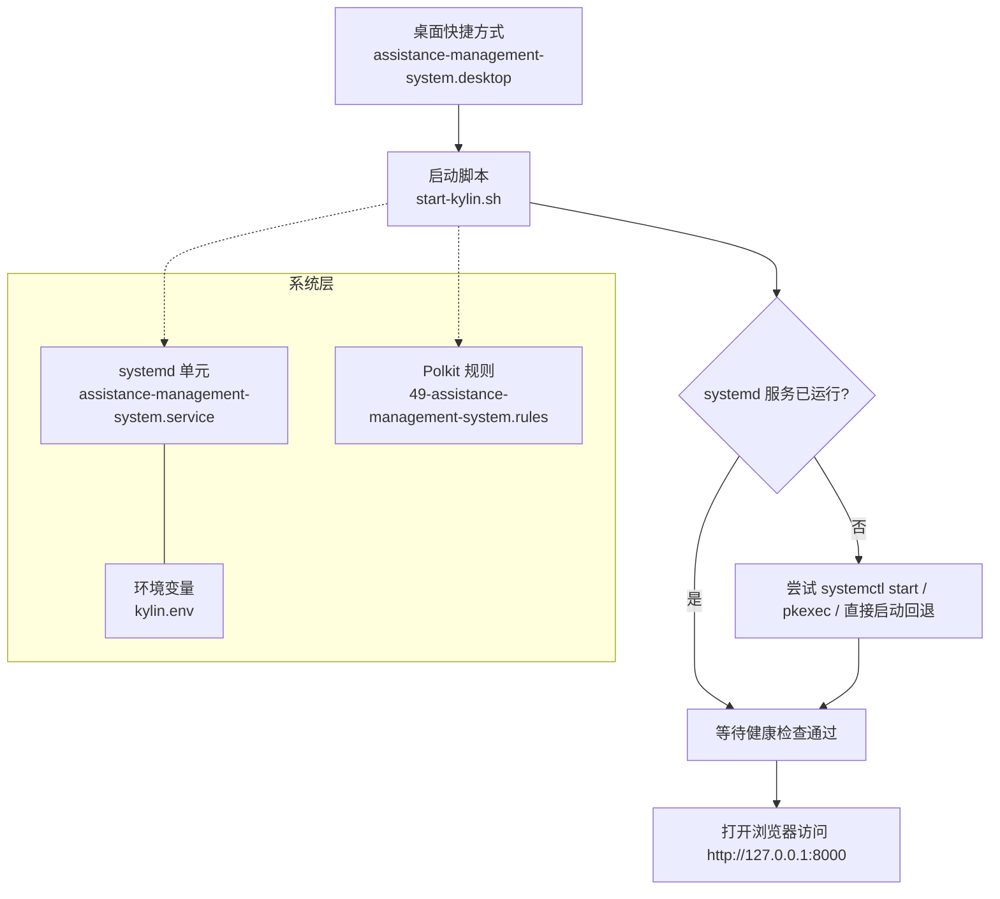
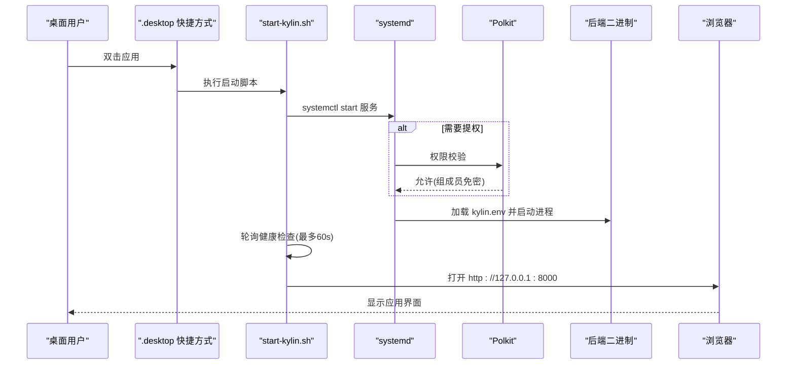

# 麒麟V10系统部署

<cite>
**本文引用的文件**
- [assistance-management-system.service](file://deploy/kylin/systemd/assistance-management-system.service)
- [49-assistance-management-system.rules](file://deploy/kylin/polkit/49-assistance-management-system.rules)
- [assistance-management-system.desktop](file://deploy/kylin/desktop/assistance-management-system.desktop)
- [start-kylin.sh](file://deploy/kylin/scripts/start-kylin.sh)
- [kylin.env](file://deploy/kylin/config/kylin.env)
- [Dockerfile.kylin-standalone](file://docker/Dockerfile.kylin-standalone)
- [Dockerfile.kylin-amd64](file://docker/Dockerfile.kylin-amd64)
- [postrm](file://deploy/kylin/DEBIAN/postrm)
</cite>

## 目录
1. [简介](#简介)
2. [项目结构](#项目结构)
3. [核心组件](#核心组件)
4. [架构总览](#架构总览)
5. [详细组件分析](#详细组件分析)
6. [依赖与权限分析](#依赖与权限分析)
7. [性能与资源限制](#性能与资源限制)
8. [故障排查指南](#故障排查指南)
9. [结论](#结论)
10. [附录：常用命令与路径](#附录常用命令与路径)

## 简介
本指南面向在麒麟V10系统上部署“帮扶管理信息系统”的运维与实施人员，覆盖安装前置条件、systemd服务配置、桌面环境集成、Polkit权限规则、环境变量与启动脚本使用，以及常见问题的定位方法。文档内容严格基于仓库中麒麟专用部署资产（systemd、polkit、desktop、启动脚本与环境变量）和构建脚本中的约束说明。

## 项目结构
麒麟V10相关部署资产集中在 deploy/kylin 目录，并通过 Docker 构建流程打包进 DEB 包，最终由 dpkg 安装到系统中。关键目录与职责如下：
- systemd：定义服务的生命周期、运行用户、日志输出、重启策略与安全沙箱参数
- polkit：允许特定组成员免密管理服务，便于桌面端一键启动/停止
- desktop：提供开始菜单与桌面快捷方式入口
- scripts：桌面入口脚本，负责启动服务、健康检查、打开浏览器
- config：系统级环境变量（数据库、端口、CORS、CSRF、默认管理员等）
- DEBIAN：安装后处理脚本（postinst/prerm/postrm），完成用户/组创建、目录初始化、桌面与图标注册、卸载清理

图表来源
- [assistance-management-system.desktop:1-17](file://deploy/kylin/desktop/assistance-management-system.desktop#L1-L17)
- [start-kylin.sh:1-167](file://deploy/kylin/scripts/start-kylin.sh#L1-L167)
- [assistance-management-system.service:1-51](file://deploy/kylin/systemd/assistance-management-system.service#L1-L51)
- [49-assistance-management-system.rules:1-10](file://deploy/kylin/polkit/49-assistance-management-system.rules#L1-L10)
- [kylin.env:1-49](file://deploy/kylin/config/kylin.env#L1-L49)

章节来源
- [assistance-management-system.service:1-51](file://deploy/kylin/systemd/assistance-management-system.service#L1-L51)
- [49-assistance-management-system.rules:1-10](file://deploy/kylin/polkit/49-assistance-management-system.rules#L1-L10)
- [assistance-management-system.desktop:1-17](file://deploy/kylin/desktop/assistance-management-system.desktop#L1-L17)
- [start-kylin.sh:1-167](file://deploy/kylin/scripts/start-kylin.sh#L1-L167)
- [kylin.env:1-49](file://deploy/kylin/config/kylin.env#L1-L49)

## 核心组件
- systemd 服务单元：以独立系统用户运行后端二进制，启用日志采集、自动重启、安全沙箱与资源限制
- Polkit 规则：允许 assistance-management-system 组成员免密管理服务，提升桌面体验
- 桌面集成：.desktop 文件调用启动脚本，自动打开浏览器；图标安装至系统图标目录
- 启动脚本：封装服务启动、健康检查、浏览器打开与错误提示逻辑，具备多回退机制
- 环境变量：集中管理端口、数据库、静态资源路径、CORS/CSRF、默认管理员等

章节来源
- [assistance-management-system.service:1-51](file://deploy/kylin/systemd/assistance-management-system.service#L1-L51)
- [49-assistance-management-system.rules:1-10](file://deploy/kylin/polkit/49-assistance-management-system.rules#L1-L10)
- [assistance-management-system.desktop:1-17](file://deploy/kylin/desktop/assistance-management-system.desktop#L1-L17)
- [start-kylin.sh:1-167](file://deploy/kylin/scripts/start-kylin.sh#L1-L167)
- [kylin.env:1-49](file://deploy/kylin/config/kylin.env#L1-L49)

## 架构总览
下图展示从桌面点击到后端服务就绪并打开浏览器的完整调用链，以及 systemd、Polkit、环境变量之间的协作关系。

图表来源
- [assistance-management-system.desktop:1-17](file://deploy/kylin/desktop/assistance-management-system.desktop#L1-L17)
- [start-kylin.sh:1-167](file://deploy/kylin/scripts/start-kylin.sh#L1-L167)
- [assistance-management-system.service:1-51](file://deploy/kylin/systemd/assistance-management-system.service#L1-L51)
- [49-assistance-management-system.rules:1-10](file://deploy/kylin/polkit/49-assistance-management-system.rules#L1-L10)
- [kylin.env:1-49](file://deploy/kylin/config/kylin.env#L1-L49)

## 详细组件分析

### systemd 服务配置
- 运行身份：以专用系统用户与组运行，最小权限原则
- 工作目录：指向应用安装目录
- 环境变量：通过 EnvironmentFile 引入 kylin.env
- 启动与重载：指定后端可执行文件路径，支持 HUP 重载
- 可靠性：失败自动重启，设置启动/停止超时与限流
- 日志：统一输出到 journald，并设置 SyslogIdentifier
- 安全加固：禁止新特权、保护系统目录、隔离临时目录、仅开放必要读写路径
- 资源限制：文件描述符与进程数上限
- OOM 保护：调整评分避免被系统误杀
- 开机自启：加入 multi-user.target

章节来源
- [assistance-management-system.service:1-51](file://deploy/kylin/systemd/assistance-management-system.service#L1-L51)

### Polkit 权限规则
- 目标：允许 assistance-management-system 组成员对 systemd 单元进行免密管理操作
- 效果：桌面用户可通过 .desktop 快捷方式或图形化工具启动/停止服务，无需输入密码
- 作用域：仅限指定的 action id，遵循最小授权原则

章节来源
- [49-assistance-management-system.rules:1-10](file://deploy/kylin/polkit/49-assistance-management-system.rules#L1-L10)

### 桌面环境集成
- 快捷方式：.desktop 文件定义名称、描述、执行命令、图标、分类与关键词
- 执行入口：调用 start-kylin.sh，确保服务启动与浏览器打开
- 图标安装：将应用图标复制到系统 pixmaps 与 hicolor 主题目录，供菜单与桌面引用
- 卸载清理：卸载时删除桌面项、图标缓存与用户桌面快捷方式

章节来源
- [assistance-management-system.desktop:1-17](file://deploy/kylin/desktop/assistance-management-system.desktop#L1-L17)
- [postrm:1-75](file://deploy/kylin/DEBIAN/postrm#L1-L75)

### 启动脚本与健康检查
- 启动优先级：优先通过 systemctl 启动；若失败则尝试 pkexec；最后回退为直接运行后端二进制
- 健康检查：循环探测 /health 接口，兼容 curl/wget/内建 /dev/tcp 三种方式
- 降级策略：当系统目录不可写时，自动降级到用户家目录下数据与日志目录，保证桌面直跑可用
- 浏览器打开：按优先级尝试多种浏览器，最终回退 xdg-open；未找到则弹窗提示
- 错误提示：通过 notify-send 或 zenity 推送桌面通知，辅助定位问题

章节来源
- [start-kylin.sh:1-167](file://deploy/kylin/scripts/start-kylin.sh#L1-L167)

### 环境变量与系统配置
- 运行环境：生产模式、监听地址与端口、调试开关
- 数据库：SQLite 路径位于系统数据目录
- 数据与缓存：上传、导出、缓存、备份目录均位于系统数据目录
- 日志：统一日志目录与文件，日志级别可调
- 前端静态资源：指向安装目录下的前端构建产物
- 安全：延长令牌有效期、关闭 CSRF（单机离线场景）、限定 CORS 源
- 默认管理员：首次启动自动生成随机强密码并打印到日志

章节来源
- [kylin.env:1-49](file://deploy/kylin/config/kylin.env#L1-L49)

### 构建与兼容性要点（麒麟V10）
- GLIBC 兼容：后端使用 PyInstaller 在较低 GLIBC 环境下构建，确保二进制在麒麟V10（Server GLIBC 2.28、Desktop GLIBC 2.31）上可运行
- 无外部依赖：DEB 包声明无 Depends，运行时所需库已打包进后端二进制
- 推荐浏览器：firefox-esr | chromium | chromium-browser 作为可选依赖
- 行尾规范化：构建阶段统一剥离 CRLF，避免脚本无法执行导致安装失败

章节来源
- [Dockerfile.kylin-standalone:39-138](file://docker/Dockerfile.kylin-standalone#L39-L138)
- [Dockerfile.kylin-amd64:36-134](file://docker/Dockerfile.kylin-amd64#L36-L134)
- [Dockerfile.kylin-standalone:201-227](file://docker/Dockerfile.kylin-standalone#L201-L227)
- [Dockerfile.kylin-amd64:201-227](file://docker/Dockerfile.kylin-amd64#L201-L227)

## 依赖与权限分析
- 系统用户与组：安装过程会创建 assistance-management-system 用户与组，服务以该身份运行
- 目录权限：
  - 数据目录：/var/lib/assistance-management-system（含 database、uploads、exports、cache、backups）
  - 日志目录：/var/log/assistance-management-system
  - 应用目录：/opt/assistance-management-system
- 网络端口：默认监听 127.0.0.1:8000
- 浏览器：本地浏览器用于访问应用；脚本会按优先级查找可用浏览器
- Polkit：组成员可免密管理服务；如需更细粒度控制，可在 polkit 规则中扩展 action id
- SELinux/AppArmor：如启用，需放行 systemd 服务与后端二进制访问上述目录

章节来源
- [assistance-management-system.service:1-51](file://deploy/kylin/systemd/assistance-management-system.service#L1-L51)
- [kylin.env:1-49](file://deploy/kylin/config/kylin.env#L1-L49)
- [postrm:1-75](file://deploy/kylin/DEBIAN/postrm#L1-L75)

## 性能与资源限制
- 文件描述符与进程数：LimitNOFILE=65536，LimitNPROC=4096，满足高并发场景
- 重启策略：on-failure + RestartSec=5，快速恢复
- 超时控制：启动超时120秒，停止超时15秒，适配首次数据库初始化耗时
- OOM 保护：OOMScoreAdjust=-500，降低被系统回收概率
- 日志：journald 集中采集，便于审计与排障

章节来源
- [assistance-management-system.service:1-51](file://deploy/kylin/systemd/assistance-management-system.service#L1-L51)

## 故障排查指南
- 服务未启动或启动后立即崩溃
  - 查看系统日志：journalctl -u assistance-management-system -n 50 --no-pager
  - 检查健康接口：curl -sf http://127.0.0.1:8000/health
  - 确认端口占用：ss -tlnp | grep 8000
- 桌面快捷方式无效
  - 确认 .desktop 文件存在且 Exec 路径正确
  - 检查 start-kylin.sh 是否可执行
  - 查看桌面通知与终端输出
- 无法通过 Polkit 免密管理服务
  - 确认当前用户属于 assistance-management-system 组
  - 检查 polkit 规则是否生效
- 数据/日志目录不可写
  - 脚本会自动降级到用户家目录；也可修复 /var/lib 与 /var/log 下对应目录的属主与权限
- 浏览器未自动打开
  - 检查系统中是否存在支持的浏览器；必要时手动打开 http://127.0.0.1:8000
- 卸载残留
  - 使用 purge 模式完全清除数据与用户/组；卸载脚本会清理桌面项与图标

章节来源
- [start-kylin.sh:1-167](file://deploy/kylin/scripts/start-kylin.sh#L1-L167)
- [postrm:1-75](file://deploy/kylin/DEBIAN/postrm#L1-L75)

## 结论
本部署方案通过 systemd 统一管理服务生命周期，结合 Polkit 实现桌面友好型权限控制，配合 .desktop 与启动脚本提供开箱即用的桌面体验。环境变量集中管理，便于在不同环境中复用。构建阶段针对麒麟V10的GLIBC版本进行兼容处理，确保二进制稳定运行。整体设计兼顾安全性、可维护性与易用性。

## 附录：常用命令与路径
- 服务管理
  - 启动/停止/重启：systemctl start|stop|restart assistance-management-system
  - 查看状态：systemctl status assistance-management-system
  - 查看日志：journalctl -u assistance-management-system -f
- 环境变量
  - 编辑位置：/opt/assistance-management-system/config/kylin.env
- 数据与日志
  - 数据目录：/var/lib/assistance-management-system
  - 日志目录：/var/log/assistance-management-system
- 桌面与菜单
  - 快捷方式：/usr/share/applications/assistance-management-system.desktop
  - 图标目录：/usr/share/pixmaps 与 /usr/share/icons/hicolor/*/apps
- 卸载
  - 保留数据卸载：dpkg -r assistance-management-system
  - 彻底清除数据：dpkg --purge assistance-management-system

章节来源
- [assistance-management-system.service:1-51](file://deploy/kylin/systemd/assistance-management-system.service#L1-L51)
- [kylin.env:1-49](file://deploy/kylin/config/kylin.env#L1-L49)
- [postrm:1-75](file://deploy/kylin/DEBIAN/postrm#L1-L75)